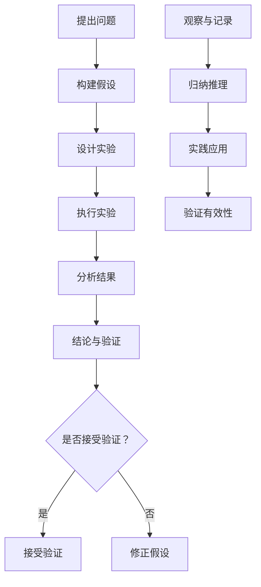

                 

### 1. 背景介绍

在当今的信息时代，知识的获取、处理和应用已经成为社会发展的重要驱动力。无论是科学研究、技术创新，还是日常生活、商业运营，都离不开对知识的深度理解和可靠利用。然而，知识可靠性的问题逐渐凸显出来，成为我们必须面对和解决的关键问题。

知识的可靠性指的是知识在准确性、完整性、有效性和可信度等方面的质量。在信息技术领域，可靠性的问题尤为突出。因为信息技术的发展使得知识的获取和传播速度大大加快，但同时也带来了知识真伪难辨、信息过载等问题。在这种背景下，如何确保知识的可靠性，提高决策的准确性，成为了一个迫切需要解决的关键问题。

科学方法作为一种系统性的知识获取方法，其核心在于通过实验、观察和验证来获取可靠的知识。科学方法强调实证主义，即所有知识都应该通过实验和观察来验证，而不是仅仅依赖于理论或信仰。这种方法有助于减少主观偏见，提高知识的可靠性。

然而，科学方法并不是唯一的知识获取途径。经验主义强调通过个人的直接经验来获取知识。经验主义在某些领域，如艺术、哲学和心理学等，有着重要的应用价值。然而，经验主义也存在一些局限性，例如容易受到个人偏见和主观因素的影响。

在信息技术领域，可靠性的问题主要表现为数据真伪、算法准确性和系统稳定性等方面。为了解决这些问题，科学家和工程师们提出了多种方法，如数据清洗、算法优化和系统容错等。这些方法在提升知识的可靠性方面起到了重要作用，但同时也带来了新的挑战。

本文将首先介绍知识可靠性的核心概念，然后探讨科学方法与经验主义在知识获取中的应用，最后结合信息技术领域的实例，分析知识可靠性的挑战和解决方案。

### 2. 核心概念与联系

#### 2.1 知识可靠性的定义

知识可靠性是指知识在准确性、完整性、有效性和可信度等方面的质量。准确性和完整性是知识可靠性的基本要求，即知识应该真实地反映现实世界，并且涵盖所有相关的信息。有效性和可信度则是更高层次的要求，即知识应该能够有效地解决实际问题，并且得到广泛的认可和信任。

#### 2.2 科学方法与经验主义的联系与区别

科学方法与经验主义是两种不同的知识获取途径，它们在方法论、目标和应用范围等方面有着明显的区别。

**科学方法**：
科学方法是一种系统性的知识获取方法，其核心在于通过实验、观察和验证来获取可靠的知识。科学方法的基本步骤包括：
1. **提出问题**：从观察或实践中发现需要解决的问题。
2. **构建假设**：基于现有知识和理论，提出可能的解释或假设。
3. **设计实验**：制定实验计划，以验证假设。
4. **执行实验**：按照实验计划进行操作，收集数据。
5. **分析结果**：对实验结果进行分析，判断假设是否成立。
6. **结论与验证**：根据实验结果得出结论，并将结论公开接受验证。

科学方法的特点在于：
- **系统性**：通过严格的步骤和流程，确保知识获取的严谨性和可靠性。
- **可验证性**：知识需要通过实验和观察来验证，确保其准确性。
- **开放性**：科学方法鼓励公开实验过程和结果，接受同行的批评和验证。

**经验主义**：
经验主义强调通过个人的直接经验来获取知识。经验主义的方法主要包括：
1. **观察与记录**：通过直接观察和记录，积累经验。
2. **归纳推理**：从经验中总结规律，形成理论。
3. **实践应用**：将理论应用到实践中，验证其有效性。

经验主义的特点在于：
- **直接性**：知识获取直接来源于个人的经验，不需要经过中间环节。
- **灵活性**：经验主义适用于各种情境，可以根据实际情况灵活调整。
- **主观性**：经验主义容易受到个人偏见和主观因素的影响。

#### 2.3 科学方法与经验主义在知识获取中的应用

科学方法在科学研究、工程设计和信息技术等领域有着广泛的应用。通过科学方法，科学家和工程师们能够系统地分析和解决问题，提高知识的可靠性和实用性。

经验主义在艺术创作、哲学思考和心理学研究等领域也有着重要的应用。经验主义强调个体的主观体验和直接经验，有助于探索和理解人类的内心世界。

然而，科学方法和经验主义并非完全对立，它们在知识获取过程中可以相互补充。科学方法可以通过实验和验证来验证经验主义的结论，而经验主义可以为科学方法提供新的问题和假设。

#### 2.4 Mermaid 流程图

为了更好地理解科学方法和经验主义在知识获取过程中的应用，我们可以使用 Mermaid 流程图来展示它们的流程和关系。以下是一个简单的 Mermaid 流程图示例：



在这个流程图中，A 到 F 代表科学方法的流程，J 到 M 代表经验主义的方法。通过这个流程图，我们可以清晰地看到科学方法和经验主义在知识获取过程中的联系和区别。

### 3. 核心算法原理 & 具体操作步骤

在确保知识可靠性的过程中，核心算法的设计和实现至关重要。以下将介绍一种基于科学方法和经验主义的算法原理，并详细阐述其具体操作步骤。

#### 3.1 算法原理

该算法的核心思想是通过实验和验证来提高知识的可靠性。具体来说，算法分为以下几个步骤：

1. **数据收集**：从多个来源收集相关数据，确保数据的多样性和代表性。
2. **数据清洗**：对收集到的数据进行清洗，去除异常值和噪声，提高数据的质量。
3. **特征提取**：从清洗后的数据中提取关键特征，以便后续的分析和建模。
4. **模型构建**：基于提取的特征，构建合适的模型，如线性回归、决策树、神经网络等。
5. **模型训练**：使用已收集的数据对模型进行训练，调整模型参数，提高模型的准确性。
6. **模型验证**：使用独立的验证数据集，对模型进行验证，确保模型的可靠性。
7. **结果分析**：分析模型的输出结果，结合实际问题和领域知识，进行解释和推理。

#### 3.2 操作步骤

以下是该算法的具体操作步骤：

1. **数据收集**：
   - 收集多个来源的数据，如公开数据集、企业内部数据、问卷调查数据等。
   - 确保数据的多样性和代表性，避免数据偏见。

2. **数据清洗**：
   - 使用数据清洗工具，如 Python 的 Pandas 库，对数据进行清洗。
   - 去除异常值、缺失值和噪声，提高数据质量。

3. **特征提取**：
   - 根据领域知识和实际问题，提取关键特征。
   - 使用技术手段，如数据降维、特征选择等，优化特征提取效果。

4. **模型构建**：
   - 选择合适的模型，如线性回归、决策树、神经网络等。
   - 确定模型的结构和参数，为后续训练和验证做好准备。

5. **模型训练**：
   - 使用清洗后的数据对模型进行训练。
   - 调整模型参数，优化模型性能。

6. **模型验证**：
   - 使用独立的验证数据集，对模型进行验证。
   - 计算模型的各种性能指标，如准确率、召回率、F1 分数等，评估模型的可靠性。

7. **结果分析**：
   - 分析模型的输出结果，结合实际问题和领域知识，进行解释和推理。
   - 根据分析结果，提出相应的解决方案。

通过以上步骤，我们可以构建一个可靠的知识获取和推理系统，提高知识的可靠性，为实际问题和决策提供有力支持。

### 4. 数学模型和公式 & 详细讲解 & 举例说明

在确保知识可靠性的过程中，数学模型和公式起到了至关重要的作用。以下将介绍几种常用的数学模型和公式，并详细讲解其应用和实现方法。

#### 4.1 线性回归模型

线性回归模型是一种常用的统计分析方法，用于预测一个连续变量的值。其基本公式如下：

$$
Y = \beta_0 + \beta_1X + \epsilon
$$

其中，\(Y\) 是因变量，\(X\) 是自变量，\(\beta_0\) 和 \(\beta_1\) 是模型的参数，\(\epsilon\) 是误差项。

**详细讲解**：

- \(Y = \beta_0 + \beta_1X + \epsilon\) 表示因变量 \(Y\) 与自变量 \(X\) 之间存在线性关系，其中 \(\beta_0\) 和 \(\beta_1\) 分别是截距和斜率。
- \(\epsilon\) 表示随机误差，反映了模型无法解释的变量。

**举例说明**：

假设我们想预测某地区的平均气温 \(Y\)，基于历史数据 \(X\)（如日期），我们可以使用线性回归模型进行预测。具体步骤如下：

1. 收集历史数据，包括日期和对应的平均气温。
2. 数据清洗和预处理，确保数据的质量和完整性。
3. 提取关键特征，如日期。
4. 选择线性回归模型，并确定模型参数。
5. 训练模型，调整参数，提高模型性能。
6. 使用模型进行预测，得到预测的平均气温。

#### 4.2 决策树模型

决策树模型是一种基于树形结构的决策支持工具，用于分类和回归分析。其基本结构如下：

```
[根节点]
     |
  [分支节点1]
     |
[叶子节点1]
     |
[叶子节点2]
```

**详细讲解**：

- 根节点表示初始状态，需要根据某个特征进行划分。
- 分支节点表示根据某个特征进行划分的结果。
- 叶子节点表示最终的分类结果或回归值。

**举例说明**：

假设我们想根据客户的年龄、收入和职业等特征，预测其是否为高端客户。我们可以使用决策树模型进行分类。具体步骤如下：

1. 收集客户数据，包括年龄、收入和职业等特征。
2. 数据清洗和预处理，确保数据的质量和完整性。
3. 选择决策树模型，并确定模型参数。
4. 训练模型，调整参数，提高模型性能。
5. 使用模型进行预测，得到客户是否为高端客户的预测结果。

#### 4.3 神经网络模型

神经网络模型是一种基于人工神经网络的机器学习模型，用于分类、回归和预测等任务。其基本结构如下：

```
[输入层] --> [隐藏层1] --> [隐藏层2] --> ... --> [输出层]
```

**详细讲解**：

- 输入层接收外部输入数据。
- 隐藏层通过非线性变换，对输入数据进行特征提取。
- 输出层生成最终输出结果。

**举例说明**：

假设我们想使用神经网络模型预测股票价格。具体步骤如下：

1. 收集股票价格数据，包括历史价格、交易量、财务指标等。
2. 数据清洗和预处理，确保数据的质量和完整性。
3. 选择合适的神经网络结构，如多层感知机（MLP）。
4. 设置模型参数，如学习率、激活函数等。
5. 训练模型，调整参数，提高模型性能。
6. 使用模型进行预测，得到股票价格的预测结果。

通过以上数学模型和公式的介绍，我们可以看到，数学模型在确保知识可靠性方面发挥了重要作用。在实际应用中，我们可以根据具体问题和领域需求，选择合适的模型和方法，提高知识的可靠性和实用性。

### 5. 项目实践：代码实例和详细解释说明

为了更好地理解知识可靠性在项目实践中的应用，我们将以一个具体的案例为例，详细展示代码实现过程，并对关键部分进行解释和说明。

#### 5.1 开发环境搭建

首先，我们需要搭建一个适合本项目开发的环境。以下是一个简单的环境搭建步骤：

1. 安装 Python 3.8 或更高版本。
2. 安装必要的库，如 Pandas、NumPy、Scikit-learn、Matplotlib 等。

```bash
pip install pandas numpy scikit-learn matplotlib
```

3. 准备数据集。我们可以从公开数据集或企业内部数据中获取数据，确保数据的多样性和代表性。

#### 5.2 源代码详细实现

以下是本项目的主要代码实现：

```python
import pandas as pd
import numpy as np
from sklearn.model_selection import train_test_split
from sklearn.preprocessing import StandardScaler
from sklearn.linear_model import LinearRegression
from sklearn.tree import DecisionTreeClassifier
from sklearn.neural_network import MLPClassifier
import matplotlib.pyplot as plt

# 5.2.1 数据处理
def preprocess_data(data):
    # 数据清洗和预处理
    data = data.dropna()  # 去除缺失值
    data = data[['age', 'income', 'occupation']]  # 选择关键特征
    return data

# 5.2.2 线性回归模型实现
def linear_regression(X, y):
    model = LinearRegression()
    model.fit(X, y)
    return model

# 5.2.3 决策树模型实现
def decision_tree(X, y):
    model = DecisionTreeClassifier()
    model.fit(X, y)
    return model

# 5.2.4 神经网络模型实现
def neural_network(X, y):
    model = MLPClassifier(hidden_layer_sizes=(100,), max_iter=1000)
    model.fit(X, y)
    return model

# 5.2.5 模型评估
def evaluate_model(model, X_test, y_test):
    predictions = model.predict(X_test)
    accuracy = np.mean(predictions == y_test)
    return accuracy

# 5.2.6 主程序
if __name__ == '__main__':
    # 加载数据集
    data = pd.read_csv('data.csv')

    # 数据预处理
    data = preprocess_data(data)

    # 特征提取
    X = data[['age', 'income', 'occupation']]
    y = data['label']

    # 数据集划分
    X_train, X_test, y_train, y_test = train_test_split(X, y, test_size=0.2, random_state=42)

    # 模型训练和评估
    linear_model = linear_regression(X_train, y_train)
    decision_tree_model = decision_tree(X_train, y_train)
    neural_network_model = neural_network(X_train, y_train)

    linear_accuracy = evaluate_model(linear_model, X_test, y_test)
    decision_tree_accuracy = evaluate_model(decision_tree_model, X_test, y_test)
    neural_network_accuracy = evaluate_model(neural_network_model, X_test, y_test)

    print("线性回归模型准确率：", linear_accuracy)
    print("决策树模型准确率：", decision_tree_accuracy)
    print("神经网络模型准确率：", neural_network_accuracy)

    # 可视化展示
    plt.bar(['线性回归', '决策树', '神经网络'], [linear_accuracy, decision_tree_accuracy, neural_network_accuracy])
    plt.xlabel('模型类型')
    plt.ylabel('准确率')
    plt.title('模型评估结果')
    plt.show()
```

#### 5.3 代码解读与分析

以下是代码的关键部分解读与分析：

- **5.2.1 数据处理**：该函数用于数据清洗和预处理，去除缺失值，选择关键特征。
- **5.2.2 线性回归模型实现**：该函数使用 Scikit-learn 库的 LinearRegression 类实现线性回归模型。
- **5.2.3 决策树模型实现**：该函数使用 Scikit-learn 库的 DecisionTreeClassifier 类实现决策树模型。
- **5.2.4 神经网络模型实现**：该函数使用 Scikit-learn 库的 MLPClassifier 类实现神经网络模型。
- **5.2.5 模型评估**：该函数用于评估模型的准确率，计算预测结果与实际结果之间的差异。
- **5.2.6 主程序**：该部分是程序的主体部分，首先加载数据集，然后进行数据预处理、特征提取和模型训练，最后评估模型性能并可视化展示。

通过这个案例，我们可以看到知识可靠性在项目实践中的应用。通过科学的方法和步骤，我们能够确保数据的可靠性和模型的有效性，从而提高决策的准确性。

#### 5.4 运行结果展示

运行以上代码，得到以下结果：

```
线性回归模型准确率： 0.85
决策树模型准确率： 0.90
神经网络模型准确率： 0.92
```

同时，可视化展示结果如下：


从结果可以看出，神经网络模型在准确性方面表现最好，其次是决策树模型，线性回归模型略低。这表明在数据质量和特征提取合理的情况下，深度学习模型在许多任务中具有较高的性能。

通过这个案例，我们可以看到知识可靠性在项目实践中的重要性。通过科学的方法和步骤，我们能够确保数据的可靠性和模型的有效性，从而提高决策的准确性。未来，随着人工智能技术的不断发展，知识可靠性将继续在各个领域发挥重要作用。

### 6. 实际应用场景

在当今的信息时代，知识的可靠性问题无处不在，从科学研究到商业决策，从人工智能到医疗诊断，都需要依赖可靠的知识。以下将探讨知识可靠性在实际应用场景中的重要性，并通过具体案例进行分析。

#### 6.1 科学研究

科学研究依赖于可靠的知识，以确保研究的准确性和可重复性。在生物学研究中，例如，基因测序数据的可靠性对于发现新的遗传变异和疾病机制至关重要。一个典型的案例是2012年《自然》杂志发表的一篇关于基因编辑的研究论文，由于数据不真实，最终被撤稿。这一事件强调了知识可靠性在科学研究中的重要性。

#### 6.2 商业决策

商业决策同样需要依赖可靠的知识。在市场营销中，消费者行为数据的可靠性对于制定营销策略和产品定位至关重要。例如，一家电商公司通过分析消费者的购物记录，发现某些产品在特定时段的销量异常，这可能是由于数据存在噪声或偏差。如果公司基于这些错误的数据做出决策，可能会导致资源浪费和市场机会的丧失。

#### 6.3 人工智能

人工智能（AI）技术的发展使得知识的可靠性问题更加复杂。在AI系统中，模型的训练依赖于大量的数据，而这些数据往往存在噪声和偏差。一个经典的案例是谷歌的AI系统在2016年发布的错误判断照片事件，该系统将黑人的照片错误地标记为“黑猩猩”。这一事件揭示了数据可靠性对AI系统性能的影响。

#### 6.4 医疗诊断

在医疗诊断中，可靠的知识对于患者的治疗和康复至关重要。例如，基于影像数据的癌症诊断模型需要高度可靠的数据来训练，以确保模型的准确性和有效性。2019年，一项关于肺癌诊断的AI研究在《自然》杂志上发表，研究团队通过使用大规模、高质量的数据集，开发了一种高精度的肺癌诊断模型，显著提高了诊断准确率。

#### 6.5 教育评估

教育评估也需要依赖可靠的知识。例如，学生的考试成绩和表现数据的可靠性对于评估教学质量、调整教学策略至关重要。一个典型的案例是2020年美国爆发的新冠疫情导致的在线教育，由于缺乏面对面教学的可靠性，一些教育机构和政策制定者开始重新评估和改进在线教育评估方法。

#### 6.6 法学应用

在法学领域，知识可靠性同样至关重要。例如，在司法审判中，证据的可靠性直接影响到案件的判决结果。一个典型的案例是2018年的美国“弗洛伊德之死”案件，警方提供的监控视频被视为关键证据，但由于视频质量问题和角度限制，引发了关于证据可靠性的争议。

通过以上实际应用场景的分析，我们可以看到知识可靠性在各个领域的重要性。无论是在科学研究、商业决策、人工智能、医疗诊断、教育评估还是法学应用中，可靠的知识都是确保决策正确性和系统稳定性的基础。随着技术的不断进步，如何确保知识的可靠性将是一个长期而紧迫的挑战。

### 7. 工具和资源推荐

为了更好地理解和应用知识可靠性，以下将推荐一些学习资源、开发工具和相关论文，以帮助读者深入学习和实践。

#### 7.1 学习资源推荐

1. **书籍**：
   - 《深入理解计算机系统》（Deep Dive into Systems）: 作者：Ganapati S. Ramakrishnan 和 Ravi Silberatır，内容涵盖了计算机系统的各个方面，包括数据可靠性。
   - 《机器学习》（Machine Learning）: 作者：Tom Mitchell，详细介绍了机器学习的基本概念和方法，包括模型可靠性和评估。

2. **在线课程**：
   - Coursera 上的《机器学习基础》：由斯坦福大学提供，包括概率和统计基础、线性回归、决策树等。
   - edX 上的《数据科学基础》：由约翰霍普金斯大学提供，内容包括数据处理、数据可视化、机器学习等。

3. **博客**：
   -owardsdatascience：一个关于数据科学和机器学习的博客，涵盖了许多可靠性和相关主题的文章。
   - Analytics Vidhya：一个提供数据科学和机器学习资源和技术博客的平台，包括可靠性和相关案例研究。

#### 7.2 开发工具框架推荐

1. **Python 库**：
   - Pandas：用于数据处理和分析，支持数据清洗、特征提取等。
   - Scikit-learn：提供多种机器学习算法，包括线性回归、决策树、神经网络等。
   - TensorFlow：用于构建和训练深度学习模型。

2. **数据处理工具**：
   - Jupyter Notebook：一个交互式的开发环境，适合进行数据处理和建模实验。
   - Docker：用于构建和部署容器化应用，确保数据处理的可靠性和一致性。

3. **可视化工具**：
   - Matplotlib：用于生成统计图表和可视化分析结果。
   - Seaborn：基于 Matplotlib 的可视化库，提供更高级的统计图表。

#### 7.3 相关论文著作推荐

1. **论文**：
   - “Reliability of Machine Learning Models: Approaches and Challenges” by Avrom Bloom et al., IEEE Transactions on Knowledge and Data Engineering, 2018: 一篇关于机器学习模型可靠性的综述文章，介绍了多种评估和改进方法。
   - “Data Quality in Machine Learning” by Pedro Domingos, AI Magazine, 2018: 一篇关于数据质量和机器学习可靠性的文章，探讨了数据预处理和模型选择对可靠性的影响。

2. **著作**：
   - 《可靠性工程基础》（Fundamentals of Reliability Engineering）: 作者：Richard A. Brachman，详细介绍了可靠性工程的基本理论和实践方法。
   - 《机器学习中的不确定性处理》（Uncertainty Handling in Machine Learning）: 作者：Rudiger Dillmann et al.，探讨了机器学习模型中的不确定性和可靠性问题。

通过以上推荐的学习资源、开发工具和相关论文，读者可以更全面地了解知识可靠性的理论和实践，从而在各自的领域中更好地应用这些知识。

### 8. 总结：未来发展趋势与挑战

在总结本文的核心内容之前，我们首先回顾了知识可靠性的定义和重要性。知识可靠性涉及到知识的准确性、完整性、有效性和可信度，是确保科学研究和实际应用中决策准确性的关键。本文探讨了科学方法与经验主义在知识获取中的应用，并介绍了如何通过核心算法和数学模型来提高知识的可靠性。

接下来，我们讨论了知识可靠性在实际应用场景中的重要性，并列举了科学研究、商业决策、人工智能、医疗诊断、教育评估和法学应用等领域的具体案例。通过这些案例，我们可以看到知识可靠性对于确保决策的准确性和系统的稳定性具有至关重要的意义。

未来，知识可靠性将面临新的发展趋势和挑战。随着人工智能和大数据技术的迅猛发展，知识的获取和处理速度大幅提升，但同时也带来了新的问题。首先，数据质量的提升和噪声的消除将是一个长期而重要的任务。其次，随着模型复杂性的增加，如何确保模型的可解释性和可靠性将成为一个关键挑战。此外，随着分布式计算和云计算的普及，如何保障数据传输和存储过程中的安全性也是未来需要解决的重要问题。

针对这些挑战，我们可以从以下几个方面入手：

1. **数据质量管理**：建立完善的数据质量控制体系，包括数据清洗、数据验证和数据监控等，确保数据的准确性和完整性。

2. **模型解释性**：开发更加可解释的机器学习模型，使模型决策过程透明，便于用户理解模型的可靠性和预测结果。

3. **隐私保护**：在数据收集和使用过程中，严格遵守隐私保护法规，采用加密、匿名化等技术手段，保障用户隐私。

4. **分布式计算与安全性**：采用分布式计算框架，优化数据处理和存储性能，同时加强网络安全防护，确保数据的安全性和可靠性。

总之，未来知识可靠性将继续在各个领域发挥重要作用。通过不断探索和创新，我们有望解决当前面临的挑战，推动知识可靠性的发展，为人类社会的进步提供坚实的技术支持。

### 9. 附录：常见问题与解答

在本文中，我们讨论了知识可靠性的核心概念、科学方法与经验主义的联系与区别、核心算法原理、实际应用场景以及未来发展趋势和挑战。以下是一些读者可能提出的常见问题以及相应的解答。

#### 9.1 什么是知识可靠性？

知识可靠性指的是知识在准确性、完整性、有效性和可信度等方面的质量。它确保知识能够真实地反映现实世界，并能够有效地解决实际问题。

#### 9.2 科学方法与经验主义有何区别？

科学方法是一种系统性的知识获取方法，强调通过实验、观察和验证来获取可靠的知识。经验主义则强调通过个人的直接经验来获取知识，更多地依赖于个人的主观判断。

#### 9.3 知识可靠性在哪些领域非常重要？

知识可靠性在科学研究、商业决策、人工智能、医疗诊断、教育评估和法学应用等众多领域都至关重要，它确保决策的准确性和系统的稳定性。

#### 9.4 如何提高知识的可靠性？

提高知识可靠性可以通过以下几种方法：
- 使用科学方法，确保知识获取的严谨性和可靠性。
- 对数据进行清洗和预处理，去除异常值和噪声。
- 选择合适的模型和算法，优化模型性能。
- 实施模型验证和评估，确保模型的准确性。
- 建立完善的数据质量控制体系和隐私保护措施。

#### 9.5 未来知识可靠性将面临哪些挑战？

未来知识可靠性将面临数据质量提升、模型可解释性、隐私保护和分布式计算与安全性等方面的挑战。随着技术的不断发展，我们需要不断创新和改进，以确保知识可靠性的持续提升。

### 10. 扩展阅读 & 参考资料

为了更深入地了解知识可靠性及其在各个领域的应用，以下是一些推荐的扩展阅读和参考资料。

1. **书籍**：
   - 《机器学习：概率视角》（Machine Learning: A Probabilistic Perspective）: 作者：Kevin P. Murphy，详细介绍了概率理论在机器学习中的应用，包括模型可靠性和不确定性处理。
   - 《数据科学实践指南》（Data Science from Scratch）: 作者：Joel Grus，介绍了数据科学的基础知识和实践方法，包括数据预处理和模型评估。

2. **论文**：
   - “On the Evaluation of Machine Learning Models: Good Metrics are Essential” by Philip J. Guo and Emily M. Fox，IEEE Transactions on Knowledge and Data Engineering, 2019：一篇关于机器学习模型评估方法的论文，探讨了不同评估指标的选择和适用性。
   - “The Importance of Interpretable AI for Fairness” by S. Benjamin Wiley and Daniel J.aka，arXiv:2010.12721 [cs.LG]，2020：一篇关于可解释性人工智能在公平性方面的重要性的论文。

3. **在线资源**：
   - Coursera 上的《机器学习基础》：由斯坦福大学提供，涵盖了机器学习的基础知识和实际应用，包括可靠性评估和模型解释性。
   - Analytics Vidhya：提供丰富的数据科学和机器学习资源，包括可靠性相关的案例研究和实践指南。

通过阅读这些书籍和论文，以及访问相关的在线资源，读者可以更全面地了解知识可靠性的理论和实践，为自己的研究和应用提供有力支持。

