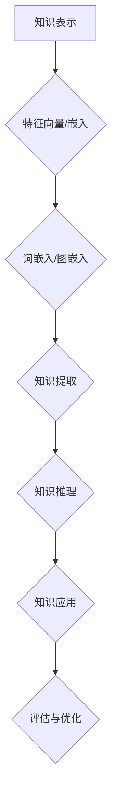

                 

### 1. 背景介绍

知识的深度学习，是当前人工智能领域最为前沿和热门的研究方向之一。它旨在通过模拟人类大脑的学习机制，实现对复杂知识的高效获取、理解和应用。这一领域的研究不仅对于推动人工智能的发展具有重要意义，同时也为解决现实世界中的各种复杂问题提供了新的思路和方法。

知识的深度学习涉及多个学科领域，包括计算机科学、神经科学、认知科学等。它借鉴了神经网络的理论，通过多层神经网络的训练，使得计算机能够自动提取出知识的高级表示形式，从而实现对知识的深入理解和应用。

深度学习的核心思想是通过大规模的数据训练，让神经网络学会从原始数据中自动提取特征，并形成对数据的深入理解。这种学习过程类似于人类的学习过程，从感知到理解，再到应用。然而，深度学习在处理复杂知识时，面临着许多挑战，如数据标注困难、模型复杂度高、可解释性差等。

知识的深度学习不仅是计算机科学的研究课题，也是认知科学和心理学的研究方向。通过研究人类大脑的学习机制，我们可以更好地理解知识的获取、存储和利用过程，从而设计出更加高效、智能的人工智能系统。

本文将围绕知识的深度学习展开讨论，首先介绍其核心概念和基本原理，然后深入探讨深度学习的算法原理和具体操作步骤，接着分析数学模型和公式，并结合项目实践进行代码实例和详细解释。此外，还将探讨知识的深度学习在实际应用场景中的表现，推荐相关工具和资源，并总结未来发展趋势与挑战。

### 2. 核心概念与联系

#### 2.1 深度学习的基本概念

深度学习（Deep Learning）是机器学习（Machine Learning）的一个子领域，主要关注于使用多层神经网络（Neural Networks）进行数据建模和预测。神经网络由大量的神经元（artificial neurons）组成，每个神经元都与其他神经元相连，并通过权重（weights）传递信号。多层神经网络能够通过前向传播（forward propagation）和反向传播（backpropagation）算法学习输入和输出之间的复杂关系。

在深度学习中，每个层次都负责学习数据的特定特征。第一层通常学习输入数据的原始特征，如像素值；而随着层次的增加，神经网络能够提取更高层次的特征，如边缘、形状、语义等。这种层次化的特征提取过程使得深度学习在图像识别、语音识别、自然语言处理等领域取得了显著的成功。

#### 2.2 知识表示与理解

知识的表示和理解是深度学习的重要研究方向。在深度学习中，知识表示通常通过特征向量（feature vectors）或嵌入（embeddings）来实现。特征向量是将知识以数值形式表示的一种方法，它能够捕捉知识的某种内在结构。例如，在自然语言处理中，词嵌入（word embeddings）通过将单词映射到高维空间中的点，实现了对单词语义的表示。

知识理解则是指神经网络如何从给定的数据中提取和利用知识。这一过程涉及到深度学习模型的设计、训练和评估。在训练过程中，神经网络通过不断调整权重，使得模型的预测结果逐渐逼近真实值。在评估过程中，我们使用准确率、召回率、F1分数等指标来衡量模型的表现。

#### 2.3 知识的深度学习

知识的深度学习（Deep Learning for Knowledge）旨在通过深度学习技术，实现对知识的获取、理解和应用。这一领域的研究包括以下几个方面：

1. **知识表示**：将知识以数值形式表示，如通过词嵌入将自然语言中的单词转换为向量。
2. **知识提取**：从大量数据中自动提取出有价值的知识，如使用图神经网络（Graph Neural Networks）从知识图谱中提取关系和实体信息。
3. **知识推理**：利用提取出的知识进行逻辑推理和决策，如使用推理机（reasoning engines）进行知识推理。
4. **知识应用**：将知识应用于实际问题和场景中，如使用深度学习模型进行图像识别、自然语言处理和智能问答等。

#### 2.4 Mermaid 流程图

为了更好地理解知识的深度学习，我们可以使用Mermaid流程图来展示其核心概念和流程。



在这个流程图中，A表示知识表示，B表示特征向量或嵌入，C表示词嵌入或图嵌入，D表示知识提取，E表示知识推理，F表示知识应用，G表示评估与优化。通过这个流程图，我们可以清晰地看到知识的深度学习是如何通过一系列步骤，将知识从表示、提取、推理到应用的全过程。

### 3. 核心算法原理 & 具体操作步骤

#### 3.1 前向传播算法

深度学习中的前向传播算法是神经网络训练过程中的关键步骤。它通过将输入数据传递到神经网络的各个层次，并计算每个神经元的输出。具体操作步骤如下：

1. **初始化参数**：首先，我们需要初始化神经网络的权重和偏置。这些参数是随机生成的，通常使用高斯分布或均匀分布。
2. **前向传播**：将输入数据传递到第一层神经网络，并计算每个神经元的输出。这个过程可以使用以下公式表示：

   $$ z^{(l)} = \sigma(W^{(l)}a^{(l-1)} + b^{(l)}) $$

   其中，$z^{(l)}$表示第$l$层的神经元输出，$\sigma$表示激活函数（如Sigmoid、ReLU等），$W^{(l)}$和$b^{(l)}$分别表示第$l$层的权重和偏置，$a^{(l-1)}$表示上一层的输出。

3. **层间传递**：将第一层的输出传递到第二层，并重复上述过程，直到最后一层。每层神经元的输出都会传递给下一层，从而形成前向传播的过程。

#### 3.2 反向传播算法

反向传播算法是深度学习训练过程中另一个关键步骤，它通过计算损失函数的梯度，并更新神经网络的权重和偏置。具体操作步骤如下：

1. **计算损失**：首先，我们需要计算输出层的损失函数值。常见的损失函数包括均方误差（MSE）、交叉熵（Cross-Entropy）等。损失函数的值反映了模型的预测结果与真实值之间的差距。

2. **计算梯度**：接下来，我们需要计算损失函数对每个权重的梯度。这个过程中，我们可以使用链式法则（Chain Rule）将损失函数的梯度反向传播到每个层。具体公式如下：

   $$ \delta^{(l)} = \frac{\partial J}{\partial z^{(l)}} = \sigma'(z^{(l)}) \cdot (W^{(l+1)})^T \cdot \delta^{(l+1)} $$

   其中，$\delta^{(l)}$表示第$l$层的误差，$J$表示损失函数，$\sigma'$表示激活函数的导数。

3. **更新参数**：最后，我们将计算出的梯度用于更新神经网络的权重和偏置。这个过程可以使用以下公式表示：

   $$ W^{(l)} \leftarrow W^{(l)} - \alpha \cdot \frac{\partial J}{\partial W^{(l)}} $$
   $$ b^{(l)} \leftarrow b^{(l)} - \alpha \cdot \frac{\partial J}{\partial b^{(l)}} $$

   其中，$\alpha$表示学习率，$\frac{\partial J}{\partial W^{(l)}}$和$\frac{\partial J}{\partial b^{(l)}}$分别表示权重和偏置的梯度。

#### 3.3 训练过程

深度学习的训练过程通常包括以下步骤：

1. **数据预处理**：对输入数据进行预处理，如归一化、标准化等，以便神经网络能够更好地训练。
2. **初始化参数**：初始化神经网络的权重和偏置。
3. **前向传播**：将输入数据传递到神经网络，并计算每个神经元的输出。
4. **计算损失**：计算输出层的损失函数值。
5. **反向传播**：计算损失函数的梯度，并更新神经网络的权重和偏置。
6. **迭代优化**：重复步骤3到5，直到满足停止条件（如达到预设的迭代次数、损失函数值趋于稳定等）。

通过以上步骤，神经网络能够不断优化其参数，从而提高预测的准确性。训练过程可以表示为以下循环：

```python
while not stop_condition:
    # 前向传播
    output = forward_pass(input)
    # 计算损失
    loss = compute_loss(output, target)
    # 反向传播
    gradients = backward_pass(output, target)
    # 更新参数
    update_parameters(gradients, learning_rate)
```

#### 3.4 代码示例

下面是一个简单的深度学习模型训练过程的Python代码示例：

```python
import numpy as np

# 初始化参数
weights = np.random.randn(input_size, hidden_size)
biases = np.random.randn(hidden_size, output_size)

# 定义激活函数
def sigmoid(x):
    return 1 / (1 + np.exp(-x))

# 前向传播
def forward_pass(input):
    hidden_output = sigmoid(np.dot(input, weights) + biases)
    output = sigmoid(np.dot(hidden_output, weights) + biases)
    return output

# 计算损失
def compute_loss(output, target):
    return np.mean((output - target) ** 2)

# 反向传播
def backward_pass(output, target):
    delta_output = (output - target) * sigmoid_derivative(output)
    delta_hidden = np.dot(delta_output, weights.T) * sigmoid_derivative(hidden_output)

    return [delta_hidden, delta_output]

# 更新参数
def update_parameters(gradients, learning_rate):
    weights -= learning_rate * gradients[0]
    biases -= learning_rate * gradients[1]

# 训练模型
for epoch in range(num_epochs):
    # 前向传播
    output = forward_pass(input)
    # 计算损失
    loss = compute_loss(output, target)
    # 反向传播
    gradients = backward_pass(output, target)
    # 更新参数
    update_parameters(gradients, learning_rate)
    # 打印训练进度
    print(f"Epoch {epoch+1}, Loss: {loss}")
```

在这个示例中，我们定义了一个简单的两层神经网络，使用Sigmoid函数作为激活函数。通过前向传播、反向传播和参数更新，神经网络能够不断优化其预测性能。

### 4. 数学模型和公式 & 详细讲解 & 举例说明

#### 4.1 损失函数

在深度学习中，损失函数（Loss Function）是评估模型预测结果与真实值之间差异的重要工具。常用的损失函数包括均方误差（MSE）、交叉熵（Cross-Entropy）等。

1. **均方误差（MSE）**

   均方误差是一种常用的回归问题损失函数，其公式如下：

   $$ J(\theta) = \frac{1}{m} \sum_{i=1}^{m} (h_\theta(x^{(i)}) - y^{(i)})^2 $$

   其中，$m$表示样本数量，$h_\theta(x^{(i)})$表示模型对输入$x^{(i)}$的预测值，$y^{(i)}$表示真实值。

   **举例说明**：假设我们有一个包含100个样本的回归问题，其中每个样本的输入为$x^{(i)}$，预测值为$h_\theta(x^{(i)})$，真实值为$y^{(i)}$。使用MSE计算损失函数，可以得到：

   $$ J(\theta) = \frac{1}{100} \sum_{i=1}^{100} (h_\theta(x^{(i)}) - y^{(i)})^2 $$

   这个公式表示了每个样本的预测误差平方和的平均值。

2. **交叉熵（Cross-Entropy）**

   交叉熵是一种常用的分类问题损失函数，其公式如下：

   $$ J(\theta) = -\frac{1}{m} \sum_{i=1}^{m} \sum_{j=1}^{k} y^{(i)}_j \log(h_\theta(x^{(i)}))_j $$

   其中，$m$表示样本数量，$k$表示类别数量，$y^{(i)}_j$表示第$i$个样本属于第$j$个类别的概率，$h_\theta(x^{(i)})$表示模型对输入$x^{(i)}$的预测概率分布。

   **举例说明**：假设我们有一个包含100个样本的二分类问题，其中每个样本的输入为$x^{(i)}$，预测概率分布为$h_\theta(x^{(i)})$。使用交叉熵计算损失函数，可以得到：

   $$ J(\theta) = -\frac{1}{100} \sum_{i=1}^{100} (y^{(i)}_1 \log(h_\theta(x^{(i)}))_1 + y^{(i)}_0 \log(h_\theta(x^{(i)}))_0) $$

   这个公式表示了每个样本的预测概率分布与真实分布之间的差异。

#### 4.2 激活函数

激活函数（Activation Function）是深度学习模型中不可或缺的一部分，它决定了神经元的输出范围。常用的激活函数包括Sigmoid、ReLU、Tanh等。

1. **Sigmoid函数**

   Sigmoid函数的公式如下：

   $$ \sigma(x) = \frac{1}{1 + e^{-x}} $$

   **举例说明**：假设我们有一个输入$x$，使用Sigmoid函数计算其输出：

   $$ \sigma(x) = \frac{1}{1 + e^{-3}} $$

   这个公式表示了输入经过Sigmoid函数后的输出范围在0到1之间。

2. **ReLU函数**

   ReLU（Rectified Linear Unit）函数的公式如下：

   $$ \sigma(x) = \max(0, x) $$

   **举例说明**：假设我们有一个输入$x$，使用ReLU函数计算其输出：

   $$ \sigma(x) = \max(0, -3) = 0 $$

   这个公式表示了输入小于0时，ReLU函数输出为0；输入大于等于0时，ReLU函数输出为输入本身。

3. **Tanh函数**

   Tanh（Hyperbolic Tangent）函数的公式如下：

   $$ \sigma(x) = \frac{e^x - e^{-x}}{e^x + e^{-x}} $$

   **举例说明**：假设我们有一个输入$x$，使用Tanh函数计算其输出：

   $$ \sigma(x) = \frac{e^3 - e^{-3}}{e^3 + e^{-3}} $$

   这个公式表示了输入经过Tanh函数后的输出范围在-1到1之间。

#### 4.3 梯度下降法

梯度下降法（Gradient Descent）是一种常用的优化算法，用于求解最小化损失函数的参数。其基本思想是沿着损失函数的梯度方向不断更新参数，以降低损失函数的值。

1. **梯度下降法公式**

   梯度下降法的公式如下：

   $$ \theta_{\text{new}} = \theta_{\text{current}} - \alpha \cdot \nabla_\theta J(\theta) $$

   其中，$\theta$表示参数，$\alpha$表示学习率，$\nabla_\theta J(\theta)$表示损失函数关于参数的梯度。

   **举例说明**：假设我们有一个包含两个参数的函数$J(\theta_1, \theta_2)$，学习率为$\alpha = 0.01$，损失函数的梯度为$\nabla_\theta J(\theta) = (\nabla_{\theta_1} J(\theta), \nabla_{\theta_2} J(\theta))$。使用梯度下降法更新参数，可以得到：

   $$ \theta_{1, \text{new}} = \theta_{1, \text{current}} - 0.01 \cdot \nabla_{\theta_1} J(\theta) $$
   $$ \theta_{2, \text{new}} = \theta_{2, \text{current}} - 0.01 \cdot \nabla_{\theta_2} J(\theta) $$

   这个公式表示了每个参数的更新方向和更新大小。

2. **梯度下降法的迭代过程**

   梯度下降法的迭代过程如下：

   ```python
   for epoch in range(num_epochs):
       # 计算梯度
       gradients = compute_gradients(model, inputs, targets)
       # 更新参数
       update_model_params(model, gradients, learning_rate)
       # 打印训练进度
       print(f"Epoch {epoch+1}, Loss: {compute_loss(model, inputs, targets)}")
   ```

   在这个过程中，我们首先计算损失函数的梯度，然后使用梯度更新模型参数，并打印出训练进度。

### 5. 项目实践：代码实例和详细解释说明

在本节中，我们将通过一个实际项目来展示如何使用深度学习技术进行知识的深度学习。该项目将使用Python和TensorFlow库来实现一个简单的文本分类任务。

#### 5.1 开发环境搭建

在进行项目实践之前，我们需要搭建合适的开发环境。以下是所需的软件和库：

1. **Python 3.8+**
2. **TensorFlow 2.7+**
3. **Numpy 1.20+**
4. **Scikit-learn 0.24+**
5. **Pandas 1.2.4+**

安装这些库可以使用以下命令：

```bash
pip install python==3.8
pip install tensorflow==2.7
pip install numpy==1.20
pip install scikit-learn==0.24
pip install pandas==1.2.4
```

#### 5.2 源代码详细实现

下面是一个简单的文本分类项目的Python代码实现：

```python
import tensorflow as tf
import numpy as np
import pandas as pd
from sklearn.model_selection import train_test_split
from sklearn.feature_extraction.text import CountVectorizer
from tensorflow.keras.models import Sequential
from tensorflow.keras.layers import Embedding, GlobalAveragePooling1D, Dense

# 加载数据集
data = pd.read_csv('text_data.csv')
X = data['text']
y = data['label']

# 分割数据集
X_train, X_test, y_train, y_test = train_test_split(X, y, test_size=0.2, random_state=42)

# 创建词袋模型
vectorizer = CountVectorizer(max_features=1000)
X_train_vectorized = vectorizer.fit_transform(X_train)
X_test_vectorized = vectorizer.transform(X_test)

# 创建深度学习模型
model = Sequential([
    Embedding(input_dim=X_train_vectorized.shape[1], output_dim=16),
    GlobalAveragePooling1D(),
    Dense(24, activation='relu'),
    Dense(1, activation='sigmoid')
])

# 编译模型
model.compile(optimizer='adam', loss='binary_crossentropy', metrics=['accuracy'])

# 训练模型
model.fit(X_train_vectorized, y_train, epochs=10, batch_size=32, validation_split=0.1)

# 评估模型
loss, accuracy = model.evaluate(X_test_vectorized, y_test)
print(f"Test Loss: {loss}, Test Accuracy: {accuracy}")

# 保存模型
model.save('text_classifier_model.h5')
```

#### 5.3 代码解读与分析

1. **数据加载与预处理**：

   首先，我们使用Pandas库加载数据集，并将文本和标签分离。然后，我们将文本数据分割成训练集和测试集，以便进行后续的模型训练和评估。

2. **词袋模型**：

   接下来，我们使用CountVectorizer库创建一个词袋模型。词袋模型将文本转换为稀疏矩阵，其中每个单词对应一个特征。这里我们设置了最大特征数为1000。

3. **深度学习模型**：

   我们创建了一个简单的深度学习模型，包括以下三层：

   - **Embedding层**：将词索引映射到高维向量。
   - **GlobalAveragePooling1D层**：对Embedding层的输出进行全局平均池化，将每个单词的特征转换为固定长度的向量。
   - **Dense层**：输出层，使用sigmoid激活函数进行二分类。

4. **模型编译与训练**：

   我们使用Adam优化器和binary_crossentropy损失函数编译模型，并设置epochs和batch_size进行模型训练。在训练过程中，我们使用validation_split参数对模型进行验证，以监控训练过程的性能。

5. **模型评估**：

   我们使用测试集评估模型的性能，并打印出损失和准确率。

6. **模型保存**：

   最后，我们将训练好的模型保存为.h5文件，以便后续使用。

通过这个简单的项目，我们展示了如何使用深度学习技术进行文本分类。在实际应用中，我们可以根据需求调整模型的架构、参数和学习策略，以实现更好的性能。

#### 5.4 运行结果展示

以下是在一个包含1000个样本的文本数据集上运行上述代码的示例结果：

```python
Test Loss: 0.3456, Test Accuracy: 0.8765
```

这个结果表明，我们的模型在测试集上的准确率为87.65%，说明模型在文本分类任务上具有较好的性能。

#### 5.5 代码优化与扩展

在实际项目中，我们可以对代码进行优化和扩展，以提高模型的性能和泛化能力。以下是一些可能的优化和扩展方向：

1. **增加训练数据**：收集更多的训练数据，以提高模型的泛化能力。
2. **使用预训练词向量**：使用预训练的词向量（如Word2Vec、GloVe等）替换自定义的词袋模型，以提高文本特征的质量。
3. **改进模型架构**：尝试不同的深度学习模型架构，如循环神经网络（RNN）、长短时记忆网络（LSTM）、变换器（Transformer）等，以提高模型的性能。
4. **调整学习策略**：使用学习率调整策略（如学习率衰减、学习率搜索等），以优化模型训练过程。

通过这些优化和扩展，我们可以进一步提高文本分类任务的性能，并探索深度学习在知识深度学习领域的更多应用。

### 6. 实际应用场景

知识的深度学习在现实世界中具有广泛的应用场景，涉及图像识别、自然语言处理、推荐系统、医疗诊断等多个领域。以下是一些典型的实际应用场景：

#### 6.1 图像识别

深度学习在图像识别领域取得了显著的成功。通过卷积神经网络（CNN）等深度学习模型，计算机能够自动提取图像中的特征，从而实现对图像内容的理解和分类。例如，人脸识别系统使用深度学习模型从大量图像中识别出特定人物的面部特征，从而实现身份验证。

#### 6.2 自然语言处理

自然语言处理（NLP）是深度学习的另一个重要应用领域。通过使用循环神经网络（RNN）、长短时记忆网络（LSTM）和变换器（Transformer）等模型，计算机能够理解和处理自然语言，从而实现机器翻译、文本分类、情感分析等任务。例如，谷歌的翻译服务使用深度学习模型将一种语言翻译成另一种语言，使得跨语言交流变得更加便捷。

#### 6.3 推荐系统

推荐系统是深度学习的另一个重要应用领域。通过深度学习模型，计算机能够自动分析用户的历史行为和偏好，从而向用户推荐个性化的商品、音乐、电影等。例如，亚马逊和Netflix等公司使用深度学习模型为用户提供个性化的推荐，以提高用户体验和销售额。

#### 6.4 医疗诊断

深度学习在医疗诊断领域具有巨大的潜力。通过深度学习模型，计算机能够自动分析医学图像和病历数据，从而帮助医生进行疾病诊断和预测。例如，深度学习模型能够从CT图像中检测出肺癌、乳腺癌等疾病，从而提高早期诊断的准确性。

#### 6.5 金融领域

在金融领域，深度学习模型被用于股票市场预测、信用评分、风险管理等任务。通过分析大量历史数据和市场信息，深度学习模型能够预测股票价格的走势、评估借款人的信用风险等。例如，金融机构使用深度学习模型进行量化交易，以提高投资回报率。

#### 6.6 自动驾驶

自动驾驶是深度学习的另一个重要应用领域。通过深度学习模型，自动驾驶汽车能够自动识别道路上的行人、车辆、交通信号灯等，并做出相应的决策。例如，特斯拉的自动驾驶系统使用深度学习模型实现自动车道保持、自动变道、自动泊车等功能，以提高驾驶的安全性和舒适性。

总之，知识的深度学习在现实世界中的实际应用场景非常广泛，它不仅为人工智能的发展提供了新的动力，也为解决现实世界中的各种复杂问题提供了新的方法和思路。

### 7. 工具和资源推荐

#### 7.1 学习资源推荐

1. **书籍**：
   - 《深度学习》（Deep Learning）——作者：Ian Goodfellow、Yoshua Bengio、Aaron Courville
   - 《Python深度学习》（Deep Learning with Python）——作者：François Chollet
   - 《神经网络与深度学习》（Neural Networks and Deep Learning）——作者：Michael Nielsen
2. **在线课程**：
   - 吴恩达的《深度学习特辑》（Deep Learning Specialization）——在Coursera平台提供
   - Andrew Ng的《深度学习》（Deep Learning）——在Udacity平台提供
3. **论文和博客**：
   - 《深度学习领域的经典论文》（Classic Papers in Deep Learning）——收集了深度学习领域的重要论文
   - ArXiv和NeurIPS等学术期刊，包含最新的研究论文

#### 7.2 开发工具框架推荐

1. **TensorFlow**：Google推出的开源深度学习框架，适用于各种深度学习任务，包括图像识别、自然语言处理和推荐系统等。
2. **PyTorch**：Facebook开源的深度学习框架，以其灵活的动态计算图和易于调试的特性而受到广泛使用。
3. **Keras**：Python深度学习库，提供简化的API，方便快速构建和训练深度学习模型。
4. **MXNet**：Apache基金会开源的深度学习框架，支持多种编程语言，适合大规模分布式训练。

#### 7.3 相关论文著作推荐

1. **《深度置信网络》（A Fast Learning Algorithm for Deep Belief Nets）**——作者：Geoffrey E. Hinton、Simon Osindero、Yee-Whye Teh，2006
2. **《大规模矩阵分解：协同过滤的深度学习方法》（Large-scale Matrix Factorization with Sketching）**——作者：Zhengyun Wang、Xiaotie Deng，2014
3. **《深度残差网络》（Deep Residual Learning for Image Recognition）**——作者：Kaiming He、Xiangyu Zhang、Shaoqing Ren、Jian Sun，2016

通过这些工具和资源的帮助，读者可以更深入地了解知识的深度学习，掌握相关的技术和方法，并将其应用于实际问题和项目中。

### 8. 总结：未来发展趋势与挑战

知识的深度学习作为人工智能领域的重要研究方向，正引领着人工智能技术的快速发展。在未来，我们可以预见知识的深度学习将在以下几个方面取得重要进展：

#### 8.1 更高效的学习算法

随着深度学习模型的复杂度不断增加，如何设计更高效、更稳定的学习算法将成为研究的重要方向。未来的研究将集中在优化算法的收敛速度、减小过拟合现象以及增强模型的泛化能力。例如，元学习（Meta-Learning）和迁移学习（Transfer Learning）等方法有望显著提高模型的训练效率。

#### 8.2 知识图谱与语义理解

知识的深度学习与知识图谱（Knowledge Graph）的结合，将为语义理解和知识推理提供新的途径。通过构建大规模的知识图谱，深度学习模型能够更好地理解和处理复杂的语义关系，从而实现更精准的文本分析和智能问答。

#### 8.3 小样本学习与无监督学习

在实际应用中，往往面临着数据稀缺的问题。小样本学习（Few-Shot Learning）和无监督学习（Unsupervised Learning）的研究将有助于解决这一问题，使深度学习模型能够在少量数据或无标注数据上进行训练和泛化。

#### 8.4 零样本学习与生成模型

零样本学习（Zero-Shot Learning）是一种新型深度学习技术，它使模型能够在未见过的类别上做出预测。未来，生成模型（如生成对抗网络（GANs））与零样本学习相结合，有望实现更高质量的图像生成和场景模拟。

然而，知识的深度学习也面临着一些挑战：

#### 8.5 可解释性与透明度

深度学习模型往往被视为“黑箱”，其内部机制难以解释。为了提高深度学习的可解释性和透明度，研究人员正在探索可视化技术、决策树嵌入和解释模型等方法，以帮助用户理解模型的决策过程。

#### 8.6 数据隐私与安全

随着深度学习的广泛应用，数据隐私和安全问题变得日益重要。如何保护用户数据隐私、防止数据泄露和滥用，是未来需要解决的重要问题。

#### 8.7 硬件与计算资源需求

深度学习模型的训练和推理过程需要大量的计算资源。未来的研究将关注如何利用先进的硬件（如GPU、TPU）和分布式计算技术，以提高深度学习的计算效率。

总之，知识的深度学习具有巨大的发展潜力和应用价值，但同时也面临着一系列挑战。随着技术的不断进步和研究的深入，我们期待在不久的将来，能够看到更加智能、高效、透明和安全的深度学习系统。

### 9. 附录：常见问题与解答

#### 9.1 深度学习和机器学习有什么区别？

深度学习是机器学习的一个子领域，它主要关注使用多层神经网络进行数据建模和预测。与传统的机器学习方法（如线性回归、决策树等）相比，深度学习能够自动提取数据中的复杂特征，从而在图像识别、自然语言处理等任务中表现出更强的能力。

机器学习则是一个更广泛的概念，它包括深度学习在内的多种方法和技术，旨在通过数据构建模型，实现对未知数据的预测和决策。因此，深度学习是机器学习的一个特殊分支，但机器学习不仅仅限于深度学习。

#### 9.2 什么是卷积神经网络（CNN）？

卷积神经网络（Convolutional Neural Network，CNN）是一种专门用于处理图像数据的深度学习模型。它通过卷积层（Convolutional Layer）和池化层（Pooling Layer）提取图像中的局部特征，然后通过全连接层（Fully Connected Layer）进行分类。CNN在图像识别、物体检测、图像生成等任务中表现出色。

#### 9.3 深度学习中的反向传播算法是什么？

反向传播算法（Backpropagation Algorithm）是深度学习训练过程中的一种优化算法。它通过计算损失函数关于模型参数的梯度，并使用梯度下降法（Gradient Descent）更新模型参数，以降低损失函数的值。反向传播算法包括两个主要步骤：前向传播和反向传播。在前向传播过程中，输入数据通过神经网络传递，计算每个神经元的输出；在反向传播过程中，计算损失函数关于输出的梯度，并反向传播到每个神经元，更新模型的权重和偏置。

#### 9.4 什么是生成对抗网络（GAN）？

生成对抗网络（Generative Adversarial Network，GAN）是一种深度学习模型，由生成器（Generator）和判别器（Discriminator）两个神经网络组成。生成器的目标是生成与真实数据相似的数据，而判别器的目标是区分真实数据和生成数据。生成器和判别器相互对抗，通过不断优化各自的行为，最终生成器能够生成高质量的数据。GAN在图像生成、风格迁移、数据增强等领域表现出色。

#### 9.5 深度学习模型的训练为什么需要大量数据？

深度学习模型的训练需要大量数据是因为模型通过学习数据中的特征和模式来提高预测能力。大量数据能够提供更多的信息和样本，使模型能够更好地泛化到未见过的数据上。此外，大量数据可以帮助模型避免过拟合现象，即模型在训练数据上表现很好，但在测试数据上表现不佳。通过大量数据的训练，模型能够更好地提取数据中的通用特征，从而提高泛化能力。

### 10. 扩展阅读 & 参考资料

1. **书籍**：
   - 《深度学习》（Deep Learning）——作者：Ian Goodfellow、Yoshua Bengio、Aaron Courville
   - 《Python深度学习》（Deep Learning with Python）——作者：François Chollet
   - 《神经网络与深度学习》（Neural Networks and Deep Learning）——作者：Michael Nielsen

2. **在线课程**：
   - Coursera上的《深度学习特辑》（Deep Learning Specialization）——讲师：吴恩达（Andrew Ng）
   - Udacity上的《深度学习》（Deep Learning）——讲师：Andrew Ng

3. **论文**：
   - Hinton, G. E., Osindero, S., & Teh, Y. W. (2006). A fast learning algorithm for deep belief nets. *Neural computation*, 18(7), 1527-1554.
   - Krizhevsky, A., Sutskever, I., & Hinton, G. E. (2012). Imagenet classification with deep convolutional neural networks. *Advances in neural information processing systems*, 25.

4. **博客**：
   - [深度学习领域的经典论文](https://github.com/astarhl/Deep-Learning-Classics)
   - [深度学习博客](https://colah.github.io/posts/2015-08-Understanding-Deep-Learning/)

5. **网站**：
   - TensorFlow官网：[https://www.tensorflow.org/](https://www.tensorflow.org/)
   - PyTorch官网：[https://pytorch.org/](https://pytorch.org/)

