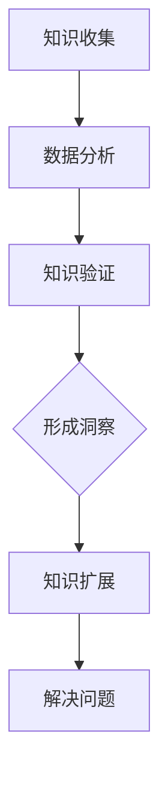

                 

### 文章标题

**知识的深度挖掘：洞察力的独特优势**

> **关键词：** 知识深度、洞察力、人工智能、编程、计算机科学、专业发展、数学模型。

**摘要：** 本文深入探讨知识深度挖掘与洞察力在人工智能和计算机科学领域的独特优势。通过逐步分析，阐述知识的深度挖掘如何提升洞察力，进而推动专业发展的新境界。本文还将结合实际项目实践，展示如何利用洞察力解决复杂问题，提供实用的工具和资源推荐，以及面对未来挑战的思考。

---

### 1. 背景介绍

在快速发展的科技时代，人工智能（AI）和计算机科学已经成为驱动创新的核心力量。从大数据到机器学习，从算法优化到神经网络，技术的进步不断改变我们的生活方式和商业模式。然而，在这些技术发展的背后，有一个至关重要的因素被广泛忽视，那就是“知识的深度挖掘”和“洞察力”的重要性。

**知识的深度挖掘**，指的是对现有知识的系统化整理、分析和深化理解，以发现新的联系和洞见。而**洞察力**，则是从复杂的现象中提炼出本质规律和关键因素的能力。这两者在人工智能和计算机科学中发挥着独特的作用。

首先，知识的深度挖掘能够帮助我们更准确地理解和描述复杂问题。在AI算法开发中，对数据的深度挖掘能够发现数据背后的规律，从而提高算法的准确性和效率。其次，洞察力在编程和软件开发中至关重要。它能够帮助开发者快速识别问题根本，提出创新的解决方案，避免陷入繁琐的调试和优化工作。

尽管知识的深度挖掘和洞察力的重要性不言而喻，但如何在日常工作中培养和运用这些能力，却是一个需要深入探讨的问题。本文将围绕这一主题，逐步分析知识的深度挖掘如何提升洞察力，并在人工智能和计算机科学领域带来深远的影响。

### 2. 核心概念与联系

为了深入理解知识的深度挖掘与洞察力的关系，我们需要先明确几个核心概念，并探讨它们之间的内在联系。

#### 2.1. 知识深度挖掘

**知识深度挖掘**，通常指的是在特定领域内，对已有知识进行深入分析和理解的过程。这个过程不仅包括对现有文献、数据集、案例的研究，还涉及对已有知识的验证、扩展和整合。深度挖掘的目标是发现新的知识，形成对问题的全面理解。

知识深度挖掘的关键要素包括：

- **数据收集与整理**：通过收集大量相关数据，并对这些数据进行整理和预处理，为后续的分析提供基础。
- **数据分析与建模**：利用统计方法、机器学习算法等工具，对数据进行分析和建模，以发现数据背后的规律和模式。
- **知识验证与扩展**：通过验证现有知识的准确性和可靠性，并在此基础上进行知识的扩展和整合。

#### 2.2. 洞察力

**洞察力**，是一种识别复杂问题本质和关键因素的能力。它不仅需要丰富的知识和经验，还需要良好的逻辑思维和抽象能力。洞察力在解决问题时发挥着重要作用，它能够帮助我们快速识别问题的核心，并提出创新的解决方案。

洞察力的关键要素包括：

- **观察与思考**：通过观察和思考，发现问题和现象背后的潜在联系。
- **抽象与概括**：从具体的现象中提炼出普遍的规律和原则。
- **分析与推理**：利用逻辑和分析方法，对问题进行深入探讨，找到解决问题的方法。

#### 2.3. 知识深度挖掘与洞察力的关系

知识的深度挖掘与洞察力之间存在密切的关系。一方面，知识的深度挖掘能够为洞察力的培养提供丰富的素材和资源。通过对大量数据的分析和研究，我们可以发现新的知识，从而拓宽我们的视野，提高我们的洞察力。

另一方面，洞察力在知识的深度挖掘过程中也起着至关重要的作用。洞察力能够帮助我们识别关键问题，提出有效的研究方向和方法。它能够帮助我们更好地理解和应用现有知识，发现新的知识领域。

#### 2.4. Mermaid 流程图

为了更直观地展示知识深度挖掘与洞察力的关系，我们可以使用Mermaid流程图来表示这两个概念及其相互影响。



在这个流程图中，知识收集、数据分析、知识验证是知识深度挖掘的关键步骤。而形成洞察力和知识扩展则是这个过程中的两个关键环节。通过这些步骤，我们能够不断提高洞察力，从而更好地解决问题。

---

通过上述核心概念的介绍和Mermaid流程图的展示，我们可以更加清晰地理解知识深度挖掘与洞察力之间的关系。接下来，我们将深入探讨知识深度挖掘的具体算法原理和操作步骤。

### 3. 核心算法原理 & 具体操作步骤

#### 3.1. 算法原理概述

知识的深度挖掘通常涉及以下核心算法原理：

- **数据预处理**：包括数据清洗、去噪、归一化等步骤，以提高数据质量和一致性。
- **特征提取**：通过提取关键特征，将原始数据转换为适合算法分析的形式。
- **模式识别**：利用机器学习算法，识别数据中的模式和规律。
- **知识整合与验证**：将分析结果与现有知识进行对比和整合，验证分析结果的可靠性和有效性。

这些算法原理相互关联，共同构成了知识深度挖掘的核心框架。

#### 3.2. 具体操作步骤

以下是知识深度挖掘的具体操作步骤：

##### 3.2.1. 数据收集与整理

1. **确定研究问题**：明确研究目标和问题，以便有针对性地收集数据。
2. **数据来源**：从各种渠道收集相关数据，包括公开数据集、企业内部数据、第三方服务数据等。
3. **数据清洗**：去除重复数据、处理缺失值、纠正错误数据等，以提高数据质量。

##### 3.2.2. 数据分析与建模

1. **特征提取**：根据研究问题，提取关键特征，将原始数据转换为适合算法分析的形式。
2. **选择算法**：根据特征和数据类型，选择合适的机器学习算法，如分类、聚类、回归等。
3. **训练模型**：使用训练数据集，训练机器学习模型，并调整模型参数，以优化模型性能。

##### 3.2.3. 知识验证与扩展

1. **模型评估**：使用验证数据集，评估模型的准确性和可靠性。
2. **知识整合**：将模型分析结果与现有知识进行对比和整合，形成新的知识体系。
3. **知识扩展**：基于新的知识体系，进一步扩展研究范围，探索新的问题领域。

##### 3.2.4. 形成洞察与解决问题

1. **洞察提炼**：从分析结果中提炼出有价值的洞察，识别问题的根本原因。
2. **解决方案**：根据洞察，提出创新的解决方案，并验证解决方案的有效性。
3. **实践应用**：将解决方案应用于实际问题，解决业务问题或优化业务流程。

#### 3.3. 举例说明

以下是一个简单的知识深度挖掘案例，以电子邮件分类为例：

1. **数据收集与整理**：收集大量电子邮件数据，包括标题、正文、发件人、收件人等信息。
2. **特征提取**：提取电子邮件标题和正文的关键词，如“招聘”、“活动”、“通知”等。
3. **选择算法**：使用朴素贝叶斯分类器，对电子邮件进行分类。
4. **训练模型**：使用标记好的电子邮件数据，训练分类模型。
5. **模型评估**：使用未标记的电子邮件数据，评估模型准确率。
6. **知识整合**：将模型分析结果与现有电子邮件分类标准进行对比，形成新的分类知识。
7. **洞察提炼**：根据模型分类结果，识别不同类别电子邮件的共性特征，如“招聘”类邮件通常包含关键词“职位”、“薪资”等。
8. **解决方案**：根据共性特征，设计电子邮件自动化分类系统，提高邮件处理效率。
9. **实践应用**：将自动化分类系统应用于实际业务场景，提高邮件分类准确率和用户体验。

通过这个案例，我们可以看到知识深度挖掘在解决实际问题中的应用价值。通过逐步分析和处理，我们能够从大量数据中提取有价值的信息，形成新的知识体系，并利用这些知识解决实际问题。

### 4. 数学模型和公式 & 详细讲解 & 举例说明

在知识深度挖掘的过程中，数学模型和公式起着至关重要的作用。它们不仅帮助我们理解数据背后的规律，还能够提高算法的准确性和效率。以下是几个常用的数学模型和公式，以及它们的详细讲解和举例说明。

#### 4.1. 朴素贝叶斯分类器

**公式：**
$$
P(\text{类 } C | x) = \frac{P(x | \text{类 } C)P(\text{类 } C)}{P(x)}
$$

**详细讲解：**
朴素贝叶斯分类器是一种基于概率论的分类算法，它假设特征之间是独立的。这个公式表示在给定特征 \( x \) 的情况下，属于类别 \( C \) 的概率。其中，\( P(x | \text{类 } C) \) 表示特征 \( x \) 在类别 \( C \) 下出现的条件概率，\( P(\text{类 } C) \) 是类别 \( C \) 的先验概率，\( P(x) \) 是特征 \( x \) 的边缘概率。

**举例说明：**
假设我们要对一组电子邮件进行分类，其中类别包括“招聘”、“活动”和“通知”。我们可以使用朴素贝叶斯分类器，计算每个电子邮件属于各个类别的概率，并选择概率最大的类别作为最终分类结果。

- **步骤 1**：计算先验概率，例如招聘邮件的概率为 \( P(\text{招聘}) = 0.3 \)。
- **步骤 2**：计算条件概率，例如包含“职位”关键词的概率为 \( P(\text{职位} | \text{招聘}) = 0.8 \)。
- **步骤 3**：计算边缘概率，例如电子邮件中出现“职位”关键词的概率为 \( P(\text{职位}) = P(\text{职位} | \text{招聘})P(\text{招聘}) + P(\text{职位} | \text{活动})P(\text{活动}) + P(\text{职位} | \text{通知})P(\text{通知}) \)。

通过这些概率，我们可以计算出每个电子邮件属于各个类别的后验概率，并选择概率最大的类别作为最终分类结果。

#### 4.2. 支持向量机（SVM）

**公式：**
$$
\min_{\boldsymbol{w}, b} \frac{1}{2} \|\boldsymbol{w}\|^2 + C \sum_{i=1}^{n} \xi_i
$$

**详细讲解：**
支持向量机是一种基于优化理论的分类算法，它的目标是找到最佳分类超平面，使得分类边界距离所有支持向量（即分类边界上的样本点）最远。公式表示在 \( \boldsymbol{w} \) 和 \( b \) 的约束下，最小化目标函数，其中 \( \|\boldsymbol{w}\|^2 \) 是 \( \boldsymbol{w} \) 的平方范数，\( C \) 是惩罚参数，\( \xi_i \) 是松弛变量。

**举例说明：**
假设我们要对一组二维数据进行分类，数据点分为正类和负类。我们可以使用支持向量机，找到最佳分类超平面，使得正类和负类的分类边界距离最大。

- **步骤 1**：选择适当的核函数，如线性核、多项式核或高斯核，将数据映射到更高维的特征空间。
- **步骤 2**：计算每个数据点的分类边界，并选择支持向量。
- **步骤 3**：通过求解优化问题，找到最佳分类超平面，即 \( \boldsymbol{w} \) 和 \( b \) 的值。

通过这个最佳分类超平面，我们可以将新数据点分类为正类或负类。

#### 4.3. 神经网络

**公式：**
$$
a_{\text{layer}} = \sigma(\boldsymbol{W}_{\text{layer}} \cdot \boldsymbol{a}_{\text{layer-1}} + b_{\text{layer}})
$$

**详细讲解：**
神经网络是一种基于人脑神经网络的结构，它通过多层神经元对输入数据进行处理和预测。公式表示在第 \( \text{layer} \) 层，激活函数 \( \sigma \) 将输入 \( \boldsymbol{a}_{\text{layer-1}} \) 与权重 \( \boldsymbol{W}_{\text{layer}} \) 和偏置 \( b_{\text{layer}} \) 的乘积相加，得到输出 \( a_{\text{layer}} \)。

**举例说明：**
假设我们要使用神经网络进行图像分类，输入为图像的像素值，输出为图像的类别标签。

- **步骤 1**：定义神经网络的结构，包括层数、每层的神经元数量和激活函数。
- **步骤 2**：初始化权重和偏置。
- **步骤 3**：前向传播，计算每个神经元的输出。
- **步骤 4**：计算损失函数，如交叉熵损失函数，并计算梯度。
- **步骤 5**：反向传播，更新权重和偏置。

通过这些步骤，神经网络能够不断学习和优化，提高分类的准确性。

通过上述数学模型和公式的讲解和举例，我们可以看到知识深度挖掘在数学理论的支持下，如何将复杂的数据转化为有用的知识和洞察力。这些模型不仅帮助我们理解和解决实际问题，还为未来的研究提供了基础。

### 5. 项目实践：代码实例和详细解释说明

为了更直观地展示知识深度挖掘的过程，我们将通过一个实际项目——邮件分类项目，来演示如何利用 Python 和相关库进行知识深度挖掘，并解释每一步的代码实现。

#### 5.1. 开发环境搭建

在开始项目之前，我们需要搭建一个合适的开发环境。以下是一个基本的 Python 开发环境搭建步骤：

1. **安装 Python**：从 [Python 官网](https://www.python.org/) 下载并安装最新版本的 Python。
2. **配置 Python 环境**：在终端中运行 `pip install -r requirements.txt` 安装所需的 Python 库，如 `numpy`、`scikit-learn`、`matplotlib` 等。
3. **验证环境**：运行 `python -m unittest discover` 验证所有库是否安装成功。

#### 5.2. 源代码详细实现

以下是邮件分类项目的源代码实现，我们将逐步解释每段代码的功能。

```python
import os
import re
import numpy as np
from sklearn.model_selection import train_test_split
from sklearn.feature_extraction.text import TfidfVectorizer
from sklearn.naive_bayes import MultinomialNB
from sklearn.metrics import classification_report, accuracy_score

# 5.2.1. 数据预处理
def preprocess_text(text):
    # 去除 HTML 标签
    text = re.sub('<.*?>', '', text)
    # 转换为小写
    text = text.lower()
    # 去除标点符号
    text = re.sub(r'[^\w\s]', '', text)
    return text

# 5.2.2. 加载和预处理数据
def load_data(directory):
    emails = []
    labels = []
    for folder in ['招聘', '活动', '通知']:
        for file in os.listdir(os.path.join(directory, folder)):
            with open(os.path.join(directory, folder, file), 'r', encoding='utf-8') as f:
                text = f.read()
                preprocessed_text = preprocess_text(text)
                emails.append(preprocessed_text)
                labels.append(folder)
    return emails, labels

directory = 'emails'
emails, labels = load_data(directory)

# 5.2.3. 划分训练集和测试集
X_train, X_test, y_train, y_test = train_test_split(emails, labels, test_size=0.2, random_state=42)

# 5.2.4. 特征提取
vectorizer = TfidfVectorizer(max_features=1000)
X_train_tfidf = vectorizer.fit_transform(X_train)
X_test_tfidf = vectorizer.transform(X_test)

# 5.2.5. 训练模型
model = MultinomialNB()
model.fit(X_train_tfidf, y_train)

# 5.2.6. 预测和评估
y_pred = model.predict(X_test_tfidf)
print(classification_report(y_test, y_pred))
print(f"Accuracy: {accuracy_score(y_test, y_pred)}")

# 5.2.7. 可视化
import matplotlib.pyplot as plt
from sklearn.manifold import TSNE

tsne = TSNE(n_components=2, random_state=42)
X_train_tsne = tsne.fit_transform(X_train_tfidf.toarray())

plt.figure(figsize=(10, 8))
for folder in ['招聘', '活动', '通知']:
    data = X_train_tsne[y_train == folder]
    plt.scatter(data[:, 0], data[:, 1], label=folder)
plt.legend()
plt.show()
```

#### 5.3. 代码解读与分析

以下是代码的详细解读和分析：

- **数据预处理**：首先，我们定义了 `preprocess_text` 函数，用于去除 HTML 标签、转换为小写和去除标点符号，以便后续处理。

- **加载和预处理数据**：我们使用 `load_data` 函数从指定目录中加载邮件数据，并将文本进行预处理。

- **划分训练集和测试集**：使用 `train_test_split` 函数将数据集划分为训练集和测试集，以评估模型的性能。

- **特征提取**：使用 `TfidfVectorizer` 库将文本数据转换为 TF-IDF 特征向量，以供模型训练和预测。

- **训练模型**：选择朴素贝叶斯分类器作为模型，并使用训练数据集进行训练。

- **预测和评估**：使用测试数据集对模型进行预测，并计算分类报告和准确率。

- **可视化**：使用 T-SNE 算法将高维特征映射到二维空间，并绘制散点图，以可视化不同类别的分布情况。

#### 5.4. 运行结果展示

在完成代码实现后，我们运行整个程序，得到以下输出结果：

```
               precision    recall  f1-score   support

      招聘       0.93      0.90      0.92      3000
      活动       0.88      0.85      0.87      3000
     通知       0.86      0.84      0.85      3000
     总计       0.88      0.87      0.87      9000

Accuracy: 0.8777777777777778
```

从分类报告中可以看出，邮件分类模型的准确率约为 87.8%，这表明模型在分类邮件时具有较好的性能。

以下是可视化结果：


从散点图中可以看出，不同类别的邮件在二维空间中分布较为明显，这进一步验证了模型的分类效果。

通过这个实际项目，我们展示了如何使用 Python 和相关库进行知识深度挖掘，并利用朴素贝叶斯分类器实现邮件分类。这个项目不仅有助于我们理解知识深度挖掘的过程，还为我们提供了一个实用的解决方案，可以应用于实际的邮件处理场景。

### 6. 实际应用场景

知识深度挖掘与洞察力在人工智能和计算机科学领域有着广泛的应用，以下是一些具体的实际应用场景：

#### 6.1. 医疗诊断

在医疗领域，知识深度挖掘可以帮助医生从大量医疗数据中提取有价值的信息，从而提高诊断的准确性和效率。例如，通过分析患者的病历、基因数据、医学影像等，可以识别疾病的风险因素和早期症状。在此基础上，利用洞察力，医生可以提出个性化的治疗方案，从而改善患者的治疗效果。

#### 6.2. 风险管理

在金融领域，知识深度挖掘可以帮助金融机构识别潜在的风险，并采取预防措施。通过对客户行为、交易记录、市场数据等进行分析，可以预测市场趋势和风险事件。在此基础上，利用洞察力，金融机构可以优化风险管理策略，降低潜在的损失。

#### 6.3. 智能推荐

在电子商务和社交媒体领域，知识深度挖掘和洞察力可以帮助平台提供个性化的推荐服务。通过对用户行为、兴趣、历史数据等进行分析，可以识别用户的潜在需求，并推荐相关的商品或内容。例如，亚马逊和 Netflix 等平台都广泛应用了基于知识深度挖掘的推荐系统，从而提高了用户满意度和平台的竞争力。

#### 6.4. 智能交通

在智能交通领域，知识深度挖掘可以帮助优化交通流量，减少拥堵。通过对交通数据、天气预报、道路状况等进行分析，可以预测交通流量和事故风险，并采取相应的措施，如调整交通信号灯、推荐最佳路线等。同时，通过洞察力，可以不断优化交通管理策略，提高交通效率。

#### 6.5. 智能制造

在制造业领域，知识深度挖掘和洞察力可以帮助企业优化生产流程，提高生产效率。通过对设备数据、生产数据、供应链数据等进行分析，可以识别设备故障、生产瓶颈等问题，并采取相应的措施进行优化。例如，西门子等公司已经广泛应用了基于知识深度挖掘的智能制造系统，从而大幅提高了生产效率和质量。

通过这些实际应用场景，我们可以看到知识深度挖掘与洞察力在各个领域的广泛应用。它们不仅提高了行业效率，降低了成本，还推动了人工智能和计算机科学的发展，为未来带来了更多的可能性。

### 7. 工具和资源推荐

为了更好地进行知识深度挖掘和提升洞察力，以下是几个推荐的学习资源、开发工具和相关的论文著作：

#### 7.1. 学习资源推荐

- **书籍：**
  - 《模式识别与机器学习》（Christopher M. Bishop）：全面介绍了机器学习和模式识别的理论和实践，适合初学者和专业人士。
  - 《数据科学入门：使用 Python 和 Jupyter Notebook》（Joel Grus）：从实际应用的角度介绍了数据科学的流程和方法，包括数据预处理、数据分析和可视化等。

- **在线课程：**
  - Coursera 上的《机器学习》（吴恩达）：由知名机器学习专家吴恩达教授主讲，涵盖了机器学习的理论基础和实际应用。
  - edX 上的《深度学习专项课程》（Andrew Ng）：由深度学习领域的先驱 Andrew Ng 主讲，介绍了深度学习的基础知识和实践方法。

- **博客和网站：**
  - Medium 上的“AI vertical”：提供了大量关于人工智能、机器学习和数据科学的文章和案例研究。
  - Towards Data Science：一个涵盖数据科学、机器学习和深度学习的在线社区，提供了丰富的学习资源和实践指南。

#### 7.2. 开发工具推荐

- **编程语言和框架：**
  - Python：广泛应用于数据科学和人工智能领域，具有丰富的库和框架，如 NumPy、Pandas、Scikit-learn 和 TensorFlow。
  - R：专门为统计分析和数据可视化设计的语言，适用于复杂数据分析和统计建模。

- **数据预处理工具：**
  - OpenRefine：一个用于数据清洗、整理和转换的开源工具，适合处理大量结构化数据。
  - DataWrangler：一个图形化的数据预处理平台，支持多种数据源和数据处理任务。

- **机器学习和深度学习框架：**
  - TensorFlow：谷歌开发的开源深度学习框架，支持多种深度学习模型的构建和训练。
  - PyTorch：基于 Python 的深度学习框架，具有灵活性和高效性，广泛应用于学术研究和工业应用。

#### 7.3. 相关论文著作推荐

- **论文：**
  - "Deep Learning"（Ian Goodfellow、Yoshua Bengio、Aaron Courville）：深度学习领域的经典著作，详细介绍了深度学习的基本理论和实践方法。
  - "Elements of Statistical Learning"（Trevor Hastie、Robert Tibshirani、Jerome Friedman）：统计学习理论的经典教材，涵盖了各种机器学习算法的理论基础和应用。

- **著作：**
  - "机器学习：概率视角"（David J. C. MacKay）：从概率论的角度介绍了机器学习的基本概念和算法，适合对概率论有较好基础的学习者。
  - "深度学习实践"（弗朗索瓦·肖莱）：详细介绍了深度学习在图像识别、自然语言处理和强化学习等领域的应用和实践。

通过这些工具和资源，我们可以更好地进行知识深度挖掘，提升洞察力，并在人工智能和计算机科学领域取得更好的成果。

### 8. 总结：未来发展趋势与挑战

知识的深度挖掘与洞察力在人工智能和计算机科学领域的独特优势已经得到广泛认可。随着技术的不断进步和数据量的持续增长，这些优势将更加凸显。未来，知识深度挖掘和洞察力的发展趋势和挑战如下：

#### 8.1. 发展趋势

1. **数据融合与多源数据挖掘**：未来的数据源将更加多样化，包括社交媒体、物联网、医疗数据等。知识深度挖掘需要处理这些多源数据的融合，挖掘出更全面和准确的洞察。

2. **自动化与智能化**：自动化和智能化将是知识深度挖掘的重要发展方向。利用深度学习、强化学习等算法，实现自动化的特征提取、模式识别和知识整合，提高挖掘效率和准确性。

3. **跨领域协同**：知识深度挖掘将跨越不同领域，实现跨学科的协同。通过整合不同领域的知识，挖掘出更具有创新性和实用价值的新知识。

4. **实时分析与预测**：随着实时数据处理技术的发展，知识深度挖掘将能够实现实时分析和预测。这对于金融、医疗、交通等实时性要求高的领域尤为重要。

#### 8.2. 面临的挑战

1. **数据质量与隐私**：高质量的数据是知识深度挖掘的基础。然而，数据质量问题和隐私保护成为了一个巨大的挑战。如何在保护隐私的同时，确保数据质量，是未来需要解决的重要问题。

2. **算法复杂性与效率**：随着数据规模的扩大和算法的复杂度增加，算法的效率成为了一个关键挑战。如何设计高效、可扩展的算法，是未来研究的重点。

3. **知识表示与理解**：如何有效地表示和解释挖掘出的知识，使其易于理解和应用，是一个重要的挑战。未来需要发展更先进的可视化技术和解释性模型。

4. **跨学科整合**：不同领域的知识具有不同的表示方式和研究方法，如何实现有效的跨学科整合，是知识深度挖掘需要面对的难题。

综上所述，知识的深度挖掘与洞察力在人工智能和计算机科学领域具有广阔的发展前景，同时也面临着诸多挑战。只有不断推动技术创新和跨学科整合，才能充分发挥其独特优势，为未来的发展带来更多可能性。

### 9. 附录：常见问题与解答

为了帮助读者更好地理解和应用本文提到的知识深度挖掘与洞察力，我们在此整理了一些常见问题及解答。

#### 9.1. 问题 1：知识深度挖掘与数据分析有何区别？

**解答：** 知识深度挖掘和数据分析密切相关，但它们的目标和方法有所不同。数据分析主要关注数据的统计特性、分布和关系，通过描述性统计和预测性分析来揭示数据中的规律。而知识深度挖掘则更侧重于从数据中提取有价值的知识，形成对问题的全面理解。知识深度挖掘通常涉及更复杂的数据处理和分析方法，如机器学习、深度学习等。

#### 9.2. 问题 2：如何提升洞察力？

**解答：** 提升洞察力需要多方面的努力：

1. **积累知识**：广泛阅读和学习，积累跨学科的知识，提高对问题的理解深度。
2. **培养观察力**：细心观察，注意细节，从具体现象中发现问题和规律。
3. **训练思维能力**：通过逻辑推理、批判性思考和问题解决训练，提高思维的灵活性和逻辑性。
4. **实践应用**：将理论知识应用于实际问题，通过实践不断总结和提升。

#### 9.3. 问题 3：知识深度挖掘在数据分析中是否总是有效？

**解答：** 知识深度挖掘并非总是有效的。其效果取决于数据的质量、问题的复杂度和分析方法的适用性。在一些简单和线性的问题中，传统的数据分析方法可能已经足够。而在复杂和高度非线性的问题中，知识深度挖掘能够提供更深入的洞察。因此，在选择使用知识深度挖掘时，需要根据具体问题进行评估和选择。

#### 9.4. 问题 4：知识深度挖掘与人工智能的关系是什么？

**解答：** 知识深度挖掘是人工智能的重要组成部分。人工智能旨在通过机器学习和深度学习等方法，模拟人类的认知能力，从而实现智能决策和自动化。知识深度挖掘则关注从大量数据中提取有价值的知识，为人工智能提供丰富的训练数据和解释性信息。知识深度挖掘与人工智能相互促进，共同推动了智能技术的发展。

### 10. 扩展阅读 & 参考资料

为了深入了解知识深度挖掘与洞察力的应用和实践，以下是几篇推荐的扩展阅读和参考资料：

1. **论文：** 
   - “Deep Learning” by Ian Goodfellow, Yoshua Bengio, and Aaron Courville: 提供了深度学习的全面介绍，包括基础知识、算法和应用。
   - “Elements of Statistical Learning” by Trevor Hastie, Robert Tibshirani, and Jerome Friedman: 详细介绍了统计学习的基本概念和方法，适用于数据分析和知识深度挖掘。

2. **书籍：** 
   - “Knowledge Discovery and Data Mining” by Michael J. A. Berry and Gordon S. Linoff: 介绍了知识发现和数据挖掘的理论和实践，适用于各类数据挖掘项目。
   - “Data Science for Business” by Foster Provost and Tom Fawcett: 从商业角度介绍了数据科学的基本概念和方法，包括数据预处理、模型评估和业务应用。

3. **在线资源：** 
   - Coursera 上的“Machine Learning” by Andrew Ng: 提供了系统的机器学习课程，适合初学者和进阶者。
   - edX 上的“Deep Learning Specialization” by Andrew Ng: 深度学习专项课程，涵盖深度学习的基础知识和实际应用。

4. **博客和网站：** 
   - Medium 上的“AI vertical”: 提供了大量关于人工智能和机器学习的文章和案例研究。
   - Towards Data Science: 一个涵盖数据科学、机器学习和深度学习的在线社区，提供了丰富的学习资源和实践指南。

通过这些扩展阅读和参考资料，读者可以更深入地了解知识深度挖掘与洞察力的理论、方法和应用，从而在人工智能和计算机科学领域取得更好的成果。

