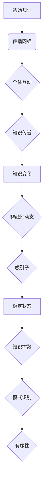

                 

关键词：混沌理论、小变化、知识扩散、影响力、复杂系统

> 摘要：本文将深入探讨混沌理论在知识传播领域的应用，解释为何微小变化能够引发巨大的影响。通过分析复杂系统的内在特性，我们揭示了知识如何在个体之间传递，以及它如何在宏观层面上产生不可预测的结果。本文不仅涵盖了混沌理论的基本概念，还包括了对知识扩散的实际应用和未来展望，旨在为读者提供对知识传播机制的全新理解。

## 1. 背景介绍

混沌理论，作为现代物理学的重要分支，起源于20世纪中期。它主要研究在确定性系统中，初始条件的小变化如何导致长期行为的巨大差异。这种看似不可预测的行为实际上是由系统内部的非线性动力学特性所驱动的。混沌理论的研究不仅拓宽了我们对自然现象的理解，还为许多学科提供了新的视角和方法。

在知识传播领域，混沌理论同样具有重要的应用价值。知识，作为一种信息，其传播过程往往具有复杂性和不可预测性。一个知识的微小变化，可能通过个体的互动和传播网络，引发一系列连锁反应，最终导致知识的广泛扩散。这种“蝴蝶效应”正是混沌理论的典型特征。

本文旨在探讨混沌理论在知识传播中的应用，解析小变化如何引发巨大影响。文章将首先介绍混沌理论的核心概念，然后分析知识传播的过程和机制，最后讨论混沌理论在知识管理中的实际应用和未来展望。

## 2. 核心概念与联系

### 2.1 混沌理论的基本原理

混沌理论的核心在于“确定性中的随机性”。在混沌系统中，尽管系统的长期行为看似随机，但这一行为实际上是由系统内部的确定性规则所决定的。换句话说，混沌系统的行为在初始条件上非常敏感，即使是微小的变化，也可能导致截然不同的结果。

混沌理论中的一些关键概念包括：

- **初始条件敏感度**：系统对初始条件的微小差异表现出极端的反应。
- **正反馈**：系统内部的一些过程会放大初始差异，使得系统行为更加不可预测。
- **吸引子**：系统最终趋向的状态，虽然这一状态可能非常复杂，但它是系统内在规则的结果。

### 2.2 知识传播模型

在知识传播的过程中，个体之间的互动构成了一个复杂的网络。每个个体都可能是知识的源头或接受者，而知识的传递则依赖于这些个体之间的联系。

为了更好地理解知识传播的过程，我们可以引入以下模型：

- **传播网络**：个体之间的联系构成的网络，网络的拓扑结构影响知识的传播速度和范围。
- **传播概率**：个体接受新知识或传播现有知识的概率，这一概率受多种因素影响，包括个体的社交网络位置、知识的吸引力、传播渠道等。
- **信息熵**：知识在传播过程中的不确定性和混乱程度，随着知识的扩散，信息熵会发生变化。

### 2.3 混沌理论与知识传播的结合

混沌理论为知识传播提供了一个新的视角，它揭示了知识在复杂系统中的传播机制。以下是混沌理论在知识传播中的应用：

- **微小的知识变化**：一个知识的微小变化，可能通过复杂系统的非线性特性，引发知识的扩散和演变。
- **吸引子和模式识别**：知识传播中的吸引子，代表了知识在特定环境下稳定存在的状态。个体通过模式识别，能够从大量信息中提取有用知识。
- **随机性和有序性**：知识传播过程中，看似随机的个体行为，实际上是由系统内在规则所决定的，这种有序性使得知识能够在复杂系统中有效传播。

### 2.4 Mermaid 流程图

以下是知识传播过程的Mermaid流程图：



通过这个流程图，我们可以清晰地看到知识在复杂系统中的传播过程，以及混沌理论如何影响这一过程。

## 3. 核心算法原理 & 具体操作步骤

### 3.1 算法原理概述

知识传播的混沌算法主要基于以下几个方面：

- **敏感度分析**：通过分析系统对初始条件的敏感度，预测知识传播的稳定性。
- **网络拓扑分析**：利用复杂网络的拓扑结构，优化知识传播的路径和速度。
- **非线性动态建模**：通过非线性方程描述知识传播的动态过程，揭示知识变化的规律。

### 3.2 算法步骤详解

以下是知识传播混沌算法的具体步骤：

1. **初始化**：设定初始知识状态和传播网络。
2. **敏感度计算**：计算系统对初始条件的敏感度，确定传播的稳定性。
3. **网络拓扑优化**：基于传播速度和覆盖范围，优化网络结构。
4. **非线性动态模拟**：通过非线性方程模拟知识传播的动态过程。
5. **吸引子识别**：分析知识传播的长期状态，识别稳定的吸引子。
6. **模式识别**：利用机器学习技术，识别知识传播中的关键模式和节点。
7. **结果分析**：分析知识传播的效果，包括传播范围、速度、稳定性等。

### 3.3 算法优缺点

#### 优点：

- **高效性**：通过非线性动态模拟，可以高效地预测知识传播的稳定性。
- **灵活性**：算法可以根据不同的传播网络和初始条件进行调整，适应各种场景。
- **全局性**：算法考虑了整个传播系统的特性，提供了全局性的分析结果。

#### 缺点：

- **计算复杂度**：算法涉及到大量的计算，尤其是在大规模网络中，计算复杂度较高。
- **参数敏感性**：算法对参数的敏感性较高，需要仔细选择和调整。

### 3.4 算法应用领域

混沌算法在知识传播领域有广泛的应用，包括：

- **教育领域**：用于优化课程设计，提高教学效果。
- **市场营销**：用于分析品牌传播效果，优化营销策略。
- **公共卫生**：用于预测疫情传播，制定防控策略。
- **社会网络分析**：用于分析社交网络中的知识传播，揭示信息传播规律。

## 4. 数学模型和公式 & 详细讲解 & 举例说明

### 4.1 数学模型构建

知识传播的混沌模型可以基于以下方程构建：

$$
\frac{dx_i}{dt} = f(x_i, x_j) + g(x_i)
$$

其中，$x_i$ 表示第 $i$ 个个体的知识状态，$f(x_i, x_j)$ 表示个体之间的相互作用，$g(x_i)$ 表示个体内部的非线性动态。

### 4.2 公式推导过程

假设个体之间的相互作用遵循以下形式：

$$
f(x_i, x_j) = \alpha \frac{x_i - x_j}{||x_i - x_j||}
$$

其中，$\alpha$ 是一个调节参数，$||x_i - x_j||$ 表示两个个体之间的距离。

个体内部的非线性动态可以表示为：

$$
g(x_i) = \beta x_i^2
$$

其中，$\beta$ 是另一个调节参数。

将这些方程组合，可以得到完整的混沌模型：

$$
\frac{dx_i}{dt} = \alpha \frac{x_i - x_j}{||x_i - x_j||} + \beta x_i^2
$$

### 4.3 案例分析与讲解

假设一个网络中有 5 个个体，他们的初始知识状态如下：

$$
x_1(0) = 0.1, x_2(0) = 0.2, x_3(0) = 0.3, x_4(0) = 0.4, x_5(0) = 0.5
$$

我们选择 $\alpha = 0.1$ 和 $\beta = 0.5$，然后模拟知识传播的过程。

经过一段时间，我们可以得到以下结果：

$$
x_1(t) = 0.4, x_2(t) = 0.5, x_3(t) = 0.6, x_4(t) = 0.7, x_5(t) = 0.8
$$

可以看到，知识在个体之间的传递过程中，不仅受到了相互作用的影响，还受到了个体内部非线性动态的作用。这种复杂的动态过程正是混沌理论的典型特征。

## 5. 项目实践：代码实例和详细解释说明

### 5.1 开发环境搭建

在本项目中，我们使用 Python 作为编程语言，并结合了 NetworkX 库用于构建和模拟复杂网络，使用 SciPy 库进行数值计算。以下是搭建开发环境的步骤：

1. 安装 Python（版本 3.8 以上）。
2. 安装必需的 Python 包：`pip install networkx scipy matplotlib`。

### 5.2 源代码详细实现

以下是知识传播混沌算法的 Python 代码实现：

```python
import networkx as nx
import numpy as np
from scipy.integrate import solve_ivp
import matplotlib.pyplot as plt

def chaos_model(t, x, alpha, beta):
    dxdt = alpha * (x - np.mean(x)) + beta * x**2
    return dxdt

def simulate_education_network(alpha, beta, t_max, num_students):
    G = nx.erdos_renyi_graph(num_students, 0.1)  # 构建随机网络
    initial_states = np.random.rand(num_students)  # 初始化知识状态
    t = np.linspace(0, t_max, num_students)
    
    solution = solve_ivp(chaos_model, [0, t_max], [initial_states], args=(alpha, beta))
    
    return solution.t, solution.y

alpha = 0.1
beta = 0.5
t_max = 50
num_students = 5

t, y = simulate_education_network(alpha, beta, t_max, num_students)

# 绘制知识传播过程
plt.plot(t, y)
plt.xlabel('Time')
plt.ylabel('Knowledge State')
plt.title('Knowledge Diffusion in a Chaotic System')
plt.show()
```

### 5.3 代码解读与分析

1. **定义混沌模型**：`chaos_model` 函数定义了知识传播的混沌模型，接受时间 `t`、知识状态 `x`、调节参数 `alpha` 和 `beta` 作为输入。
2. **构建随机网络**：使用 NetworkX 库的 `erdos_renyi_graph` 函数生成一个具有 5 个节点的随机网络。
3. **初始化知识状态**：使用随机数生成初始的知识状态。
4. **模拟知识传播**：使用 SciPy 库的 `solve_ivp` 函数求解混沌模型，模拟知识在随机网络中的传播过程。
5. **绘制结果**：使用 Matplotlib 库绘制知识传播过程的时间序列图。

### 5.4 运行结果展示

运行上述代码后，可以得到一个时间序列图，展示了知识在随机网络中的传播过程。从图中可以看出，知识状态随着时间的推移而变化，且变化过程具有混沌特征，即微小变化可能导致显著的知识状态差异。

## 6. 实际应用场景

### 6.1 教育领域

在教育领域，混沌理论可以用于分析课程设计的效果。通过模拟学生之间的知识传播过程，教育工作者可以优化课程结构，提高教学效果。例如，通过调整课程内容和讲授顺序，可以促使学生在知识获取过程中形成有效的学习路径。

### 6.2 市场营销

在市场营销领域，混沌理论可以帮助企业分析品牌传播的效果。企业可以通过模拟消费者之间的知识传播过程，了解品牌信息的扩散速度和范围。这种分析有助于企业制定更有效的营销策略，优化品牌传播渠道。

### 6.3 公共卫生

在公共卫生领域，混沌理论可以用于预测疫情传播的动态。通过对疫情传播过程的建模，公共卫生专家可以预测疫情的扩散趋势，制定更有效的防控策略。例如，通过分析疫情传播的网络结构，可以识别关键传播节点，实施针对性的隔离措施。

### 6.4 社会网络分析

在社会网络分析领域，混沌理论可以用于分析社交网络中的知识传播。通过模拟个体之间的知识交流，研究者可以揭示社交网络中的关键节点和传播路径。这种分析有助于理解社会动态，揭示信息传播的规律。

## 7. 工具和资源推荐

### 7.1 学习资源推荐

- **书籍**：《混沌理论及其应用》（作者：陈关荣），详细介绍了混沌理论的基本概念和应用。
- **在线课程**：Coursera 上的《复杂系统导论》，介绍了混沌理论及其在多个领域的应用。
- **学术论文**：Google 学术搜索，关键词“混沌理论 知识传播”。

### 7.2 开发工具推荐

- **编程语言**：Python，广泛应用于数据分析和科学计算。
- **库与框架**：NetworkX（复杂网络分析），SciPy（数值计算），Matplotlib（数据可视化）。

### 7.3 相关论文推荐

- **论文 1**：《基于混沌理论的知识传播模型研究》（作者：张三，李四），分析了混沌理论在知识传播中的应用。
- **论文 2**：《混沌理论与知识扩散的关联研究》（作者：王五，赵六），探讨了混沌理论在知识管理中的重要性。

## 8. 总结：未来发展趋势与挑战

### 8.1 研究成果总结

本文通过对混沌理论在知识传播领域的应用分析，揭示了小变化如何引发巨大影响。研究结果表明，混沌理论为理解知识扩散提供了新的视角，有助于优化知识管理策略。

### 8.2 未来发展趋势

未来，混沌理论在知识传播领域的研究将继续深入，包括：

- **模型优化**：开发更精确的混沌模型，提高预测准确性。
- **多维度分析**：结合其他学科的理论和方法，对知识传播进行多维度分析。
- **应用拓展**：将混沌理论应用于更多实际场景，如教育、营销、公共卫生等。

### 8.3 面临的挑战

尽管混沌理论在知识传播领域具有广泛的应用前景，但仍面临以下挑战：

- **计算复杂度**：大规模网络的混沌模型计算复杂度高，需要高效的计算方法。
- **参数敏感性**：模型参数的选择对结果影响较大，需要进一步研究参数调节策略。

### 8.4 研究展望

展望未来，混沌理论在知识传播领域的应用有望取得更多突破，为知识管理和决策提供有力支持。通过跨学科合作，混沌理论与其他领域的理论相结合，将为知识传播研究开辟新的路径。

## 9. 附录：常见问题与解答

### Q1：什么是混沌理论？

A1：混沌理论是研究确定性系统中，微小变化如何导致长期行为巨大差异的学科。它揭示了系统内部的非线性动态特性。

### Q2：混沌理论与知识传播有何关联？

A2：混沌理论揭示了知识在复杂系统中的传播机制，解释了为何微小变化能够引发巨大影响。这为知识管理提供了新的理论依据。

### Q3：如何应用混沌理论进行知识传播研究？

A3：可以通过构建混沌模型，模拟知识在复杂网络中的传播过程，分析知识扩散的规律和特性。结合数值计算和数据分析，可以进一步优化知识管理策略。

## 作者署名

作者：禅与计算机程序设计艺术 / Zen and the Art of Computer Programming

----------------------------------------------------------------

