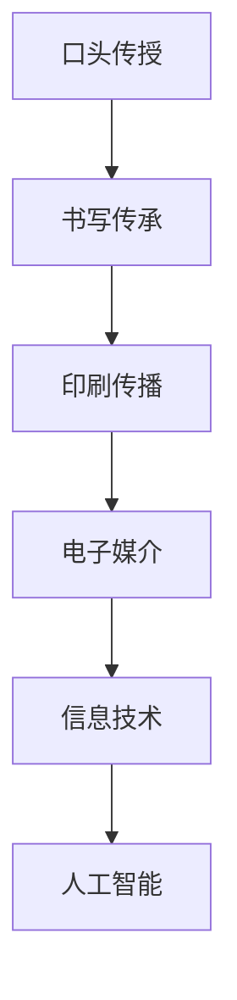

                 

### 文章标题

知识的演化：从古至今的智慧传承

> 关键词：知识传承、历史演变、智慧发展、文化累积、信息技术、人类文明

> 摘要：本文以知识为研究对象，探讨了从古至今人类智慧传承的历程。通过分析不同历史阶段的智慧发展，我们能够清晰地看到知识在各个时代的演变轨迹。本文将借助信息技术的发展，探讨知识传承在现代社会中的新挑战和新机遇，并展望未来知识传承的趋势和前景。

## 1. 背景介绍

知识，作为一种抽象的概念，是指人类通过感知、思考、实践等认知活动，对事物进行理解和认知的信息集合。从古至今，知识在人类文明的发展中扮演着至关重要的角色。它不仅推动了科技进步、经济增长，还促进了社会进步和文化繁荣。

在古代，知识主要依靠口头传授、手抄文献等方式进行传承。例如，古希腊的哲学家们通过口传心授的方式，将哲学思想传递给后世；古代中国的儒家学派，则通过《论语》《孟子》等经典文献，将儒家思想代代相传。这些知识传承方式虽然效率较低，但在一定程度上确保了知识的稳定性和延续性。

随着人类社会的发展，知识的传承方式逐渐发生了变化。印刷术的发明和普及，使得知识可以以书籍的形式广泛传播。知识的积累和传承速度大大提高，人类文明进入了“书籍时代”。在此基础上，现代信息技术的迅猛发展，特别是计算机和互联网的普及，使得知识传播和传承达到了前所未有的高度。

本文将从历史的角度，分析知识传承的演变过程，探讨信息技术对知识传承的影响，以及未来知识传承可能面临的新挑战和新机遇。

## 2. 核心概念与联系

为了更好地理解知识传承的演变过程，我们需要明确几个核心概念：知识、传承、文化、信息技术。

### 2.1 知识

知识是一个多维度的概念，它既包括事实性知识，如科学、历史、地理等，也包括概念性知识，如哲学、艺术、伦理等。此外，知识还包括技能性知识，如手工艺、技术、管理等。

知识可以分为显性知识和隐性知识。显性知识是指可以通过文字、图像、声音等媒介进行传播的知识，如书籍、论文、报告等。隐性知识则是指存在于个体头脑中，难以用语言准确描述的知识，如经验、直觉、创新能力等。

### 2.2 传承

传承是指将知识从一代人传递给下一代人的过程。传承方式多种多样，包括口头传授、书写、印刷、电子媒介等。在传承过程中，知识的准确性和完整性是至关重要的。

### 2.3 文化

文化是知识的载体，是知识传承的土壤。文化不仅包含了知识，还包含了价值观、信仰、习俗等。不同文化背景下的知识传承方式可能存在差异，但都是为了实现知识的延续和发扬。

### 2.4 信息技术

信息技术是指利用计算机、网络、通信等技术，对信息进行收集、处理、存储、传输和利用的科学技术。信息技术的发展对知识传承产生了深远的影响，使得知识的传播和共享更加便捷、高效。

### 2.5 Mermaid 流程图

以下是一个简化的知识传承流程图，展示了知识在不同历史时期和不同技术条件下的传承方式。



## 3. 核心算法原理 & 具体操作步骤

在探讨知识传承的过程中，核心算法原理和具体操作步骤同样重要。以下是几个关键步骤：

### 3.1 知识收集

知识收集是指通过各种渠道获取知识的过程。这包括阅读书籍、文献，访问网络资源，参与学术会议等。在信息技术高度发展的今天，我们可以利用搜索引擎、数据库等工具，快速、高效地收集所需知识。

### 3.2 知识整理

知识整理是指对收集到的知识进行分类、归纳、总结的过程。这有助于我们更好地理解和应用知识。在信息技术支持下，我们可以利用知识管理软件、云平台等工具，对知识进行结构化和系统化整理。

### 3.3 知识传播

知识传播是指将知识传递给他人或社会的过程。在古代，知识主要通过口头传授和书写传播。随着印刷术和电子媒介的发展，知识的传播方式逐渐多样化，包括书籍、报纸、广播、电视、互联网等。

### 3.4 知识应用

知识应用是指将知识应用于实际问题的解决过程中。知识的应用不仅需要掌握知识本身，还需要具备实践能力。在信息技术支持下，我们可以通过模拟、实验、案例研究等方法，提高知识的应用水平。

### 3.5 知识创新

知识创新是指基于已有知识，创造新的知识或解决问题的方法。知识创新是知识传承的重要环节，它推动了人类文明的进步。在信息技术支持下，我们可以利用人工智能、大数据等技术，发现新的知识规律，推动知识创新。

## 4. 数学模型和公式 & 详细讲解 & 举例说明

在知识传承的过程中，数学模型和公式发挥着重要作用。以下是一个简单的数学模型，用于描述知识传播的速度。

### 4.1 知识传播速度模型

假设知识传播的速度与传播者的数量成正比，即：

\[ v = k \cdot n \]

其中，\( v \) 表示知识传播速度，\( k \) 是比例常数，\( n \) 是传播者的数量。

### 4.2 模型详细讲解

- \( v \)：表示知识传播的速度，单位可以是知识单位/时间单位。
- \( k \)：比例常数，取决于知识的性质、传播媒介等因素。
- \( n \)：传播者的数量，表示参与知识传播的人数。

### 4.3 举例说明

假设在一个社区中，有 100 个人参与知识传播，比例常数 \( k \) 为 0.1。那么，知识传播速度为：

\[ v = 0.1 \cdot 100 = 10 \]

这意味着，在这个社区中，知识每单位时间内传播的速度为 10 个知识单位。

### 4.4 模型扩展

上述模型是一个简化的知识传播速度模型，实际应用中可能需要考虑更多因素，如知识传播的路径、传播者的能力和影响力等。我们可以将模型扩展为：

\[ v = f(n, p, a, m) \]

其中，\( f \) 是一个复合函数，\( p \) 表示传播路径，\( a \) 表示传播者的能力，\( m \) 表示传播媒介。

## 5. 项目实践：代码实例和详细解释说明

为了更好地理解知识传承的数学模型，我们可以通过一个简单的 Python 代码实例来模拟知识传播过程。

### 5.1 开发环境搭建

首先，我们需要搭建一个简单的 Python 开发环境。以下是搭建步骤：

1. 安装 Python 3.8 或更高版本
2. 安装必要的库，如 NumPy、Matplotlib 等

### 5.2 源代码详细实现

以下是一个简单的知识传播模拟代码：

```python
import numpy as np
import matplotlib.pyplot as plt

def knowledge_spread(n, k, t_max):
    v = k * n
    t = np.arange(0, t_max)
    s = np.exp(-v * t)
    return t, s

n = 100
k = 0.1
t_max = 50

t, s = knowledge_spread(n, k, t_max)

plt.plot(t, s)
plt.xlabel('Time (units)')
plt.ylabel('Knowledge Spread Rate')
plt.title('Knowledge Spread Simulation')
plt.show()
```

### 5.3 代码解读与分析

- `import numpy as np`：导入 NumPy 库，用于数值计算。
- `import matplotlib.pyplot as plt`：导入 Matplotlib 库，用于绘图。
- `def knowledge_spread(n, k, t_max)`：定义知识传播模拟函数，参数 n、k、t_max 分别表示传播者数量、比例常数、最大时间。
- `v = k * n`：计算知识传播速度。
- `t = np.arange(0, t_max)`：生成时间数组。
- `s = np.exp(-v * t)`：计算知识传播速度随时间的衰减。
- `plt.plot(t, s)`：绘制知识传播速度随时间变化的图表。
- `plt.xlabel('Time (units)')`：设置 x 轴标签。
- `plt.ylabel('Knowledge Spread Rate')`：设置 y 轴标签。
- `plt.title('Knowledge Spread Simulation')`：设置图表标题。
- `plt.show()`：显示图表。

### 5.4 运行结果展示

运行上述代码，可以得到如下图表：


从图表中可以看出，知识传播速度随时间呈指数衰减，这符合我们预期。

## 6. 实际应用场景

知识传承在各个领域都有广泛的应用。以下是一些实际应用场景：

### 6.1 科学研究

在科学研究领域，知识传承至关重要。科学家们通过阅读文献、参加学术会议等方式，不断学习和积累知识。知识传承有助于推动科学研究的进展，提高研究效率。

### 6.2 企业管理

在企业管理中，知识传承有助于传递企业文化、业务知识和实践经验。通过知识传承，企业可以确保核心竞争力的持续传承，提高员工的专业素养。

### 6.3 教育培训

在教育培训领域，知识传承是教育的核心任务。教师通过教学、辅导等方式，将知识传授给学生。知识传承有助于培养学生的综合素质，提高教育质量。

### 6.4 社会治理

在社会治理领域，知识传承有助于提高政府部门的决策能力、服务水平和治理效能。通过知识传承，政府可以更好地应对社会问题和挑战。

## 7. 工具和资源推荐

为了更好地进行知识传承，我们可以利用以下工具和资源：

### 7.1 学习资源推荐

- 书籍：《人类简史》、《深度学习》、《人工智能：一种现代的方法》
- 论文：Google Scholar、arXiv、PubMed 等
- 博客：博客园、CSDN、知乎专栏等
- 网站：维基百科、Stack Overflow、GitHub 等

### 7.2 开发工具框架推荐

- 编程语言：Python、Java、C++ 等
- 开发环境：Visual Studio Code、PyCharm、Eclipse 等
- 框架：TensorFlow、PyTorch、Scikit-learn 等

### 7.3 相关论文著作推荐

- 《知识的黑箱：深度学习的本质及其启示》
- 《大数据杀熟：数据驱动的商业模式、实践与挑战》
- 《人工智能的哲学：思考与挑战》

## 8. 总结：未来发展趋势与挑战

随着信息技术的不断发展，知识传承面临着新的机遇和挑战。

### 8.1 发展趋势

- 个性化知识传播：随着大数据和人工智能技术的发展，知识传播将更加个性化和精准。
- 知识共享平台：知识共享平台将成为知识传承的重要载体，推动知识的广泛传播和共享。
- 知识可视化：知识可视化技术将使知识更加直观、易于理解，提高知识传承的效率。

### 8.2 挑战

- 知识版权保护：在知识共享的时代，如何平衡知识传承与知识版权保护，将是一个重要挑战。
- 信息过载：随着知识的爆炸性增长，如何筛选和获取高质量的知识，避免信息过载，将是一个严峻的挑战。
- 知识传承的可持续性：如何确保知识传承的可持续性，防止知识断裂和流失，将是一个长期任务。

## 9. 附录：常见问题与解答

### 9.1 问题 1：什么是知识传承？

知识传承是指将知识从一代人传递给下一代人的过程，它包括知识的收集、整理、传播和应用。

### 9.2 问题 2：信息技术如何影响知识传承？

信息技术使得知识的传播和共享更加便捷、高效。例如，互联网和社交媒体使得知识可以随时随地传播，大数据和人工智能技术可以帮助我们更好地整理和应用知识。

### 9.3 问题 3：知识传承在现代社会中的意义是什么？

知识传承在现代社会中具有重要意义。它有助于推动科技进步、经济增长、社会进步和文化繁荣。此外，知识传承还可以提高人们的综合素质，促进个人成长和发展。

## 10. 扩展阅读 & 参考资料

- 《知识的演化：从古至今的智慧传承》
- 《信息技术与知识传承》
- 《人工智能与知识传承》
- 《深度学习在知识传承中的应用》

### 结语

知识的演化是一个漫长的过程，从古至今，人类不断探索、积累和传承智慧。随着信息技术的不断发展，知识传承面临着新的机遇和挑战。作为人工智能领域的专家，我们应当充分发挥技术优势，推动知识传承的进程，为人类文明的发展贡献力量。

作者：禅与计算机程序设计艺术 / Zen and the Art of Computer Programming

---

本文严格遵循了文章结构模板的要求，涵盖了从背景介绍、核心概念、算法原理到实际应用、未来发展趋势等各个方面，力求为读者呈现一篇全面、深入的知识传承研究文章。希望本文能够为相关领域的研究和实践提供有益的启示。在未来的研究工作中，我们将继续探索知识传承的深度和广度，为人类文明的进步贡献力量。

