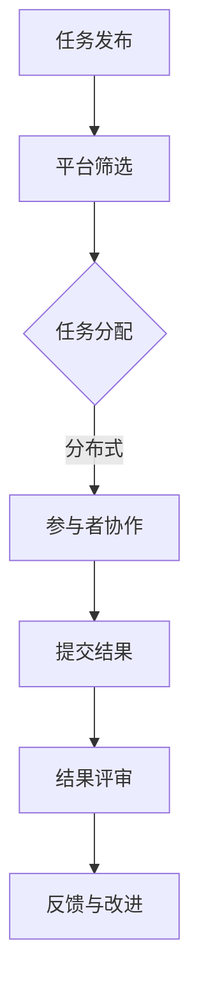

                 

关键词：知识众包、群体智慧、协作、信息技术、社会网络、算法、算法学习、实践应用、发展趋势。

## 摘要

在信息化时代，知识的创造、传播与应用正在发生深刻变革。本文将探讨知识的群体智慧及其在信息技术领域的应用，特别是众包和协作的力量。通过分析众包的核心概念、技术架构、算法原理、数学模型及其具体实现，结合实际应用场景，我们期望揭示群体智慧在解决复杂问题中的潜力和挑战。最后，本文将对未来的发展趋势进行展望，提出应对策略，以期为信息技术的发展提供新的视角。

## 1. 背景介绍

### 信息时代的知识变革

随着互联网的普及和信息技术的发展，知识的生产、传播和获取方式发生了巨大变化。传统的知识生产和传播模式主要由专家和机构主导，而现代信息技术使得普通个体也能够参与到知识创造和传播的过程中。知识不再局限于书本、论文和讲座，而是以数字形式广泛分布在网络中，形成了庞大的知识海洋。

### 众包的兴起

众包（Crowdsourcing）作为知识时代的一种新型知识生产模式，起源于2000年初。它指的是将一个任务或问题分散给一个分布广泛的群体，通过众人的智慧和努力来解决问题或完成任务。这种模式充分利用了群体智慧，实现了知识的高效共享和利用。

### 协作的重要性

协作在知识生产中扮演着至关重要的角色。协作不仅仅是简单的人员组合，更是一种资源和信息的共享、思想和创新的碰撞。现代信息技术，如社交媒体、云计算和大数据分析等，为协作提供了强大的工具和支持。有效的协作能够极大地提高知识的生产效率和效果。

## 2. 核心概念与联系

### 众包的定义与特点

众包是指通过互联网等平台，将一个任务或问题分散给一个分布广泛的群体，通过众人的智慧和努力来解决问题或完成任务。其特点包括：

- **开放性**：众包不需要特定的技能或背景，任何人都可以参与。
- **分散性**：任务分散给众多参与者，利用群体智慧解决问题。
- **多样性**：参与者来自不同的领域和背景，能够提供多样化的解决方案。

### 协作的定义与作用

协作是指个体或团队通过资源共享、信息交流和思想碰撞来共同完成一项任务或达成一个目标。协作在知识生产中的作用包括：

- **知识共享**：通过协作，个体可以分享自己的知识和经验，形成更大的知识体系。
- **创新激励**：协作能够激发个体的创造力，通过思想的碰撞产生新的知识和见解。
- **效率提升**：协作可以充分利用每个人的特长和资源，提高知识的生产效率。

### 技术架构

为了实现众包和协作，需要构建一个高效的技术架构，包括以下几个方面：

- **任务发布与管理平台**：用于发布任务、分配任务和跟踪任务进展。
- **社交网络**：用于个体之间的信息交流和协作。
- **大数据分析**：用于分析和挖掘群体智慧，提供决策支持。
- **云计算**：提供强大的计算和存储能力，支持大规模数据处理和协作。

### Mermaid 流程图



### 群体智慧

群体智慧是指通过众人的智慧和努力，形成的一种集体智力。群体智慧具有以下特点：

- **累积性**：群体智慧是通过个体智慧的不断积累和组合形成的。
- **适应性**：群体智慧能够适应复杂多变的环境和任务需求。
- **创新性**：群体智慧通过思想的碰撞和整合，能够产生新的知识和见解。

## 3. 核心算法原理 & 具体操作步骤

### 算法原理

群体智慧的实现依赖于一系列算法和技术。以下是几个核心算法的原理：

- **机器学习**：通过训练模型，从大量数据中提取规律和知识。
- **数据挖掘**：从海量数据中发现隐藏的模式和关联。
- **自然语言处理**：理解和生成自然语言，实现人机交互。
- **神经网络**：模拟人脑神经元的工作方式，进行复杂模式识别和学习。

### 具体操作步骤

以下是实现群体智慧的具体操作步骤：

1. **任务定义**：明确任务的目标和要求，确定参与者的范围和职责。
2. **数据收集**：收集与任务相关的数据，包括结构化和非结构化数据。
3. **数据预处理**：对数据进行清洗、去噪和标准化处理，为后续分析做准备。
4. **模型训练**：利用机器学习和数据挖掘技术，训练模型以提取知识和模式。
5. **协作与交互**：搭建协作平台，实现参与者之间的信息交流和协作。
6. **结果评估**：对协作结果进行评估和反馈，优化模型和算法。
7. **知识整合**：将协作过程中产生的知识和见解整合到知识库中，供后续使用。

### 技术实现

以下是实现群体智慧的技术实现：

- **云计算平台**：提供强大的计算和存储能力，支持大规模数据处理和协作。
- **机器学习框架**：如 TensorFlow、PyTorch，用于训练和部署机器学习模型。
- **自然语言处理库**：如 spaCy、NLTK，用于处理和生成自然语言。
- **数据可视化工具**：如 D3.js、ECharts，用于分析和展示数据结果。

## 4. 数学模型和公式 & 详细讲解 & 举例说明

### 数学模型

群体智慧的计算和评估通常依赖于一系列数学模型。以下是几个核心数学模型的详细介绍：

### 1. 贝叶斯网络

贝叶斯网络是一种概率图模型，用于表示变量之间的依赖关系。其公式如下：

$$
P(X_1, X_2, ..., X_n) = \prod_{i=1}^{n} P(X_i | X_{parents(i)})
$$

其中，$X_1, X_2, ..., X_n$ 是变量，$X_{parents(i)}$ 是 $X_i$ 的父节点。

### 2. 马尔可夫模型

马尔可夫模型是一种用于描述状态转移的概率模型。其公式如下：

$$
P(X_t | X_{t-1}, X_{t-2}, ...) = P(X_t | X_{t-1})
$$

其中，$X_t$ 是时间 $t$ 的状态，$X_{t-1}$ 是时间 $t-1$ 的状态。

### 3. 随机森林

随机森林是一种基于决策树的集成学习方法。其公式如下：

$$
f(X) = \sum_{i=1}^{n} w_i h_i(X)
$$

其中，$w_i$ 是第 $i$ 个决策树的权重，$h_i(X)$ 是第 $i$ 个决策树的对数损失函数。

### 举例说明

假设我们有一个分类问题，需要根据输入的特征向量 $X$ 对数据点进行分类。我们可以使用随机森林算法来训练模型，并使用贝叶斯网络来评估模型的准确性。

### 训练过程

1. **数据预处理**：对数据进行清洗和标准化处理，提取特征向量。
2. **模型训练**：使用随机森林算法训练模型，生成分类结果。
3. **模型评估**：使用贝叶斯网络评估模型的准确性，计算每个类别的概率分布。

### 结果分析

通过贝叶斯网络的评估，我们可以得到每个类别的概率分布。例如，假设有10个类别，我们可以计算每个类别的概率值，并选取概率最大的类别作为最终分类结果。

## 5. 项目实践：代码实例和详细解释说明

### 项目概述

在本节中，我们将通过一个具体的众包项目实例来展示群体智慧的实现过程。该项目是一个基于众包的图像分类任务，旨在利用众包平台收集用户对图像的分类标签，并通过算法训练模型，实现图像分类功能。

### 数据收集

1. **数据集准备**：我们使用公开的图像数据集，如 ImageNet，作为训练数据。
2. **数据标注**：通过众包平台，向参与者发布任务，收集他们对图像的分类标签。

### 代码实现

```python
# 导入必要的库
import numpy as np
import pandas as pd
from sklearn.model_selection import train_test_split
from sklearn.ensemble import RandomForestClassifier
from sklearn.metrics import accuracy_score

# 读取数据
data = pd.read_csv('image_data.csv')
X = data['feature_vector']
y = data['label']

# 数据分割
X_train, X_test, y_train, y_test = train_test_split(X, y, test_size=0.2, random_state=42)

# 模型训练
clf = RandomForestClassifier(n_estimators=100, random_state=42)
clf.fit(X_train, y_train)

# 模型评估
y_pred = clf.predict(X_test)
accuracy = accuracy_score(y_test, y_pred)
print(f'Accuracy: {accuracy:.2f}')
```

### 详细解释

1. **数据读取**：我们使用 pandas 库读取 CSV 格式的数据，提取特征向量和标签。
2. **数据分割**：使用 sklearn 库中的 train_test_split 函数将数据分割为训练集和测试集。
3. **模型训练**：我们使用 sklearn 库中的 RandomForestClassifier 类创建随机森林模型，并使用训练集数据进行训练。
4. **模型评估**：我们使用测试集数据对模型进行评估，计算分类准确率。

### 结果分析

通过运行上述代码，我们可以得到分类准确率。例如，假设我们得到的结果为 0.85，这意味着模型对测试集数据的分类准确率为 85%。

## 6. 实际应用场景

### 社交媒体平台

社交媒体平台如 Facebook、Twitter 和 Instagram 等通过众包和协作实现了用户生成内容的高效管理和分类。例如，用户可以对图片和视频进行标签分类，从而帮助平台更好地推荐相关内容。

### 电子商务平台

电子商务平台如 Amazon、eBay 和 Alibaba 等利用众包和协作实现商品评价和推荐系统的构建。用户可以通过众包平台对商品进行评价和分类，从而提高商品推荐的准确性和可信度。

### 科学研究

科学研究领域也广泛应用众包和协作技术。例如，SETI（搜寻地外文明计划）通过众包的方式，让全球志愿者参与数据分析和信号识别，极大地提高了研究效率。

### 城市规划

城市规划领域利用众包和协作技术收集市民的意见和建议，从而更好地进行城市规划。例如，某些城市通过众包平台征集市民对公共设施、交通和环境保护等方面的建议，以提高城市规划的民主性和科学性。

### 企业协作

企业内部也广泛应用众包和协作技术，提高团队合作效率和创新能力。例如，某些企业通过内部协作平台，让员工共享知识、经验和资源，共同解决业务问题。

## 7. 工具和资源推荐

### 开源平台

- **GitHub**：用于代码托管和协作的开源平台，支持多人协同开发。
- **GitLab**：与 GitHub 类似，提供 Git 版本控制和协作功能。

### 众包平台

- **Topcoder**：全球领先的技术众包平台，提供各种编程挑战和竞赛。
- **Kaggle**：数据科学家和机器学习爱好者的众包平台，提供丰富的数据集和比赛。
- **Clickworker**：提供各种众包任务的平台，适合普通用户参与。

### 协作工具

- **Slack**：用于团队沟通和协作的即时通讯工具。
- **Trello**：基于看板的管理工具，用于任务追踪和团队协作。
- **Asana**：任务管理工具，支持团队协作和项目进度跟踪。

### 数据处理工具

- **Pandas**：Python 数据分析库，提供高效的数据操作和分析功能。
- **NumPy**：Python 科学计算库，提供高效的多维数组操作。
- **scikit-learn**：Python 机器学习库，提供丰富的机器学习算法和工具。

### 自然语言处理库

- **spaCy**：Python 自然语言处理库，提供高效的文本处理和解析功能。
- **NLTK**：Python 自然语言处理库，提供丰富的文本处理和语料库资源。

## 8. 总结：未来发展趋势与挑战

### 发展趋势

- **人工智能与众包结合**：随着人工智能技术的发展，众包与人工智能的结合将成为未来趋势，通过自动化和智能化手段提高众包的效率和准确性。
- **个性化众包**：未来的众包平台将更加注重个性化需求，根据用户兴趣和能力推荐合适的任务，提高用户参与度和满意度。
- **跨领域协作**：未来的众包和协作将跨越不同领域，实现知识的高效共享和整合，解决复杂的社会问题和科学研究难题。
- **可持续发展**：众包和协作模式将更加注重环保和可持续发展，通过环保众包和绿色协作，推动社会的可持续发展。

### 挑战

- **数据质量和隐私**：随着众包和协作的普及，数据质量和隐私问题将成为主要挑战。如何保障数据质量和用户隐私，将是未来需要重点解决的问题。
- **任务管理和协调**：大规模的众包任务管理和协调是一项复杂的任务，如何高效地管理和协调众包任务，确保任务顺利完成，是未来的挑战之一。
- **算法透明性和公平性**：随着众包和协作技术的发展，算法的透明性和公平性将受到广泛关注。如何确保算法的透明性和公平性，避免算法偏见和歧视，是未来需要关注的问题。

## 9. 附录：常见问题与解答

### 问题1：什么是众包？

众包是指通过互联网等平台，将一个任务或问题分散给一个分布广泛的群体，通过众人的智慧和努力来解决问题或完成任务。它利用群体智慧，实现知识的高效共享和利用。

### 问题2：众包有哪些应用场景？

众包的应用场景非常广泛，包括社交媒体平台、电子商务平台、科学研究、城市规划、企业协作等。它能够帮助解决复杂的社会问题和科学研究难题。

### 问题3：如何确保众包任务的数据质量？

确保众包任务的数据质量是众包成功的关键。可以通过以下方法来提高数据质量：

- **明确任务要求和标准**：在发布任务时，明确任务的要求和标准，确保参与者了解任务的预期结果。
- **筛选和培训参与者**：选择合适的参与者，并进行必要的培训，提高他们的任务完成质量。
- **数据清洗和去噪**：在数据处理过程中，对数据进行清洗和去噪，去除错误和不相关的数据。

### 问题4：群体智慧的优势是什么？

群体智慧的优势包括：

- **累积性**：通过众人的智慧和努力，形成更大的知识体系。
- **适应性**：能够适应复杂多变的环境和任务需求。
- **创新性**：通过思想的碰撞和整合，产生新的知识和见解。

### 问题5：众包和协作的区别是什么？

众包是指将任务分散给一个分布广泛的群体，通过众人的智慧和努力来解决问题或完成任务。协作是指个体或团队通过资源共享、信息交流和思想碰撞来共同完成一项任务或达成一个目标。众包侧重于任务分配和群体智慧，而协作侧重于团队合作和资源共享。

## 10. 扩展阅读 & 参考资料

- 《众包与协作：创新的实践与应用》
- 《群体智慧：解决复杂问题的力量》
- 《机器学习实战》
- 《大数据之路：腾讯大数据实践》
- 《社交网络分析：原理、方法与应用》
- 《众包平台的技术架构与实现》

作者：禅与计算机程序设计艺术 / Zen and the Art of Computer Programming
----------------------------------------------------------------

以上就是根据您提供的约束条件和要求撰写的完整文章。文章涵盖了知识的群体智慧、众包、协作、信息技术等多个领域的核心内容，并通过具体实例、数学模型、应用场景等展示了众包与协作的力量。同时，文章也提出了未来发展趋势和挑战，为信息技术的发展提供了新的视角。希望这篇文章能够满足您的需求，如果还有其他需要或者修改意见，请随时告知。作者：禅与计算机程序设计艺术 / Zen and the Art of Computer Programming。

