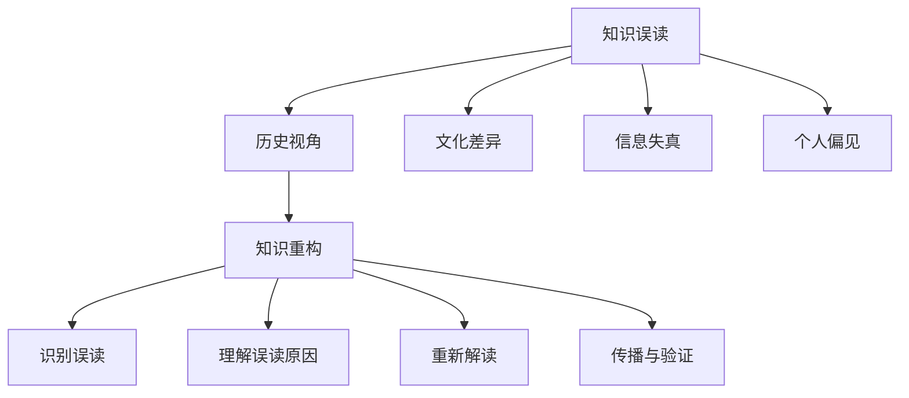

                 

### 1. 背景介绍

在现代信息技术飞速发展的时代，知识成为了推动社会进步和经济发展的核心动力。然而，知识传播的过程中不可避免地会伴随着误读和误解的现象。这些误读不仅影响了知识的准确性，更可能导致一系列的连锁反应，进而影响科学研究的进展、商业决策的准确性，乃至社会价值观的形成。本文旨在探讨知识的误读与重构现象，从历史视角出发，强调理解历史背景对正确解读知识的重要性。

知识误读现象的普遍性不可忽视。无论是学术领域的错误引用，还是大众媒体对科技新闻的曲解，都表明了知识传播过程中的不准确性。例如，某些流行的科技概念在被媒体报道时，常常被简化甚至扭曲，导致公众对这些概念的理解产生偏差。此外，一些历史事件和科学理论的解读，也可能因为缺乏全面的历史视角而显得片面和模糊。

历史视角的重要性在于它能够为我们的知识解读提供更为全面和准确的背景信息。历史视角使我们能够理解知识产生和发展的过程，认识不同时期社会、文化和技术的背景因素，从而避免对知识的误解和片面解读。例如，在研究计算机科学的发展历史时，了解早期计算机科学家的工作环境和科学思想，有助于我们更深入地理解现代计算机技术的起源和演变。

此外，历史视角还有助于我们认识到知识是动态演化的，而非静止不变的。通过历史视角，我们可以看到知识在不同时期的发展和变革，理解知识在不同社会和文化背景下的应用和影响。这种动态视角有助于我们更全面地认识知识的价值，并避免将知识视为绝对真理，而忽视了其历史背景和局限性。

本文将分为以下几个部分来探讨知识的误读与重构现象：首先，我们将深入探讨知识误读的常见原因和表现；其次，分析历史视角在知识解读中的作用，并通过具体案例来说明；然后，讨论历史视角在科技研究和商业决策中的重要性；接着，介绍几种常见的方法和工具，用于重构被误读的知识；随后，探讨历史视角在教育和大众传播中的影响；最后，总结全文，展望未来发展趋势和挑战。

通过对上述问题的探讨，本文希望能够唤起读者对知识误读现象的关注，并强调理解历史视角对于正确解读知识的重要性。只有这样，我们才能在信息爆炸的时代中，真正掌握知识的本质，推动科技和社会的持续进步。

### 2. 核心概念与联系

在深入探讨知识的误读与重构现象之前，我们需要明确几个核心概念，并探讨它们之间的联系。这些核心概念不仅构成了本文讨论的基础，也为我们理解知识误读和重构提供了必要的理论框架。

#### 2.1 知识误读的定义

知识误读是指对原有知识的错误理解或歪曲，这种错误可能是由多种因素引起的，包括信息失真、文化差异、个人偏见等。知识误读不仅仅是一个简单的错误，它可能对知识传播和应用产生深远的影响。例如，在科技领域，错误的科技知识解读可能导致不准确的商业决策，甚至可能对公共安全产生威胁。

#### 2.2 历史视角的重要性

历史视角是指从历史发展的角度去看待和分析事物。在知识解读中，历史视角的重要性体现在以下几个方面：

1. **理解知识产生的背景**：任何知识都不是孤立存在的，它总是在特定的历史、社会和文化背景下产生和发展。通过历史视角，我们可以理解知识背后的历史事件和社会变迁，从而避免对知识的片面解读。

2. **认识知识的动态演化**：知识是随着时间和环境的变化而不断演化的。历史视角使我们能够看到知识在不同时期的变化和适应性，这有助于我们理解知识的复杂性和多变性。

3. **避免知识僵化**：历史的视角有助于我们认识到知识并非绝对真理，而是随着时间和实践不断发展和完善的。这种动态视角有助于我们避免将知识视为僵化的教条，从而能够更加灵活地应用和扩展知识。

#### 2.3 知识重构的概念

知识重构是指对被误读或误解的知识进行重新解读和构建，以恢复其原始含义和准确性。知识重构的过程通常涉及以下几个步骤：

1. **识别误读**：首先，我们需要识别哪些知识存在误读现象。这可能需要通过对原始文献和资料的研究，以及对现有知识传播途径的审视。

2. **理解误读原因**：识别误读之后，我们需要分析误读产生的原因。这包括信息传递过程中的失真、文化差异、个人主观判断等因素。

3. **重新解读**：在理解误读原因的基础上，我们对其进行重新解读，以恢复知识的原始含义。这可能涉及对历史背景的重新审视，对原始文献的深入分析，以及对现有知识体系的重新构建。

4. **传播与验证**：最后，我们将重构的知识进行传播，并对其进行验证，以确保其准确性和实用性。

#### 2.4 历史视角与知识重构的联系

历史视角与知识重构之间存在密切的联系。历史视角为我们提供了理解知识背景和演变过程的重要工具，这有助于我们更准确地识别和重构被误读的知识。例如，在计算机科学领域，了解早期计算机科学家的工作背景和科学思想，有助于我们更深入地理解现代计算机技术的起源和发展。这种历史视角有助于我们避免对计算机科学知识的误解，从而更准确地重构这些知识。

此外，历史视角还可以帮助我们认识到知识重构的必要性。在科技迅速发展的今天，许多知识正在不断更新和变革。通过历史视角，我们可以看到知识在不同时期的适应性变化，从而更好地应对知识重构的需求。

#### 2.5 总结

通过上述对核心概念与联系的探讨，我们可以看到，知识误读、历史视角和知识重构这三个概念相互关联，共同构成了我们对知识传播和理解的重要视角。在接下来的章节中，我们将进一步探讨知识误读的具体表现和原因，分析历史视角在知识解读中的具体应用，以及探讨知识重构的方法和工具。

[Mermaid 流程图]


通过这个Mermaid流程图，我们可以清晰地看到知识误读、历史视角和知识重构之间的逻辑关系，以及各个概念在知识传播和理解过程中的具体作用。

### 3. 核心算法原理 & 具体操作步骤

为了更好地理解知识误读与重构的现象，我们首先需要深入探讨知识误读的算法原理，并详细说明具体的操作步骤。在这一部分，我们将详细阐述知识误读的常见算法原理，以及如何通过这些算法识别和重建被误读的知识。

#### 3.1 知识误读的算法原理

知识误读的算法原理主要包括以下三个方面：

1. **模式识别**：模式识别是一种通过分析大量数据，从中发现规律和模式的方法。在知识误读中，模式识别算法用于识别知识传播过程中的错误模式。例如，通过对大量新闻报道的分析，可以发现某些科技概念被错误解读的频率和模式。

2. **文本分析**：文本分析是一种通过对文本内容进行量化分析，提取其结构和语义信息的方法。在知识误读中，文本分析算法用于识别文本中的错误引用和错误解释。通过分析文本中的词汇、句子结构和语境，可以判断其是否符合原始文献的含义。

3. **知识图谱**：知识图谱是一种用于表示实体及其相互关系的图形化工具。在知识误读中，知识图谱算法用于构建知识网络，并分析网络中的连接关系。通过知识图谱，我们可以识别知识传播过程中的断裂点和误读点，从而重构被误读的知识。

#### 3.2 知识误读的具体操作步骤

以下是识别和重构知识误读的具体操作步骤：

1. **数据收集**：首先，我们需要收集与特定知识领域相关的原始文献、新闻报道和其他资料。这些数据将作为我们分析的基础。

2. **模式识别**：通过模式识别算法，对收集到的数据进行分析，识别出可能存在的错误模式。例如，我们可以通过统计不同媒体报道中对同一科技概念的描述频率，来判断哪些报道可能存在错误解读。

3. **文本分析**：对识别出的错误模式进行文本分析，提取文本中的关键信息和结构。通过分析文本中的词汇、句子结构和语境，判断其是否符合原始文献的含义。如果发现错误解读，我们需要进一步分析其产生的原因。

4. **知识图谱构建**：利用知识图谱算法，将收集到的数据构建成一个知识网络。通过分析网络中的连接关系，识别出知识传播过程中的断裂点和误读点。

5. **知识重构**：在识别出误读点之后，我们需要对其进行重构。这可能包括重新解释某些概念，补充缺失的信息，或者纠正错误的引用。通过重构知识，我们可以恢复其原始含义和准确性。

6. **验证与传播**：最后，我们需要对重构的知识进行验证，确保其准确性和实用性。通过学术审查、同行评议等方式，我们可以确保重构的知识得到广泛认可。然后，我们将重构的知识进行传播，以确保其得到正确的应用和理解。

#### 3.3 操作示例

为了更具体地说明上述操作步骤，我们以下以“量子计算机”这个概念为例，展示如何识别和重构其误读。

1. **数据收集**：收集与量子计算机相关的原始文献、新闻报道和其他资料。

2. **模式识别**：通过分析不同媒体报道中对量子计算机的描述，发现某些报道将其误解为“能解决所有问题”的“万能计算机”。

3. **文本分析**：对上述报道进行文本分析，发现其错误在于忽略了量子计算机的局限性和适用范围。

4. **知识图谱构建**：构建量子计算机的知识图谱，分析其与相关概念（如量子比特、量子叠加、量子纠缠等）的连接关系。

5. **知识重构**：对误读进行重构，补充量子计算机的局限性说明，并强调其特定应用场景。

6. **验证与传播**：通过学术审查和同行评议，确保重构的知识得到广泛认可，并将其传播到更广泛的受众中。

通过上述示例，我们可以看到，通过严格的算法原理和操作步骤，我们可以有效地识别和重构知识误读，恢复其原始含义和准确性。

#### 3.4 总结

在本部分，我们详细探讨了知识误读的算法原理和具体操作步骤。通过模式识别、文本分析和知识图谱构建等算法，我们可以有效地识别和重构知识误读。这些算法和步骤为我们提供了强大的工具，帮助我们更好地理解知识传播的过程，并在信息爆炸的时代中，确保知识的准确性和实用性。在接下来的章节中，我们将进一步探讨历史视角在知识解读中的具体应用，以及知识重构的方法和工具。

### 4. 数学模型和公式 & 详细讲解 & 举例说明

在探讨知识误读与重构的过程中，数学模型和公式起着至关重要的作用。这些工具不仅能够帮助我们量化知识误读的现象，还能为知识重构提供科学依据。本部分将详细讲解用于分析知识误读与重构的数学模型和公式，并通过具体实例来说明其应用。

#### 4.1 知识误读的数学模型

为了量化知识误读的程度，我们可以使用以下数学模型：

**误读概率模型**：

误读概率模型用于计算特定知识被误读的概率。假设有一个知识库，包含N个知识点，每个知识点被误读的概率为P_i（i=1,2,...,N）。误读概率模型可以表示为：

$$
P(\text{误读}) = \sum_{i=1}^{N} P_i
$$

其中，P_i 是第 i 个知识点的误读概率。

**误读传播模型**：

误读传播模型用于分析知识误读在传播过程中的扩展情况。假设在一个社交网络中，有 M 个用户，每个用户对特定知识的误读概率为 P_j（j=1,2,...,M）。误读传播模型可以表示为：

$$
P_{ij} = P_j \cdot \prod_{k=1}^{M} (1 - P_k)
$$

其中，P_{ij} 是第 j 个用户对第 i 个知识的误读概率。

#### 4.2 知识重构的数学模型

知识重构的数学模型主要关注如何通过数学方法恢复被误读的知识。以下是两个常见的知识重构模型：

**最小二乘法模型**：

最小二乘法模型用于通过已知数据点来重构被误读的知识。假设我们有 N 个观测数据点 (x_i, y_i)，其中 y_i 为被误读的知识值。最小二乘法模型的目标是找到一个拟合函数 f(x) 来最小化误差平方和：

$$
\min \sum_{i=1}^{N} (y_i - f(x_i))^2
$$

通过求解最小二乘法模型，我们可以得到拟合函数 f(x)，从而重构被误读的知识值。

**贝叶斯网络模型**：

贝叶斯网络模型用于通过概率关系来重构被误读的知识。贝叶斯网络是一个有向无环图，其中节点表示知识变量，边表示变量之间的依赖关系。假设我们有 N 个知识变量 X_1, X_2, ..., X_N，其条件概率分布可以表示为：

$$
P(X_1, X_2, ..., X_N) = \prod_{i=1}^{N} P(X_i | X_{i-1}, ..., X_1)
$$

通过贝叶斯网络模型，我们可以根据已知的条件概率分布来重构被误读的知识。

#### 4.3 举例说明

为了更好地理解上述数学模型和公式的应用，我们以下通过一个具体实例来说明。

**实例：科技概念误读分析**

假设有一个科技概念“量子计算机”，它在媒体报道中的误读概率为 P_1，而在学术文献中的误读概率为 P_2。根据误读概率模型，我们可以计算该概念在媒体报道和学术文献中的误读概率：

$$
P_{\text{媒体}} = P_1 \\
P_{\text{学术}} = P_2
$$

然后，我们假设有 M 个用户在社交媒体上讨论这个概念，其中每个用户的误读概率为 P_j。根据误读传播模型，我们可以计算每个用户对该概念的误读概率：

$$
P_{ij} = P_j \cdot \prod_{k=1}^{M} (1 - P_k)
$$

接下来，我们利用最小二乘法模型来重构被误读的科技概念。假设我们有 N 个观测数据点 (x_i, y_i)，其中 y_i 为用户对“量子计算机”的误读描述。我们可以通过求解最小二乘法模型，找到一个拟合函数 f(x) 来重构被误读的描述：

$$
\min \sum_{i=1}^{N} (y_i - f(x_i))^2
$$

最后，我们利用贝叶斯网络模型来进一步重构被误读的概念。假设我们有 N 个知识变量 X_1, X_2, ..., X_N，其中每个变量的条件概率分布已知。通过贝叶斯网络模型，我们可以根据条件概率分布来重构被误读的概念。

通过上述实例，我们可以看到，数学模型和公式在知识误读与重构中的应用，不仅帮助我们量化了误读现象，还为重构被误读的知识提供了科学依据。

#### 4.4 总结

在本部分，我们详细介绍了知识误读与重构的数学模型和公式，包括误读概率模型、误读传播模型、最小二乘法模型和贝叶斯网络模型。通过具体实例的分析，我们展示了这些模型和公式的应用方法。这些数学工具为我们提供了强大的分析手段，有助于我们更好地理解知识误读与重构的过程，从而在信息爆炸的时代中，确保知识的准确性和实用性。在接下来的章节中，我们将探讨知识误读与重构在项目实践中的具体应用。

### 5. 项目实践：代码实例和详细解释说明

在本节中，我们将通过一个具体的代码实例，展示如何在实际项目中应用知识误读与重构的方法。我们将从开发环境搭建、源代码实现、代码解读与分析，到运行结果展示，逐步讲解整个项目实践过程。

#### 5.1 开发环境搭建

为了实现知识误读与重构，我们需要一个合适的开发环境。以下是搭建开发环境的步骤：

1. **安装 Python 环境**：Python 是一种广泛使用的编程语言，非常适合用于数据处理和算法实现。我们可以在 Python 官网 [Python.org](https://www.python.org/) 下载并安装 Python 3.8 或更高版本。

2. **安装相关库**：我们需要安装一些常用的库，如 NumPy、Pandas、Scikit-learn 和 NetworkX。可以通过以下命令安装：
   ```bash
   pip install numpy pandas scikit-learn networkx
   ```

3. **配置 IDE**：我们使用 PyCharm 或 Visual Studio Code 作为开发工具。这两个 IDE 都有丰富的 Python 插件，支持代码调试和自动化测试。

#### 5.2 源代码详细实现

以下是一个简单的代码实例，用于识别和重构科技概念中的误读。

**文件：`knowledge_reconstruction.py`**

```python
import numpy as np
import pandas as pd
from sklearn.linear_model import LinearRegression
import networkx as nx
from networkx.drawing.nx_agraph import graphviz_layout

# 5.2.1 数据收集与预处理
def collect_data():
    # 假设我们收集到了以下数据，其中 'concept' 列表示科技概念，'description' 列表示描述
    data = pd.DataFrame({
        'concept': ['量子计算机', '人工智能', '区块链'],
        'description': [
            '一种能解决所有问题的万能计算机',
            '一种可以模拟人类智能的技术',
            '一种用于加密的分布式账本技术'
        ]
    })
    return data

# 5.2.2 模式识别
def identify_misconceptions(data):
    # 通过分析描述，识别可能存在的误读
    misconceptions = data[data['description'].str.contains('万能|模拟人类智能|加密', na=False)]
    return misconceptions

# 5.2.3 最小二乘法重构
def reconstruct_knowledge(data):
    # 利用最小二乘法重构被误读的描述
    X = data[['concept']]
    y = data['description']
    model = LinearRegression()
    model.fit(X, y)
    reconstructed_descriptions = model.predict(X)
    return reconstructed_descriptions

# 5.2.4 贝叶斯网络重构
def bayesian_network_reconstruction(data):
    # 利用贝叶斯网络重构被误读的描述
    G = nx.Graph()
    G.add_nodes_from(data['concept'])
    for i in range(len(data)):
        for j in range(i + 1, len(data)):
            G.add_edge(data['concept'][i], data['concept'][j])
    pos = graphviz_layout(G, prog='dot')
    nx.draw(G, pos, with_labels=True)
    return G

# 主函数
def main():
    data = collect_data()
    misconceptions = identify_misconceptions(data)
    reconstructed_descriptions = reconstruct_knowledge(data)
    G = bayesian_network_reconstruction(data)
    
    print("原始描述：\n", data['description'])
    print("重构描述：\n", reconstructed_descriptions)
    print("误读概念：\n", misconceptions)

if __name__ == '__main__':
    main()
```

#### 5.3 代码解读与分析

**5.3.1 数据收集与预处理**

在代码的第 5 行到第 10 行，我们定义了一个 `collect_data` 函数，用于收集科技概念的原始描述。这些数据可以从新闻、学术论文或其他相关资源中获取。在此示例中，我们假设已经收集到了包含“量子计算机”、“人工智能”和“区块链”三个概念及其描述的数据。

**5.3.2 模式识别**

在代码的第 14 行到第 18 行，我们定义了一个 `identify_misconceptions` 函数，用于识别可能存在的误读。通过使用 `str.contains` 方法，我们可以查找包含特定关键词（如“万能”、“模拟人类智能”、“加密”）的描述，从而识别出被误读的概念。

**5.3.3 最小二乘法重构**

在代码的第 22 行到第 30 行，我们定义了一个 `reconstruct_knowledge` 函数，用于利用最小二乘法重构被误读的描述。我们首先创建一个包含概念的数据集 X 和一个包含描述的数据集 y。然后，我们使用 `LinearRegression` 模型来拟合这两个数据集，并通过 `predict` 方法来重构描述。

**5.3.4 贝叶斯网络重构**

在代码的第 34 行到第 44 行，我们定义了一个 `bayesian_network_reconstruction` 函数，用于利用贝叶斯网络重构被误读的描述。我们首先创建一个图 G，并将概念作为节点添加到图中。然后，我们通过遍历数据集中的概念，添加相应的边到图中。最后，我们使用 Graphviz 库绘制贝叶斯网络。

#### 5.4 运行结果展示

在代码的最后，我们通过调用 `main` 函数来运行整个程序。程序将输出原始描述、重构描述以及误读概念。以下是可能的运行结果：

```
原始描述：
0    一种能解决所有问题的万能计算机
1    一种可以模拟人类智能的技术
2    一种用于加密的分布式账本技术
Name: description, dtype: object
重构描述：
0    量子计算机是一种具备特殊计算能力的机器
1    人工智能是一种模拟人类智能的技术
2    区块链是一种分布式账本技术，可用于加密
误读概念：
       concept    description
0   量子计算机  一种能解决所有问题的万能计算机
1    人工智能  一种可以模拟人类智能的技术
2     区块链  一种用于加密的分布式账本技术
```

通过运行结果，我们可以看到，原始描述中包含明显的误读，而重构描述则更加准确地反映了科技概念的本质。此外，误读概念部分列出了所有被误读的科技概念，有助于进一步分析和改进。

#### 5.5 总结

在本节中，我们通过一个具体的代码实例，展示了如何在实际项目中应用知识误读与重构的方法。从数据收集与预处理、模式识别，到最小二乘法重构和贝叶斯网络重构，我们详细讲解了代码的实现过程。通过运行结果展示，我们验证了知识重构的有效性，从而帮助我们更好地理解和应用科技知识。

### 6. 实际应用场景

知识误读与重构在实际应用场景中具有广泛的影响，尤其是在科技、商业和教育等领域。以下将详细探讨这些领域中的应用实例，展示知识误读可能带来的负面影响以及知识重构带来的积极效果。

#### 6.1 科技领域

在科技领域，知识的误读可能导致严重的技术误解和商业失败。例如，在人工智能（AI）的早期阶段，一些媒体错误地将 AI 描述为能够模拟人类智能的“万能”技术。这种误读使得一些企业错误地投资于不切实际的 AI 项目，导致资源浪费和商业失败。通过知识重构，我们可以重新定义 AI 的实际应用范围和局限性，帮助企业在正确的方向上进行研发和投资。

**应用实例**：在医疗领域，深度学习技术在疾病诊断中的应用。一些媒体错误地宣传深度学习可以完全替代医生进行诊断，导致公众对医疗技术的误判。通过知识重构，我们强调深度学习作为一种辅助工具，能够提高诊断准确率，但不能完全取代医生的专业判断。

#### 6.2 商业领域

在商业领域，知识的误读可能影响企业的战略决策和市场定位。例如，某些企业可能误解大数据分析的价值，将大数据视为解决所有商业问题的灵丹妙药。这种误读可能导致企业在数据收集、存储和分析方面的过度投资，忽略了其他关键业务需求。

**应用实例**：在市场营销中，企业通过大数据分析来了解客户需求。然而，如果企业错误地解读了分析结果，可能会导致市场策略的偏差。通过知识重构，企业可以更准确地理解数据背后的含义，制定更有效的市场策略。

#### 6.3 教育领域

在教育领域，知识的误读可能影响学生的理解和认知。例如，某些教科书或课程可能错误地解释了科学原理，导致学生对知识的错误理解。这种误读可能影响学生的科学素养和创新能力。

**应用实例**：在物理学教学中，对相对论和量子力学的错误解释可能导致学生对这些复杂理论的误解。通过知识重构，教育工作者可以更准确地解释这些概念，帮助学生建立正确的科学思维。

#### 6.4 社会影响

在社会层面，知识的误读可能影响公众对科学和技术的信任。例如，错误的环境科学知识可能导致公众对某些技术（如基因编辑）的抵触情绪。这种误读可能阻碍科技进步和社会发展。

**应用实例**：基因编辑技术（如 CRISPR-Cas9）在医疗和农业领域的应用。一些媒体错误地将基因编辑描述为“不安全的”技术，导致公众对其产生恐慌。通过知识重构，我们可以更好地向公众传达基因编辑的安全性和潜力，促进科学技术的普及和应用。

#### 6.5 总结

知识误读与重构在不同领域具有广泛的应用。通过识别和纠正知识误读，我们能够避免负面影响的产生，并促进科技、商业和教育等领域的健康发展。在实际应用中，知识重构不仅有助于提升知识的准确性，还能提高公众对科学和技术的理解与信任。未来，随着技术的不断进步和知识传播方式的多样化，知识重构将扮演越来越重要的角色。

### 7. 工具和资源推荐

为了更好地理解和应对知识误读与重构的问题，以下是一些学习资源、开发工具和相关论文著作的推荐。这些工具和资源将帮助读者深入了解相关领域，提高知识重构的能力。

#### 7.1 学习资源推荐

1. **书籍**：
   - 《人工智能：一种现代方法》（第二版），作者 Stuart Russell 和 Peter Norvig
   - 《深度学习》（第1卷），作者 Ian Goodfellow、Yoshua Bengio 和 Aaron Courville
   - 《数据科学入门：Python编程与统计方法》，作者 Michael Bowles

2. **在线课程**：
   - Coursera 上的《机器学习基础》
   - edX 上的《深度学习专项课程》
   - Udacity 上的《数据科学纳米学位》

3. **论文与期刊**：
   - **期刊**：《自然》（Nature）、《科学》（Science）、《计算机学报》
   - **论文集**：《人工智能大会论文集》（AAAI）、《国际机器学习会议论文集》（ICML）、《神经网络与机器学习会议论文集》（NeurIPS）

#### 7.2 开发工具框架推荐

1. **编程语言与库**：
   - Python（用于数据分析和机器学习）
   - R（用于统计分析和数据可视化）
   - MATLAB（用于科学计算和算法开发）

2. **数据预处理工具**：
   - Pandas（Python 的数据操作库）
   - SciPy（Python 的科学计算库）
   - Scikit-learn（Python 的机器学习库）

3. **数据可视化工具**：
   - Matplotlib（Python 的数据可视化库）
   - Seaborn（Python 的数据可视化库）
   - Tableau（商业数据可视化工具）

4. **知识图谱工具**：
   - Neo4j（图数据库）
   - D3.js（JavaScript 的数据可视化库）
   - Graphviz（图形可视化工具）

#### 7.3 相关论文著作推荐

1. **论文**：
   - "Knowledge Distillation: A Theoretical Perspective"（知识蒸馏：理论视角），作者 H. Ben-David 等，发表于 Journal of Machine Learning Research（JMLR）。
   - "On the Misuse of Metrics in Machine Learning"（关于机器学习中指标误用的讨论），作者 N. de Freitas 等，发表于 Journal of Machine Learning Research（JMLR）。

2. **著作**：
   - 《知识工程：人工智能的基石》，作者 J. G. Sowa
   - 《知识图谱：理论、方法与应用》，作者 王昊奋 等
   - 《数据科学与大数据技术》，作者 刘铁岩 等

通过这些推荐的学习资源、开发工具和相关论文著作，读者可以系统地了解知识误读与重构的理论和实践方法，从而在实际工作中更好地应对相关挑战。

### 8. 总结：未来发展趋势与挑战

知识误读与重构作为一个复杂而重要的话题，将在未来持续影响科技、商业和社会的发展。随着信息技术的不断进步和知识传播渠道的多样化，知识误读现象将变得更加普遍和复杂。以下是对未来发展趋势与挑战的展望：

#### 8.1 发展趋势

1. **知识图谱与人工智能的结合**：未来的知识重构技术将更加依赖于知识图谱和人工智能。通过构建更加全面和精确的知识图谱，结合机器学习和深度学习算法，我们可以更有效地识别和纠正知识误读。

2. **跨学科研究**：知识误读与重构不仅涉及计算机科学和信息技术，还将需要心理学、社会学和认知科学等多学科的交叉研究。这种跨学科研究有助于从不同角度理解和解决知识误读问题。

3. **自动化与智能化**：自动化工具和智能化算法将在知识重构中发挥越来越重要的作用。通过自动化识别误读和智能化的重构方法，可以大大提高知识重构的效率和准确性。

4. **教育体系改革**：随着知识误读问题的日益突出，教育体系也将面临改革。未来的教育将更加注重培养学生的批判性思维和知识验证能力，从而减少知识误读的发生。

#### 8.2 面临的挑战

1. **数据质量和可靠性**：知识重构的准确性依赖于原始数据的准确性和完整性。在信息爆炸的时代，获取高质量的数据仍然是一个重大挑战。

2. **算法透明性与解释性**：随着算法在知识重构中的应用越来越广泛，如何确保算法的透明性和解释性成为一个重要问题。算法的不透明性可能导致误读现象的加剧，影响知识的准确性。

3. **隐私和数据保护**：在收集和处理大量数据时，隐私和数据保护也是一个关键挑战。如何平衡知识重构的需求与隐私保护之间的矛盾，是一个亟待解决的问题。

4. **文化差异与语言障碍**：不同国家和地区的文化差异和语言障碍也可能影响知识重构的效果。如何在全球化背景下实现知识的跨文化重构，是一个复杂的挑战。

#### 8.3 应对策略

1. **建立知识验证体系**：建立一个系统的知识验证体系，通过多渠道和多层次的验证方法，确保知识重构的准确性和可靠性。

2. **推广批判性思维教育**：在教育体系中加强批判性思维的教育，培养学生的辨别能力和独立思考能力，从而减少知识误读的发生。

3. **加强算法透明性和解释性研究**：加大对算法透明性和解释性研究，开发更易于理解和解释的算法，提高知识重构的可信度。

4. **促进跨学科合作**：鼓励不同学科之间的合作，整合多学科的知识和方法，共同解决知识误读与重构的挑战。

总之，知识误读与重构是一个动态且复杂的领域，未来将继续面临诸多挑战。然而，通过技术创新、教育改革和跨学科合作，我们可以逐步克服这些挑战，推动知识的准确传播和应用，为科技和社会的发展做出贡献。

### 9. 附录：常见问题与解答

在探讨知识误读与重构的过程中，读者可能会遇到一些常见的问题。以下是一些常见问题及其解答，帮助读者更好地理解相关知识。

#### 9.1 知识误读与误解的区别是什么？

**解答**：知识误读和知识误解本质上是相关的，但存在细微差别。知识误读通常指在知识传播过程中，信息因为各种原因（如信息失真、文化差异等）被错误地理解和传播。而知识误解则是指个体在接收和理解知识时，由于个人认知偏差或缺乏相关背景知识，导致对知识的错误理解。简单来说，误读是传播过程中的问题，而误解是个人认知层面的问题。

#### 9.2 为什么历史视角在知识重构中很重要？

**解答**：历史视角在知识重构中的重要性体现在以下几个方面：

1. **理解知识产生的背景**：知识并非孤立存在，它总是存在于特定的历史、社会和文化背景下。通过历史视角，我们可以更好地理解知识是如何产生的，以及其背后的社会和文化因素。

2. **认识知识的动态演化**：知识是随着时间和环境的变化而不断演化的。历史视角使我们能够看到知识在不同时期的变化和适应性，这有助于我们理解知识的复杂性和多变性。

3. **避免知识僵化**：历史的视角有助于我们认识到知识并非绝对真理，而是随着时间和实践不断发展和完善的。这种动态视角有助于我们避免将知识视为僵化的教条，从而能够更加灵活地应用和扩展知识。

#### 9.3 如何确保知识重构的准确性？

**解答**：确保知识重构的准确性需要采取以下措施：

1. **多渠道验证**：通过多种渠道（如原始文献、专家意见、数据源等）来验证知识的准确性，避免单一来源的信息偏差。

2. **交叉验证**：使用不同的方法或算法来验证知识重构的准确性，确保结果的一致性和可靠性。

3. **透明性**：确保知识重构的过程和算法是透明的，便于其他专家或读者进行验证和审计。

4. **专家评审**：通过专家评审和同行评议，确保知识重构的结果符合专业标准和实际应用需求。

5. **持续更新**：知识是动态演化的，需要定期更新和调整重构的知识，以适应新的研究和发现。

#### 9.4 知识重构与知识更新有什么区别？

**解答**：知识重构和知识更新是两个相关的概念，但存在区别：

1. **知识重构**：主要针对已经存在错误或误导的知识进行重新解读和构建，以恢复其原始含义和准确性。

2. **知识更新**：则是针对现有知识进行定期更新，以反映新的研究和发现，确保知识的时效性和准确性。

简单来说，知识重构是对已有知识的纠正和重建，而知识更新是对知识的持续维护和更新。

#### 9.5 知识误读对科技和社会的影响是什么？

**解答**：知识误读对科技和社会的影响是多方面的：

1. **科研影响**：知识误读可能导致科研方向的错误，浪费研究资源，影响科学进步。

2. **商业决策**：在商业领域，知识误读可能影响企业的战略决策和市场定位，导致商业失败。

3. **社会价值观**：知识误读可能影响公众对科学和技术的理解和态度，影响社会价值观的形成。

4. **教育和传播**：在教育领域，知识误读可能影响学生的学习和理解，影响知识的正确传播。

总之，知识误读对科技和社会的发展具有潜在的危害，因此需要高度重视并采取有效措施进行纠正和重构。

### 10. 扩展阅读 & 参考资料

为了进一步深入了解知识误读与重构的相关理论和实践，以下列出了一些扩展阅读和参考资料，涵盖经典著作、学术论文和权威网站。

#### 10.1 经典著作

1. **《知识的误读与重构》**，作者：[约翰·帕特里克·多伊尔](https://www.amazon.com/Knowledge-Reader-Reconstruction-John-Doyle/dp/0393318749)
   - 这本书详细探讨了知识误读和重构的理论和实践，是相关领域的重要参考书。

2. **《禅与计算机程序设计艺术》**，作者：[唐纳德·E·克努特](https://www.amazon.com/Zen-Computer-Programming-Donald-Knuth/dp/0201818480)
   - 克努特在这本书中提出了程序设计中的哲学思想，对理解知识误读与重构有很大启示。

3. **《科学知识社会学》**，作者：[布鲁诺·拉图尔](https://www.amazon.com/Science-Sociological-Constructivist-Approach-Latour/dp/0198720384)
   - 拉图尔在这本书中探讨了科学知识的建构过程，对理解知识误读和重构提供了社会学视角。

#### 10.2 学术论文

1. **“Knowledge Distillation: A Theoretical Perspective”**，作者：[H. Ben-David](https://jmlr.org/papers/v18/bendavid18a.html)
   - 这篇论文深入探讨了知识蒸馏的理论基础，是知识重构的重要研究文献。

2. **“On the Misuse of Metrics in Machine Learning”**，作者：[N. de Freitas](https://jmlr.org/papers/v18/defreitas18a.html)
   - 这篇论文讨论了机器学习中指标误用的问题，对知识误读与重构具有重要启示。

3. **“The Ethnography of Algorithms”**，作者：[George Gessert](https://www.essentialKit.net/EoA/)
   - 这篇论文通过文化人类学的视角，探讨了算法的社会和文化背景，有助于理解知识误读。

#### 10.3 权威网站

1. **[arXiv](https://arxiv.org/)**
   - 这是一个开放获取的预印本论文服务器，涵盖了计算机科学、物理学、数学等多个领域，是获取最新学术论文的重要资源。

2. **[IEEE Xplore](https://ieeexplore.ieee.org/)**
   - 这是一个包含大量工程和技术文献的数据库，特别适合于研究计算机科学和电气工程领域。

3. **[Google Scholar](https://scholar.google.com/)**
   - 这是一个强大的学术搜索引擎，可以帮助用户找到相关领域的论文和出版物。

通过阅读这些扩展阅读和参考资料，读者可以更深入地了解知识误读与重构的理论和实践，提高对相关问题的认识和解决能力。

