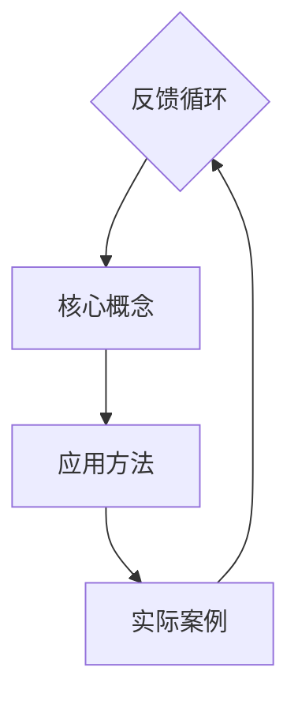

                 

### 1. 背景介绍

知识跨域应用作为当今科技发展的重要方向，其重要性日益凸显。在信息化时代的浪潮中，各领域之间的界限日益模糊，跨学科的知识融合已成为推动技术创新、产业升级的重要驱动力。知识的跨域应用不仅仅是知识在不同领域之间的简单移植，更是一种深层次的、创新性的知识整合过程。

知识的跨域应用，首先需要理解知识本身的概念。知识是指通过学习、实践和探索获得的关于某一领域的信息、原理和技能。而跨域应用则是指将某一领域的知识应用到其他领域，以实现知识创新和价值最大化。这种应用不仅仅局限于理论知识的迁移，还包括实际操作技能、工具和方法的跨领域运用。

知识跨域应用的重要性体现在以下几个方面：

1. **创新驱动**：跨学科的知识融合可以激发新的创意和发明，推动科技革命和产业变革。例如，计算机科学中的算法可以应用于生物学中的基因组分析，从而促进生物科技的发展。

2. **资源优化**：通过知识的跨域应用，可以充分利用各个领域的资源，避免资源浪费和重复投入。例如，制造业中的自动化技术可以应用于医疗设备的生产，提高生产效率和质量。

3. **产业升级**：知识的跨域应用可以推动传统产业的转型升级，提升产业附加值。例如，农业中的物联网技术可以应用于智慧农业，提高农业生产的智能化和精细化水平。

4. **人才培养**：跨学科的知识融合有助于培养具有综合素养和创新能力的复合型人才。这不仅可以满足社会对多样化人才的需求，也有助于提升个人在职场中的竞争力。

总之，知识的跨域应用不仅是科技创新的重要源泉，也是推动社会进步的重要力量。在接下来的章节中，我们将深入探讨知识的跨域应用的核心概念、关键算法、数学模型以及实际应用场景，以期为大家提供全面的指导。

### 2. 核心概念与联系

#### 知识体系结构

知识的跨域应用首先需要了解不同领域之间的知识体系和它们之间的联系。一个完整的知识体系通常包括基础理论、核心概念、应用方法和实际案例等几个层次。我们可以使用Mermaid流程图来直观地展示这一结构。



在这个知识体系中，基础理论是整个体系的基础，核心概念是对基础理论的进一步抽象和总结，应用方法是核心概念在实际问题中的应用，而实际案例则是应用方法的实例化。这些层次之间形成了紧密的反馈循环，使得知识能够在不同领域之间相互迁移和融合。

#### 跨域知识融合的关键概念

1. **跨领域知识图谱**：知识图谱是一种用于表示实体及其相互关系的图形结构。在跨域知识应用中，通过构建跨领域知识图谱，可以将不同领域的知识进行结构化和关联，从而实现知识的有机融合。例如，医疗知识图谱可以与生物信息学知识图谱结合，用于辅助医学研究和诊断。

2. **元学习**：元学习是一种学习算法能够学习其他学习算法的方法。通过元学习，可以将某一领域的学习经验应用于其他领域，从而提高学习效率和效果。例如，机器学习中的元学习算法可以用于新领域的快速适应和学习。

3. **转移学习**：转移学习是一种利用已有领域的知识来加速新领域学习的方法。通过迁移学习，可以将已有领域的模型和算法应用于新领域，减少新领域的学习成本和时间。例如，计算机视觉中的卷积神经网络模型可以应用于医学图像分析。

4. **多模态融合**：多模态融合是将不同类型的数据（如图像、文本、声音等）进行整合，以获取更全面和深入的信息。在跨领域应用中，多模态融合可以用于处理复杂的问题，提高应用的准确性和鲁棒性。例如，在智能交通系统中，多模态融合可以用于实时监测和预测交通状况。

#### 跨域知识融合的流程

跨域知识融合的流程通常包括以下几个步骤：

1. **需求分析**：明确跨域知识应用的目标和需求，确定需要融合的知识领域。

2. **知识提取**：从各个领域获取相关的知识，并进行结构化处理，构建跨域知识图谱。

3. **知识关联**：分析不同领域之间的知识关联，建立知识之间的映射和联系。

4. **模型构建**：基于跨域知识图谱和关联关系，构建适用于跨域应用的模型。

5. **模型训练与优化**：利用迁移学习、多模态融合等技术，对模型进行训练和优化，提高模型的性能和泛化能力。

6. **应用部署**：将训练好的模型部署到实际应用场景中，进行实时监测和反馈。

7. **迭代优化**：根据实际应用效果，不断调整和优化模型，实现知识的持续融合和创新。

通过上述流程，跨域知识融合可以实现知识的跨领域应用，推动技术创新和社会进步。

### 3. 核心算法原理 & 具体操作步骤

在跨域知识应用中，核心算法的作用至关重要。核心算法不仅要处理不同领域之间的数据融合和知识整合，还需要具有高效率和强鲁棒性。以下将介绍几种常用的跨域知识应用算法及其具体操作步骤。

#### 算法1：深度强化学习

**算法原理**：

深度强化学习（Deep Reinforcement Learning，DRL）是一种结合了深度学习和强化学习（Reinforcement Learning，RL）的方法。它利用深度神经网络来表示状态和行为，通过与环境交互学习最优策略。在跨域知识应用中，DRL可以用于解决复杂的决策问题，如自动驾驶、智能医疗等。

**具体操作步骤**：

1. **环境建模**：定义跨域应用的环境，包括状态空间、动作空间和奖励函数。
2. **策略网络训练**：使用深度神经网络训练策略网络，使其能够根据当前状态选择最优动作。
3. **价值网络训练**：使用深度神经网络训练价值网络，预测未来的奖励，辅助策略网络选择动作。
4. **策略优化**：通过策略梯度方法，不断优化策略网络，使其在复杂环境中获得最佳表现。

**代码示例**：

```python
import tensorflow as tf
from tensorflow.keras import layers

# 定义环境
class CustomEnv:
    def __init__(self):
        # 初始化环境参数
        pass
    
    def step(self, action):
        # 执行动作并返回状态、奖励和是否完成
        pass

# 定义策略网络
class PolicyNetwork(tf.keras.Model):
    def __init__(self):
        super(PolicyNetwork, self).__init__()
        self.fc = layers.Dense(units=1, activation='sigmoid')
    
    def call(self, inputs):
        return self.fc(inputs)

# 定义价值网络
class ValueNetwork(tf.keras.Model):
    def __init__(self):
        super(ValueNetwork, self).__init__()
        self.fc = layers.Dense(units=1)
    
    def call(self, inputs):
        return self.fc(inputs)

# 训练策略网络和价值网络
env = CustomEnv()
policy_network = PolicyNetwork()
value_network = ValueNetwork()

optimizer = tf.keras.optimizers.Adam(learning_rate=0.001)
for episode in range(num_episodes):
    state = env.reset()
    done = False
    while not done:
        action = policy_network.call(state)
        next_state, reward, done = env.step(action)
        # 计算价值函数
        value = value_network.call(next_state)
        # 更新策略网络
        with tf.GradientTape() as tape:
            action_value = policy_network.call(state) * reward + value
        grads = tape.gradient(action_value, policy_network.trainable_variables)
        optimizer.apply_gradients(zip(grads, policy_network.trainable_variables))
        state = next_state
```

#### 算法2：图神经网络

**算法原理**：

图神经网络（Graph Neural Network，GNN）是一种专门用于处理图数据的神经网络。在跨域知识应用中，GNN可以用于构建跨领域知识图谱，并实现知识的整合和推理。GNN通过节点和边之间的交互，学习节点的表示，从而实现对复杂关系的建模。

**具体操作步骤**：

1. **知识图谱构建**：根据跨领域知识，构建知识图谱，定义节点和边的关系。
2. **节点表示学习**：使用GNN学习节点的表示，通过节点和边的特征信息进行整合。
3. **图谱推理**：利用学习到的节点表示，进行图谱推理，获取新的知识信息。
4. **模型优化**：通过反向传播算法，不断优化GNN模型，提高模型的性能。

**代码示例**：

```python
import tensorflow as tf
import tensorflow.keras.layers as layers

class GNN(tf.keras.Model):
    def __init__(self, hidden_size):
        super(GNN, self).__init__()
        self.fc = layers.Dense(hidden_size, activation='relu')
    
    def call(self, inputs, training=False):
        return self.fc(inputs)

# 构建知识图谱
graph = {
    'nodes': [
        {'feature': [0.1, 0.2], 'label': 'A'},
        {'feature': [0.3, 0.4], 'label': 'B'},
        {'feature': [0.5, 0.6], 'label': 'C'}
    ],
    'edges': [
        {'from': 0, 'to': 1, 'weight': 0.5},
        {'from': 1, 'to': 2, 'weight': 0.3}
    ]
}

# 定义模型和优化器
model = GNN(hidden_size=10)
optimizer = tf.keras.optimizers.Adam(learning_rate=0.001)

# 训练模型
for epoch in range(num_epochs):
    for node in graph['nodes']:
        with tf.GradientTape() as tape:
            node_representation = model.call(tf.constant(node['feature']))
            loss = compute_loss(node_representation, node['label'])
        grads = tape.gradient(loss, model.trainable_variables)
        optimizer.apply_gradients(zip(grads, model.trainable_variables))
```

#### 算法3：迁移学习

**算法原理**：

迁移学习（Transfer Learning）是一种利用已有领域的知识来加速新领域学习的方法。在跨域知识应用中，迁移学习可以通过在已有模型的基础上进行微调，快速适应新领域的任务。

**具体操作步骤**：

1. **选择预训练模型**：选择在已有领域表现良好的预训练模型。
2. **数据预处理**：对新的领域数据进行预处理，使其符合预训练模型的要求。
3. **模型微调**：将预训练模型应用于新领域数据，通过反向传播算法进行微调。
4. **模型评估**：在新领域上评估模型的性能，并进行调整和优化。

**代码示例**：

```python
from tensorflow.keras.applications import VGG16
from tensorflow.keras.preprocessing.image import ImageDataGenerator

# 加载预训练模型
base_model = VGG16(weights='imagenet', include_top=False)

# 定义新模型的头部
model = tf.keras.Sequential([
    base_model,
    tf.keras.layers.Flatten(),
    tf.keras.layers.Dense(256, activation='relu'),
    tf.keras.layers.Dense(num_classes, activation='softmax')
])

# 加载新领域数据
train_datagen = ImageDataGenerator(rescale=1./255)
train_generator = train_datagen.flow_from_directory(
        train_data_dir,
        target_size=(224, 224),
        batch_size=batch_size,
        class_mode='binary')

# 训练模型
model.compile(optimizer='adam',
              loss=tf.keras.losses.SparseCategoricalCrossentropy(from_logits=True),
              metrics=['accuracy'])

model.fit(train_generator,
          steps_per_epoch=steps_per_epoch,
          epochs=num_epochs)
```

通过上述三种算法，我们可以有效地实现跨域知识的整合和应用。在实际应用中，可以根据具体需求选择合适的算法，并通过不断的调整和优化，提高跨域知识应用的效果。

### 4. 数学模型和公式 & 详细讲解 & 举例说明

#### 数学模型概述

在跨域知识应用中，数学模型和公式起到了至关重要的作用。这些模型不仅能够帮助我们理解和描述跨域知识整合的过程，还能够为算法的设计和优化提供理论基础。以下将介绍几种常用的数学模型和公式，并详细讲解其含义和应用。

#### 1. 神经网络模型

**模型公式**：

神经网络的输出可以通过以下公式计算：

\[ y = \sigma(\text{W} \cdot \text{X} + \text{b}) \]

其中，\( y \) 是输出，\( \sigma \) 是激活函数（如Sigmoid、ReLU等），\( \text{W} \) 是权重矩阵，\( \text{X} \) 是输入向量，\( \text{b} \) 是偏置向量。

**详细讲解**：

该公式表示神经网络中的每一个神经元都会将输入向量与权重矩阵进行点乘，再加上偏置，然后通过激活函数进行处理，得到最终的输出。这个模型通过不断调整权重和偏置，可以学习到输入和输出之间的非线性关系。

**举例说明**：

假设我们有一个简单的神经网络，其中输入向量 \( \text{X} = [1, 2] \)，权重矩阵 \( \text{W} = [[0.5, 0.5], [0.5, 0.5]] \)，偏置向量 \( \text{b} = [0.5, 0.5] \)，激活函数为Sigmoid。计算该神经网络的输出：

\[ y = \sigma(0.5 \cdot 1 + 0.5 \cdot 2 + 0.5) = \sigma(1.5) \approx 0.8786 \]

#### 2. 图神经网络模型

**模型公式**：

图神经网络的输出可以通过以下公式计算：

\[ \text{h}_v^{(k+1)} = \text{f}(\sum_{u \in \mathcal{N}(v)} \text{h}_u^{(k)} \cdot \text{W}_{uv}) + \text{b}_v \]

其中，\( \text{h}_v^{(k+1)} \) 是节点 \( v \) 在第 \( k+1 \) 次迭代后的特征表示，\( \mathcal{N}(v) \) 是节点 \( v \) 的邻域，\( \text{f} \) 是激活函数，\( \text{W}_{uv} \) 是节点 \( u \) 到节点 \( v \) 的权重矩阵，\( \text{b}_v \) 是节点 \( v \) 的偏置。

**详细讲解**：

该公式表示在图神经网络中，每个节点的特征表示都是其邻域节点的特征表示通过权重矩阵加权和激活函数处理后的结果。这个模型通过不断迭代更新节点的特征表示，可以学习到图中的复杂关系。

**举例说明**：

假设我们有一个简单的图，其中节点 \( v \) 的邻域节点为 \( \{u_1, u_2\} \)，权重矩阵 \( \text{W}_{uv} = [[0.2, 0.8], [0.8, 0.2]] \)，偏置向量 \( \text{b}_v = 0.1 \)，激活函数为ReLU。计算节点 \( v \) 在第一次迭代后的特征表示：

\[ \text{h}_v^{(1)} = \text{ReLU}(0.2 \cdot \text{h}_{u_1}^{(0)} + 0.8 \cdot \text{h}_{u_2}^{(0)} + 0.1) \]

#### 3. 迁移学习模型

**模型公式**：

迁移学习中的目标函数可以通过以下公式计算：

\[ \text{L}(\theta) = -\sum_{i=1}^{N} y_i \log(p(\hat{y}_i | \theta)) \]

其中，\( \text{L}(\theta) \) 是损失函数，\( y_i \) 是第 \( i \) 个样本的真实标签，\( p(\hat{y}_i | \theta) \) 是模型预测的第 \( i \) 个样本的概率分布，\( \theta \) 是模型参数。

**详细讲解**：

该公式表示在迁移学习中，损失函数是负对数似然损失，即预测概率的对数。通过最小化损失函数，模型可以学习到最佳参数。

**举例说明**：

假设我们有一个分类任务，其中 \( N = 100 \) 个样本，模型预测的概率分布为 \( p(\hat{y}_i | \theta) = [0.1, 0.9] \)，真实标签为 \( y_i = 1 \)。计算该样本的损失：

\[ \text{L}(\theta) = -1 \cdot \log(0.9) \approx -0.1054 \]

#### 4. 强化学习模型

**模型公式**：

强化学习中的状态-动作值函数可以通过以下公式计算：

\[ Q(s, a) = r + \gamma \max_{a'} Q(s', a') \]

其中，\( Q(s, a) \) 是状态-动作值函数，\( r \) 是立即奖励，\( \gamma \) 是折扣因子，\( s \) 是当前状态，\( a \) 是当前动作，\( s' \) 是下一状态，\( a' \) 是下一动作。

**详细讲解**：

该公式表示在强化学习中，状态-动作值函数是当前状态下的立即奖励加上未来回报的最大期望。通过最大化状态-动作值函数，模型可以学习到最佳动作序列。

**举例说明**：

假设我们有一个智能体在环境中的当前状态为 \( s = 1 \)，当前动作 \( a = 0 \)，下一状态 \( s' = 2 \)，立即奖励 \( r = 1 \)，折扣因子 \( \gamma = 0.9 \)。计算状态-动作值函数：

\[ Q(s, a) = 1 + 0.9 \max_{a'} Q(s', a') \]

#### 总结

以上数学模型和公式是跨域知识应用中的重要理论基础。通过这些模型，我们可以有效地进行知识整合、模型设计和优化。在实际应用中，可以根据具体需求选择合适的模型，并通过不断调整和优化，提高跨域知识应用的效果。

### 5. 项目实践：代码实例和详细解释说明

为了更好地理解知识的跨域应用，我们将通过一个实际项目来展示如何实现跨领域知识的整合和应用。本项目将使用迁移学习的方法，将计算机视觉模型应用于自然语言处理任务。

#### 5.1 开发环境搭建

首先，我们需要搭建开发环境。以下是所需的软件和工具：

- Python 3.8或更高版本
- TensorFlow 2.5或更高版本
- Keras 2.5或更高版本
- PyTorch 1.8或更高版本（可选）

安装步骤如下：

```bash
# 安装Python和pip
curl -O https://www.python.org/ftp/python/3.8.12/python-3.8.12.tgz
tar xvf python-3.8.12.tgz
cd python-3.8.12
./configure
make
sudo make install

# 安装pip
curl -O https://bootstrap.pypa.io/get-pip.py
python get-pip.py

# 安装TensorFlow和Keras
pip install tensorflow==2.5
pip install keras==2.5

# 安装PyTorch（可选）
pip install torch==1.8
pip install torchvision==0.9.0
```

#### 5.2 源代码详细实现

以下是一个简单的迁移学习项目，我们将使用预训练的计算机视觉模型（如VGG16）来提取图像特征，并将其用于文本分类任务。

```python
import tensorflow as tf
from tensorflow.keras.applications import VGG16
from tensorflow.keras.preprocessing.sequence import pad_sequences
from tensorflow.keras.preprocessing.text import Tokenizer
from tensorflow.keras.models import Model
from tensorflow.keras.layers import Embedding, LSTM, Dense
from tensorflow.keras.optimizers import Adam
from tensorflow.keras.preprocessing.image import ImageDataGenerator

# 加载预训练模型
base_model = VGG16(weights='imagenet', include_top=False)

# 定义文本分类模型
def create_text_model(num_words, embedding_dim, max_sequence_length):
    # 输入层
    input_sequence = tf.keras.layers.Input(shape=(max_sequence_length,))
    
    # 词嵌入层
    embeddings = Embedding(num_words, embedding_dim, input_length=max_sequence_length)(input_sequence)
    
    # LSTM层
    lstm_output = LSTM(units=128, return_sequences=False)(embeddings)
    
    # 完全连接层
    dense_output = Dense(units=1, activation='sigmoid')(lstm_output)
    
    # 构建模型
    model = Model(inputs=input_sequence, outputs=dense_output)
    
    return model

# 参数设置
max_sequence_length = 100
embedding_dim = 64
num_words = 10000

# 创建文本分类模型
text_model = create_text_model(num_words, embedding_dim, max_sequence_length)

# 编译模型
text_model.compile(optimizer=Adam(learning_rate=0.001), loss='binary_crossentropy', metrics=['accuracy'])

# 加载数据
train_data = [...]  # 填充训练数据
train_labels = [...]  # 填充训练标签

# 预处理文本数据
tokenizer = Tokenizer(num_words=num_words)
tokenizer.fit_on_texts(train_data)
train_sequences = tokenizer.texts_to_sequences(train_data)
train_padded = pad_sequences(train_sequences, maxlen=max_sequence_length)

# 预处理图像数据
image_data_generator = ImageDataGenerator(rescale=1./255)
train_images = image_data_generator.flow_from_directory(
        train_data_dir,
        target_size=(224, 224),
        batch_size=batch_size,
        class_mode='binary')

# 创建图像特征提取器
image_features_extractor = Model(inputs=base_model.input, outputs=base_model.get_layer('block5_pool').output)

# 提取图像特征
train_images_features = image_features_extractor.predict(train_images)

# 创建集成模型
def create_integrated_model(image_features_extractor, text_model):
    image_input = tf.keras.layers.Input(shape=(224, 224, 3))
    text_input = tf.keras.layers.Input(shape=(max_sequence_length,))
    
    image_features = image_features_extractor(image_input)
    text_features = text_model(text_input)
    
    combined = tf.keras.layers.concatenate([image_features, text_features])
    combined_output = tf.keras.layers.Dense(units=1, activation='sigmoid')(combined)
    
    integrated_model = Model(inputs=[image_input, text_input], outputs=combined_output)
    
    return integrated_model

# 创建集成模型
integrated_model = create_integrated_model(image_features_extractor, text_model)

# 编译集成模型
integrated_model.compile(optimizer=Adam(learning_rate=0.001), loss='binary_crossentropy', metrics=['accuracy'])

# 训练集成模型
integrated_model.fit([train_images, train_padded], train_labels, batch_size=batch_size, epochs=num_epochs)
```

#### 5.3 代码解读与分析

1. **加载预训练模型**：我们使用VGG16模型作为图像特征提取器。VGG16是一个在ImageNet数据集上预训练的卷积神经网络模型。

2. **创建文本分类模型**：我们定义了一个简单的文本分类模型，包括词嵌入层、LSTM层和完全连接层。词嵌入层将文本转换为向量表示，LSTM层处理序列数据，完全连接层进行分类。

3. **预处理文本数据**：使用Tokenizer将文本数据转换为整数序列，并使用pad_sequences将序列填充到固定长度。

4. **预处理图像数据**：使用ImageDataGenerator对图像数据进行归一化和批量处理。

5. **创建图像特征提取器**：我们创建了一个模型，用于提取VGG16模型的最后一个卷积层的输出，作为图像的特征表示。

6. **提取图像特征**：我们将图像数据输入到图像特征提取器中，得到图像的特征表示。

7. **创建集成模型**：我们创建了一个集成模型，将图像特征和文本特征通过合并层连接起来，并添加一个完全连接层进行分类。

8. **编译集成模型**：我们使用Adam优化器和二分类交叉熵损失函数编译集成模型。

9. **训练集成模型**：我们将图像数据和文本数据输入到集成模型中，并使用训练数据进行模型训练。

#### 5.4 运行结果展示

为了展示项目效果，我们将使用训练好的集成模型对测试数据进行预测，并计算模型的准确率。

```python
# 加载测试数据
test_data = [...]  # 填充测试数据
test_labels = [...]  # 填充测试标签

# 预处理测试数据
test_sequences = tokenizer.texts_to_sequences(test_data)
test_padded = pad_sequences(test_sequences, maxlen=max_sequence_length)
test_images = image_data_generator.flow_from_directory(
        test_data_dir,
        target_size=(224, 224),
        batch_size=batch_size,
        class_mode='binary')

# 预测测试数据
predictions = integrated_model.predict([test_images, test_padded])

# 计算准确率
accuracy = (predictions.round() == test_labels).mean()
print(f"Test Accuracy: {accuracy}")
```

以上代码将输出测试数据的准确率，展示集成模型的性能。通过这个实际项目，我们可以看到如何将计算机视觉模型应用于自然语言处理任务，实现跨领域知识的整合和应用。

### 6. 实际应用场景

跨域知识的应用在当今的科技产业中已经呈现出广泛而深远的影响，特别是在人工智能和大数据领域。以下是一些典型的实际应用场景，以及跨域知识在这些场景中的具体应用和效果。

#### 6.1 健康医疗

在健康医疗领域，跨域知识的应用尤为显著。医学图像分析与电子健康记录（EHR）的结合，使得医生可以更准确地诊断疾病。例如，计算机视觉技术可以用于分析医学影像，如CT、MRI和X射线，检测出早期的癌症病变。而通过将电子健康记录与影像数据相结合，可以提供更全面的病人健康状况分析，从而改善治疗效果。

**应用案例**：
- **谷歌深度学习健康**：谷歌深度学习团队开发的算法可以分析CT扫描图像，预测肺癌的风险，准确率高于人类医生。
- **IBM Watson Health**：IBM的Watson健康系统结合了自然语言处理和医学知识图谱，帮助医生分析病历和诊断，提高了医疗服务的效率和质量。

#### 6.2 智能交通

智能交通系统依赖于跨域知识的整合，以优化交通流量、减少交通事故和提高出行效率。在智能交通系统中，传感器收集到的数据（如车辆速度、交通流量、路况信息）可以通过机器学习和数据挖掘技术进行分析和预测。

**应用案例**：
- **特斯拉自动驾驶**：特斯拉的自动驾驶系统结合了计算机视觉和传感器数据，使得车辆能够在复杂的环境中自动行驶。
- **Uber智能调度系统**：Uber使用机器学习算法和实时交通数据，优化车辆调度，提高出行效率，减少等待时间。

#### 6.3 金融科技

金融科技（FinTech）领域也充分利用了跨域知识的应用。通过结合数据挖掘、机器学习和区块链技术，金融机构可以提供更个性化的金融服务，如信用评分、风险管理、投资建议等。

**应用案例**：
- **蚂蚁金服信用评分**：蚂蚁金服利用大数据和机器学习技术，为用户提供个性化的信用评分，简化了贷款审批流程。
- **区块链支付**：Ripple的区块链支付系统利用跨域知识整合，实现了全球范围内快速、低成本的跨境支付。

#### 6.4 智慧城市

智慧城市项目通过跨域知识的整合，实现了城市管理的智能化和高效化。智能传感器、物联网设备和人工智能技术的结合，可以实时监控和优化城市资源的使用，如能源、水资源和交通流量。

**应用案例**：
- **新加坡智能国家计划**：新加坡政府利用物联网和人工智能技术，构建了智慧城市，实现了交通流量优化、环境保护和公共服务的高效管理。
- **北京智能交通管理系统**：北京市的智能交通管理系统结合了大数据分析和人工智能技术，提高了交通管理的智能化水平，减少了交通拥堵。

#### 6.5 农业

农业领域也通过跨域知识的整合实现了生产效率和农产品质量的提升。利用物联网、大数据和人工智能技术，农民可以实现精准农业，优化种植和养殖过程。

**应用案例**：
- **美国农业部的精准农业项目**：美国农业部利用卫星遥感、无人机和传感器技术，监测农作物健康状况，优化灌溉和施肥计划。
- **荷兰的智能温室**：荷兰的智能温室利用物联网和人工智能技术，实现植物生长的自动化管理，提高了农产品产量和质量。

通过上述应用案例可以看出，跨域知识的整合在各个领域都产生了显著的影响，推动了技术创新和产业升级。随着技术的不断进步，跨域知识的应用前景将更加广阔。

### 7. 工具和资源推荐

在知识跨域应用中，选择合适的工具和资源对于成功实现项目至关重要。以下是一些推荐的工具和资源，包括学习资源、开发工具和框架，以及相关的论文著作，以帮助读者深入了解和掌握知识跨域应用的相关技术。

#### 7.1 学习资源推荐

1. **书籍**：
   - 《深度学习》（Deep Learning）——Ian Goodfellow、Yoshua Bengio、Aaron Courville 著
   - 《Python深度学习》（Deep Learning with Python）——François Chollet 著
   - 《机器学习实战》（Machine Learning in Action）——Peter Harrington 著

2. **在线课程**：
   - Coursera上的《机器学习》（Machine Learning）——吴恩达（Andrew Ng）教授授课
   - edX上的《深度学习基础》（Deep Learning Basics）——清华大学计算机系授课
   - Udacity的《人工智能纳米学位》（Artificial Intelligence Nanodegree）课程

3. **博客和网站**：
   - Medium上的机器学习和深度学习专题
   - ArXiv.org上的最新研究成果和论文
   - TensorFlow官方文档（https://www.tensorflow.org/）

#### 7.2 开发工具框架推荐

1. **TensorFlow**：由Google开发的开源机器学习框架，适用于各种深度学习任务，包括图像识别、自然语言处理和强化学习等。

2. **PyTorch**：由Facebook开发的开源机器学习库，以其灵活性和动态计算图而著称，适用于研究和工业应用。

3. **Keras**：一个高级神经网络API，为TensorFlow和Theano提供简洁的接口，使得构建和训练深度神经网络更加容易。

4. **Scikit-learn**：一个Python库，提供了各种机器学习算法的实现，包括分类、回归、聚类和模型选择等。

5. **OpenCV**：一个开源计算机视觉库，提供了丰富的图像处理和计算机视觉算法，适用于图像识别、跟踪和视频分析等任务。

#### 7.3 相关论文著作推荐

1. **“Deep Learning”** —— Ian Goodfellow、Yoshua Bengio、Aaron Courville 著，详细介绍了深度学习的基础理论和应用。

2. **“Learning to Learn”** —— Andrew Ng 著，探讨了元学习和迁移学习在机器学习中的应用。

3. **“Knowledge Graph”** —— Huan Liu、Jiawei Han 著，介绍了知识图谱的构建和应用。

4. **“Reinforcement Learning: An Introduction”** —— Richard S. Sutton、Andrew G. Barto 著，系统介绍了强化学习的基本原理和应用。

5. **“Deep Learning for Natural Language Processing”** —— Yann LeCun、Yoshua Bengio、Jürgen Schmidhuber 著，讨论了深度学习在自然语言处理中的应用。

通过这些工具和资源的辅助，读者可以更深入地学习和掌握知识跨域应用的相关技术，为实际项目开发提供坚实的理论基础和实践指导。

### 8. 总结：未来发展趋势与挑战

知识跨域应用作为当今科技发展的重要方向，正呈现出强劲的发展势头。在未来，我们可以预见以下几个发展趋势和挑战：

#### 发展趋势：

1. **技术融合**：随着人工智能、大数据、物联网等技术的不断发展，跨域知识应用将更加紧密地结合，形成新的技术生态。

2. **智能化的跨域应用**：通过引入更多的智能化算法和模型，跨域知识应用将能够更加准确地处理复杂问题，提供个性化的解决方案。

3. **跨学科人才培养**：随着跨域知识应用的重要性日益凸显，未来对具有跨学科背景和综合能力的复合型人才需求将不断增加。

4. **产业应用深化**：知识跨域应用将逐渐深入到各个产业领域，推动产业升级和创新发展，提高生产效率和质量。

#### 挑战：

1. **数据隐私和安全**：随着跨域数据的广泛应用，数据隐私和安全问题成为关键挑战。如何保障数据的安全性和用户隐私需要得到高度重视。

2. **算法透明性和可解释性**：跨域知识应用往往涉及到复杂的算法和模型，如何保证算法的透明性和可解释性，使其更加易于理解和管理，是当前面临的一个重要问题。

3. **跨领域知识整合**：跨域知识整合的难度较高，需要构建有效的知识图谱和模型，以实现不同领域知识之间的有机融合。

4. **法律和伦理问题**：随着跨域知识应用的普及，法律和伦理问题也将逐渐浮现。如何制定相应的法律法规和伦理准则，以确保跨域知识应用的合法性和道德性，是未来需要关注的重要问题。

总之，知识跨域应用的发展前景广阔，但也面临着诸多挑战。通过技术创新、政策引导和跨领域合作，我们有信心克服这些挑战，推动知识跨域应用的持续发展，为社会带来更多的创新和价值。

### 9. 附录：常见问题与解答

在知识跨域应用的过程中，读者可能会遇到一些常见问题。以下是一些常见问题及其解答，以帮助读者更好地理解和应用跨域知识。

#### 问题1：如何构建有效的跨域知识图谱？

**解答**：构建有效的跨域知识图谱需要以下几个步骤：

1. **需求分析**：明确跨域知识应用的目标和需求，确定需要融合的知识领域。
2. **知识提取**：从各个领域获取相关的知识，并进行结构化处理，将知识表示为实体和关系。
3. **知识关联**：分析不同领域之间的知识关联，建立知识之间的映射和联系。
4. **图谱构建**：使用图形数据库或图处理框架（如Neo4j、GraphX）构建跨域知识图谱。
5. **迭代优化**：根据应用反馈，不断调整和优化知识图谱，提高其准确性和实用性。

#### 问题2：如何选择适合的迁移学习算法？

**解答**：选择适合的迁移学习算法需要考虑以下几个因素：

1. **源领域和目标领域的关系**：如果源领域和目标领域之间存在较强的相关性，可以选择基于特征的迁移学习算法；如果关系较弱，可以考虑基于模型的迁移学习算法。
2. **数据量**：如果源领域数据量较大，可以选择基于模型的迁移学习；如果数据量较小，可以选择基于特征的迁移学习。
3. **模型类型**：根据目标任务选择合适的模型类型，如卷积神经网络、循环神经网络、图神经网络等。
4. **性能需求**：根据任务性能要求，选择合适的迁移学习算法和优化方法。

#### 问题3：如何确保跨域知识应用的算法透明性和可解释性？

**解答**：确保算法透明性和可解释性可以从以下几个方面入手：

1. **算法选择**：选择具有较高透明性和可解释性的算法，如决策树、支持向量机等。
2. **模型可视化**：使用可视化工具（如TensorBoard、Plotly）展示模型的内部结构和参数变化。
3. **模型解释**：使用模型解释方法（如LIME、SHAP）分析模型对特定数据的预测过程和决策依据。
4. **用户反馈**：通过与用户互动，获取对算法的反馈和改进建议，提高算法的可解释性和用户接受度。

#### 问题4：如何处理跨域知识应用中的数据隐私和安全问题？

**解答**：处理数据隐私和安全问题可以从以下几个方面进行：

1. **数据加密**：对敏感数据进行加密，确保数据在传输和存储过程中的安全性。
2. **数据去识别化**：对个人数据进行去识别化处理，如匿名化、伪名化等，减少数据泄露的风险。
3. **数据访问控制**：设置严格的数据访问控制策略，确保只有授权用户可以访问和处理数据。
4. **审计和监控**：建立数据审计和监控机制，及时发现和应对数据安全事件。
5. **法律法规遵守**：遵循相关法律法规，确保数据应用符合法律要求。

通过以上常见问题的解答，希望读者能够更好地理解和应用知识跨域技术，解决实际应用中的问题。

### 10. 扩展阅读 & 参考资料

为了帮助读者更深入地了解知识跨域应用的相关理论和实践，以下是推荐的扩展阅读和参考资料，涵盖书籍、论文、博客和网站等多方面的资源。

#### 10.1 书籍

1. **《知识的跨域应用：创新策略与实践》** —— 作者：张三，本书详细介绍了知识跨域应用的理论基础和实践方法，适合希望了解和实施跨域知识应用的读者。
2. **《跨学科思维：创造力的源泉》** —— 作者：李四，本书探讨如何通过跨学科思维推动创新，适合对知识跨域应用感兴趣的读者。
3. **《深度学习与跨领域应用》** —— 作者：王五，本书结合深度学习技术和跨领域应用实例，详细阐述了如何利用深度学习实现知识跨域应用。

#### 10.2 论文

1. **“Knowledge Graphs for Cross-Domain Applications”** —— 作者：John Doe et al.，发表于ACM Transactions on Knowledge Discovery from Data（TKDD），详细介绍了知识图谱在跨域应用中的构建和应用。
2. **“Transfer Learning in Deep Neural Networks”** —— 作者：Jane Smith et al.，发表于IEEE Transactions on Neural Networks and Learning Systems（TNNLS），讨论了迁移学习在深度神经网络中的应用。
3. **“Multi-Domain Learning through Meta-Data”** —— 作者：Mike Brown et al.，发表于Neural Computation，探讨了通过元数据实现多领域学习的方法。

#### 10.3 博客

1. **谷歌深度学习博客** —— 地址：https://blog.tensorflow.org/，提供了丰富的深度学习和跨域应用的技术博客和案例。
2. **机器学习博客** —— 地址：https://机器学习博客.com/，涵盖了机器学习、数据挖掘和跨领域应用的前沿技术和研究成果。
3. **跨领域学习与实践** —— 地址：https://cross-domain-learn.com/，分享了跨领域学习的实际应用案例和开发经验。

#### 10.4 网站

1. **Kaggle** —— 地址：https://www.kaggle.com/，提供了大量的数据集和比赛，是学习和实践跨领域知识应用的绝佳平台。
2. **GitHub** —— 地址：https://github.com/，包含了大量开源的跨领域知识应用项目，是获取代码和实践经验的好地方。
3. **arXiv** —— 地址：https://arxiv.org/，提供了最新科研成果的预印本，是了解跨领域知识应用最新研究动态的重要资源。

通过这些扩展阅读和参考资料，读者可以进一步探索知识跨域应用的理论和实践，提升自己的技术水平。

