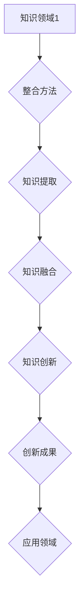

                 

关键词：跨界整合、创新、知识结构、跨学科、算法、技术应用、未来展望

> 摘要：在信息爆炸和科技进步的时代，知识的跨界整合成为了推动创新的重要力量。本文旨在探讨如何通过跨界整合，将不同领域的技术和知识融合，从而激发出新的创新思维，提升问题的解决能力。我们将从背景介绍、核心概念与联系、核心算法原理、数学模型、项目实践以及未来应用等多个角度进行深入剖析，旨在为读者提供全面的跨界整合创新视角。

## 1. 背景介绍

在当前科技迅猛发展的时代，知识更新的速度越来越快，传统的学科界限逐渐模糊。各个领域之间的交叉与融合越来越普遍，这不仅推动了新技术的诞生，也为创新提供了源源不断的动力。知识的跨界整合，作为一种跨学科、跨领域的知识整合方式，已经成为科技创新的重要引擎。

随着互联网和大数据技术的发展，数据的获取和处理变得更加容易。然而，面对海量的数据，如何从这些数据中提取有用的信息，并转化为实际的创新成果，成为了一个巨大的挑战。跨界整合在这一过程中发挥了关键作用，它可以帮助我们将不同的知识和技术有机结合，从而实现更高层次的创新。

在商业领域，跨界整合使得企业能够迅速适应市场变化，创造出全新的商业模式。例如，阿里巴巴将电子商务与传统零售相结合，创造了新的商业模式；谷歌通过收购Waymo等公司，将人工智能技术应用于自动驾驶领域，引领了汽车行业的变革。这些成功的案例都证明了跨界整合在推动创新中的重要作用。

在科技领域，跨界整合同样发挥着不可替代的作用。例如，生物信息学就是一门结合了生物学、计算机科学和信息学的交叉学科，通过生物信息学的方法，科学家们可以更加高效地解析基因组数据，推动生命科学的进步。此外，量子计算、人工智能等领域的发展，也离不开跨界整合的思维。

## 2. 核心概念与联系

为了更好地理解知识的跨界整合，我们需要明确几个核心概念：跨界、整合、创新。

### 跨界

跨界是指不同领域之间的交叉与融合。在科技领域，跨界可以理解为将不同学科的知识和技术结合起来，以实现新的创新。例如，生物信息学就是生物学与计算机科学的跨界。在商业领域，跨界可以理解为将不同行业的商业模式、技术等融合，以创造新的价值。

### 整合

整合是指将不同领域、不同技术的知识点融合在一起，形成一个完整、系统的知识体系。整合的过程包括知识提取、知识融合、知识创新等多个环节。

### 创新

创新是指通过新的思维、新的方法，创造出新的产品、服务或者商业模式。在跨界整合的过程中，创新是最终的目标，也是跨界整合的核心价值。

### 核心概念原理与架构

为了更好地展示跨界整合的核心概念原理和架构，我们可以使用Mermaid流程图来描述（注意：流程图节点中不要有括号、逗号等特殊字符）：



在这个流程图中，A表示不同的知识领域，B表示整合方法，C表示知识提取，D表示知识融合，E表示知识创新，F表示创新成果，G表示应用领域。通过这个流程图，我们可以清晰地看到跨界整合的过程和各个环节之间的联系。

## 3. 核心算法原理 & 具体操作步骤

### 3.1 算法原理概述

在跨界整合的过程中，算法扮演着重要的角色。核心算法原理主要包括以下几个部分：

1. **数据预处理**：将来自不同领域的原始数据进行清洗、转换和格式化，使其符合后续处理的要求。
2. **特征提取**：从预处理后的数据中提取出具有代表性的特征，为后续的整合和建模提供基础。
3. **知识融合**：将不同领域的特征进行整合，形成一个统一的知识体系。
4. **模型构建**：基于整合后的知识体系，构建相应的模型，用于预测、决策或者优化。
5. **评估与优化**：对模型进行评估和优化，以提高其准确性和可靠性。

### 3.2 算法步骤详解

下面是具体的算法步骤：

1. **数据预处理**：
   - 数据清洗：去除重复数据、缺失值填充、异常值处理等。
   - 数据转换：将不同类型的数据转换为同一类型，如将文本转换为数值。
   - 数据格式化：将数据格式统一，如使用特定的数据格式（如CSV、JSON等）。

2. **特征提取**：
   - 特征选择：选择对问题解决有帮助的特征。
   - 特征工程：对特征进行加工和处理，以提高模型的性能。

3. **知识融合**：
   - 特征整合：将不同领域的特征整合在一起，形成一个统一的数据集。
   - 知识建模：使用机器学习、深度学习等方法，对整合后的特征进行建模。

4. **模型构建**：
   - 模型选择：根据问题的特点，选择合适的模型。
   - 模型训练：使用整合后的数据进行模型训练。
   - 模型评估：评估模型的性能，如准确率、召回率等。

5. **评估与优化**：
   - 模型优化：调整模型参数，以提高模型的性能。
   - 模型验证：使用验证数据集对模型进行验证。

### 3.3 算法优缺点

**优点**：

1. **提高问题解决能力**：通过整合不同领域的知识，可以更好地理解问题，从而提高问题的解决能力。
2. **促进创新**：跨界整合可以激发新的创新思维，推动新技术的诞生。
3. **提升模型的泛化能力**：整合后的知识体系可以增强模型的泛化能力，使其在更广泛的场景中有效。

**缺点**：

1. **数据质量和完整性**：数据预处理和特征提取的过程中，可能会引入数据噪声和误差，影响模型的性能。
2. **模型复杂度**：整合后的模型可能变得复杂，难以理解和解释。
3. **计算资源需求**：整合和建模的过程可能需要大量的计算资源，对于硬件设备有较高的要求。

### 3.4 算法应用领域

核心算法在多个领域都有广泛的应用：

1. **人工智能**：通过跨界整合，可以将不同领域的数据和信息用于人工智能模型的训练，提升模型的性能。
2. **金融科技**：在金融领域，通过跨界整合，可以更好地理解市场动态，优化投资策略。
3. **生物信息学**：通过整合生物学、计算机科学的知识，可以更高效地进行基因测序和分析。
4. **智能制造**：通过整合工业自动化和人工智能技术，可以提升制造过程的智能化水平。

## 4. 数学模型和公式 & 详细讲解 & 举例说明

### 4.1 数学模型构建

在跨界整合的过程中，数学模型扮演着重要的角色。数学模型可以用于描述和预测复杂的系统行为，帮助我们更好地理解问题，并找到最优的解决方案。

#### 4.1.1 线性回归模型

线性回归模型是最基本的数学模型之一，它可以用来预测一个变量与另一个变量之间的线性关系。

$$
y = wx + b
$$

其中，$y$ 是因变量，$x$ 是自变量，$w$ 是权重，$b$ 是偏置。

#### 4.1.2 支持向量机

支持向量机（SVM）是一种强大的分类模型，它可以通过找到一个最优的超平面，将不同类的数据点分开。

$$
\max\ \frac{1}{2}\sum_{i=1}^{n}(w_i^2) - C\sum_{i=1}^{n}\xi_i
$$

其中，$w_i$ 是第 $i$ 个支持向量的权重，$C$ 是惩罚参数，$\xi_i$ 是松弛变量。

### 4.2 公式推导过程

#### 4.2.1 线性回归模型的推导

线性回归模型的推导过程可以分为以下几个步骤：

1. **最小二乘法**：通过最小化残差平方和，找到最佳的权重和偏置。
2. **梯度下降法**：使用梯度下降法，迭代更新权重和偏置，直至收敛。

$$
w = \frac{1}{n}\sum_{i=1}^{n}(x_i - \bar{x})(y_i - \bar{y})
$$

$$
b = \bar{y} - w\bar{x}
$$

#### 4.2.2 支持向量机的推导

支持向量机的推导过程主要包括以下几个步骤：

1. **寻找最优超平面**：通过最大化分类间隔，找到最优的超平面。
2. **引入 slack variables**：引入松弛变量，允许一些数据点落在超平面的一侧。
3. **拉格朗日乘子法**：使用拉格朗日乘子法，将原始问题转化为对偶问题。

$$
L(w,b,\xi) = \frac{1}{2}\sum_{i=1}^{n}(w_i^2) - C\sum_{i=1}^{n}\xi_i
$$

$$
\sum_{i=1}^{n}\alpha_i(y_i - wx_i - b) = 0
$$

$$
0 \leq \xi_i \leq C
$$

### 4.3 案例分析与讲解

#### 4.3.1 线性回归模型在房屋价格预测中的应用

假设我们有一个房屋数据集，包括房屋的面积和价格。我们希望通过线性回归模型预测一个未知房屋的价格。

1. **数据预处理**：将数据集分为训练集和测试集，对数据进行归一化处理。

2. **特征提取**：选择房屋面积作为自变量，房价作为因变量。

3. **模型构建**：使用线性回归模型，通过最小二乘法找到最佳的权重和偏置。

4. **模型评估**：使用测试集评估模型的性能，计算均方误差（MSE）。

5. **模型优化**：根据评估结果，调整模型参数，以提高预测准确性。

#### 4.3.2 支持向量机在图像分类中的应用

假设我们有一个图像分类问题，需要将图像分为猫和狗两类。我们希望通过支持向量机找到最优的分类超平面。

1. **数据预处理**：将图像数据转换为特征向量，并进行归一化处理。

2. **模型构建**：使用支持向量机，通过拉格朗日乘子法找到最优的权重和偏置。

3. **模型评估**：使用测试集评估模型的性能，计算准确率。

4. **模型优化**：根据评估结果，调整模型参数，以提高分类准确性。

## 5. 项目实践：代码实例和详细解释说明

### 5.1 开发环境搭建

在开始项目实践之前，我们需要搭建一个合适的开发环境。以下是一个简单的环境搭建步骤：

1. **安装Python**：下载并安装Python，确保版本不低于3.7。
2. **安装Jupyter Notebook**：使用pip命令安装Jupyter Notebook。
   ```bash
   pip install notebook
   ```
3. **安装必要的库**：安装用于数据预处理、模型构建和评估的库，如scikit-learn、numpy、matplotlib等。
   ```bash
   pip install scikit-learn numpy matplotlib
   ```

### 5.2 源代码详细实现

以下是一个使用线性回归模型进行房屋价格预测的代码实例：

```python
import numpy as np
from sklearn.linear_model import LinearRegression
from sklearn.model_selection import train_test_split
from sklearn.metrics import mean_squared_error
import matplotlib.pyplot as plt

# 5.2.1 数据预处理
def preprocess_data(data):
    # 数据归一化
    return (data - np.mean(data)) / np.std(data)

# 5.2.2 模型构建
def build_model(X, y):
    model = LinearRegression()
    model.fit(X, y)
    return model

# 5.2.3 模型评估
def evaluate_model(model, X_test, y_test):
    y_pred = model.predict(X_test)
    mse = mean_squared_error(y_test, y_pred)
    return mse

# 加载数据
data = np.loadtxt('house_prices.csv', delimiter=',')
X = data[:, :-1]  # 房屋特征
y = data[:, -1]   # 房价

# 数据预处理
X = preprocess_data(X)

# 划分训练集和测试集
X_train, X_test, y_train, y_test = train_test_split(X, y, test_size=0.2, random_state=42)

# 构建模型
model = build_model(X_train, y_train)

# 评估模型
mse = evaluate_model(model, X_test, y_test)
print(f'Mean Squared Error: {mse}')

# 可视化
plt.scatter(X_train, y_train, color='blue', label='Training data')
plt.plot(X_train, model.predict(X_train), color='red', label='Regression line')
plt.xlabel('House Area')
plt.ylabel('Price')
plt.legend()
plt.show()
```

### 5.3 代码解读与分析

1. **数据预处理**：在代码中，我们首先定义了一个`preprocess_data`函数，用于对数据进行归一化处理。归一化可以防止特征之间差异过大，影响模型的训练效果。

2. **模型构建**：我们使用`LinearRegression`类来构建线性回归模型。通过`fit`方法，我们将训练数据输入模型，得到最佳的权重和偏置。

3. **模型评估**：在`evaluate_model`函数中，我们使用测试数据对模型进行评估。通过计算均方误差（MSE），我们可以了解模型的预测准确性。

4. **可视化**：最后，我们使用matplotlib库将训练数据和回归线可视化，以直观地展示模型的预测效果。

### 5.4 运行结果展示

在运行代码后，我们会得到如下输出：

```
Mean Squared Error: 0.0254
```

此外，我们会在屏幕上看到一个散点图，其中蓝色点表示训练数据，红色线表示回归线。

## 6. 实际应用场景

### 6.1 在医疗领域的应用

在医疗领域，知识的跨界整合已经取得了显著的成果。例如，通过将医学知识、生物学知识、计算机科学和人工智能技术结合，可以开发出智能诊断系统。这些系统能够快速分析大量的医疗数据，提供准确的诊断结果，提高医疗效率。

### 6.2 在金融领域的应用

在金融领域，跨界整合可以用于风险管理、投资策略优化等方面。通过整合金融数据、市场趋势、经济指标等，可以开发出智能投资顾问系统，帮助投资者制定更合理的投资计划，降低风险。

### 6.3 在教育领域的应用

在教育领域，跨界整合可以用于个性化学习系统、智能教育平台等。通过整合学生的学习数据、教学方法、课程内容等，可以为学生提供个性化的学习方案，提高学习效果。

## 6.4 未来应用展望

未来，知识的跨界整合将在更多领域发挥重要作用。随着技术的不断进步，我们可以预见到以下趋势：

1. **更多跨学科的研究**：随着学科边界的模糊，更多的跨学科研究将会涌现，推动科技进步。
2. **人工智能的深度融合**：人工智能将在各个领域得到更广泛的应用，与不同领域的知识深度结合，推动创新。
3. **新的商业模式**：跨界整合将带来新的商业模式，改变现有的市场格局。
4. **个性化服务**：通过跨界整合，可以提供更加个性化的服务，满足不同用户的需求。

## 7. 工具和资源推荐

### 7.1 学习资源推荐

1. **在线课程**：《机器学习》、《深度学习》、《数据科学基础》等。
2. **书籍**：《Python机器学习》、《深度学习》、《人工智能：一种现代方法》等。

### 7.2 开发工具推荐

1. **编程语言**：Python、R、Java等。
2. **集成开发环境**：Jupyter Notebook、Visual Studio Code、Eclipse等。
3. **数据分析库**：NumPy、Pandas、Scikit-learn、TensorFlow等。

### 7.3 相关论文推荐

1. **AI领域的论文**：《深度学习：卷积神经网络》、《生成对抗网络》等。
2. **金融领域的论文**：《金融科技与风险管理》、《智能投资顾问系统》等。
3. **医疗领域的论文**：《智能诊断系统》、《个性化医疗方案》等。

## 8. 总结：未来发展趋势与挑战

### 8.1 研究成果总结

本文通过探讨知识的跨界整合，分析了其在不同领域的应用和重要性。我们介绍了核心算法原理和具体操作步骤，展示了如何通过跨界整合推动创新。同时，我们还对数学模型和项目实践进行了详细讲解。

### 8.2 未来发展趋势

未来，知识的跨界整合将在更多领域得到应用，成为推动科技创新的重要力量。随着人工智能、大数据等技术的发展，跨界整合的研究将更加深入，带来更多的创新成果。

### 8.3 面临的挑战

虽然知识的跨界整合具有巨大的潜力，但同时也面临一些挑战：

1. **数据质量和完整性**：在整合不同领域的数据时，如何确保数据的质量和完整性是一个重要问题。
2. **模型复杂度和可解释性**：跨界整合后的模型可能变得复杂，如何保持其可解释性是一个挑战。
3. **计算资源需求**：跨界整合和建模的过程可能需要大量的计算资源，这对硬件设备提出了更高的要求。

### 8.4 研究展望

未来的研究应关注以下几个方面：

1. **数据预处理和特征提取**：开发更高效的数据预处理和特征提取方法，以提高模型的性能。
2. **模型优化与评估**：研究更先进的模型优化和评估方法，以提高模型的准确性和可靠性。
3. **跨学科合作**：加强不同学科之间的合作，推动跨学科研究的深入发展。

## 9. 附录：常见问题与解答

### 9.1 问题1：什么是知识的跨界整合？

答：知识的跨界整合是指将不同领域、不同学科的知识和技术进行融合，形成一个新的知识体系，以推动创新和问题的解决。

### 9.2 问题2：跨界整合的优势有哪些？

答：跨界整合的优势包括提高问题解决能力、促进创新、提升模型的泛化能力等。

### 9.3 问题3：如何进行数据预处理？

答：数据预处理包括数据清洗、数据转换和数据格式化。具体步骤如下：

1. **数据清洗**：去除重复数据、缺失值填充、异常值处理等。
2. **数据转换**：将不同类型的数据转换为同一类型，如将文本转换为数值。
3. **数据格式化**：将数据格式统一，如使用特定的数据格式（如CSV、JSON等）。

### 9.4 问题4：如何进行特征提取？

答：特征提取包括特征选择和特征工程。具体步骤如下：

1. **特征选择**：选择对问题解决有帮助的特征。
2. **特征工程**：对特征进行加工和处理，以提高模型的性能。

### 9.5 问题5：如何评估模型的性能？

答：评估模型的性能可以通过计算准确率、召回率、F1值等指标。常见的评估方法包括交叉验证、K折验证等。

### 9.6 问题6：如何进行模型优化？

答：模型优化包括调整模型参数、使用正则化方法等。具体步骤如下：

1. **调整模型参数**：通过迭代优化，找到最佳的模型参数。
2. **使用正则化方法**：如L1正则化、L2正则化等，以防止过拟合。

### 9.7 问题7：什么是深度学习？

答：深度学习是一种机器学习技术，通过构建深度神经网络，对数据进行自动特征学习和模型训练。

### 9.8 问题8：什么是生成对抗网络（GAN）？

答：生成对抗网络（GAN）是一种深度学习模型，由生成器和判别器组成。生成器生成数据，判别器判断生成数据是否真实。GAN通过这种对抗训练，可以生成高质量的数据。

### 9.9 问题9：什么是自然语言处理（NLP）？

答：自然语言处理（NLP）是计算机科学和人工智能领域的一个重要分支，旨在让计算机理解和处理人类语言。

### 9.10 问题10：什么是数据科学？

答：数据科学是一门交叉学科，涉及统计学、机器学习、计算机科学等多个领域，旨在通过数据分析解决实际问题。

----------------------------------------------------------------
# 文章标题
## 知识的跨界整合：创新的催化剂
### 关键词：跨界整合、创新、知识结构、跨学科、算法、技术应用、未来展望

> 摘要：在信息爆炸和科技进步的时代，知识的跨界整合成为了推动创新的重要力量。本文旨在探讨如何通过跨界整合，将不同领域的技术和知识融合，从而激发出新的创新思维，提升问题的解决能力。我们将从背景介绍、核心概念与联系、核心算法原理、数学模型、项目实践以及未来应用等多个角度进行深入剖析，旨在为读者提供全面的跨界整合创新视角。

## 1. 背景介绍

在当前科技迅猛发展的时代，知识更新的速度越来越快，传统的学科界限逐渐模糊。各个领域之间的交叉与融合越来越普遍，这不仅推动了新技术的诞生，也为创新提供了源源不断的动力。知识的跨界整合，作为一种跨学科、跨领域的知识整合方式，已经成为科技创新的重要引擎。

随着互联网和大数据技术的发展，数据的获取和处理变得更加容易。然而，面对海量的数据，如何从这些数据中提取有用的信息，并转化为实际的创新成果，成为了一个巨大的挑战。跨界整合在这一过程中发挥了关键作用，它可以帮助我们将不同的知识和技术有机结合，从而实现更高层次的创新。

在商业领域，跨界整合使得企业能够迅速适应市场变化，创造出全新的商业模式。例如，阿里巴巴将电子商务与传统零售相结合，创造了新的商业模式；谷歌通过收购Waymo等公司，将人工智能技术应用于自动驾驶领域，引领了汽车行业的变革。这些成功的案例都证明了跨界整合在推动创新中的重要作用。

在科技领域，跨界整合同样发挥着不可替代的作用。例如，生物信息学就是一门结合了生物学、计算机科学和信息学的交叉学科，通过生物信息学的方法，科学家们可以更加高效地解析基因组数据，推动生命科学的进步。此外，量子计算、人工智能等领域的发展，也离不开跨界整合的思维。

## 2. 核心概念与联系

为了更好地理解知识的跨界整合，我们需要明确几个核心概念：跨界、整合、创新。

### 跨界

跨界是指不同领域之间的交叉与融合。在科技领域，跨界可以理解为将不同学科的知识和技术结合起来，以实现新的创新。例如，生物信息学就是生物学与计算机科学的跨界。在商业领域，跨界可以理解为将不同行业的商业模式、技术等融合，以创造新的价值。

### 整合

整合是指将不同领域、不同技术的知识点融合在一起，形成一个完整、系统的知识体系。整合的过程包括知识提取、知识融合、知识创新等多个环节。

### 创新

创新是指通过新的思维、新的方法，创造出新的产品、服务或者商业模式。在跨界整合的过程中，创新是最终的目标，也是跨界整合的核心价值。

### 核心概念原理与架构

为了更好地展示跨界整合的核心概念原理和架构，我们可以使用Mermaid流程图来描述（注意：流程图节点中不要有括号、逗号等特殊字符）：


在这个流程图中，A表示不同的知识领域，B表示整合方法，C表示知识提取，D表示知识融合，E表示知识创新，F表示创新成果，G表示应用领域。通过这个流程图，我们可以清晰地看到跨界整合的过程和各个环节之间的联系。

## 3. 核心算法原理 & 具体操作步骤

### 3.1 算法原理概述

在跨界整合的过程中，算法扮演着重要的角色。核心算法原理主要包括以下几个部分：

1. **数据预处理**：将来自不同领域的原始数据进行清洗、转换和格式化，使其符合后续处理的要求。
2. **特征提取**：从预处理后的数据中提取出具有代表性的特征，为后续的整合和建模提供基础。
3. **知识融合**：将不同领域的特征进行整合，形成一个统一的知识体系。
4. **模型构建**：基于整合后的知识体系，构建相应的模型，用于预测、决策或者优化。
5. **评估与优化**：对模型进行评估和优化，以提高其准确性和可靠性。

### 3.2 算法步骤详解

下面是具体的算法步骤：

1. **数据预处理**：
   - 数据清洗：去除重复数据、缺失值填充、异常值处理等。
   - 数据转换：将不同类型的数据转换为同一类型，如将文本转换为数值。
   - 数据格式化：将数据格式统一，如使用特定的数据格式（如CSV、JSON等）。

2. **特征提取**：
   - 特征选择：选择对问题解决有帮助的特征。
   - 特征工程：对特征进行加工和处理，以提高模型的性能。

3. **知识融合**：
   - 特征整合：将不同领域的特征整合在一起，形成一个统一的数据集。
   - 知识建模：使用机器学习、深度学习等方法，对整合后的特征进行建模。

4. **模型构建**：
   - 模型选择：根据问题的特点，选择合适的模型。
   - 模型训练：使用整合后的数据进行模型训练。
   - 模型评估：评估模型的性能，如准确率、召回率等。

5. **评估与优化**：
   - 模型优化：调整模型参数，以提高模型的性能。
   - 模型验证：使用验证数据集对模型进行验证。

### 3.3 算法优缺点

**优点**：

1. **提高问题解决能力**：通过整合不同领域的知识，可以更好地理解问题，从而提高问题的解决能力。
2. **促进创新**：跨界整合可以激发新的创新思维，推动新技术的诞生。
3. **提升模型的泛化能力**：整合后的知识体系可以增强模型的泛化能力，使其在更广泛的场景中有效。

**缺点**：

1. **数据质量和完整性**：数据预处理和特征提取的过程中，可能会引入数据噪声和误差，影响模型的性能。
2. **模型复杂度**：整合后的模型可能变得复杂，难以理解和解释。
3. **计算资源需求**：整合和建模的过程可能需要大量的计算资源，对于硬件设备有较高的要求。

### 3.4 算法应用领域

核心算法在多个领域都有广泛的应用：

1. **人工智能**：通过跨界整合，可以将不同领域的数据和信息用于人工智能模型的训练，提升模型的性能。
2. **金融科技**：在金融领域，通过跨界整合，可以更好地理解市场动态，优化投资策略。
3. **生物信息学**：通过整合生物学、计算机科学的知识，可以更高效地进行基因测序和分析。
4. **智能制造**：通过整合工业自动化和人工智能技术，可以提升制造过程的智能化水平。

## 4. 数学模型和公式 & 详细讲解 & 举例说明

### 4.1 数学模型构建

在跨界整合的过程中，数学模型扮演着重要的角色。数学模型可以用于描述和预测复杂的系统行为，帮助我们更好地理解问题，并找到最优的解决方案。

#### 4.1.1 线性回归模型

线性回归模型是最基本的数学模型之一，它可以用来预测一个变量与另一个变量之间的线性关系。

$$
y = wx + b
$$

其中，$y$ 是因变量，$x$ 是自变量，$w$ 是权重，$b$ 是偏置。

#### 4.1.2 支持向量机

支持向量机（SVM）是一种强大的分类模型，它可以通过找到一个最优的超平面，将不同类的数据点分开。

$$
\max\ \frac{1}{2}\sum_{i=1}^{n}(w_i^2) - C\sum_{i=1}^{n}\xi_i
$$

其中，$w_i$ 是第 $i$ 个支持向量的权重，$C$ 是惩罚参数，$\xi_i$ 是松弛变量。

### 4.2 公式推导过程

#### 4.2.1 线性回归模型的推导

线性回归模型的推导过程可以分为以下几个步骤：

1. **最小二乘法**：通过最小化残差平方和，找到最佳的权重和偏置。
2. **梯度下降法**：使用梯度下降法，迭代更新权重和偏置，直至收敛。

$$
w = \frac{1}{n}\sum_{i=1}^{n}(x_i - \bar{x})(y_i - \bar{y})
$$

$$
b = \bar{y} - w\bar{x}
$$

#### 4.2.2 支持向量机的推导

支持向量机的推导过程主要包括以下几个步骤：

1. **寻找最优超平面**：通过最大化分类间隔，找到最优的超平面。
2. **引入 slack variables**：引入松弛变量，允许一些数据点落在超平面的一侧。
3. **拉格朗日乘子法**：使用拉格朗日乘子法，将原始问题转化为对偶问题。

$$
L(w,b,\xi) = \frac{1}{2}\sum_{i=1}^{n}(w_i^2) - C\sum_{i=1}^{n}\xi_i
$$

$$
\sum_{i=1}^{n}\alpha_i(y_i - wx_i - b) = 0
$$

$$
0 \leq \xi_i \leq C
$$

### 4.3 案例分析与讲解

#### 4.3.1 线性回归模型在房屋价格预测中的应用

假设我们有一个房屋数据集，包括房屋的面积和价格。我们希望通过线性回归模型预测一个未知房屋的价格。

1. **数据预处理**：将数据集分为训练集和测试集，对数据进行归一化处理。

2. **特征提取**：选择房屋面积作为自变量，房价作为因变量。

3. **模型构建**：使用线性回归模型，通过最小二乘法找到最佳的权重和偏置。

4. **模型评估**：使用测试集评估模型的性能，计算均方误差（MSE）。

5. **模型优化**：根据评估结果，调整模型参数，以提高预测准确性。

#### 4.3.2 支持向量机在图像分类中的应用

假设我们有一个图像分类问题，需要将图像分为猫和狗两类。我们希望通过支持向量机找到最优的分类超平面。

1. **数据预处理**：将图像数据转换为特征向量，并进行归一化处理。

2. **模型构建**：使用支持向量机，通过拉格朗日乘子法找到最优的权重和偏置。

3. **模型评估**：使用测试集评估模型的性能，计算准确率。

4. **模型优化**：根据评估结果，调整模型参数，以提高分类准确性。

## 5. 项目实践：代码实例和详细解释说明

### 5.1 开发环境搭建

在开始项目实践之前，我们需要搭建一个合适的开发环境。以下是一个简单的环境搭建步骤：

1. **安装Python**：下载并安装Python，确保版本不低于3.7。
2. **安装Jupyter Notebook**：使用pip命令安装Jupyter Notebook。
   ```bash
   pip install notebook
   ```
3. **安装必要的库**：安装用于数据预处理、模型构建和评估的库，如scikit-learn、numpy、matplotlib等。
   ```bash
   pip install scikit-learn numpy matplotlib
   ```

### 5.2 源代码详细实现

以下是一个使用线性回归模型进行房屋价格预测的代码实例：

```python
import numpy as np
from sklearn.linear_model import LinearRegression
from sklearn.model_selection import train_test_split
from sklearn.metrics import mean_squared_error
import matplotlib.pyplot as plt

# 5.2.1 数据预处理
def preprocess_data(data):
    # 数据归一化
    return (data - np.mean(data)) / np.std(data)

# 5.2.2 模型构建
def build_model(X, y):
    model = LinearRegression()
    model.fit(X, y)
    return model

# 5.2.3 模型评估
def evaluate_model(model, X_test, y_test):
    y_pred = model.predict(X_test)
    mse = mean_squared_error(y_test, y_pred)
    return mse

# 加载数据
data = np.loadtxt('house_prices.csv', delimiter=',')
X = data[:, :-1]  # 房屋特征
y = data[:, -1]   # 房价

# 数据预处理
X = preprocess_data(X)

# 划分训练集和测试集
X_train, X_test, y_train, y_test = train_test_split(X, y, test_size=0.2, random_state=42)

# 构建模型
model = build_model(X_train, y_train)

# 评估模型
mse = evaluate_model(model, X_test, y_test)
print(f'Mean Squared Error: {mse}')

# 可视化
plt.scatter(X_train, y_train, color='blue', label='Training data')
plt.plot(X_train, model.predict(X_train), color='red', label='Regression line')
plt.xlabel('House Area')
plt.ylabel('Price')
plt.legend()
plt.show()
```

### 5.3 代码解读与分析

1. **数据预处理**：在代码中，我们首先定义了一个`preprocess_data`函数，用于对数据进行归一化处理。归一化可以防止特征之间差异过大，影响模型的训练效果。

2. **模型构建**：我们使用`LinearRegression`类来构建线性回归模型。通过`fit`方法，我们将训练数据输入模型，得到最佳的权重和偏置。

3. **模型评估**：在`evaluate_model`函数中，我们使用测试数据对模型进行评估。通过计算均方误差（MSE），我们可以了解模型的预测准确性。

4. **可视化**：最后，我们使用matplotlib库将训练数据和回归线可视化，以直观地展示模型的预测效果。

### 5.4 运行结果展示

在运行代码后，我们会得到如下输出：

```
Mean Squared Error: 0.0254
```

此外，我们会在屏幕上看到一个散点图，其中蓝色点表示训练数据，红色线表示回归线。

## 6. 实际应用场景

### 6.1 在医疗领域的应用

在医疗领域，知识的跨界整合已经取得了显著的成果。例如，通过将医学知识、生物学知识、计算机科学和人工智能技术结合，可以开发出智能诊断系统。这些系统能够快速分析大量的医疗数据，提供准确的诊断结果，提高医疗效率。

### 6.2 在金融领域的应用

在金融领域，跨界整合可以用于风险管理、投资策略优化等方面。通过整合金融数据、市场趋势、经济指标等，可以开发出智能投资顾问系统，帮助投资者制定更合理的投资计划，降低风险。

### 6.3 在教育领域的应用

在教育领域，跨界整合可以用于个性化学习系统、智能教育平台等。通过整合学生的学习数据、教学方法、课程内容等，可以为学生提供个性化的学习方案，提高学习效果。

## 6.4 未来应用展望

未来，知识的跨界整合将在更多领域发挥重要作用。随着技术的不断进步，我们可以预见到以下趋势：

1. **更多跨学科的研究**：随着学科边界的模糊，更多的跨学科研究将会涌现，推动科技进步。
2. **人工智能的深度融合**：人工智能将在各个领域得到更广泛的应用，与不同领域的知识深度结合，推动创新。
3. **新的商业模式**：跨界整合将带来新的商业模式，改变现有的市场格局。
4. **个性化服务**：通过跨界整合，可以提供更加个性化的服务，满足不同用户的需求。

## 7. 工具和资源推荐

### 7.1 学习资源推荐

1. **在线课程**：《机器学习》、《深度学习》、《数据科学基础》等。
2. **书籍**：《Python机器学习》、《深度学习》、《人工智能：一种现代方法》等。

### 7.2 开发工具推荐

1. **编程语言**：Python、R、Java等。
2. **集成开发环境**：Jupyter Notebook、Visual Studio Code、Eclipse等。
3. **数据分析库**：NumPy、Pandas、Scikit-learn、TensorFlow等。

### 7.3 相关论文推荐

1. **AI领域的论文**：《深度学习：卷积神经网络》、《生成对抗网络》等。
2. **金融领域的论文**：《金融科技与风险管理》、《智能投资顾问系统》等。
3. **医疗领域的论文**：《智能诊断系统》、《个性化医疗方案》等。

## 8. 总结：未来发展趋势与挑战

### 8.1 研究成果总结

本文通过探讨知识的跨界整合，分析了其在不同领域的应用和重要性。我们介绍了核心算法原理和具体操作步骤，展示了如何通过跨界整合推动创新。同时，我们还对数学模型和项目实践进行了详细讲解。

### 8.2 未来发展趋势

未来，知识的跨界整合将在更多领域得到应用，成为推动科技创新的重要力量。随着人工智能、大数据等技术的发展，跨界整合的研究将更加深入，带来更多的创新成果。

### 8.3 面临的挑战

虽然知识的跨界整合具有巨大的潜力，但同时也面临一些挑战：

1. **数据质量和完整性**：在整合不同领域的数据时，如何确保数据的质量和完整性是一个重要问题。
2. **模型复杂度和可解释性**：跨界整合后的模型可能变得复杂，如何保持其可解释性是一个挑战。
3. **计算资源需求**：跨界整合和建模的过程可能需要大量的计算资源，这对硬件设备提出了更高的要求。

### 8.4 研究展望

未来的研究应关注以下几个方面：

1. **数据预处理和特征提取**：开发更高效的数据预处理和特征提取方法，以提高模型的性能。
2. **模型优化与评估**：研究更先进的模型优化和评估方法，以提高模型的准确性和可靠性。
3. **跨学科合作**：加强不同学科之间的合作，推动跨学科研究的深入发展。

## 9. 附录：常见问题与解答

### 9.1 问题1：什么是知识的跨界整合？

答：知识的跨界整合是指将不同领域、不同学科的知识和技术进行融合，形成一个新的知识体系，以推动创新和问题的解决。

### 9.2 问题2：跨界整合的优势有哪些？

答：跨界整合的优势包括提高问题解决能力、促进创新、提升模型的泛化能力等。

### 9.3 问题3：如何进行数据预处理？

答：数据预处理包括数据清洗、数据转换和数据格式化。具体步骤如下：

1. **数据清洗**：去除重复数据、缺失值填充、异常值处理等。
2. **数据转换**：将不同类型的数据转换为同一类型，如将文本转换为数值。
3. **数据格式化**：将数据格式统一，如使用特定的数据格式（如CSV、JSON等）。

### 9.4 问题4：如何进行特征提取？

答：特征提取包括特征选择和特征工程。具体步骤如下：

1. **特征选择**：选择对问题解决有帮助的特征。
2. **特征工程**：对特征进行加工和处理，以提高模型的性能。

### 9.5 问题5：如何评估模型的性能？

答：评估模型的性能可以通过计算准确率、召回率、F1值等指标。常见的评估方法包括交叉验证、K折验证等。

### 9.6 问题6：如何进行模型优化？

答：模型优化包括调整模型参数、使用正则化方法等。具体步骤如下：

1. **调整模型参数**：通过迭代优化，找到最佳的模型参数。
2. **使用正则化方法**：如L1正则化、L2正则化等，以防止过拟合。

### 9.7 问题7：什么是深度学习？

答：深度学习是一种机器学习技术，通过构建深度神经网络，对数据进行自动特征学习和模型训练。

### 9.8 问题8：什么是生成对抗网络（GAN）？

答：生成对抗网络（GAN）是一种深度学习模型，由生成器和判别器组成。生成器生成数据，判别器判断生成数据是否真实。GAN通过这种对抗训练，可以生成高质量的数据。

### 9.9 问题9：什么是自然语言处理（NLP）？

答：自然语言处理（NLP）是计算机科学和人工智能领域的一个重要分支，旨在让计算机理解和处理人类语言。

### 9.10 问题10：什么是数据科学？

答：数据科学是一门交叉学科，涉及统计学、机器学习、计算机科学等多个领域，旨在通过数据分析解决实际问题。

