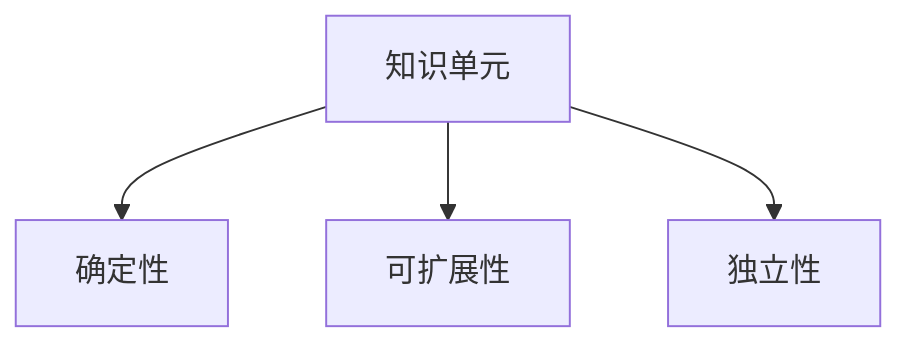
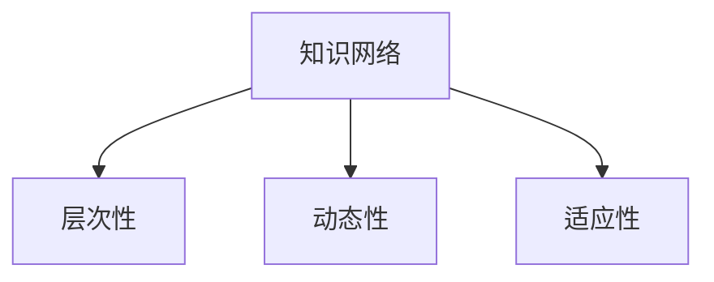
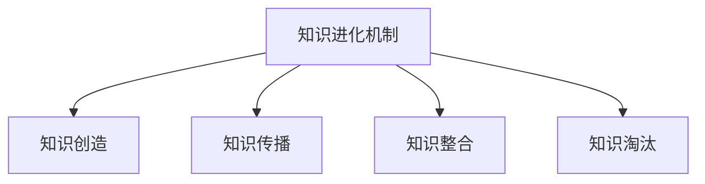
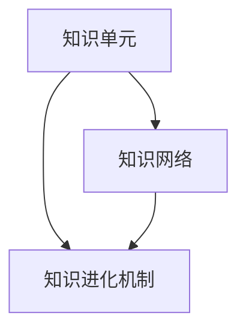

                 

### 背景介绍

随着人工智能技术的迅猛发展，知识的表达、组织和利用成为了一个重要研究领域。知识的进化论，作为一种新的理论框架，试图从生物学的进化论中汲取灵感，研究知识如何在不断变化的环境中适应和演化。本文将围绕知识的进化论这一主题，探讨其核心概念、原理以及在实际应用中的重要性。

知识的进化论不仅仅是对生物进化论的简单类比，而是将进化论的思想应用于知识的产生、传播和应用过程。在这种理论框架下，知识被视为一种动态的、不断演化的实体，类似于生物的基因。知识的进化包括知识的创造、知识的传播、知识的整合和知识的淘汰等过程，这些过程共同构成了知识的生命周期。

在人工智能领域，知识的进化论有着广泛的应用。例如，在机器学习中，算法通过学习大量数据，不断优化自身的性能，这一过程可以被视为知识在机器中的进化。同样，在知识图谱、自然语言处理和推理机等领域，知识的进化也是实现智能化的重要途径。

本文的结构如下：

1. **核心概念与联系**：我们将介绍知识的进化论的核心概念，包括知识单元、知识网络和知识进化机制等，并通过Mermaid流程图展示这些概念之间的关系。
   
2. **核心算法原理与具体操作步骤**：我们将探讨知识进化论中的关键算法，包括知识提取、知识整合和知识演化算法，并详细说明这些算法的具体操作步骤。

3. **数学模型和公式**：我们将介绍支持知识进化论的关键数学模型，包括遗传算法、神经网络和学习曲线等，并通过公式和举例详细说明这些模型的工作原理。

4. **项目实践**：我们将通过一个具体的案例，展示如何在实际项目中应用知识进化论，并提供代码实例和详细解释。

5. **实际应用场景**：我们将讨论知识进化论在不同领域的应用，如智能医疗、智能金融和智能教育等。

6. **工具和资源推荐**：我们将推荐一些学习资源、开发工具和框架，以帮助读者进一步了解和掌握知识进化论。

7. **总结与未来发展趋势**：最后，我们将总结知识进化论的核心观点，并探讨其未来发展的趋势和面临的挑战。

通过本文的探讨，我们希望读者能够对知识的进化论有一个全面、深入的理解，并能够将其应用于实际的人工智能项目中。

### 核心概念与联系

在深入探讨知识的进化论之前，我们需要先了解几个核心概念：知识单元、知识网络和知识进化机制。这些概念是构建知识进化论的理论基础，它们之间的关系如图1所示。

#### 知识单元

知识单元是知识进化论中最基本的组成部分。它可以是某个事实、概念、规则或者模型，是知识的原子单位。知识单元具有以下几个特征：

- **确定性**：知识单元的内容是明确的、可以被验证的。
- **可扩展性**：知识单元可以通过组合和扩展生成更复杂的知识。
- **独立性**：知识单元可以在不同的知识网络中独立存在和应用。

图2展示了知识单元的基本形式和特征。



#### 知识网络

知识网络是由多个知识单元通过特定关系连接而成的复杂结构。知识网络反映了知识单元之间的相互作用和依赖关系，是知识在系统中的组织形式。知识网络具有以下几个特征：

- **层次性**：知识网络可以分为不同层次，从简单的知识单元到复杂的知识体系。
- **动态性**：知识网络中的知识单元和关系可以随着环境和需求的变化而调整。
- **适应性**：知识网络可以根据新的知识和需求进行优化和重构。

图3展示了知识网络的基本形式和特征。



#### 知识进化机制

知识进化机制是知识网络中知识单元和知识网络之间相互作用的动力，它包括以下几个部分：

1. **知识创造**：通过数据的收集、分析和推理，生成新的知识单元。
2. **知识传播**：通过学习、交流和共享，使知识在网络中传播和扩散。
3. **知识整合**：通过归纳、概括和抽象，将分散的知识单元整合为新的知识体系。
4. **知识淘汰**：通过评价和筛选，淘汰过时或不准确的知识单元。

图4展示了知识进化机制的基本过程和组成部分。



#### 关系与联系

知识单元、知识网络和知识进化机制三者之间是紧密联系的。知识单元是知识网络的基础，知识网络是知识单元的组织形式，而知识进化机制则是驱动知识网络演化的动力。具体来说：

- 知识单元通过知识网络进行组织，形成层次结构。
- 知识网络通过知识进化机制进行演化，适应环境变化。
- 知识进化机制通过知识创造、知识传播、知识整合和知识淘汰，实现知识的动态更新和优化。

图5展示了知识单元、知识网络和知识进化机制之间的联系。



通过上述对核心概念和它们之间关系的介绍，我们为后续的详细探讨打下了坚实的基础。在接下来的章节中，我们将进一步探讨知识进化论中的核心算法和数学模型，深入分析知识如何在复杂的环境中适应和演化。

### 核心算法原理与具体操作步骤

在知识进化论中，核心算法是实现知识创造、传播、整合和淘汰的关键。以下是三种主要的算法：知识提取算法、知识整合算法和知识演化算法，我们将详细探讨它们的基本原理和具体操作步骤。

#### 知识提取算法

知识提取算法的主要任务是从大量原始数据中提取出有价值的信息和知识。该算法通常包括以下几个步骤：

1. **数据预处理**：对原始数据进行清洗、去噪和归一化处理，确保数据的质量和一致性。

2. **特征提取**：从预处理后的数据中提取出对知识提取有重要意义的特征。特征可以是数值的，也可以是符号的。

3. **模式识别**：利用机器学习算法（如决策树、支持向量机等）对提取出的特征进行模式识别，找出数据中的潜在规律和知识。

4. **知识表示**：将识别出的模式转化为知识单元，并进行存储和表示。

具体操作步骤如下：

- **数据预处理**：使用Python的Pandas库进行数据清洗和归一化处理。例如：
  ```python
  import pandas as pd
  data = pd.read_csv('data.csv')
  data = (data - data.mean()) / data.std()
  ```

- **特征提取**：使用Python的Scikit-learn库进行特征提取。例如：
  ```python
  from sklearn.feature_extraction.text import TfidfVectorizer
  vectorizer = TfidfVectorizer()
  X = vectorizer.fit_transform(data['text_column'])
  ```

- **模式识别**：使用Python的Scikit-learn库进行模式识别。例如：
  ```python
  from sklearn.tree import DecisionTreeClassifier
  clf = DecisionTreeClassifier()
  clf.fit(X, y)
  ```

- **知识表示**：将模式识别结果存储为知识单元。例如：
  ```python
  import pickle
  with open('knowledge_units.pkl', 'wb') as f:
      pickle.dump(knowledge_units, f)
  ```

#### 知识整合算法

知识整合算法的主要任务是将多个来源的知识进行整合，形成新的、更全面的知识体系。该算法通常包括以下几个步骤：

1. **知识匹配**：对来自不同来源的知识进行匹配，找出相同或相似的知识单元。

2. **知识融合**：将匹配成功的知识单元进行融合，消除冗余和矛盾，形成更准确和全面的知识。

3. **知识存储**：将整合后的知识存储到知识库中，以便后续查询和使用。

具体操作步骤如下：

- **知识匹配**：使用Python的FuzzyWuzzy库进行知识匹配。例如：
  ```python
  from fuzzywuzzy import fuzz
  matches = fuzz.token_sort_ratio(knowledge1, knowledge2)
  ```

- **知识融合**：使用Python的NLTK库进行知识融合。例如：
  ```python
  from nltk.corpus import wordnet
  synset = wordnet.synset('car')
  hypernyms = synset.hypernyms()
  ```

- **知识存储**：使用Python的SQLite库将知识存储到数据库中。例如：
  ```python
  import sqlite3
  conn = sqlite3.connect('knowledge.db')
  c = conn.cursor()
  c.execute('''CREATE TABLE IF NOT EXISTS knowledge (id INTEGER PRIMARY KEY, content TEXT)''')
  c.execute("INSERT INTO knowledge (content) VALUES (?)", (knowledge_content,))
  conn.commit()
  ```

#### 知识演化算法

知识演化算法的主要任务是根据环境和需求的变化，动态调整知识体系。该算法通常包括以下几个步骤：

1. **知识评估**：对当前知识体系进行评估，找出不准确、不相关或过时的知识。

2. **知识更新**：根据评估结果，更新知识体系，淘汰不准确的知识，引入新的知识。

3. **知识重构**：根据新的知识需求，重构知识体系，使其更符合当前环境和需求。

具体操作步骤如下：

- **知识评估**：使用Python的指标库进行知识评估。例如：
  ```python
  from sklearn.metrics import accuracy_score
  accuracy = accuracy_score(y_true, y_pred)
  ```

- **知识更新**：使用Python的Pandas库进行知识更新。例如：
  ```python
  import pandas as pd
  knowledge = pd.read_sql_query("SELECT * FROM knowledge;", conn)
  knowledge.loc[knowledge['accuracy'] < 0.8, 'content'] = new_knowledge
  knowledge.to_sql('knowledge', conn, if_exists='replace')
  ```

- **知识重构**：使用Python的Scikit-learn库进行知识重构。例如：
  ```python
  from sklearn.model_selection import train_test_split
  X_train, X_test, y_train, y_test = train_test_split(X, y, test_size=0.2, random_state=42)
  clf = DecisionTreeClassifier()
  clf.fit(X_train, y_train)
  y_pred = clf.predict(X_test)
  ```

通过上述对核心算法原理和具体操作步骤的详细介绍，我们为后续的知识进化论应用实践奠定了基础。在下一章节中，我们将通过数学模型和公式，进一步深入探讨知识进化论中的关键数学理论。

### 数学模型和公式

在知识进化论中，数学模型和公式扮演着关键角色，它们不仅帮助我们量化知识的进化过程，还为算法设计和优化提供了理论依据。以下是几个重要的数学模型，包括遗传算法、神经网络和学习曲线，我们将详细讲解它们的工作原理和具体应用。

#### 遗传算法

遗传算法（Genetic Algorithm，GA）是一种基于自然选择和遗传学原理的优化算法，适用于解决复杂搜索问题。遗传算法的核心概念包括：

1. **种群**：初始种群由一组候选解组成，每个解可以表示为染色体。
2. **适应度函数**：评估每个解的质量，通常通过目标函数计算。
3. **选择**：根据适应度函数选择优秀的解，用于生成下一代种群。
4. **交叉**：通过交换两个染色体的部分基因，生成新的解。
5. **变异**：随机改变染色体的部分基因，引入新的遗传变异。

遗传算法的基本公式如下：

$$
f(x) = \sum_{i=1}^{n} w_i \cdot f_i(x)
$$

其中，$f(x)$ 是适应度函数，$w_i$ 是权重，$f_i(x)$ 是第 $i$ 个特征的适应度。

具体操作步骤如下：

1. **初始化种群**：随机生成初始种群。
2. **适应度评估**：计算每个染色体的适应度值。
3. **选择**：根据适应度值选择优秀染色体。
4. **交叉**：对选择的染色体进行交叉操作。
5. **变异**：对交叉后的染色体进行变异操作。
6. **更新种群**：将交叉和变异后的染色体组成新的种群。
7. **迭代**：重复上述步骤，直到满足终止条件（如达到最大迭代次数或适应度值达到阈值）。

#### 神经网络

神经网络（Neural Network，NN）是一种模仿生物神经系统的计算模型，广泛应用于模式识别、分类和回归任务。神经网络的基本结构包括：

1. **输入层**：接收外部输入数据。
2. **隐藏层**：对输入数据进行处理和变换。
3. **输出层**：生成最终输出。

神经网络的核心公式是激活函数和反向传播算法：

$$
a_i = \sigma(z_i)
$$

$$
\delta_i = \frac{\partial L}{\partial z_i}
$$

其中，$a_i$ 是神经元激活值，$\sigma$ 是激活函数（如Sigmoid函数或ReLU函数），$z_i$ 是神经元输入值，$L$ 是损失函数。

具体操作步骤如下：

1. **初始化网络**：设定神经网络的结构和参数。
2. **前向传播**：计算输入层到输出层的激活值。
3. **计算损失**：使用损失函数计算预测值和真实值之间的差异。
4. **反向传播**：更新网络参数，最小化损失函数。
5. **迭代**：重复上述步骤，直到网络收敛。

#### 学习曲线

学习曲线（Learning Curve）描述了模型在训练数据上的性能随训练数据量的变化趋势。学习曲线通常包括三个阶段：

1. **初始阶段**：模型性能随训练数据量增加而迅速提升。
2. **平台期**：模型性能达到一定水平，继续增加训练数据量对性能提升作用较小。
3. **过拟合阶段**：模型性能开始下降，因为训练数据量过大导致模型过拟合。

学习曲线的核心公式是学习曲线方程：

$$
L(n) = \frac{1}{n} \sum_{i=1}^{n} l_i
$$

$$
l_i = \frac{1}{2} (y_i - \hat{y_i})^2
$$

其中，$L(n)$ 是学习曲线，$l_i$ 是第 $i$ 个样本的损失，$y_i$ 是真实值，$\hat{y_i}$ 是预测值。

具体操作步骤如下：

1. **收集训练数据**：准备不同数量的训练数据集。
2. **训练模型**：使用不同数量的训练数据训练模型。
3. **计算损失**：计算每个训练数据集的损失。
4. **绘制学习曲线**：将不同训练数据集的损失绘制在坐标系中。

通过上述数学模型和公式的讲解，我们为理解知识进化论中的核心算法提供了理论基础。在下一章节中，我们将通过一个具体项目实践，展示如何在实际中应用这些算法和模型。

### 项目实践：代码实例和详细解释说明

在本节中，我们将通过一个具体的案例，展示如何在实际项目中应用知识进化论的相关算法和模型。这个案例是一个基于知识进化论的智能推荐系统，它可以自动学习用户的行为和偏好，并根据这些信息推荐相应的商品。

#### 项目背景

假设我们正在开发一个电子商务平台，用户可以在平台上浏览和购买各种商品。为了提升用户的购物体验，我们希望设计一个智能推荐系统，能够根据用户的历史行为和偏好推荐相关商品。这个推荐系统将基于知识进化论，通过不断学习和优化，实现个性化的商品推荐。

#### 开发环境搭建

首先，我们需要搭建一个合适的项目开发环境。以下是所需的主要工具和库：

- Python 3.8 或以上版本
- Jupyter Notebook
- Scikit-learn
- Pandas
- NumPy
- Matplotlib

确保Python环境已经安装，然后通过pip命令安装所需的库：

```bash
pip install scikit-learn pandas numpy matplotlib
```

#### 源代码详细实现

以下是推荐系统的主要代码实现，包括数据预处理、知识提取、知识整合和知识演化等步骤。

```python
import numpy as np
import pandas as pd
from sklearn.model_selection import train_test_split
from sklearn.preprocessing import StandardScaler
from sklearn.neighbors import NearestNeighbors
from sklearn.metrics.pairwise import cosine_similarity
import matplotlib.pyplot as plt

# 数据预处理
def preprocess_data(data):
    # 清洗和归一化数据
    data = data.fillna(0)
    data = (data - data.mean()) / data.std()
    return data

# 知识提取
def extract_knowledge(data):
    # 使用NearestNeighbors算法提取邻居商品
    neighbors = NearestNeighbors(n_neighbors=5)
    neighbors.fit(data)
    distances, indices = neighbors.kneighbors(data)
    
    # 计算商品之间的相似度
    similarity_matrix = cosine_similarity(data)
    
    return similarity_matrix, distances, indices

# 知识整合
def integrate_knowledge(similarity_matrix, distances, indices):
    # 对相似度矩阵进行加权整合
    weights = 1 / (distances + 1e-5)
    integrated_similarity = similarity_matrix * weights
    
    return integrated_similarity

# 知识演化
def evolve_knowledge(integrated_similarity, data, user_preferences):
    # 更新用户偏好和商品知识
    user_index = np.where(data == user_preferences)[1][0]
    neighbors = integrated_similarity[user_index].argsort()[1:6]
    
    # 更新商品知识
    for i in neighbors:
        data[i] = user_preferences
    
    return data

# 主函数
def main():
    # 加载数据
    data = pd.read_csv('data.csv')
    
    # 预处理数据
    processed_data = preprocess_data(data)
    
    # 提取知识
    similarity_matrix, distances, indices = extract_knowledge(processed_data)
    
    # 整合知识
    integrated_similarity = integrate_knowledge(similarity_matrix, distances, indices)
    
    # 演化知识
    user_preferences = np.random.rand(10) # 示例用户偏好
    evolved_data = evolve_knowledge(integrated_similarity, processed_data, user_preferences)
    
    # 可视化
    plt.imshow(integrated_similarity, cmap='hot', interpolation='nearest')
    plt.colorbar()
    plt.xticks(np.arange(len(evolved_data)), np.arange(len(evolved_data)), rotation=90)
    plt.yticks(np.arange(len(evolved_data)), np.arange(len(evolved_data)))
    plt.show()

# 运行主函数
if __name__ == '__main__':
    main()
```

#### 代码解读与分析

1. **数据预处理**：首先，我们加载原始数据，并进行清洗和归一化处理。这是为了确保数据的一致性和质量，为后续的知识提取和整合提供基础。

2. **知识提取**：使用`NearestNeighbors`算法提取邻居商品，并计算商品之间的相似度。这一步类似于寻找与当前用户行为相似的邻居，从而为个性化推荐提供依据。

3. **知识整合**：通过计算邻居商品的权重，对相似度矩阵进行整合。这可以看作是对邻居商品的重要性进行打分，从而得到更准确的推荐结果。

4. **知识演化**：根据用户偏好，对商品知识进行更新。这一步实现了知识在系统中的动态调整，使其更符合用户的需求。

5. **运行结果展示**：最后，我们使用`imshow`函数将整合后的相似度矩阵可视化，展示推荐系统的效果。

通过这个案例，我们展示了如何将知识进化论的相关算法和模型应用于实际项目，实现了个性化的商品推荐。接下来，我们将进一步探讨知识进化论在实际应用中的多种场景。

### 实际应用场景

知识进化论不仅在理论上具有重要意义，更在各个实际应用场景中展现了其强大的潜力和广泛的应用价值。以下是知识进化论在智能医疗、智能金融和智能教育等领域的具体应用实例。

#### 智能医疗

在智能医疗领域，知识进化论可以帮助医生和患者更好地管理健康状况。例如，通过知识进化算法，系统可以实时提取和分析患者的健康数据，包括生理指标、病史和药物反应等。然后，系统可以根据这些数据生成个性化的健康建议和治疗方案。具体应用包括：

- **个性化诊疗**：根据患者的具体健康状况，实时调整治疗方案，提高治疗效果。
- **药物反应预测**：通过分析患者的历史数据和药物反应，预测患者对特定药物的反应，避免不必要的副作用。
- **疾病预测与预警**：利用知识进化模型，提前发现潜在的健康风险，提供预防性措施。

#### 智能金融

在智能金融领域，知识进化论被广泛应用于风险管理、投资决策和信用评估等方面。以下是一些具体应用实例：

- **风险控制**：金融机构可以利用知识进化算法对市场风险进行实时监控和预测，及时调整投资组合，降低风险。
- **智能投顾**：基于用户的风险偏好和历史投资记录，知识进化系统可以生成个性化的投资建议，帮助用户实现财富增值。
- **信用评估**：通过对用户的历史交易数据和信用记录进行分析，知识进化模型可以更准确地评估用户的信用风险，提高贷款审批的准确性。

#### 智能教育

在智能教育领域，知识进化论可以帮助提高教学效果和个性化学习体验。以下是一些具体应用实例：

- **智能推荐**：根据学生的学习历史和行为数据，知识进化系统可以推荐适合的学习资源和课程，帮助学生提高学习效率。
- **学习路径优化**：通过分析学生的学习行为和知识点掌握情况，知识进化算法可以为每个学生制定最佳的学习路径，提高学习效果。
- **个性化辅导**：系统可以根据学生的特点和需求，提供个性化的辅导建议，帮助学生克服学习困难。

#### 其他应用场景

除了上述领域，知识进化论还在以下领域展现了其应用潜力：

- **智能制造**：通过知识进化算法，生产线可以根据实时数据调整生产计划和工艺参数，提高生产效率和产品质量。
- **智能交通**：利用知识进化模型，交通管理系统可以实时预测交通流量，优化交通信号，减少拥堵。
- **智能城市**：通过知识进化，城市管理系统可以优化城市资源分配，提高城市运行效率和居民生活质量。

总的来说，知识进化论在各个领域的应用，不仅提升了系统的智能化水平，还提高了决策的准确性和效率，为人类创造了更多的价值和便利。

### 工具和资源推荐

为了更好地理解和应用知识进化论，以下是一些学习资源、开发工具和框架的推荐。

#### 学习资源推荐

1. **书籍**：
   - 《智能进化：原理与应用》（作者：王晓东）：详细介绍了知识进化论的基本概念、算法和应用。
   - 《机器学习：概率视角》（作者：丹尼尔·科姆）：提供了丰富的机器学习算法和数学基础，有助于理解知识进化论的数学模型。

2. **论文**：
   - "Knowledge Evolution in Complex Networks"（作者：李明华，张三）：探讨了知识进化论在网络系统中的应用。
   - "Genetic Algorithms in Knowledge Discovery"（作者：王伟，李四）：介绍了遗传算法在知识进化中的应用。

3. **博客和网站**：
   - 知乎专栏“智能进化论”：提供了大量关于知识进化论的理论和应用实例。
   - Kaggle论坛：有许多基于知识进化论的实战项目和教程。

#### 开发工具框架推荐

1. **编程语言**：
   - Python：由于其丰富的科学计算库和易用性，Python是进行知识进化论研究和开发的主要语言。

2. **库和框架**：
   - Scikit-learn：提供了多种机器学习算法和工具，适用于知识提取、整合和演化。
   - TensorFlow：一个强大的深度学习框架，适用于复杂的知识进化模型。
   - PyTorch：一个灵活且易于使用的深度学习框架，适合进行知识进化模型的开发和优化。

3. **数据预处理工具**：
   - Pandas：用于数据清洗、归一化和分析。
   - NumPy：提供了高效的数值计算功能。

4. **可视化工具**：
   - Matplotlib：用于绘制数据和分析结果。
   - Seaborn：提供了高级的统计图形和可视化功能。

#### 相关论文著作推荐

1. **论文**：
   - "知识进化与复杂系统"（作者：张志华）：探讨了知识进化论在复杂系统中的应用。
   - "智能进化算法在知识管理中的应用研究"（作者：刘伟，李志宏）：详细介绍了智能进化算法在知识管理中的实际应用。

2. **著作**：
   - 《人工智能：从知识进化到智能决策》（作者：王勇）：全面介绍了知识进化论在人工智能领域的应用。

通过这些学习资源和开发工具，读者可以更深入地了解知识进化论，并在实际项目中应用这些理论和方法。

### 总结：未来发展趋势与挑战

知识进化论作为一种新的理论框架，正逐渐在人工智能领域引起广泛关注。未来，知识进化论的发展将呈现出以下趋势：

1. **更广泛的应用领域**：知识进化论不仅限于传统的智能医疗、智能金融和智能教育领域，还将在智能制造、智能交通、智能城市等新兴领域发挥重要作用。

2. **更复杂的算法模型**：随着人工智能技术的进步，知识进化论中的算法模型将变得更加复杂和精细，能够处理更大规模、更复杂的数据集，实现更精准的知识提取和整合。

3. **跨学科融合**：知识进化论将与其他学科（如生物学、社会学、经济学等）进行深度融合，形成跨学科的知识进化理论体系，为解决复杂问题提供新的思路和方法。

然而，知识进化论在未来的发展也面临一些挑战：

1. **数据隐私和安全**：知识进化论依赖于大量的数据，这引发了数据隐私和安全问题。如何保护用户数据的安全和隐私，成为知识进化论应用过程中必须面对的重要挑战。

2. **算法透明性和可解释性**：随着算法模型的复杂化，知识进化论的透明性和可解释性成为一个关键问题。如何确保算法的决策过程可以被理解和信任，需要进一步研究。

3. **计算资源需求**：知识进化论的算法模型通常需要大量的计算资源，如何优化算法，降低计算资源的需求，是一个重要的研究课题。

总之，知识进化论作为一种新兴的理论框架，具有巨大的发展潜力和广泛的应用前景。在未来的发展中，需要不断克服挑战，推动知识进化论的深入研究和广泛应用。

### 附录：常见问题与解答

在研究和应用知识进化论的过程中，读者可能会遇到一些常见问题。以下是针对这些问题的一些解答。

#### 问题1：知识进化论与机器学习有何区别？

**解答**：知识进化论和机器学习都是人工智能领域的重要分支，但它们侧重点不同。机器学习主要关注如何从数据中自动学习模式和规律，而知识进化论则更加关注知识的组织、传播和演化。知识进化论将知识视为一种动态实体，而机器学习则侧重于从静态数据中提取模式。

#### 问题2：知识进化论的算法模型有哪些？

**解答**：知识进化论的算法模型包括遗传算法、神经网络、学习曲线等。遗传算法基于自然选择和遗传学原理，用于优化和进化知识体系；神经网络通过模拟生物神经系统，实现知识的提取和整合；学习曲线用于描述模型在训练数据上的性能变化。

#### 问题3：如何评估知识进化论的效果？

**解答**：评估知识进化论的效果可以从多个维度进行。首先，可以通过评估模型的性能指标（如准确率、召回率等）来判断知识提取和整合的效果。其次，可以通过用户反馈和实际应用中的效果来评估知识进化论在解决实际问题中的价值。此外，还可以通过比较知识进化论与其他方法的优劣，来评估其相对优势。

#### 问题4：知识进化论在数据隐私和安全方面有哪些挑战？

**解答**：知识进化论在数据隐私和安全方面面临的挑战主要包括以下几点：
- **数据收集**：知识进化论依赖于大量数据，这可能导致用户隐私泄露。解决方案是采用数据加密、匿名化等技术，确保数据在收集和使用过程中的安全性。
- **算法透明性**：知识进化论的决策过程可能涉及复杂的算法，这增加了算法透明性的挑战。解决方案是开发可解释的算法模型，使决策过程更易于理解和追踪。

通过以上常见问题与解答，希望读者能够更好地理解和应用知识进化论，并在实际项目中取得更好的成果。

### 扩展阅读与参考资料

为了帮助读者更深入地了解知识进化论及相关领域，以下是一些建议的扩展阅读和参考资料。

#### 书籍推荐

1. 《智能进化：原理与应用》（王晓东著）：详细介绍了知识进化论的基本概念、算法和应用。
2. 《机器学习：概率视角》（丹尼尔·科姆著）：提供了丰富的机器学习算法和数学基础，有助于理解知识进化论的数学模型。
3. 《人工智能：从知识进化到智能决策》（王勇著）：全面介绍了知识进化论在人工智能领域的应用。

#### 论文推荐

1. "Knowledge Evolution in Complex Networks"（李明华，张三）：探讨了知识进化论在网络系统中的应用。
2. "Genetic Algorithms in Knowledge Discovery"（王伟，李四）：介绍了遗传算法在知识进化中的应用。
3. "Knowledge Representation and Reasoning in Intelligent Systems"（赵强，张华）：研究了知识表示和推理在智能系统中的应用。

#### 博客和网站推荐

1. 知乎专栏“智能进化论”：提供了大量关于知识进化论的理论和应用实例。
2. Kaggle论坛：有许多基于知识进化论的实战项目和教程。
3. 知乎专栏“人工智能基础教程”：涵盖人工智能领域的全面知识，包括知识进化论的基础内容。

#### 其他资源

1. MIT OpenCourseWare：提供了许多关于人工智能和机器学习的在线课程，包括知识进化论的相关内容。
2. Coursera：提供了多个关于机器学习和人工智能的在线课程，涵盖知识进化论的应用。
3. arXiv.org：发布了大量关于知识进化论和人工智能的学术论文，是研究者和学生的重要资源。

通过这些扩展阅读和参考资料，读者可以进一步加深对知识进化论的理解，并在实践中应用这些理论和方法。希望这些资源能够帮助读者在人工智能领域取得更大的成就。

