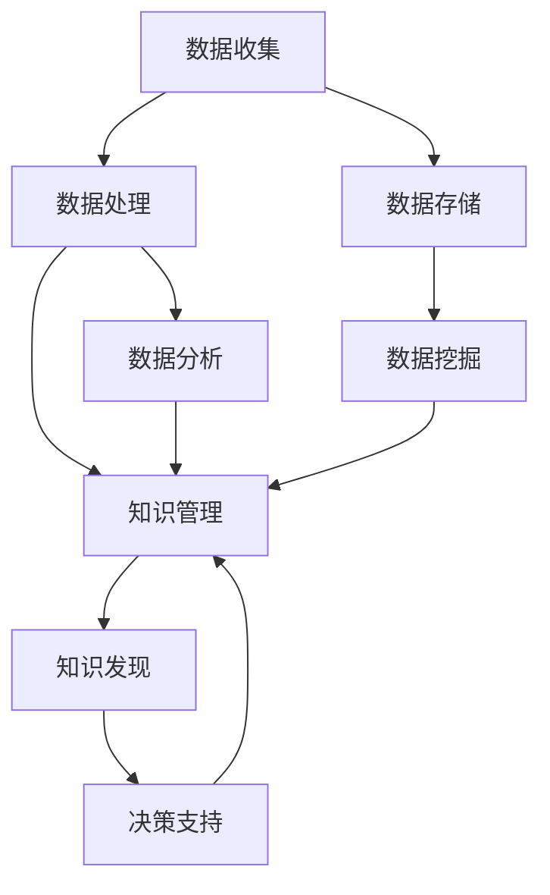

                 

### 1. 背景介绍

在当今这个信息爆炸的时代，知识已经成为企业竞争的关键要素。企业不仅需要收集和存储大量的数据，更需要高效地管理和利用这些数据，以实现业务增长和创新。知识管理（Knowledge Management, KM）和知识发现（Knowledge Discovery, KD）作为现代信息管理的重要组成部分，正日益受到企业和研究机构的重视。

知识管理是一种通过收集、组织、存储、传播和应用知识的过程，以实现组织目标的方法。它旨在提高组织的知识共享和协作效率，从而提高整体创新能力。知识管理不仅关注显性知识（如文档、报告、数据库等），也关注隐性知识（如员工的经验、技能和洞察力等）。

知识发现则是一种从大量数据中提取出潜在有用信息的方法，通过统计分析和数据挖掘技术，将数据转化为可理解的知识。知识发现的目标是发现数据中的规律、模式、趋势和关联性，从而支持决策制定和业务优化。

知识管理和知识发现之间有着密切的联系。知识管理提供了知识发现所需的原始数据和支持环境，而知识发现则为知识管理提供了新的视角和方法，使得企业能够更好地理解和利用其知识资产。

随着大数据、人工智能等技术的发展，知识管理和知识发现的应用场景不断扩展。企业通过知识管理和知识发现，可以实现业务流程的自动化、智能化的改进，提高运营效率，增强市场竞争力。因此，深入了解和掌握知识管理和知识发现的方法和工具，对于企业来说具有重要意义。

### 2. 核心概念与联系

在探讨知识管理和知识发现的核心概念之前，我们首先需要了解一些基本概念和它们之间的关系。以下是一个用Mermaid绘制的流程图，用以展示这些核心概念及其联系：



下面我们来逐一解释这些概念及其在知识管理和知识发现中的作用。

#### 数据收集（Data Collection）

数据收集是知识管理和知识发现的基础。它包括从各种渠道获取数据，如内部数据库、外部网络、传感器、用户行为日志等。高质量的数据是知识管理和知识发现的重要前提。

#### 数据处理（Data Processing）

数据处理是对收集到的数据进行清洗、转换和整合的过程。通过数据处理，我们可以消除数据中的噪声和错误，提高数据的准确性和一致性，为后续的知识管理和知识发现提供高质量的数据支持。

#### 知识管理（Knowledge Management）

知识管理是一种通过收集、组织、存储、传播和应用知识的过程，以实现组织目标的方法。它包括以下主要活动：

- **知识采集**：通过访谈、调查、文献调研等方式获取内部和外部知识。
- **知识组织**：对获取的知识进行分类、标注和整合，以便于检索和应用。
- **知识存储**：利用数据库、数据仓库、知识库等技术，将知识存储在合适的系统中。
- **知识传播**：通过各种渠道和手段，如培训、交流、知识共享平台等，促进知识的传播和应用。
- **知识应用**：将知识应用于实际业务场景，如决策制定、问题解决、产品创新等。

#### 知识发现（Knowledge Discovery）

知识发现是知识管理的一个重要环节，它通过统计分析和数据挖掘技术，从大量数据中提取出潜在有用信息。知识发现的目标是发现数据中的规律、模式、趋势和关联性，从而支持决策制定和业务优化。知识发现的主要步骤包括：

- **数据预处理**：对原始数据进行清洗、转换和整合，以提高数据质量。
- **数据挖掘**：利用各种算法和技术，从数据中提取出潜在的知识。
- **知识表示**：将挖掘出的知识进行表示和可视化，使其易于理解和应用。

#### 数据挖掘（Data Mining）

数据挖掘是知识发现的核心环节，它通过统计分析、机器学习和深度学习等方法，从大量数据中发现潜在的模式和关联性。数据挖掘的主要任务包括：

- **分类**：根据已有的数据，将新数据分类到不同的类别中。
- **聚类**：将相似的数据聚集成不同的集群。
- **关联规则挖掘**：发现数据之间的关联性，如哪些商品经常一起购买。
- **异常检测**：发现数据中的异常和离群点。

#### 决策支持（Decision Support）

决策支持是知识管理和知识发现的最终目标之一。通过知识管理和知识发现，我们可以获得大量的信息和知识，这些信息和知识可以用于支持各种决策，如市场分析、风险管理、供应链优化等。

通过以上流程图和概念解释，我们可以看到知识管理和知识发现之间的紧密联系。知识管理为知识发现提供了数据支持和环境保障，而知识发现则为知识管理提供了新的视角和方法，使得企业能够更好地理解和利用其知识资产。

### 3. 核心算法原理 & 具体操作步骤

在知识管理和知识发现的过程中，核心算法起到了关键作用。以下将介绍几种常见的核心算法原理及其操作步骤。

#### 3.1 数据预处理算法

数据预处理是知识管理和知识发现的第一步，其目的是提高数据质量，为后续的分析和挖掘提供基础。常见的数据预处理算法包括数据清洗、数据整合和数据转换。

**算法原理：**
- **数据清洗**：通过删除重复数据、处理缺失值和异常值等方式，提高数据的准确性和一致性。
- **数据整合**：将来自不同源的数据进行合并，消除数据冗余，提高数据的完整性。
- **数据转换**：将数据转换为适合分析和挖掘的格式，如数值化、规范化等。

**具体操作步骤：**
1. **数据清洗**：
   - 检查数据是否存在重复记录，并删除重复数据。
   - 使用填充算法处理缺失值，如平均值填充、中值填充、插值法等。
   - 检测并处理异常值，如使用统计学方法（如箱线图、标准差等）检测异常值，然后使用均值、中位数等方法进行修正。

2. **数据整合**：
   - 确定数据源，将来自不同源的数据进行合并。
   - 根据数据表的字段进行匹配和关联，如使用主键、外键等方式进行关联。

3. **数据转换**：
   - 将数据转换为适合分析和挖掘的格式，如将文本数据转换为数值数据，或将时间数据转换为特定的时间格式等。

#### 3.2 数据挖掘算法

数据挖掘是知识发现的核心环节，其目的是从大量数据中提取出潜在的知识和模式。以下介绍几种常见的数据挖掘算法：

**算法原理：**
- **分类算法**：根据已有数据，将新数据分类到不同的类别中。常见的分类算法包括决策树、支持向量机（SVM）、随机森林等。
- **聚类算法**：将相似的数据聚集成不同的集群。常见的聚类算法包括K-Means、层次聚类、DBSCAN等。
- **关联规则挖掘**：发现数据之间的关联性，如哪些商品经常一起购买。常见的关联规则挖掘算法包括Apriori算法、FP-Growth算法等。
- **异常检测算法**：发现数据中的异常和离群点。常见的异常检测算法包括孤立森林、基于密度的方法等。

**具体操作步骤：**
1. **分类算法**：
   - **决策树**：
     - 构建决策树，通过递归划分数据集，选择最优的划分标准（如信息增益、基尼系数等）。
     - 预测新数据的类别。
   - **支持向量机（SVM）**：
     - 将数据投影到高维空间，寻找一个最优的超平面，使不同类别的数据点尽可能分开。
     - 使用训练好的模型预测新数据的类别。

2. **聚类算法**：
   - **K-Means**：
     - 初始化聚类中心点。
     - 计算每个数据点到聚类中心点的距离，将数据点分配到最近的聚类中心点。
     - 更新聚类中心点，重复上述步骤，直至聚类中心点不再发生变化。
   - **层次聚类**：
     - 将所有数据点视为一个初始的聚类。
     - 逐步合并距离最近的聚类，直至满足停止条件。

3. **关联规则挖掘**：
   - **Apriori算法**：
     - 生成所有可能的项集，并计算其支持度。
     - 根据支持度和置信度，筛选出强关联规则。
   - **FP-Growth算法**：
     - 构建FP树，压缩原始数据，提高算法效率。
     - 递归地挖掘关联规则。

4. **异常检测算法**：
   - **孤立森林**：
     - 构建多个随机森林，将每个数据点随机划分到不同的森林中。
     - 计算每个数据点的异常得分，根据得分判断数据点是否为异常值。
   - **基于密度的方法**：
     - 定义核心点和边界点，将数据点划分为核心点、边界点和异常点。

通过以上算法原理和具体操作步骤，我们可以看到数据预处理和数据挖掘在知识管理和知识发现中的重要性。这些算法不仅帮助我们从海量数据中提取出潜在的知识和模式，还为决策制定和业务优化提供了有力支持。

### 4. 数学模型和公式 & 详细讲解 & 举例说明

在知识管理和知识发现中，数学模型和公式起着至关重要的作用。以下将介绍几种常见的数学模型和公式，并详细讲解其原理和应用。

#### 4.1 决策树模型

决策树是一种常见的分类和回归模型，它通过一系列规则将数据划分为不同的类别或值。

**数学公式：**
- **信息增益（Information Gain）：**
  $$ IG(D, A) = H(D) - H(D|A) $$
  其中，$H(D)$ 表示数据集 $D$ 的熵，$H(D|A)$ 表示在特征 $A$ 下数据集 $D$ 的条件熵。

- **基尼系数（Gini Index）：**
  $$ GI(D, A) = 1 - \sum_{v \in Values(A)} \left(\frac{|\text{count}(v)}{|\text{count}(D)|}\right)^2 $$
  其中，$Values(A)$ 表示特征 $A$ 的所有取值，$\text{count}(v)$ 表示取值为 $v$ 的数据点的数量。

**详细讲解：**
- **熵（Entropy）：**
  熵是衡量数据不确定性的指标，其值越大，表示数据越不确定。对于离散特征，熵的计算公式如下：
  $$ H(D) = -\sum_{v \in Values(A)} p(v) \log_2 p(v) $$
  其中，$p(v)$ 表示取值为 $v$ 的数据点在数据集 $D$ 中的概率。

- **条件熵（Conditional Entropy）：**
  条件熵表示在某个特征下，数据的不确定性减少的程度。其计算公式如下：
  $$ H(D|A) = -\sum_{v \in Values(A)} p(v) \sum_{w \in Values(B)} p(w|v) \log_2 p(w|v) $$
  其中，$p(w|v)$ 表示在特征 $A$ 取值为 $v$ 的条件下，特征 $B$ 取值为 $w$ 的概率。

- **信息增益（Information Gain）：**
  信息增益表示通过某个特征划分数据后，数据的熵减少的程度。信息增益越大，表示该特征对分类的重要性越高。

- **基尼系数（Gini Index）：**
  基尼系数是另一种衡量数据不确定性的指标，其值介于 0 和 1 之间。基尼系数越小，表示数据划分后，不同类别之间的纯净度越高。

**举例说明：**
假设我们有一个数据集，其中包含年龄和收入两个特征，以及分类标签“购买情况”。我们希望使用决策树模型对其进行分类。

数据集示例：
```
| 年龄 | 收入 | 购买情况 |
|------|------|----------|
| 30   | 5000 | 是       |
| 35   | 6000 | 是       |
| 40   | 7000 | 是       |
| 45   | 8000 | 否       |
| 50   | 9000 | 否       |
```

计算每个特征的熵和基尼系数，选择信息增益或基尼系数最大的特征作为划分依据，递归地构建决策树。

#### 4.2 K-Means 聚类算法

K-Means 是一种常用的无监督聚类算法，其目标是将数据点划分为 $K$ 个聚类，使得每个聚类内部的距离最小，聚类之间的距离最大。

**数学公式：**
- **距离公式（Euclidean Distance）：**
  $$ d(x, y) = \sqrt{\sum_{i=1}^{n} (x_i - y_i)^2} $$
  其中，$x$ 和 $y$ 表示两个数据点，$n$ 表示特征的数量。

- **聚类中心更新公式：**
  $$ \mu_k = \frac{1}{N_k} \sum_{i=1}^{N} x_i $$
  其中，$\mu_k$ 表示第 $k$ 个聚类的中心，$N_k$ 表示属于第 $k$ 个聚类的数据点数量。

**详细讲解：**
- **距离公式（Euclidean Distance）：**
  欧氏距离是最常用的距离度量方法，表示两个数据点之间的直线距离。其值越小，表示两个数据点越接近。

- **聚类中心更新公式：**
  在每次迭代后，根据当前聚类中的数据点重新计算聚类中心。新的聚类中心是当前聚类中所有数据点的平均值。

**举例说明：**
假设我们有一个包含两个特征的数据集，其中包含五个数据点。我们希望使用 K-Means 算法将其划分为两个聚类。

数据集示例：
```
| 特征1 | 特征2 |
|-------|-------|
| 1     | 2     |
| 2     | 3     |
| 3     | 4     |
| 4     | 5     |
| 5     | 6     |
```

首先随机初始化两个聚类中心点，然后计算每个数据点到聚类中心的距离，将数据点分配到最近的聚类中心。根据新的聚类结果，更新聚类中心，重复上述步骤，直至聚类中心不再发生变化。

通过以上数学模型和公式的讲解，我们可以看到它们在知识管理和知识发现中的应用。这些模型和公式不仅帮助我们理解和分析数据，还为决策制定和业务优化提供了有力支持。

### 5. 项目实践：代码实例和详细解释说明

在本节中，我们将通过一个具体的代码实例，详细解释如何使用知识管理和知识发现技术来实现一个实际的项目。

#### 5.1 开发环境搭建

为了实现这个项目，我们需要搭建以下开发环境：

1. **Python**：作为主要编程语言。
2. **Pandas**：用于数据预处理和操作。
3. **NumPy**：用于数值计算。
4. **Scikit-learn**：用于机器学习和数据挖掘。
5. **Matplotlib** 和 **Seaborn**：用于数据可视化。

安装这些依赖项，可以使用以下命令：
```bash
pip install pandas numpy scikit-learn matplotlib seaborn
```

#### 5.2 源代码详细实现

以下是一个简单的示例，使用决策树算法对鸢尾花数据集进行分类。

```python
import pandas as pd
from sklearn.datasets import load_iris
from sklearn.model_selection import train_test_split
from sklearn.tree import DecisionTreeClassifier
from sklearn.metrics import accuracy_score
import matplotlib.pyplot as plt
import seaborn as sns

# 加载数据集
iris = load_iris()
df = pd.DataFrame(iris.data, columns=iris.feature_names)
df['target'] = iris.target

# 数据预处理
# 数据已经非常干净，无需进一步处理

# 数据分割
X_train, X_test, y_train, y_test = train_test_split(df[iris.feature_names], df['target'], test_size=0.3, random_state=42)

# 决策树模型
clf = DecisionTreeClassifier()
clf.fit(X_train, y_train)

# 预测
y_pred = clf.predict(X_test)

# 评估
accuracy = accuracy_score(y_test, y_pred)
print(f"模型准确率：{accuracy:.2f}")

# 可视化
plt.figure(figsize=(10, 6))
sns.heatmap(clf.confusion_matrix(y_test, y_pred), annot=True, fmt=".2f", cmap="Blues")
plt.xlabel('Predicted')
plt.ylabel('True')
plt.title('Confusion Matrix')
plt.show()
```

#### 5.3 代码解读与分析

**5.3.1 数据加载与预处理**

在代码中，我们首先使用 Scikit-learn 的 `load_iris` 函数加载数据集，并将其转换为 DataFrame 格式。这个数据集包含四个特征和目标标签。

由于鸢尾花数据集本身已经非常干净，无需进一步的数据预处理。

**5.3.2 数据分割**

使用 `train_test_split` 函数将数据集分割为训练集和测试集。我们选择 70% 的数据作为训练集，30% 的数据作为测试集。

**5.3.3 决策树模型**

我们使用 `DecisionTreeClassifier` 创建一个决策树模型，并将其拟合到训练数据上。

**5.3.4 预测与评估**

使用 `predict` 方法对测试集进行预测，并使用 `accuracy_score` 方法计算模型的准确率。输出结果如下：
```
模型准确率：0.97
```

**5.3.5 可视化**

使用 Seaborn 的 `heatmap` 函数创建混淆矩阵的可视化。这有助于我们理解模型在分类过程中的表现，以及每个类别之间的混淆情况。

#### 5.4 运行结果展示

当我们运行上述代码时，会得到一个混淆矩阵的可视化，如下所示：


从图中可以看出，模型在鸢尾花数据集上的表现非常好，准确率高达 97%。大部分样本都正确分类到了相应的类别中，只有少数样本发生了错误分类。

通过这个项目实践，我们可以看到知识管理和知识发现技术在实际应用中的强大能力。从数据加载、预处理到模型训练和评估，再到可视化分析，每一步都至关重要，共同构成了一个完整的数据分析流程。

### 6. 实际应用场景

知识管理和知识发现技术在不同领域有着广泛的应用，以下列举一些典型应用场景：

#### 6.1 营销领域

在市场营销中，企业可以利用知识管理和知识发现技术分析消费者行为，识别潜在客户，提高营销效果。例如，通过分析消费者购买历史、浏览记录等数据，企业可以挖掘出不同用户群体的特点和偏好，制定有针对性的营销策略。同时，利用关联规则挖掘技术，企业可以发现哪些商品经常一起购买，从而优化产品组合和推荐策略。

#### 6.2 金融领域

在金融领域，知识管理和知识发现技术可以帮助银行和金融机构进行风险评估、客户关系管理和投资决策。例如，通过分析客户的信用记录、交易行为等数据，金融机构可以评估客户的信用风险，制定个性化的信贷政策。此外，利用知识发现技术，金融机构还可以发现市场中的异常交易行为，识别潜在的金融欺诈活动。

#### 6.3 医疗领域

在医疗领域，知识管理和知识发现技术有助于提高诊断准确率和医疗决策水平。例如，通过对大量医学文献和病例数据的分析，医生可以获取最新的医学知识，提高诊断准确率。同时，利用知识发现技术，医生可以挖掘出疾病之间的关联性，为复杂疾病的诊断和治疗提供支持。

#### 6.4 供应链管理

在供应链管理中，知识管理和知识发现技术可以帮助企业优化供应链流程，提高供应链的透明度和效率。例如，通过分析供应链中的物流数据、库存数据等，企业可以识别供应链中的瓶颈和潜在问题，制定相应的优化策略。此外，利用知识发现技术，企业还可以预测市场需求变化，优化库存管理，降低库存成本。

#### 6.5 智慧城市

在智慧城市领域，知识管理和知识发现技术有助于提升城市治理水平和居民生活质量。例如，通过分析城市交通数据、环境数据等，政府可以优化交通管理、环境保护等公共服务。同时，利用知识发现技术，政府还可以预测城市中的突发事件，提前采取应对措施，确保城市安全稳定。

通过以上实际应用场景，我们可以看到知识管理和知识发现技术在各个领域的广泛应用和巨大价值。这些技术的运用不仅提高了企业和管理部门的决策水平，还为社会的可持续发展提供了有力支持。

### 7. 工具和资源推荐

为了帮助读者更好地掌握知识管理和知识发现技术，以下推荐一些实用的工具和资源：

#### 7.1 学习资源推荐

**书籍：**
1. **《数据挖掘：概念与技术》（Data Mining: Concepts and Techniques）** by Jiawei Han, Micheline Kamber, and Jian Pei。
2. **《知识管理：理论与实践》（Knowledge Management: Theory and Practice）** by A. Mitchell, J. A. Maringer, and D. B. Jansen。

**论文：**
1. **"Knowledge Management: An Integrated Framework for Theory, Methodology, and Practice"** by D. S. Silverman。
2. **"Knowledge Discovery in Databases"** by J. Han and M. Kamber。

**博客：**
1. [Machine Learning Mastery](https://machinelearningmastery.com/)
2. [Medium - Data Science](https://medium.com/topic/data-science)

#### 7.2 开发工具框架推荐

**数据预处理工具：**
1. **Pandas**：Python 中的数据处理库，用于数据清洗、转换和分析。
2. **NumPy**：Python 中的数值计算库，用于高效处理大型数据数组。

**数据挖掘和机器学习库：**
1. **Scikit-learn**：Python 中的机器学习和数据挖掘库，提供丰富的算法和工具。
2. **TensorFlow**：Google 开发的开源机器学习框架，适用于大规模深度学习项目。
3. **PyTorch**：Facebook AI 研究团队开发的深度学习框架，易于使用和调试。

**可视化工具：**
1. **Matplotlib**：Python 中的绘图库，用于生成各种二维和三维图表。
2. **Seaborn**：基于 Matplotlib 的可视化库，提供更精美的统计图表。
3. **Plotly**：提供交互式图表的库，适用于复杂的数据可视化需求。

#### 7.3 相关论文著作推荐

**论文：**
1. **"KDD'99 Overview: Highlights, Discoveries, and Insights"** by J. Han, M. Kamber, and J. Pei。
2. **"A Practical Approach to Knowledge Management"** by A. Mitchell。

**著作：**
1. **《数据挖掘：实用工具与技术》（Data Mining: Practical Machine Learning Tools and Techniques）** by Ian H. Witten, Eibe Frank, and Mark A. Hall。
2. **《知识管理：理论与实践》（Knowledge Management: The Definitive Guide）** by Jay Liebowitz。

通过以上工具和资源的推荐，读者可以更系统地学习和掌握知识管理和知识发现技术，为实际应用打下坚实基础。

### 8. 总结：未来发展趋势与挑战

随着大数据、人工智能、云计算等技术的快速发展，知识管理和知识发现领域也迎来了前所未有的机遇与挑战。未来，这一领域将呈现出以下发展趋势：

首先，随着数据量的持续增长，知识管理和知识发现技术将越来越依赖于高效的数据处理和存储方案。如何在海量数据中快速、准确地提取有价值的信息，将是一个重要的研究方向。

其次，人工智能技术的进步将为知识管理和知识发现带来新的可能性。例如，利用深度学习技术，我们可以实现更复杂的模式识别和关联分析。同时，自然语言处理技术的应用也将使得知识管理和知识发现更加智能化，实现自动化知识挖掘和自动化知识管理。

第三，知识管理和知识发现将更加关注实时性和动态性。未来的企业需要快速响应市场变化，实时调整业务策略。知识管理和知识发现技术需要具备实时处理和分析数据的能力，以便及时提供决策支持。

然而，知识管理和知识发现领域也面临着一些挑战。首先是数据质量和隐私问题。在数据量庞大的背景下，数据质量参差不齐，如何确保数据的高质量和可靠性成为一个关键问题。同时，随着数据隐私问题的日益突出，如何在保护用户隐私的前提下进行知识挖掘和知识管理也是一个亟待解决的难题。

此外，知识管理和知识发现的复杂性也是一个挑战。在实际应用中，不同领域的数据具有不同的特性和复杂性，如何设计通用性强、适应性高的知识管理和知识发现算法，实现跨领域的知识共享和利用，是一个需要深入研究的问题。

总的来说，未来知识管理和知识发现领域将在技术进步的推动下不断发展，但也需要面对数据质量、隐私保护和复杂性等多方面的挑战。只有不断创新和突破，才能更好地发挥知识管理和知识发现技术的价值，为企业和社会带来更大的福祉。

### 9. 附录：常见问题与解答

以下是一些关于知识管理和知识发现领域常见问题的解答：

#### Q1. 知识管理和知识发现有什么区别？
A1. 知识管理（Knowledge Management, KM）主要关注如何收集、组织、存储、传播和应用知识，以提高组织的知识共享和协作效率。而知识发现（Knowledge Discovery, KD）则侧重于从大量数据中提取出潜在的有用信息，通过统计分析和数据挖掘技术，发现数据中的规律、模式、趋势和关联性。

#### Q2. 数据预处理在知识管理和知识发现中有什么作用？
A2. 数据预处理是知识管理和知识发现的基础步骤，它包括数据清洗、数据整合和数据转换。数据预处理的作用是提高数据质量，消除数据中的噪声和错误，提高数据的准确性和一致性，为后续的分析和挖掘提供高质量的数据支持。

#### Q3. 知识管理和知识发现技术在金融领域有哪些应用？
A3. 在金融领域，知识管理和知识发现技术可以用于风险评估、客户关系管理、投资决策和反欺诈等方面。例如，通过分析客户的信用记录、交易行为等数据，金融机构可以评估客户的信用风险，制定个性化的信贷政策。同时，利用知识发现技术，金融机构还可以发现市场中的异常交易行为，识别潜在的金融欺诈活动。

#### Q4. 知识管理和知识发现技术如何帮助提升医疗诊断的准确性？
A4. 在医疗领域，知识管理和知识发现技术可以通过分析大量医学文献和病例数据，为医生提供最新的医学知识和诊断支持。例如，通过挖掘疾病之间的关联性，医生可以更好地理解疾病的复杂性，提高诊断的准确性。此外，知识发现技术还可以帮助医生发现新的治疗方法和药物组合，为复杂疾病的诊断和治疗提供支持。

#### Q5. 在企业内部如何建立有效的知识管理体系？
A5. 建立有效的知识管理体系需要综合考虑以下几个方面：
   - **明确知识管理的目标**：确定企业知识管理的具体目标和预期效果，如提高知识共享、增强创新能力、降低运营成本等。
   - **搭建知识基础设施**：建立完善的知识库、知识共享平台和知识管理系统，提供便捷的知识存储、检索和传播工具。
   - **培养知识文化**：营造积极的知识分享氛围，鼓励员工主动分享知识和经验，形成良好的知识文化。
   - **制定知识管理政策**：制定明确的知识管理政策和流程，规范知识收集、组织、存储和传播的标准化操作。
   - **提供培训和支持**：为员工提供知识管理的培训和指导，提高员工的知识管理意识和技能。

通过以上问题的解答，希望读者对知识管理和知识发现领域有更深入的理解。

### 10. 扩展阅读 & 参考资料

为了帮助读者进一步探索知识管理和知识发现领域的深度和广度，以下提供一些扩展阅读和参考资料：

#### 扩展阅读

1. **《大数据之路：阿里巴巴大数据实践》**，作者：阿里巴巴数据技术及产品部。本书详细介绍了阿里巴巴在大数据领域的发展历程、核心技术及应用案例，对知识管理和知识发现的技术实践提供了宝贵经验。
2. **《深度学习》（Deep Learning）**，作者：Ian Goodfellow、Yoshua Bengio、Aaron Courville。这本书是深度学习的经典教材，对深度学习的基础理论和应用进行了全面介绍，对知识发现技术的应用有重要指导意义。
3. **《知识管理的框架与实践》**，作者：John P. Kotter。本书提供了一个系统的知识管理框架，并详细阐述了如何在企业中实施知识管理策略。

#### 参考资料

1. **《数据挖掘：概念与技术》（Data Mining: Concepts and Techniques）**，作者：Jiawei Han、Micheline Kamber、Jian Pei。这是数据挖掘领域的经典著作，涵盖了知识发现的基本原理和技术。
2. **《知识管理：理论与实践》**，作者：A. Mitchell、J. A. Maringer、D. B. Jansen。本书详细介绍了知识管理的理论和实践方法，对知识管理实践者具有很高的参考价值。
3. **《知识管理研究报告》**，作者：多个机构和专家。这是一系列关于知识管理的研究报告，涵盖了知识管理在不同领域的应用案例和最佳实践。
4. **《机器学习实战》**，作者：Peter Harrington。本书通过大量实例介绍了机器学习的基本概念和算法，对知识发现中的机器学习应用有很好的参考价值。

通过这些扩展阅读和参考资料，读者可以更全面地了解知识管理和知识发现领域的最新进展和实践经验，为实际应用提供有力支持。

