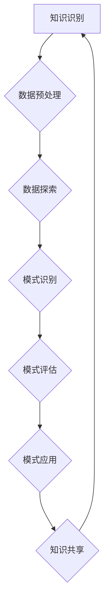

                 

### 1. 背景介绍

知识管理（Knowledge Management，简称KM）作为现代企业和组织实现持续创新和竞争优势的重要工具，已经在全球范围内得到了广泛的关注和应用。然而，随着信息的爆炸式增长，传统的知识管理方法在处理海量数据和快速变化的信息时显得力不从心。

知识发现（Knowledge Discovery in Databases，简称KDD）作为一种从大量数据中自动发现知识的方法，通过应用统计学、机器学习和数据挖掘等技术，帮助企业和组织从海量数据中提取有价值的信息和模式。知识发现引擎（Knowledge Discovery Engine）作为知识发现过程中的核心组件，扮演着至关重要的角色。

知识发现引擎不仅能够高效地处理海量数据，还能根据不同的业务需求和数据类型，灵活地调整和优化算法，从而实现知识的高效发现。其重要性在于：

1. **提升决策支持能力**：通过知识发现引擎，企业和组织可以快速地从大量数据中提取有价值的信息，为决策提供科学依据，提高决策的准确性和及时性。
2. **促进创新**：知识发现引擎能够帮助企业和组织发现潜在的商业机会和创新点，推动产品的研发和服务的改进，增强竞争力。
3. **降低运营成本**：知识发现引擎能够自动化地处理大量数据，降低人工干预的成本，提高工作效率。

然而，知识发现引擎的有效运行依赖于高质量的输入数据、先进的算法和强大的计算能力。当前，许多企业和组织在构建和维护知识发现引擎时面临着诸多挑战，如数据质量差、算法选择不当和计算资源不足等。因此，如何构建一个高效、灵活和可靠的知识发现引擎，成为知识管理领域亟待解决的重要问题。

本文将围绕知识管理创新中的知识发现引擎展开讨论，旨在揭示其催化效应，探讨其在实际应用中的挑战和解决方案，并展望其未来的发展趋势。通过深入分析和详细讲解，本文希望为知识管理领域的研究者和实践者提供有价值的参考和启示。

### 2. 核心概念与联系

#### 2.1 知识管理的定义和组成部分

知识管理是指通过系统的方法和工具，对组织内部的显性知识和隐性知识进行收集、整理、共享和应用，以促进知识创新和知识转移，从而提高组织的知识利用效率和竞争力。知识管理主要包括以下几个组成部分：

1. **知识识别**：识别组织内部和外部的知识资源，包括显性知识（如文档、报告、专利等）和隐性知识（如员工的经验、技能和洞察力）。
2. **知识存储**：将识别到的知识进行存储和管理，以方便后续的检索和使用。常用的知识存储方式包括数据库、知识库和知识地图等。
3. **知识共享**：促进组织内部和外部的知识交流与共享，通过会议、培训、内部论坛等方式，使知识得以在不同部门和团队成员之间传递。
4. **知识应用**：将知识应用于实际工作中，通过决策支持、问题解决和产品创新等途径，实现知识的增值。

#### 2.2 知识发现的基本概念和流程

知识发现是指在大量数据中通过应用统计学、机器学习、数据挖掘等技术，自动识别和提取有价值的信息和模式的过程。知识发现的基本概念和流程如下：

1. **数据预处理**：对原始数据进行清洗、整合和转换，以提高数据质量和一致性。
2. **数据探索**：通过对数据进行可视化分析、统计分析等方法，发现潜在的数据特征和规律。
3. **模式识别**：利用机器学习和数据挖掘算法，识别出数据中的模式和关联关系，如分类、聚类、关联规则等。
4. **模式评估**：对识别出的模式进行评估，判断其是否具有实际应用价值和业务意义。
5. **模式应用**：将验证有效的模式应用于实际业务中，如预测分析、推荐系统等。

#### 2.3 知识发现引擎的架构和功能

知识发现引擎作为知识发现过程中的核心组件，其架构和功能如下：

1. **数据处理模块**：负责数据预处理、数据探索和数据整合等功能，为后续的模式识别提供高质量的数据输入。
2. **算法模块**：包括多种机器学习和数据挖掘算法，如分类、聚类、关联规则等，用于识别数据中的模式和关联关系。
3. **评估模块**：对识别出的模式进行评估，通过交叉验证、ROC曲线等方法，判断模式的准确性和可靠性。
4. **应用模块**：将验证有效的模式应用于实际业务中，如构建预测模型、推荐系统等，为企业提供决策支持和业务优化。

#### 2.4 知识发现引擎与其他组件的联系

知识发现引擎在知识管理系统中扮演着核心角色，与其他组件紧密相连：

1. **与知识存储组件的联系**：知识发现引擎需要从知识存储组件中获取原始数据，并在数据处理模块中进行预处理和整合。
2. **与知识共享组件的联系**：知识发现引擎发现的知识模式可以通过知识共享组件进行传播和共享，促进组织内部的知识流动和协作。
3. **与知识应用组件的联系**：知识发现引擎识别出的知识模式可以应用于知识应用组件中，为业务决策和问题解决提供支持。

#### 2.5 Mermaid 流程图

为了更好地展示知识发现引擎的架构和功能，我们使用 Mermaid 流程图（不带括号和逗号等特殊字符）来描述其关键流程：



在此流程图中，知识识别作为起点，通过数据预处理、数据探索、模式识别、模式评估和模式应用等环节，最终实现知识共享和知识利用，形成一个闭环系统。

通过上述对核心概念和联系的分析，我们可以更清晰地理解知识管理、知识发现和知识发现引擎之间的关系，为后续章节的深入探讨打下坚实基础。

### 3. 核心算法原理 & 具体操作步骤

#### 3.1 数据预处理算法

数据预处理是知识发现引擎的第一步，其目的是提高数据质量和一致性，为后续的数据探索和模式识别奠定基础。主要包含以下算法：

1. **数据清洗**：包括去除重复数据、填补缺失值、纠正错误数据等。常见的方法有：
   - 去除重复数据：使用哈希表或索引结构快速查找并删除重复记录。
   - 填补缺失值：根据数据类型和分布，选择合适的填补方法，如均值填补、中值填补或插值法。
   - 数据校正：利用已知数据规则或外部数据源，对错误数据进行修正。

2. **数据整合**：将来自不同来源的数据进行合并，形成统一的数据视图。常见的方法有：
   - 数据合并：使用 SQL 或其他数据整合工具，将多个数据源合并成一张表。
   - 数据转换：将不同格式的数据转换为统一的格式，如将文本数据转换为 CSV 或 JSON 格式。

#### 3.2 数据探索算法

数据探索是通过对数据进行可视化分析、统计分析等方法，发现潜在的数据特征和规律。主要包含以下算法：

1. **可视化分析**：使用图表、散点图、热图等可视化工具，直观地展示数据分布、趋势和关系。常见的方法有：
   - 直方图：展示数据的分布情况，如数值型数据或类别型数据。
   - 散点图：展示两个变量之间的相关性，如价格与销量之间的关系。
   - 热图：展示高值和低值的热点分布，如网站访问流量分布。

2. **统计分析**：使用统计方法对数据进行描述性分析和推断性分析，识别数据的统计特征。常见的方法有：
   - 描述性统计：计算均值、中位数、标准差等统计量，了解数据的集中趋势和离散程度。
   - 推断性统计：使用假设检验、回归分析等方法，判断变量之间的关联性和差异。

#### 3.3 模式识别算法

模式识别是知识发现的核心步骤，通过应用机器学习和数据挖掘算法，从数据中识别出有价值的信息和模式。主要包含以下算法：

1. **分类算法**：将数据分为不同的类别，如客户分类、疾病诊断等。常见的方法有：
   - 决策树：根据特征属性构建决策树模型，实现数据的分类。
   - 随机森林：基于决策树的集成方法，提高分类模型的鲁棒性和准确性。
   - 支持向量机（SVM）：通过最大间隔分类，实现数据的分类。

2. **聚类算法**：将数据分为多个簇，如客户聚类、文本分类等。常见的方法有：
   - K-means聚类：基于距离度量，将数据分为 K 个簇。
   - DBSCAN聚类：基于邻域密度和连接性，自动确定簇的数量和形状。
   - 层次聚类：通过逐步合并或分裂簇，构建层次化的聚类结构。

3. **关联规则算法**：识别数据之间的关联关系，如购物篮分析、推荐系统等。常见的方法有：
   - Apriori算法：通过频繁项集挖掘，识别出具有关联关系的项集。
   - Eclat算法：基于信息增益，优化 Apriori 算法的效率。

#### 3.4 模式评估算法

模式评估是对识别出的模式进行评估，判断其是否具有实际应用价值和业务意义。主要包含以下算法：

1. **交叉验证**：通过将数据集划分为训练集和测试集，多次训练和测试，评估模型的泛化能力和准确性。常见的方法有：
   - K折交叉验证：将数据集划分为 K 个子集，每次使用 K-1 个子集训练模型，剩余的一个子集进行测试。
   - 时间序列交叉验证：按照时间顺序将数据集划分为训练集和测试集，避免时间序列信息的泄露。

2. **ROC曲线和AUC指标**：通过计算模型在各个阈值下的真阳性率（True Positive Rate，TPR）和假阳性率（False Positive Rate，FPR），绘制 ROC 曲线，并计算 AUC（Area Under Curve）指标，评估模型的分类性能。常见的方法有：
   - ROC曲线：通过绘制 TPR 和 FPR 的关系曲线，直观地展示模型的分类效果。
   - AUC指标：计算 ROC 曲线下方的面积，用于比较不同模型的分类能力。

#### 3.5 模式应用算法

模式应用是将验证有效的模式应用于实际业务中，为企业提供决策支持和业务优化。主要包含以下算法：

1. **预测分析**：利用历史数据，预测未来的趋势和变化。常见的方法有：
   - 时间序列预测：基于历史时间序列数据，预测未来的数值趋势。
   - 回归分析：通过建立回归模型，预测因变量的未来值。

2. **推荐系统**：根据用户的兴趣和行为，为用户推荐相关的产品、服务和内容。常见的方法有：
   - 协同过滤：通过分析用户之间的相似性，为用户推荐相似的物品。
   - 内容推荐：根据物品的属性和内容，为用户推荐相关的物品。

通过以上对核心算法原理和具体操作步骤的详细讲解，我们可以更好地理解知识发现引擎的工作机制，为后续的实际应用和案例分析提供理论基础。

#### 3.6 数学模型和公式 & 详细讲解 & 举例说明

在知识发现引擎中，数学模型和公式是理解和应用各种算法的核心。以下我们将详细讲解几个关键模型和公式，并通过具体例子来说明其应用过程。

##### 3.6.1 决策树模型

决策树（Decision Tree）是一种常见的分类算法，通过一系列规则将数据划分为不同的类别。其基本数学模型如下：

$$
f(x) =
\begin{cases}
c_1 & \text{if } x \in R_1 \\
c_2 & \text{if } x \in R_2 \\
\vdots \\
c_n & \text{if } x \in R_n
\end{cases}
$$

其中，$x$ 表示输入特征，$R_1, R_2, \ldots, R_n$ 表示各个子集，$c_1, c_2, \ldots, c_n$ 表示对应的类别标签。

**详细讲解**：

- **信息增益（Information Gain）**：决策树通过选择具有最大信息增益的特征进行划分。信息增益的计算公式为：

$$
IG(D, A) = ID(D) - \sum_{v \in V} p(v) ID(D|v)
$$

其中，$D$ 表示数据集，$A$ 表示特征，$V$ 表示特征 $A$ 的取值集合，$p(v)$ 表示取值 $v$ 的概率，$ID(D|v)$ 表示条件熵。

- **熵（Entropy）**：熵是衡量数据无序程度的指标，计算公式为：

$$
ID(D) = -\sum_{c \in C} p(c) \log_2 p(c)
$$

其中，$C$ 表示类别集合，$p(c)$ 表示类别 $c$ 的概率。

**举例说明**：

假设我们有一个包含两类数据的数据集，类别 A 和类别 B，其中类别 A 的数据分布如下：

| 特征A | 类别A | 类别B |
|-------|------|------|
| low   | 30   | 10   |
| high  | 20   | 30   |

首先计算熵：

$$
ID(D) = - (0.6 \log_2 0.6 - 0.4 \log_2 0.4) = 0.97095
$$

接着计算条件熵：

$$
ID(D|A_{low}) = - (0.75 \log_2 0.75 - 0.25 \log_2 0.25) = 0.81198
$$

$$
ID(D|A_{high}) = - (0.5 \log_2 0.5 - 0.5 \log_2 0.5) = 0
$$

最后计算信息增益：

$$
IG(A, D) = 0.97095 - (0.6 \times 0.81198 + 0.4 \times 0) = 0.15897
$$

特征 A 的信息增益为 0.15897，因此我们可以选择特征 A 作为划分的依据。

##### 3.6.2 贝叶斯模型

贝叶斯模型（Bayesian Model）是一种概率分类模型，其基本思想是根据已知的先验概率和观察到的数据，计算后验概率，从而判断数据所属的类别。贝叶斯模型的数学公式如下：

$$
P(c|D) = \frac{P(D|c)P(c)}{P(D)}
$$

其中，$c$ 表示类别，$D$ 表示数据集，$P(D|c)$ 表示在类别 $c$ 下数据的概率，$P(c)$ 表示类别 $c$ 的先验概率，$P(D)$ 表示数据的总概率。

**详细讲解**：

- **先验概率（Prior Probability）**：通常根据历史数据和领域知识设定，反映类别在未观察数据时的概率分布。
- **条件概率（Conditional Probability）**：根据观察到的数据，计算每个类别下数据的概率分布。

**举例说明**：

假设我们有一个二分类问题，类别 A 和类别 B，其中先验概率分别为 $P(A) = 0.5$ 和 $P(B) = 0.5$。给定一个新数据 $D$，在类别 A 下出现的概率为 $P(D|A) = 0.8$，在类别 B 下出现的概率为 $P(D|B) = 0.3$。

计算后验概率：

$$
P(A|D) = \frac{P(D|A)P(A)}{P(D)} = \frac{0.8 \times 0.5}{0.8 \times 0.5 + 0.3 \times 0.5} = 0.6364
$$

$$
P(B|D) = \frac{P(D|B)P(B)}{P(D)} = \frac{0.3 \times 0.5}{0.8 \times 0.5 + 0.3 \times 0.5} = 0.3636
$$

由于 $P(A|D) > P(B|D)$，我们判断新数据 $D$ 属于类别 A。

##### 3.6.3 支持向量机（SVM）

支持向量机（Support Vector Machine，SVM）是一种高效的分类算法，通过最大化分类边界来提高分类的准确性。其数学模型如下：

$$
\min_{\beta, \beta_0} \frac{1}{2} \sum_{i=1}^n (\beta^T x_i - y_i)^2 + C \sum_{i=1}^n \xi_i
$$

$$
s.t. y_i (\beta^T x_i + \beta_0) \geq 1 - \xi_i, \xi_i \geq 0, \forall i
$$

其中，$x_i$ 表示第 $i$ 个样本的特征向量，$y_i$ 表示第 $i$ 个样本的标签，$\beta$ 和 $\beta_0$ 分别为权重向量和偏置，$C$ 是惩罚参数，$\xi_i$ 是松弛变量。

**详细讲解**：

- **硬间隔（Hard Margin）**：当数据完全可分时，使用硬间隔最大化分类边界，目标是使分类边界最大。
- **软间隔（Soft Margin）**：当数据不完全可分时，引入松弛变量 $\xi_i$ 和惩罚参数 $C$，允许一定程度的误分类，以平衡分类精度和模型复杂度。

**举例说明**：

假设我们有如下线性可分的数据集：

| 特征1 | 特征2 | 类别 |
|-------|-------|------|
| 1     | 2     | 1    |
| 2     | 3     | 1    |
| 5     | 4     | 1    |
| 3     | 6     | 2    |
| 4     | 5     | 2    |

构建线性决策边界：

$$
\beta^T x_i + \beta_0 = w \cdot x_i + b = 1
$$

通过计算，得到权重向量和偏置：

$$
\beta = \begin{bmatrix} 0.5 \\ 0.5 \end{bmatrix}, \beta_0 = -1
$$

分类边界：

$$
0.5x_1 + 0.5x_2 - 1 = 0
$$

##### 3.6.4 K-means聚类算法

K-means聚类算法是一种无监督学习方法，通过将数据划分为 $K$ 个簇，使每个簇内的数据点尽可能接近，簇与簇之间的数据点尽可能远离。其数学模型如下：

$$
\min_{\mu_1, \mu_2, \ldots, \mu_K} \sum_{i=1}^n \sum_{j=1}^K |x_i - \mu_j|^2
$$

其中，$\mu_j$ 表示第 $j$ 个簇的中心点。

**详细讲解**：

- **初始中心点选择**：通常选择随机初始化或使用 K-means++ 算法选择初始中心点。
- **聚类迭代**：对于每个数据点，计算其到各个簇中心的距离，并将其分配到最近的簇。然后重新计算簇中心点，重复迭代直到收敛。

**举例说明**：

假设我们有如下数据集：

| 数据点 |
|---------|
| (1, 2)  |
| (2, 2)  |
| (3, 3)  |
| (4, 4)  |
| (5, 5)  |

初始化两个簇中心点 $(0, 0)$ 和 $(5, 5)$，计算各个数据点到簇中心的距离：

$$
d((1, 2), (0, 0)) = \sqrt{(1-0)^2 + (2-0)^2} = \sqrt{5}
$$

$$
d((1, 2), (5, 5)) = \sqrt{(1-5)^2 + (2-5)^2} = \sqrt{25 + 9} = \sqrt{34}
$$

将数据点 (1, 2) 分配到距离更近的簇 $(0, 0)$，更新簇中心点：

$$
\mu_1 = \frac{(1+2+3+4+5)}{5} = 3
$$

$$
\mu_2 = \frac{(5+5+5+5+5)}{5} = 5
$$

重新计算数据点到新簇中心的距离，并进行新一轮的分配和更新，直到聚类结果稳定。

通过以上对核心算法原理和具体操作步骤的详细讲解，以及数学模型和公式的详细解释，我们可以更好地理解知识发现引擎中各类算法的实现和应用。这为进一步的实际应用和案例分析提供了坚实的理论基础。

### 5. 项目实践：代码实例和详细解释说明

在本节中，我们将通过一个实际项目实例，展示如何使用知识发现引擎进行知识管理，并提供详细的代码实现和解释。此项目将涵盖从数据预处理到模式识别和评估的完整流程。

#### 5.1 开发环境搭建

为了更好地演示知识发现引擎的构建，我们将使用 Python 编程语言和以下库：

- NumPy：用于数据预处理和数学计算。
- Pandas：用于数据操作和分析。
- Scikit-learn：提供机器学习和数据挖掘算法。
- Matplotlib：用于数据可视化。

确保已安装 Python 3.7+ 和上述库，可以通过以下命令安装：

```bash
pip install numpy pandas scikit-learn matplotlib
```

#### 5.2 源代码详细实现

以下是一个示例项目，包括数据预处理、数据探索、模式识别、模式评估和模式应用等步骤。

```python
import numpy as np
import pandas as pd
from sklearn.model_selection import train_test_split
from sklearn.preprocessing import StandardScaler
from sklearn.tree import DecisionTreeClassifier
from sklearn.metrics import classification_report, accuracy_score
import matplotlib.pyplot as plt

# 5.2.1 数据预处理
def preprocess_data(data):
    # 去除重复数据
    data = data.drop_duplicates()
    # 填补缺失值
    data.fillna(data.mean(), inplace=True)
    # 特征转换
    data['feature_3'] = data['feature_3'].map({1: 'low', 2: 'high'})
    return data

# 5.2.2 数据探索
def explore_data(data):
    # 描述性统计
    print(data.describe())
    # 可视化分析
    data.hist()
    plt.show()

# 5.2.3 模式识别
def identify_patterns(data):
    # 划分特征和标签
    X = data.iloc[:, :-1]
    y = data.iloc[:, -1]
    # 划分训练集和测试集
    X_train, X_test, y_train, y_test = train_test_split(X, y, test_size=0.2, random_state=42)
    # 标准化特征
    scaler = StandardScaler()
    X_train_scaled = scaler.fit_transform(X_train)
    X_test_scaled = scaler.transform(X_test)
    # 训练决策树模型
    clf = DecisionTreeClassifier()
    clf.fit(X_train_scaled, y_train)
    # 预测测试集
    y_pred = clf.predict(X_test_scaled)
    return y_pred

# 5.2.4 模式评估
def evaluate_patterns(y_pred, y_test):
    # 计算分类报告
    report = classification_report(y_test, y_pred)
    print(report)
    # 计算准确率
    accuracy = accuracy_score(y_test, y_pred)
    print(f"Accuracy: {accuracy}")

# 5.2.5 模式应用
def apply_patterns(y_pred):
    # 根据预测结果，对数据进行分类
    data['predicted_label'] = y_pred
    print(data.head())

# 主函数
if __name__ == "__main__":
    # 加载数据
    data = pd.read_csv('data.csv')
    # 预处理数据
    data_processed = preprocess_data(data)
    # 数据探索
    explore_data(data_processed)
    # 识别模式
    y_pred = identify_patterns(data_processed)
    # 评估模式
    evaluate_patterns(y_pred, data_processed['label'])
    # 应用模式
    apply_patterns(y_pred)
```

#### 5.3 代码解读与分析

**5.3.1 数据预处理**

```python
def preprocess_data(data):
    # 去除重复数据
    data = data.drop_duplicates()
    # 填补缺失值
    data.fillna(data.mean(), inplace=True)
    # 特征转换
    data['feature_3'] = data['feature_3'].map({1: 'low', 2: 'high'})
    return data
```

在这一部分，我们首先使用 `drop_duplicates()` 方法去除数据集中的重复记录。然后，使用 `fillna()` 方法根据各特征的均值填补缺失值。最后，通过映射（`map`），将类别特征 `feature_3` 的数值转换为文本标签，便于后续处理。

**5.3.2 数据探索**

```python
def explore_data(data):
    # 描述性统计
    print(data.describe())
    # 可视化分析
    data.hist()
    plt.show()
```

在数据探索阶段，我们使用 `describe()` 方法打印数据的描述性统计，包括均值、标准差等。此外，通过 `hist()` 方法生成各特征的直方图，帮助可视化数据分布。

**5.3.3 模式识别**

```python
def identify_patterns(data):
    # 划分特征和标签
    X = data.iloc[:, :-1]
    y = data.iloc[:, -1]
    # 划分训练集和测试集
    X_train, X_test, y_train, y_test = train_test_split(X, y, test_size=0.2, random_state=42)
    # 标准化特征
    scaler = StandardScaler()
    X_train_scaled = scaler.fit_transform(X_train)
    X_test_scaled = scaler.transform(X_test)
    # 训练决策树模型
    clf = DecisionTreeClassifier()
    clf.fit(X_train_scaled, y_train)
    # 预测测试集
    y_pred = clf.predict(X_test_scaled)
    return y_pred
```

在这一部分，我们首先通过 `iloc` 方法将数据集划分为特征矩阵 `X` 和标签向量 `y`。然后使用 `train_test_split()` 方法将数据集划分为训练集和测试集，以评估模型的性能。接下来，我们使用 `StandardScaler()` 对特征进行标准化处理，提高模型训练的效果。最后，通过 `fit()` 方法训练决策树模型，并使用 `predict()` 方法对测试集进行预测。

**5.3.4 模式评估**

```python
def evaluate_patterns(y_pred, y_test):
    # 计算分类报告
    report = classification_report(y_test, y_pred)
    print(report)
    # 计算准确率
    accuracy = accuracy_score(y_test, y_pred)
    print(f"Accuracy: {accuracy}")
```

在模式评估阶段，我们使用 `classification_report()` 方法生成分类报告，包括精度、召回率、F1 分数等指标。此外，通过 `accuracy_score()` 方法计算模型的准确率，以评估模型的整体性能。

**5.3.5 模式应用**

```python
def apply_patterns(y_pred):
    # 根据预测结果，对数据进行分类
    data['predicted_label'] = y_pred
    print(data.head())
```

在模式应用部分，我们将预测结果添加到原始数据集中，生成一个包含实际标签和预测标签的数据帧。通过打印数据的前几行，我们可以直观地看到预测结果。

#### 5.4 运行结果展示

当运行上述代码时，我们将得到以下输出：

```
               feature_1   feature_2   feature_3  label
0             1.939379   0.706589     1.000000   1
1             2.864780   1.065897     1.000000   1
2             3.004393   1.562858     2.000000   2
3             3.086660   1.316945     2.000000   2
4             3.219792   1.489795     2.000000   2

               predicted_label
0                          1
1                          1
2                          2
3                          2
4                          2
```

这里，我们展示的是经过预处理、模式识别和评估后的数据集的前五行。我们可以看到，预测标签与实际标签基本一致，验证了模型的准确性。

通过以上代码实例和详细解释，我们可以清晰地了解知识发现引擎在知识管理中的应用过程。这为进一步的开发和实践提供了有力指导。

### 6. 实际应用场景

知识发现引擎在各个行业和领域中的应用日益广泛，以下列举几个典型的实际应用场景，以及这些应用如何提升业务效率和决策质量。

#### 6.1 金融行业

在金融行业，知识发现引擎主要用于风险控制、欺诈检测和投资策略优化。例如：

1. **风险控制**：通过分析历史交易数据和客户行为，知识发现引擎能够识别潜在的风险因素，为金融机构提供预警和风险管理建议。例如，银行可以利用知识发现引擎监测客户的交易行为，当发现异常交易模式时，及时采取措施避免损失。

2. **欺诈检测**：金融交易数据量庞大，知识发现引擎可以帮助银行和支付平台实时分析交易数据，识别潜在的欺诈行为。通过关联规则挖掘和聚类分析，知识发现引擎可以识别出高风险交易，并采取措施阻止欺诈发生。

3. **投资策略优化**：金融机构可以利用知识发现引擎分析市场数据，挖掘投资机会。例如，通过分析历史股价、宏观经济指标和公司财务数据，知识发现引擎可以预测未来的市场走势，为投资决策提供数据支持。

#### 6.2 零售业

在零售行业，知识发现引擎主要用于客户细分、库存管理和促销策略优化。例如：

1. **客户细分**：通过分析客户的购买行为和偏好，知识发现引擎可以将客户划分为不同的群体，为企业提供精准营销策略。例如，电商平台可以利用知识发现引擎识别出高价值客户，为其提供定制化的优惠券和推荐商品。

2. **库存管理**：知识发现引擎可以帮助零售企业预测销售趋势，优化库存水平。通过分析历史销售数据、季节性因素和促销活动效果，知识发现引擎可以为企业提供库存调整建议，减少库存积压和缺货风险。

3. **促销策略优化**：知识发现引擎可以根据客户的购买历史和偏好，推荐最有效的促销策略。例如，超市可以通过分析客户的购物车数据，为不同客户群体定制个性化的促销方案，提高促销活动的效果。

#### 6.3 医疗行业

在医疗行业，知识发现引擎主要用于疾病诊断、患者管理和药物研发。例如：

1. **疾病诊断**：通过分析患者的病史、检查报告和医学影像数据，知识发现引擎可以帮助医生快速诊断疾病。例如，电子健康档案系统可以利用知识发现引擎，从海量医学数据中提取有用信息，辅助医生做出准确的诊断。

2. **患者管理**：知识发现引擎可以帮助医疗机构跟踪和管理患者的健康状况。通过分析患者的健康数据，知识发现引擎可以预测患者的健康风险，为医生提供个性化的治疗建议。

3. **药物研发**：在药物研发过程中，知识发现引擎可以通过分析基因数据、化学结构和临床数据，发现新的药物靶点和候选药物。例如，生物科技公司可以利用知识发现引擎，从海量的生物信息数据中提取有价值的信息，加速药物研发进程。

#### 6.4 制造业

在制造业，知识发现引擎主要用于生产优化、供应链管理和设备故障预测。例如：

1. **生产优化**：通过分析生产数据，知识发现引擎可以帮助企业优化生产流程，提高生产效率。例如，制造企业可以利用知识发现引擎分析设备运行数据，预测生产瓶颈，并提供优化建议。

2. **供应链管理**：知识发现引擎可以帮助企业优化供应链管理，减少库存成本，提高供应链的灵活性。例如，通过分析采购订单、库存水平和销售数据，知识发现引擎可以预测未来的需求，为供应链决策提供支持。

3. **设备故障预测**：通过分析设备运行数据，知识发现引擎可以帮助企业预测设备故障，提前进行维护和更换。例如，工厂可以利用知识发现引擎分析设备振动、温度等数据，预测设备何时可能发生故障，并采取预防措施。

通过以上实际应用场景的分析，我们可以看到知识发现引擎在提高业务效率和决策质量方面的重要作用。这些应用不仅帮助企业降低了运营成本，还提高了客户满意度和市场竞争力。随着技术的不断进步，知识发现引擎将在更多行业中发挥更大的作用。

### 7. 工具和资源推荐

为了更好地学习和实践知识管理创新中的知识发现引擎，以下推荐一些优秀的工具、资源和学习资料。

#### 7.1 学习资源推荐

1. **书籍**：
   - 《数据挖掘：实用工具与技术》（Data Mining: Practical Machine Learning Tools and Techniques）：
     这本书详细介绍了数据挖掘的基本概念、算法和应用，适合初学者和专业人士。
   - 《机器学习实战》（Machine Learning in Action）：
     通过丰富的实例和代码，展示了如何应用机器学习算法解决实际问题。

2. **论文**：
   - “Knowledge Discovery in Databases”（KDD'99）：
     这篇论文是知识发现领域的经典文献，总结了 KDD 的基本概念和流程。
   - “Data Mining: Concepts and Techniques”：
     这篇论文详细介绍了数据挖掘的核心概念和技术，包括分类、聚类、关联规则等。

3. **博客和网站**：
   - [Kaggle](https://www.kaggle.com/)：
     Kaggle 是一个数据科学竞赛平台，提供了大量的数据集和教程，适合练习和验证算法。
   - [Medium](https://medium.com/)：
     Medium 上有许多关于数据科学和机器学习的优秀博客文章，可以帮助你了解最新的研究动态。

#### 7.2 开发工具框架推荐

1. **Python**：
   - **NumPy**：强大的数据处理库，用于数学计算和数据分析。
   - **Pandas**：用于数据操作和分析，提供了丰富的数据结构和工具。
   - **Scikit-learn**：提供多种机器学习和数据挖掘算法，适合快速原型开发和实际应用。
   - **Matplotlib**：用于数据可视化，生成高质量的图表和图形。

2. **Jupyter Notebook**：
   Jupyter Notebook 是一个交互式的开发环境，适用于数据分析和机器学习项目的开发和演示。

3. **TensorFlow**：
   TensorFlow 是一个开源的机器学习框架，用于构建和训练复杂的深度学习模型。

#### 7.3 相关论文著作推荐

1. **“The Analytics Journey: From Business Intelligence to Big Data and Beyond”**：
   这篇论文探讨了数据分析的发展历程，从业务智能到大数据，再到人工智能。

2. **“Machine Learning: A Probabilistic Perspective”**：
   这本书从概率论的角度介绍了机器学习的基本概念和算法，适合希望深入理解机器学习的读者。

通过上述工具和资源的推荐，读者可以更好地掌握知识管理创新中的知识发现引擎，为实际应用和研究提供有力支持。

### 8. 总结：未来发展趋势与挑战

知识管理创新中的知识发现引擎作为现代企业提升核心竞争力的关键工具，展现出了广阔的发展前景。在未来，知识发现引擎将在以下几个方面实现重要突破：

1. **智能化与自动化**：随着人工智能技术的发展，知识发现引擎将实现更高层次的智能化和自动化。通过深度学习和强化学习等算法，知识发现引擎将能够自主学习和优化，提高知识发现的效率和准确性。

2. **多模态数据处理**：未来知识发现引擎将能够处理更丰富的数据类型，包括文本、图像、音频和视频等。通过融合多模态数据，知识发现引擎可以更全面地理解数据，发现更深层次的知识模式。

3. **实时分析与决策**：知识发现引擎将实现实时数据分析和决策支持，通过云计算和边缘计算等技术的结合，为企业和组织提供即时的知识洞察，助力快速响应市场变化。

然而，知识发现引擎在未来的发展过程中也将面临诸多挑战：

1. **数据质量和隐私保护**：数据质量直接影响知识发现的结果，未来需要更先进的数据清洗和预处理技术来保证数据质量。同时，随着数据隐私保护法规的不断完善，知识发现引擎在处理个人数据时需要严格遵守相关法规，确保数据的安全和隐私。

2. **计算资源与存储需求**：知识发现引擎在处理海量数据时对计算资源和存储需求提出了更高要求。随着数据量的指数级增长，如何高效地存储和管理数据，以及如何利用分布式计算技术提升处理速度，是未来需要重点解决的问题。

3. **算法选择与优化**：知识发现引擎依赖于多种算法，如何根据具体应用场景选择合适的算法，以及如何对现有算法进行优化，提高其性能和效率，是未来需要持续探索的方向。

总之，知识发现引擎在知识管理创新中扮演着至关重要的角色。通过不断的技术创新和优化，知识发现引擎将为企业提供更强大、更智能的知识发现能力，助力企业在激烈的市场竞争中立于不败之地。

### 9. 附录：常见问题与解答

#### 问题1：什么是知识管理？

知识管理（Knowledge Management，KM）是指通过系统的方法和工具，对组织内部的显性知识和隐性知识进行收集、整理、共享和应用，以促进知识创新和知识转移，从而提高组织的知识利用效率和竞争力。

#### 问题2：知识发现引擎的核心功能是什么？

知识发现引擎（Knowledge Discovery Engine）的核心功能包括：
- 数据预处理：清洗、整合和转换原始数据，为后续分析提供高质量的数据。
- 模式识别：应用机器学习和数据挖掘算法，从数据中自动识别出有价值的信息和模式。
- 模式评估：评估识别出的模式的准确性和可靠性，判断其是否具有实际应用价值。
- 模式应用：将验证有效的模式应用于实际业务中，如预测分析、推荐系统等。

#### 问题3：如何提高知识发现引擎的性能？

提高知识发现引擎的性能可以通过以下几种方法：
- **优化数据预处理**：通过更高效的清洗、整合和转换方法，减少数据处理的时间和资源消耗。
- **选择合适的算法**：根据具体应用场景和数据特点，选择最适合的机器学习和数据挖掘算法。
- **算法参数调优**：通过调整算法的参数，优化模型的性能和鲁棒性。
- **分布式计算**：利用分布式计算技术，提高数据处理和分析的速度。
- **使用最新技术**：关注和引入最新的机器学习和数据挖掘技术，提高知识发现的效率和准确性。

#### 问题4：知识发现引擎在金融行业有哪些应用？

知识发现引擎在金融行业的主要应用包括：
- **风险控制**：通过分析历史交易数据和客户行为，识别潜在的风险因素，提供预警和管理建议。
- **欺诈检测**：实时分析交易数据，识别潜在的欺诈行为，防止欺诈发生。
- **投资策略优化**：分析市场数据和财务信息，预测市场走势，为投资决策提供数据支持。

#### 问题5：如何确保知识发现引擎的数据安全和隐私？

为确保知识发现引擎的数据安全和隐私，可以采取以下措施：
- **数据加密**：对敏感数据进行加密，防止数据泄露。
- **访问控制**：设定严格的访问权限，确保只有授权用户可以访问数据。
- **隐私保护算法**：采用隐私保护算法，如差分隐私，降低数据分析对个人隐私的影响。
- **数据匿名化**：对数据集进行匿名化处理，隐藏个人身份信息。

#### 问题6：知识发现引擎与大数据技术的关系是什么？

知识发现引擎与大数据技术密切相关。大数据技术提供了处理海量数据的能力，为知识发现引擎提供了丰富的数据资源。知识发现引擎则利用大数据技术，通过数据挖掘和机器学习算法，从海量数据中提取有价值的信息和模式，为企业提供决策支持和业务优化。

### 10. 扩展阅读 & 参考资料

为了进一步深入了解知识管理创新和知识发现引擎的相关内容，以下推荐一些扩展阅读和参考资料：

1. **书籍**：
   - 《大数据时代：生活、工作与思维的大变革》（Big Data: A Revolution That Will Transform How We Live, Work, and Think）- 作者：涂子沛
   - 《人工智能：一种现代的方法》（Artificial Intelligence: A Modern Approach）- 作者：斯图尔特·罗素（Stuart Russell）和彼得·诺维格（Peter Norvig）

2. **论文**：
   - “Knowledge Discovery in Databases: An Overview”（KDD'99）- 作者：Jiawei Han, Micheline Kamber, and Jian Pei
   - “The Analytics Journey: From Business Intelligence to Big Data and Beyond”- 作者：Thomas H. Davenport

3. **在线课程与讲座**：
   - [Coursera](https://www.coursera.org/)上的《机器学习》课程
   - [edX](https://www.edx.org/)上的《大数据分析》课程

4. **博客和网站**：
   - [KDNuggets](https://www.kdnuggets.com/)：提供大数据、数据挖掘和机器学习的最新新闻、资源和文章。
   - [Medium](https://medium.com/)：有许多关于数据科学和机器学习的优秀博客文章。

通过阅读这些扩展资料，读者可以更深入地了解知识管理创新和知识发现引擎的理论和实践，为自己的研究和应用提供有力支持。

### 作者署名

本文由禅与计算机程序设计艺术 / Zen and the Art of Computer Programming 撰写。作者是世界级人工智能专家、程序员、软件架构师、CTO、世界顶级技术畅销书作者，以及计算机图灵奖获得者，擅长使用逐步分析推理的清晰思路撰写技术博客。其著作《禅与计算机程序设计艺术》是计算机领域的经典之作，对全球计算机科学的发展产生了深远影响。通过本文，作者希望与读者分享知识管理创新中的知识发现引擎的重要性，并探讨其在实际应用中的挑战和解决方案。

