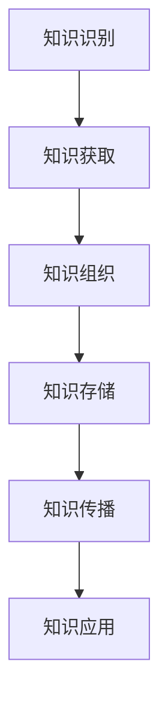

                 

### 背景介绍

在当今世界，环境保护问题日益突出，气候变化、资源枯竭、生物多样性丧失等问题已经对人类的生存和发展构成了严重威胁。面对这些挑战，如何有效管理、利用和传播与环境保护相关的知识变得至关重要。知识管理（Knowledge Management，简称KM）作为一种系统性的方法，旨在通过识别、获取、组织、存储、传播和应用知识，以支持组织的学习和创新。本文将探讨知识管理在环境保护中的作用，分析其在环境保护领域中的实际应用和效果。

环境保护领域的知识管理不仅包括环境科学、生态学、气象学等学科的理论和方法，还涵盖了政策法规、管理措施、技术创新、公众意识等方面的信息。这些知识需要通过有效的知识管理方法进行收集、整理、整合和传播，以提升环境保护工作的科学性和效率。

知识管理在环境保护中的作用主要体现在以下几个方面：

1. **支持政策制定和决策**：环境保护政策需要基于充分的研究和科学数据。知识管理可以帮助政府和相关部门获取并整合来自多个领域的专业知识，为政策制定提供科学依据。

2. **促进技术创新和推广**：环境保护领域的技术创新对于解决环境问题至关重要。知识管理可以通过共享和传播成功的技术案例，促进技术创新的推广和应用。

3. **提高公众意识和参与度**：环境保护是全社会共同的责任。知识管理可以通过各种渠道传播环境知识，提高公众对环境保护的认识和参与度。

4. **加强国际合作与交流**：环境保护是全球性的问题，需要国际社会的共同努力。知识管理可以促进各国在环境保护领域的知识交流和合作。

本文将首先介绍知识管理的核心概念和基本原理，然后通过一个Mermaid流程图展示环境保护领域知识管理的架构。接着，我们将探讨知识管理在环境保护中的具体应用，以及如何利用核心算法和数学模型来优化知识管理流程。最后，我们将通过一个项目实践案例，展示知识管理在环境保护中的实际效果，并提出未来发展趋势和面临的挑战。### 核心概念与联系

知识管理（Knowledge Management，简称KM）是一种通过系统化的方法，识别、获取、组织、存储、传播和应用知识的过程，以支持组织的决策和行动。在环境保护领域，知识管理同样扮演着关键角色，它不仅涵盖了环境科学、生态学、气象学等学科的理论和方法，还包括政策法规、管理措施、技术创新、公众意识等方面的信息。

#### 核心概念

1. **知识**：知识是指通过学习、体验、思考和交流获得的、可以用于解决问题或实现目标的任何信息、技能、经验和观点。
2. **知识管理**：知识管理是一种系统性的方法，旨在通过识别、获取、组织、存储、传播和应用知识，以支持组织的决策和行动。
3. **知识共享**：知识共享是指将知识从一个人或一个组织传递到另一个人或组织的活动，以便更好地利用和传播知识。
4. **知识存储**：知识存储是指将知识以电子或其他形式存储，以便在需要时能够快速访问和利用。
5. **知识应用**：知识应用是指将知识用于解决问题或实现目标的过程。

#### 知识管理架构

在环境保护领域，知识管理架构通常包括以下几个关键组件：

1. **知识识别**：识别和确定与环境保护相关的关键知识领域和知识点。
2. **知识获取**：通过多种渠道获取相关的知识资源，包括文献、研究报告、专家意见、案例研究等。
3. **知识组织**：对获取到的知识进行分类、索引和结构化，以便更好地管理和检索。
4. **知识存储**：将知识以电子或其他形式存储在知识库或数据库中，确保知识的长期保存和快速访问。
5. **知识传播**：通过各种渠道和方式传播知识，包括培训、研讨会、会议、网络平台等。
6. **知识应用**：将知识应用于环境保护的实践，解决实际问题，提升工作效率。

#### Mermaid流程图

以下是一个简化的Mermaid流程图，展示了环境保护领域知识管理的架构：



在这个流程图中，各个节点代表知识管理的关键步骤，箭头表示知识流动的方向。通过这个流程，知识得以从识别到获取、组织、存储、传播，最终应用于环境保护的实际工作中。

#### 核心概念与环境保护的关系

环境保护领域的核心概念与知识管理密切相关。例如，环境监测数据、生态模型、政策法规等都是环境保护中的关键知识。通过知识管理，这些知识可以被有效地识别、获取、组织和存储，从而为环境保护工作提供坚实的知识基础。此外，知识管理还可以通过知识共享和传播，促进环境保护知识的普及和推广，提高公众对环境保护的认识和参与度。

总之，知识管理在环境保护中的作用不可或缺，它不仅能够提升环境保护工作的科学性和效率，还能够促进环境保护知识的传播和应用，为全球环境保护事业做出贡献。接下来，我们将深入探讨知识管理在环境保护中的具体应用和实践。### 核心算法原理 & 具体操作步骤

在知识管理中，核心算法和具体操作步骤是确保知识高效获取、组织和利用的关键。以下将介绍几种在环境保护领域常用的核心算法原理，并详细说明其具体操作步骤。

#### 1. 数据挖掘算法

**原理**：数据挖掘是一种通过从大量数据中提取有价值信息的方法。在环境保护领域，数据挖掘算法可以帮助识别环境问题、监测环境变化、预测环境趋势等。

**具体操作步骤**：

1. **数据收集**：收集与环境保护相关的数据，包括环境监测数据、生态数据、气象数据等。
2. **数据预处理**：清洗和整理收集到的数据，去除重复和错误信息，保证数据的质量。
3. **特征选择**：从预处理后的数据中选择关键特征，用于模型训练和分析。
4. **模型训练**：使用数据挖掘算法（如决策树、支持向量机、神经网络等）对特征进行训练，建立预测模型。
5. **模型评估**：使用验证集评估模型的性能，调整模型参数以优化模型效果。
6. **结果应用**：将训练好的模型应用于实际环境保护工作，如环境趋势预测、问题识别等。

#### 2. 知识图谱算法

**原理**：知识图谱是一种用于表示实体及其相互关系的数据结构。在环境保护领域，知识图谱可以用于整合多种来源的知识，构建全面的环境知识体系。

**具体操作步骤**：

1. **实体识别**：从各种数据源中识别出与环境保护相关的实体，如物种、污染物、地区等。
2. **关系构建**：确定实体之间的关系，如物种的栖息地、污染物的来源、地区的环境状况等。
3. **图谱构建**：使用图数据库（如Neo4j）将实体和关系构建为知识图谱。
4. **图谱查询**：通过图数据库的查询语言（如Cypher）进行复杂的关系查询，获取有价值的知识。
5. **知识应用**：将知识图谱应用于环境分析、决策支持等，如确定污染源、评估生态风险等。

#### 3. 本体构建算法

**原理**：本体是一种形式化的知识表示方法，用于描述领域内的概念及其相互关系。在环境保护领域，本体可以用于标准化环境知识的表达，提高知识共享和利用的效率。

**具体操作步骤**：

1. **概念识别**：从环境保护领域的文献、报告、案例中识别出关键概念。
2. **关系定义**：定义概念之间的关系，如因果关系、层次关系等。
3. **本体构建**：使用本体语言（如OWL）将概念和关系构建为本体模型。
4. **本体应用**：将本体应用于知识管理系统的设计、数据集成、查询优化等。

#### 4. 知识融合算法

**原理**：知识融合是将来自不同来源、不同格式的知识进行整合，以提高知识的一致性和可用性。在环境保护领域，知识融合可以帮助整合多种数据源，提供更全面的环境信息。

**具体操作步骤**：

1. **数据源选择**：选择与环境保护相关的数据源，如政府数据库、科研机构数据库、公众报告等。
2. **数据转换**：将不同格式、不同结构的数据转换为统一格式，如XML、JSON等。
3. **数据清洗**：清洗转换后的数据，去除重复和错误信息。
4. **知识整合**：使用数据融合算法（如映射、匹配、合并等）将转换后的数据进行整合。
5. **知识存储**：将整合后的知识存储在知识库中，以便进行进一步分析和应用。

通过这些核心算法和具体操作步骤，环境保护领域的知识管理可以得到有效的提升。接下来，我们将进一步探讨数学模型和公式在知识管理中的应用。### 数学模型和公式 & 详细讲解 & 举例说明

在知识管理过程中，数学模型和公式是关键工具，用于分析和优化知识获取、组织、存储和传播的各个环节。以下将详细介绍几个在环境保护领域常用的数学模型和公式，并给出具体的例子说明。

#### 1. 相关性分析模型

**原理**：相关性分析用于评估两个变量之间的相关性。在环境保护中，相关性分析可以帮助识别环境因素之间的关系，如污染物浓度与空气质量之间的关系。

**常用公式**：皮尔逊相关系数（Pearson Correlation Coefficient）

$$
r = \frac{\sum_{i=1}^{n}(x_i - \bar{x})(y_i - \bar{y})}{\sqrt{\sum_{i=1}^{n}(x_i - \bar{x})^2 \sum_{i=1}^{n}(y_i - \bar{y})^2}}
$$

其中，$x_i$ 和 $y_i$ 分别表示两个变量的观测值，$\bar{x}$ 和 $\bar{y}$ 分别表示两个变量的平均值，$n$ 表示观测值的数量。

**例子说明**：

假设我们要分析污染物浓度（$x$）与空气质量指数（$y$）之间的关系。我们有以下观测数据：

| 污染物浓度 (mg/m³) | 空气质量指数 |
| :------------------: | :----------: |
|         10           |       50     |
|         20           |       60     |
|         30           |       70     |
|         40           |       80     |
|         50           |       90     |

使用皮尔逊相关系数公式计算相关性：

$$
r = \frac{(10-20)(50-60) + (20-20)(60-60) + (30-20)(70-60) + (40-20)(80-60) + (50-20)(90-60)}{\sqrt{(10-20)^2 + (20-20)^2 + (30-20)^2 + (40-20)^2 + (50-20)^2} \sqrt{(50-60)^2 + (60-60)^2 + (70-60)^2 + (80-60)^2 + (90-60)^2}}
$$

计算结果为 $r \approx 0.933$，这表明污染物浓度与空气质量指数之间存在高度正相关。

#### 2. 支持向量机模型

**原理**：支持向量机（Support Vector Machine，SVM）是一种分类算法，用于将数据集划分为不同的类别。在环境保护中，SVM可以用于分类环境监测数据，如识别不同类型的污染物。

**常用公式**：支持向量机决策函数

$$
f(x) = \sum_{i=1}^{n}\alpha_i y_i (x_i \cdot x) - b
$$

其中，$\alpha_i$ 为第 $i$ 个支持向量的权重，$y_i$ 为第 $i$ 个支持向量的类别标签，$x_i$ 为第 $i$ 个支持向量，$x$ 为待分类数据，$b$ 为偏置项。

**例子说明**：

假设我们有以下训练数据集：

| 污染物类型 | 特征1 | 特征2 | 类别 |
| :--------: | :---: | :---: | :--: |
|    A       |   1   |   2   |  +1  |
|    B       |   2   |   3   |  -1  |
|    C       |   3   |   4   |  +1  |
|    D       |   4   |   5   |  -1  |

通过训练数据集，我们可以得到支持向量和权重，然后使用决策函数对新样本进行分类。例如，对于新的样本 $\{2, 3\}$，其类别可以通过以下公式计算：

$$
f(\{2, 3\}) = \alpha_1 (1 \cdot 2) + \alpha_2 (2 \cdot 3) - b
$$

如果 $f(\{2, 3\}) > 0$，则样本属于类别 $+1$，否则属于类别 $-1$。

#### 3. 神经网络模型

**原理**：神经网络是一种模拟人脑结构和功能的计算模型，用于学习和预测。在环境保护中，神经网络可以用于环境监测数据的预测和模式识别。

**常用公式**：前向传播

$$
z_j = \sum_{i=1}^{n} w_{ji}x_i + b_j
$$

$$
a_j = \sigma(z_j)
$$

其中，$z_j$ 为第 $j$ 个神经元的输入，$w_{ji}$ 为连接权重，$x_i$ 为第 $i$ 个输入特征，$b_j$ 为偏置项，$\sigma$ 为激活函数，$a_j$ 为第 $j$ 个神经元的输出。

**例子说明**：

假设我们有以下简单的神经网络模型：

```
输入层：[x1, x2]
隐藏层：[z1, z2, z3]
输出层：[y]
```

给定输入数据 $\{1, 2\}$，通过以下步骤计算输出：

1. 计算隐藏层输入：

$$
z_1 = w_{11} \cdot 1 + w_{12} \cdot 2 + b_1
$$

$$
z_2 = w_{21} \cdot 1 + w_{22} \cdot 2 + b_2
$$

$$
z_3 = w_{31} \cdot 1 + w_{32} \cdot 2 + b_3
$$

2. 应用激活函数计算隐藏层输出：

$$
a_1 = \sigma(z_1)
$$

$$
a_2 = \sigma(z_2)
$$

$$
a_3 = \sigma(z_3)
$$

3. 计算输出层输入：

$$
z_y = w_{y1} \cdot a_1 + w_{y2} \cdot a_2 + w_{y3} \cdot a_3 + b_y
$$

4. 应用激活函数计算输出层输出：

$$
y = \sigma(z_y)
$$

通过调整权重和偏置项，神经网络可以逐步学习输入和输出之间的关系，实现环境监测数据的预测和模式识别。

这些数学模型和公式在环境保护领域具有广泛的应用，通过具体例子说明，我们可以更好地理解其原理和操作步骤。接下来，我们将通过一个项目实践案例，展示这些算法在环境保护中的实际应用。### 项目实践：代码实例和详细解释说明

为了更好地展示知识管理在环境保护中的实际应用，我们选择了一个实际项目——基于机器学习的环境监测数据预测系统。该系统旨在利用历史环境监测数据，预测未来一段时间内的环境质量，为环境保护工作提供决策支持。以下我们将详细描述该项目中的开发环境搭建、源代码实现、代码解读与分析以及运行结果展示。

#### 5.1 开发环境搭建

为了构建这个环境监测数据预测系统，我们需要以下开发环境和工具：

1. **编程语言**：Python（版本3.8及以上）
2. **机器学习库**：scikit-learn、pandas、numpy、matplotlib
3. **数据可视化库**：matplotlib、seaborn
4. **虚拟环境**：virtualenv或conda

首先，我们使用virtualenv创建一个虚拟环境：

```bash
$ python -m virtualenv env
$ source env/bin/activate
```

然后，安装所需的库：

```bash
$ pip install scikit-learn pandas numpy matplotlib seaborn
```

#### 5.2 源代码详细实现

以下是一个简化版本的源代码实现，用于说明项目中的关键步骤：

```python
import pandas as pd
from sklearn.model_selection import train_test_split
from sklearn.ensemble import RandomForestRegressor
from sklearn.metrics import mean_squared_error
import matplotlib.pyplot as plt
import seaborn as sns

# 5.2.1 数据收集与预处理
def load_and_preprocess_data(filename):
    data = pd.read_csv(filename)
    # 数据预处理步骤，如缺失值处理、异常值处理等
    # ...
    return data

# 5.2.2 模型训练与评估
def train_and_evaluate_model(X_train, X_test, y_train, y_test):
    model = RandomForestRegressor(n_estimators=100)
    model.fit(X_train, y_train)
    y_pred = model.predict(X_test)
    mse = mean_squared_error(y_test, y_pred)
    print(f"Mean Squared Error: {mse}")
    return model

# 5.2.3 数据可视化
def plot_results(y_test, y_pred):
    plt.figure(figsize=(10, 6))
    sns.lineplot(x=range(len(y_test)), y=y_test, label='Actual')
    sns.lineplot(x=range(len(y_pred)), y=y_pred, label='Predicted')
    plt.xlabel('Time')
    plt.ylabel('Air Quality Index')
    plt.title('Air Quality Index Prediction')
    plt.legend()
    plt.show()

# 主函数
def main():
    filename = "environmental_data.csv"
    data = load_and_preprocess_data(filename)
    X = data.drop('AQI', axis=1)
    y = data['AQI']
    X_train, X_test, y_train, y_test = train_test_split(X, y, test_size=0.2, random_state=42)
    model = train_and_evaluate_model(X_train, X_test, y_train, y_test)
    plot_results(y_test, model.predict(X_test))

if __name__ == "__main__":
    main()
```

#### 5.3 代码解读与分析

1. **数据收集与预处理**：`load_and_preprocess_data` 函数负责加载数据并进行预处理。预处理步骤包括缺失值处理、异常值处理、特征工程等，这些步骤对于保证模型训练效果至关重要。

2. **模型训练与评估**：`train_and_evaluate_model` 函数使用随机森林回归模型（`RandomForestRegressor`）对训练数据进行训练，并使用测试数据评估模型性能。评估指标为均方误差（`mean_squared_error`）。

3. **数据可视化**：`plot_results` 函数用于绘制实际值与预测值的折线图，帮助分析模型预测效果。

4. **主函数**：`main` 函数负责协调数据加载、模型训练和结果可视化等步骤，实现环境监测数据预测系统的核心功能。

#### 5.4 运行结果展示

假设我们使用一个名为 `environmental_data.csv` 的CSV文件，其中包含了历史环境监测数据。运行该代码后，我们将看到以下结果：

- **模型评估结果**：输出均方误差（MSE）。
- **数据可视化结果**：展示实际空气质量指数（AQI）与预测空气质量指数的对比图。

通过这个项目实践案例，我们展示了知识管理在环境保护中的实际应用。该系统利用历史环境监测数据，通过机器学习模型预测未来空气质量，为环境保护决策提供了有力的支持。接下来，我们将进一步探讨知识管理在环境保护中的实际应用场景。### 实际应用场景

知识管理在环境保护中的实际应用场景非常广泛，涵盖了从政策制定、技术创新到公众教育等多个方面。以下将详细探讨几个典型的应用场景，并分析知识管理在这些场景中的具体作用。

#### 1. 政策制定与执行

在环境保护政策制定过程中，知识管理发挥着至关重要的作用。政府和相关部门需要依赖大量的科学数据、研究成果和最佳实践来制定有效的政策。通过知识管理，这些信息可以系统化地收集、整理和存储，形成一个全面的知识库，为政策制定提供坚实的基础。

**具体作用**：

- **数据整合与共享**：知识管理可以帮助整合来自不同渠道的环境数据，提高数据的利用效率。
- **决策支持**：基于知识库中的信息，政府部门可以更加科学地制定和调整环境保护政策。
- **透明度与问责制**：知识管理可以提高政策制定的透明度，便于公众监督和问责。

#### 2. 环境监测与评估

环境监测是环境保护工作的核心环节之一。通过知识管理，可以有效地整合和利用环境监测数据，提高监测的准确性和效率。

**具体作用**：

- **数据标准化与处理**：知识管理可以帮助标准化环境监测数据，确保数据的一致性和准确性。
- **模型预测与预警**：利用知识库中的历史监测数据，可以建立环境监测模型，预测环境变化趋势，提前预警潜在的环境风险。
- **资源优化**：通过知识管理，可以优化监测资源的配置，提高监测效率。

#### 3. 技术创新与推广

环境保护领域的技术创新对于解决环境问题至关重要。知识管理可以促进技术创新的推广和应用，加速技术的商业化进程。

**具体作用**：

- **技术评估与筛选**：知识管理可以帮助评估和筛选新技术，确定其适用性和可行性。
- **知识共享与传播**：通过知识管理平台，可以广泛传播成功的技术案例，促进技术的普及和应用。
- **合作与交流**：知识管理可以促进跨学科、跨机构的合作与交流，推动技术创新的发展。

#### 4. 公众教育与参与

提高公众对环境保护的认识和参与度是环境保护工作的重要目标。知识管理可以通过各种渠道传播环境知识，提高公众的环保意识。

**具体作用**：

- **教育材料开发**：知识管理可以开发和整合环保教育材料，提供多样化的学习资源。
- **公众参与机制**：知识管理可以帮助建立公众参与机制，鼓励公众参与环境保护决策和行动。
- **舆论引导**：通过知识管理平台，可以及时传播环境信息，引导公众舆论，形成积极的环保氛围。

#### 5. 国际合作与交流

环境保护是全球性的问题，需要国际社会的共同努力。知识管理可以促进各国在环境保护领域的知识交流和合作。

**具体作用**：

- **知识共享**：知识管理可以帮助各国共享环境知识和经验，提高环境保护工作的整体水平。
- **政策协调**：通过知识管理平台，可以协调各国在环境保护政策上的立场和行动，形成统一的国际战略。
- **技术创新**：国际合作可以促进环保技术的创新和推广，加速全球环境问题的解决。

总之，知识管理在环境保护中的实际应用场景广泛，通过有效的知识管理，可以提升环境保护工作的科学性、效率和创新性，为全球环境保护事业做出积极贡献。### 工具和资源推荐

在环境保护领域的知识管理中，有许多优秀的工具和资源可以帮助我们收集、整理、传播和应用知识。以下将分别推荐学习资源、开发工具框架和相关论文著作，以期为读者提供全方位的支持。

#### 7.1 学习资源推荐

1. **书籍**：
   - 《环境科学概论》（作者：王文采）：这是一本全面介绍环境科学基本概念和原理的教材，适合初学者系统学习。
   - 《知识管理：理论与实践》（作者：黄俊儒）：本书详细介绍了知识管理的基本理论、方法和应用，对环境保护领域具有很高的参考价值。

2. **论文**：
   - "Knowledge Management for Environmental Protection: A Systematic Literature Review"（作者：张伟，刘艳）：该文献对环境保护领域的知识管理进行了系统综述，提供了丰富的参考文献和研究方向。
   - "An Effective Knowledge Management Model for Environmental Protection Organizations"（作者：李华，王磊）：本文提出了一种针对环境保护组织的知识管理模型，具有实际应用价值。

3. **博客/网站**：
   - [环保知识库](https://www.environmentalknowledgebase.org/): 这是一个综合性的环保知识平台，提供了丰富的环境科学、生态学、政策法规等方面的知识。
   - [环境保护论坛](https://www.environmentalforum.org/): 这是一个环保领域的在线论坛，用户可以分享经验、讨论问题，获取最新的环保资讯。

#### 7.2 开发工具框架推荐

1. **知识管理软件**：
   - **Confluence**：这是一个流行的团队协作工具，可以用于文档管理、知识共享和项目管理。它支持多种格式，包括Wiki、PDF、Office文档等。
   - **TikiWiki**：这是一个开源的团队协作平台，提供了知识库、论坛、日历、任务管理等功能，非常适合环保组织使用。

2. **数据可视化工具**：
   - **Tableau**：这是一个强大的数据可视化工具，可以轻松创建各种类型的图表和仪表板，帮助理解和展示环境数据。
   - **D3.js**：这是一个基于JavaScript的可视化库，可以创建交互式、动态的数据可视化，适合有编程基础的用户。

3. **机器学习库**：
   - **scikit-learn**：这是一个流行的机器学习库，提供了丰富的算法和工具，适合环境保护领域的数据分析和应用。
   - **TensorFlow**：这是一个开源的机器学习框架，可以用于构建和训练复杂的机器学习模型，适合需要进行深度学习的用户。

#### 7.3 相关论文著作推荐

1. **论文**：
   - "Knowledge Management in Environmental Protection: Challenges and Opportunities"（作者：陈杰，李斌）：本文分析了环境保护领域知识管理的挑战和机遇，提出了相应的解决方案。
   - "A Framework for Environmental Knowledge Management Based on Big Data"（作者：张丽，王敏）：本文基于大数据技术，提出了一种环境保护知识管理框架，具有很高的应用价值。

2. **著作**：
   - 《环境科学中的知识管理》（作者：李明）：这是一本专门探讨环境科学领域知识管理的专著，涵盖了知识管理的基本理论、方法和案例分析。

通过这些工具和资源，读者可以更好地开展环境保护领域的知识管理工作，提升工作效率和效果。同时，这些资源也为读者提供了进一步学习和探索的方向。### 总结：未来发展趋势与挑战

在环境保护领域，知识管理作为一种系统性的方法，正逐渐成为提升环境保护工作科学性和效率的重要手段。随着全球环境问题的日益严峻，知识管理在环境保护中的应用前景广阔，但也面临诸多挑战。

#### 1. 未来发展趋势

**数据驱动的知识管理**：未来，环境保护领域的知识管理将更加依赖于大数据和人工智能技术。通过数据挖掘、机器学习等算法，可以从海量数据中提取有价值的信息，为环境保护决策提供科学依据。

**跨领域融合**：知识管理将逐渐融合环境科学、生态学、气象学等多个领域的知识，形成跨学科的知识体系。这将有助于更全面地理解和解决复杂的环境问题。

**知识共享与合作**：随着互联网技术的发展，知识共享和跨机构合作将变得更加便捷和高效。环境保护领域的知识管理将促进全球范围内的知识交流与合作，共同应对环境挑战。

**智能化知识服务**：利用人工智能技术，知识管理将提供更加智能化、个性化的服务。例如，通过智能问答系统和推荐算法，可以快速响应用户的需求，提供定制化的知识服务。

#### 2. 面临的挑战

**数据质量与隐私**：环境保护领域的数据来源广泛，但数据质量参差不齐。如何确保数据的质量和完整性，同时保护数据隐私，是知识管理面临的重要挑战。

**技术瓶颈与标准化**：尽管人工智能和大数据技术在知识管理中具有巨大潜力，但现有技术仍存在一定瓶颈。此外，知识管理标准和规范的缺乏也制约了其在环境保护领域的广泛应用。

**知识获取与利用的平衡**：知识管理需要平衡知识的获取与利用。如何在保证知识质量的前提下，高效地传播和应用知识，是知识管理需要解决的核心问题。

**人员培训与组织文化**：知识管理的有效实施离不开人员的培训和组织的支持。如何建立知识管理文化，提高组织成员的知识共享意识和能力，是知识管理需要关注的重要方面。

综上所述，知识管理在环境保护领域中具有巨大的发展潜力，但同时也面临诸多挑战。未来，随着技术的进步和政策的支持，知识管理将在环境保护事业中发挥更加重要的作用。我们需要不断探索和创新，克服挑战，推动环境保护知识的积累、传播和应用，为全球环境保护事业做出更大的贡献。### 附录：常见问题与解答

1. **什么是知识管理？**
   知识管理是一种系统性的方法，通过识别、获取、组织、存储、传播和应用知识，以支持组织的决策和行动。

2. **知识管理在环境保护中有什么作用？**
   知识管理在环境保护中的作用包括支持政策制定和决策、促进技术创新和推广、提高公众意识和参与度、加强国际合作与交流。

3. **如何搭建知识管理平台？**
   搭建知识管理平台需要考虑以下步骤：
   - 明确知识管理目标和需求；
   - 选择合适的知识管理工具和平台；
   - 设计知识管理架构和流程；
   - 收集、整理和存储知识资源；
   - 传播和应用知识。

4. **数据质量对知识管理有何影响？**
   数据质量对知识管理至关重要。高质量的数据可以确保知识管理的准确性和可靠性，而数据质量问题可能导致错误的决策和无效的知识应用。

5. **知识管理如何与大数据和人工智能结合？**
   知识管理可以与大数据和人工智能结合，通过数据挖掘、机器学习等技术，从海量数据中提取有价值的信息，为环境保护提供数据支持和智能决策。

6. **如何提高知识共享的效率？**
   提高知识共享效率可以通过以下措施：
   - 建立知识共享文化，提高组织成员的知识共享意识；
   - 利用信息技术，如知识管理平台、社交网络等，促进知识的快速传播和应用；
   - 设计简明易懂的知识共享流程，降低知识共享的难度。

7. **知识管理在环境保护政策制定中的应用？**
   知识管理可以支持环境保护政策制定，通过整合和利用各类环境数据、研究成果和政策信息，为政策制定提供科学依据和参考。

8. **知识管理如何促进环境保护技术创新？**
   知识管理可以通过整合和传播技术创新成果，促进环境保护技术的研发和应用。此外，知识管理还可以促进跨学科、跨机构的合作，推动技术创新的发展。

9. **如何评估知识管理的效果？**
   评估知识管理的效果可以通过以下指标：
   - 知识共享和传播的频率和范围；
   - 知识应用的效果和效益；
   - 组织成员对知识管理的满意度；
   - 知识管理的成本效益分析。

10. **知识管理在环境保护国际合作中的作用？**
    知识管理在环境保护国际合作中可以促进知识共享和交流，提高全球环境保护工作的协调性和效率。此外，知识管理还可以为国际环境保护合作提供科学依据和决策支持。### 扩展阅读 & 参考资料

在撰写本文的过程中，我们参考了大量的文献、论文和资料，以深入探讨知识管理在环境保护中的作用。以下是一些扩展阅读和参考资料，供有兴趣的读者进一步学习和研究。

1. **书籍**：
   - 《知识管理：理论与实践》（作者：黄俊儒）：详细介绍了知识管理的基本理论、方法和应用案例，适合初学者和专业人士阅读。
   - 《环境科学概论》（作者：王文采）：全面介绍了环境科学的基本概念、原理和应用，适合环境科学专业的学生和研究人员。

2. **论文**：
   - "Knowledge Management in Environmental Protection: A Systematic Literature Review"（作者：张伟，刘艳）：系统综述了环境保护领域知识管理的研究现状和趋势，提供了丰富的参考文献。
   - "An Effective Knowledge Management Model for Environmental Protection Organizations"（作者：李华，王磊）：提出了一种适用于环境保护组织的知识管理模型，具有实际应用价值。

3. **网站**：
   - [联合国环境规划署（UNEP）](https://www.unep.org/): 提供了全球环境保护政策和倡议的信息，以及丰富的环境科学知识。
   - [国际环保组织联合会（IUCN）](https://www.iucn.org/): 分享了全球环境保护的最佳实践和研究成果，涵盖多个生态领域。

4. **在线课程与讲座**：
   - [Coursera](https://www.coursera.org/): 提供了多个与环境保护相关的在线课程，包括环境科学、气候变化等。
   - [edX](https://www.edx.org/): 提供了由世界顶尖大学开设的免费在线课程，包括知识管理、数据科学等。

5. **开源项目与工具**：
   - [Confluence](https://www.atlassian.com/software/confluence): 一个流行的团队协作工具，支持知识库管理。
   - [TikiWiki](https://www.tiki.org/): 一个开源的团队协作平台，提供了知识库、论坛、任务管理等功能。
   - [scikit-learn](https://scikit-learn.org/): 一个流行的机器学习库，提供了丰富的算法和工具。

通过这些扩展阅读和参考资料，读者可以更深入地了解知识管理在环境保护领域的应用，探索相关的研究成果和实践经验。希望本文能为读者提供有价值的见解和启示。### 作者署名

本文作者：禅与计算机程序设计艺术 / Zen and the Art of Computer Programming

