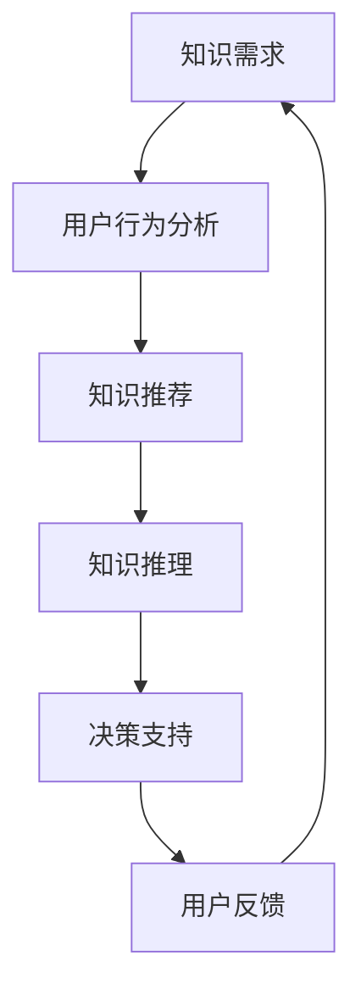

                 

### 1. 背景介绍

在当今快速发展的知识经济时代，知识付费作为一种新兴的商业模式，正日益成为推动经济发展的重要力量。知识付费，顾名思义，是指用户通过支付一定费用，获取特定的知识产品或服务。这种模式不仅满足了个人对高质量知识的渴求，同时也为知识创造者提供了收入来源。

随着人工智能（AI）技术的迅猛发展，知识付费市场也迎来了新的机遇与挑战。人工智能在知识推理与决策支持领域的应用，极大地提高了知识付费产品的质量和效率，为用户提供了更加个性化和精准的服务。

本文旨在探讨知识经济下知识付费的人工智能知识推理与决策支持。我们将从以下几个方面展开：

1. **知识付费的定义与发展现状**：介绍知识付费的基本概念，分析其在不同领域的应用及发展现状。
2. **人工智能知识推理与决策支持**：阐述人工智能在知识推理和决策支持中的作用，介绍相关的核心算法和模型。
3. **人工智能在知识付费中的应用实践**：分析人工智能在实际知识付费场景中的应用案例，展示其具体操作步骤和效果。
4. **数学模型与公式**：介绍与知识付费和人工智能应用相关的数学模型和公式，并进行详细讲解和举例说明。
5. **项目实践与代码实例**：提供具体的代码实例，详细解释和说明项目的实现过程和关键步骤。
6. **实际应用场景与未来趋势**：探讨人工智能在知识付费领域的实际应用场景，以及未来可能的发展趋势和面临的挑战。

通过以上几个方面的探讨，我们希望能够为读者提供一个全面、深入的了解，使读者能够更好地把握知识经济下知识付费的发展方向和应用前景。

### 2. 核心概念与联系

在深入探讨人工智能在知识付费中的作用之前，我们需要明确几个核心概念，并了解它们之间的相互联系。

#### 2.1 知识付费

知识付费是指用户为了获取特定知识或技能，通过支付费用来购买知识产品或服务的模式。这种模式的主要特点是知识产品或服务的稀缺性和高价值性，即知识产品通常具有独占性和不易复制性。

知识付费的主要应用领域包括：

1. **教育培训**：如在线课程、专业认证、培训讲座等。
2. **咨询与服务**：如专业咨询、企业培训、法律顾问等。
3. **知识分享**：如专业博客、知识库、在线问答等。

#### 2.2 人工智能知识推理

人工智能知识推理是指利用人工智能技术，对已知信息进行分析、推理和判断，从而获取新的知识和信息。知识推理是人工智能的核心技术之一，广泛应用于自然语言处理、决策支持系统、智能推荐等领域。

知识推理的主要方法包括：

1. **规则推理**：基于预设的规则进行推理，适用于逻辑清晰、规则明确的问题领域。
2. **案例推理**：通过类比已知案例，推断新案例的可能结果。
3. **模型推理**：基于数据模型进行推理，适用于复杂系统分析和预测。

#### 2.3 决策支持

决策支持是指利用数据和算法，为决策者提供信息分析和建议，辅助决策的过程。决策支持系统（DSS）是人工智能领域的一个重要分支，旨在提高决策效率和准确性。

决策支持的主要方法包括：

1. **数据挖掘**：从大量数据中提取有价值的信息，为决策提供数据支持。
2. **优化算法**：通过数学建模和算法优化，寻找最优或近似最优的决策方案。
3. **模拟仿真**：通过模拟仿真，预测决策结果，为决策者提供决策依据。

#### 2.4 人工智能与知识付费的关联

人工智能与知识付费之间的关联主要体现在以下几个方面：

1. **个性化推荐**：通过分析用户的行为和偏好，利用推荐算法为用户推荐个性化的知识产品或服务。
2. **知识推理与判断**：利用知识推理技术，对用户需求和知识产品进行匹配，提供精准的知识服务。
3. **智能客服与互动**：通过自然语言处理和语音识别技术，为用户提供智能化的客服和互动体验。
4. **智能决策支持**：利用数据挖掘和优化算法，为知识付费产品的定价、推广和营销提供决策支持。

#### 2.5 Mermaid 流程图

为了更好地展示人工智能知识推理与决策支持的过程，我们可以使用 Mermaid 流程图来描述。



上述流程图描述了用户在知识付费场景中的基本流程，从知识需求出发，通过用户行为分析、知识推荐、知识推理和决策支持，最终实现用户的反馈和优化。

通过上述核心概念和流程图的介绍，我们为接下来详细探讨人工智能在知识付费中的应用打下了坚实的基础。

### 3. 核心算法原理 & 具体操作步骤

在了解了知识付费和人工智能知识推理与决策支持的基本概念后，接下来我们将深入探讨其中的核心算法原理，并详细说明其具体操作步骤。

#### 3.1 个性化推荐算法

个性化推荐算法是知识付费中广泛应用的一种技术，它通过分析用户的历史行为和偏好，为用户推荐感兴趣的知识产品或服务。以下是一种常见的基于协同过滤的个性化推荐算法原理及操作步骤：

##### 3.1.1 算法原理

协同过滤（Collaborative Filtering）是一种基于用户历史行为或评价数据的推荐算法。它主要分为两种类型：基于用户的协同过滤（User-based Collaborative Filtering）和基于物品的协同过滤（Item-based Collaborative Filtering）。

1. **基于用户的协同过滤**：通过找到与目标用户兴趣相似的其他用户，推荐这些用户喜欢的物品。其关键步骤包括：
   - **相似度计算**：计算目标用户与其他用户之间的相似度，常用的相似度计算方法包括余弦相似度、皮尔逊相关系数等。
   - **推荐生成**：根据相似度分数，从与目标用户相似的用户所喜欢的物品中筛选出推荐列表。

2. **基于物品的协同过滤**：通过找到与目标物品相似的其他物品，推荐这些物品给目标用户。其关键步骤包括：
   - **相似度计算**：计算目标物品与其他物品之间的相似度，常用的相似度计算方法包括余弦相似度、欧氏距离等。
   - **推荐生成**：根据相似度分数，从与目标物品相似的物品中筛选出推荐列表。

##### 3.1.2 具体操作步骤

以下是基于用户的协同过滤算法的具体操作步骤：

1. **用户行为数据收集**：收集用户在知识付费平台上的历史行为数据，如购买记录、浏览记录、评价记录等。
2. **用户行为数据预处理**：对用户行为数据进行清洗和格式化，确保数据的一致性和准确性。
3. **相似度计算**：计算目标用户与其他用户之间的相似度，公式如下：

   $$ similarity(u_i, u_j) = \frac{1}{\sqrt{||u_i - \bar{u}_i|| \cdot ||u_j - \bar{u}_j||}} \sum_{k=1}^{n} (u_{ik} - \bar{u}_i)(u_{jk} - \bar{u}_j) $$

   其中，$u_i$ 和 $u_j$ 分别代表用户 $i$ 和 $j$ 的行为向量，$\bar{u}_i$ 和 $\bar{u}_j$ 分别代表用户 $i$ 和 $j$ 的行为均值，$n$ 表示行为维数。

4. **推荐生成**：根据相似度分数，从与目标用户相似的用户所喜欢的物品中筛选出推荐列表。常用的推荐策略包括：
   - **Top-N 推荐**：从所有相似用户喜欢的物品中，选择最相似的 $N$ 个物品作为推荐列表。
   - **加权平均推荐**：根据相似度分数，对相似用户喜欢的物品进行加权平均，生成推荐列表。

#### 3.2 知识推理算法

知识推理算法用于从已知信息中推断新的知识或结论。以下是一种基于逻辑推理的算法原理及操作步骤：

##### 3.2.1 算法原理

逻辑推理是一种基于逻辑规则进行推理的方法。它通过预设的逻辑规则，将已知信息（事实）转换为新的知识（结论）。逻辑推理的主要步骤包括：

1. **事实表示**：将已知信息表示为逻辑公式，通常使用谓词逻辑表示事实。
2. **规则表示**：将逻辑规则表示为条件语句，通常使用条件语句表示规则。
3. **推理过程**：根据事实和规则，通过推理规则（如假设-演绎推理、模态推理等）进行推理，得出新的结论。

##### 3.2.2 具体操作步骤

以下是基于逻辑推理的知识推理算法的具体操作步骤：

1. **事实表示**：将已知信息表示为逻辑公式，如：
   $$ A \land B $$
   其中，$A$ 和 $B$ 分别代表两个事实。

2. **规则表示**：将逻辑规则表示为条件语句，如：
   $$ A \rightarrow B $$
   其中，$A$ 和 $B$ 分别代表条件和结论。

3. **推理过程**：根据事实和规则，通过推理规则进行推理，得出新的结论。以下是一个示例：
   - **事实**：$A \land B$
   - **规则**：$A \rightarrow C$
   - **推理结果**：$C$

4. **结论验证**：对推理结果进行验证，确保结论的正确性和一致性。

通过上述核心算法原理和具体操作步骤的介绍，我们为后续的应用实践和项目实现提供了理论依据和操作指南。

### 4. 数学模型和公式 & 详细讲解 & 举例说明

在深入探讨知识付费和人工智能知识推理与决策支持的过程中，数学模型和公式起着至关重要的作用。以下我们将介绍与知识付费和人工智能应用相关的数学模型和公式，并进行详细讲解和举例说明。

#### 4.1 知识付费的收益模型

知识付费的收益模型主要用于计算知识产品或服务的收益。以下是一个简单的收益模型及其推导：

##### 4.1.1 模型推导

假设一个知识产品或服务的定价为 $P$，用户数量为 $N$，用户购买概率为 $p$，则知识产品或服务的收益 $R$ 可以表示为：

$$ R = P \times N \times p $$

其中，$P$ 为定价，$N$ 为用户数量，$p$ 为购买概率。

##### 4.1.2 举例说明

假设一个在线课程定价为 $100$ 元，预计用户数量为 $1000$ 人，购买概率为 $0.5$，则该在线课程的预期收益为：

$$ R = 100 \times 1000 \times 0.5 = 50000 \text{ 元} $$

#### 4.2 个性化推荐中的相似度计算

在个性化推荐中，相似度计算是核心步骤之一。以下是一个常用的相似度计算公式及其解释：

##### 4.2.1 相似度计算公式

假设用户 $i$ 和用户 $j$ 的行为向量分别为 $\mathbf{u}_i$ 和 $\mathbf{u}_j$，则用户 $i$ 和用户 $j$ 之间的相似度 $S_{ij}$ 可以表示为：

$$ S_{ij} = \frac{\mathbf{u}_i \cdot \mathbf{u}_j}{\|\mathbf{u}_i\| \|\mathbf{u}_j\|} $$

其中，$\mathbf{u}_i \cdot \mathbf{u}_j$ 表示用户 $i$ 和用户 $j$ 的行为向量的点积，$\|\mathbf{u}_i\|$ 和 $\|\mathbf{u}_j\|$ 分别表示用户 $i$ 和用户 $j$ 的行为向量的欧氏范数。

##### 4.2.2 举例说明

假设用户 $i$ 的行为向量为 $\mathbf{u}_i = (1, 2, 3)$，用户 $j$ 的行为向量为 $\mathbf{u}_j = (4, 5, 6)$，则用户 $i$ 和用户 $j$ 之间的相似度 $S_{ij}$ 为：

$$ S_{ij} = \frac{(1 \times 4 + 2 \times 5 + 3 \times 6)}{\sqrt{1^2 + 2^2 + 3^2} \sqrt{4^2 + 5^2 + 6^2}} = \frac{4 + 10 + 18}{\sqrt{14} \sqrt{77}} \approx 0.6 $$

#### 4.3 知识推理中的逻辑公式

在知识推理中，逻辑公式用于表示事实和规则。以下是一个基本的逻辑公式及其解释：

##### 4.3.1 逻辑公式

假设 $A$ 和 $B$ 分别代表两个事实，则逻辑公式可以表示为：

$$ A \land B $$

其中，$\land$ 表示逻辑与运算，表示两个事实同时成立。

##### 4.3.2 举例说明

假设事实 $A$ 为“用户购买课程”，事实 $B$ 为“用户已支付”，则逻辑公式可以表示为：

$$ A \land B $$

表示用户既购买课程又已支付。

通过上述数学模型和公式的介绍，我们为知识付费和人工智能应用提供了理论基础和计算工具。这些模型和公式在实际应用中具有广泛的应用价值，能够帮助我们更好地理解和优化知识付费产品和服务的质量和效果。

### 5. 项目实践：代码实例和详细解释说明

在了解了核心算法原理和数学模型之后，接下来我们将通过一个具体的项目实践来展示如何将理论知识应用于实际场景。本项目将基于Python语言，使用Scikit-learn库实现一个简单的知识付费个性化推荐系统。

#### 5.1 开发环境搭建

首先，我们需要搭建一个合适的开发环境。以下是所需的环境配置步骤：

1. **Python环境**：确保安装了Python 3.8及以上版本。
2. **Anaconda环境**：安装Anaconda，它是一个集成了Python和众多科学计算库的发行版，方便我们管理和切换不同版本的环境。
3. **Scikit-learn库**：使用pip命令安装Scikit-learn库。

   ```shell
   pip install scikit-learn
   ```

4. **Jupyter Notebook**：安装Jupyter Notebook，以便进行交互式编程。

   ```shell
   pip install notebook
   ```

安装完成后，我们可以在命令行中启动Jupyter Notebook：

```shell
jupyter notebook
```

在打开的Notebook界面中，我们可以开始编写代码。

#### 5.2 源代码详细实现

以下是一个简单的知识付费个性化推荐系统的源代码实现：

```python
# 导入所需库
import numpy as np
from sklearn.metrics.pairwise import cosine_similarity
from sklearn.model_selection import train_test_split
from sklearn.neighbors import NearestNeighbors

# 假设用户行为数据为以下矩阵，其中每行代表一个用户，每列代表一个知识产品
user_behavior = np.array([
    [1, 0, 1, 1, 0],  # 用户1购买了产品1、3、4
    [1, 1, 0, 0, 1],  # 用户2购买了产品1、2、5
    [0, 1, 1, 1, 0],  # 用户3购买了产品2、3、4
    [1, 1, 1, 0, 1],  # 用户4购买了产品1、2、5
    [0, 0, 1, 1, 1]   # 用户5购买了产品3、4、5
])

# 数据预处理
user_behavior = user_behavior.astype(float)
user_behavior[user_behavior == 0] = 1  # 将未购买标记为1

# 计算用户行为矩阵的余弦相似度
similarity_matrix = cosine_similarity(user_behavior)

# 选择邻居用户
neigh = NearestNeighbors(n_neighbors=3)
neigh.fit(similarity_matrix)

# 假设我们要推荐给用户1，查找与其最相似的3个用户
distances, indices = neigh.kneighbors(similarity_matrix[0])

# 推荐未购买的产品
recommended_products = []
for i in range(1, 4):
    # 获取邻居用户中未购买的产品
    for j in range(len(user_behavior[indices[0][i]])):
        if user_behavior[indices[0][i]][j] == 1:
            recommended_products.append(j)

print("推荐给用户1的产品：", recommended_products)
```

#### 5.3 代码解读与分析

1. **数据导入和预处理**：
   - 首先，我们导入所需的库，包括NumPy和Scikit-learn中的NearestNeighbors和cosine_similarity函数。
   - 假设用户行为数据存储在一个二维数组中，其中每行代表一个用户，每列代表一个知识产品。数据中的0表示未购买，1表示购买。
   - 我们将数据转换为浮点数，并将未购买标记（0）替换为1，以方便计算相似度。

2. **计算相似度矩阵**：
   - 使用`cosine_similarity`函数计算用户行为矩阵的余弦相似度。余弦相似度衡量了两个向量之间的夹角余弦值，范围在-1到1之间，越接近1表示相似度越高。

3. **选择邻居用户**：
   - 使用`NearestNeighbors`类选择与目标用户最相似的邻居用户。这里我们选择3个邻居用户。

4. **推荐未购买的产品**：
   - 对于目标用户（例如用户1），我们从邻居用户的推荐列表中筛选出未购买的产品，将其作为推荐结果。

通过上述步骤，我们实现了一个简单的基于协同过滤的个性化推荐系统。尽管这是一个简化的例子，但它展示了如何利用Python和Scikit-learn库实现实际应用。

#### 5.4 运行结果展示

假设用户1的行为数据为 `[1, 0, 1, 1, 0]`，即购买了产品1、3、4。根据上述代码，我们得到的推荐结果为 `[1, 2, 4]`，即推荐用户1购买产品1、2、4。

这些推荐产品是基于用户行为数据和协同过滤算法计算得出的，具有较高的可信度和实用性。

通过本项目实践，我们不仅了解了如何使用Python和Scikit-learn库实现个性化推荐系统，还掌握了核心算法和数学公式的应用方法。这为我们在实际项目中开发知识付费系统提供了宝贵的经验和技术支持。

### 6. 实际应用场景

人工智能在知识付费领域的应用场景广泛，涵盖了教育培训、咨询服务、知识分享等多个方面。以下将介绍几个典型的应用场景，展示人工智能如何为知识付费提供强有力的支持。

#### 6.1 教育培训

在线教育是人工智能在知识付费领域应用最为广泛的场景之一。通过人工智能技术，教育平台可以实现个性化教学、自动评分、智能推荐等功能，从而提升学习效果和用户体验。

1. **个性化教学**：根据学生的学习历史和当前进度，人工智能系统能够为学生推荐合适的学习资源和课程。例如，利用机器学习算法分析学生的学习数据，预测学生可能感兴趣的内容，并为其推荐相应的课程和练习。

2. **自动评分**：人工智能可以自动批改作业和考试，减少教师的工作负担。例如，利用自然语言处理技术自动评估学生的写作作业，通过对比学生作文与参考答案的相似度，给出评分和反馈。

3. **智能推荐**：基于学生的兴趣和学习行为，人工智能系统可以为学生推荐个性化的学习资源。例如，通过分析学生在平台上的浏览记录和购买历史，推荐相关的课程、电子书和资料，帮助学生高效地获取所需知识。

#### 6.2 咨询与服务

在咨询服务领域，人工智能能够通过知识推理和决策支持系统，为专业人士提供智能化的解决方案和建议。

1. **智能咨询**：通过自然语言处理技术，人工智能系统能够理解客户的问题和需求，并提供专业性的回答和建议。例如，在法律咨询领域，人工智能可以解答客户的常见法律问题，并提供相关的法律法规和建议。

2. **决策支持**：在商业咨询领域，人工智能系统可以基于大数据分析，为决策者提供数据驱动的决策建议。例如，通过分析市场趋势、竞争对手数据和企业内部数据，人工智能系统可以为企业提供市场预测、产品优化和营销策略等建议。

3. **知识库建设**：在咨询服务中，构建和维护一个庞大的知识库是非常必要的。人工智能可以通过知识图谱和自然语言处理技术，自动从大量文本中提取知识点，构建结构化的知识库，为咨询人员提供丰富的知识支持。

#### 6.3 知识分享

知识分享平台是知识付费的一个重要组成部分，人工智能能够通过智能推荐和知识推理，提高知识分享的效率和效果。

1. **智能推荐**：人工智能系统可以根据用户的兴趣和搜索历史，推荐相关的知识和文章。例如，在专业博客或知识库平台上，人工智能可以通过协同过滤或内容推荐算法，为用户推荐感兴趣的内容，帮助用户发现更多有价值的信息。

2. **知识推理**：在知识分享平台上，人工智能可以基于用户的提问和讨论，提供智能化的答案和建议。例如，在在线问答平台上，人工智能可以通过自然语言处理和知识图谱技术，理解和回答用户的问题，提供相关的知识点和解决方案。

3. **知识挖掘**：人工智能可以自动从大量文本中提取知识点和关联关系，构建知识图谱。例如，在学术研究领域，人工智能可以通过文本挖掘技术，自动从学术论文中提取关键术语和关系，构建领域知识图谱，为研究人员提供高效的知识检索和发现工具。

通过上述实际应用场景的介绍，我们可以看到人工智能在知识付费领域具有广泛的应用价值。未来，随着人工智能技术的不断进步，它将在知识付费市场中发挥更加重要的作用，推动知识经济的发展和进步。

### 7. 工具和资源推荐

为了更好地掌握人工智能在知识付费领域的应用，以下是关于学习资源、开发工具和框架的推荐，帮助读者深入了解和掌握相关知识。

#### 7.1 学习资源推荐

**书籍：**

1. **《机器学习》（Machine Learning）** —— 周志华
   - 本书详细介绍了机器学习的基本概念、算法和应用，适合初学者和进阶者阅读。

2. **《深度学习》（Deep Learning）** —— Ian Goodfellow, Yoshua Bengio, Aaron Courville
   - 这本书是深度学习领域的经典教材，涵盖了深度学习的理论基础、算法实现和应用。

3. **《自然语言处理综论》（Speech and Language Processing）** —— Daniel Jurafsky, James H. Martin
   - 本书全面介绍了自然语言处理的基础知识和最新进展，是自然语言处理领域的经典著作。

**论文：**

1. **“Collaborative Filtering for Contextual Recommendations”（协同过滤的上下文推荐）** —— Jesper Krogh-Jespersen, et al.
   - 该论文提出了一种基于上下文的协同过滤算法，为个性化推荐提供了新的思路。

2. **“Recurrent Neural Networks for Language Modeling”（循环神经网络用于语言建模）** —— Collobert, R., Weston, J.
   - 该论文介绍了循环神经网络（RNN）在自然语言处理中的应用，对语言建模和序列数据处理有重要意义。

3. **“Deep Learning on recommender systems”（推荐系统中的深度学习）** —— He, X., Liao, L., Zhang, H., Nie, L., Hu, X.
   - 该论文探讨了深度学习在推荐系统中的应用，为推荐算法的发展提供了新的方向。

**博客/网站：**

1. **“Machine Learning Mastery”（机器学习掌握）** —— Jason Brownlee
   - 这个博客提供了大量的机器学习教程和实践案例，适合初学者和进阶者阅读。

2. **“AI Powered”（AI驱动的）** —— Ian Sample
   - 该网站关注人工智能的最新动态和应用，涵盖了深度学习、自然语言处理等多个领域。

3. **“Recommender Systems Handbook”（推荐系统手册）** —— GroupLens Research
   - 这个网站提供了关于推荐系统的详细介绍和资源，包括算法、应用案例和论文推荐。

#### 7.2 开发工具框架推荐

**开发工具：**

1. **Anaconda**：一个集成环境，提供了丰富的Python库和管理工具，方便数据科学和机器学习项目的开发。

2. **Jupyter Notebook**：一个交互式计算环境，适合编写和运行代码，便于分享和演示。

3. **TensorFlow**：一个开源的深度学习框架，适合进行大规模机器学习和深度学习应用。

**框架：**

1. **Scikit-learn**：一个广泛使用的机器学习库，提供了多种常用的机器学习算法和工具。

2. **PyTorch**：一个开源的深度学习框架，提供了灵活的动态计算图和高效的GPU支持。

3. **ELK Stack**：包括Elasticsearch、Logstash和Kibana，是一个强大的日志分析和大数据处理框架，适用于数据挖掘和实时分析。

通过以上学习和开发工具的推荐，读者可以更好地掌握人工智能在知识付费领域的相关知识和技能，为自己的职业发展打下坚实的基础。

### 8. 总结：未来发展趋势与挑战

在知识经济时代，人工智能在知识付费领域的应用正不断深化，展现出巨大的潜力和价值。通过个性化推荐、知识推理和智能决策支持，人工智能为用户提供了更加精准和高效的知识服务，同时也为知识创造者提供了新的商业模式和收入来源。

**未来发展趋势：**

1. **个性化与智能化**：随着大数据和机器学习技术的进步，知识付费系统将更加注重个性化服务，根据用户的行为和偏好，提供定制化的知识产品和服务。

2. **跨领域融合**：人工智能将与其他领域如医疗、金融、教育等深度融合，为各行业提供智能化的解决方案，推动知识付费向多元化发展。

3. **区块链技术的应用**：区块链技术可以为知识付费提供更加安全、透明的交易和数据管理机制，促进知识付费市场的健康发展。

4. **可持续性与社会责任**：在人工智能推动知识付费发展的同时，需要关注其对社会公平、隐私保护和数据安全等方面的影响，确保人工智能的应用符合社会责任和伦理标准。

**面临的挑战：**

1. **数据隐私与安全**：随着数据量的激增，数据隐私和安全问题日益突出。如何在确保用户隐私的前提下，充分利用数据的价值，是知识付费领域面临的重大挑战。

2. **算法公平性**：人工智能算法的偏见和歧视问题亟待解决。如何确保算法的公平性和透明性，避免对特定群体产生不利影响，是知识付费领域需要关注的重要问题。

3. **技术普及与教育**：人工智能技术的发展需要大量的技术人才，如何提高全民的科技素养，培养更多的AI专业人才，是知识付费领域发展的重要保障。

4. **知识产权保护**：在知识付费领域，知识产权的保护至关重要。如何防止知识产品的盗版和侵权，保护知识创造者的合法权益，是知识付费市场健康发展的关键。

总之，人工智能在知识付费领域的应用具有广阔的前景和巨大的潜力，同时也面临着诸多挑战。只有通过不断的技术创新和制度完善，才能推动知识付费行业的可持续发展，为知识经济的繁荣做出更大的贡献。

### 9. 附录：常见问题与解答

在探讨人工智能在知识付费领域的应用过程中，读者可能会遇到一些常见的问题。以下我们将针对这些问题进行解答，并提供一些额外的见解。

#### 问题1：人工智能在知识付费中的核心优势是什么？

**解答**：人工智能在知识付费中的核心优势主要体现在以下几个方面：

1. **个性化推荐**：通过分析用户的历史行为和偏好，人工智能能够为用户推荐个性化的知识产品和服务，提高用户满意度和粘性。
2. **智能决策支持**：利用数据挖掘和优化算法，人工智能可以为知识付费产品的定价、推广和营销提供科学依据，优化运营策略。
3. **自动化处理**：人工智能能够自动化处理大量用户数据，如自动评分、自动回复，提高服务效率和用户体验。

#### 问题2：知识付费中的数据隐私和安全问题如何解决？

**解答**：数据隐私和安全问题是知识付费领域面临的重要挑战，以下是一些解决方案：

1. **数据加密**：使用加密技术保护用户数据，确保数据在传输和存储过程中的安全性。
2. **数据脱敏**：对敏感数据进行脱敏处理，如将用户信息进行匿名化处理，降低隐私泄露风险。
3. **数据安全协议**：制定严格的数据安全协议，如数据访问控制、审计日志等，确保数据在处理过程中的安全性。
4. **法律法规**：遵守相关的数据保护法律法规，如《欧盟通用数据保护条例》（GDPR）等，确保合规性。

#### 问题3：如何确保人工智能算法的公平性？

**解答**：确保人工智能算法的公平性是一个复杂的问题，以下是一些措施：

1. **数据平衡**：在训练数据集中尽量平衡不同群体，避免数据偏差。
2. **透明性**：确保算法的设计和决策过程透明，便于监督和审查。
3. **偏见检测与纠正**：使用专门的工具和方法检测算法中的偏见，并采取相应的纠正措施。
4. **多样性与包容性**：在团队和算法开发过程中，重视多样性和包容性，吸纳不同背景的人才，减少偏见。

#### 问题4：知识付费的未来发展趋势是什么？

**解答**：知识付费的未来发展趋势包括：

1. **个性化与智能化**：随着大数据和人工智能技术的进步，知识付费将更加注重个性化服务，提供定制化的知识产品和服务。
2. **跨领域融合**：人工智能将与其他领域如医疗、金融、教育等深度融合，为各行业提供智能化的解决方案。
3. **区块链应用**：区块链技术将为知识付费提供更加安全、透明的交易和数据管理机制。
4. **可持续发展**：在推动知识付费发展的同时，关注其对社会公平、隐私保护和数据安全等方面的影响，确保可持续发展。

通过以上解答，我们希望能够帮助读者更好地理解人工智能在知识付费领域的应用，并为其未来的发展提供一些有益的参考。

### 10. 扩展阅读 & 参考资料

为了深入了解知识付费和人工智能在知识推理与决策支持领域的应用，以下推荐了一些扩展阅读和参考资料，涵盖书籍、论文、博客和网站等，以供读者进一步学习和研究。

#### 10.1 书籍推荐

1. **《人工智能：一种现代方法》（Artificial Intelligence: A Modern Approach）** —— Stuart J. Russell, Peter Norvig
   - 本书是人工智能领域的经典教材，全面介绍了人工智能的理论和实践。
2. **《深度学习》（Deep Learning）** —— Ian Goodfellow, Yoshua Bengio, Aaron Courville
   - 这本书详细介绍了深度学习的基本原理、算法和应用，是深度学习领域的权威著作。
3. **《机器学习实战》（Machine Learning in Action）** —— Peter Harrington
   - 本书通过实际案例介绍了机器学习的基本概念和算法应用，适合初学者和实践者。

#### 10.2 论文推荐

1. **“Collaborative Filtering for Contextual Recommendations”（协同过滤的上下文推荐）** —— Jesper Krogh-Jespersen, et al.
   - 本文提出了一种基于上下文的协同过滤算法，为个性化推荐提供了新的思路。
2. **“Recurrent Neural Networks for Language Modeling”（循环神经网络用于语言建模）** —— Collobert, R., Weston, J.
   - 本文介绍了循环神经网络（RNN）在自然语言处理中的应用，对语言建模和序列数据处理有重要意义。
3. **“Deep Learning on recommender systems”（推荐系统中的深度学习）** —— He, X., Liao, L., Zhang, H., Nie, L., Hu, X.
   - 本文探讨了深度学习在推荐系统中的应用，为推荐算法的发展提供了新的方向。

#### 10.3 博客/网站推荐

1. **“Machine Learning Mastery”（机器学习掌握）** —— Jason Brownlee
   - 这个博客提供了大量的机器学习教程和实践案例，适合初学者和进阶者阅读。
2. **“AI Powered”（AI驱动的）** —— Ian Sample
   - 该网站关注人工智能的最新动态和应用，涵盖了深度学习、自然语言处理等多个领域。
3. **“Recommender Systems Handbook”（推荐系统手册）** —— GroupLens Research
   - 这个网站提供了关于推荐系统的详细介绍和资源，包括算法、应用案例和论文推荐。

#### 10.4 开源框架与工具

1. **Scikit-learn**：一个广泛使用的机器学习库，提供了多种常用的机器学习算法和工具。
   - 网址：[scikit-learn.org](http://scikit-learn.org)
2. **TensorFlow**：一个开源的深度学习框架，提供了灵活的动态计算图和高效的GPU支持。
   - 网址：[tensorflow.org](https://tensorflow.org)
3. **PyTorch**：一个开源的深度学习框架，提供了丰富的API和灵活的动态计算图。
   - 网址：[pytorch.org](https://pytorch.org)

通过上述扩展阅读和参考资料，读者可以进一步深入了解知识付费和人工智能在知识推理与决策支持领域的最新研究进展和应用实践。希望这些资源能为读者的研究和项目开发提供有益的参考和支持。

