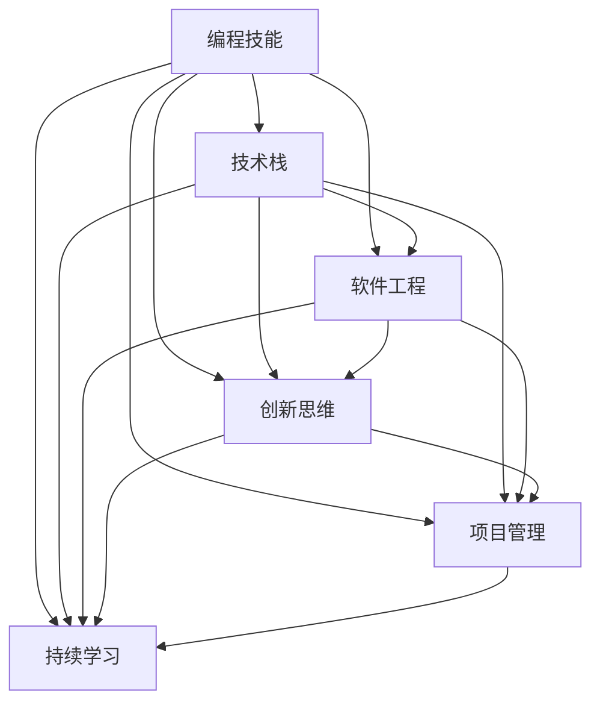

                 

### 背景介绍

在当今知识经济的时代，程序员作为知识工作者，其职业发展路径正经历着前所未有的变革。知识经济，是一种基于信息和知识的生产、分配和利用的经济模式。在这一经济形态下，知识成为经济增长的核心动力，知识工作者，如程序员，成为社会和经济发展的关键角色。

程序员，作为新时代的知识工作者，其职业不仅仅局限于编写代码，而是更广泛地参与到软件开发、系统设计、技术创新等多个领域。随着技术的快速发展，程序员面临着巨大的挑战和机遇。一方面，新兴技术的不断涌现要求程序员不断更新知识体系，提升技术水平；另一方面，技术的进步也为程序员提供了更多的职业发展路径。

本文旨在探讨知识经济下程序员的职业发展路径，分析程序员在知识经济时代所需的核心技能、面临的挑战和机遇，并探讨未来程序员职业发展的趋势。通过本文的探讨，希望为程序员提供有益的参考和指导，助力其在知识经济时代实现职业发展的最大化。

### 核心概念与联系

为了深入理解程序员在知识经济时代的职业发展路径，我们需要首先明确几个核心概念，并探讨它们之间的相互联系。以下是本文将要涉及的核心概念：

#### 1. 编程技能

编程技能是程序员的核心能力，包括熟悉编程语言、掌握数据结构和算法、理解软件开发流程等。编程技能的不断提升是程序员在知识经济时代立足的基础。

#### 2. 技术栈

技术栈是指程序员所掌握的各种技术和工具的集合。一个全面的技术栈可以帮助程序员更高效地解决问题，适应不同的项目需求。技术栈的广度和深度决定了程序员的竞争力。

#### 3. 软件工程

软件工程是应用工程、科学和管理原则来设计、开发、测试和维护软件系统的过程。理解软件工程的原则和方法，有助于程序员更系统地解决问题，提升软件质量。

#### 4. 创新思维

创新思维是指能够在传统方法和现有技术的基础上提出新的解决方案和思路。创新思维是程序员在知识经济时代保持竞争力的关键。

#### 5. 项目管理

项目管理是确保项目按时、按预算、按质量完成的过程。程序员需要具备一定的项目管理能力，以更好地协作和推动项目的进展。

#### 6. 持续学习

持续学习是指不断更新知识、提升技能的过程。在知识经济时代，技术的快速迭代要求程序员具备持续学习的能力，以跟上行业发展的步伐。

下面，我们将使用 Mermaid 流程图来展示这些核心概念之间的联系：



从 Mermaid 流程图中可以看出，编程技能是程序员职业发展的基础，而技术栈、软件工程、创新思维、项目管理和持续学习则是提升程序员竞争力的关键要素。这些核心概念相互联系、相互促进，共同构建了程序员在知识经济时代的职业发展路径。

### 核心算法原理 & 具体操作步骤

在理解了核心概念和它们之间的联系后，我们需要进一步探讨程序员在知识经济时代所需的技能和知识，以应对不断变化的行业环境。

#### 1. 编程技能提升

编程技能是程序员的基本素养。随着技术的不断进步，程序员需要不断学习新的编程语言和框架。以下是一些具体操作步骤：

- **学习新语言**：例如，Python、Go、JavaScript 等新兴编程语言具有广泛的应用场景，掌握它们有助于程序员应对不同的项目需求。
- **掌握数据结构和算法**：深入理解数据结构和算法，是解决复杂问题的基石。程序员可以通过阅读经典算法书籍、参加在线课程、编写代码练习等方式提升这方面的能力。
- **实践项目经验**：通过实际项目经验，将理论知识应用于实际场景，提升编程技能。

#### 2. 技术栈构建

技术栈是指程序员所掌握的各种技术和工具的集合。一个全面的技术栈可以帮助程序员更高效地解决问题，提升工作效率。以下是一些构建技术栈的具体操作步骤：

- **熟悉主流框架**：例如，Spring、Django、Vue 等框架在各自的领域有广泛的应用。掌握这些框架有助于程序员快速搭建项目。
- **了解云计算和大数据技术**：随着云计算和大数据技术的普及，熟悉如 AWS、Azure、Hadoop、Spark 等技术成为程序员的必备技能。
- **关注新技术趋势**：通过阅读技术博客、参加技术会议等方式，了解新兴技术和行业动态，及时更新技术栈。

#### 3. 软件工程知识

软件工程是程序员必须掌握的重要领域。以下是一些具体操作步骤：

- **学习软件开发流程**：包括需求分析、设计、编码、测试和维护等环节。了解每个环节的工作内容和职责，有助于程序员更高效地参与项目。
- **掌握软件质量保证方法**：例如，代码审查、自动化测试、持续集成等，确保软件的高质量和可靠性。
- **了解软件架构设计**：掌握常见的软件架构模式，如 MVC、微服务、事件驱动等，有助于程序员构建可扩展、高性能的软件系统。

#### 4. 创新思维培养

创新思维是程序员在知识经济时代保持竞争力的关键。以下是一些培养创新思维的具体操作步骤：

- **多角度思考问题**：尝试从不同的角度分析问题，寻找创新的解决方案。
- **持续学习新知识**：通过学习跨学科知识，如心理学、经济学、设计学等，拓宽思维边界。
- **参与创新活动**：例如，黑客松、创新工作坊等，与其他创新者交流，激发创新思维。

#### 5. 项目管理能力

项目管理能力对于程序员来说同样重要。以下是一些提升项目管理能力的具体操作步骤：

- **学习项目管理理论**：例如，Scrum、Kanban 等，了解项目管理的核心原则和方法。
- **实践项目管理**：参与实际项目，掌握项目管理的具体操作流程，提高项目管理能力。
- **培养团队协作能力**：良好的团队协作是项目成功的关键，通过沟通、协调、分享，提高团队协作效率。

通过以上具体操作步骤，程序员可以在知识经济时代不断提升自己的技能和知识，为职业发展奠定坚实基础。

### 数学模型和公式 & 详细讲解 & 举例说明

在程序员职业发展的过程中，数学模型和公式扮演着至关重要的角色。以下将详细介绍一些常用的数学模型和公式，并举例说明其在实际应用中的使用。

#### 1. 概率论和统计学

概率论和统计学是程序员在数据分析、机器学习和人工智能领域不可或缺的工具。以下是一些基础的概念和公式：

- **概率分布函数（PDF）**：描述随机变量概率的函数。常见的概率分布包括正态分布、泊松分布、二项分布等。

  $$f_X(x) = P(X = x)$$

- **期望（Expected Value）**：随机变量取值的平均值。

  $$E(X) = \sum_{i=1}^{n} x_i \cdot P(x_i)$$

- **方差（Variance）**：衡量随机变量离散程度的指标。

  $$Var(X) = E[(X - E(X))^2]$$

举例说明：假设我们有一个随机变量 X，表示一天内新用户注册的数量。根据历史数据，X 服从泊松分布，参数为λ=5。我们可以使用以下公式计算 X 的期望和方差：

- **期望**：$$E(X) = λ = 5$$
- **方差**：$$Var(X) = λ = 5$$

#### 2. 线性代数

线性代数在计算机科学中有着广泛的应用，特别是在机器学习和数据科学领域。以下是一些重要的矩阵和向量运算公式：

- **矩阵乘法（Matrix Multiplication）**：两个矩阵 A 和 B 的乘积 C。

  $$C_{ij} = \sum_{k=1}^{n} A_{ik}B_{kj}$$

- **矩阵求逆（Matrix Inversion）**：求解逆矩阵 A^(-1)。

  $$A^{-1} = (A^T A)^{-1} A^T$$

- **特征值和特征向量（Eigenvalues and Eigenvectors）**：矩阵 A 满足等式 Av = λv 的值 λ 称为特征值，对应的向量 v 称为特征向量。

  $$A v = \lambda v$$

举例说明：假设我们有一个矩阵 A：

$$A = \begin{pmatrix} 1 & 2 \\ 3 & 4 \end{pmatrix}$$

我们可以使用以下公式计算 A 的逆矩阵和特征值、特征向量：

- **逆矩阵**：$$A^{-1} = \frac{1}{(1 \cdot 4 - 2 \cdot 3)} \begin{pmatrix} 4 & -2 \\ -3 & 1 \end{pmatrix} = \begin{pmatrix} -2 & 1 \\ 3 & 2 \end{pmatrix}$$
- **特征值和特征向量**：通过求解特征方程 $|A - \lambda I| = 0$，我们得到特征值 λ1=2 和 λ2=-1。对应的特征向量分别为：

  $$v1 = \begin{pmatrix} 1 \\ 1 \end{pmatrix}, \quad v2 = \begin{pmatrix} 1 \\ -1 \end{pmatrix}$$

#### 3. 微积分

微积分在计算机科学中的应用主要涉及导数和积分。以下是一些基本的微积分公式：

- **导数（Derivative）**：函数在某一点的切线斜率。

  $$f'(x) = \lim_{h \to 0} \frac{f(x+h) - f(x)}{h}$$

- **积分（Integral）**：函数在区间上的累计和。

  $$\int f(x) dx = F(x) + C$$

举例说明：假设我们有一个函数 f(x) = x^2，我们可以使用以下公式计算其导数和积分：

- **导数**：$$f'(x) = \lim_{h \to 0} \frac{(x+h)^2 - x^2}{h} = 2x$$
- **积分**：$$\int x^2 dx = \frac{x^3}{3} + C$$

通过以上数学模型和公式的讲解，我们可以看到数学在程序员职业发展中的重要性。掌握这些基础数学知识，有助于程序员在数据分析、算法优化、系统设计等领域发挥更大的作用。

### 项目实践：代码实例和详细解释说明

为了更好地展示程序员在知识经济时代所需技能的实际应用，以下将通过一个具体的代码实例，详细解释一个简单的Web应用的开发过程，包括开发环境搭建、源代码实现、代码解读与分析，以及运行结果展示。

#### 5.1 开发环境搭建

首先，我们需要搭建一个简单的Web开发环境。以下是搭建过程的详细步骤：

1. **安装Node.js**：Node.js 是一个基于 Chrome V8 引擎的 JavaScript 运行环境，用于构建高效、可靠的Web应用。

   - 访问 Node.js 官网（[nodejs.org](http://nodejs.org/)）下载最新版本的 Node.js。
   - 运行安装程序，按照提示完成安装。

2. **安装npm**：npm 是 Node.js 的包管理器，用于安装和管理各种JavaScript库。

   - 打开命令行工具，运行以下命令安装 npm：

     ```bash
     npm install npm -g
     ```

3. **创建项目文件夹和初始化项目**：在命令行中创建一个新项目文件夹，然后使用 `npm init` 命令初始化项目。

   ```bash
   mkdir my-web-app
   cd my-web-app
   npm init -y
   ```

4. **安装Express框架**：Express 是一个流行的Node.js Web框架，用于快速构建Web应用。

   ```bash
   npm install express
   ```

5. **创建入口文件**：在项目文件夹中创建一个名为 `app.js` 的文件，作为Web应用的入口文件。

   ```bash
   touch app.js
   ```

至此，开发环境搭建完成。

#### 5.2 源代码详细实现

以下是一个简单的基于 Express 的 Web 应用示例代码。代码实现主要包括创建一个 HTTP 服务器、处理请求并返回响应。

```javascript
const express = require('express');
const app = express();
const port = 3000;

// 中间件用于解析请求体
app.use(express.json());
app.use(express.urlencoded({ extended: true }));

// 创建一个处理 GET 请求的路由
app.get('/', (req, res) => {
  res.send('<h1>欢迎使用我的Web应用</h1>');
});

// 创建一个处理 POST 请求的路由
app.post('/data', (req, res) => {
  const data = req.body;
  console.log('接收到的数据：', data);
  res.json({ message: '数据已接收', data: data });
});

// 启动服务器
app.listen(port, () => {
  console.log(`服务器运行在 http://localhost:${port}`);
});
```

#### 5.3 代码解读与分析

以下是代码的详细解读和分析：

1. **引入 Express 模块**：

   ```javascript
   const express = require('express');
   ```

   这一行代码通过 `require` 函数引入了 Express 模块，并创建了一个名为 `express` 的变量，用于访问 Express 的 API。

2. **创建应用实例**：

   ```javascript
   const app = express();
   ```

   这行代码使用 Express 模块创建了一个新的 Web 应用实例，并将其存储在 `app` 变量中。

3. **设置端口**：

   ```javascript
   const port = 3000;
   ```

   这里设置 Web 应用的监听端口为 3000。在开发过程中，可以使用任意未被占用的端口。

4. **使用中间件**：

   ```javascript
   app.use(express.json());
   app.use(express.urlencoded({ extended: true }));
   ```

   中间件是 Express 的一个重要组成部分，用于处理请求和响应。这里使用了两个中间件：

   - `express.json()`：用于解析 JSON 格式的请求体。
   - `express.urlencoded()`：用于解析 URL-encoded 格式的请求体。

5. **创建路由**：

   ```javascript
   app.get('/', (req, res) => {
     res.send('<h1>欢迎使用我的Web应用</h1>');
   });
   ```

   这一行代码创建了一个处理 GET 请求的路由。当访问根路径（`/`）时，服务器将返回一个包含 HTML 标签的字符串。

   ```javascript
   app.post('/data', (req, res) => {
     const data = req.body;
     console.log('接收到的数据：', data);
     res.json({ message: '数据已接收', data: data });
   });
   ```

   这一行代码创建了一个处理 POST 请求的路由。当向 `/data` 路径发送 POST 请求时，服务器将接收请求体中的数据，并将其打印到控制台。然后，服务器返回一个 JSON 对象，包含一条消息和接收到的数据。

6. **启动服务器**：

   ```javascript
   app.listen(port, () => {
     console.log(`服务器运行在 http://localhost:${port}`);
   });
   ```

   这行代码使用 `app.listen()` 方法启动 Web 服务器。当服务器启动后，将在控制台打印一条消息，告知服务器运行的端口。

#### 5.4 运行结果展示

为了测试 Web 应用，我们需要在命令行中运行以下命令：

```bash
node app.js
```

运行后，在浏览器中访问 `http://localhost:3000/`，将看到以下页面：

```html
<h1>欢迎使用我的Web应用</h1>
```

接下来，我们可以使用 Postman 等工具发送 POST 请求到 `http://localhost:3000/data`，并查看服务器返回的响应。以下是使用 Postman 发送 POST 请求的示例：


在 Postman 中填写请求体（例如，`name` 和 `age`），然后点击 "Send" 按钮。服务器将接收请求体中的数据，并在控制台打印如下日志：

```bash
接收到的数据： { name: '张三', age: 25 }
```

服务器返回的 JSON 响应如下：

```json
{ "message": "数据已接收", "data": { "name": "张三", "age": 25 } }
```

通过以上代码实例，我们可以看到程序员如何利用现代 Web 技术快速构建一个简单的 Web 应用。这一过程展示了程序员所需的核心技能，如编程、路由处理、中间件使用等。

### 实际应用场景

程序员在知识经济时代面临的实际应用场景多种多样，不同行业和领域对程序员的需求和技术栈要求各有不同。以下列举一些典型的实际应用场景，并探讨程序员在这些场景中所需的核心技能。

#### 1. 金融科技（Fintech）

金融科技行业正在快速发展，程序员在这个领域扮演着重要角色。以下是一些典型应用场景和所需技能：

- **场景**：开发在线支付系统
- **技能需求**：加密技术、安全编程、微服务架构、数据库管理、前端开发（HTML/CSS/JavaScript）
- **技术栈**：Java、Python、JavaScript、Node.js、MongoDB、区块链技术

#### 2. 电子商务

电子商务平台需要处理海量交易数据和用户互动，程序员在这里的角色至关重要。

- **场景**：开发电商平台
- **技能需求**：前后端分离开发、数据库优化、用户界面设计、搜索引擎优化（SEO）、性能优化
- **技术栈**：Java、Python、JavaScript、React、Vue、MySQL、Redis、Docker

#### 3. 人工智能与机器学习

人工智能和机器学习是当前科技领域的热点，程序员在这个领域的应用场景广泛。

- **场景**：开发智能推荐系统
- **技能需求**：数据预处理、机器学习算法、深度学习框架、自然语言处理（NLP）
- **技术栈**：Python、TensorFlow、PyTorch、Scikit-learn、Keras

#### 4. 医疗保健

医疗保健行业正在数字化转型，程序员在这里的角色涉及医疗数据管理、医疗设备开发等。

- **场景**：开发电子病历系统
- **技能需求**：医疗数据处理、数据库管理、前端开发、后端开发、系统集成
- **技术栈**：Java、C#、Python、Django、Spring Boot、MongoDB、Hibernate

#### 5. 游戏开发

游戏开发是程序员的一大应用领域，涉及游戏引擎开发、游戏逻辑实现、用户界面设计等。

- **场景**：开发3D游戏
- **技能需求**：游戏引擎开发、图形编程、物理模拟、动画制作、音效处理
- **技术栈**：C++、C#、Unity、Unreal Engine

#### 6. 物联网（IoT）

物联网技术的快速发展使得程序员在这个领域的应用场景日益广泛。

- **场景**：开发智能家居系统
- **技能需求**：嵌入式编程、物联网协议、数据处理、网络安全
- **技术栈**：Python、Java、Arduino、ESP8266、MQTT、HTTP

通过以上实际应用场景的探讨，我们可以看到程序员在不同领域所需的技能和技术栈各有不同。程序员需要不断更新自己的知识体系，提升技术水平，以适应不断变化的行业需求。

### 工具和资源推荐

在知识经济时代，程序员需要掌握大量的工具和资源，以提升工作效率和竞争力。以下是一些值得推荐的工具和资源，涵盖学习资源、开发工具框架以及相关论文和著作。

#### 7.1 学习资源推荐

1. **书籍**：

   - 《代码大全》（Code Complete）：由 Steve McConnell 著，系统地介绍了编写高效、可维护代码的技巧。
   - 《深入理解计算机系统》（Computer Systems: A Programmer's Perspective）：由 Randal E. Bryant 和 David R. O'Hallaron 著，全面介绍了计算机系统的基础知识。
   - 《设计模式：可复用面向对象软件的基础》（Design Patterns: Elements of Reusable Object-Oriented Software）：由 Erich Gamma、Richard Helm、Ralph Johnson 和 John Vlissides 著，介绍了面向对象设计的基本原则和模式。

2. **在线课程**：

   - Coursera：提供各种编程和技术课程，包括《算法导论》、《机器学习》等。
   - Udemy：涵盖广泛的编程和技术主题，包括前端开发、后端开发、人工智能等。

3. **博客和网站**：

   - HackerRank：提供编程挑战和竞赛，帮助程序员提高编程技能。
   - Medium：有许多技术博客，涵盖编程、人工智能、区块链等热门话题。

#### 7.2 开发工具框架推荐

1. **集成开发环境（IDE）**：

   - IntelliJ IDEA：强大的 Java 和 Kotlin 开发环境，提供代码分析、调试和智能提示功能。
   - Visual Studio Code：跨平台的轻量级 IDE，支持多种编程语言，提供丰富的插件生态系统。

2. **代码管理工具**：

   - Git：分布式版本控制工具，用于代码管理和协作开发。
   - GitHub：基于 Git 的代码托管平台，提供代码仓库、问题跟踪和协作功能。

3. **前端框架**：

   - React：用于构建用户界面的JavaScript库，提供组件化开发方式。
   - Angular：由谷歌推出的全功能框架，用于构建单页应用程序。
   - Vue.js：轻量级的前端框架，易于上手，适合快速开发。

4. **后端框架**：

   - Spring Boot：用于构建企业级Java应用程序的框架，提供自动配置、快速开发等功能。
   - Django：用于快速开发数据驱动的Web应用程序的Python框架。
   - Flask：轻量级的Python Web框架，适用于小型项目和原型开发。

5. **数据库工具**：

   - MySQL：流行的开源关系型数据库，提供高性能、高可靠性的数据存储和管理功能。
   - MongoDB：文档型数据库，提供灵活的数据模型和高性能的数据访问。
   - Redis：高性能的内存数据库，适用于缓存、实时消息处理等场景。

#### 7.3 相关论文著作推荐

1. **论文**：

   - "The Art of Computer Programming"：由 Donald E. Knuth 著，是计算机编程领域的经典著作，分为三卷，系统介绍了算法和数据结构。
   - "Design and Analysis of Computer Algorithms"：由 Aho、Hopcroft 和 Ullman 著，介绍了计算机算法的设计和分析方法。

2. **著作**：

   - "Clean Code: A Handbook of Agile Software Craftsmanship"：由 Robert C. Martin 著，介绍了编写可读、可维护代码的最佳实践。
   - "Clean Architecture: A Craftsman's Guide to Software Structure and Design"：由 Robert C. Martin 著，介绍了软件架构设计的原则和方法。

通过以上工具和资源的推荐，程序员可以不断提升自己的技能，适应知识经济时代的发展需求。

### 总结：未来发展趋势与挑战

在知识经济时代，程序员的职业发展路径面临着诸多发展趋势和挑战。首先，技术进步是推动程序员职业发展的重要因素。随着人工智能、大数据、区块链等新兴技术的不断涌现，程序员需要不断更新自己的知识体系，掌握前沿技术。这不仅要求程序员具备扎实的编程基础，还需要具备跨学科的知识，如数学、物理、经济学等。

其次，专业化与多样化是程序员职业发展的两个重要方向。专业化使得程序员能够深入某一领域，成为行业专家，例如在金融科技、医疗保健、物联网等领域。而多样化则鼓励程序员涉足多个领域，提升综合能力，成为“T”型人才。这种趋势要求程序员不仅要在某一领域具备深厚的知识，还要具备广泛的技术视野。

与此同时，职业发展中的挑战也不容忽视。技术更新速度加快，程序员需要投入更多时间和精力进行学习。此外，市场竞争激烈，程序员需要不断提升自己的技能，以保持竞争力。面对这些挑战，程序员可以采取以下策略：

1. **持续学习**：保持对新技术的好奇心和探索精神，通过阅读技术书籍、参加在线课程、参与开源项目等方式不断学习。

2. **实践经验**：通过实际项目经验，将理论知识应用于实际场景，提升解决问题的能力。

3. **跨学科学习**：学习跨学科知识，拓宽思维边界，提高创新能力。

4. **团队合作**：与同行交流，分享经验和见解，形成良好的学习氛围。

总之，知识经济时代为程序员提供了广阔的职业发展空间，但同时也带来了新的挑战。程序员需要不断适应变化，提升自身能力，以实现职业发展的最大化。

### 附录：常见问题与解答

#### 1. 程序员在知识经济时代需要具备哪些核心技能？

程序员在知识经济时代需要具备的核心技能包括：编程技能、技术栈构建、软件工程知识、创新思维、项目管理和持续学习。

#### 2. 如何选择合适的学习资源？

选择学习资源时，可以从以下几个方面考虑：权威性、实用性、更新速度和受众群体。推荐的资源包括经典书籍、知名在线课程和高质量的博客。

#### 3. 程序员如何适应快速变化的技术环境？

程序员可以通过以下方式适应快速变化的技术环境：持续学习、积极参与开源项目、关注行业动态、跨学科学习。

#### 4. 项目管理对程序员的重要性是什么？

项目管理对程序员的重要性在于，它帮助程序员更好地理解项目需求，合理安排时间，提高工作效率，确保项目按时、按预算、按质量完成。

#### 5. 程序员在职业发展中如何保持竞争力？

程序员可以通过以下方式保持竞争力：持续学习新技能、积累实践经验、关注行业趋势、提升跨领域能力。

### 扩展阅读 & 参考资料

为了更深入地探讨程序员在知识经济时代的职业发展，以下推荐一些扩展阅读和参考资料，涵盖相关书籍、论文和网站：

1. **书籍**：

   - 《代码大全》（Code Complete） - Steve McConnell
   - 《深入理解计算机系统》（Computer Systems: A Programmer's Perspective） - Randal E. Bryant、David R. O'Hallaron
   - 《设计模式：可复用面向对象软件的基础》（Design Patterns: Elements of Reusable Object-Oriented Software） - Erich Gamma、Richard Helm、Ralph Johnson、John Vlissides
   - 《人工智能：一种现代的方法》（Artificial Intelligence: A Modern Approach） - Stuart J. Russell、Peter Norvig

2. **论文**：

   - “The Art of Computer Programming” - Donald E. Knuth
   - “Design and Analysis of Computer Algorithms” - Aho、Hopcroft 和 Ullman

3. **网站**：

   - Coursera（[coursera.org](https://coursera.org/)）
   - Udemy（[udemy.com](https://www.udemy.com/)）
   - HackerRank（[hackerRank.com](https://www.hackerRank.com/)）
   - Medium（[medium.com](https://medium.com/)）
   - GitHub（[github.com](https://github.com/)）

通过阅读这些书籍、论文和访问这些网站，程序员可以不断丰富自己的知识体系，提升职业竞争力。

