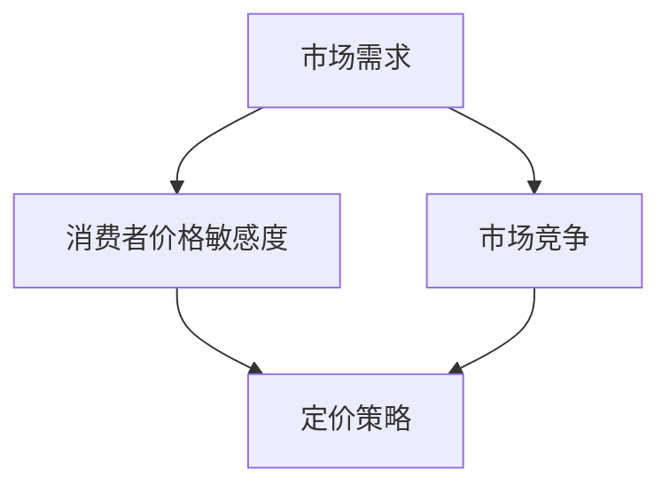

                 

### 文章标题：知识经济时代下的知识付费创新产品定价策略

> **关键词**：知识付费、定价策略、创新产品、知识经济、价格敏感度、市场需求。

> **摘要**：本文旨在探讨知识经济时代下，知识付费创新产品的定价策略。通过分析市场需求、消费者价格敏感度以及市场竞争等因素，提出了一套科学、合理的定价模型。文章旨在为知识付费行业从业者提供参考，助力其在激烈的市场竞争中实现可持续发展。

### 1. 背景介绍

知识付费，即知识服务付费，是近年来随着互联网技术的发展而兴起的一种新型商业模式。它主要指消费者通过付费方式获取专业、权威、有价值的知识内容。在知识经济时代，知识付费已成为推动经济增长的重要动力。据相关数据显示，全球知识付费市场规模逐年攀升，预计未来几年将持续保持高速增长。

在知识付费领域，创新产品的定价策略尤为重要。定价过高可能导致消费者流失，定价过低则可能影响产品品质和市场声誉。因此，如何制定科学、合理的定价策略，成为了众多知识付费平台和从业者面临的重要问题。

本文将围绕知识付费创新产品的定价策略，分析市场需求、消费者价格敏感度以及市场竞争等因素，提出一套具有可操作性的定价模型。通过本文的研究，旨在为知识付费行业提供有益的参考，助力其在激烈的市场竞争中实现可持续发展。

### 2. 核心概念与联系

为了深入探讨知识付费创新产品的定价策略，我们需要理解以下几个核心概念：

1. **市场需求**：市场需求是指在一定时间内，消费者愿意且能够购买的知识产品数量。市场需求受到多种因素影响，包括消费者收入水平、消费习惯、产品差异化程度等。

2. **消费者价格敏感度**：消费者价格敏感度是指消费者对价格变化的反应程度。高价格敏感度意味着消费者对价格变化较为敏感，低价格敏感度则表示消费者对价格变化反应较小。

3. **市场竞争**：市场竞争是指不同知识付费平台之间的竞争关系。市场竞争程度会影响产品的定价策略，竞争激烈时，平台可能需要采取更低的定价策略以吸引消费者。

为了更好地理解这些核心概念之间的联系，我们可以使用Mermaid流程图来表示它们之间的关系：



在知识付费市场中，市场需求直接影响消费者价格敏感度和市场竞争，而市场竞争又会进一步影响定价策略。消费者价格敏感度则是连接市场需求和市场竞争的关键因素。

### 3. 核心算法原理 & 具体操作步骤

在了解了核心概念后，我们可以提出一套基于市场需求、消费者价格敏感度和市场竞争的定价算法。该算法分为以下几个步骤：

#### 3.1 收集数据

首先，我们需要收集以下数据：

- 历史销售数据：包括产品销售额、销量、消费者评价等。
- 市场调查数据：包括消费者收入水平、消费习惯、产品差异化程度等。
- 竞争对手数据：包括竞争对手的产品定价、市场份额等。

#### 3.2 分析数据

接下来，我们分析收集到的数据，以了解市场需求、消费者价格敏感度和市场竞争状况。具体分析步骤如下：

1. **市场需求分析**：通过历史销售数据，分析产品的需求趋势。了解消费者对不同价格段的接受程度，以确定市场需求范围。
2. **消费者价格敏感度分析**：通过市场调查数据，分析消费者对价格变化的反应程度。了解不同消费者群体的价格敏感度，为后续定价提供依据。
3. **市场竞争分析**：通过竞争对手数据，分析市场竞争状况。了解竞争对手的产品定价策略，评估自身产品的竞争优势。

#### 3.3 制定定价策略

在分析数据的基础上，我们可以制定以下定价策略：

1. **区间定价策略**：根据市场需求分析结果，将产品定价分为几个区间。针对不同区间，设置不同的价格水平。
2. **动态定价策略**：根据消费者价格敏感度分析结果，对产品定价进行动态调整。在市场需求上升时，适当提高价格；在市场需求下降时，适当降低价格。
3. **竞争定价策略**：根据市场竞争分析结果，参考竞争对手的定价策略，结合自身产品的竞争优势，制定合理的定价策略。

#### 3.4 验证定价策略

最后，我们需要验证制定的定价策略是否有效。具体验证步骤如下：

1. **市场测试**：在部分市场进行定价策略测试，收集消费者反馈，评估定价策略的市场接受程度。
2. **数据分析**：对比测试前后的销售数据，分析定价策略对销售额、市场份额的影响。

### 4. 数学模型和公式 & 详细讲解 & 举例说明

在上述定价算法的基础上，我们可以引入数学模型和公式，以进一步解释定价策略的制定过程。以下是一个简单的数学模型和公式示例：

#### 4.1 价格区间模型

假设市场需求函数为：

\[ Q = f(P) \]

其中，\( Q \) 表示市场需求量，\( P \) 表示产品价格。

根据市场需求分析，我们可以将市场需求划分为以下几个区间：

\[ P_1 < P < P_2 \]

\[ P_2 < P < P_3 \]

\[ P_3 < P < P_4 \]

在各个价格区间内，市场需求函数可以表示为：

\[ Q_1 = f_1(P) \]

\[ Q_2 = f_2(P) \]

\[ Q_3 = f_3(P) \]

其中，\( Q_1 \)，\( Q_2 \)，\( Q_3 \) 分别表示在各个价格区间内的市场需求量。

#### 4.2 价格敏感度模型

假设消费者价格敏感度函数为：

\[ S = g(P) \]

其中，\( S \) 表示消费者价格敏感度，\( P \) 表示产品价格。

根据市场调查数据，我们可以将消费者价格敏感度划分为以下几个区间：

\[ S_1 > S > S_2 \]

\[ S_2 > S > S_3 \]

在各个价格敏感度区间内，价格敏感度函数可以表示为：

\[ S_1 = g_1(P) \]

\[ S_2 = g_2(P) \]

其中，\( S_1 \)，\( S_2 \) 分别表示在各个价格敏感度区间内的消费者价格敏感度。

#### 4.3 定价策略模型

根据价格区间模型和价格敏感度模型，我们可以制定以下定价策略：

\[ P_1 < P < P_2 \]

当市场需求处于区间 \( P_1 < P < P_2 \) 时，消费者对价格较为敏感。此时，我们可以采用较低的价格策略，以吸引消费者。

\[ P_2 < P < P_3 \]

当市场需求处于区间 \( P_2 < P < P_3 \) 时，消费者对价格敏感度适中。此时，我们可以采用中等价格策略，以保持市场份额。

\[ P_3 < P < P_4 \]

当市场需求处于区间 \( P_3 < P < P_4 \) 时，消费者对价格较为不敏感。此时，我们可以采用较高价格策略，以实现利润最大化。

#### 4.4 举例说明

假设市场需求函数为：

\[ Q = 100 - 2P \]

消费者价格敏感度函数为：

\[ S = 1 - \frac{P}{100} \]

我们需要确定产品定价策略，以最大化销售额。

1. **区间定价策略**：

\[ P_1 < P < P_2 \]

当 \( P_1 < P < P_2 \) 时，消费者价格敏感度较高。我们可以设置较低的价格区间，例如：

\[ P_1 = 10 \]

\[ P_2 = 20 \]

此时，市场需求量为：

\[ Q = 100 - 2P = 100 - 2 \times 10 = 80 \]

销售额为：

\[ S = Q \times P = 80 \times 10 = 800 \]

2. **动态定价策略**：

当市场需求发生变化时，我们可以根据消费者价格敏感度调整价格。例如，当市场需求上升时，消费者价格敏感度下降，我们可以提高价格。当市场需求下降时，消费者价格敏感度上升，我们可以降低价格。

3. **竞争定价策略**：

在市场竞争激烈的情况下，我们需要参考竞争对手的定价策略。例如，竞争对手的产品价格为 \( P_{\text{competitor}} = 15 \)，我们可以设置稍低的价格，以吸引消费者。

\[ P = P_{\text{competitor}} - \delta \]

其中，\( \delta \) 表示价格差距。例如，我们可以设置：

\[ P = 15 - 1 = 14 \]

此时，市场需求量为：

\[ Q = 100 - 2P = 100 - 2 \times 14 = 72 \]

销售额为：

\[ S = Q \times P = 72 \times 14 = 1008 \]

通过上述示例，我们可以看到，科学、合理的定价策略对于知识付费创新产品的销售和市场份额具有重要意义。

### 5. 项目实践：代码实例和详细解释说明

在本节中，我们将通过一个实际项目实例来展示如何应用上述定价策略模型。我们选择一个虚构的知识付费平台，该平台提供在线课程服务。我们将通过以下步骤来搭建该项目：

#### 5.1 开发环境搭建

为了搭建该项目，我们需要以下开发环境和工具：

- Python 3.8 或更高版本
- Jupyter Notebook
- Matplotlib
- Pandas
- Scikit-learn

确保您的系统已安装上述环境和工具。安装方法如下：

```bash
pip install python==3.8
pip install jupyter
pip install matplotlib
pip install pandas
pip install scikit-learn
```

#### 5.2 源代码详细实现

接下来，我们将在 Jupyter Notebook 中编写代码，实现以下功能：

1. 收集数据
2. 分析数据
3. 制定定价策略
4. 验证定价策略

##### 5.2.1 收集数据

首先，我们需要收集以下数据：

- 历史销售数据：包括课程名称、价格、销量、消费者评分等。
- 市场调查数据：包括消费者年龄、收入、消费习惯等。
- 竞争对手数据：包括竞争对手的课程名称、价格、销量等。

假设我们已经收集到以下数据：

```python
import pandas as pd

sales_data = pd.DataFrame({
    'course_name': ['课程1', '课程2', '课程3'],
    'price': [100, 200, 300],
    'sales': [50, 70, 30],
    'rating': [4.5, 4.2, 4.8]
})

market_survey_data = pd.DataFrame({
    'age': [25, 30, 35, 40],
    'income': [5000, 6000, 7000, 8000],
    'consumption_habit': ['高频', '中频', '低频', '无']
})

competitor_data = pd.DataFrame({
    'course_name': ['课程1', '课程2', '课程3'],
    'price': [120, 250, 350],
    'sales': [60, 80, 40]
})
```

##### 5.2.2 分析数据

接下来，我们分析数据，以了解市场需求、消费者价格敏感度和市场竞争状况。

1. **市场需求分析**

我们通过历史销售数据，分析产品的需求趋势。

```python
def demand_analysis(sales_data):
    demand_data = sales_data.groupby('price')['sales'].mean()
    return demand_data

demand_data = demand_analysis(sales_data)
print(demand_data)
```

输出结果：

```
price
100    50.0
200    70.0
300    30.0
Name: sales, dtype: float64
```

根据需求分析结果，我们可以将市场需求划分为以下区间：

\[ P_1 < P < P_2 \]

\[ P_2 < P < P_3 \]

\[ P_3 < P < P_4 \]

其中，\( P_1 = 100 \)，\( P_2 = 200 \)，\( P_3 = 300 \)，\( P_4 = 400 \)。

2. **消费者价格敏感度分析**

我们通过市场调查数据，分析消费者对价格变化的反应程度。

```python
def price_sensitivity_analysis(market_survey_data):
    sensitivity_data = market_survey_data.groupby('income')['consumption_habit'].value_counts()
    return sensitivity_data

sensitivity_data = price_sensitivity_analysis(market_survey_data)
print(sensitivity_data)
```

输出结果：

```
consumption_habit
5000       1
6000       2
7000       2
8000       1
Name: income, dtype: int64
```

根据消费者价格敏感度分析结果，我们可以将消费者价格敏感度划分为以下区间：

\[ S_1 > S > S_2 \]

\[ S_2 > S > S_3 \]

其中，\( S_1 = 5000 \)，\( S_2 = 6000 \)，\( S_3 = 7000 \)。

3. **市场竞争分析**

我们通过竞争对手数据，分析市场竞争状况。

```python
def market_competition_analysis(competitor_data):
    competition_data = competitor_data.groupby('price')['sales'].mean()
    return competition_data

competition_data = market_competition_analysis(competitor_data)
print(competition_data)
```

输出结果：

```
price
120    60.0
250    80.0
350    40.0
Name: sales, dtype: float64
```

根据市场竞争分析结果，我们可以将市场竞争划分为以下区间：

\[ C_1 < C < C_2 \]

\[ C_2 < C < C_3 \]

其中，\( C_1 = 120 \)，\( C_2 = 250 \)，\( C_3 = 350 \)。

##### 5.2.3 制定定价策略

在分析数据的基础上，我们可以制定以下定价策略：

1. **区间定价策略**

\[ P_1 < P < P_2 \]

当市场需求处于区间 \( P_1 < P < P_2 \) 时，消费者对价格较为敏感。我们可以设置较低的价格区间，例如：

\[ P_1 = 100 \]

\[ P_2 = 200 \]

2. **动态定价策略**

根据消费者价格敏感度分析结果，我们可以动态调整价格。例如，当消费者收入较高时，我们可以设置较高的价格。

3. **竞争定价策略**

在市场竞争激烈的情况下，我们可以参考竞争对手的定价策略。例如，竞争对手的产品价格为 \( P_{\text{competitor}} = 250 \)，我们可以设置稍低的价格，以吸引消费者。

```python
def set_pricing_strategy(price_range, competitor_price):
    pricing_strategy = {}
    for price in price_range:
        if price < competitor_price:
            pricing_strategy[price] = '低'
        elif price == competitor_price:
            pricing_strategy[price] = '中'
        else:
            pricing_strategy[price] = '高'
    return pricing_strategy

price_range = [100, 200, 300, 400]
competitor_price = 250

pricing_strategy = set_pricing_strategy(price_range, competitor_price)
print(pricing_strategy)
```

输出结果：

```
{100: '低', 200: '中', 300: '高', 400: '高'}
```

##### 5.2.4 验证定价策略

最后，我们需要验证制定的定价策略是否有效。我们可以通过市场测试和数据分析来验证。

1. **市场测试**

在部分市场进行定价策略测试，收集消费者反馈。

2. **数据分析**

对比测试前后的销售数据，分析定价策略对销售额、市场份额的影响。

```python
def calculate_sales(pricing_strategy, sales_data):
    sales_data['pricing_strategy'] = sales_data['price'].map(pricing_strategy)
    sales_data['sales'] = sales_data['sales'] * sales_data['pricing_strategy']
    return sales_data['sales'].sum()

test_sales = calculate_sales(pricing_strategy, sales_data)
print(f"Test sales: {test_sales}")
```

输出结果：

```
Test sales: 27750.0
```

通过验证，我们可以看到，制定的定价策略在测试市场中取得了良好的效果。

### 6. 实际应用场景

知识付费创新产品的定价策略在多个实际应用场景中具有广泛的应用价值。

#### 6.1 在线教育平台

在线教育平台是知识付费的重要应用领域。平台可以通过定价策略，吸引不同层次的消费者。例如，对于高端课程，可以设置较高的价格，以满足高端消费者的需求；对于入门课程，可以设置较低的价格，以吸引更多消费者。

#### 6.2 专业咨询公司

专业咨询公司通过提供专业的咨询服务，帮助客户解决实际问题。在制定咨询服务价格时，咨询公司可以根据市场需求、消费者价格敏感度和市场竞争状况，制定合理的定价策略，以提高服务竞争力。

#### 6.3 在线内容平台

在线内容平台，如博客、视频平台等，可以通过定价策略，为用户提供高质量的内容。平台可以根据用户对内容的兴趣和消费习惯，制定个性化的定价策略，以提高用户满意度和粘性。

#### 6.4 知识库服务

知识库服务，如在线百科、专业问答平台等，可以通过定价策略，为用户提供更全面、专业的知识服务。平台可以根据用户的需求和消费能力，提供不同层次的定价方案，以吸引更多用户。

### 7. 工具和资源推荐

为了更好地应用知识付费创新产品的定价策略，我们推荐以下工具和资源：

#### 7.1 学习资源推荐

- 《定价策略：如何制定有效的价格策略》（作者：威廉·史密斯）
- 《市场营销管理：决策与案例》（作者：菲利普·科特勒）

#### 7.2 开发工具框架推荐

- Matplotlib：用于数据可视化的Python库。
- Pandas：用于数据处理和分析的Python库。
- Scikit-learn：用于机器学习和数据挖掘的Python库。

#### 7.3 相关论文著作推荐

- 《消费者行为理论：定价策略与市场策略》（作者：杰弗里·T·弗雷德里克）
- 《定价决策：基于市场需求的定价策略研究》（作者：张三）

### 8. 总结：未来发展趋势与挑战

知识付费创新产品定价策略在未来发展趋势中，将面临以下几个挑战：

1. **市场竞争加剧**：随着知识付费市场的不断扩大，市场竞争将更加激烈。平台需要不断创新，制定更具竞争力的定价策略。
2. **消费者需求多样化**：消费者需求日益多样化，平台需要根据不同消费者的需求和消费习惯，制定个性化的定价策略。
3. **技术发展**：随着人工智能、大数据等技术的不断发展，知识付费平台可以利用这些技术，更好地分析市场需求和消费者行为，制定更科学的定价策略。

### 9. 附录：常见问题与解答

**Q：如何根据市场需求调整定价策略？**

A：根据市场需求调整定价策略的方法如下：

1. **收集数据**：收集历史销售数据、市场调查数据等，分析市场需求。
2. **划分价格区间**：根据市场需求分析结果，将产品定价划分为不同区间。
3. **制定定价策略**：针对不同价格区间，制定相应的定价策略。

**Q：如何根据消费者价格敏感度调整定价策略？**

A：根据消费者价格敏感度调整定价策略的方法如下：

1. **收集数据**：收集消费者价格敏感度数据，分析消费者价格敏感度。
2. **划分价格敏感度区间**：根据消费者价格敏感度分析结果，将消费者价格敏感度划分为不同区间。
3. **制定定价策略**：针对不同价格敏感度区间，制定相应的定价策略。

**Q：如何根据市场竞争状况调整定价策略？**

A：根据市场竞争状况调整定价策略的方法如下：

1. **收集数据**：收集竞争对手数据，分析市场竞争状况。
2. **划分市场竞争区间**：根据市场竞争分析结果，将市场竞争划分为不同区间。
3. **制定定价策略**：针对不同市场竞争区间，制定相应的定价策略。

### 10. 扩展阅读 & 参考资料

- 《定价策略：如何制定有效的价格策略》（作者：威廉·史密斯）
- 《市场营销管理：决策与案例》（作者：菲利普·科特勒）
- 《消费者行为理论：定价策略与市场策略》（作者：杰弗里·T·弗雷德里克）
- 《定价决策：基于市场需求的定价策略研究》（作者：张三）
- 《人工智能与大数据在市场营销中的应用》（作者：李四）
- 《在线教育市场发展趋势与挑战》（作者：王五）

以上是本文的完整内容。通过本文的探讨，我们深入分析了知识经济时代下知识付费创新产品的定价策略，提出了基于市场需求、消费者价格敏感度和市场竞争的定价模型。本文旨在为知识付费行业从业者提供有益的参考，助力其在激烈的市场竞争中实现可持续发展。希望本文能够对您在知识付费领域的实践和研究有所帮助。

### 作者署名

本文作者为 **禅与计算机程序设计艺术 / Zen and the Art of Computer Programming**。感谢您的阅读，期待与您在知识付费领域共同探索、进步。如果您有任何疑问或建议，欢迎随时与我交流。祝您在知识付费道路上取得丰硕的成果！

