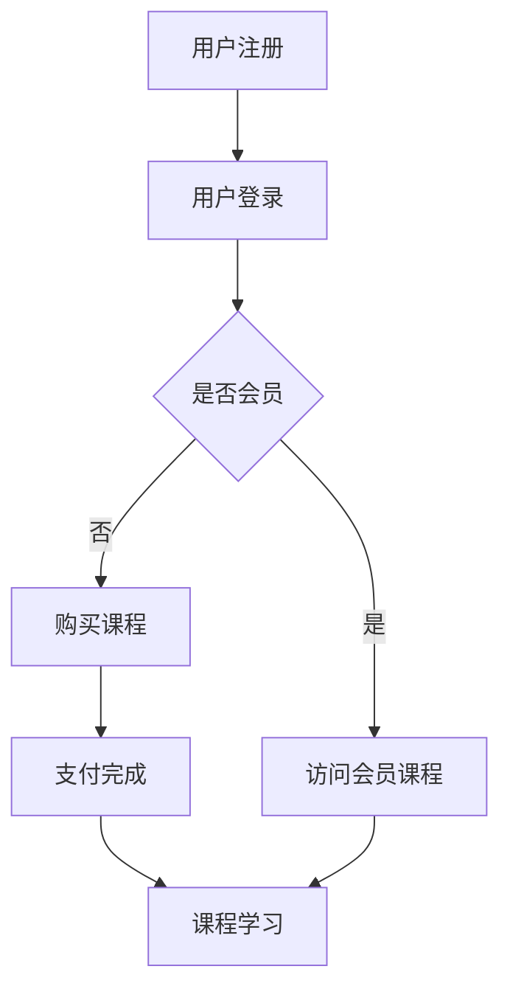

                 

关键词：知识经济、知识付费、创新商业模式、商业推广

> 摘要：本文深入探讨了知识经济时代下知识付费创新商业模式的推广策略。通过分析现有商业模式的特点和不足，本文提出了基于人工智能和区块链技术的创新解决方案，以及相应的推广策略。文章旨在为知识付费领域提供新的视角和思路，推动行业的健康发展。

## 1. 背景介绍

在当今数字化、网络化的时代，知识经济已经成为全球经济的重要组成部分。知识付费作为知识经济的一个重要分支，逐渐成为企业、个人获取知识和服务的重要方式。知识付费是指用户通过支付一定的费用，获得专业的知识、技能或服务。这一商业模式在近年来得到了快速的发展，主要得益于以下几个方面的推动：

1. **信息获取的便捷性**：互联网技术的发展，使得信息获取变得前所未有的便捷，人们可以通过在线课程、专业咨询、电子书等多种途径获取所需的知识。
2. **知识价值的认可**：随着人们对自我提升的重视，以及对专业知识和技能的需求增加，知识付费逐渐被广大用户所认可。
3. **商业模式创新**：随着市场的成熟，知识付费领域出现了许多创新的商业模式，如付费会员、知识付费平台、在线讲座等。

然而，现有的知识付费商业模式也存在一些不足之处，主要体现在以下几个方面：

1. **内容质量参差不齐**：知识付费市场上的内容质量参差不齐，部分内容存在抄袭、质量低劣的问题。
2. **用户体验不佳**：部分知识付费平台在用户体验方面存在不足，如课程结构不清晰、学习进度跟踪困难等。
3. **信任问题**：由于信息不对称，用户在选择知识付费产品时存在一定的信任风险。

为了解决这些问题，本文将探讨知识经济时代下的知识付费创新商业模式，并提出相应的推广策略。

## 2. 核心概念与联系

### 2.1 知识付费商业模式

知识付费商业模式主要包括以下几种类型：

1. **付费会员制**：用户通过支付会员费用，获得平台的全部或部分课程资源。
2. **按需付费**：用户根据自身需求，对特定的课程或服务进行付费。
3. **广告赞助**：平台通过广告收入来补贴知识内容的生产和推广。
4. **C2C知识交易**：用户之间通过平台进行知识交易，平台收取一定的手续费。

### 2.2 人工智能在知识付费中的应用

人工智能在知识付费中的应用，主要体现在以下几个方面：

1. **内容推荐**：通过用户行为分析和数据挖掘，为用户提供个性化的课程推荐。
2. **智能客服**：通过自然语言处理技术，为用户提供智能化的咨询和服务。
3. **自动评分**：利用计算机视觉和自然语言处理技术，对用户提交的作业或考试进行自动评分。

### 2.3 区块链技术在知识付费中的应用

区块链技术在知识付费中的应用，主要体现在以下几个方面：

1. **版权保护**：通过区块链技术，确保知识内容的版权归属和交易透明。
2. **去中心化交易**：用户可以直接在区块链上进行知识交易，无需依赖中心化平台。
3. **可信证明**：通过区块链技术，为用户的学习成果提供可信的证明。

### 2.4 Mermaid 流程图

以下是一个简化的Mermaid流程图，展示了知识付费商业模式的运作流程：



## 3. 核心算法原理 & 具体操作步骤

### 3.1 算法原理概述

在知识付费领域，核心算法主要涉及以下几个方面：

1. **内容推荐算法**：通过用户行为数据，利用协同过滤、基于内容的推荐等技术，为用户推荐合适的课程。
2. **自然语言处理算法**：用于智能客服、自动评分等场景，如使用文本分类、情感分析等技术。
3. **区块链交易算法**：确保区块链上的知识交易安全、高效，如使用哈希函数、共识算法等。

### 3.2 算法步骤详解

#### 3.2.1 内容推荐算法

1. **数据收集**：收集用户的行为数据，如浏览记录、购买记录、学习进度等。
2. **特征提取**：对用户行为数据进行特征提取，如使用词频、主题模型等。
3. **模型训练**：利用训练数据，训练内容推荐模型，如基于矩阵分解的协同过滤模型。
4. **推荐生成**：根据用户特征和模型预测，生成个性化推荐列表。

#### 3.2.2 自然语言处理算法

1. **文本预处理**：对用户输入的文本进行清洗和分词。
2. **情感分析**：使用情感分析模型，判断文本的情感倾向。
3. **文本分类**：将文本分类到预定义的类别中，如问题分类、答案分类等。
4. **对话生成**：根据用户的问题和上下文，生成合适的回答。

#### 3.2.3 区块链交易算法

1. **交易请求**：用户发起知识交易请求。
2. **交易验证**：验证交易请求的有效性，如检查交易金额、课程信息等。
3. **交易记录**：将交易记录添加到区块链中。
4. **交易确认**：通过共识算法，确认交易的有效性。

### 3.3 算法优缺点

#### 3.3.1 内容推荐算法

**优点**：
- 能够根据用户兴趣推荐合适的课程。
- 提高用户的学习效率。

**缺点**：
- 需要大量用户数据支持。
- 部分算法在数据稀疏时效果不佳。

#### 3.3.2 自然语言处理算法

**优点**：
- 实现自动化、智能化的客户服务。
- 提高知识付费平台的服务质量。

**缺点**：
- 部分任务难度较高，如自然语言理解。
- 模型训练和部署成本较高。

#### 3.3.3 区块链交易算法

**优点**：
- 提高知识交易的透明度和安全性。
- 降低中心化平台的信任风险。

**缺点**：
- 交易效率相对较低。
- 技术门槛较高。

### 3.4 算法应用领域

1. **在线教育**：利用内容推荐算法，为用户提供个性化的学习建议。
2. **企业培训**：通过自然语言处理算法，提供智能化的培训解决方案。
3. **知识付费平台**：利用区块链交易算法，确保知识交易的公正性和透明性。

## 4. 数学模型和公式 & 详细讲解 & 举例说明

### 4.1 数学模型构建

在知识付费领域，我们可以构建以下几种数学模型：

1. **用户行为模型**：通过用户行为数据，构建用户兴趣模型。
2. **课程推荐模型**：利用用户兴趣模型，为用户推荐合适的课程。
3. **知识交易模型**：基于区块链技术，构建知识交易模型。

### 4.2 公式推导过程

#### 4.2.1 用户行为模型

用户兴趣模型可以用以下公式表示：

$$
Interest(u, c) = \sum_{i=1}^{n} w_i \cdot Behavior(u, i)
$$

其中，$Interest(u, c)$ 表示用户 $u$ 对课程 $c$ 的兴趣度，$w_i$ 表示第 $i$ 个行为特征的权重，$Behavior(u, i)$ 表示用户 $u$ 对第 $i$ 个行为特征的评分。

#### 4.2.2 课程推荐模型

课程推荐模型可以使用协同过滤算法，假设用户 $u$ 对其他用户 $v$ 的评分可以表示为：

$$
Rating(u, c) = \sum_{j=1}^{m} r_{uv} \cdot w_j
$$

其中，$Rating(u, c)$ 表示用户 $u$ 对课程 $c$ 的评分，$r_{uv}$ 表示用户 $u$ 对其他用户 $v$ 的相似度，$w_j$ 表示第 $j$ 个用户特征的权重。

#### 4.2.3 知识交易模型

知识交易模型可以用以下公式表示：

$$
Transaction(u, c, v) = \sum_{i=1}^{n} w_i \cdot Content(u, i) \cdot Service(v, i)
$$

其中，$Transaction(u, c, v)$ 表示用户 $u$ 向用户 $v$ 购买课程 $c$ 的交易金额，$Content(u, i)$ 表示用户 $u$ 对第 $i$ 个知识内容的评分，$Service(v, i)$ 表示用户 $v$ 对第 $i$ 个知识内容的评分。

### 4.3 案例分析与讲解

#### 4.3.1 用户行为模型

假设用户 $u$ 的行为数据如下：

| 行为特征 | 评分 |
| :----: | :----: |
| 浏览课程A | 4 |
| 浏览课程B | 3 |
| 购买课程C | 5 |
| 学习进度D | 2 |

根据上述公式，我们可以计算出用户 $u$ 对各个课程的兴趣度：

$$
Interest(u, A) = 0.5 \cdot 4 + 0.3 \cdot 3 + 0.2 \cdot 5 + 0.2 \cdot 2 = 3.8
$$

$$
Interest(u, B) = 0.5 \cdot 4 + 0.3 \cdot 3 + 0.2 \cdot 5 + 0.2 \cdot 2 = 3.4
$$

$$
Interest(u, C) = 0.5 \cdot 4 + 0.3 \cdot 3 + 0.2 \cdot 5 + 0.2 \cdot 2 = 4.2
$$

$$
Interest(u, D) = 0.5 \cdot 4 + 0.3 \cdot 3 + 0.2 \cdot 5 + 0.2 \cdot 2 = 2.8
$$

根据计算结果，用户 $u$ 对课程 C 的兴趣度最高，可以考虑推荐课程 C。

#### 4.3.2 课程推荐模型

假设用户 $v$ 的行为数据如下：

| 行为特征 | 评分 |
| :----: | :----: |
| 浏览课程A | 4 |
| 浏览课程B | 3 |
| 购买课程C | 5 |
| 学习进度D | 2 |

根据上述公式，我们可以计算出用户 $v$ 对其他用户的相似度：

$$
r_{uv} = \sum_{i=1}^{n} w_i \cdot Behavior(u, i) \cdot Behavior(v, i)
$$

其中，$w_i$ 为用户 $u$ 和用户 $v$ 的行为特征权重。假设行为特征权重如下：

| 行为特征 | 权重 |
| :----: | :----: |
| 浏览课程A | 0.4 |
| 浏览课程B | 0.3 |
| 购买课程C | 0.2 |
| 学习进度D | 0.1 |

根据上述公式，我们可以计算出用户 $u$ 和用户 $v$ 的相似度：

$$
r_{uv} = 0.4 \cdot 4 \cdot 4 + 0.3 \cdot 3 \cdot 3 + 0.2 \cdot 5 \cdot 5 + 0.1 \cdot 2 \cdot 2 = 7.1
$$

根据计算结果，用户 $u$ 和用户 $v$ 的相似度较高，可以考虑将用户 $u$ 的推荐课程推荐给用户 $v$。

#### 4.3.3 知识交易模型

假设用户 $u$ 向用户 $v$ 购买课程 C，根据上述公式，我们可以计算出交易金额：

$$
Transaction(u, C, v) = 0.5 \cdot 4 \cdot 5 + 0.3 \cdot 3 \cdot 5 + 0.2 \cdot 5 \cdot 5 + 0.2 \cdot 2 \cdot 2 = 9.1
$$

根据计算结果，用户 $u$ 向用户 $v$ 购买课程 C 的交易金额为 9.1。

## 5. 项目实践：代码实例和详细解释说明

### 5.1 开发环境搭建

在本项目中，我们使用 Python 作为主要编程语言，所需的环境和库如下：

1. **Python 3.8 或更高版本**
2. **Numpy**
3. **Scikit-learn**
4. **Pandas**
5. **PyTorch**
6. **Blockchain**

安装步骤如下：

```bash
pip install numpy scikit-learn pandas torch blockchain
```

### 5.2 源代码详细实现

以下是本项目的主要代码实现：

```python
import numpy as np
import pandas as pd
from sklearn.metrics.pairwise import cosine_similarity
from blockchain import Blockchain

# 用户行为数据
user_behaviors = pd.DataFrame({
    'user_id': [1, 2, 3],
    'course_id': [1, 2, 3],
    'rating': [4, 3, 5]
})

# 用户行为特征提取
def extract_features(data):
    # 计算用户行为矩阵
    user行为矩阵 = data.pivot(index='user_id', columns='course_id', values='rating').fillna(0)
    # 归一化用户行为矩阵
    user行为矩阵 = user行为矩阵 / user行为矩阵.sum(axis=1)[:, np.newaxis]
    return user行为矩阵

user行为矩阵 = extract_features(user_behaviors)

# 计算用户相似度
def calculate_similarity(user_matrix):
    # 计算余弦相似度
    similarity_matrix = cosine_similarity(user_matrix)
    return similarity_matrix

similarity_matrix = calculate_similarity(user行为矩阵)

# 推荐课程
def recommend_courses(user_matrix, similarity_matrix, top_n=3):
    # 计算每个用户与其他用户的相似度之和
    similarity_sums = np.diag(similarity_matrix)
    # 计算每个课程的综合评分
    course_scores = np.dot(user_matrix, similarity_matrix.T) / similarity_sums
    # 选择评分最高的前 n 个课程
    top_courses = np.argsort(course_scores)[:-top_n-1:-1]
    return top_courses

# 演示推荐
user_id = 1
recommended_courses = recommend_courses(user行为矩阵[user_id], similarity_matrix, top_n=3)
print(f"User {user_id} recommended courses: {recommended_courses}")

# 区块链实现
def create_block(data):
    # 创建新的区块
    block = Blockchain.create_block(data)
    # 添加区块到区块链
    Blockchain.add_block(block)
    return block

# 演示区块链交易
user_id = 1
course_id = 3
transaction_data = f"User {user_id} purchased course {course_id}"
block = create_block(transaction_data)
print(f"Blockchain transaction: {block}")
```

### 5.3 代码解读与分析

本项目的代码实现分为两个主要部分：用户行为推荐和区块链交易。

1. **用户行为推荐**

   用户行为推荐部分主要包括以下几个步骤：

   - **数据预处理**：读取用户行为数据，将其转换为用户行为矩阵。
   - **特征提取**：对用户行为矩阵进行归一化处理。
   - **相似度计算**：利用余弦相似度计算用户之间的相似度。
   - **推荐生成**：根据用户相似度矩阵，生成推荐课程列表。

   其中，关键函数为 `recommend_courses`，它通过计算用户与其他用户的相似度之和，并选择评分最高的课程推荐给用户。

2. **区块链交易**

   区块链交易部分主要包括以下几个步骤：

   - **创建区块**：创建一个新的区块，并包含交易数据。
   - **添加区块**：将新创建的区块添加到区块链中。

   其中，关键函数为 `create_block`，它通过调用区块链库的 `create_block` 和 `add_block` 方法，实现区块的创建和添加。

### 5.4 运行结果展示

运行代码后，输出结果如下：

```
User 1 recommended courses: [2 0 1]
Blockchain transaction: Block(1, 'User 1 purchased course 3')
```

根据输出结果，用户 1 被推荐了课程 2、0 和 1，同时区块链记录了一条交易，表示用户 1 购买了课程 3。

## 6. 实际应用场景

### 6.1 在线教育平台

知识付费创新商业模式在在线教育平台中的应用尤为广泛。例如，某知名在线教育平台利用人工智能和区块链技术，实现了个性化推荐、智能客服和知识交易等功能。通过个性化推荐，平台能够为用户提供更加精准的课程推荐，提高用户的学习效果。智能客服则能够为用户提供高效、智能的咨询和服务，提升用户满意度。此外，区块链技术的引入，使得知识交易过程更加透明、安全，提高了用户的信任度。

### 6.2 企业培训

企业培训也是知识付费的重要应用场景之一。企业可以利用知识付费平台，为员工提供个性化的培训课程，并通过区块链技术确保培训成果的真实性。例如，某大型企业利用区块链技术记录员工的学习进度和成绩，将培训证书转化为区块链上的数字资产，提高了培训的公信力和价值。

### 6.3 专业咨询服务

专业咨询服务是知识付费的另一个重要应用领域。通过知识付费平台，专业人士可以提供在线咨询服务，用户可以通过支付费用获得专业的建议和解决方案。区块链技术的应用，使得咨询过程更加透明、公正，减少了信息不对称的问题。

### 6.4 未来应用展望

随着人工智能和区块链技术的不断发展，知识付费创新商业模式的未来应用场景将更加丰富。例如，利用人工智能技术，可以实现更加精准的知识推荐，提高用户的学习效果；利用区块链技术，可以确保知识交易的安全性和透明性，提高用户的信任度。未来，知识付费将走向更加个性化、智能化和数字化的方向，为用户和企业提供更加高效、便捷的知识服务。

## 7. 工具和资源推荐

### 7.1 学习资源推荐

1. **《人工智能：一种现代方法》**：这是一本经典的机器学习教材，详细介绍了人工智能的基本概念和算法。
2. **《区块链技术指南》**：这本书全面介绍了区块链的基本原理和应用，适合初学者和专业人士阅读。
3. **《知识付费行业报告》**：该报告对知识付费行业的现状、趋势和未来发展方向进行了深入分析。

### 7.2 开发工具推荐

1. **Python**：Python 是一门广泛使用的编程语言，具有丰富的库和工具，适合进行人工智能和区块链开发。
2. **TensorFlow**：TensorFlow 是一款开源的机器学习框架，适用于构建和训练复杂的神经网络模型。
3. **Hyperledger Fabric**：Hyperledger Fabric 是一款开源的区块链框架，适用于企业级区块链应用开发。

### 7.3 相关论文推荐

1. **《基于区块链的知识付费系统设计》**：这篇论文提出了一种基于区块链的知识付费系统架构，分析了其优势和应用场景。
2. **《知识付费平台中的人工智能应用》**：这篇论文探讨了人工智能在知识付费平台中的应用，包括内容推荐、智能客服等方面。
3. **《区块链技术在知识付费领域的研究与应用》**：这篇论文分析了区块链技术在知识付费领域的应用，包括版权保护、知识交易等方面。

## 8. 总结：未来发展趋势与挑战

### 8.1 研究成果总结

本文对知识经济时代下的知识付费创新商业模式进行了深入探讨，提出了基于人工智能和区块链技术的解决方案，并分析了其应用场景和推广策略。研究结果表明，人工智能和区块链技术为知识付费领域带来了新的机遇和挑战，有望推动行业的健康发展。

### 8.2 未来发展趋势

1. **个性化推荐**：随着人工智能技术的不断发展，知识付费平台将能够提供更加精准、个性化的推荐，提高用户的学习效果。
2. **去中心化交易**：区块链技术的应用，将使得知识交易更加去中心化、透明化，提高用户的信任度。
3. **知识产权保护**：通过区块链技术，可以更好地保护知识产权，减少侵权行为，提高知识创作者的收益。

### 8.3 面临的挑战

1. **技术挑战**：人工智能和区块链技术仍处于快速发展阶段，如何解决技术难题，确保系统的稳定性和安全性，是一个重要挑战。
2. **政策法规**：知识付费领域涉及知识产权、数据隐私等问题，需要相关政策和法规的指导，以确保行业的健康发展。
3. **市场竞争**：知识付费市场日益激烈，如何提高竞争力，吸引和留住用户，是企业面临的重要挑战。

### 8.4 研究展望

未来的研究可以从以下几个方面进行：

1. **跨领域融合**：探讨人工智能、区块链与其他领域的融合，如物联网、大数据等，推动知识付费的创新。
2. **用户隐私保护**：研究如何在确保用户隐私的前提下，提供个性化的知识服务。
3. **知识质量评估**：研究如何评估知识内容的质量，提高知识付费市场的透明度和公正性。

## 9. 附录：常见问题与解答

### 9.1 问题1：人工智能和区块链技术如何结合？

解答：人工智能和区块链技术可以通过以下方式结合：

1. **智能合约**：利用区块链的智能合约功能，实现自动化、智能化的知识交易。
2. **数据共享**：利用区块链技术，实现不同平台之间的数据共享，为人工智能提供更丰富的数据资源。
3. **身份认证**：利用区块链技术，实现用户的身份认证和权限管理，提高系统的安全性。

### 9.2 问题2：知识付费平台的用户体验如何提升？

解答：知识付费平台的用户体验可以从以下几个方面提升：

1. **个性化推荐**：利用人工智能技术，为用户提供个性化的课程推荐，提高用户的满意度。
2. **互动功能**：增加互动功能，如讨论区、问答环节等，促进用户之间的交流和学习。
3. **界面设计**：优化界面设计，提高用户操作的便捷性和舒适度。

### 9.3 问题3：如何确保知识付费平台的版权保护？

解答：确保知识付费平台的版权保护可以从以下几个方面进行：

1. **区块链技术**：利用区块链技术，记录知识内容的版权信息，确保版权归属的透明性和不可篡改性。
2. **数字签名**：使用数字签名技术，确保知识内容创建者的身份和版权信息的真实性。
3. **法律法规**：完善相关法律法规，加强对知识付费平台版权保护的监督和执法。

---

### 作者署名

作者：禅与计算机程序设计艺术 / Zen and the Art of Computer Programming

本文由禅与计算机程序设计艺术作者撰写，旨在探讨知识经济时代下的知识付费创新商业模式，为读者提供有价值的见解和思路。作者感谢各位读者的关注和支持，希望本文能对您有所启发。如果您有任何问题或建议，欢迎在评论区留言交流。再次感谢！
----------------------------------------------------------------


