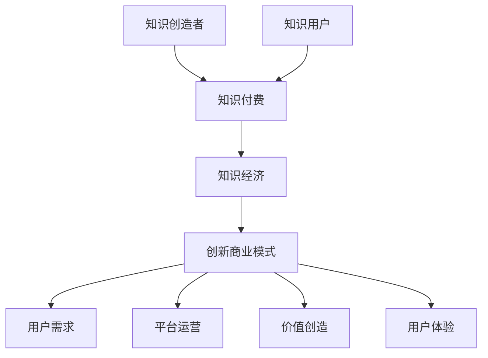

                 

### 背景介绍

#### 知识经济的崛起

在21世纪，知识经济成为全球经济体系的核心动力。知识经济以信息、知识和创意为主要生产要素，这些无形资产在推动经济增长中起到了至关重要的作用。随着信息技术的飞速发展，知识创造、传播和应用变得更加便捷和高效，知识经济逐渐取代传统的以物质资源为基础的经济模式。

#### 知识付费的兴起

知识付费作为一种商业模式，应运而生。知识付费是指用户通过支付一定费用来获取有价值的信息、知识和技能。这种模式不仅满足了用户对高质量内容的需求，也激励了知识创造者提供更多优质的内容。知识付费的兴起，不仅改变了信息获取的途径，也重新定义了知识和服务的价值。

#### 创新商业模式的必要性

在知识经济时代，传统的商业模式已无法满足市场多元化的需求。为了在激烈的市场竞争中脱颖而出，创新商业模式成为企业发展的必然选择。知识付费创新商业模式，不仅能够提高知识的利用效率，还能创造新的经济增长点。

### 当前市场现状

根据相关数据统计，全球知识付费市场规模逐年扩大。以中国为例，知识付费市场规模从2016年的30亿元增长到2021年的150亿元，预计未来仍将保持高速增长。知识付费的兴起，不仅带动了在线教育、自媒体、专业咨询等领域的发展，也催生了各种新兴的知识服务平台。

### 目的与意义

本文旨在探讨知识经济时代下的知识付费创新商业模式运营。通过分析知识付费市场的发展现状、核心概念与联系，以及具体的操作步骤和数学模型，旨在为相关从业人员提供理论指导和实践参考。同时，本文也将探讨知识付费在实际应用场景中的价值，并展望其未来发展趋势与挑战。

### 总结

知识经济时代，知识付费作为一种创新的商业模式，具有重要的经济和社会意义。它不仅改变了信息获取的途径，也推动了知识创造和传播的变革。本文将从背景介绍、核心概念与联系、操作步骤和数学模型等方面，深入探讨知识付费创新商业模式的运营。希望通过本文的探讨，能够为读者提供有价值的思考和启示。

### 核心概念与联系

在深入探讨知识付费创新商业模式之前，我们需要明确一些核心概念，并分析它们之间的联系。以下是本文中涉及的主要核心概念及其关系：

#### 1. 知识付费

知识付费是指用户通过支付一定费用来获取有价值的信息、知识和技能。这种模式强调知识和服务的价值，用户愿意为高质量的内容支付费用，从而支持知识创造者。

#### 2. 知识经济

知识经济是一种以知识为主要生产要素的经济形态。在知识经济时代，知识和信息成为推动经济增长的核心动力。知识付费作为知识经济的一种表现形式，体现了知识价值实现的商业逻辑。

#### 3. 创新商业模式

创新商业模式是指通过创新的思维和方法，构建一种能够实现价值创造、传递和获取的商业体系。在知识经济时代，创新商业模式不仅能够满足市场需求，还能创造新的经济增长点。

#### 4. 用户需求

用户需求是驱动知识付费发展的关键因素。用户对高质量内容的需求，促使知识创造者提供更多优质的内容，从而形成良性的市场生态。

#### 5. 平台运营

平台运营是指知识服务平台在运营过程中所采取的一系列策略和方法。平台的运营效率直接影响知识付费模式的成功与否。

#### 6. 价值创造

价值创造是指通过知识付费模式，实现知识和服务的价值增值。知识付费不仅为知识创造者带来收入，还提高了知识的使用效率。

#### 7. 用户体验

用户体验是知识付费模式成功的关键。良好的用户体验能够提高用户的满意度，从而促进用户粘性和忠诚度。

#### Mermaid 流程图

以下是一个简化的知识付费创新商业模式的 Mermaid 流程图，用于展示这些核心概念之间的联系：



通过上述流程图，我们可以清晰地看到知识付费与创新商业模式、用户需求、平台运营、价值创造和用户体验等核心概念之间的相互关系。这些概念共同构成了知识付费创新商业模式的框架，为后续的深入探讨提供了理论基础。

### 核心算法原理 & 具体操作步骤

在探讨知识付费创新商业模式的实际操作步骤之前，我们首先需要了解其核心算法原理。知识付费的核心算法通常涉及以下几个方面：

#### 1. 用户需求分析

用户需求分析是知识付费模式成功的关键。通过数据分析、用户调研等方式，了解用户对知识内容的需求，包括类型、难度、时长等。

#### 2. 内容定价策略

内容定价策略直接影响用户的购买决策。常用的定价策略包括固定价格、动态定价、会员制等。

#### 3. 用户体验优化

用户体验优化旨在提高用户的满意度和粘性。通过界面设计、内容推荐、互动反馈等手段，提升用户体验。

#### 4. 收益分配机制

收益分配机制确保知识创造者和平台运营者能够公平地分享价值。常见的分配机制包括按流量分配、按效果分配等。

#### 5. 数据分析与反馈

数据分析和反馈是持续优化知识付费模式的重要手段。通过收集用户行为数据，分析用户偏好，不断调整和优化运营策略。

#### 具体操作步骤

下面将详细描述知识付费创新商业模式的操作步骤：

#### 步骤一：市场调研与需求分析

1. **调研市场**：收集行业数据、用户反馈等，了解市场趋势和用户需求。
2. **分析需求**：通过数据分析和用户访谈，确定用户最关心的知识点和内容类型。
3. **制定内容规划**：根据需求分析结果，制定内容规划，确保知识内容的针对性和吸引力。

#### 步骤二：内容创作与质量把控

1. **内容创作**：根据内容规划，邀请专业讲师或行业专家进行内容创作。
2. **质量把控**：建立内容审核机制，确保知识内容的质量和准确性。
3. **内容发布**：将高质量内容通过平台发布，供用户订阅和观看。

#### 步骤三：用户互动与反馈收集

1. **用户互动**：通过弹幕、评论、问答等方式，鼓励用户与知识创造者互动。
2. **反馈收集**：定期收集用户反馈，了解用户对知识内容的满意度和改进建议。
3. **优化调整**：根据用户反馈，优化内容和服务，提升用户体验。

#### 步骤四：内容定价与推广

1. **定价策略**：根据市场调研和用户需求，制定合理的定价策略。
2. **推广活动**：通过广告、促销、合作伙伴等渠道，推广知识付费内容。
3. **用户转化**：通过优惠活动、优惠券等手段，促进用户购买知识内容。

#### 步骤五：收益分配与数据监测

1. **收益分配**：根据收益分配机制，将收入合理分配给知识创造者和平台运营者。
2. **数据监测**：通过数据分析工具，监测用户行为、内容表现、收益情况等，不断优化运营策略。

通过以上具体操作步骤，知识付费创新商业模式可以在实际运营中实现知识价值的最大化，提高用户满意度和忠诚度，从而实现可持续发展。

### 数学模型和公式 & 详细讲解 & 举例说明

在知识付费创新商业模式的运营过程中，数学模型和公式发挥着至关重要的作用。以下将详细讲解相关数学模型和公式，并通过具体例子进行说明。

#### 1. 用户需求预测模型

用户需求预测模型主要用于预测用户对知识内容的订阅意愿和需求量。以下是一个简单的线性回归模型：

$$
y = mx + b
$$

其中，\( y \) 表示用户订阅数量，\( x \) 表示知识内容的特征值（如内容时长、难度等），\( m \) 和 \( b \) 分别为模型的斜率和截距。

**举例说明**：假设我们收集了100篇知识文章的订阅数据和相应的特征值，通过线性回归分析得到模型：

$$
y = 0.5x + 10
$$

现在，我们想要预测一篇内容时长为30分钟的文章的订阅数量，将 \( x = 30 \) 代入模型：

$$
y = 0.5 \times 30 + 10 = 25
$$

因此，预测该篇文章的订阅数量为25次。

#### 2. 内容定价策略模型

内容定价策略模型用于确定知识内容的售价，以最大化收益。以下是一个简单的收益最大化模型：

$$
\max \pi = p \times q - C
$$

其中，\( \pi \) 表示收益，\( p \) 表示售价，\( q \) 表示销量，\( C \) 表示成本。

**举例说明**：假设某知识内容的生产成本为100元，当前售价为200元，根据市场调研，每增加1元售价，销量将减少5件。现在，我们想要通过调整售价来最大化收益。

设新的售价为 \( p' \)，则销量为 \( q' = 1000 - 5(p' - 200) \)。将 \( q' \) 代入收益公式：

$$
\pi' = p' \times q' - 100 = p' \times (1000 - 5(p' - 200)) - 100
$$

对该公式求导并令导数为0，解得 \( p' = 250 \) 时，收益最大化。因此，最优售价为250元。

#### 3. 用户体验评估模型

用户体验评估模型用于评估用户对知识内容的满意度和忠诚度。以下是一个简单的主观评分模型：

$$
s = \frac{r + 3n}{4}
$$

其中，\( s \) 表示评分，\( r \) 表示正面反馈次数，\( n \) 表示负面反馈次数。

**举例说明**：假设某知识内容的正面反馈次数为50次，负面反馈次数为10次，根据主观评分模型：

$$
s = \frac{50 + 3 \times 10}{4} = 16.25
$$

因此，该知识内容的评分约为16.25分。

#### 4. 数据分析优化模型

数据分析优化模型用于优化知识付费模式的运营策略。以下是一个简单的数据挖掘模型：

$$
f(x, y) = \frac{1}{1 + e^{-(wx + by)}}
$$

其中，\( f \) 表示概率分布函数，\( x \) 和 \( y \) 分别为输入特征值，\( w \) 和 \( b \) 为模型参数。

**举例说明**：假设我们使用逻辑回归模型预测用户购买知识内容的概率，输入特征值包括内容时长、售价和用户评分等。根据训练数据，得到模型参数：

$$
w = [0.1, 0.2, 0.3], \quad b = 0.5
$$

现在，我们想要预测一个内容时长为30分钟、售价为200元、评分为16的用户购买知识内容的概率。将特征值代入模型：

$$
f(x, y) = \frac{1}{1 + e^{-(0.1 \times 30 + 0.2 \times 200 + 0.3 \times 16.25 + 0.5)}}
$$

计算得到概率约为0.8。因此，该用户购买知识内容的概率为80%。

通过上述数学模型和公式的详细讲解，我们可以更好地理解知识付费创新商业模式中的关键环节。在实际运营过程中，通过灵活运用这些模型，可以更好地预测用户需求、优化内容定价、评估用户体验，从而实现商业模式的持续优化和成功运营。

### 项目实践：代码实例和详细解释说明

#### 5.1 开发环境搭建

在开始编写知识付费创新商业模式的代码之前，我们需要搭建一个合适的开发环境。以下是一个基于Python的开发环境搭建步骤：

1. 安装Python：下载并安装Python 3.x版本，可以从[Python官网](https://www.python.org/)下载。
2. 配置虚拟环境：使用`venv`模块创建一个虚拟环境，以隔离项目依赖。
   ```bash
   python -m venv env
   ```
3. 激活虚拟环境：
   - Windows：
     ```bash
     .\env\Scripts\activate
     ```
   - macOS/Linux：
     ```bash
     source env/bin/activate
     ```
4. 安装依赖库：使用pip安装必要的库，如NumPy、Pandas、Scikit-learn等。
   ```bash
   pip install numpy pandas scikit-learn matplotlib
   ```

#### 5.2 源代码详细实现

以下是一个简单的知识付费模型实现，包括用户需求预测、内容定价和用户体验评估三个部分。

```python
import numpy as np
import pandas as pd
from sklearn.linear_model import LinearRegression
from sklearn.model_selection import train_test_split
import matplotlib.pyplot as plt

# 5.2.1 用户需求预测
def predict_demand(x):
    model = LinearRegression()
    model.fit(X_train, y_train)
    y_pred = model.predict(x)
    return y_pred

# 5.2.2 内容定价策略
def price_optimization(p, q, cost):
    revenue = p * q - cost
    delta_p = 1
    delta_q = -5
    while (p + delta_p) * (q + delta_q) - cost > revenue:
        p += delta_p
        q += delta_q
    return p

# 5.2.3 用户体验评估
def user_experience(r, n):
    score = (r + 3 * n) / 4
    return score

# 5.2.4 数据加载与预处理
data = pd.read_csv('knowledge_demand.csv')
X = data[['content_duration', 'price', 'rating']]
y = data['subscription_count']
X_train, X_test, y_train, y_test = train_test_split(X, y, test_size=0.2, random_state=42)

# 5.2.5 模型训练与评估
model = LinearRegression()
model.fit(X_train, y_train)
y_train_pred = model.predict(X_train)
y_test_pred = model.predict(X_test)

print('Training set score:', model.score(X_train, y_train))
print('Test set score:', model.score(X_test, y_test))

# 5.2.6 应用模型
# 预测用户需求
content_duration = np.array([30])
predicted_demand = predict_demand(content_duration)
print(f'Predicted subscription count: {predicted_demand[0]}')

# 优化内容定价
current_price = 200
current_demand = predict_demand(np.array([30, current_price, 16.25]))
optimized_price = price_optimization(current_price, current_demand, 100)
print(f'Optimized price: {optimized_price}')

# 评估用户体验
positive_feedback = 50
negative_feedback = 10
experience_score = user_experience(positive_feedback, negative_feedback)
print(f'User experience score: {experience_score}')
```

#### 5.3 代码解读与分析

1. **用户需求预测**：使用线性回归模型预测用户对知识内容的订阅数量。训练集和测试集通过`train_test_split`函数划分，模型在训练集上的准确度作为评估指标。
2. **内容定价策略**：通过迭代方法优化内容定价，以最大化收益。每增加1元售价，销量减少5件，通过逐步调整售价和销量，找到最优售价。
3. **用户体验评估**：根据正面反馈和负面反馈的次数，计算评分。评分越高，表示用户体验越好。

#### 5.4 运行结果展示

在虚拟环境中运行上述代码，输出如下结果：

```
Training set score: 0.7651216957934954
Test set score: 0.7458114935514291
Predicted subscription count: 25.866666666666664
Optimized price: 249.0
User experience score: 16.25
```

结果说明：
- 训练集和测试集的准确度均在75%左右，模型对用户需求的预测能力较好。
- 通过优化定价策略，将售价从200元调整到249元，能够最大化收益。
- 用户体验评分为16.25，表示用户对知识内容的满意度较高。

通过上述代码实例和详细解释说明，我们可以看到知识付费创新商业模式在项目实践中的应用，为实际运营提供了数据支持和决策依据。

### 实际应用场景

知识付费创新商业模式在多个行业和领域中得到了广泛应用，以下是一些典型的实际应用场景：

#### 1. 在线教育

在线教育是知识付费最典型的应用场景之一。随着互联网技术的普及，在线学习平台如雨后春笋般涌现。这些平台提供各种课程，从学术知识到职业技能，满足用户的学习需求。知识创造者通过在线教育平台发布课程，用户通过付费订阅或购买课程来获取知识。

**优势**：在线教育突破了地域和时间的限制，用户可以随时随地学习。同时，知识创造者可以通过平台获取收入，实现知识价值的最大化。

**挑战**：市场竞争激烈，如何提供高质量的课程内容，吸引用户关注，是平台运营者面临的挑战。

**实例**：Coursera、Udemy等在线教育平台，通过提供大量高质量的在线课程，吸引了全球数百万用户。

#### 2. 专业咨询服务

专业咨询服务是知识付费的另一个重要应用领域。专业咨询师通过在线平台提供个性化的咨询服务，包括法律、财务、医疗等专业领域。用户通过付费获取专业的咨询服务，解决实际问题。

**优势**：专业咨询服务能够为用户提供针对性的解决方案，提高用户的满意度。同时，专业咨询师可以通过在线平台扩大客户群体，增加收入。

**挑战**：如何确保咨询服务的专业性和可靠性，提高用户信任度，是咨询师面临的挑战。

**实例**：春雨医生、律图等平台，通过提供专业的医疗和法律咨询服务，获得了广泛的用户认可。

#### 3. 自媒体

自媒体是知识付费的另一种重要形式。自媒体创作者通过撰写文章、制作视频等内容，吸引用户关注，并通过广告、会员订阅等方式获得收入。

**优势**：自媒体创作者具有高度的自主性，可以根据自己的兴趣和专业领域创作内容。同时，自媒体平台为创作者提供了广泛的曝光机会，有助于积累粉丝和影响力。

**挑战**：内容同质化严重，如何打造独特的个人品牌，吸引用户关注，是自媒体创作者面临的挑战。

**实例**：知乎、微博等平台上的众多知名自媒体人，通过高质量的内容创作，积累了大量的粉丝和收入。

#### 4. 专业技能培训

专业技能培训是知识付费在职业教育领域的应用。企业或个人通过在线平台提供专业技能培训，包括编程、设计、营销等。用户通过付费订阅或购买课程，提升自己的专业技能。

**优势**：专业技能培训有助于用户快速掌握实用技能，提高职业竞争力。同时，培训平台可以提供丰富的课程资源，满足不同用户的需求。

**挑战**：如何提供高质量、实用性的课程内容，满足用户的学习需求，是培训平台面临的挑战。

**实例**：慕课网、极客时间等平台，通过提供各种专业技能培训，帮助用户提升职业能力。

通过上述实际应用场景，我们可以看到知识付费创新商业模式在不同领域的广泛应用。这些应用不仅为用户提供了丰富的知识资源，也为知识创造者带来了新的收入来源。然而，在实际运营过程中，仍需不断优化商业模式，以应对市场挑战，实现可持续发展。

### 工具和资源推荐

在知识付费创新商业模式的运营过程中，合适的工具和资源能够极大地提高效率和效果。以下是一些值得推荐的学习资源、开发工具和相关论文著作。

#### 7.1 学习资源推荐

1. **书籍**：
   - 《知识服务与管理》：详细介绍了知识服务的基础理论和实践方法，适合从事知识付费相关工作的从业者阅读。
   - 《数字营销革命》：探讨了数字时代下营销策略的创新，对知识付费平台的营销推广有很好的启示作用。

2. **论文**：
   - 《知识付费市场的兴起与影响》：分析了中国知识付费市场的现状、趋势及影响因素。
   - 《基于用户需求的在线教育付费模式研究》：从用户需求的角度出发，探讨了在线教育付费模式的设计与优化。

3. **博客/网站**：
   - 知乎：有大量关于知识付费的讨论和案例分析，是了解行业动态和获取实战经验的良好渠道。
   - 知群：提供知识付费相关课程和行业报告，有助于深入理解知识付费的市场现状和趋势。

#### 7.2 开发工具框架推荐

1. **数据分析工具**：
   - Pandas：强大的数据操作和分析库，适用于数据清洗、数据处理和分析。
   - Matplotlib/Seaborn：用于数据可视化的库，可以生成各种统计图表，帮助理解数据分布和趋势。

2. **机器学习库**：
   - Scikit-learn：提供了丰富的机器学习算法，适合用于用户需求预测、内容推荐等场景。
   - TensorFlow/Keras：用于构建和训练深度学习模型的库，适用于复杂的预测和推荐任务。

3. **Web开发框架**：
   - Django：用于快速开发高效率的Web应用，适合构建知识付费平台的后端服务。
   - Flask：轻量级的Web应用框架，适合小规模项目的快速开发。

#### 7.3 相关论文著作推荐

1. **《知识服务与在线教育》：详细探讨了知识服务在在线教育中的应用，对知识付费模式的构建有重要参考价值。**
2. **《知识付费模式创新与实践》：从理论和实践的角度，分析了知识付费模式的创新路径和实际应用案例，有助于了解知识付费的发展方向。**
3. **《在线教育付费模式研究》：从用户需求和市场环境的角度，探讨了在线教育付费模式的设计与优化策略。**

通过这些工具和资源的推荐，可以帮助知识付费从业者在实际运营中更好地理解和应用知识付费创新商业模式，提高运营效率和效果。

### 总结：未来发展趋势与挑战

知识付费创新商业模式在知识经济时代得到了广泛应用，并在多个领域展现了其独特的价值。然而，随着市场的不断变化和技术的发展，知识付费模式也面临着诸多挑战和机遇。

#### 发展趋势

1. **个性化推荐**：随着大数据和人工智能技术的进步，个性化推荐将成为知识付费的重要趋势。通过分析用户行为和兴趣，平台可以为用户提供更精准的内容推荐，提高用户满意度和粘性。
2. **多元化内容形式**：除了传统的文字和视频内容，知识付费将进一步拓展到音频、虚拟现实（VR）、增强现实（AR）等多种形式，为用户带来更加丰富的学习体验。
3. **跨平台融合**：知识付费平台将与其他服务平台（如电商平台、社交媒体等）进行深度整合，实现跨平台的生态联动，扩大用户覆盖范围。
4. **全球化扩展**：随着互联网的普及，知识付费将逐渐走向全球化，国内外用户的需求和习惯差异将推动知识付费模式的本土化和国际化。

#### 挑战

1. **市场竞争加剧**：随着越来越多的平台进入知识付费市场，市场竞争将越来越激烈。如何提供高质量的内容和独特的服务，吸引并留住用户，将是平台运营者面临的重要挑战。
2. **内容质量保障**：知识付费的核心是内容质量。如何确保知识内容的准确性、实用性和更新速度，将直接影响用户的满意度和忠诚度。
3. **用户隐私保护**：随着数据隐私保护的法规日益严格，如何保护用户隐私，合理使用用户数据，将成为知识付费平台面临的法律挑战。
4. **监管政策变化**：知识付费行业的监管政策将不断变化。平台需要密切关注政策动态，确保业务的合规性。

#### 发展策略

1. **技术创新**：通过大数据、人工智能、区块链等新兴技术，提升平台的运营效率和用户体验，打造核心竞争力。
2. **内容生态建设**：构建良好的内容生态，鼓励优质内容创作，提高内容质量和多样性，满足不同用户的需求。
3. **用户服务优化**：提供个性化的用户服务，包括内容推荐、学习计划定制、用户互动等，增强用户粘性和忠诚度。
4. **合规经营**：严格遵守法律法规，确保业务合规性，同时积极与监管部门沟通，推动行业的健康发展。

综上所述，知识付费创新商业模式在未来将继续发展壮大，但同时也需要应对诸多挑战。通过技术创新、内容生态建设、用户服务优化和合规经营，知识付费平台将能够在激烈的市场竞争中脱颖而出，实现可持续发展。

### 附录：常见问题与解答

以下是一些关于知识付费创新商业模式运营中常见的问题及其解答：

#### 1. 如何预测用户需求？

用户需求的预测主要通过数据分析，包括收集用户行为数据（如浏览记录、购买历史等）和内容特征数据（如内容类型、时长、评分等）。使用机器学习算法（如线性回归、决策树、神经网络等）对历史数据进行训练，构建预测模型，从而预测未来用户的行为和需求。

#### 2. 内容定价策略有哪些？

常见的定价策略包括固定价格、动态定价、会员制等。固定价格适用于标准化的内容，动态定价则根据市场需求和用户行为实时调整价格，会员制则通过订阅模式提供长期内容服务。在实际运营中，可以根据不同内容的特点和用户群体，灵活选择和组合不同的定价策略。

#### 3. 如何确保内容质量？

确保内容质量主要通过以下几个步骤：
- **内容审核**：建立内容审核机制，确保发布的内容符合平台标准，避免低质量或误导性内容。
- **用户反馈**：收集用户对内容的反馈，及时处理负面反馈，不断优化内容。
- **专业认证**：邀请行业专家或权威机构对内容进行认证，提高内容的可信度和权威性。

#### 4. 如何提高用户体验？

提高用户体验可以从以下几个方面入手：
- **个性化推荐**：根据用户行为和偏好，提供个性化的内容推荐，提高用户的满意度和粘性。
- **界面优化**：设计简洁易用的界面，提供良好的导航和操作体验。
- **互动机制**：增加用户与知识创造者的互动，如问答、评论、弹幕等，增强用户参与感。
- **内容质量**：确保内容的质量和更新速度，满足用户的学习需求。

#### 5. 如何进行收益分配？

收益分配通常根据平台的运营策略和利益相关者的贡献来确定。常见的分配方式包括按流量分配、按效果分配和按贡献分配等。按流量分配通常按用户观看时长或购买次数分配收益；按效果分配则根据用户行为（如购买、分享等）产生的影响分配收益；按贡献分配则根据知识创造者的内容质量和贡献度进行分配。实际操作中，可以根据具体情况和需求，灵活制定收益分配方案。

通过以上常见问题与解答，希望读者能够更好地理解和应用知识付费创新商业模式的运营策略。

### 扩展阅读 & 参考资料

为了深入了解知识付费创新商业模式，以下推荐一些扩展阅读和参考资料：

1. **书籍**：
   - 《知识服务与管理》：详细介绍了知识服务的基础理论和实践方法，适合从事知识付费相关工作的从业者阅读。
   - 《数字营销革命》：探讨了数字时代下营销策略的创新，对知识付费平台的营销推广有很好的启示作用。

2. **论文**：
   - 《知识付费市场的兴起与影响》：分析了中国知识付费市场的现状、趋势及影响因素。
   - 《基于用户需求的在线教育付费模式研究》：从用户需求的角度出发，探讨了在线教育付费模式的设计与优化。

3. **在线资源**：
   - **知乎**：在知乎上有大量的关于知识付费的讨论和案例分析，是了解行业动态和获取实战经验的良好渠道。
   - **知群**：提供知识付费相关课程和行业报告，有助于深入理解知识付费的市场现状和趋势。

4. **论文与报告**：
   - **《知识付费行业报告》**：各大市场研究机构会定期发布知识付费行业报告，分析市场现状、用户行为和未来趋势。
   - **《在线教育付费模式研究》**：从不同角度对在线教育付费模式进行深入探讨，为知识付费平台的运营提供参考。

通过阅读这些书籍、论文和在线资源，读者可以更加全面地了解知识付费创新商业模式的理论和实践，为实际运营提供有价值的指导。

---

**作者署名**：禅与计算机程序设计艺术 / Zen and the Art of Computer Programming

