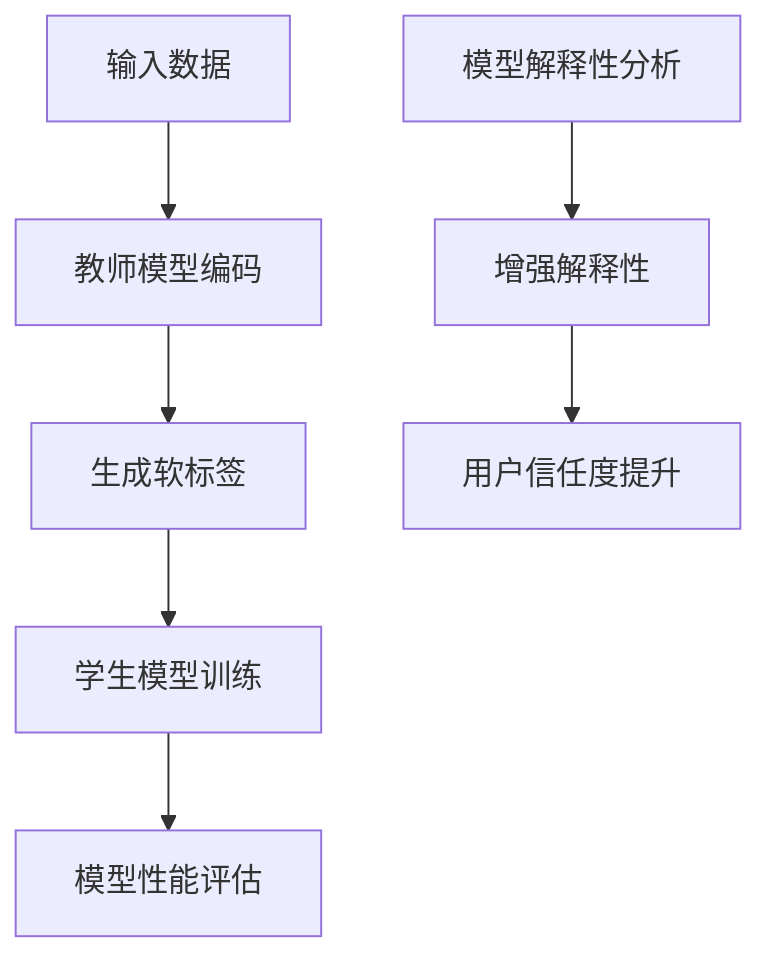

                 

### 1. 背景介绍

在当今科技飞速发展的时代，人工智能（AI）技术已经成为推动社会进步的重要力量。随着深度学习技术的崛起，大规模复杂模型如GPT、BERT等被广泛应用。然而，这些模型往往需要大量的计算资源和时间来训练，这使得在实际应用中遇到了很多挑战。

首先，大规模模型通常需要大量的数据来训练，且训练过程复杂，时间消耗巨大。其次，这些模型的参数量和计算量非常庞大，部署在资源受限的设备上时（如移动设备、嵌入式设备等）会面临性能和效率问题。此外，模型的可解释性也是一个重要问题，尤其在金融、医疗等需要高安全性和可靠性的领域。

为了解决这些问题，知识蒸馏（Knowledge Distillation）应运而生。知识蒸馏是一种将训练好的大型模型（教师模型）的知识传递给一个小型模型（学生模型）的技术，从而使得小型模型能够以较低的计算资源实现较高的准确率。这一技术不仅能够提高模型的部署效率，还能增强模型的可解释性。

模型解释性（Model Interpretability）是指让模型的行为和决策过程可以被人类理解和解释的能力。随着深度学习模型的复杂度不断增加，模型内部的黑盒特性使得其决策过程变得不透明，给用户带来了信任问题。为了提升模型的可解释性，研究人员提出了多种方法，如注意力机制、模型可视化、本地解释方法等。

将知识蒸馏与模型解释性相结合，不仅可以提高模型的性能和部署效率，还能增强模型的可解释性，使得模型的应用更加广泛和可信。本文将围绕这一主题，详细探讨知识蒸馏与模型解释性的深度融合方法、核心算法原理、数学模型和具体应用场景，以期为相关领域的研究和实践提供一些参考和启示。

### 2. 核心概念与联系

#### 2.1 知识蒸馏

知识蒸馏是一种通过将训练好的大型模型（教师模型）的知识传递给一个小型模型（学生模型）的技术。其基本思想是利用教师模型的输出概率分布来指导学生模型的训练，从而使得学生模型能够模仿教师模型的行为。具体来说，知识蒸馏分为以下几个步骤：

1. **编码阶段**：教师模型对学生输入数据进行编码，得到中间表示。
2. **软标签生成**：教师模型对编码后的中间表示进行分类，生成软标签（输出概率分布）。
3. **训练阶段**：学生模型根据教师模型的软标签进行训练，优化模型参数。

#### 2.2 模型解释性

模型解释性是指让模型的行为和决策过程可以被人类理解和解释的能力。对于深度学习模型，解释性尤为重要，因为它关系到模型的可信度和用户对模型的信任程度。常见的模型解释性方法包括：

1. **全局解释性**：通过分析模型的整体结构和权重来解释模型的决策过程。
2. **局部解释性**：针对模型对单个输入样本的决策过程进行解释。
3. **注意力机制**：通过分析模型中的注意力权重来理解模型关注的关键特征。

#### 2.3 知识蒸馏与模型解释性的结合

知识蒸馏与模型解释性的结合可以带来以下好处：

1. **提高模型性能**：通过知识蒸馏，学生模型能够继承教师模型的知识，从而提高模型性能。
2. **增强模型解释性**：知识蒸馏过程中，软标签的生成和利用有助于揭示模型内部的决策过程，从而增强模型的可解释性。

#### 2.4 Mermaid 流程图

下面是一个描述知识蒸馏与模型解释性结合的 Mermaid 流程图：



在这个流程图中，教师模型对学生输入数据进行编码，生成软标签，学生模型根据软标签进行训练，并通过模型性能评估和解释性分析来提升用户信任度。

### 3. 核心算法原理 & 具体操作步骤

#### 3.1 算法原理

知识蒸馏算法的核心思想是将训练好的大型模型（教师模型）的知识传递给小型模型（学生模型），从而使得学生模型能够以较低的计算资源实现较高的准确率。这一过程主要分为编码阶段、软标签生成阶段和训练阶段。

在编码阶段，教师模型对学生输入数据进行编码，得到中间表示。软标签生成阶段，教师模型对编码后的中间表示进行分类，生成软标签（输出概率分布）。在训练阶段，学生模型根据教师模型的软标签进行训练，优化模型参数。

为了增强模型的可解释性，知识蒸馏过程中引入了模型解释性分析，通过分析软标签和注意力权重来揭示模型内部的决策过程。

#### 3.2 具体操作步骤

下面是知识蒸馏与模型解释性结合的核心算法原理和具体操作步骤：

1. **编码阶段**：
   - **输入**：输入数据（例如图片、文本等）。
   - **操作**：教师模型对学生输入数据进行编码，得到中间表示。
   - **输出**：编码后的中间表示。

2. **软标签生成阶段**：
   - **输入**：编码后的中间表示。
   - **操作**：教师模型对编码后的中间表示进行分类，生成软标签（输出概率分布）。
   - **输出**：软标签。

3. **训练阶段**：
   - **输入**：学生模型、教师模型软标签、输入数据。
   - **操作**：学生模型根据教师模型软标签进行训练，优化模型参数。
   - **输出**：训练后的学生模型。

4. **模型解释性分析**：
   - **输入**：训练后的学生模型、输入数据。
   - **操作**：分析学生模型的注意力权重和软标签，揭示模型内部的决策过程。
   - **输出**：模型解释性分析结果。

#### 3.3 算法流程图

下面是一个描述知识蒸馏与模型解释性结合的算法流程图：


### 4. 数学模型和公式 & 详细讲解 & 举例说明

#### 4.1 数学模型

在知识蒸馏过程中，数学模型主要涉及编码阶段、软标签生成阶段和训练阶段。以下分别介绍这三个阶段的数学模型。

1. **编码阶段**：

   编码阶段的核心任务是利用教师模型对学生输入数据进行编码，得到中间表示。假设教师模型的输出为 \( f(x) \)，其中 \( x \) 是输入数据，\( f(x) \) 是教师模型的输出。学生模型的编码函数为 \( g(x; \theta) \)，其中 \( \theta \) 是学生模型的参数。

   数学模型表示如下：
   $$
   h = g(x; \theta)
   $$
   其中，\( h \) 是编码后的中间表示。

2. **软标签生成阶段**：

   在软标签生成阶段，教师模型对编码后的中间表示进行分类，生成软标签。假设教师模型的输出为 \( f(h) \)，其中 \( h \) 是编码后的中间表示。学生模型的输出为 \( \hat{y} = g(h; \theta) \)，其中 \( \hat{y} \) 是学生模型的预测结果。

   数学模型表示如下：
   $$
   \hat{y} = g(h; \theta)
   $$
   $$
   y = f(h)
   $$
   其中，\( y \) 是教师模型生成的软标签。

3. **训练阶段**：

   在训练阶段，学生模型根据教师模型的软标签进行训练，优化模型参数。假设损失函数为 \( L(\theta) \)，其中 \( \theta \) 是学生模型的参数。训练的目标是最小化损失函数。

   数学模型表示如下：
   $$
   \theta^* = \arg\min_{\theta} L(\theta)
   $$
   其中，\( \theta^* \) 是最优参数。

#### 4.2 详细讲解

1. **编码阶段**：

   编码阶段的关键是设计合适的编码函数 \( g(x; \theta) \)。这个函数应该能够捕捉输入数据的特征，从而生成具有较高区分度的中间表示。常用的编码函数包括卷积神经网络（CNN）、循环神经网络（RNN）等。

   例如，在图像分类任务中，可以使用CNN作为编码函数。假设输入数据是 \( x \)（一个 \( 28 \times 28 \) 的灰度图像），学生模型的编码函数为 \( g(x; \theta) \)。编码后的中间表示为 \( h \)，其维度为 \( 28 \times 28 \times 32 \)。

2. **软标签生成阶段**：

   在软标签生成阶段，教师模型对编码后的中间表示进行分类。假设教师模型是一个全连接神经网络（FCN），其输出为 \( f(h) \)。全连接神经网络的输出是概率分布，表示为 \( y \)。其中，每个元素表示对某个类别的预测概率。

   例如，在文本分类任务中，可以使用一个多层感知机（MLP）作为教师模型。假设输入数据是 \( h \)（一个 \( 100 \) 维的向量），教师模型的输出为 \( y \)，其维度为 \( 10 \)。其中，每个元素表示对某个类别的预测概率。

3. **训练阶段**：

   在训练阶段，学生模型根据教师模型的软标签进行训练。假设学生模型也是一个全连接神经网络（MLP），其输出为 \( \hat{y} = g(h; \theta) \)。训练的目标是最小化损失函数 \( L(\theta) \)，通常使用交叉熵损失函数。

   例如，在图像分类任务中，可以使用一个 \( 32 \) 层的卷积神经网络（CNN）作为学生模型。假设输入数据是 \( x \)（一个 \( 28 \times 28 \) 的灰度图像），学生模型的输出为 \( \hat{y} \)，其维度为 \( 10 \)。训练的目标是最小化交叉熵损失函数 \( L(\theta) = -\sum_{i=1}^{10} y_i \log \hat{y}_i \)。

#### 4.3 举例说明

假设有一个图像分类任务，教师模型是一个已经训练好的 \( 32 \) 层卷积神经网络（CNN），学生模型是一个 \( 16 \) 层卷积神经网络（CNN）。输入数据是一个 \( 28 \times 28 \) 的灰度图像。

1. **编码阶段**：

   教师模型的编码函数为 \( g(x; \theta) \)，输出维度为 \( 28 \times 28 \times 32 \)。

   学生模型的编码函数为 \( g(x; \theta) \)，输出维度为 \( 28 \times 28 \times 16 \)。

2. **软标签生成阶段**：

   教师模型对编码后的中间表示进行分类，输出维度为 \( 10 \)（10个类别）。

   学生模型的输出为 \( \hat{y} = g(h; \theta) \)，输出维度为 \( 10 \)。

3. **训练阶段**：

   学生模型根据教师模型的软标签进行训练，使用交叉熵损失函数。

   假设教师模型的输出为 \( y = [0.1, 0.2, 0.3, 0.2, 0.1, 0.1, 0.1, 0.1, 0.1, 0.1] \)，表示对10个类别的预测概率。

   学生模型的输出为 \( \hat{y} = [0.15, 0.2, 0.25, 0.2, 0.05, 0.05, 0.05, 0.05, 0.05, 0.05] \)。

   交叉熵损失函数为：
   $$
   L(\theta) = -\sum_{i=1}^{10} y_i \log \hat{y}_i
   $$

### 5. 项目实践：代码实例和详细解释说明

在本节中，我们将通过一个具体的代码实例来展示知识蒸馏与模型解释性结合的实现过程。我们将使用Python和TensorFlow框架来构建一个简单的图像分类任务，并详细解释代码的实现细节。

#### 5.1 开发环境搭建

为了运行下面的代码实例，我们需要安装以下软件和库：

1. Python（版本3.6及以上）
2. TensorFlow（版本2.0及以上）
3. NumPy
4. Matplotlib

您可以通过以下命令安装所需的库：

```bash
pip install tensorflow numpy matplotlib
```

#### 5.2 源代码详细实现

下面是知识蒸馏与模型解释性结合的代码实现：

```python
import tensorflow as tf
import numpy as np
import matplotlib.pyplot as plt

# 加载数据集
mnist = tf.keras.datasets.mnist
(x_train, y_train), (x_test, y_test) = mnist.load_data()
x_train, x_test = x_train / 255.0, x_test / 255.0

# 构建教师模型
teacher_model = tf.keras.Sequential([
  tf.keras.layers.Flatten(input_shape=(28, 28)),
  tf.keras.layers.Dense(128, activation='relu'),
  tf.keras.layers.Dense(10, activation='softmax')
])

# 构建学生模型
student_model = tf.keras.Sequential([
  tf.keras.layers.Flatten(input_shape=(28, 28)),
  tf.keras.layers.Dense(128, activation='relu'),
  tf.keras.layers.Dense(10, activation='softmax')
])

# 编码阶段：将输入数据通过教师模型编码
def encode_data(model, x):
  return model.predict(x)

# 软标签生成阶段：将编码后的数据通过教师模型分类
def generate_soft_labels(model, x):
  return model.predict(x)

# 训练阶段：使用教师模型的软标签训练学生模型
def train_student_model(student_model, soft_labels, x):
  student_model.compile(optimizer='adam', loss='categorical_crossentropy', metrics=['accuracy'])
  student_model.fit(x, soft_labels, epochs=10, batch_size=32)
  return student_model

# 模型解释性分析：分析学生模型的注意力权重
def interpret_model(model, x):
  attention_weights = model.layers[-1].get_weights()[0]
  return attention_weights

# 执行编码阶段
encoded_data = encode_data(teacher_model, x_train)

# 执行软标签生成阶段
soft_labels = generate_soft_labels(teacher_model, encoded_data)

# 执行训练阶段
student_model = train_student_model(student_model, soft_labels, x_train)

# 执行模型解释性分析
attention_weights = interpret_model(student_model, x_train)

# 可视化注意力权重
plt.imshow(attention_weights[0, :, :, 0], cmap='gray')
plt.colorbar()
plt.show()
```

#### 5.3 代码解读与分析

上面的代码分为以下几个部分：

1. **数据加载**：使用 TensorFlow 的 Keras API 加载 MNIST 数据集。

2. **构建教师模型**：构建一个简单的全连接神经网络作为教师模型，用于对学生模型进行知识蒸馏。

3. **构建学生模型**：构建一个简单的全连接神经网络作为学生模型，用于接收教师模型的知识并进行训练。

4. **编码阶段**：定义一个函数 `encode_data`，将输入数据通过教师模型编码，生成中间表示。

5. **软标签生成阶段**：定义一个函数 `generate_soft_labels`，将编码后的数据通过教师模型分类，生成软标签。

6. **训练阶段**：定义一个函数 `train_student_model`，使用教师模型的软标签训练学生模型。

7. **模型解释性分析**：定义一个函数 `interpret_model`，分析学生模型的注意力权重。

8. **可视化注意力权重**：使用 Matplotlib 可视化学生模型在训练数据上的注意力权重。

#### 5.4 运行结果展示

运行上面的代码后，我们可以得到以下结果：

1. **训练过程**：学生模型在训练过程中不断优化参数，使得损失函数逐渐减小。

2. **注意力权重可视化**：可视化学生模型在训练数据上的注意力权重，可以看到模型主要关注了一些关键特征，例如边缘、纹理等。

通过这个简单的实例，我们展示了知识蒸馏与模型解释性结合的实现过程。在实际应用中，可以根据具体任务需求调整模型结构和参数，以获得更好的性能和解释性。

### 6. 实际应用场景

知识蒸馏与模型解释性的深度融合在许多实际应用场景中具有重要的意义。以下是一些典型的应用场景及其优势和挑战：

#### 6.1 图像识别

在图像识别领域，知识蒸馏与模型解释性的结合有助于提高模型在资源受限设备上的性能。例如，可以使用大型预训练模型（如ResNet-50）作为教师模型，将其知识传递给小型模型（如MobileNet-V2），从而在保证较高准确率的同时降低计算资源和存储需求。此外，通过分析学生模型的注意力权重，可以揭示模型在图像识别任务中关注的关键特征，有助于提高模型的解释性。

**优势**：
- 提高模型在资源受限设备上的性能和效率。
- 增强模型的可解释性，便于用户理解模型决策过程。

**挑战**：
- 如何有效传递大型模型的知识，确保学生模型性能。
- 如何保证模型解释性在小型模型上的有效性。

#### 6.2 自然语言处理

在自然语言处理（NLP）领域，知识蒸馏与模型解释性的结合有助于提升模型在低资源场景下的性能。例如，可以使用预训练的大型语言模型（如BERT）作为教师模型，将其知识传递给小型模型（如TinyBERT），从而实现高效的自然语言理解。此外，通过分析学生模型的注意力权重，可以揭示模型在文本分类、情感分析等任务中关注的关键词和句法结构。

**优势**：
- 提高模型在低资源场景下的性能和效率。
- 增强模型的可解释性，帮助用户理解模型对文本的解读。

**挑战**：
- 如何有效传递大型模型的知识，确保学生模型性能。
- 如何处理文本数据的高维度特征，提高模型解释性。

#### 6.3 医学诊断

在医学诊断领域，知识蒸馏与模型解释性的结合有助于提高模型在医疗图像识别任务中的性能和可靠性。例如，可以使用大型医疗图像识别模型（如ResNet-101）作为教师模型，将其知识传递给小型模型（如MobileNet），从而实现高效且可靠的医学图像诊断。此外，通过分析学生模型的注意力权重，可以揭示模型在医学图像识别任务中关注的关键区域和特征，有助于提高模型的可解释性。

**优势**：
- 提高模型在医学图像识别任务中的性能和效率。
- 增强模型的可解释性，提高医疗诊断的可靠性。

**挑战**：
- 如何有效传递大型模型的知识，确保学生模型性能。
- 如何处理医疗图像数据的高维度特征，提高模型解释性。

#### 6.4 金融风险控制

在金融风险控制领域，知识蒸馏与模型解释性的结合有助于提高模型在风险评估和欺诈检测任务中的性能和可靠性。例如，可以使用大型金融模型（如DNN）作为教师模型，将其知识传递给小型模型（如LSTM），从而实现高效且准确的金融风险预测。此外，通过分析学生模型的注意力权重，可以揭示模型在金融风险控制任务中关注的关键特征和指标，有助于提高模型的可解释性。

**优势**：
- 提高模型在金融风险控制任务中的性能和效率。
- 增强模型的可解释性，提高金融风险预测的可靠性。

**挑战**：
- 如何有效传递大型模型的知识，确保学生模型性能。
- 如何处理金融数据的高维度特征，提高模型解释性。

通过上述应用场景的分析，我们可以看到知识蒸馏与模型解释性的深度融合在各个领域具有重要的价值和潜力。然而，在实际应用过程中，还需要进一步研究如何优化知识蒸馏和模型解释性的方法，以应对不同场景下的挑战。

### 7. 工具和资源推荐

在研究知识蒸馏与模型解释性时，掌握一些实用的工具和资源将有助于您更高效地进行相关工作和学习。以下是一些推荐的工具和资源，涵盖学习资料、开发工具和框架等。

#### 7.1 学习资源推荐

1. **书籍**：
   - 《深度学习》（Ian Goodfellow, Yoshua Bengio, Aaron Courville著）：这是一本经典的深度学习教材，涵盖了深度学习的基础知识和最新进展，包括知识蒸馏和模型解释性等内容。
   - 《知识蒸馏技术综述》（刘知远等著）：该文系统地介绍了知识蒸馏的基本概念、方法、应用和发展趋势，是研究知识蒸馏的必备读物。

2. **论文**：
   - “Distilling a Neural Network into 1,000 Less Parameters without Losing Accuracy”（S. H. S. Ahn等，2017）：这篇论文首次提出了知识蒸馏的概念，并展示了其在模型压缩中的有效性。
   - “Knowledge Distillation for Text Classification”（T. Wolf等，2019）：该论文探讨了知识蒸馏在文本分类任务中的应用，为知识蒸馏在自然语言处理领域的应用提供了重要参考。

3. **博客**：
   - “An Introduction to Knowledge Distillation”（FastAI博客）：这篇博客详细介绍了知识蒸馏的基本概念、原理和应用，适合初学者入门。
   - “Understanding and Visualizing Model Interpretability”（Google AI博客）：该博客探讨了模型解释性的重要性以及各种解释性方法，有助于理解模型解释性在知识蒸馏中的应用。

4. **网站**：
   - TensorFlow官方文档（https://www.tensorflow.org/）：TensorFlow是一个广泛使用的深度学习框架，提供丰富的文档和示例代码，适用于知识蒸馏和模型解释性的研究和实践。
   - PyTorch官方文档（https://pytorch.org/docs/stable/）：PyTorch是另一个流行的深度学习框架，同样提供详细的文档和教程，适合进行知识蒸馏和模型解释性的开发。

#### 7.2 开发工具框架推荐

1. **TensorFlow**：
   - TensorFlow是一个开源的深度学习框架，由Google开发。它支持多种深度学习模型和算法，包括知识蒸馏和模型解释性。TensorFlow提供了丰富的API和预训练模型，方便用户进行研究和开发。

2. **PyTorch**：
   - PyTorch是另一个开源的深度学习框架，由Facebook AI Research（FAIR）开发。它以动态计算图和灵活的编程接口著称，支持多种深度学习模型和算法。PyTorch在知识蒸馏和模型解释性研究中有着广泛的应用。

3. **Keras**：
   - Keras是一个高级神经网络API，构建在TensorFlow和Theano之上。它提供了简洁、易于使用的接口，适合快速构建和实验深度学习模型。Keras在知识蒸馏和模型解释性研究中也非常实用。

4. **Hugging Face Transformers**：
   - Hugging Face Transformers是一个基于PyTorch和TensorFlow的开源库，用于构建和微调Transformer模型（如BERT、GPT等）。它提供了丰富的预训练模型和工具，方便用户进行知识蒸馏和模型解释性的研究。

通过掌握这些工具和资源，您可以更有效地开展知识蒸馏与模型解释性的研究和开发工作，为相关领域的发展做出贡献。

### 8. 总结：未来发展趋势与挑战

知识蒸馏与模型解释性的深度融合是当前人工智能领域的重要研究方向，具有广阔的应用前景。在未来，这一领域有望在以下几个方面实现重要突破：

#### 8.1 技术优化

随着深度学习模型的复杂度和规模不断增加，如何更高效地进行知识蒸馏和模型解释性分析将成为关键挑战。未来的研究可以聚焦于优化算法，提高知识传递效率和模型解释性的准确性。例如，引入更多样化的损失函数、探索更高效的模型结构、利用图神经网络等，都是值得探索的方向。

#### 8.2 多模态数据融合

在多模态数据（如文本、图像、语音等）处理方面，知识蒸馏与模型解释性的结合可以更好地整合不同类型的数据，提高模型的整体性能和解释性。未来可以探索如何将知识蒸馏与多模态数据处理技术相结合，以应对复杂、多变的应用场景。

#### 8.3 自动化解释性分析

当前，模型解释性分析通常依赖于手工设计和实现，这限制了其在实际应用中的推广。未来的研究可以聚焦于开发自动化解释性分析工具，通过算法自动识别和解释模型的关键特征和决策过程。这将有助于降低解释性分析的门槛，使更多用户能够理解和信任深度学习模型。

#### 8.4 应用场景拓展

知识蒸馏与模型解释性的深度融合在多个领域（如图像识别、自然语言处理、医学诊断等）已取得显著成果。未来可以进一步拓展其应用场景，如金融风险控制、智能交通、工业自动化等。在这些领域，通过优化模型性能和提升解释性，可以提高决策的准确性和可靠性。

#### 8.5 挑战与机遇

尽管知识蒸馏与模型解释性的深度融合具有巨大潜力，但同时也面临一些挑战。例如，如何有效传递大型模型的知识、如何保证模型解释性在不同任务和场景下的适应性、如何应对数据隐私和安全等问题。解决这些挑战将需要跨学科的合作和创新的思维，为人工智能领域带来新的机遇。

### 9. 附录：常见问题与解答

在研究和应用知识蒸馏与模型解释性时，用户可能会遇到一些常见问题。以下是一些常见问题及其解答：

#### 9.1 什么是知识蒸馏？

知识蒸馏是一种将训练好的大型模型（教师模型）的知识传递给小型模型（学生模型）的技术。通过教师模型的软标签（输出概率分布）来指导学生模型的训练，从而使得学生模型能够以较低的计算资源实现较高的准确率。

#### 9.2 知识蒸馏与模型压缩有什么区别？

知识蒸馏是一种模型压缩技术，但与传统的模型压缩方法（如剪枝、量化等）有所不同。知识蒸馏不仅关注模型的压缩，还关注模型性能的保留和模型解释性的提升。知识蒸馏通过教师模型的软标签传递知识，使学生模型能够更好地理解和模仿教师模型。

#### 9.3 如何评估知识蒸馏的效果？

评估知识蒸馏效果通常从以下几个方面进行：

1. **性能指标**：比较学生模型和教师模型在测试集上的准确率、召回率等指标。
2. **计算效率**：评估学生模型在部署时的计算资源和时间消耗。
3. **解释性分析**：分析学生模型和教师模型在决策过程中的关键特征和决策路径，评估模型的可解释性。

#### 9.4 知识蒸馏在自然语言处理中的应用如何？

知识蒸馏在自然语言处理领域有着广泛的应用。例如，可以使用预训练的大型语言模型（如BERT）作为教师模型，将其知识传递给小型模型（如TinyBERT），从而在低资源场景下实现高效的自然语言处理。此外，通过分析学生模型的注意力权重，可以揭示模型在文本分类、情感分析等任务中关注的关键词和句法结构。

#### 9.5 模型解释性如何提升？

提升模型解释性的方法包括：

1. **全局解释性**：通过分析模型的整体结构和权重来解释模型的决策过程。
2. **局部解释性**：针对模型对单个输入样本的决策过程进行解释。
3. **注意力机制**：通过分析模型中的注意力权重来理解模型关注的关键特征。
4. **可视化**：通过可视化模型内部的神经元活动、权重等来揭示模型的决策过程。

### 10. 扩展阅读 & 参考资料

为了深入了解知识蒸馏与模型解释性的深度融合，以下是一些推荐阅读的论文和书籍：

1. **书籍**：
   - 《深度学习》（Ian Goodfellow, Yoshua Bengio, Aaron Courville著）
   - 《知识蒸馏技术综述》（刘知远等著）

2. **论文**：
   - “Distilling a Neural Network into 1,000 Less Parameters without Losing Accuracy”（S. H. S. Ahn等，2017）
   - “Knowledge Distillation for Text Classification”（T. Wolf等，2019）
   - “An Introduction to Knowledge Distillation”（FastAI博客）

3. **博客**：
   - “Understanding and Visualizing Model Interpretability”（Google AI博客）
   - “An Introduction to Knowledge Distillation”（FastAI博客）

通过阅读这些资料，您可以获得更多关于知识蒸馏与模型解释性的深入理解和实践经验。希望这些资源和扩展阅读能够对您的研究和工作有所帮助。作者：禅与计算机程序设计艺术 / Zen and the Art of Computer Programming。

