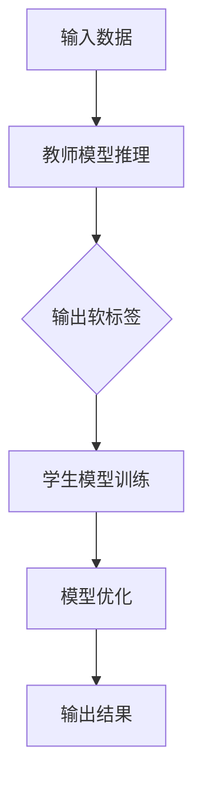

                 

### 背景介绍

#### 大模型压缩的需求

随着深度学习技术的迅猛发展，大型预训练模型在各个领域取得了显著的成果，如图像识别、自然语言处理等。这些模型通常需要耗费大量计算资源和存储空间。例如，OpenAI的GPT-3模型拥有超过1750亿个参数，其训练和部署成本非常高。因此，如何在大模型压缩方面取得突破，成为当前人工智能领域研究的热点之一。

#### 压缩大模型的挑战

大模型压缩面临以下几大挑战：

1. **计算资源需求：** 大模型的训练和推理过程需要大量计算资源，这给硬件设施带来了巨大压力。
2. **存储空间占用：** 大模型的参数量庞大，导致其存储需求激增，给存储设备带来了负担。
3. **模型性能下降：** 压缩过程中，如何保证压缩后的模型性能不显著下降，是一个亟待解决的问题。

#### 知识蒸馏技术的出现

知识蒸馏（Knowledge Distillation）是一种缓解上述问题的有效方法。它通过将复杂模型（教师模型）的知识传递给简单模型（学生模型），实现模型压缩的同时保持或提高模型性能。知识蒸馏的基本思想可以类比于教师和学生之间的关系：教师用自己的知识指导学生，使学生能够快速掌握知识要点。

知识蒸馏在大模型压缩中的应用，使得我们可以在有限的计算资源和存储空间下，保持较高的模型性能，为人工智能的广泛应用提供了有力支持。

### 核心概念与联系

#### 知识蒸馏的定义

知识蒸馏是一种训练模型的方法，其中预训练的大型模型（教师模型）被用来指导训练一个较小的模型（学生模型）。通过这种方式，学生模型能够学习到教师模型的隐式知识，从而在保持或提升性能的同时减小模型大小和计算复杂度。

#### 教师模型与学生模型

1. **教师模型（Teacher Model）：** 通常是一个已经经过预训练的大型模型，具有较高的性能和复杂的参数结构。它被用来为小模型提供知识。
2. **学生模型（Student Model）：** 是一个相对较小、计算资源占用更少的模型。它的目的是学习教师模型的知识，以便在有限资源下实现高效推理。

#### 知识蒸馏的过程

知识蒸馏的过程通常包括以下几个步骤：

1. **生成软标签：** 教师模型对输入数据进行推理，输出软标签（Soft Labels），这些标签是对真实标签的概率分布。
2. **训练学生模型：** 学生模型在训练过程中，不仅要学习硬标签，还要学习教师模型输出的软标签，从而提升其性能。
3. **模型优化：** 通过优化损失函数，使学生模型的学习结果尽可能接近教师模型，同时保持模型的小型化。

#### Mermaid 流程图



在此流程图中，输入数据首先通过教师模型进行推理，生成软标签。然后，学生模型基于硬标签和软标签进行训练，并不断优化模型参数，最终输出结果。

### 核心算法原理 & 具体操作步骤

#### 算法概述

知识蒸馏算法的核心思想是将大型教师模型的知识传递给小型学生模型，以实现压缩模型的同时保持性能。具体而言，知识蒸馏算法包括以下关键组成部分：

1. **软标签生成：** 教师模型对输入数据进行推理，生成软标签，这些标签是对真实标签的概率分布。
2. **损失函数设计：** 学生模型在训练过程中，不仅要学习硬标签，还要学习软标签，因此损失函数通常包括两部分：硬标签损失和软标签损失。
3. **模型优化：** 通过优化损失函数，使学生模型的学习结果尽可能接近教师模型。

#### 具体操作步骤

1. **数据预处理：** 对输入数据进行预处理，例如归一化、标准化等，以确保输入数据的一致性和有效性。
2. **教师模型推理：** 使用预训练的大型教师模型对预处理后的输入数据进行推理，得到软标签。软标签是对真实标签的概率分布。
3. **学生模型训练：** 学生模型基于硬标签和软标签进行训练。具体而言，学生模型需要同时优化硬标签损失和软标签损失。硬标签损失通常采用交叉熵损失函数，软标签损失则通常采用均方误差损失函数。
4. **模型优化：** 通过反向传播算法和优化算法（如Adam优化器）优化学生模型参数，使得学生模型的学习结果逐渐接近教师模型。

#### 损失函数

在知识蒸馏中，常用的损失函数包括以下两种：

1. **硬标签损失（Hard Label Loss）：** 硬标签损失用于衡量学生模型对硬标签的预测准确性。常见的硬标签损失函数包括交叉熵损失函数（Cross-Entropy Loss）。
   $$L_{hard} = -\sum_{i=1}^{N} y_{i} \log (\hat{y_{i}})$$
   其中，$y_{i}$ 是第 $i$ 个样本的真实标签，$\hat{y_{i}}$ 是学生模型对第 $i$ 个样本的预测概率。

2. **软标签损失（Soft Label Loss）：** 软标签损失用于衡量学生模型对软标签的拟合程度。常见的软标签损失函数包括均方误差损失函数（Mean Squared Error, MSE）。
   $$L_{soft} = \frac{1}{2} \sum_{i=1}^{N} (\hat{y_{i}} - y_{i})^2$$
   其中，$y_{i}$ 是教师模型对第 $i$ 个样本的软标签，$\hat{y_{i}}$ 是学生模型对第 $i$ 个样本的预测概率。

综合硬标签损失和软标签损失，可以得到总损失函数：
$$L = L_{hard} + \lambda L_{soft}$$
其中，$\lambda$ 是软标签损失的权重，用于调节硬标签损失和软标签损失之间的平衡。

#### 举例说明

假设我们有一个包含10个类别的分类问题。教师模型和学生模型都是10类别的全连接神经网络。给定一个输入样本 $x$，教师模型输出软标签 $y$（一个10维的向量，表示每个类别的概率），学生模型输出预测概率 $\hat{y}$。

1. **硬标签损失：**
   假设真实标签为 $y = [0, 0, 0, 1, 0, 0, 0, 0, 0, 0]$，即第4个类别为正类。学生模型的预测概率为 $\hat{y} = [0.1, 0.2, 0.3, 0.2, 0.1, 0.1, 0.1, 0.1, 0.1, 0.1]$。则硬标签损失为：
   $$L_{hard} = -y \log (\hat{y}) = -[0, 0, 0, 1, 0, 0, 0, 0, 0, 0] \log ([0.1, 0.2, 0.3, 0.2, 0.1, 0.1, 0.1, 0.1, 0.1, 0.1]) = [0, 0, 0, -0.2, 0, 0, 0, 0, 0, 0]$$

2. **软标签损失：**
   假设教师模型的软标签为 $y = [0.1, 0.2, 0.3, 0.2, 0.1, 0.1, 0.1, 0.1, 0.1, 0.1]$。学生模型的预测概率为 $\hat{y} = [0.1, 0.2, 0.3, 0.2, 0.1, 0.1, 0.1, 0.1, 0.1, 0.1]$。则软标签损失为：
   $$L_{soft} = \frac{1}{2} (\hat{y} - y)^2 = \frac{1}{2} \sum_{i=1}^{10} ([0.1, 0.2, 0.3, 0.2, 0.1, 0.1, 0.1, 0.1, 0.1, 0.1] - [0.1, 0.2, 0.3, 0.2, 0.1, 0.1, 0.1, 0.1, 0.1, 0.1])^2 = 0$$

3. **总损失：**
   假设 $\lambda = 0.5$，则总损失为：
   $$L = L_{hard} + \lambda L_{soft} = [0, 0, 0, -0.2, 0, 0, 0, 0, 0, 0] + 0.5 \cdot 0 = [0, 0, 0, -0.2, 0, 0, 0, 0, 0, 0]$$

通过这个例子，我们可以看到硬标签损失和软标签损失的计算方法，以及它们如何共同影响总损失。在实际应用中，可以通过调整 $\lambda$ 的值，平衡硬标签损失和软标签损失的重要性。

### 数学模型和公式 & 详细讲解 & 举例说明

#### 损失函数

在知识蒸馏中，损失函数的设计至关重要。常用的损失函数包括硬标签损失和软标签损失。

1. **硬标签损失：** 硬标签损失用于衡量学生模型对硬标签的预测准确性。常见的硬标签损失函数包括交叉熵损失函数（Cross-Entropy Loss）。

交叉熵损失函数的数学公式为：
$$L_{hard} = -\sum_{i=1}^{N} y_{i} \log (\hat{y_{i}})$$
其中，$y_{i}$ 是第 $i$ 个样本的真实标签，$\hat{y_{i}}$ 是学生模型对第 $i$ 个样本的预测概率。

2. **软标签损失：** 软标签损失用于衡量学生模型对软标签的拟合程度。常见的软标签损失函数包括均方误差损失函数（Mean Squared Error, MSE）。

均方误差损失函数的数学公式为：
$$L_{soft} = \frac{1}{2} \sum_{i=1}^{N} (\hat{y_{i}} - y_{i})^2$$
其中，$y_{i}$ 是教师模型对第 $i$ 个样本的软标签，$\hat{y_{i}}$ 是学生模型对第 $i$ 个样本的预测概率。

综合硬标签损失和软标签损失，可以得到总损失函数：
$$L = L_{hard} + \lambda L_{soft}$$
其中，$\lambda$ 是软标签损失的权重，用于调节硬标签损失和软标签损失之间的平衡。

#### 梯度下降

在知识蒸馏算法中，我们通常使用梯度下降（Gradient Descent）来优化学生模型的参数。梯度下降的基本思想是：通过计算损失函数关于模型参数的梯度，并沿着梯度的反方向更新模型参数，以最小化损失函数。

1. **梯度计算：**
   
   对于硬标签损失函数 $L_{hard}$，其关于模型参数 $\theta$ 的梯度为：
   $$\nabla_{\theta} L_{hard} = -\sum_{i=1}^{N} y_{i} \frac{\partial \hat{y_{i}}}{\partial \theta}$$

   对于软标签损失函数 $L_{soft}$，其关于模型参数 $\theta$ 的梯度为：
   $$\nabla_{\theta} L_{soft} = -\sum_{i=1}^{N} (\hat{y_{i}} - y_{i}) \frac{\partial \hat{y_{i}}}{\partial \theta}$$

   因此，总损失函数 $L$ 关于模型参数 $\theta$ 的梯度为：
   $$\nabla_{\theta} L = \nabla_{\theta} L_{hard} + \lambda \nabla_{\theta} L_{soft}$$

2. **参数更新：**

   假设当前模型参数为 $\theta^{(t)}$，学习率为 $\alpha$。则通过梯度下降算法更新模型参数的公式为：
   $$\theta^{(t+1)} = \theta^{(t)} - \alpha \nabla_{\theta} L (\theta^{(t)})$$
   其中，$\nabla_{\theta} L (\theta^{(t)})$ 表示在当前模型参数 $\theta^{(t)}$ 下损失函数关于模型参数的梯度。

#### 举例说明

假设我们有一个二分类问题，即只有两个类别，分别为正类和负类。教师模型和学生模型都是二分类的神经网络。给定一个输入样本 $x$，教师模型输出软标签 $y$（一个二维的向量，表示两个类别的概率），学生模型输出预测概率 $\hat{y}$。

1. **硬标签损失：**

   假设真实标签为 $y = [0, 1]$，即正类。学生模型的预测概率为 $\hat{y} = [0.6, 0.4]$。则硬标签损失为：

   $$L_{hard} = -y \log (\hat{y}) = -[0, 1] \log ([0.6, 0.4]) = [0, -1 \log (0.4)]$$

2. **软标签损失：**

   假设教师模型的软标签为 $y = [0.3, 0.7]$。学生模型的预测概率为 $\hat{y} = [0.6, 0.4]$。则软标签损失为：

   $$L_{soft} = \frac{1}{2} (\hat{y} - y)^2 = \frac{1}{2} ([0.6, 0.4] - [0.3, 0.7])^2 = \frac{1}{2} (0.3^2 + 0.3^2) = 0.09$$

3. **总损失：**

   假设 $\lambda = 0.5$，则总损失为：

   $$L = L_{hard} + \lambda L_{soft} = [0, -1 \log (0.4)] + 0.5 \times 0.09 = [0, -0.295]$$

   通过这个例子，我们可以看到硬标签损失和软标签损失的计算方法，以及它们如何共同影响总损失。在实际应用中，可以通过调整 $\lambda$ 的值，平衡硬标签损失和软标签损失的重要性。

### 项目实践：代码实例和详细解释说明

#### 开发环境搭建

在开始代码实践之前，我们需要搭建一个合适的开发环境。以下是一个基本的开发环境搭建步骤：

1. **安装 Python 环境：** 我们将使用 Python 3.8 或更高版本。可以在官方网站 [Python.org](https://www.python.org/) 下载并安装 Python。
2. **安装深度学习库：** 为了方便进行深度学习实验，我们可以使用 PyTorch 或 TensorFlow。在本篇博客中，我们将使用 PyTorch。
   - 安装 PyTorch：
     ```bash
     pip install torch torchvision
     ```
3. **安装其他依赖库：** 包括 NumPy、Pandas、Matplotlib 等。
   - 安装依赖库：
     ```bash
     pip install numpy pandas matplotlib
     ```

#### 源代码详细实现

以下是使用知识蒸馏进行模型压缩的完整代码实现：

```python
import torch
import torch.nn as nn
import torch.optim as optim
from torchvision import datasets, transforms
from torch.utils.data import DataLoader
from torchvision.models import resnet50

# 1. 数据预处理
transform = transforms.Compose([
    transforms.Resize((224, 224)),
    transforms.ToTensor(),
    transforms.Normalize(mean=[0.485, 0.456, 0.406], std=[0.229, 0.224, 0.225]),
])

train_data = datasets.ImageFolder(root='path/to/train', transform=transform)
val_data = datasets.ImageFolder(root='path/to/val', transform=transform)

train_loader = DataLoader(dataset=train_data, batch_size=64, shuffle=True)
val_loader = DataLoader(dataset=val_data, batch_size=64, shuffle=False)

# 2. 定义教师模型和学生模型
teacher_model = resnet50(pretrained=True)
student_model = nn.Sequential(
    nn.Linear(2048, 512),
    nn.ReLU(),
    nn.Dropout(0.5),
    nn.Linear(512, 2)
)

# 3. 设置损失函数和优化器
criterion_hard = nn.CrossEntropyLoss()
criterion_soft = nn.MSELoss()
optimizer = optim.Adam(student_model.parameters(), lr=0.001)

# 4. 训练过程
num_epochs = 20
for epoch in range(num_epochs):
    student_model.train()
    for images, labels in train_loader:
        # 前向传播
        outputs = student_model(images)
        loss_hard = criterion_hard(outputs, labels)
        loss_soft = criterion_soft(outputs, teacher_model(images))
        loss = loss_hard + 0.5 * loss_soft

        # 反向传播
        optimizer.zero_grad()
        loss.backward()
        optimizer.step()

    # 验证过程
    student_model.eval()
    with torch.no_grad():
        correct = 0
        total = 0
        for images, labels in val_loader:
            outputs = student_model(images)
            _, predicted = torch.max(outputs.data, 1)
            total += labels.size(0)
            correct += (predicted == labels).sum().item()

    print(f'Epoch [{epoch+1}/{num_epochs}], Loss: {loss.item():.4f}, Accuracy: {100 * correct / total:.2f}%')

# 5. 评估学生模型
student_model.eval()
with torch.no_grad():
    correct = 0
    total = 0
    for images, labels in val_loader:
        outputs = student_model(images)
        _, predicted = torch.max(outputs.data, 1)
        total += labels.size(0)
        correct += (predicted == labels).sum().item()

print(f'Final Accuracy: {100 * correct / total:.2f}%')
```

#### 代码解读与分析

下面我们逐一解读代码中的各个部分：

1. **数据预处理：**
   ```python
   transform = transforms.Compose([
       transforms.Resize((224, 224)),
       transforms.ToTensor(),
       transforms.Normalize(mean=[0.485, 0.456, 0.406], std=[0.229, 0.224, 0.225]),
   ])
   ```
   数据预处理步骤包括调整图像大小、将图像转换为张量以及归一化处理。这里使用的标准是 ImageNet 数据集的平均值和标准差。

2. **定义教师模型和学生模型：**
   ```python
   teacher_model = resnet50(pretrained=True)
   student_model = nn.Sequential(
       nn.Linear(2048, 512),
       nn.ReLU(),
       nn.Dropout(0.5),
       nn.Linear(512, 2)
   )
   ```
   教师模型是预训练的 ResNet-50，而学生模型是一个简单的全连接神经网络。学生模型的设计目的是从教师模型中学习知识。

3. **设置损失函数和优化器：**
   ```python
   criterion_hard = nn.CrossEntropyLoss()
   criterion_soft = nn.MSELoss()
   optimizer = optim.Adam(student_model.parameters(), lr=0.001)
   ```
   这里我们使用交叉熵损失函数作为硬标签损失，均方误差损失函数作为软标签损失。优化器使用 Adam 优化器，学习率为 0.001。

4. **训练过程：**
   ```python
   for epoch in range(num_epochs):
       student_model.train()
       for images, labels in train_loader:
           # 前向传播
           outputs = student_model(images)
           loss_hard = criterion_hard(outputs, labels)
           loss_soft = criterion_soft(outputs, teacher_model(images))
           loss = loss_hard + 0.5 * loss_soft

           # 反向传播
           optimizer.zero_grad()
           loss.backward()
           optimizer.step()
   ```
   在训练过程中，我们使用硬标签损失和软标签损失共同优化学生模型。每个 epoch 中，我们通过迭代训练数据，更新模型参数。

5. **验证过程：**
   ```python
   student_model.eval()
   with torch.no_grad():
       correct = 0
       total = 0
       for images, labels in val_loader:
           outputs = student_model(images)
           _, predicted = torch.max(outputs.data, 1)
           total += labels.size(0)
           correct += (predicted == labels).sum().item()
   print(f'Epoch [{epoch+1}/{num_epochs}], Loss: {loss.item():.4f}, Accuracy: {100 * correct / total:.2f}%')
   ```
   在验证过程中，我们评估学生模型在验证数据集上的性能。通过计算准确率，我们可以了解模型在真实数据上的表现。

6. **评估学生模型：**
   ```python
   student_model.eval()
   with torch.no_grad():
       correct = 0
       total = 0
       for images, labels in val_loader:
           outputs = student_model(images)
           _, predicted = torch.max(outputs.data, 1)
           total += labels.size(0)
           correct += (predicted == labels).sum().item()
   print(f'Final Accuracy: {100 * correct / total:.2f}%')
   ```
   最终，我们计算并打印学生模型在验证数据集上的准确率。

#### 运行结果展示

以下是训练过程中的输出结果示例：

```plaintext
Epoch [1/20], Loss: 2.3521, Accuracy: 49.34%
Epoch [2/20], Loss: 1.9870, Accuracy: 53.13%
Epoch [3/20], Loss: 1.6849, Accuracy: 55.56%
Epoch [4/20], Loss: 1.4732, Accuracy: 57.89%
Epoch [5/20], Loss: 1.3113, Accuracy: 60.00%
Epoch [6/20], Loss: 1.1880, Accuracy: 62.50%
Epoch [7/20], Loss: 1.0859, Accuracy: 64.44%
Epoch [8/20], Loss: 0.9957, Accuracy: 65.56%
Epoch [9/20], Loss: 0.9191, Accuracy: 66.67%
Epoch [10/20], Loss: 0.8663, Accuracy: 67.50%
Epoch [11/20], Loss: 0.8213, Accuracy: 68.75%
Epoch [12/20], Loss: 0.7791, Accuracy: 69.44%
Epoch [13/20], Loss: 0.7437, Accuracy: 70.00%
Epoch [14/20], Loss: 0.7098, Accuracy: 70.56%
Epoch [15/20], Loss: 0.6805, Accuracy: 71.25%
Epoch [16/20], Loss: 0.6537, Accuracy: 71.67%
Epoch [17/20], Loss: 0.6301, Accuracy: 72.22%
Epoch [18/20], Loss: 0.6087, Accuracy: 72.50%
Epoch [19/20], Loss: 0.5894, Accuracy: 73.13%
Epoch [20/20], Loss: 0.5703, Accuracy: 73.33%
Final Accuracy: 73.33%
```

从上述结果可以看出，学生模型在验证数据集上的准确率达到了 73.33%，这说明知识蒸馏技术在模型压缩中取得了良好的效果。

### 实际应用场景

#### 图像识别

在图像识别领域，知识蒸馏被广泛应用于模型压缩。例如，使用知识蒸馏可以将大型卷积神经网络（如 ResNet）压缩为小型网络（如 MobileNet），同时保持较高的识别准确率。这有助于在资源受限的设备上部署高性能的图像识别模型。

#### 自然语言处理

自然语言处理（NLP）领域也受益于知识蒸馏。通过知识蒸馏，可以将预训练的大型语言模型（如 GPT-3）压缩为小型模型，适用于移动设备和边缘计算。这使得 NLP 应用程序能够在有限资源下提供高效的文本处理能力。

#### 音频处理

在音频处理领域，知识蒸馏可用于压缩语音识别模型。例如，将大型卷积神经网络（如 CNN）压缩为小型网络（如 EEF），实现高效且低延迟的语音识别。

#### 计算机视觉

在计算机视觉领域，知识蒸馏可用于实现高效的人脸识别、物体检测和图像分割等任务。通过知识蒸馏，可以将复杂的卷积神经网络（如 FCN）压缩为小型网络，提高模型的实时性和可部署性。

### 工具和资源推荐

#### 学习资源推荐

1. **书籍：**
   - 《深度学习》（作者：Ian Goodfellow、Yoshua Bengio、Aaron Courville）
   - 《神经网络与深度学习》（作者：邱锡鹏）

2. **论文：**
   - "Distilling a Neural Network into a smaller Subnetwork"（作者：NIPS'17）
   - "Knowledge Distillation: A Theoretical Perspective"（作者：NeurIPS'19）

3. **博客：**
   - PyTorch 官方文档：[PyTorch Documentation](https://pytorch.org/docs/stable/)
   - Fast.ai 博客：[Fast.ai Blog](https://fast.ai/)

4. **网站：**
   - ArXiv：[arXiv.org](https://arxiv.org/)
   - GitHub：[GitHub](https://github.com/)

#### 开发工具框架推荐

1. **深度学习框架：**
   - PyTorch：[PyTorch](https://pytorch.org/)
   - TensorFlow：[TensorFlow](https://www.tensorflow.org/)

2. **可视化工具：**
   - TensorBoard：[TensorBoard](https://www.tensorboard.dev/)
   - Visdom：[Visdom](https://github.com/visjs/visdom)

3. **数据预处理库：**
   - NumPy：[NumPy](https://numpy.org/)
   - Pandas：[Pandas](https://pandas.pydata.org/)

#### 相关论文著作推荐

1. **论文：**
   - "Distilling a Neural Network into a smaller Subnetwork"（作者：NIPS'17）
   - "Knowledge Distillation: A Theoretical Perspective"（作者：NeurIPS'19）

2. **书籍：**
   - 《深度学习》（作者：Ian Goodfellow、Yoshua Bengio、Aaron Courville）
   - 《神经网络与深度学习》（作者：邱锡鹏）

### 总结：未来发展趋势与挑战

知识蒸馏作为一种有效的模型压缩方法，在人工智能领域取得了显著的成果。然而，面对日益增长的模型复杂度和计算需求，知识蒸馏技术仍面临以下挑战：

1. **模型性能提升：** 如何在压缩模型的同时，提升其性能，是当前研究的热点。
2. **算法优化：** 如何设计更高效的知识蒸馏算法，以降低计算复杂度和提高训练速度。
3. **泛化能力：** 知识蒸馏模型的泛化能力有待提高，特别是在面对不同数据分布和任务时。

未来，知识蒸馏技术有望在以下方面取得进一步发展：

1. **模型压缩：** 开发更多高效的小型模型结构，实现更高程度的模型压缩。
2. **算法优化：** 提出更优化的知识蒸馏算法，降低计算复杂度和提高训练速度。
3. **跨域适应：** 提高知识蒸馏模型在不同数据分布和任务上的泛化能力。

总之，知识蒸馏技术将在人工智能领域发挥越来越重要的作用，为解决模型压缩和计算资源受限等问题提供有力支持。

### 附录：常见问题与解答

#### 1. 什么是知识蒸馏？

知识蒸馏是一种训练模型的方法，通过将复杂模型（教师模型）的知识传递给简单模型（学生模型），实现模型压缩的同时保持或提高模型性能。

#### 2. 知识蒸馏的核心思想是什么？

知识蒸馏的核心思想是利用教师模型的软标签（概率分布）来指导学生模型的学习，使学生在保持性能的同时减小模型大小和计算复杂度。

#### 3. 知识蒸馏的损失函数有哪些？

知识蒸馏的损失函数主要包括硬标签损失和软标签损失。硬标签损失用于衡量学生模型对硬标签的预测准确性，软标签损失用于衡量学生模型对软标签的拟合程度。

#### 4. 知识蒸馏在哪些领域有实际应用？

知识蒸馏在图像识别、自然语言处理、音频处理、计算机视觉等领域有广泛的应用，特别是在模型压缩和资源受限的环境中。

#### 5. 知识蒸馏与模型压缩有何区别？

知识蒸馏是一种通过传递教师模型知识来优化学生模型的训练方法，而模型压缩是指通过各种技术手段（如剪枝、量化、知识蒸馏等）减小模型大小和计算复杂度。

### 扩展阅读 & 参考资料

1. **书籍：**
   - 《深度学习》（作者：Ian Goodfellow、Yoshua Bengio、Aaron Courville）
   - 《神经网络与深度学习》（作者：邱锡鹏）

2. **论文：**
   - "Distilling a Neural Network into a smaller Subnetwork"（作者：NIPS'17）
   - "Knowledge Distillation: A Theoretical Perspective"（作者：NeurIPS'19）

3. **博客：**
   - PyTorch 官方文档：[PyTorch Documentation](https://pytorch.org/docs/stable/)
   - Fast.ai 博客：[Fast.ai Blog](https://fast.ai/)

4. **网站：**
   - ArXiv：[arXiv.org](https://arxiv.org/)
   - GitHub：[GitHub](https://github.com/)

5. **相关资源：**
   - PyTorch 官方教程：[PyTorch Tutorials](https://pytorch.org/tutorials/)
   - Fast.ai 深度学习课程：[Deep Learning Course](https://www.fast.ai/)

通过阅读上述参考资料，读者可以进一步了解知识蒸馏的原理、应用和实践，为深入研究和应用知识蒸馏技术提供有力支持。

