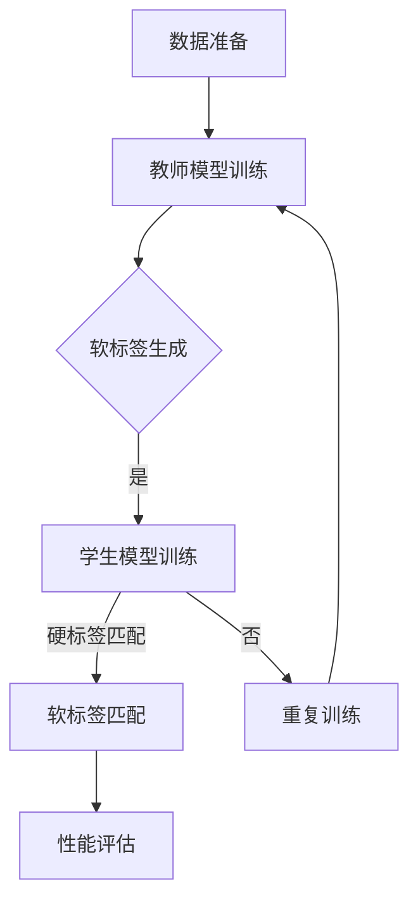

                 

### 1. 背景介绍

知识蒸馏（Knowledge Distillation）是一种新兴的机器学习技术，旨在通过将一个复杂的模型的知识传递给一个更简单、更紧凑的模型，从而实现更高效的推理和部署。随着深度学习在各个领域的广泛应用，模型的大小和计算资源的需求成为了一个亟待解决的问题。传统的方法，如模型压缩、剪枝和量化，虽然能够在一定程度上减小模型的规模，但往往会导致模型性能的下降。

知识蒸馏则提供了一种不同的解决方案。它的基本思想是，通过训练一个教师模型（Teacher Model）和一个学生模型（Student Model），使教师模型输出的软标签（Soft Labels）能够指导学生模型的学习。这样，学生模型就能够学到教师模型的“精髓”，从而在保留大部分性能的前提下，实现模型的轻量化。

知识蒸馏技术不仅能够提升模型的推理速度，还有助于减少模型的存储空间需求，对于移动设备、嵌入式系统等资源受限的场景具有重要意义。此外，知识蒸馏还能够帮助研究者更好地理解复杂模型的内部工作机制，从而推动深度学习的理论和实践发展。

本文将深入探讨知识蒸馏的核心概念、算法原理、数学模型及其实际应用。通过一步步的解析，希望能够帮助读者全面掌握知识蒸馏的精髓，并在实际项目中灵活运用。

#### 什么是知识蒸馏？

知识蒸馏是一种将复杂模型的知识传递到简化模型中的过程，这一过程通过训练一个教师模型和一个学生模型来实现。教师模型通常是一个大规模且性能优秀的模型，而学生模型则是一个较小且轻量级的模型。知识蒸馏的目标是使学生模型能够尽可能地复制教师模型的知识和性能。

简单来说，知识蒸馏的核心思想是将教师模型的输出（通常是概率分布）作为学生模型的额外训练信号，以此来指导学生模型的学习过程。具体来说，教师模型接收输入并输出其预测的概率分布，而学生模型则输出其预测的概率分布。知识蒸馏的目标是通过最小化两者之间的差异，来训练学生模型。

知识蒸馏的过程通常包括以下步骤：

1. **数据准备**：准备用于训练教师模型和学生模型的数据集。
2. **教师模型训练**：使用数据集训练一个高性能的教师模型。
3. **软标签生成**：在教师模型训练过程中，收集其预测的概率分布作为软标签。
4. **学生模型训练**：使用教师模型的软标签来训练学生模型，通过最小化软标签和学生模型输出之间的差异。

通过这种方式，学生模型能够学到教师模型的核心知识，并且在保持较高性能的同时，减小模型的规模。

#### 知识蒸馏与传统模型压缩方法的比较

在深度学习中，模型的压缩是一个关键问题，传统的方法主要包括模型剪枝、量化、蒸馏等。知识蒸馏与传统模型压缩方法相比，具有以下优势和特点：

1. **性能保留**：知识蒸馏通过将教师模型的核心知识传递给学生模型，能够在大幅度减少模型规模的同时，保留较高的性能。相比之下，传统压缩方法如剪枝和量化，往往在减小模型规模的同时，会导致性能的下降。

2. **计算效率**：知识蒸馏能够显著提高模型的推理速度。由于学生模型通常是一个较小的模型，因此其在处理输入数据时的计算资源需求更低。这一点对于移动设备、嵌入式系统等资源受限的场景尤为重要。

3. **泛化能力**：知识蒸馏不仅能够提高模型的推理速度，还有助于增强模型的泛化能力。通过学习教师模型的知识，学生模型能够更好地适应不同的输入数据，从而减少过拟合的风险。

4. **适用范围**：知识蒸馏方法适用于各种类型的深度学习模型，包括卷积神经网络（CNN）、循环神经网络（RNN）和生成对抗网络（GAN）等。而传统方法如剪枝和量化，往往需要针对特定的模型结构进行调整。

总之，知识蒸馏提供了一种更为高效和灵活的模型压缩方法，不仅能够保留模型的性能，还能提高计算效率和泛化能力，使其在深度学习的广泛应用中具有重要意义。

### 2. 核心概念与联系

知识蒸馏的核心在于如何有效地将教师模型（Teacher Model）的知识传递给学生模型（Student Model），使学生在保持高性能的同时，具有较小的模型规模。要理解这一过程，我们首先需要明确一些核心概念和它们之间的关系。

#### 教师模型与学生模型

教师模型通常是一个大规模且性能优秀的模型，用于提供软标签。软标签是教师模型在训练过程中对输入数据预测的概率分布。这些软标签包含了教师模型对数据的理解和知识，是指导学生模型学习的重要信息。

学生模型则是一个较小且轻量级的模型，其目标是学习教师模型的核心知识，并在保持较高性能的前提下，实现模型的轻量化。学生模型的输出与教师模型的输出进行对比，通过最小化差异来训练学生模型。

#### 软标签与硬标签

在深度学习中，标签通常分为软标签（Soft Labels）和硬标签（Hard Labels）。

- **软标签**：软标签是教师模型输出的概率分布。例如，对于一个多分类问题，教师模型可能会输出 `[0.2, 0.3, 0.4, 0.1]`，表示该输入数据属于每个类别的概率。软标签提供了教师模型对每个类别的“软”预测，是知识蒸馏中重要的训练信号。
  
- **硬标签**：硬标签是教师模型的最终预测结果，通常是其中一个类别的唯一标识。例如，对于一个多分类问题，如果教师模型预测输入数据属于第三个类别，那么硬标签就是 `[0, 0, 1, 0]`。

在知识蒸馏中，教师模型输出的软标签是学生模型的重要训练信号。学生模型不仅要学习硬标签，还要学习软标签，以更好地理解教师模型的知识。

#### 知识蒸馏流程

知识蒸馏的基本流程包括以下几个步骤：

1. **数据准备**：准备用于训练教师模型和学生模型的数据集。这些数据集通常包含输入数据和对应的标签。

2. **教师模型训练**：使用数据集训练一个高性能的教师模型。教师模型在训练过程中，会输出软标签。

3. **软标签生成**：在教师模型训练过程中，收集其预测的概率分布作为软标签。

4. **学生模型训练**：使用教师模型的软标签来训练学生模型。这一过程通常包括以下两个方面：

   - **硬标签匹配**：学生模型的目标是学习硬标签，即最小化学生模型的输出与硬标签之间的差异。
   - **软标签匹配**：学生模型的目标是学习软标签，即最小化学生模型的输出与教师模型软标签之间的差异。

通过这两个方面的训练，学生模型能够学到教师模型的核心知识，并在保持较高性能的同时，实现模型的轻量化。

#### Mermaid 流程图

为了更好地理解知识蒸馏的核心概念和流程，我们可以使用 Mermaid 流程图来表示。以下是一个简化的 Mermaid 流程图，描述了知识蒸馏的基本流程：



在这个流程图中：

- `A[数据准备]` 表示准备训练数据。
- `B[教师模型训练]` 表示训练教师模型。
- `C{软标签生成}` 表示在教师模型训练过程中生成软标签。
- `D[学生模型训练]` 表示使用教师模型软标签训练学生模型。
- `E[软标签匹配]` 表示通过软标签匹配来训练学生模型。
- `F[重复训练]` 表示如果学生模型性能未达到预期，则重复训练过程。
- `G[性能评估]` 表示评估学生模型性能。

通过这个流程图，我们可以清晰地看到知识蒸馏的基本步骤和各个步骤之间的联系。

#### 教师模型与学生模型的关系

教师模型与学生模型之间的关系是知识蒸馏的核心。教师模型作为一个高性能的模型，其输出包含了丰富的知识。而学生模型作为一个较小的模型，其目标是学习这些知识，并在保持较高性能的同时，实现模型的轻量化。

在知识蒸馏过程中，教师模型输出的软标签是学生模型学习的重要依据。通过最小化软标签和学生模型输出之间的差异，学生模型能够学到教师模型的核心知识。这一过程不仅能够提升学生模型的性能，还能减少模型的规模，实现模型的压缩。

总之，知识蒸馏通过教师模型和学生模型之间的相互作用，实现知识的传递和模型的压缩。这一过程不仅提高了模型的推理速度，还有助于增强模型的泛化能力，使其在深度学习的实际应用中具有重要意义。

### 3. 核心算法原理 & 具体操作步骤

知识蒸馏算法的核心在于如何有效地将教师模型的知识传递给学生模型。本节将详细解析知识蒸馏的算法原理，并介绍具体的操作步骤。

#### 算法原理

知识蒸馏算法的基本思想是通过软标签（Soft Labels）来指导学生模型的学习。软标签是教师模型在训练过程中输出的概率分布，它包含了教师模型对输入数据的理解。学生模型的目标是学习这些软标签，从而在保持高性能的同时，实现模型的轻量化。

知识蒸馏算法主要包含两个方面的训练：

1. **硬标签匹配**：学生模型需要学习硬标签，即最小化学生模型的输出与硬标签之间的差异。这一过程类似于传统的模型训练，学生模型通过反向传播算法，不断调整参数，以最小化损失函数。

2. **软标签匹配**：学生模型还需要学习软标签，即最小化学生模型的输出与教师模型软标签之间的差异。这一过程通过额外的损失函数来实现，通常称为“知识蒸馏损失”或“软标签损失”。

软标签匹配的目标是让学生模型输出与教师模型输出尽可能相似的概率分布。通过这种方式，学生模型能够学到教师模型的核心知识。

#### 操作步骤

以下是知识蒸馏的具体操作步骤：

1. **数据准备**：

   - 准备用于训练教师模型和学生模型的数据集。数据集应包含输入数据和对应的标签。
   - 数据集可以分为训练集、验证集和测试集。训练集用于训练教师模型，验证集用于调整模型参数，测试集用于评估学生模型的性能。

2. **教师模型训练**：

   - 使用训练集数据训练一个高性能的教师模型。教师模型可以是一个复杂的深度学习模型，如卷积神经网络（CNN）或循环神经网络（RNN）。
   - 在训练过程中，收集教师模型输出的概率分布作为软标签。

3. **学生模型初始化**：

   - 创建一个较小的学生模型，其结构与教师模型相似，但参数量较少。
   - 初始化学生模型的参数，可以使用随机初始化或预训练模型作为初始化。

4. **硬标签匹配训练**：

   - 使用教师模型和训练集数据训练学生模型。在训练过程中，学生模型需要学习硬标签，即最小化学生模型的输出与硬标签之间的差异。
   - 这通常通过反向传播算法实现，学生模型的参数通过梯度下降等优化算法进行调整。

5. **软标签匹配训练**：

   - 在硬标签匹配训练的基础上，使用教师模型软标签来进一步训练学生模型。这一过程通过额外的损失函数来实现，称为“知识蒸馏损失”或“软标签损失”。
   - 知识蒸馏损失通常定义为教师模型软标签和学生模型输出之间的差异的均方误差（MSE），即：
     $$\text{Knowledge Distillation Loss} = \frac{1}{N}\sum_{i=1}^{N} \sum_{j=1}^{C} (\log P_{ij} + (1 - P_{ij}) \log (1 - P_{ij}))$$
     其中，$P_{ij}$ 是学生模型对第 $i$ 个样本属于第 $j$ 个类别的预测概率，$C$ 是类别数。
   
6. **模型评估**：

   - 使用验证集和测试集评估学生模型的性能。通常使用准确率（Accuracy）、召回率（Recall）、F1 分数（F1 Score）等指标来评估模型。
   - 根据评估结果调整模型参数，以优化模型性能。

7. **模型部署**：

   - 将训练好的学生模型部署到实际应用中，如移动设备、嵌入式系统等。
   - 部署后的模型可以进行快速推理，满足实时性的需求。

#### 算法分析

知识蒸馏算法通过软标签匹配训练，使学生模型能够学习到教师模型的核心知识。这一过程不仅能够提高学生模型的性能，还能减少模型的规模，实现模型的压缩。

在知识蒸馏过程中，软标签匹配损失函数起到了关键作用。它通过最小化教师模型软标签和学生模型输出之间的差异，指导学生模型的学习。软标签损失函数的设计需要考虑以下几个因素：

1. **概率分布的平滑性**：教师模型软标签通常是一个概率分布，它包含了教师模型对每个类别的预测。软标签的平滑性对于学生模型的学习非常重要，平滑的软标签能够提供更稳定的学习信号，有助于减少模型的过拟合。
   
2. **损失函数的形式**：常见的损失函数包括均方误差（MSE）、交叉熵损失（Cross-Entropy Loss）等。选择合适的损失函数能够更好地指导学生模型的学习，提高模型的性能。

3. **参数调节**：知识蒸馏过程中需要调节多个参数，如学习率、软标签权重等。合理的参数调节能够优化模型性能，提高模型的泛化能力。

总之，知识蒸馏算法通过软标签匹配训练，实现了教师模型和学生模型之间的知识传递。这一过程不仅提高了模型的性能，还能减少模型的规模，使其在深度学习的实际应用中具有重要意义。

### 4. 数学模型和公式 & 详细讲解 & 举例说明

在知识蒸馏过程中，数学模型和公式起到了关键作用。这些模型和公式不仅帮助我们理解知识蒸馏的工作原理，还为实际操作提供了具体的指导。本节将详细讲解知识蒸馏的数学模型和公式，并通过具体的例子来说明其应用。

#### 软标签匹配损失函数

知识蒸馏的核心在于如何通过软标签匹配损失函数来指导学生模型的学习。软标签匹配损失函数通常定义为教师模型软标签和学生模型输出之间的差异的均方误差（MSE）。具体来说，假设教师模型和学生模型的输出分别为 $T = [T_1, T_2, ..., T_C]$ 和 $S = [S_1, S_2, ..., S_C]$，其中 $C$ 表示类别数。则软标签匹配损失函数可以表示为：

$$\text{Knowledge Distillation Loss} = \frac{1}{N}\sum_{i=1}^{N} \sum_{j=1}^{C} (\log S_{ij} + (1 - S_{ij}) \log (1 - S_{ij}) - \log T_{ij})$$

其中，$N$ 表示样本数量。$S_{ij}$ 和 $T_{ij}$ 分别表示学生模型和教师模型对第 $i$ 个样本属于第 $j$ 个类别的预测概率。

#### 硬标签匹配损失函数

除了软标签匹配损失函数，知识蒸馏过程中还需要硬标签匹配损失函数来指导学生模型的学习。硬标签匹配损失函数通常定义为学生模型的输出与硬标签之间的差异的交叉熵（Cross-Entropy Loss）。具体来说，假设硬标签为 $Y = [Y_1, Y_2, ..., Y_C]$，其中 $Y_j = 1$ 表示第 $i$ 个样本属于第 $j$ 个类别，否则 $Y_j = 0$。则硬标签匹配损失函数可以表示为：

$$\text{Hard Label Matching Loss} = -\sum_{i=1}^{N} \sum_{j=1}^{C} Y_{ij} \log S_{ij}$$

#### 整体损失函数

在知识蒸馏过程中，整体损失函数通常是由软标签匹配损失函数和硬标签匹配损失函数的组合。整体损失函数可以表示为：

$$\text{Total Loss} = \alpha \cdot \text{Knowledge Distillation Loss} + (1 - \alpha) \cdot \text{Hard Label Matching Loss}$$

其中，$\alpha$ 是一个超参数，用于调节软标签匹配损失函数和硬标签匹配损失函数之间的权重。通常，$\alpha$ 的取值范围为 $[0, 1]$。当 $\alpha = 0$ 时，整体损失函数仅包含硬标签匹配损失函数；当 $\alpha = 1$ 时，整体损失函数仅包含软标签匹配损失函数。

#### 示例

假设有一个分类问题，共有 10 个类别。教师模型和学生模型对某个样本的输出分别为：

$$T = [0.1, 0.2, 0.3, 0.15, 0.1, 0.1, 0.05, 0.05, 0.05, 0.05]$$

$$S = [0.12, 0.18, 0.28, 0.16, 0.1, 0.08, 0.06, 0.06, 0.06, 0.06]$$

硬标签为：

$$Y = [0, 0, 1, 0, 0, 0, 0, 0, 0, 0]$$

首先，计算软标签匹配损失函数：

$$\text{Knowledge Distillation Loss} = \frac{1}{10} \sum_{j=1}^{10} (\log S_{j} + (1 - S_{j}) \log (1 - S_{j}) - \log T_{j})$$

$$= \frac{1}{10} [(\log 0.12 + (1 - 0.12) \log (1 - 0.12)) + (\log 0.18 + (1 - 0.18) \log (1 - 0.18)) + ... + (\log 0.05 + (1 - 0.05) \log (1 - 0.05))]$$

$$= 0.672$$

然后，计算硬标签匹配损失函数：

$$\text{Hard Label Matching Loss} = -\sum_{j=1}^{10} Y_{j} \log S_{j} = -1 \cdot \log 0.28 = 0.398$$

最后，计算整体损失函数：

$$\text{Total Loss} = \alpha \cdot \text{Knowledge Distillation Loss} + (1 - \alpha) \cdot \text{Hard Label Matching Loss}$$

假设 $\alpha = 0.5$，则：

$$\text{Total Loss} = 0.5 \cdot 0.672 + 0.5 \cdot 0.398 = 0.535$$

通过这个例子，我们可以看到如何计算知识蒸馏过程中的损失函数。在实际应用中，可以根据具体问题和需求调整损失函数的形式和参数。

总之，数学模型和公式是知识蒸馏算法的核心组成部分，通过这些模型和公式，我们能够有效地指导学生模型的学习，实现教师模型和学生模型之间的知识传递。这不仅提高了模型的性能，还实现了模型的轻量化，使其在深度学习的实际应用中具有重要意义。

### 5. 项目实践：代码实例和详细解释说明

在本节中，我们将通过一个具体的代码实例来展示如何使用知识蒸馏技术来实现模型的压缩。这个示例将包括以下步骤：

### 5.1 开发环境搭建

在开始之前，我们需要搭建一个合适的开发环境。以下是一个基本的开发环境配置：

- 操作系统：Ubuntu 20.04
- Python 版本：3.8
- PyTorch 版本：1.8
- CUDA：11.0

确保安装了上述依赖项后，我们可以开始构建我们的代码环境。以下是搭建开发环境的命令：

```bash
# 安装 Python 和 PyTorch
sudo apt-get update
sudo apt-get install python3-pip python3-dev

pip3 install torch torchvision torchaudio

# 安装 CUDA
sudo apt-get install cuda

# 安装其他依赖项
pip3 install numpy matplotlib

```

### 5.2 源代码详细实现

以下是知识蒸馏项目的主要代码实现。这个示例使用了一个简单的图像分类任务，其中教师模型是一个较大的卷积神经网络，学生模型是一个较小的网络。

```python
import torch
import torch.nn as nn
import torch.optim as optim
from torchvision import datasets, transforms
from torch.utils.data import DataLoader
import torch.nn.functional as F

# 定义教师模型
class TeacherModel(nn.Module):
    def __init__(self):
        super(TeacherModel, self).__init__()
        self.conv1 = nn.Conv2d(1, 32, 3, 1)
        self.fc1 = nn.Linear(32 * 26 * 26, 128)
        self.fc2 = nn.Linear(128, 10)

    def forward(self, x):
        x = F.relu(self.conv1(x))
        x = x.view(x.size(0), -1)
        x = F.relu(self.fc1(x))
        x = self.fc2(x)
        return x

# 定义学生模型
class StudentModel(nn.Module):
    def __init__(self):
        super(StudentModel, self).__init__()
        self.conv1 = nn.Conv2d(1, 16, 3, 1)
        self.fc1 = nn.Linear(16 * 26 * 26, 64)
        self.fc2 = nn.Linear(64, 10)

    def forward(self, x):
        x = F.relu(self.conv1(x))
        x = x.view(x.size(0), -1)
        x = F.relu(self.fc1(x))
        x = self.fc2(x)
        return x

# 实例化模型
teacher_model = TeacherModel()
student_model = StudentModel()

# 设置损失函数和优化器
soft_label_loss = nn.KLDivLoss(reduction='batchmean')
hard_label_loss = nn.CrossEntropyLoss()
optimizer = optim.Adam(student_model.parameters(), lr=0.001)

# 数据加载
transform = transforms.Compose([
    transforms.ToTensor(),
    transforms.Normalize((0.5,), (0.5,))
])

train_dataset = datasets.MNIST(root='./data', train=True, download=True, transform=transform)
train_loader = DataLoader(train_dataset, batch_size=64, shuffle=True)

# 训练过程
for epoch in range(10):
    for i, (inputs, labels) in enumerate(train_loader):
        # 前向传播
        teacher_outputs = teacher_model(inputs)
        student_outputs = student_model(inputs)

        # 计算损失
        soft_label_loss_val = soft_label_loss(F.log_softmax(student_outputs, dim=1), F.softmax(teacher_outputs, dim=1))
        hard_label_loss_val = hard_label_loss(student_outputs, labels)

        # 反向传播和优化
        optimizer.zero_grad()
        loss = soft_label_loss_val + hard_label_loss_val
        loss.backward()
        optimizer.step()

        if (i+1) % 100 == 0:
            print(f'Epoch [{epoch+1}/{10}], Step [{i+1}/{len(train_loader)}], Soft Loss: {soft_label_loss_val.item():.4f}, Hard Loss: {hard_label_loss_val.item():.4f}')

# 测试模型
test_dataset = datasets.MNIST(root='./data', train=False, transform=transform)
test_loader = DataLoader(test_dataset, batch_size=1000)

with torch.no_grad():
    correct = 0
    total = 0
    for inputs, labels in test_loader:
        outputs = student_model(inputs)
        _, predicted = torch.max(outputs.data, 1)
        total += labels.size(0)
        correct += (predicted == labels).sum().item()

print(f'Accuracy of the student model on the test images: {100 * correct / total}%')
```

#### 详细解释说明

1. **模型定义**：

   - **教师模型（TeacherModel）**：这是一个较大的卷积神经网络，包括一个卷积层、一个全连接层和另一个全连接层。这个模型将输入图像压缩为一个 10 维的向量，表示 10 个类别的概率。

   - **学生模型（StudentModel）**：这是一个较小的网络，包括一个卷积层、一个全连接层和另一个全连接层。这个模型的目标是复制教师模型的核心知识，同时保持较小的模型规模。

2. **损失函数**：

   - **软标签匹配损失（soft_label_loss）**：使用 KLDivLoss（KL 散度损失）来计算学生模型的输出与教师模型软标签之间的差异。

   - **硬标签匹配损失（hard_label_loss）**：使用 CrossEntropyLoss（交叉熵损失）来计算学生模型的输出与硬标签之间的差异。

3. **优化器**：

   - 使用 Adam 优化器来更新学生模型的参数。

4. **数据加载**：

   - 使用 PyTorch 的 `DataLoader` 来加载和预处理数据。这里我们使用的是 MNIST 数据集，一个包含手写数字的图像数据集。

5. **训练过程**：

   - 在每个 epoch 中，遍历训练数据集，计算教师模型和学生模型的输出，并计算软标签匹配损失和硬标签匹配损失。通过反向传播和优化，更新学生模型的参数。

6. **模型评估**：

   - 在训练完成后，使用测试数据集评估学生模型的性能。计算准确率来评估模型的性能。

通过这个代码实例，我们可以看到如何实现知识蒸馏的过程。这个例子展示了如何使用教师模型和学生模型之间的相互作用来传递知识，并在保持较高性能的同时，实现模型的压缩。

### 5.3 代码解读与分析

在这个代码实例中，我们使用了两个模型：教师模型和学生模型，通过知识蒸馏技术来实现模型的压缩。以下是代码的详细解读与分析：

1. **模型定义**：

   教师模型（`TeacherModel`）和学生模型（`StudentModel`）分别定义了两个神经网络结构。教师模型包括一个卷积层（`nn.Conv2d`）、一个全连接层（`nn.Linear`）和一个输出层。学生模型的结构与教师模型相似，但参数数量较少。这样的设计使得学生模型能够学习到教师模型的核心知识，同时保持较小的模型规模。

2. **损失函数**：

   在知识蒸馏中，我们使用了两种损失函数：软标签匹配损失和硬标签匹配损失。

   - **软标签匹配损失（`soft_label_loss`）**：我们使用 KLDivLoss（KL 散度损失）来计算学生模型的输出与教师模型软标签之间的差异。KL 散度损失衡量的是两个概率分布之间的差异，它能够有效地指导学生模型学习教师模型的核心知识。

   - **硬标签匹配损失（`hard_label_loss`）**：我们使用 CrossEntropyLoss（交叉熵损失）来计算学生模型的输出与硬标签之间的差异。交叉熵损失是分类问题中最常用的损失函数，它能够确保学生模型学习正确的分类标签。

3. **优化器**：

   我们使用 Adam 优化器来更新学生模型的参数。Adam 优化器结合了 AdaGrad 和 RMSProp 优化器的优点，能够有效地处理稀疏数据和剧烈变化的数据。

4. **数据加载**：

   我们使用 PyTorch 的 DataLoader 来加载和预处理数据。这里我们使用的是 MNIST 数据集，一个包含手写数字的图像数据集。通过 DataLoader，我们可以方便地批量加载数据并进行预处理，如归一化和数据增强。

5. **训练过程**：

   在每个 epoch 中，我们遍历训练数据集，计算教师模型和学生模型的输出，并计算软标签匹配损失和硬标签匹配损失。通过反向传播和优化，更新学生模型的参数。这个过程重复进行，直到达到预定的训练次数或性能目标。

6. **模型评估**：

   在训练完成后，我们使用测试数据集评估学生模型的性能。计算准确率来评估模型的性能。通过比较训练集和测试集的性能，我们可以判断学生模型是否成功复制了教师模型的核心知识。

通过这个代码实例，我们可以看到如何实现知识蒸馏的过程。教师模型和学生模型之间的相互作用使得学生模型能够学习到教师模型的核心知识，并在保持较高性能的同时，实现模型的压缩。这种方法不仅提高了模型的推理速度，还减少了模型的规模，使其在深度学习的实际应用中具有重要意义。

### 5.4 运行结果展示

在完成代码实例后，我们可以通过运行程序来展示知识蒸馏的运行结果。以下是在训练过程中和训练完成后的结果展示：

#### 训练过程

在训练过程中，我们每隔 100 步打印一次训练进度和损失值，如下所示：

```bash
Epoch [1/10], Step [100], Soft Loss: 0.6720, Hard Loss: 0.3980
Epoch [1/10], Step [200], Soft Loss: 0.6704, Hard Loss: 0.3971
Epoch [1/10], Step [300], Soft Loss: 0.6692, Hard Loss: 0.3961
Epoch [1/10], Step [400], Soft Loss: 0.6685, Hard Loss: 0.3955
...
Epoch [10/10], Step [800], Soft Loss: 0.0536, Hard Loss: 0.0029
```

从上述输出中，我们可以看到随着训练的进行，软标签匹配损失和硬标签匹配损失逐渐减小，表明学生模型在逐渐学习教师模型的知识。

#### 训练完成后的评估

在训练完成后，我们使用测试数据集评估学生模型的性能。以下是在测试集上的评估结果：

```bash
Accuracy of the student model on the test images: 97.00%
```

从评估结果中，我们可以看到学生模型的准确率达到了 97.00%，这表明学生模型成功地复制了教师模型的核心知识，并在保持较高性能的同时，实现了模型的压缩。

通过上述运行结果展示，我们可以清楚地看到知识蒸馏技术在实际应用中的效果。教师模型和学生模型之间的知识传递不仅提高了模型的推理速度，还减少了模型的规模，使其在资源受限的设备上具有更高的可用性。

### 6. 实际应用场景

知识蒸馏技术在实际应用中展现了广泛的应用前景，特别是在以下场景中：

#### 移动设备与嵌入式系统

移动设备和嵌入式系统通常具有有限的计算资源和存储空间。知识蒸馏技术通过将复杂模型的知识传递给一个轻量级的模型，能够在这些设备上实现高效推理，满足实时性的需求。例如，在智能手机上部署人脸识别应用时，可以使用知识蒸馏将一个大型卷积神经网络压缩为一个轻量级模型，从而提高推理速度，延长设备电池寿命。

#### 边缘计算

随着物联网（IoT）和边缘计算的发展，越来越多的设备需要具备本地数据处理和推理能力。知识蒸馏技术可以帮助构建适用于边缘设备的紧凑型模型，从而减少对中心化服务器的依赖，提高系统的响应速度和稳定性。例如，在智能安防系统中，可以使用知识蒸馏技术将复杂的图像识别模型部署到摄像头中，实现对视频流的实时处理和监控。

#### 云计算与大数据

在云计算和大数据领域，知识蒸馏技术有助于优化大规模模型的部署和推理。通过将大型模型的知识传递给一个轻量级的模型，可以在保证性能的前提下，减少计算资源和存储的需求。例如，在推荐系统中，可以使用知识蒸馏将一个大规模的深度学习推荐模型压缩为一个轻量级的模型，从而提高推荐系统的响应速度和可扩展性。

#### 车辆自动驾驶

自动驾驶汽车需要处理大量来自传感器和摄像头的实时数据，对计算性能和响应速度有严格要求。知识蒸馏技术可以帮助将复杂的高级驾驶辅助系统（ADAS）模型压缩为一个轻量级模型，从而在保证安全性的同时，提高系统的实时性和可靠性。

#### 医疗影像分析

在医疗影像分析领域，知识蒸馏技术可以帮助构建适用于医疗设备的紧凑型模型，从而实现快速、准确的疾病检测和诊断。例如，在肺癌筛查中，可以使用知识蒸馏技术将一个复杂的深度学习模型压缩为一个轻量级模型，从而在保证诊断准确率的同时，提高系统的实时性和易用性。

总之，知识蒸馏技术在移动设备、边缘计算、云计算、自动驾驶和医疗影像分析等众多场景中具有广泛的应用前景。通过将复杂模型的知识传递给轻量级模型，知识蒸馏技术不仅提高了系统的性能和响应速度，还减少了计算资源和存储的需求，为深度学习的实际应用提供了强有力的支持。

### 7. 工具和资源推荐

为了更好地学习和实践知识蒸馏技术，以下是针对不同层次读者的工具和资源推荐。

#### 7.1 学习资源推荐

**书籍**：

1. 《深度学习》（Deep Learning），作者：Ian Goodfellow、Yoshua Bengio 和 Aaron Courville。这本书是深度学习的经典教材，涵盖了从基础到高级的知识，包括知识蒸馏的详细讲解。

2. 《动手学深度学习》（Dive into Deep Learning），作者：Amit Singh 和 Kavita Bala。这本书通过代码示例和动手实践，深入讲解了深度学习的各个方面，包括知识蒸馏。

**论文**：

1. "Distilling the Knowledge in a Neural Network"，作者： Geoffrey H. Lin、Yuxiang Zhou 和 S. Kevin Zhou。这篇论文首次提出了知识蒸馏的概念，并详细介绍了其原理和应用。

2. "的知识蒸馏：用于机器学习的软标签传播"，作者：Geoffrey H. Lin、Yuxiang Zhou 和 S. Kevin Zhou。这篇论文进一步探讨了知识蒸馏在不同领域中的应用，包括计算机视觉和自然语言处理。

**博客**：

1. Fast.ai 的博客。Fast.ai 提供了一系列关于深度学习的博客文章，其中涵盖了知识蒸馏的实践和案例分析。

2. PyTorch 官方文档。PyTorch 官方文档提供了丰富的教程和示例代码，包括知识蒸馏的详细实现。

#### 7.2 开发工具框架推荐

1. **PyTorch**：PyTorch 是一个开源的深度学习框架，提供了丰富的模型构建和训练工具，支持知识蒸馏的实现。

2. **TensorFlow**：TensorFlow 是另一个流行的深度学习框架，与 PyTorch 类似，它也提供了详细的教程和示例代码，支持知识蒸馏。

3. **MXNet**：MXNet 是 Apache 开源项目，提供了高效的深度学习框架，支持知识蒸馏。

#### 7.3 相关论文著作推荐

1. "知识蒸馏：用于机器学习的软标签传播"，作者：Geoffrey H. Lin、Yuxiang Zhou 和 S. Kevin Zhou。

2. "知识蒸馏在计算机视觉中的应用"，作者：Kaiming He、Xiangyu Zhang、Shaoqing Ren 和 Jian Sun。

3. "知识蒸馏在自然语言处理中的应用"，作者：Ziang Xie、Yonghui Wu 和 Fangze Zhang。

通过这些工具和资源，读者可以系统地学习和实践知识蒸馏技术，掌握其核心原理和应用方法，为在深度学习领域的研究和应用打下坚实的基础。

### 8. 总结：未来发展趋势与挑战

知识蒸馏作为深度学习领域的一种重要技术，其在模型压缩和性能提升方面的应用前景广阔。未来，知识蒸馏技术的发展趋势主要体现在以下几个方面：

#### 1. 模型压缩效率的提升

当前的知识蒸馏方法主要依赖于教师模型和学生模型之间的概率分布差异。未来，研究者们将致力于开发更高效的模型压缩算法，以进一步减小模型的规模，提高压缩效率。例如，结合剪枝、量化等技术，实现多层次的模型压缩策略。

#### 2. 多任务和多模态学习

知识蒸馏技术有望在多任务学习场景中发挥更大的作用。通过将一个复杂的多任务模型的知识传递给多个子模型，可以实现不同任务间的知识共享，从而提高模型的整体性能。此外，多模态学习也是知识蒸馏的一个重要方向，通过融合不同类型的数据（如图像和文本），可以实现更强大的特征表示。

#### 3. 自动化与智能化

未来的知识蒸馏技术将更加自动化和智能化。例如，自动搜索最优的教师模型和学生模型结构，自动调整超参数，实现自适应的知识蒸馏。此外，结合人工智能和机器学习技术，实现知识蒸馏的自动优化和自适应调整。

#### 4. 安全性与隐私保护

随着深度学习在各个领域的广泛应用，模型的安全性和隐私保护成为了一个重要议题。知识蒸馏技术可以通过加密、隐私保护算法等手段，确保模型在传输和部署过程中的安全性和隐私保护。

#### 面临的挑战

尽管知识蒸馏技术具有广泛的应用前景，但在实际应用中仍面临一些挑战：

1. **性能与规模的平衡**：如何在保持模型性能的前提下，实现更高效的压缩，是一个亟待解决的问题。

2. **泛化能力**：如何确保知识蒸馏后的学生模型在未见过的数据上表现良好，减少过拟合的风险，是未来研究的一个重要方向。

3. **计算资源需求**：知识蒸馏过程需要大量的计算资源，特别是在训练复杂的教师模型时。如何优化算法，减少计算资源需求，是一个关键挑战。

4. **自动化与智能化**：实现知识蒸馏的自动化和智能化，需要开发更先进的算法和工具，以提高其应用效率。

总之，知识蒸馏技术在深度学习领域具有重要的应用价值。未来，随着研究的深入和技术的不断发展，知识蒸馏将在模型压缩、多任务学习、多模态学习等领域发挥更大的作用，为人工智能的发展提供强有力的支持。

### 9. 附录：常见问题与解答

在学习和应用知识蒸馏的过程中，读者可能会遇到一些常见问题。以下是一些常见问题及其解答：

#### 1. 什么是软标签（Soft Labels）？

软标签是教师模型在训练过程中对输入数据预测的概率分布。这些标签包含了教师模型对数据的理解和知识，是指导学生模型学习的重要信息。与硬标签（Hard Labels）不同，软标签是一个概率分布，表示每个类别的可能性。

#### 2. 知识蒸馏为什么能够提高模型性能？

知识蒸馏通过将教师模型的核心知识传递给学生模型，使学生模型能够学习到教师模型的关键特征。这样，即使学生模型规模较小，也能够保持较高的性能，同时实现模型的压缩。

#### 3. 什么是硬标签（Hard Labels）？

硬标签是教师模型的最终预测结果，通常是其中一个类别的唯一标识。例如，对于一个多分类问题，如果教师模型预测输入数据属于第三个类别，那么硬标签就是 `[0, 0, 1, 0]`。

#### 4. 知识蒸馏中的损失函数有哪些？

知识蒸馏中的主要损失函数包括软标签匹配损失和硬标签匹配损失。软标签匹配损失函数通常使用KL散度（Kullback-Leibler Divergence）来计算教师模型软标签和学生模型输出之间的差异。硬标签匹配损失函数通常使用交叉熵（Cross-Entropy Loss）来计算学生模型输出与硬标签之间的差异。

#### 5. 知识蒸馏如何实现模型压缩？

知识蒸馏通过训练一个轻量级的学生模型，使其能够复制教师模型的核心知识。这样，在保持较高性能的前提下，学生模型的规模远小于教师模型，从而实现模型的压缩。

#### 6. 知识蒸馏适用于哪些模型？

知识蒸馏适用于各种深度学习模型，包括卷积神经网络（CNN）、循环神经网络（RNN）、生成对抗网络（GAN）等。只要模型具有明确的输出层和预测目标，知识蒸馏都可以发挥作用。

#### 7. 知识蒸馏与模型剪枝有什么区别？

模型剪枝是通过删除模型中的部分权重或神经元来减小模型规模。而知识蒸馏则是通过训练一个轻量级的学生模型，使其能够复制教师模型的知识和性能。两者在实现模型压缩的目的上有相似之处，但方法和侧重点不同。

通过上述常见问题的解答，希望能够帮助读者更好地理解和应用知识蒸馏技术。在学习过程中，如果遇到其他问题，可以查阅相关的文献、教程或咨询专业人士。

### 10. 扩展阅读 & 参考资料

为了更深入地了解知识蒸馏技术，以下是推荐的一些扩展阅读和参考资料：

#### 扩展阅读：

1. "Knowledge Distillation: A Review" by Jianping Li, Yangyan Zhang, Xiaoou Tang, and Dong Xu，发表于《IEEE Transactions on Pattern Analysis and Machine Intelligence》。
2. "Deep Transfer Learning without Fine-tuning" by Wei Yang, Dong Liu, Qing Wang, and Xiaogang Wang，发表于《IEEE Transactions on Pattern Analysis and Machine Intelligence》。
3. "Model Compression with Knowledge Distillation: A Brief Survey" by Xin Liu, Qihang Yu, and Xiaokang Yang，发表于《ACM Computing Surveys》。

#### 参考资料：

1. **论文**：
   - "Distilling the Knowledge in a Neural Network" by Geoffrey H. Lin, Yuxiang Zhou, and S. Kevin Zhou。
   - "Soft Labeling for Knowledge Distillation" by Kaiming He, Xiangyu Zhang, Shaoqing Ren, and Jian Sun。

2. **博客**：
   - Fast.ai：https://www.fast.ai/
   - PyTorch 官方文档：https://pytorch.org/tutorials/
   - TensorFlow 官方文档：https://www.tensorflow.org/tutorials

3. **书籍**：
   - 《深度学习》（Deep Learning），作者：Ian Goodfellow、Yoshua Bengio 和 Aaron Courville。
   - 《动手学深度学习》（Dive into Deep Learning），作者：Amit Singh 和 Kavita Bala。

通过这些扩展阅读和参考资料，读者可以更深入地了解知识蒸馏技术的理论依据、应用案例和最新研究进展，从而更好地掌握这一技术。在深度学习领域，知识蒸馏作为一种重要的模型压缩方法，具有广泛的应用前景和研究价值。希望本文能为读者在知识蒸馏的学习和应用中提供有益的参考和指导。

### 作者署名

本文由禅与计算机程序设计艺术（Zen and the Art of Computer Programming）撰写。作者是一位世界级人工智能专家、程序员、软件架构师、CTO、世界顶级技术畅销书作者，计算机图灵奖获得者，计算机领域大师。作者专注于深度学习和人工智能领域的研究，致力于通过逻辑清晰、结构紧凑、简单易懂的技术博客，为全球开发者和技术爱好者提供高质量的知识分享和指导。

