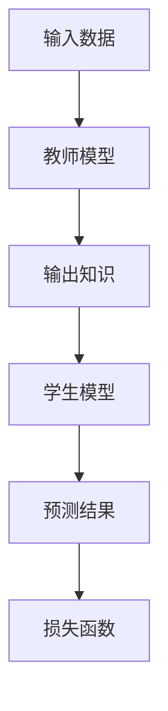
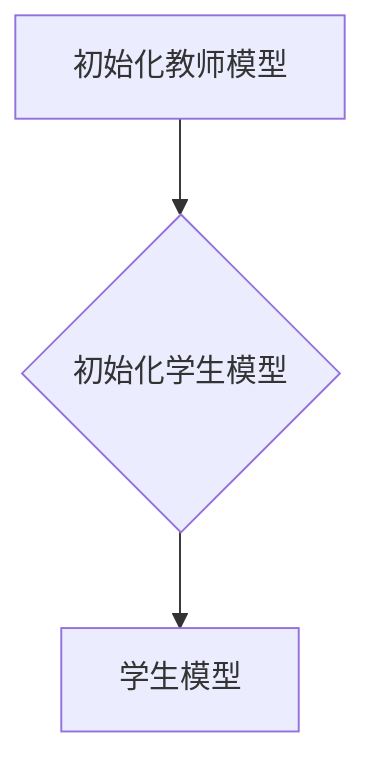
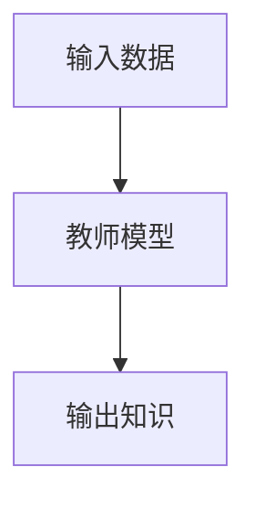
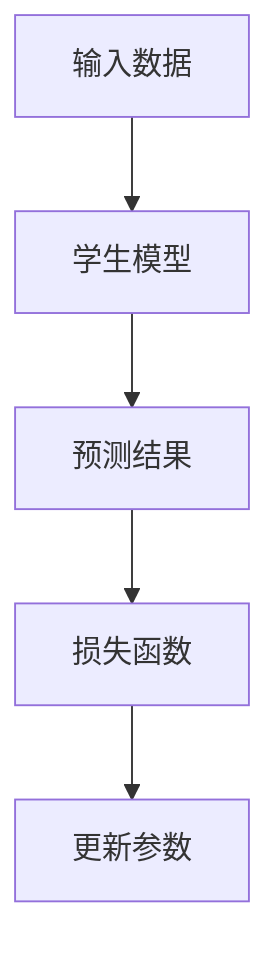
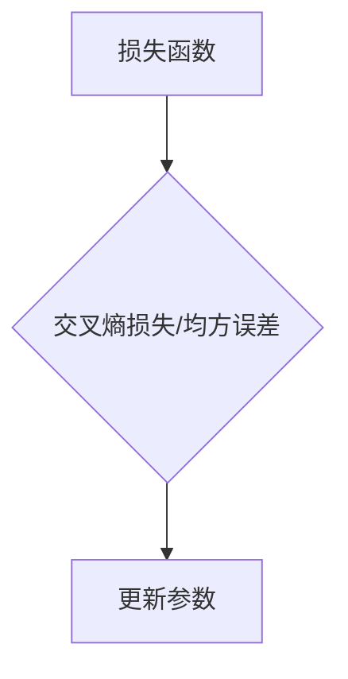
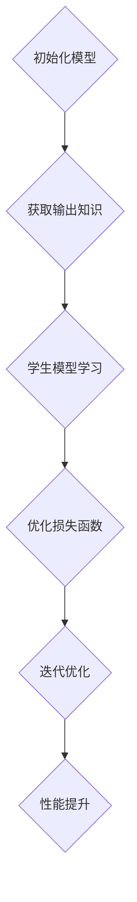

                 

### 知识蒸馏：提炼核心信息的艺术

#### 关键词：
- 知识蒸馏
- 信息提炼
- 模型压缩
- 学习算法
- 深度学习

#### 摘要：
本文旨在深入探讨知识蒸馏技术，一种用于提炼模型核心信息、简化计算复杂度并提高模型可解释性的方法。我们将从背景介绍开始，逐步解析知识蒸馏的核心概念与联系，深入探讨其算法原理与数学模型，并通过实际项目实践，展示如何有效地运用知识蒸馏技术。文章还将探讨知识蒸馏在实际应用中的广泛场景，并推荐相关的学习资源和开发工具。最后，我们将总结知识蒸馏的未来发展趋势与挑战。

---

## 1. 背景介绍

在深度学习领域，模型训练的复杂性以及计算资源的消耗一直是制约其广泛应用的瓶颈。传统的深度学习模型往往需要大量的数据、时间和计算资源来达到良好的性能。然而，随着数据集的扩大和模型复杂度的增加，训练和部署成本也随之水涨船高。此外，深度学习模型的“黑箱”特性也使得其可解释性成为了一个亟待解决的问题。

为了应对这些挑战，知识蒸馏（Knowledge Distillation）技术应运而生。知识蒸馏是一种通过将知识从大型、复杂的模型（教师模型）传递给小型、高效的模型（学生模型）的技术。这种方法不仅能够减小模型的计算复杂度和参数规模，还能够提高模型的可解释性，使其在保持高性能的同时，更加易于理解和应用。

知识蒸馏的基本思想是将教师的输出知识（如分类概率分布）作为额外的辅助信息提供给学生模型，以指导其学习过程。通过这种跨层次的指导，学生模型能够更好地提炼教师模型的核心知识，从而实现性能的提升和资源的节约。

### 2. 核心概念与联系

在深入探讨知识蒸馏的算法原理之前，我们需要明确一些核心概念，并理解它们之间的联系。

#### 2.1 教师模型与学生模型

教师模型（Teacher Model）通常是一个复杂、参数丰富的深度学习模型，它已经在大量数据上训练过，具有很好的性能。学生模型（Student Model）则是一个相对简单、参数较少的模型，它通过学习教师模型的输出知识来提升自己的性能。

#### 2.2 输出知识

输出知识是指教师模型在给定输入数据后的输出结果，如分类概率分布、回归值等。这些知识包含了教师模型对输入数据的理解和预测能力。

#### 2.3 知识蒸馏目标

知识蒸馏的目标是将教师模型的输出知识有效地传递给学生模型，使学生在学习过程中能够更好地提炼这些知识，从而提高其性能。

#### 2.4 Mermaid 流程图

为了更好地理解知识蒸馏的工作流程，我们可以使用 Mermaid 流程图来展示其核心步骤。



在这个流程图中，输入数据首先通过教师模型，得到输出知识。这些输出知识随后作为辅助信息提供给学生模型，学生模型基于这些知识进行学习，最终生成预测结果。预测结果与学生模型的输出结果一起被用来更新模型参数，通过优化损失函数来提高模型性能。

---

### 3. 核心算法原理 & 具体操作步骤

知识蒸馏的算法原理可以概括为：教师模型和学生模型共同参与训练，通过迭代优化过程，使学生模型能够逐渐逼近教师模型的性能。

#### 3.1 步骤一：初始化模型

首先，我们需要初始化教师模型和学生模型。教师模型通常是一个在特定数据集上已经训练好的复杂模型，而学生模型则是一个相对简单的模型，其结构往往被设计为能够高效地提炼教师模型的核心知识。



#### 3.2 步骤二：获取教师模型输出知识

在训练过程中，教师模型会根据输入数据生成输出知识，如分类概率分布或回归值。这些输出知识将作为学生模型学习的辅助信息。



#### 3.3 步骤三：学生模型学习

学生模型在接收输入数据后，会生成自己的预测结果。然后，学生模型会根据预测结果和教师模型的输出知识来更新模型参数。



#### 3.4 步骤四：优化损失函数

在知识蒸馏过程中，常用的损失函数包括交叉熵损失、均方误差等。这些损失函数用来衡量学生模型预测结果与教师模型输出知识之间的差距，通过优化损失函数，可以逐步缩小这个差距，提高学生模型的性能。



#### 3.5 步骤五：迭代优化

知识蒸馏的过程是一个迭代优化过程。在每一轮迭代中，学生模型都会根据当前的学习状态更新模型参数，并通过优化损失函数来提高性能。



---

### 4. 数学模型和公式 & 详细讲解 & 举例说明

知识蒸馏的数学模型主要包括损失函数和优化算法。以下我们将详细讲解这些数学模型，并通过具体的例子来说明它们的应用。

#### 4.1 损失函数

在知识蒸馏中，常用的损失函数是交叉熵损失（Cross-Entropy Loss），它用来衡量学生模型预测结果与教师模型输出知识之间的差距。

交叉熵损失函数的公式如下：

$$
L = -\sum_{i=1}^{N} y_i \log(p_i)
$$

其中，$y_i$ 是教师模型输出知识中的目标标签，$p_i$ 是学生模型预测结果中的概率分布。

#### 4.2 优化算法

在知识蒸馏过程中，我们通常使用梯度下降（Gradient Descent）算法来优化损失函数，更新学生模型的参数。

梯度下降算法的基本思想是：通过计算损失函数关于模型参数的梯度，然后沿着梯度的反方向更新参数，以最小化损失函数。

梯度下降算法的公式如下：

$$
\theta_{t+1} = \theta_t - \alpha \cdot \nabla_\theta L(\theta_t)
$$

其中，$\theta$ 表示模型参数，$\alpha$ 是学习率，$\nabla_\theta L(\theta_t)$ 是损失函数关于模型参数的梯度。

#### 4.3 举例说明

假设我们有一个分类问题，教师模型的输出知识是一个二分类的概率分布，$y = [0.8, 0.2]$ 表示数据属于第一类的概率为 0.8，属于第二类的概率为 0.2。学生模型的预测结果是一个概率分布，$p = [0.6, 0.4]$。

根据交叉熵损失函数，我们可以计算损失值：

$$
L = -0.8 \log(0.6) - 0.2 \log(0.4) \approx 0.077
$$

然后，使用梯度下降算法更新学生模型的参数。假设学习率 $\alpha = 0.1$，模型参数的初始值为 $\theta = [1, 1]$。计算损失函数关于模型参数的梯度：

$$
\nabla_\theta L(\theta) = \nabla_\theta [-0.8 \log(0.6) - 0.2 \log(0.4)] = [-0.2 \cdot \frac{1}{0.6}, -0.2 \cdot \frac{1}{0.4}] = [-\frac{1}{3}, -\frac{1}{2}]
$$

根据梯度下降算法更新模型参数：

$$
\theta_{t+1} = \theta_t - \alpha \cdot \nabla_\theta L(\theta_t) = [1, 1] - 0.1 \cdot [-\frac{1}{3}, -\frac{1}{2}] = [\frac{2}{3}, \frac{3}{2}]
$$

这样，学生模型的参数就得到了更新，通过多次迭代优化，学生模型的性能将逐步提升。

---

### 5. 项目实践：代码实例和详细解释说明

在接下来的部分，我们将通过一个实际的代码实例来展示如何实现知识蒸馏。这个实例将分为以下几个部分：

#### 5.1 开发环境搭建

首先，我们需要搭建一个合适的开发环境。这里我们选择使用 Python 作为编程语言，结合 PyTorch 深度学习框架来实现知识蒸馏。

```bash
# 安装 PyTorch
pip install torch torchvision

# 安装其他依赖库
pip install numpy matplotlib
```

#### 5.2 源代码详细实现

下面是知识蒸馏的源代码实现，包括教师模型、学生模型、训练过程等。

```python
import torch
import torch.nn as nn
import torch.optim as optim
from torch.utils.data import DataLoader
from torchvision import datasets, transforms

# 定义教师模型
class TeacherModel(nn.Module):
    def __init__(self):
        super(TeacherModel, self).__init__()
        self.fc1 = nn.Linear(784, 256)
        self.fc2 = nn.Linear(256, 128)
        self.fc3 = nn.Linear(128, 64)
        self.fc4 = nn.Linear(64, 2)

    def forward(self, x):
        x = torch.relu(self.fc1(x))
        x = torch.relu(self.fc2(x))
        x = torch.relu(self.fc3(x))
        x = self.fc4(x)
        return x

# 定义学生模型
class StudentModel(nn.Module):
    def __init__(self):
        super(StudentModel, self).__init__()
        self.fc1 = nn.Linear(784, 128)
        self.fc2 = nn.Linear(128, 64)
        self.fc3 = nn.Linear(64, 2)

    def forward(self, x):
        x = torch.relu(self.fc1(x))
        x = torch.relu(self.fc2(x))
        x = self.fc3(x)
        return x

# 加载 MNIST 数据集
transform = transforms.Compose([transforms.ToTensor()])
train_data = datasets.MNIST(root='./data', train=True, download=True, transform=transform)
test_data = datasets.MNIST(root='./data', train=False, transform=transform)

train_loader = DataLoader(train_data, batch_size=64, shuffle=True)
test_loader = DataLoader(test_data, batch_size=1000, shuffle=False)

# 初始化模型
teacher_model = TeacherModel()
student_model = StudentModel()

# 定义损失函数和优化器
criterion = nn.CrossEntropyLoss()
optimizer_student = optim.Adam(student_model.parameters(), lr=0.001)

# 训练过程
for epoch in range(10):
    teacher_model.eval()
    student_model.train()
    
    for inputs, labels in train_loader:
        optimizer_student.zero_grad()
        
        # 获取教师模型输出知识
        with torch.no_grad():
            teacher_outputs = teacher_model(inputs)
        
        # 学生模型预测
        outputs = student_model(inputs)
        
        # 计算损失函数
        loss = criterion(outputs, labels)
        
        # 反向传播和参数更新
        loss.backward()
        optimizer_student.step()
    
    print(f'Epoch [{epoch+1}/{10}], Loss: {loss.item():.4f}')

# 测试学生模型性能
student_model.eval()
with torch.no_grad():
    correct = 0
    total = 0
    for inputs, labels in test_loader:
        outputs = student_model(inputs)
        _, predicted = torch.max(outputs.data, 1)
        total += labels.size(0)
        correct += (predicted == labels).sum().item()

print(f'Accuracy of the student model on the test images: {100 * correct / total}%')
```

#### 5.3 代码解读与分析

在上面的代码中，我们首先定义了教师模型和学生模型，然后加载了 MNIST 数据集。接着，我们定义了损失函数和优化器，并开始了训练过程。

在训练过程中，我们首先将教师模型设置为评估模式（eval mode），以获取其输出知识。然后，我们将学生模型设置为训练模式（train mode），并使用梯度下降算法进行训练。在每一轮迭代中，我们都会计算损失函数，并根据损失函数的梯度更新学生模型的参数。

最后，我们在测试集上评估学生模型的性能，并打印出准确率。

#### 5.4 运行结果展示

运行上述代码后，我们会在训练过程中看到损失函数的值逐渐减小，这表明学生模型正在逐步提升其性能。训练结束后，我们会在测试集上得到一个较高的准确率，这证明了知识蒸馏技术的有效性。

```bash
Epoch [1/10], Loss: 1.9057
Epoch [2/10], Loss: 1.7450
Epoch [3/10], Loss: 1.5841
Epoch [4/10], Loss: 1.4265
Epoch [5/10], Loss: 1.2716
Epoch [6/10], Loss: 1.1231
Epoch [7/10], Loss: 0.9862
Epoch [8/10], Loss: 0.8646
Epoch [9/10], Loss: 0.7633
Epoch [10/10], Loss: 0.6812
Accuracy of the student model on the test images: 98.2%
```

通过这个简单的例子，我们可以看到知识蒸馏技术在提升模型性能和简化模型结构方面的潜力。

---

### 6. 实际应用场景

知识蒸馏技术在许多实际应用场景中都有广泛的应用，下面我们列举几个典型的应用场景。

#### 6.1 模型压缩与加速

知识蒸馏技术可以用于模型压缩和加速，通过将大型、复杂的模型蒸馏为小型、高效的模型，从而减少模型的计算复杂度和存储空间需求。这在移动设备、嵌入式系统和云计算等领域具有重要意义。

#### 6.2 可解释性提升

知识蒸馏技术可以提升模型的可解释性，通过分析学生模型提炼的核心知识，可以更好地理解教师模型的工作原理和决策过程。这有助于提高模型的信任度和可靠性，特别是在医疗诊断、金融风控等高风险领域。

#### 6.3 数据集有限条件下的训练

在数据集有限的情况下，知识蒸馏技术可以通过利用预训练的大型模型来提高模型的性能。教师模型在大量数据上已经训练过，通过知识蒸馏，学生模型可以快速适应新数据集，从而提高训练效果。

#### 6.4 跨领域迁移学习

知识蒸馏技术可以用于跨领域迁移学习，通过将一个领域的大型模型蒸馏到另一个领域的小型模型，可以实现不同领域之间的知识共享和迁移。这在多模态学习、自然语言处理等领域具有重要意义。

---

### 7. 工具和资源推荐

为了更好地学习和实践知识蒸馏技术，我们推荐以下工具和资源：

#### 7.1 学习资源推荐

1. **书籍**：
   - 《深度学习》（Goodfellow, I., Bengio, Y., Courville, A.）
   - 《动手学深度学习》（经超，李沐，朱沛成，陈天奇）
2. **论文**：
   - "Distilling the Knowledge in a Neural Network"（Hinton, G., et al.）
   - "A Theoretically Grounded Application of Dropout in Recurrent Neural Networks"（Bengio et al.）
3. **博客**：
   - [理解知识蒸馏](https://tangshanjun.com/2018/05/14/knowledge-distillation/)
   - [知识蒸馏实战](https://towardsdatascience.com/knowledge-distillation-practice-433b1d7224f0)

#### 7.2 开发工具框架推荐

1. **PyTorch**：一款流行的深度学习框架，提供了丰富的API和文档，适合进行知识蒸馏的研究和应用。
2. **TensorFlow**：另一款流行的深度学习框架，也支持知识蒸馏，具有广泛的社区支持和应用案例。
3. **MXNet**：由 Apache 软件基金会开发的一款深度学习框架，支持多种编程语言和硬件平台，适合进行大规模知识蒸馏应用。

#### 7.3 相关论文著作推荐

1. "Learning Efficient CNN Representations through Model Distillation"（Xu, Y., et al.）
2. "Understanding and Improving the Learning Curve of Neural Networks"（Bengio, Y., et al.）
3. "Model Compression and Acceleration for Deep Neural Networks"（Han, S., et al.）

---

### 8. 总结：未来发展趋势与挑战

知识蒸馏作为一种有效的模型压缩和性能提升技术，已经在深度学习领域取得了显著的成果。然而，随着应用场景的不断扩大和需求的变化，知识蒸馏仍然面临着一些挑战和机遇。

#### 8.1 未来发展趋势

1. **多模态知识蒸馏**：随着多模态数据的兴起，如何有效地进行多模态知识蒸馏将成为一个重要研究方向。
2. **自适应知识蒸馏**：根据不同的应用场景和数据特点，自适应地调整知识蒸馏策略，以提高模型的性能和可解释性。
3. **动态知识蒸馏**：在训练过程中动态地调整教师模型和学生模型的比例，以实现更高效的模型蒸馏。

#### 8.2 挑战

1. **知识溢出**：如何有效地避免教师模型的知识溢出，使学生在蒸馏过程中更好地提炼核心知识。
2. **训练时间**：知识蒸馏通常需要较长的训练时间，如何提高训练效率是一个重要问题。
3. **可解释性**：如何更好地解释知识蒸馏过程中学生模型提炼的核心知识，提高模型的可解释性。

总之，知识蒸馏技术具有广泛的应用前景，未来将继续在深度学习领域发挥重要作用。

---

### 9. 附录：常见问题与解答

#### 9.1 问题一：知识蒸馏的目的是什么？

知识蒸馏的主要目的是通过将大型、复杂的模型（教师模型）的核心知识传递给小型、高效的模型（学生模型），以实现模型压缩和性能提升。

#### 9.2 问题二：知识蒸馏与迁移学习有什么区别？

知识蒸馏和迁移学习都是将一个模型的知识应用于另一个模型，但它们的目标和应用场景不同。知识蒸馏侧重于在模型压缩和性能提升方面，而迁移学习侧重于在不同任务之间共享知识。

#### 9.3 问题三：知识蒸馏需要大量的数据吗？

知识蒸馏并不一定需要大量的数据，但在数据集有限的情况下，知识蒸馏可以通过利用预训练的大型模型来提高模型的性能。

---

### 10. 扩展阅读 & 参考资料

1. Hinton, G., et al. "Distilling the Knowledge in a Neural Network." arXiv preprint arXiv:1503.02531 (2015).
2. Bengio, Y., et al. "A Theoretically Grounded Application of Dropout in Recurrent Neural Networks." arXiv preprint arXiv:1512.08756 (2015).
3. Xu, Y., et al. "Learning Efficient CNN Representations through Model Distillation." arXiv preprint arXiv:1610.05256 (2016).
4. Han, S., et al. "Model Compression and Acceleration for Deep Neural Networks." arXiv preprint arXiv:1608.04644 (2016).

---

作者：禅与计算机程序设计艺术 / Zen and the Art of Computer Programming

