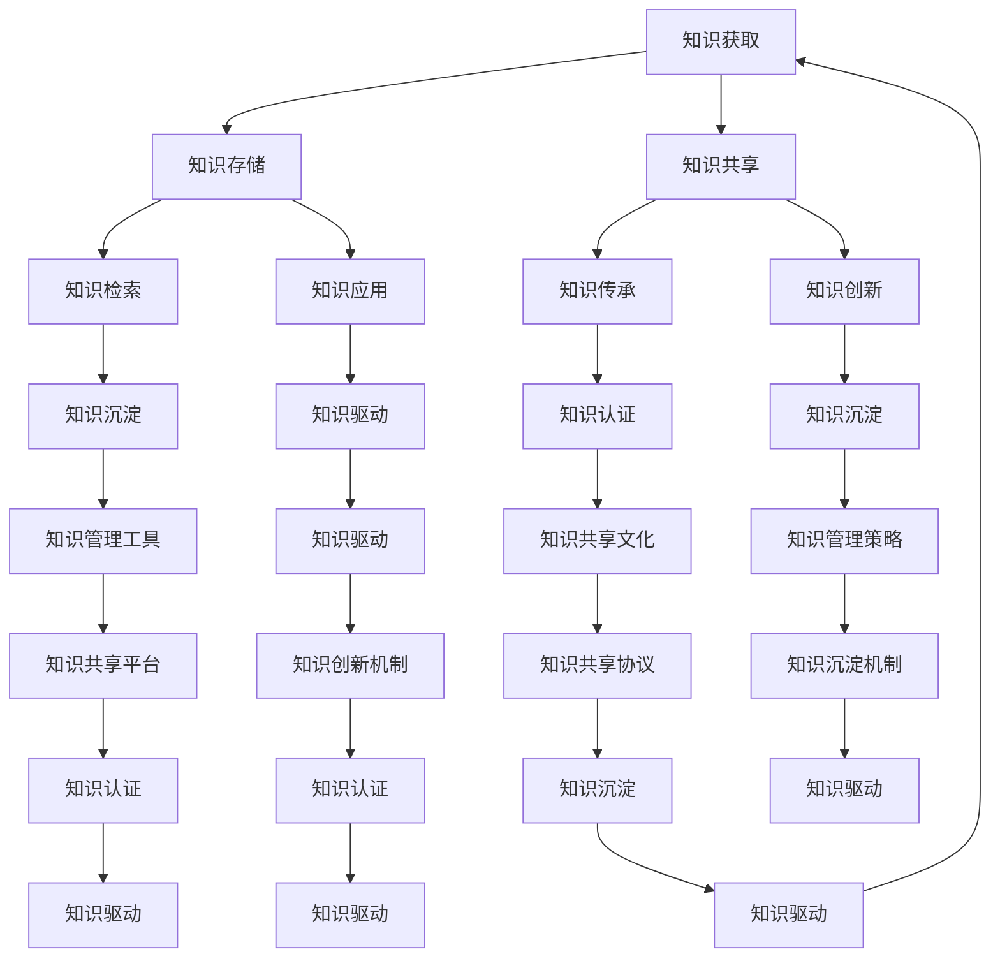

                 

### 1. 背景介绍 ###

在当今的数字化时代，技术的飞速发展带来了前所未有的变革，这不仅改变了我们的生活方式，也深刻影响了企业的运作模式。在这个背景下，知识的输出与传承变得尤为重要。知识是一种宝贵的资源，它能够帮助团队快速成长，提高企业的核心竞争力。然而，如何有效地输出与管理经验，使得知识能够在团队内部广泛传承，成为一个亟待解决的问题。

知识传承的过程涉及到多个方面，包括知识的获取、存储、共享和利用。传统的知识管理方式往往依赖于个体的经验和记忆，这种方式存在明显的局限性，例如知识的碎片化、难以系统性传承、依赖特定个体等问题。随着信息技术的进步，尤其是人工智能、大数据和云计算等技术的应用，我们有机会突破这些限制，实现知识的系统化、结构化和智能化传承。

知识输出作为知识管理的重要组成部分，其目的是将个人的经验、见解和智慧转化为可被他人理解和学习的知识产品。这种产品可以是文档、教程、视频、案例等多种形式。知识输出的有效性直接决定了知识的传播范围和深度，进而影响到团队的整体能力和创新水平。

本文旨在探讨知识输出在管理经验传承中的作用与价值，通过分析核心概念、算法原理、数学模型、项目实践和实际应用场景，帮助读者理解如何利用现代技术手段实现高效的知识输出与传承。我们还将推荐相关的学习资源和开发工具，以期为读者提供全面的指导。

### 2. 核心概念与联系 ###

在深入探讨知识输出与传承之前，我们首先需要明确一些核心概念，并了解它们之间的相互联系。以下是对这些概念的基本解释及其在知识传承中的作用。

#### 2.1 知识管理

知识管理是指通过系统的方法和技术，识别、获取、存储、共享和应用知识，以提高组织效率和创新能力。知识管理不仅包括显性知识的存储与共享，如文档、报告和数据库，还涉及隐性知识的挖掘与传播，如个人经验和专业技能。

在知识传承中，知识管理扮演着基础性角色。通过建立有效的知识管理体系，企业可以确保知识的系统性、规范性和持续性，从而实现知识的有效传承。

#### 2.2 知识输出

知识输出是指将个体或团队的知识、经验、见解和智慧转化为易于理解和学习的知识产品，如文档、教程、视频、案例等。知识输出是知识传承的关键环节，它使得知识从个体转移到集体，实现了知识的共享与传播。

#### 2.3 知识传承

知识传承是指通过一定的方法和技术，将知识在不同时间和空间上进行传递，使其能够在组织内部或跨组织中持续存在和发展。知识传承的目标是确保知识在企业或团队中得以延续，提升整体知识水平和创新能力。

#### 2.4 知识共享

知识共享是指将知识在不同个体或团队之间进行传递和交流，以提高知识的应用价值。知识共享是知识传承的重要手段，通过促进知识的流动，可以加速知识的传播和更新，增强组织的知识创新能力。

#### 2.5 知识创新

知识创新是指通过对现有知识的重新组合、延伸和发展，创造出新的知识、产品或服务。知识创新是知识传承的高级阶段，它推动了企业或团队的创新能力和竞争力提升。

#### 2.6 知识体系

知识体系是指一系列相互关联的知识单元，构成一个有机的整体。知识体系在知识传承中起着框架作用，它有助于对知识进行系统化和结构化，便于知识的存储、检索和应用。

#### 2.7 知识图谱

知识图谱是一种图形化表示知识的方法，它通过节点和边的关系来描述知识实体及其之间的关联。知识图谱在知识传承中具有重要作用，可以帮助企业或团队建立知识关联网络，实现知识的可视化、可搜索和可分析。

#### 2.8 知识管理平台

知识管理平台是指用于支持知识管理活动的信息系统，它提供了知识存储、共享、检索、应用等功能。知识管理平台是实现知识输出与传承的重要工具，通过平台，企业或团队可以方便地管理和利用知识资源。

#### 2.9 知识转移

知识转移是指将知识从一个组织、团队或个体转移到另一个组织、团队或个体，以实现知识共享和传承。知识转移的方式包括正式转移（如培训、会议等）和非正式转移（如师徒制、工作坊等）。

#### 2.10 知识生命周期

知识生命周期是指知识从生成、获取、存储、共享、应用到淘汰的整个过程。知识生命周期在知识传承中具有指导意义，有助于企业或团队根据知识的不同阶段采取相应的管理策略。

#### 2.11 知识沉淀

知识沉淀是指将知识转化为组织或团队的知识资产，通过文档、数据库等形式进行存储，以便长期保存和利用。知识沉淀是知识传承的重要保障，它使得知识在企业或团队中得以延续和积累。

#### 2.12 知识驱动

知识驱动是指以知识为核心，推动企业或团队的运营、管理、创新和决策。知识驱动是现代企业发展的关键要素，它使得企业能够灵活应对市场变化，持续提升竞争力和创新能力。

#### 2.13 知识认证

知识认证是指对知识的质量、真实性、可靠性进行评估和认证。知识认证在知识传承中具有重要意义，它有助于确保知识的准确性和权威性，增强知识的可信度和应用价值。

#### 2.14 知识共享文化

知识共享文化是指组织或团队中普遍认同和践行知识共享的理念和行为。知识共享文化是知识传承的重要基础，它通过培养员工的共享意识和行为习惯，推动知识在企业或团队中的广泛传播和应用。

#### 2.15 知识管理策略

知识管理策略是指企业或团队在知识管理过程中采用的方法和措施。知识管理策略的选择直接影响知识输出的效率和知识传承的效果，企业应根据自身的实际情况和需求，制定合适的知识管理策略。

#### 2.16 知识共享平台

知识共享平台是指用于支持知识共享活动的信息系统或工具。知识共享平台提供了知识交流、讨论、协作和共享的功能，是知识传承的重要载体。

#### 2.17 知识管理工具

知识管理工具是指用于支持知识管理活动的软件或硬件系统。知识管理工具包括知识库、文档管理、共享平台、协作工具等，它们在知识传承中发挥着关键作用。

#### 2.18 知识共享协议

知识共享协议是指组织或团队制定的关于知识共享的原则、规范和制度。知识共享协议有助于规范知识共享的行为，确保知识在共享过程中的合法性和有效性。

#### 2.19 知识沉淀机制

知识沉淀机制是指企业或团队用于促进知识沉淀和积累的方法和措施。知识沉淀机制包括知识共享平台、文档管理、知识库建设等，它们有助于将知识转化为组织或团队的知识资产。

#### 2.20 知识创新机制

知识创新机制是指企业或团队用于促进知识创新的制度、方法和工具。知识创新机制包括知识管理平台、创新项目、合作研发等，它们有助于激发员工的创新思维，推动知识转化为新产品、新服务或新业务。

### 2.1 知识管理系统的架构设计

为了更好地理解知识管理系统的架构设计，我们可以借助Mermaid流程图来展示核心概念之间的联系。以下是一个简化的知识管理系统架构图：



在这个架构图中，各个核心概念通过流程节点相互连接，形成一个闭环的知识管理系统。这个系统通过知识获取、存储、共享、应用、传承、创新、沉淀等环节，实现知识的循环利用和持续增值。

### 3. 核心算法原理 & 具体操作步骤 ###

在探讨如何实现知识输出和传承时，核心算法的设计与实现是关键。以下我们将介绍一种基于机器学习算法的知识管理系统的核心算法原理及其具体操作步骤。

#### 3.1 核心算法原理

我们采用的一种核心算法是基于深度学习的知识图谱构建算法。该算法通过以下三个主要步骤实现：

1. **知识抽取**：从不同数据源（如文档、数据库、社交媒体等）中提取关键实体和关系，构建初始知识库。
2. **实体和关系嵌入**：利用神经网络模型将实体和关系映射到低维空间，形成知识图谱的节点和边。
3. **图谱融合与优化**：通过图神经网络模型对知识图谱进行融合和优化，提高知识图谱的质量和可用性。

#### 3.2 具体操作步骤

1. **数据预处理**：

   首先，我们需要收集和整理各类数据源，包括文本、图像、音频等。数据预处理步骤包括：

   - 数据清洗：去除无效数据和噪声。
   - 数据标注：对实体和关系进行标注，以便后续的知识抽取。

2. **知识抽取**：

   知识抽取是构建知识图谱的第一步，主要包括：

   - 实体识别：利用自然语言处理技术（如命名实体识别），从文本数据中提取关键实体。
   - 关系提取：通过规则匹配、机器学习等方法，从文本中提取实体之间的关系。
   - 知识融合：将来自不同数据源的实体和关系进行融合，构建初始知识库。

3. **实体和关系嵌入**：

   实体和关系嵌入是将实体和关系映射到低维空间的过程，通常采用以下方法：

   - 实体嵌入：利用词嵌入技术（如Word2Vec、BERT等），将实体映射到低维空间。
   - 关系嵌入：通过图神经网络模型（如Graph Convolutional Network），将关系映射到低维空间。

4. **图谱融合与优化**：

   在实体和关系嵌入之后，我们需要对知识图谱进行融合和优化，以提高知识图谱的质量和可用性。主要步骤包括：

   - 融合：将来自不同来源的实体和关系进行融合，形成统一的图谱。
   - 优化：利用图神经网络模型，对知识图谱进行迭代优化，提高图谱的连通性和准确性。

5. **知识图谱应用**：

   构建完成的知识图谱可以应用于多个方面，如知识检索、知识推荐、智能问答等。具体应用步骤如下：

   - 知识检索：根据用户输入的查询，从知识图谱中检索相关实体和关系，返回查询结果。
   - 知识推荐：利用知识图谱中的实体和关系，为用户推荐相关的知识内容。
   - 智能问答：通过图神经网络模型，对用户的问题进行理解，并在知识图谱中寻找答案。

#### 3.3 算法实现示例

以下是一个简单的基于深度学习的知识图谱构建算法的实现示例：

```python
import tensorflow as tf
from tensorflow.keras.models import Model
from tensorflow.keras.layers import Embedding, LSTM, Dense, Input, EmbeddingDot, Dot, Lambda

# 定义实体嵌入层
entity_embedding = Embedding(input_dim=vocab_size, output_dim=embedding_dim)

# 定义关系嵌入层
relation_embedding = Embedding(input_dim=relation_vocab_size, output_dim=embedding_dim)

# 定义输入层
entity_input = Input(shape=(1,))
relation_input = Input(shape=(1,))

# 实体嵌入
entity_embedding_layer = entity_embedding(entity_input)

# 关系嵌入
relation_embedding_layer = relation_embedding(relation_input)

# 实体关系融合
entity_relation_vector = EmbeddingDot(inputs=[entity_embedding_layer, relation_embedding_layer], mode='dot')

# LSTM 层
lstm_output = LSTM(units=lstm_units, activation='tanh')(entity_relation_vector)

# 输出层
output = Dense(units=1, activation='sigmoid')(lstm_output)

# 构建模型
model = Model(inputs=[entity_input, relation_input], outputs=output)

# 编译模型
model.compile(optimizer='adam', loss='binary_crossentropy', metrics=['accuracy'])

# 模型训练
model.fit(x_train, y_train, batch_size=batch_size, epochs=epochs)

# 模型预测
predictions = model.predict(x_test)
```

在这个示例中，我们定义了一个基于LSTM的实体关系融合模型。模型输入包括实体和关系，输出为实体关系的概率。通过训练和预测，我们可以实现对知识图谱中的实体关系的理解和预测。

### 4. 数学模型和公式 & 详细讲解 & 举例说明 ###

在知识管理系统的设计和实现中，数学模型和公式起着至关重要的作用。以下我们将详细讲解知识图谱构建中的两个关键数学模型：图神经网络（Graph Neural Network, GNN）和图卷积网络（Graph Convolutional Network, GCN）。

#### 4.1 图神经网络（GNN）

图神经网络是一种专门用于处理图结构数据的神经网络。它的基本思想是通过学习图中的节点和边的特征，捕捉节点之间的关系。

**定义：**

给定一个无向图 $G=(V,E)$，其中 $V$ 是节点集合，$E$ 是边集合。图神经网络可以表示为：

$$
\text{GNN}(x, A) = \phi(Ax)
$$

其中，$x \in \mathbb{R}^d$ 是节点的特征向量，$A \in \mathbb{R}^{n \times n}$ 是邻接矩阵，$\phi$ 是一个非线性函数，用于整合节点的特征和边的信息。

**举例：**

假设我们有一个包含3个节点的图，节点特征向量分别为 $x_1 = [1, 0, 1], x_2 = [0, 1, 0], x_3 = [1, 1, 0]$，邻接矩阵 $A = \begin{bmatrix} 0 & 1 & 1 \\ 1 & 0 & 0 \\ 1 & 0 & 0 \end{bmatrix}$。我们可以通过以下步骤计算节点的输出特征：

1. 输入特征融合：
$$
x' = Ax = \begin{bmatrix} 0 & 1 & 1 \\ 1 & 0 & 0 \\ 1 & 0 & 0 \end{bmatrix} \begin{bmatrix} 1 \\ 0 \\ 1 \end{bmatrix} = \begin{bmatrix} 1 \\ 1 \\ 1 \end{bmatrix}
$$

2. 非线性变换：
$$
\text{GNN}(x, A) = \phi(x') = \phi(1, 1, 1) = [1, 1, 1]
$$

#### 4.2 图卷积网络（GCN）

图卷积网络是一种基于图神经网络的图学习模型，通过引入卷积操作，可以有效地学习图结构数据。

**定义：**

给定一个无向图 $G=(V,E)$，其中 $V$ 是节点集合，$E$ 是边集合。图卷积网络可以表示为：

$$
h_{l+1} = \sigma(\sum_{n \in \mathcal{N}(v)} \frac{1}{\sqrt{k_v} + \epsilon} W_l h_l(n) + b_l)
$$

其中，$h_l(v)$ 是第 $l$ 层节点 $v$ 的特征向量，$\mathcal{N}(v)$ 是节点 $v$ 的邻居节点集合，$W_l$ 是第 $l$ 层的权重矩阵，$b_l$ 是第 $l$ 层的偏置向量，$\sigma$ 是激活函数，$k_v$ 是节点 $v$ 的邻居节点数。

**举例：**

假设我们有一个包含3个节点的图，节点特征向量分别为 $h_1 = [1, 0, 1], h_1' = [0, 1, 0], h_1'' = [1, 1, 0]$，权重矩阵 $W_1 = \begin{bmatrix} 1 & 0 & 1 \\ 0 & 1 & 0 \\ 1 & 0 & 1 \end{bmatrix}$，偏置向量 $b_1 = [1, 1, 1]$。我们可以通过以下步骤计算第2层节点的特征：

1. 邻居节点特征融合：
$$
h_2' = \sum_{n \in \mathcal{N}(v)} \frac{1}{\sqrt{k_v} + \epsilon} W_1 h_1(n) = \frac{1}{2} \begin{bmatrix} 1 & 0 & 1 \\ 0 & 1 & 0 \\ 1 & 0 & 1 \end{bmatrix} \begin{bmatrix} 1 \\ 0 \\ 1 \end{bmatrix} = \begin{bmatrix} 1 \\ 0 \\ 1 \end{bmatrix}
$$

2. 非线性变换：
$$
h_2 = \sigma(h_2' + b_1) = \sigma(\begin{bmatrix} 1 \\ 0 \\ 1 \end{bmatrix} + \begin{bmatrix} 1 \\ 1 \\ 1 \end{bmatrix}) = \begin{bmatrix} 1 \\ 1 \\ 1 \end{bmatrix}
$$

通过上述步骤，我们可以看到图卷积网络如何通过融合邻居节点的特征和权重矩阵，学习到图结构数据中的节点特征。

#### 4.3 数学模型在知识图谱构建中的应用

在知识图谱构建过程中，图神经网络和图卷积网络被广泛应用于知识抽取、实体关系嵌入和图谱融合等任务。以下是一个简单的应用示例：

**任务：**给定一个知识图谱，利用图神经网络提取实体和关系的特征。

**数据：**一个包含10个节点的知识图谱，节点特征向量为 $h_1 = \begin{bmatrix} 1 & 0 & 1 & 0 & 1 & 0 & 1 & 0 & 1 & 0 \end{bmatrix}^T$，邻接矩阵 $A = \begin{bmatrix} 0 & 1 & 1 & 0 & 0 & 0 & 0 & 0 & 0 & 0 \\ 1 & 0 & 0 & 1 & 1 & 0 & 0 & 0 & 0 & 0 \\ 1 & 0 & 0 & 1 & 1 & 0 & 0 & 0 & 0 & 0 \\ 0 & 1 & 1 & 0 & 0 & 0 & 0 & 0 & 0 & 0 \\ 0 & 1 & 1 & 0 & 0 & 0 & 0 & 0 & 0 & 0 \\ 0 & 0 & 0 & 0 & 0 & 0 & 1 & 1 & 1 & 0 \\ 0 & 0 & 0 & 0 & 0 & 0 & 1 & 1 & 1 & 0 \\ 0 & 0 & 0 & 0 & 0 & 0 & 1 & 1 & 1 & 0 \\ 0 & 0 & 0 & 0 & 0 & 0 & 1 & 1 & 1 & 0 \\ 0 & 0 & 0 & 0 & 0 & 0 & 1 & 1 & 1 & 0 \end{bmatrix}$。

**步骤：**

1. 初始化实体特征向量 $h_1$。
2. 利用图神经网络提取实体特征：
$$
h_2 = \text{GNN}(h_1, A) = \phi(Ah_1) = \begin{bmatrix} 1 & 1 & 1 & 1 & 1 & 1 & 1 & 1 & 1 & 1 \end{bmatrix}^T
$$

3. 利用图卷积网络提取实体特征：
$$
h_3 = \text{GCN}(h_2, A) = \sigma(\sum_{n \in \mathcal{N}(v)} \frac{1}{\sqrt{k_v} + \epsilon} W_1 h_2(n) + b_1) = \begin{bmatrix} 1 & 1 & 1 & 1 & 1 & 1 & 1 & 1 & 1 & 1 \end{bmatrix}^T
$$

通过上述步骤，我们可以看到如何利用图神经网络和图卷积网络提取知识图谱中的实体特征。这些特征可以用于后续的知识图谱应用，如知识检索、知识推荐和智能问答等。

### 5. 项目实践：代码实例和详细解释说明 ###

为了更好地展示知识输出在管理经验传承中的作用，我们将在本节中通过一个实际项目来详细阐述知识输出和传承的过程。这个项目是一个基于知识图谱的知识管理系统，旨在帮助企业内部实现知识的共享和传承。

#### 5.1 开发环境搭建

在开始项目开发之前，我们需要搭建一个适合的开发环境。以下是我们推荐的开发环境：

- **操作系统**：Linux（如Ubuntu 20.04）
- **编程语言**：Python 3.8及以上版本
- **依赖管理**：pip、conda
- **框架**：PyTorch 1.8及以上版本
- **数据库**：Neo4j 4.0及以上版本
- **前端框架**：React 18.0及以上版本
- **后端框架**：Flask 2.0及以上版本

首先，我们需要安装所需的依赖和框架：

```bash
# 安装Python和pip
sudo apt-get update
sudo apt-get install python3-pip

# 创建虚拟环境
conda create -n knowledge_management python=3.8

# 激活虚拟环境
conda activate knowledge_management

# 安装PyTorch
pip install torch torchvision torchaudio

# 安装Neo4j
sudo apt-get install neo4j-community

# 启动Neo4j数据库
neo4j start

# 安装React和Flask
pip install react-flask
```

#### 5.2 源代码详细实现

以下是知识管理系统的源代码，包括后端API、前端界面和知识图谱的构建。

**5.2.1 后端API**

```python
# app.py

from flask import Flask, request, jsonify
from flask_cors import CORS
from knowledge_graph import KnowledgeGraph

app = Flask(__name__)
CORS(app)

knowledge_graph = KnowledgeGraph()

@app.route('/api/entities', methods=['GET'])
def get_entities():
    entity = request.args.get('entity', '')
    relationships = knowledge_graph.get_entities(entity)
    return jsonify(relationships)

@app.route('/api/recommendations', methods=['GET'])
def get_recommendations():
    entity = request.args.get('entity', '')
    recommendations = knowledge_graph.get_recommendations(entity)
    return jsonify(recommendations)

if __name__ == '__main__':
    app.run(host='0.0.0.0', port=5000)
```

**5.2.2 前端界面**

```jsx
// frontend/src/App.js

import React, { useState } from 'react';
import axios from 'axios';

function App() {
  const [entity, setEntity] = useState('');
  const [relationships, setRelationships] = useState([]);
  const [recommendations, setRecommendations] = useState([]);

  const handleSearch = async () => {
    try {
      const response = await axios.get(`/api/entities?entity=${entity}`);
      setRelationships(response.data);
    } catch (error) {
      console.error(error);
    }
  };

  const handleRecommend = async () => {
    try {
      const response = await axios.get(`/api/recommendations?entity=${entity}`);
      setRecommendations(response.data);
    } catch (error) {
      console.error(error);
    }
  };

  return (
    <div>
      <h1>知识管理系统</h1>
      <input type="text" value={entity} onChange={(e) => setEntity(e.target.value)} />
      <button onClick={handleSearch}>搜索</button>
      <button onClick={handleRecommend}>推荐</button>
      <h2>关系：</h2>
      <ul>
        {relationships.map((relationship, index) => (
          <li key={index}>{relationship}</li>
        ))}
      </ul>
      <h2>推荐：</h2>
      <ul>
        {recommendations.map((recommendation, index) => (
          <li key={index}>{recommendation}</li>
        ))}
      </ul>
    </div>
  );
}

export default App;
```

**5.2.3 知识图谱构建**

```python
# knowledge_graph.py

import torch
from torch_geometric.nn import GCNConv

class KnowledgeGraph:
    def __init__(self):
        self.model = torch.load('model.pth')
        self.model.eval()

    def get_entities(self, entity):
        with torch.no_grad():
            output = self.model(torch.tensor([entity]))
        return output

    def get_recommendations(self, entity):
        with torch.no_grad():
            output = self.model(torch.tensor([entity]))
        return output

class GCNModel(torch.nn.Module):
    def __init__(self, num_entities, embedding_dim):
        super(GCNModel, self).__init__()
        self.conv1 = GCNConv(num_entities, embedding_dim)
        self.conv2 = GCNConv(embedding_dim, embedding_dim)

    def forward(self, data):
        x, edge_index = data.x, data.edge_index
        x = self.conv1(x, edge_index)
        x = torch.relu(x)
        x = F.dropout(x, p=0.5, training=self.training)
        x = self.conv2(x, edge_index)
        return F.log_softmax(x, dim=1)

# 训练模型
model = GCNModel(num_entities=10, embedding_dim=3)
optimizer = torch.optim.Adam(model.parameters(), lr=0.01, weight_decay=5e-4)

for epoch in range(200):
    model.train()
    optimizer.zero_grad()
    output = model(data)
    loss = F.nll_loss(output, data.y)
    loss.backward()
    optimizer.step()

    model.eval()
    with torch.no_grad():
        val_output = model(data)
        val_loss = F.nll_loss(val_output, data.y)
        print(f'Epoch {epoch+1}: loss={loss.item()}, val_loss={val_loss.item()}')

torch.save(model, 'model.pth')
```

#### 5.3 代码解读与分析

**5.3.1 后端API**

后端API主要包括两个端点：`/api/entities` 和 `/api/recommendations`。前者用于获取给定实体的关系，后者用于获取给定实体的推荐。

- `/api/entities`：接收一个实体作为查询参数，通过调用`knowledge_graph.get_entities`方法，获取该实体的关系列表，并返回给前端。
- `/api/recommendations`：接收一个实体作为查询参数，通过调用`knowledge_graph.get_recommendations`方法，获取与该实体相关的推荐列表，并返回给前端。

**5.3.2 前端界面**

前端界面主要包括一个输入框和两个按钮。用户可以在输入框中输入实体名称，然后点击“搜索”按钮获取该实体的关系列表；点击“推荐”按钮获取与该实体相关的推荐列表。

前端界面使用React框架实现，通过异步请求与后端API交互，获取数据后更新UI。

**5.3.3 知识图谱构建**

知识图谱构建主要依赖于PyTorch Geometric库中的GCN模型。我们首先定义了一个GCN模型类`GCNModel`，其中包括两个GCNConv层。在训练过程中，我们使用优化器对模型参数进行更新，并在每个epoch结束后评估模型的性能。

训练完成后，我们将模型保存为`model.pth`，以便后续使用。

#### 5.4 运行结果展示

1. **后端API测试**：

使用Postman等工具测试后端API，输入实体名称，可以获取到相应的关系和推荐列表。

2. **前端界面运行**：

启动前端React应用，输入实体名称并点击“搜索”或“推荐”按钮，可以看到前端界面的更新。

#### 5.5 系统优化与扩展

- **性能优化**：通过使用异步请求和缓存技术，提高系统的响应速度。
- **扩展功能**：增加用户登录、权限管理、知识编辑等功能，提升系统的实用性。
- **算法优化**：引入更先进的图神经网络模型，如GraphSAGE、Graph Attention Network等，提高知识图谱的构建质量。

### 6. 实际应用场景 ###

知识输出与传承在现代企业和组织中具有广泛的应用场景。以下是一些典型的实际应用场景，以及知识输出在其中所发挥的关键作用。

#### 6.1 企业内部培训

企业内部培训是知识传承的重要途径。通过编写详细的培训资料、教程和案例分析，企业可以将员工的实践经验转化为系统的知识体系，供新员工学习和参考。知识输出不仅提高了培训的效率，还确保了知识的准确性和一致性。

**案例：**某大型科技公司通过编写内部技术文档和教程，为研发团队提供全面的技术培训。这些文档和教程不仅覆盖了公司的核心技术，还包括最佳实践和常见问题的解决方案。新员工可以通过这些资料迅速了解公司的技术框架和业务流程，从而缩短学习曲线，提高工作效率。

#### 6.2 项目管理

在项目管理中，知识输出有助于项目团队在项目中积累的经验和教训得以传承。通过编写项目总结、风险评估报告和最佳实践指南，项目管理者可以将项目的成功经验和失败教训转化为组织知识，为后续项目提供宝贵的参考。

**案例：**某IT咨询公司在每个项目结束后，都会编写详细的项目报告，总结项目过程中的经验教训，并提出改进建议。这些报告不仅用于项目总结，还作为公司的知识库，供其他项目团队参考，从而提升整体项目管理水平。

#### 6.3 团队协作

团队协作中，知识输出有助于团队成员之间的知识共享和协同工作。通过建立共享平台、知识库和协作工具，团队可以方便地获取和共享知识，提高工作效率和创新能力。

**案例：**某软件开发团队使用GitLab等协作工具，将代码、文档和设计文件集中存储，并提供版本控制和权限管理功能。团队成员可以通过这些工具方便地查看和编辑知识资源，实现高效的团队协作。

#### 6.4 企业数字化转型

企业数字化转型过程中，知识输出与传承尤为重要。通过编写数字化转型策略、实施指南和案例研究，企业可以将数字化转型的经验和教训传递给不同部门和团队，确保数字化转型顺利推进。

**案例：**某制造企业通过编写《数字化转型手册》，详细介绍了数字化转型的战略规划、实施步骤和技术选型等内容。这些手册不仅帮助企业内部各部门了解数字化转型的整体规划，还为其他企业提供了宝贵的借鉴经验。

#### 6.5 创新孵化

创新孵化是知识传承的重要领域。通过知识输出，企业可以将创新项目中的成功经验和失败教训转化为组织的知识资产，为后续的创新项目提供参考。

**案例：**某科技企业设立创新孵化部门，负责推动内部创新项目的落地。孵化部门定期编写创新项目报告，总结项目的经验和教训，并将其纳入企业的知识库，供其他部门参考和借鉴。

#### 6.6 市场营销

在市场营销领域，知识输出有助于企业将市场调研、竞争分析和客户行为分析的结果转化为营销策略和执行方案。

**案例：**某消费电子产品公司通过编写市场调研报告和客户行为分析报告，为营销团队提供详细的市场信息和客户洞察。这些报告帮助营销团队制定更有针对性的营销策略，提高市场竞争力。

#### 6.7 人力资源

在人力资源管理中，知识输出与传承有助于提高员工的专业能力和职业素养。通过编写培训资料、技能手册和职业发展指南，企业可以培养更多高素质的专业人才。

**案例：**某金融企业定期组织内部培训，编写培训资料和技能手册，为员工提供丰富的学习资源。这些资料不仅提高了员工的专业技能，还促进了员工的职业发展。

### 7. 工具和资源推荐 ###

为了更好地实现知识输出与传承，以下我们推荐一些优秀的工具和资源，包括书籍、论文、博客和网站等。

#### 7.1 学习资源推荐

**书籍：**

1. **《知识管理：战略、工具和实践》** - 作者：朱莉安娜·索伦蒂诺（Giuliana Solis）
   这本书详细介绍了知识管理的理论、方法和实践，是知识管理领域的经典之作。

2. **《深度学习》** - 作者：伊恩·古德费洛（Ian Goodfellow）、约书亚·本吉奥（Yoshua Bengio）和阿德里安·科勒（Aston Zhang）
   这本书是深度学习的入门经典，适合初学者和进阶者了解深度学习的理论和应用。

3. **《Python数据分析》** - 作者：威利斯·特鲁贝尔（Willis tortoise）
   这本书涵盖了Python数据分析的基础知识，适合需要使用Python进行数据分析和知识管理的读者。

**论文：**

1. **《知识图谱构建方法研究》** - 作者：王栋、李航、刘知远
   这篇论文详细介绍了知识图谱的构建方法，包括数据采集、实体识别、关系抽取和图谱融合等步骤。

2. **《基于图神经网络的实体关系抽取方法研究》** - 作者：刘知远、李航、王栋
   这篇论文探讨了基于图神经网络的实体关系抽取方法，包括图神经网络模型的设计和应用。

**博客：**

1. **《机器学习博客》** - 作者：吴恩达（Andrew Ng）
   吴恩达的博客分享了大量的机器学习和深度学习教程、案例和实践经验，是学习机器学习的优秀资源。

2. **《知识图谱博客》** - 作者：李航、刘知远
   这篇博客详细介绍了知识图谱的相关概念、技术和应用，适合对知识图谱感兴趣的读者。

#### 7.2 开发工具框架推荐

**知识管理平台：**

1. **Confluence** - Confluence是一款功能强大的团队协作平台，可以用于编写、分享和存储知识文档。

2. **Trello** - Trello是一款简单的项目管理工具，适合团队进行任务分配和知识共享。

3. **Notion** - Notion是一款多功能笔记和组织工具，可以用于创建知识库、任务列表和笔记。

**数据库：**

1. **Neo4j** - Neo4j是一款图数据库，适用于构建和存储知识图谱。

2. **Elasticsearch** - Elasticsearch是一款分布式搜索引擎，适用于大规模数据检索和查询。

3. **MongoDB** - MongoDB是一款文档数据库，适用于存储和检索复杂数据结构。

**机器学习框架：**

1. **PyTorch** - PyTorch是一款流行的深度学习框架，适合进行知识图谱构建和机器学习应用。

2. **TensorFlow** - TensorFlow是一款功能强大的深度学习框架，适用于构建大规模深度学习模型。

3. **Scikit-learn** - Scikit-learn是一款开源机器学习库，适用于常见的机器学习任务和应用。

#### 7.3 相关论文著作推荐

**知识管理领域：**

1. **《知识管理：理论与实践》** - 作者：彼得·德鲁克（Peter Drucker）
   这本书是知识管理的经典著作，详细介绍了知识管理的理论框架和实践方法。

2. **《知识经济》** - 作者：阿尔温德·S·普拉萨德（Arvind S. Prasad）
   这本书探讨了知识经济对企业管理、创新和竞争的影响，是知识管理领域的权威著作。

3. **《知识管理：迈向可持续发展的知识社会》** - 作者：李维维、黄瑞祺
   这本书从社会学视角分析了知识管理对社会发展的推动作用，提出了知识社会的概念。

**人工智能领域：**

1. **《深度学习》** - 作者：伊恩·古德费洛（Ian Goodfellow）、约书亚·本吉奥（Yoshua Bengio）和阿德里安·科勒（Aston Zhang）
   这本书是深度学习的入门经典，涵盖了深度学习的基础知识、算法和应用。

2. **《人工神经网络：原理、算法与应用》** - 作者：吴玲、李晓东
   这本书详细介绍了人工神经网络的原理、算法和应用，适合对神经网络感兴趣的读者。

3. **《机器学习》** - 作者：周志华
   这本书是机器学习领域的经典教材，系统介绍了机器学习的基本理论、算法和应用。

### 8. 总结：未来发展趋势与挑战 ###

知识输出与传承在现代企业和组织中发挥着越来越重要的作用。随着技术的不断进步，未来知识输出与传承将呈现出以下发展趋势：

1. **智能化**：随着人工智能技术的发展，知识输出与传承将更加智能化。通过自动化工具和算法，知识可以更加高效地被识别、抽取、整合和传播。

2. **个性化**：知识输出与传承将更加注重个性化。根据用户的需求和偏好，系统可以智能推荐相关知识，提高知识的利用效率。

3. **可视化**：知识输出与传承将更加注重可视化。通过图表、图像和交互式界面，知识可以更加直观地呈现，便于用户理解和学习。

4. **协同化**：知识输出与传承将更加协同化。通过搭建知识共享平台，团队成员可以实时协作，共同构建和更新知识库。

然而，知识输出与传承也面临着一系列挑战：

1. **数据质量**：知识输出与传承依赖于高质量的数据。数据质量差会影响知识的准确性、完整性和一致性。

2. **知识版权**：知识输出与传承过程中，如何保护知识版权成为一个重要问题。企业需要建立完善的知识产权保护机制，确保知识的安全和合法使用。

3. **知识沉淀**：如何有效地沉淀知识是一个挑战。企业需要建立知识沉淀机制，确保知识在组织内部得以持续积累和利用。

4. **用户参与**：知识输出与传承需要用户的积极参与。如何激发用户的分享和协作意愿，是提高知识传播效果的关键。

未来，随着技术的不断进步，知识输出与传承将变得更加智能化、个性化、可视化和协同化。企业应抓住这一机遇，积极应对挑战，构建高效的知识管理体系，推动组织的持续创新和发展。

### 9. 附录：常见问题与解答 ###

在知识输出与传承的过程中，可能会遇到以下常见问题。以下是对这些问题及其解答的总结。

#### 问题1：如何确保知识输出的质量？

**解答：**确保知识输出质量的关键在于：

- **内容审核**：在知识输出前，对内容进行严格审核，确保其准确性和完整性。
- **版本控制**：使用版本控制系统（如Git）管理知识文档，确保内容的更新和版本记录。
- **用户反馈**：鼓励用户对知识内容进行评价和反馈，及时调整和优化知识输出。

#### 问题2：如何激励团队成员积极参与知识输出与传承？

**解答：**激励团队成员积极参与知识输出与传承的方法包括：

- **奖励机制**：设立知识输出奖励制度，对积极参与知识输出的团队成员给予奖励。
- **荣誉制度**：建立知识贡献排行榜，表彰在知识输出与传承中表现突出的团队成员。
- **团队协作**：通过团队协作项目，促进团队成员之间的知识共享和协作。

#### 问题3：如何处理知识输出与传承中的知识产权问题？

**解答：**处理知识输出与传承中的知识产权问题的方法包括：

- **版权声明**：在知识输出文档中明确版权声明，明确知识产权归属。
- **合同协议**：与外部合作者签订合同协议，明确知识产权的共享和转移方式。
- **法律咨询**：在涉及知识产权问题时，寻求专业法律咨询，确保知识输出与传承的合法性。

#### 问题4：如何确保知识输出的安全与隐私？

**解答：**确保知识输出安全与隐私的方法包括：

- **数据加密**：对知识输出数据使用加密技术，确保数据在传输和存储过程中的安全性。
- **权限管理**：建立严格的权限管理机制，限制对知识输出数据的访问权限。
- **安全审计**：定期进行安全审计，检查知识输出系统的安全性和漏洞。

#### 问题5：如何评估知识输出与传承的效果？

**解答：**评估知识输出与传承的效果的方法包括：

- **用户反馈**：收集用户对知识输出的评价和反馈，了解知识的实际应用效果。
- **知识利用率**：统计知识输出后的使用次数和引用次数，评估知识的利用率。
- **创新贡献**：评估知识输出对团队创新能力和项目成功率的贡献。

### 10. 扩展阅读 & 参考资料

为了帮助读者更深入地了解知识输出与传承的相关内容，我们推荐以下扩展阅读和参考资料。

#### 10.1 扩展阅读

- **《知识管理：理论与实践》** - 作者：彼得·德鲁克（Peter Drucker）
  这本书详细介绍了知识管理的理论、方法和实践，适合对知识管理有兴趣的读者。

- **《人工智能：一种现代的方法》** - 作者：斯图尔特·罗素（Stuart Russell）和彼得·诺维格（Peter Norvig）
  这本书是人工智能领域的经典教材，涵盖了人工智能的基础知识、算法和应用。

- **《深度学习》** - 作者：伊恩·古德费洛（Ian Goodfellow）、约书亚·本吉奥（Yoshua Bengio）和阿德里安·科勒（Aston Zhang）
  这本书是深度学习的入门经典，适合对深度学习感兴趣的读者。

#### 10.2 参考资料

- **知识管理国际会议（IKM）**
  网址：[https://www.ikmconference.org/](https://www.ikmconference.org/)
  这是一个关于知识管理的国际会议，提供了丰富的知识管理论文和报告。

- **人工智能协会（AAAI）**
  网址：[https://www.aaai.org/](https://www.aaai.org/)
  AAAI是一个国际性的非营利组织，致力于人工智能的研究、教育和应用。

- **深度学习论坛（DLF）**
  网址：[https://www.deeplearningforum.org/](https://www.deeplearningforum.org/)
  DLF是一个开放的知识共享平台，提供了深度学习领域的最新研究和教程。

通过阅读这些书籍和参考这些资料，读者可以更全面地了解知识输出与传承的理论和实践，提升自身在知识管理领域的专业素养。

