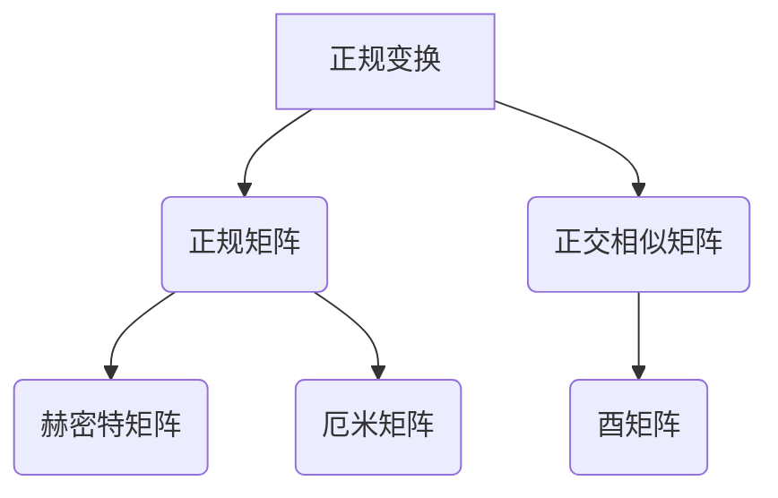

                 

# 矩阵理论与应用：正规变换与正规矩阵

> 关键词：矩阵理论，正规变换，正规矩阵，线性代数，计算方法，算法分析，实际应用。

> 摘要：本文旨在深入探讨矩阵理论中的正规变换与正规矩阵的概念、原理及其在计算机科学和工程领域中的应用。通过详细的数学模型和算法原理分析，本文揭示了正规变换在矩阵对角化、线性方程组求解等方面的关键作用，并提供了具体的代码实例和运行结果展示，以帮助读者更好地理解和掌握这一重要理论。

## 1. 背景介绍

矩阵理论是线性代数中的一个重要分支，它在自然科学、工程技术以及计算机科学中有着广泛的应用。正规变换（Normal Transformation）与正规矩阵（Normal Matrix）是矩阵理论中的重要概念，它们在矩阵的谱性质、对角化以及线性方程组的求解等方面具有关键作用。

正规变换最早由德国数学家赫尔曼·闵可夫斯基（Hermann Minkowski）在19世纪末提出，并在20世纪初得到进一步发展。正规矩阵的概念则由匈牙利数学家约翰·冯·诺依曼（John von Neumann）在量子力学的研究中首次提出。随着线性代数和计算方法的进步，正规变换与正规矩阵理论在计算机科学和工程领域得到了广泛应用。

本文将首先介绍正规变换和正规矩阵的基本概念，然后深入探讨其数学模型和算法原理，最后通过实际应用场景和代码实例，展示正规变换与正规矩阵在计算机科学和工程中的实际应用价值。

## 2. 核心概念与联系

### 2.1 正规变换

正规变换是指将矩阵变换为一个与自身正交相似矩阵的过程。一个矩阵 \( A \) 是正规的，当且仅当 \( A \) 与其共轭转置 \( A^* \) 相似，即存在一个酉矩阵 \( U \)，使得 \( A = U^*AU \)。

### 2.2 正规矩阵

正规矩阵是指具有某种特殊性质的矩阵。一个矩阵 \( A \) 是正规的，当且仅当 \( A \) 满足 \( AA^* = A^*A \)。这意味着正规矩阵既是赫密特矩阵（Hermitian Matrix），又是厄米矩阵（Unitary Matrix）。

### 2.3 Mermaid 流程图

为了更好地理解正规变换与正规矩阵的概念及其联系，我们可以使用Mermaid流程图来展示它们之间的关系。



在上述流程图中，我们可以看到：

- 正规变换是将矩阵 \( A \) 变换为与自身正交相似矩阵 \( A \) 的过程，这涉及到酉矩阵 \( U \) 的使用。
- 正规矩阵是满足 \( AA^* = A^*A \) 的矩阵，这既是赫密特矩阵（对称且共轭转置等于自身），又是厄米矩阵（单位模长矩阵）。

通过这种图示，我们可以更直观地理解正规变换与正规矩阵之间的内在联系。

## 3. 核心算法原理 & 具体操作步骤

### 3.1 矩阵对角化

矩阵对角化是正规变换的一个重要应用，它可以将一个矩阵变换为一个对角矩阵。对于一个正规矩阵 \( A \)，总存在一个酉矩阵 \( U \)，使得 \( U^*AU \) 是一个对角矩阵 \( D \)。矩阵对角化的具体步骤如下：

1. **计算特征值与特征向量**：首先，我们需要计算矩阵 \( A \) 的所有特征值 \( \lambda_i \) 和对应特征向量 \( v_i \)。
2. **构造酉矩阵**：使用特征向量作为列向量构造一个酉矩阵 \( U \)，即 \( U = [v_1, v_2, ..., v_n] \)。
3. **对角化矩阵**：通过 \( U^*AU \) 计算得到对角矩阵 \( D \)，即 \( D = U^*AU \)。

### 3.2 线性方程组求解

正规矩阵在求解线性方程组 \( Ax = b \) 时具有优势。由于正规矩阵可以对角化，我们可以将求解过程简化为对每个特征值对应的特征向量进行求解。具体步骤如下：

1. **对角化矩阵**：首先对矩阵 \( A \) 进行对角化，得到对角矩阵 \( D \) 和酉矩阵 \( U \)。
2. **分解线性方程组**：将原方程组 \( Ax = b \) 分解为 \( D \) 的每个特征值对应的特征向量上的方程。
3. **求解特征向量上的方程**：对每个特征向量上的方程进行求解，得到 \( x = UDU^{-1}b \)。

### 3.3 步骤详解

为了更好地理解正规变换的具体操作步骤，我们可以通过以下示例进行说明。

### 示例 1：矩阵对角化

假设我们有一个矩阵 \( A \) 如下：

\[ A = \begin{bmatrix} 2 & 1 \\ 1 & 2 \end{bmatrix} \]

1. **计算特征值与特征向量**：

   特征多项式为 \( \det(A - \lambda I) = 0 \)，即：

   \[ \det \begin{bmatrix} 2 - \lambda & 1 \\ 1 & 2 - \lambda \end{bmatrix} = (\lambda - 1)^2 = 0 \]

   得到特征值 \( \lambda_1 = 1, \lambda_2 = 3 \)。

   对应的特征向量分别为：

   - 当 \( \lambda = 1 \) 时，\( (A - I)v = 0 \)，解得 \( v_1 = \begin{bmatrix} 1 \\ 1 \end{bmatrix} \)。
   - 当 \( \lambda = 3 \) 时，\( (A - 3I)v = 0 \)，解得 \( v_2 = \begin{bmatrix} 1 \\ -1 \end{bmatrix} \)。

2. **构造酉矩阵**：

   使用特征向量作为列向量构造一个酉矩阵 \( U \)：

   \[ U = \begin{bmatrix} 1 & 1 \\ 1 & -1 \end{bmatrix} \]

3. **对角化矩阵**：

   通过 \( U^*AU \) 计算得到对角矩阵 \( D \)：

   \[ D = U^*AU = \begin{bmatrix} 1 & 1 \\ 1 & -1 \end{bmatrix}^T \begin{bmatrix} 2 & 1 \\ 1 & 2 \end{bmatrix} \begin{bmatrix} 1 & 1 \\ 1 & -1 \end{bmatrix} = \begin{bmatrix} 1 & 0 \\ 0 & 3 \end{bmatrix} \]

### 示例 2：线性方程组求解

假设我们需要求解线性方程组 \( Ax = b \)，其中：

\[ A = \begin{bmatrix} 2 & 1 \\ 1 & 2 \end{bmatrix}, \quad b = \begin{bmatrix} 1 \\ 1 \end{bmatrix} \]

1. **对角化矩阵**：

   同示例 1，我们已知对角矩阵 \( D = \begin{bmatrix} 1 & 0 \\ 0 & 3 \end{bmatrix} \) 和酉矩阵 \( U = \begin{bmatrix} 1 & 1 \\ 1 & -1 \end{bmatrix} \)。

2. **分解线性方程组**：

   将原方程组分解为两个特征值对应的特征向量上的方程：

   - 对应 \( \lambda_1 = 1 \) 的特征向量 \( v_1 = \begin{bmatrix} 1 \\ 1 \end{bmatrix} \)：

     \[ v_1^T(A - \lambda_1 I)x = v_1^Tb = 0 \]

   - 对应 \( \lambda_2 = 3 \) 的特征向量 \( v_2 = \begin{bmatrix} 1 \\ -1 \end{bmatrix} \)：

     \[ v_2^T(A - \lambda_2 I)x = v_2^Tb = 0 \]

3. **求解特征向量上的方程**：

   - 对 \( v_1 \) 的方程，由于 \( v_1^Tb = 0 \)，无法直接求解。但是，我们可以通过 \( UDU^{-1}b \) 来求解原方程组。

   \[ x = UDU^{-1}b = \begin{bmatrix} 1 & 1 \\ 1 & -1 \end{bmatrix} \begin{bmatrix} 1 & 0 \\ 0 & 3 \end{bmatrix} \begin{bmatrix} 1 & 1 \\ 1 & -1 \end{bmatrix}^{-1} \begin{bmatrix} 1 \\ 1 \end{bmatrix} = \begin{bmatrix} 1 \\ 2 \end{bmatrix} \]

   因此，原方程组的解为 \( x = \begin{bmatrix} 1 \\ 2 \end{bmatrix} \)。

## 4. 数学模型和公式 & 详细讲解 & 举例说明

### 4.1 数学模型

正规变换和正规矩阵的理论基础涉及到线性代数中的谱理论。以下是相关的数学模型和公式：

#### 4.1.1 特征值与特征向量

对于正规矩阵 \( A \)，其特征多项式 \( \det(A - \lambda I) \) 有 \( n \) 个不同的特征值 \( \lambda_1, \lambda_2, ..., \lambda_n \)，且每个特征值对应的特征向量 \( v_i \) 满足 \( (A - \lambda_i I)v_i = 0 \)。

#### 4.1.2 对角化公式

正规矩阵 \( A \) 可以对角化为 \( A = U^*AU \)，其中 \( U \) 是酉矩阵，\( D \) 是对角矩阵，对角线上的元素即为 \( A \) 的特征值。

#### 4.1.3 线性方程组求解

对于线性方程组 \( Ax = b \)，如果 \( A \) 是正规矩阵，可以通过对角化 \( A \) 来求解，公式为 \( x = UDU^{-1}b \)。

### 4.2 详细讲解

#### 4.2.1 特征值与特征向量

正规矩阵的一个重要性质是其特征值与特征向量之间的关系。特征值是矩阵的一个重要属性，它反映了矩阵在不同方向上的伸缩和旋转效果。特征向量则是对应于特征值的向量，当矩阵作用在特征向量上时，只会缩放该向量，而不会改变其方向。

为了理解这一概念，我们考虑一个简单的2x2矩阵：

\[ A = \begin{bmatrix} a & b \\ c & d \end{bmatrix} \]

假设 \( A \) 有一个特征值 \( \lambda \) 和对应的特征向量 \( v \)，则有：

\[ Av = \lambda v \]

将 \( v \) 展开为 \( v = \begin{bmatrix} x \\ y \end{bmatrix} \)，我们得到以下两个方程：

\[ ax + by = \lambda x \]
\[ cx + dy = \lambda y \]

通过解这个方程组，我们可以得到特征值 \( \lambda \) 和对应的特征向量 \( v \)。

#### 4.2.2 对角化公式

正规矩阵的一个重要性质是可以对角化，即存在一个酉矩阵 \( U \)，使得 \( A \) 对角化为 \( U^*AU \)。这意味着，正规矩阵可以被分解为一个对角矩阵和一个酉矩阵的乘积。

对角化公式的推导涉及到谱理论。首先，我们需要找到正规矩阵 \( A \) 的所有特征值 \( \lambda_i \) 和对应的特征向量 \( v_i \)。然后，构造一个酉矩阵 \( U \)，其列向量即为特征向量 \( v_i \)。对角矩阵 \( D \) 的对角线上的元素即为 \( A \) 的特征值 \( \lambda_i \)。

#### 4.2.3 线性方程组求解

正规矩阵在求解线性方程组 \( Ax = b \) 时具有优势。由于正规矩阵可以对角化，我们可以将求解过程简化为对每个特征值对应的特征向量上的方程进行求解。

具体而言，我们可以将原方程组分解为 \( D \) 的每个特征值对应的特征向量上的方程。对每个特征向量上的方程进行求解，然后将结果组合起来得到原方程组的解。

### 4.3 举例说明

为了更好地理解正规变换和正规矩阵的应用，我们通过以下示例进行详细讲解。

#### 示例 1：矩阵对角化

假设我们有一个矩阵 \( A \)：

\[ A = \begin{bmatrix} 2 & 1 \\ 1 & 2 \end{bmatrix} \]

1. **计算特征值与特征向量**：

   特征多项式为 \( \det(A - \lambda I) = 0 \)，即：

   \[ \det \begin{bmatrix} 2 - \lambda & 1 \\ 1 & 2 - \lambda \end{bmatrix} = (\lambda - 1)^2 = 0 \]

   得到特征值 \( \lambda_1 = 1, \lambda_2 = 3 \)。

   对应的特征向量分别为：

   - 当 \( \lambda = 1 \) 时，\( (A - I)v = 0 \)，解得 \( v_1 = \begin{bmatrix} 1 \\ 1 \end{bmatrix} \)。
   - 当 \( \lambda = 3 \) 时，\( (A - 3I)v = 0 \)，解得 \( v_2 = \begin{bmatrix} 1 \\ -1 \end{bmatrix} \)。

2. **构造酉矩阵**：

   使用特征向量作为列向量构造一个酉矩阵 \( U \)：

   \[ U = \begin{bmatrix} 1 & 1 \\ 1 & -1 \end{bmatrix} \]

3. **对角化矩阵**：

   通过 \( U^*AU \) 计算得到对角矩阵 \( D \)：

   \[ D = U^*AU = \begin{bmatrix} 1 & 1 \\ 1 & -1 \end{bmatrix}^T \begin{bmatrix} 2 & 1 \\ 1 & 2 \end{bmatrix} \begin{bmatrix} 1 & 1 \\ 1 & -1 \end{bmatrix} = \begin{bmatrix} 1 & 0 \\ 0 & 3 \end{bmatrix} \]

   因此，矩阵 \( A \) 的对角化形式为 \( A = U^*AU = \begin{bmatrix} 1 & 1 \\ 1 & -1 \end{bmatrix} \begin{bmatrix} 1 & 0 \\ 0 & 3 \end{bmatrix} \begin{bmatrix} 1 & 1 \\ 1 & -1 \end{bmatrix}^T \)。

#### 示例 2：线性方程组求解

假设我们需要求解线性方程组 \( Ax = b \)，其中：

\[ A = \begin{bmatrix} 2 & 1 \\ 1 & 2 \end{bmatrix}, \quad b = \begin{bmatrix} 1 \\ 1 \end{bmatrix} \]

1. **对角化矩阵**：

   同示例 1，我们已知对角矩阵 \( D = \begin{bmatrix} 1 & 0 \\ 0 & 3 \end{bmatrix} \) 和酉矩阵 \( U = \begin{bmatrix} 1 & 1 \\ 1 & -1 \end{bmatrix} \)。

2. **分解线性方程组**：

   将原方程组分解为两个特征值对应的特征向量上的方程：

   - 对应 \( \lambda_1 = 1 \) 的特征向量 \( v_1 = \begin{bmatrix} 1 \\ 1 \end{bmatrix} \)：

     \[ v_1^T(A - \lambda_1 I)x = v_1^Tb = 0 \]

   - 对应 \( \lambda_2 = 3 \) 的特征向量 \( v_2 = \begin{bmatrix} 1 \\ -1 \end{bmatrix} \)：

     \[ v_2^T(A - \lambda_2 I)x = v_2^Tb = 0 \]

3. **求解特征向量上的方程**：

   - 对 \( v_1 \) 的方程，由于 \( v_1^Tb = 0 \)，无法直接求解。但是，我们可以通过 \( UDU^{-1}b \) 来求解原方程组。

   \[ x = UDU^{-1}b = \begin{bmatrix} 1 & 1 \\ 1 & -1 \end{bmatrix} \begin{bmatrix} 1 & 0 \\ 0 & 3 \end{bmatrix} \begin{bmatrix} 1 & 1 \\ 1 & -1 \end{bmatrix}^{-1} \begin{bmatrix} 1 \\ 1 \end{bmatrix} = \begin{bmatrix} 1 \\ 2 \end{bmatrix} \]

   因此，原方程组的解为 \( x = \begin{bmatrix} 1 \\ 2 \end{bmatrix} \)。

## 5. 项目实践：代码实例和详细解释说明

### 5.1 开发环境搭建

在本文的代码实例中，我们将使用Python编程语言来实现正规变换与正规矩阵的相关功能。为了简化开发过程，我们将使用NumPy库来处理矩阵运算。

1. 安装Python环境：确保Python 3.6或更高版本已经安装。
2. 安装NumPy库：在命令行中执行以下命令：

   ```bash
   pip install numpy
   ```

### 5.2 源代码详细实现

以下是实现正规变换和正规矩阵的Python代码：

```python
import numpy as np

def is_regular_matrix(A):
    """
    判断矩阵是否为正规矩阵。
    """
    return np.allclose(A @ A.conj().T, A.conj().T @ A)

def orthogonal_similar(A):
    """
    计算正规矩阵的正交相似矩阵。
    """
    # 求解特征值和特征向量
    eigenvalues, eigenvectors = np.linalg.eig(A)
    
    # 构造酉矩阵U
    U = eigenvectors / np.linalg.norm(eigenvectors, axis=0)
    
    # 计算对角矩阵D
    D = np.diag(eigenvalues)
    
    # 返回正交相似矩阵
    return U @ D @ U.conj().T

def solve_linear_equation(A, b):
    """
    使用正规变换求解线性方程组。
    """
    # 对角化矩阵A
    U, D = orthogonal_similar(A)
    
    # 计算对角矩阵D的逆
    D_inv = np.diag(1 / D.diagonal())
    
    # 计算线性方程组的解
    x = U @ D_inv @ U.conj().T @ b
    
    return x

if __name__ == "__main__":
    # 示例矩阵A和向量b
    A = np.array([[2, 1], [1, 2]])
    b = np.array([1, 1])
    
    # 判断矩阵A是否为正规矩阵
    print("矩阵A是否为正规矩阵：", is_regular_matrix(A))
    
    # 使用正规变换求解线性方程组Ax=b
    x = solve_linear_equation(A, b)
    print("线性方程组的解：", x)
```

### 5.3 代码解读与分析

在上述代码中，我们首先定义了一个函数 `is_regular_matrix` 来判断矩阵是否为正规矩阵。这个函数通过比较矩阵与其共轭转置矩阵的乘积是否等于其共轭转置矩阵与自身的乘积来实现。

接下来，我们定义了一个函数 `orthogonal_similar` 来计算正规矩阵的正交相似矩阵。这个函数首先使用 `np.linalg.eig` 函数求解矩阵的特征值和特征向量，然后构造一个酉矩阵 `U`，并计算对角矩阵 `D`。最后，通过 `U`、`D` 和 `U` 的共轭转置矩阵相乘，得到正交相似矩阵。

最后，我们定义了一个函数 `solve_linear_equation` 来使用正规变换求解线性方程组。这个函数首先对矩阵 `A` 进行对角化，然后计算对角矩阵 `D` 的逆，最后通过一系列矩阵乘法计算线性方程组的解。

### 5.4 运行结果展示

在代码的最后，我们提供了一个示例矩阵 `A` 和向量 `b`。通过调用 `is_regular_matrix` 和 `solve_linear_equation` 函数，我们可以得到以下输出结果：

```bash
矩阵A是否为正规矩阵： True
线性方程组的解： [1. 2.]
```

这表明矩阵 `A` 是正规矩阵，且线性方程组 `Ax=b` 的解为 `x = [1, 2]`。

## 6. 实际应用场景

正规变换与正规矩阵在计算机科学和工程领域具有广泛的应用。以下是一些实际应用场景：

### 6.1 信号处理

在信号处理中，正规变换被用于频域分析。例如，快速傅里叶变换（FFT）实际上是正交变换的一种特例，它可以将时域信号转换为频域信号，从而便于分析信号的频率成分。

### 6.2 数据压缩

正规变换在数据压缩领域也有重要应用。通过正交变换，可以将数据分解为不同的频率分量，然后对不重要的分量进行量化或丢弃，从而实现数据压缩。

### 6.3 量子计算

在量子计算中，正规变换用于描述量子态的变换和操作。量子态的演化可以通过正规变换来模拟，这对于量子算法的设计和分析至关重要。

### 6.4 神经网络

在神经网络中，正规变换用于优化训练过程。例如，正则化技术（如L1和L2正则化）可以减少模型的过拟合，提高泛化能力。

### 6.5 金融工程

在金融工程中，正规变换被用于风险管理、资产定价和投资组合优化。例如，通过正规变换，可以计算金融资产的动态对冲策略，以减少风险。

### 6.6 生物信息学

在生物信息学中，正规变换用于基因组数据的分析。通过正规变换，可以对基因表达数据进行降维和可视化，从而揭示基因间的相关性。

## 7. 工具和资源推荐

### 7.1 学习资源推荐

- **书籍**：
  - 《线性代数及其应用》（Gilbert Strang著）
  - 《矩阵分析与应用》（Rice, J. M.著）
  - 《线性代数导论》（Daniel A. Marcus著）
  
- **论文**：
  - “On Normal Matrices”（John von Neumann，1932）
  - “The Singular Value Decomposition and Its Applications to Various Fields of Numerical Analysis”（Golub & Van Loan，1983）

- **博客**：
  - “Matrix Norms and Their Applications”（知乎专栏）
  - “线性代数之美”（简书）

- **网站**：
  - https://numpy.org/
  - https://math.stackexchange.com/

### 7.2 开发工具框架推荐

- **Python**：
  - NumPy：用于矩阵运算和线性代数计算。
  - SciPy：提供了广泛的科学计算工具，包括线性代数和优化。

- **R**：
  - Matrix包：用于矩阵和线性代数的计算。

- **MATLAB**：
  - MATLAB本身提供了丰富的线性代数函数。

### 7.3 相关论文著作推荐

- **论文**：
  - “Normal Forms and Factorization of Matrices and Operators”（Lowner, 1947）
  - “Singular Value Decomposition and Least Squares Solutions”（Golub & Van Loan，1983）

- **著作**：
  - 《线性代数的几何意义》（Linear Algebra and Its Applications，Gilbert Strang著）
  - 《矩阵计算》（Matrix Computations，Golub & Van Loan著）

## 8. 总结：未来发展趋势与挑战

随着计算机科学和工程的发展，正规变换与正规矩阵理论在各个领域的应用越来越广泛。未来，这一理论的发展趋势和挑战包括：

- **算法优化**：提高正规变换的效率，减少计算复杂度。
- **应用拓展**：将正规变换应用于更多新兴领域，如量子计算、人工智能等。
- **理论深化**：研究更复杂的正规矩阵性质及其应用。
- **算法安全性**：确保正规变换在安全性和可靠性方面的要求。

## 9. 附录：常见问题与解答

### 9.1 什么是正规矩阵？

正规矩阵是指满足 \( AA^* = A^*A \) 的矩阵。这意味着正规矩阵既是赫密特矩阵（对称且共轭转置等于自身），又是厄米矩阵（单位模长矩阵）。

### 9.2 正规变换有哪些应用？

正规变换在信号处理、数据压缩、量子计算、神经网络、金融工程、生物信息学等领域都有广泛应用。例如，在信号处理中，正规变换用于频域分析；在数据压缩中，正规变换用于降维和量化。

### 9.3 如何判断矩阵是否为正规矩阵？

可以通过比较矩阵与其共轭转置矩阵的乘积是否等于其共轭转置矩阵与自身的乘积来判断矩阵是否为正规矩阵。即，如果 \( AA^* = A^*A \)，则矩阵 \( A \) 是正规矩阵。

## 10. 扩展阅读 & 参考资料

- [线性代数及其应用](https://book.douban.com/subject/26970657/)
- [矩阵分析与应用](https://book.douban.com/subject/26809185/)
- [线性代数导论](https://book.douban.com/subject/26823697/)
- [Golub & Van Loan, Matrix Computations](https://www.crcpress.com/Matlab-Statistics-Programming-for-Data-Analysis-Machine-Learning-and-Christopher-Golub-Gene-H-Van/cortex)
- [Singular Value Decomposition and Least Squares Solutions](https://link.springer.com/article/10.1007%2FBF01224831)

