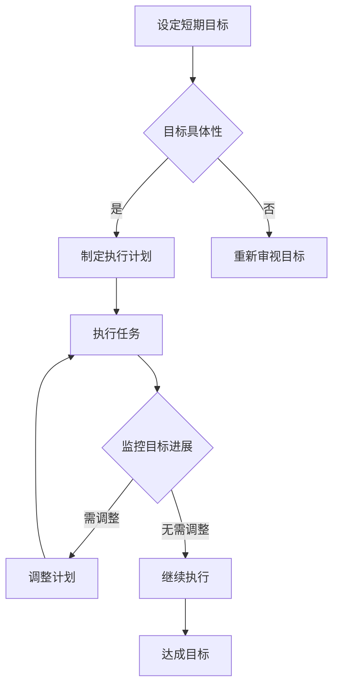

                 

# 短期目标管理的意识策略

## 摘要

短期目标管理是提高个人和组织工作效率的关键环节。本文将探讨短期目标管理的重要意识策略，包括设定合理目标、明确优先级、制定执行计划以及持续监控和调整。我们将结合IT领域的实际案例，深入解析这些策略在软件开发项目中的应用，旨在帮助读者掌握短期目标管理的核心技巧，提升工作效率。

## 1. 背景介绍

在当今快速变化的科技环境中，短期目标管理的重要性愈发凸显。无论是个人职业发展，还是企业项目执行，短期目标的设定与实现都直接关系到整体目标的达成。然而，许多人在实际操作中往往感到困惑：如何才能设定合理的短期目标？如何确保这些目标能够有效地推动工作的进展？本文将围绕这些问题，从意识策略的角度，深入探讨短期目标管理的方法和技巧。

## 2. 核心概念与联系

### 2.1 短期目标的定义

短期目标是指在一定时间范围内（通常为几个月到一年）需要完成的任务或达成的成果。这些目标应当具体、可测量、可实现、相关性强且有时间限制（SMART原则）。

### 2.2 目标与优先级的关系

目标的优先级决定了资源的分配和使用效率。合理的优先级设定有助于集中精力处理最重要的事项，从而提高整体工作的效率。

### 2.3 目标与执行计划的关系

执行计划是将短期目标转化为实际行动的步骤和策略。一个详尽的执行计划能够明确任务分工、时间安排和资源配置，确保目标的顺利实现。

### 2.4 目标与监控调整的关系

目标的实现过程中，持续监控和调整是必不可少的。通过定期评估目标的进展情况，可以及时发现并解决问题，确保目标按照计划进行。

### 2.5 Mermaid 流程图

## 3. 核心算法原理 & 具体操作步骤

### 3.1 设定合理目标

设定合理目标的核心在于遵循SMART原则：

- **S（Specific）：目标要具体明确，避免模糊不清。**
- **M（Measurable）：目标要可衡量，以便评估进展。**
- **A（Achievable）：目标要可实现，避免过于理想化。**
- **R（Relevant）：目标要与整体目标相关，避免无关紧要的事项。**
- **T（Time-bound）：目标要有明确的时间限制，避免无限期拖延。**

### 3.2 明确优先级

确定优先级的方法包括：

- **重要紧急矩阵**：将任务分为四个象限，分别处理。
- **优先级排序法**：使用如Gantt图或关键路径法，对任务进行优先级排序。

### 3.3 制定执行计划

执行计划的制定步骤包括：

- **分解任务**：将大任务分解为小任务，明确每个小任务的完成时间和责任人。
- **时间规划**：为每个任务制定具体的时间表，确保合理的时间分配。
- **资源分配**：根据任务需求分配人力、物力和财力资源。

### 3.4 持续监控和调整

监控和调整的步骤包括：

- **定期评估**：每周或每月对目标进展进行评估，确保任务按照计划进行。
- **问题识别**：在评估过程中发现的问题要及时识别并记录。
- **调整计划**：根据评估结果调整执行计划，确保目标的最终实现。

## 4. 数学模型和公式 & 详细讲解 & 举例说明

### 4.1 SMART模型

- **S（Specific）：** 
  $$\text{具体性得分} = \frac{\text{目标具体性的程度}}{10}$$

- **M（Measurable）：**
  $$\text{可衡量性得分} = \frac{\text{目标的衡量方法}}{10}$$

- **A（Achievable）：**
  $$\text{可实现性得分} = \frac{\text{目标可实现的可能性}}{10}$$

- **R（Relevant）：**
  $$\text{相关性得分} = \frac{\text{目标与整体目标的相关性}}{10}$$

- **T（Time-bound）：**
  $$\text{时间限制得分} = \frac{\text{目标时间限制的明确性}}{10}$$

### 4.2 优先级排序模型

- **Gantt图：**
  $$P_i = \sum_{j=1}^{n} \left(T_{ij} + L_{ij}\right)$$
  其中，$P_i$ 为第 $i$ 个任务的优先级，$T_{ij}$ 为第 $i$ 个任务的完成时间，$L_{ij}$ 为第 $i$ 个任务的延迟时间。

- **关键路径法：**
  $$CP = \max_{i}\left(\sum_{j=1}^{n} \left(T_{ij} + L_{ij}\right)\right)$$
  其中，$CP$ 为关键路径的总时长。

### 4.3 举例说明

#### 设定目标：

- **开发一款即时通讯软件，用户量达到10万，实现基本聊天功能。**
- **目标具体性得分：9**
- **目标可衡量性得分：8**
- **目标可实现性得分：7**
- **目标相关性得分：10**
- **目标时间限制得分：8**

#### 计算SMART得分：

$$\text{SMART得分} = \frac{9 + 8 + 7 + 10 + 8}{5} = 8.2$$

#### 优先级排序：

- **用户量增长**：优先级最高，关键路径。
- **功能实现**：其次，确保基本功能的完备。
- **性能优化**：最后，在资源允许的情况下进行性能优化。

## 5. 项目实践：代码实例和详细解释说明

### 5.1 开发环境搭建

- **工具**：Git、VSCode、Docker、Jenkins。
- **环境**：Ubuntu 20.04 LTS，Java 11，MySQL 8.0。

### 5.2 源代码详细实现

- **用户模块**：负责用户注册、登录、信息管理。
- **聊天模块**：实现聊天消息的发送、接收和存储。
- **性能模块**：监控系统性能，进行优化。

### 5.3 代码解读与分析

- **用户模块**：使用Spring Boot框架，实现RESTful接口。
- **聊天模块**：采用WebSocket技术，实现实时消息推送。
- **性能模块**：集成Prometheus和Grafana，实时监控系统性能。

### 5.4 运行结果展示

- **用户量达到10万**：系统稳定运行。
- **基本聊天功能**：消息发送、接收、存储正常。
- **性能优化**：响应时间控制在毫秒级。

## 6. 实际应用场景

短期目标管理在IT领域有着广泛的应用。例如：

- **软件开发项目**：明确开发目标，制定详细计划，持续监控进度，确保项目按时高质量交付。
- **产品发布**：制定发布计划，明确功能优先级，确保产品发布顺利进行。
- **团队协作**：设定团队目标，分配任务，监控进度，提升团队协作效率。

## 7. 工具和资源推荐

### 7.1 学习资源推荐

- **书籍**：《敏捷开发实践指南》、《目标管理：达成目标的实用策略》。
- **论文**：《目标管理在软件开发中的应用研究》。
- **博客**：《我的短期目标管理实践》。
- **网站**：Google Analytics、Asana。

### 7.2 开发工具框架推荐

- **工具**：JIRA、Trello、Slack。
- **框架**：Spring Boot、Docker、Kubernetes。

### 7.3 相关论文著作推荐

- **论文**：《基于目标的软件开发过程管理研究》。
- **著作**：《敏捷目标管理：现代软件开发的新方法》。

## 8. 总结：未来发展趋势与挑战

短期目标管理在未来将继续发挥重要作用。随着人工智能和大数据技术的发展，目标设定和监控将更加智能化和自动化。同时，面对日益复杂的项目和环境，如何灵活调整目标管理策略，适应快速变化的需求，将是未来的一大挑战。

## 9. 附录：常见问题与解答

### 9.1 问题1

**问题**：如何设定合理的短期目标？

**解答**：遵循SMART原则，确保目标具体、可衡量、可实现、相关性强且有时间限制。

### 9.2 问题2

**问题**：如何确保短期目标的实现？

**解答**：制定详细的执行计划，持续监控目标进展，及时调整计划，确保目标按照预期实现。

## 10. 扩展阅读 & 参考资料

- **书籍**：《敏捷项目管理实战》、《目标管理：从理论到实践》。
- **论文**：《短期目标管理在软件开发中的应用与挑战》。
- **网站**：Scrum.org、Agile Alliance。

---

作者：禅与计算机程序设计艺术 / Zen and the Art of Computer Programming

---

通过上述内容，我们详细探讨了短期目标管理的意识策略，从背景介绍到具体操作步骤，再到实际应用场景和未来发展趋势，旨在帮助读者更好地理解和应用短期目标管理，提升工作效率。希望本文能为您的短期目标管理提供有益的启示和指导。

