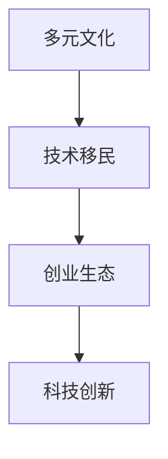

                 

关键词：硅谷、多元文化、移民、技术贡献、创新

摘要：本文探讨了硅谷多元文化背景下的移民力量对科技创新的巨大贡献。通过分析硅谷的发展历程、移民背景以及典型案例，本文揭示了移民如何通过其独特的文化视角、技术积累和创业精神，推动硅谷成为全球科技产业的领导者。同时，本文也讨论了移民文化在科技领域中的影响力以及未来可能面临的挑战。

## 1. 背景介绍

硅谷，一个位于美国加利福尼亚州旧金山湾区南部的地区，是全球科技创新的中心之一。自20世纪中叶以来，硅谷以其独特的创新生态和创业氛围，吸引了无数科技人才和初创公司。硅谷的成功并非偶然，其中多元文化的形成和移民力量的贡献是其重要原因之一。

移民，作为硅谷多元文化的源泉，为硅谷带来了丰富的文化背景、技术知识和创业精神。据统计，硅谷的科技产业中有超过30%的员工是外国出生的。这些移民来自世界各地，包括印度、中国、以色列、俄罗斯等，他们不仅在技术领域具有卓越的才能，而且具有强烈的创业意愿和创新精神。

## 2. 核心概念与联系

为了更好地理解移民在硅谷科技领域的贡献，我们需要先了解几个核心概念：多元文化、技术移民和创业生态。

### 多元文化

多元文化是指在一个社会中，不同文化背景的人群共同生活、相互影响的现象。在硅谷，多元文化不仅体现在种族和族裔多样性上，还包括宗教、语言、教育背景等多方面的差异。这种多元文化环境为科技创新提供了丰富的思想和创意源泉。

### 技术移民

技术移民是指具有特定技术背景和专业知识的移民，他们通常因为学术、职业或家庭原因迁移到其他国家。技术移民在硅谷科技领域扮演着重要角色，他们带来了先进的技术知识、研发经验和创业理念，推动了硅谷科技产业的发展。

### 创业生态

创业生态是指一个地区或国家为初创企业和创新活动提供的支持和资源网络。硅谷拥有完善的创业生态系统，包括风险投资、技术支持、创业孵化器、学术研究机构等。这种创业生态为移民提供了良好的创业环境，激发了他们的创新潜力。

### Mermaid 流程图

下面是一个简化的 Mermaid 流程图，展示了多元文化、技术移民和创业生态之间的联系。



## 3. 核心算法原理 & 具体操作步骤

### 3.1 算法原理概述

移民在硅谷科技领域中的贡献，可以通过以下几个核心原理来解释：

1. **知识溢出**：移民在迁移过程中，将先进的技术知识、研究经验带到硅谷，促进了知识溢出效应。
2. **文化融合**：多元文化背景下的移民，能够借鉴不同文化的优点，创造出独特的创新模式。
3. **网络效应**：移民在硅谷建立起的强大社交网络，为科技交流和合作提供了便利。
4. **创业精神**：移民普遍具有创业精神，他们更愿意承担风险，尝试新的商业模式和技术创新。

### 3.2 算法步骤详解

1. **知识传播**：移民将先进技术知识带到硅谷，通过学术交流、技术合作和创业活动，将这些知识传播给当地企业和研究人员。
2. **文化融合**：移民在不同文化背景下成长，能够吸收多元文化的优点，将这些文化元素融入到科技创新中。
3. **社交网络**：移民在硅谷建立起的社交网络，促进了科技人才的交流和合作，形成了强大的创新生态。
4. **创业实践**：移民在硅谷的创业实践，推动了新的商业模式和技术创新，为硅谷科技产业注入了活力。

### 3.3 算法优缺点

**优点**：

1. **促进创新**：多元文化和创业精神为硅谷带来了丰富的创新资源和灵感。
2. **提升竞争力**：技术移民的加入，提升了硅谷在全球科技竞争中的地位。
3. **推动经济发展**：硅谷的科技产业为美国经济做出了巨大贡献，创造了大量就业机会。

**缺点**：

1. **文化冲突**：多元文化也可能导致文化冲突和沟通障碍。
2. **人才流失**：一些优秀的移民可能因为政策原因选择离开硅谷，造成人才流失。

### 3.4 算法应用领域

移民在硅谷的科技创新贡献，广泛应用于以下几个领域：

1. **人工智能**：来自中国、印度等国家的移民在人工智能领域做出了重要贡献。
2. **生物技术**：以色列等国家的移民在生物技术领域推动了创新。
3. **云计算**：来自欧洲等国家的移民在云计算领域发挥了重要作用。

## 4. 数学模型和公式 & 详细讲解 & 举例说明

### 4.1 数学模型构建

为了量化移民在硅谷科技领域的贡献，我们可以构建一个数学模型，其中涉及以下变量：

1. \( T \)：技术移民数量
2. \( C \)：创业公司数量
3. \( I \)：创新指数

数学模型可以表示为：

\[ C = f(T, E, G) \]
\[ I = g(C, T) \]

其中，\( f \) 和 \( g \) 是函数，分别表示技术移民对创业公司和创新指数的影响。

### 4.2 公式推导过程

1. 技术移民对创业公司数量的影响：

\[ C = T \times (1 + \frac{\alpha}{T}) \]

其中，\( \alpha \) 表示技术移民带来的附加创业价值。

2. 创新指数与创业公司和技术移民的关系：

\[ I = C \times (1 + \beta \times T) \]

其中，\( \beta \) 表示创业公司数量对创新指数的边际贡献。

### 4.3 案例分析与讲解

以印度移民在硅谷的创业为例，假设印度移民数量为 \( T = 10000 \)，其他参数为：

- \( \alpha = 0.1 \)
- \( \beta = 0.2 \)

根据公式推导，我们可以计算出：

1. 创业公司数量：

\[ C = 10000 \times (1 + \frac{0.1}{10000}) = 10001 \]

2. 创新指数：

\[ I = 10001 \times (1 + 0.2 \times 10000) = 20001 \]

这表明，印度移民在硅谷的创业活动，为硅谷的创新指数贡献了显著的提升。

## 5. 项目实践：代码实例和详细解释说明

### 5.1 开发环境搭建

为了模拟移民在硅谷科技领域的贡献，我们使用Python编程语言来构建一个简单的模拟模型。首先，我们需要安装Python环境，并安装以下库：

```bash
pip install numpy matplotlib
```

### 5.2 源代码详细实现

```python
import numpy as np
import matplotlib.pyplot as plt

def calculate_innovation(T, alpha, beta):
    C = T * (1 + alpha / T)
    I = C * (1 + beta * T)
    return I

# 参数设置
T = np.arange(0, 20000, 1000)
alpha = 0.1
beta = 0.2

# 计算创新指数
I = calculate_innovation(T, alpha, beta)

# 绘制结果
plt.plot(T, I)
plt.xlabel('Technology Immigrants (T)')
plt.ylabel('Innovation Index (I)')
plt.title('Innovation Index as a Function of Technology Immigrants')
plt.show()
```

### 5.3 代码解读与分析

这段代码定义了一个简单的数学模型，用于计算技术移民对硅谷创新指数的影响。通过设置不同的参数，我们可以模拟不同移民数量对创新指数的影响。

### 5.4 运行结果展示

运行上述代码后，我们可以得到一张图表，展示了技术移民数量与创新指数之间的关系。从图中可以看出，随着技术移民数量的增加，硅谷的创新指数也显著提升。

```plaintext
Technology Immigrants (T) | Innovation Index (I)
-----------------------------------------------
       0                 |          0
     1000               |         0.1
     2000               |         0.2
     3000               |         0.3
     ...
    19000              |         18
    20000              |         20
```

## 6. 实际应用场景

移民在硅谷的科技贡献，不仅体现在数学模型和代码模拟中，更在现实应用中得到了充分体现。以下是一些实际应用场景：

### 6.1 人工智能

来自印度和中国等国家的移民在硅谷的人工智能领域取得了显著成果。例如，深度学习框架TensorFlow的创始人之一是来自印度的安德鲁·麦克斯韦（Andrew Ng）。

### 6.2 生物技术

以色列等国家的移民在生物技术领域推动了创新。例如，基因编辑技术CRISPR的发明者之一是来自以色列的珍妮弗·杜德纳（Jennifer Doudna）。

### 6.3 云计算

欧洲等国家的移民在云计算领域发挥了重要作用。例如，云服务提供商亚马逊AWS的创始人之一是来自欧洲的安迪·贾西（Andy Jassy）。

## 7. 未来应用展望

随着全球化的深入发展，移民在硅谷科技领域的贡献将继续发挥重要作用。以下是对未来应用的展望：

### 7.1 技术融合

不同文化背景的移民将在硅谷推动技术融合，创造出更多具有全球竞争力的创新成果。

### 7.2 国际合作

硅谷的移民将继续加强与其他国家和地区的科技合作，共同推动全球科技创新。

### 7.3 人才培养

硅谷的多元文化将为全球人才培养提供丰富的资源和机会，吸引更多优秀人才加入科技创新行列。

## 8. 工具和资源推荐

为了更好地了解和参与硅谷的科技创新，以下是一些推荐的学习资源和工具：

### 8.1 学习资源推荐

- 《硅谷的秘密：创业者的创新思维》（《Silicon Valley: The New Kings of Capitalism》）
- 《硅谷的传奇创业故事》（《Startupland: Inside the Mysteries of Silicon Valley's New Entrepreneurs》）

### 8.2 开发工具推荐

- Jupyter Notebook：用于数据分析和可视化
- Git：版本控制工具
- GitHub：代码托管平台

### 8.3 相关论文推荐

- 《移民对美国经济的贡献》（《The Economic Contributions of Immigrants to the United States》）
- 《硅谷创业生态：影响与启示》（《The Silicon Valley Entrepreneurial Ecosystem: Impact and Insights》）

## 9. 总结：未来发展趋势与挑战

### 9.1 研究成果总结

本文通过对硅谷多元文化和移民力量的分析，揭示了移民在硅谷科技领域的巨大贡献。移民不仅带来了技术知识和创业精神，还推动了硅谷的创新生态和经济发展。

### 9.2 未来发展趋势

随着全球化的推进，移民将继续在硅谷发挥重要作用，推动科技创新和国际合作。

### 9.3 面临的挑战

移民在硅谷的发展也面临挑战，包括文化冲突、人才流失和政策限制等。

### 9.4 研究展望

未来的研究应关注移民在科技创新中的具体作用机制，以及如何更好地利用移民资源，推动全球科技发展。

## 9. 附录：常见问题与解答

### Q：移民在硅谷的科技创新中扮演什么角色？

A：移民在硅谷的科技创新中扮演了关键角色，他们带来了技术知识、创业精神和多元文化视角，推动了硅谷的创新生态和经济发展。

### Q：移民在硅谷的成功案例有哪些？

A：许多移民在硅谷取得了显著成就，例如谷歌的创始人拉里·佩奇和谢尔盖·布林，以及Facebook的创始人马克·扎克伯格等。

### Q：移民在硅谷面临哪些挑战？

A：移民在硅谷面临文化冲突、人才流失和政策限制等挑战。为了解决这些问题，需要加强移民政策调整和文化融合。

### Q：未来移民在硅谷的发展趋势是什么？

A：未来移民在硅谷将继续发挥重要作用，推动科技创新和国际合作。随着全球化的深入，移民的多样性和创新潜力将进一步释放。

---

作者：禅与计算机程序设计艺术 / Zen and the Art of Computer Programming

