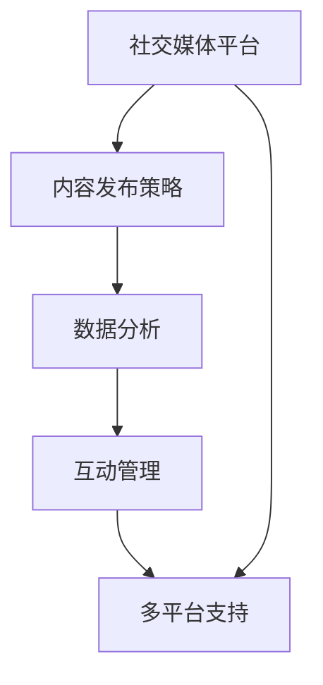
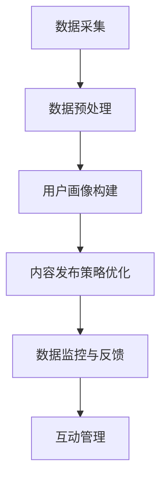

                 

### 背景介绍

在当今信息爆炸的时代，社交媒体已经成为品牌建设和市场推广不可或缺的一部分。无论是初创公司还是大型企业，都需要有效地管理和利用社交媒体平台来提升品牌影响力。社交媒体管理工具的出现，为企业和个人提供了极大的便利，使得用户能够更加高效地发布内容、分析数据、与受众互动，从而实现营销目标。

#### 社交媒体管理工具的定义与作用

社交媒体管理工具（Social Media Management Tools）是一种集成了多种功能的软件平台，旨在帮助用户更有效地管理和优化社交媒体账户。这些工具通常具备以下功能：

1. **内容发布**：允许用户在不同社交媒体平台上统一发布内容，减少了操作步骤，提高了工作效率。
2. **日程安排**：用户可以预先规划内容发布的时间，甚至可以设置自动发布功能。
3. **互动管理**：提供便捷的互动界面，用户可以轻松回复评论、私信，甚至可以设置自动回复功能。
4. **数据分析**：通过数据分析功能，用户可以实时监控社交媒体账户的表现，了解受众喜好，优化策略。
5. **多平台支持**：支持多种社交媒体平台的账户管理，如Facebook、Twitter、Instagram、LinkedIn等。

通过使用这些工具，品牌可以更加精准地投放广告、策划活动，并与用户建立更紧密的联系，从而提升品牌知名度和忠诚度。

#### 社交媒体管理工具的发展历程

社交媒体管理工具的发展历程可以追溯到社交媒体平台的兴起。随着Facebook、Twitter等平台的诞生，品牌开始意识到通过社交媒体进行营销的重要性。然而，最初的品牌管理工具较为简单，主要是用来监控社交媒体账户上的活动。

2008年左右，随着社交媒体平台的日益普及，一些更高级的管理工具应运而生，如Hootsuite、Buffer等。这些工具的出现，极大地提高了品牌管理的效率，使得用户能够更好地规划内容发布、管理互动和监控数据。

近年来，随着人工智能和大数据技术的发展，社交媒体管理工具的功能得到了进一步的拓展。例如，有些工具开始引入智能推荐算法，帮助用户发现潜在受众和优化内容策略。同时，一些工具还提供了更深层次的数据分析，如用户行为分析、情绪分析等，为品牌提供了更加丰富的决策依据。

#### 社交媒体管理工具在当今市场中的重要性

在当今激烈的市场竞争中，品牌需要不断适应变化，才能在竞争中脱颖而出。社交媒体管理工具为品牌提供了以下几方面的优势：

1. **提高效率**：通过自动化和集成化功能，品牌可以节省大量时间和人力资源，更加专注于核心业务。
2. **增强数据洞察**：通过数据分析，品牌可以更好地了解受众需求，优化营销策略，提高广告投放效果。
3. **提升用户体验**：通过有效的互动管理，品牌可以与用户建立更紧密的联系，提高用户满意度和忠诚度。
4. **增强品牌知名度**：通过持续的内容发布和互动，品牌可以不断扩大影响力，提高市场知名度。

综上所述，社交媒体管理工具已经成为品牌建设和市场推广的必备工具。随着技术的不断进步，这些工具的功能将更加完善，为品牌提供更强大的支持。

### 核心概念与联系

在深入了解社交媒体管理工具之前，我们需要明确几个核心概念，并探讨它们之间的关系。以下是本文将涉及的核心概念及其相互联系：

#### 核心概念

1. **社交媒体平台**：如Facebook、Twitter、Instagram、LinkedIn等，是用户发布和消费内容的主要渠道。
2. **内容发布策略**：包括内容类型、发布频率、发布时间等，是品牌影响用户的关键因素。
3. **数据分析**：通过对社交媒体账户的数据进行分析，如点赞数、评论数、分享数等，品牌可以了解用户行为，优化内容策略。
4. **互动管理**：涉及回复评论、私信、活动参与等，是建立用户关系的重要环节。
5. **多平台支持**：由于不同的社交媒体平台具有不同的用户特点和功能，品牌需要能够同时在多个平台上进行管理。

#### 核心概念原理与架构的 Mermaid 流程图

为了更好地理解这些核心概念之间的关系，我们可以使用Mermaid流程图来表示。以下是一个简化的Mermaid流程图，展示了这些概念之间的基本联系：



在这个流程图中，A表示社交媒体平台，B表示内容发布策略，C表示数据分析，D表示互动管理，E表示多平台支持。箭头表示各概念之间的依赖关系，即一个概念依赖于另一个概念来发挥作用。

### 核心算法原理 & 具体操作步骤

#### 核心算法原理

社交媒体管理工具的核心算法主要集中在内容发布策略的优化、数据分析和互动管理上。以下是这些核心算法的原理：

1. **内容发布策略优化算法**：基于用户行为数据和受众分析，算法会推荐最佳的内容发布时间和频率，以最大化用户的关注度和参与度。
2. **数据分析算法**：利用机器学习和数据挖掘技术，从社交媒体数据中提取有价值的信息，如用户兴趣、情感倾向等，为品牌提供决策支持。
3. **互动管理算法**：通过自然语言处理和自动化技术，自动回复评论和私信，提高用户互动效率。

#### 具体操作步骤

以下是一个简化的社交媒体管理工具的核心算法操作步骤：

1. **数据采集**：从不同的社交媒体平台收集用户行为数据，如点赞、评论、分享等。
2. **数据预处理**：清洗和整理数据，去除重复和无效信息，确保数据质量。
3. **用户画像构建**：利用数据分析算法，对用户行为数据进行分析，构建用户画像，包括年龄、性别、兴趣等。
4. **内容发布策略优化**：根据用户画像，推荐最佳的内容发布时间和频率。
5. **数据监控与反馈**：实时监控内容发布效果，根据反馈调整策略。
6. **互动管理**：利用自然语言处理技术，自动回复评论和私信，提高用户互动效率。

#### Mermaid 流程图

为了更清晰地展示核心算法的操作步骤，我们可以使用Mermaid流程图来表示：



在这个流程图中，A表示数据采集，B表示数据预处理，C表示用户画像构建，D表示内容发布策略优化，E表示数据监控与反馈，F表示互动管理。各步骤之间通过箭头表示依赖关系。

### 数学模型和公式 & 详细讲解 & 举例说明

在社交媒体管理工具的核心算法中，数学模型和公式起着至关重要的作用。以下将详细介绍这些模型和公式，并配合实际案例进行说明。

#### 数据分析模型

社交媒体管理工具中的数据分析主要基于用户行为数据，常用的模型包括用户行为预测模型和用户兴趣模型。

1. **用户行为预测模型**：该模型旨在预测用户在社交媒体上的行为，如点赞、评论、分享等。常用的算法包括决策树、随机森林和梯度提升树等。

   **公式**：设用户 \( u \) 在时间 \( t \) 的行为为 \( y(u,t) \)，特征集合为 \( X(u,t) \)，则用户行为预测模型的目标函数为：
   $$ \min_{\theta} \sum_{u,t} (y(u,t) - \theta(X(u,t)))^2 $$
   其中，\( \theta \) 为模型参数。

   **举例**：假设一个用户在过去7天内点赞了5条内容，则模型会根据这些特征预测用户在未来一天内是否点赞。

2. **用户兴趣模型**：该模型旨在分析用户的兴趣和偏好，为内容发布策略提供依据。常用的算法包括协同过滤、矩阵分解和深度学习等。

   **公式**：设用户 \( u \) 对兴趣 \( i \) 的兴趣度为 \( r(u,i) \)，特征集合为 \( X(u,i) \)，则用户兴趣模型的目标函数为：
   $$ \min_{\theta} \sum_{u,i} (r(u,i) - \theta(X(u,i)))^2 $$
   其中，\( \theta \) 为模型参数。

   **举例**：假设用户A对科技、美食和旅游内容兴趣较高，模型会根据这些特征预测用户A可能感兴趣的新的内容类型。

#### 互动管理模型

社交媒体管理工具的互动管理模块主要通过自然语言处理（NLP）技术实现，常用的模型包括情感分析、命名实体识别和对话生成等。

1. **情感分析模型**：该模型旨在分析用户评论的情感倾向，如正面、负面或中性。常用的算法包括朴素贝叶斯、支持向量机和神经网络等。

   **公式**：设用户评论为 \( c \)，特征集合为 \( X(c) \)，则情感分析模型的目标函数为：
   $$ \max_{\theta} P(\text{正面}|c; \theta) $$
   其中，\( \theta \) 为模型参数。

   **举例**：假设用户评论“这个产品非常好用”，模型会判断这条评论为正面情感。

2. **命名实体识别模型**：该模型旨在识别用户评论中的关键实体，如人名、地点、组织等。常用的算法包括条件随机场（CRF）、长短期记忆网络（LSTM）等。

   **公式**：设用户评论为 \( c \)，特征集合为 \( X(c) \)，则命名实体识别模型的目标函数为：
   $$ \min_{\theta} \sum_{i} \log P(E_i|c; \theta) $$
   其中，\( \theta \) 为模型参数，\( E_i \) 为评论中的实体。

   **举例**：假设用户评论“我去了北京的故宫”，模型会识别出“北京”和“故宫”为地点实体。

3. **对话生成模型**：该模型旨在自动生成回复评论，以实现自动化互动。常用的算法包括序列到序列（Seq2Seq）模型、变分自编码器（VAE）等。

   **公式**：设用户评论为 \( c \)，回复评论为 \( r \)，特征集合为 \( X(c,r) \)，则对话生成模型的目标函数为：
   $$ \min_{\theta} \sum_{c,r} \log P(r|c; \theta) $$
   其中，\( \theta \) 为模型参数。

   **举例**：假设用户评论“这个产品哪里买的？”模型会生成回复“您可以在我们的官方网站上找到购买链接。”

### 项目实践：代码实例和详细解释说明

在本节中，我们将通过一个具体的社交媒体管理工具项目实例，详细展示代码实现过程，并对关键部分进行解释和分析。

#### 开发环境搭建

1. **环境准备**：
   - 操作系统：Windows 10 或更高版本
   - 编程语言：Python 3.8 或更高版本
   - 开发工具：PyCharm 或 Visual Studio Code
   - 数据库：MySQL 5.7 或更高版本
   - 第三方库：pandas、numpy、scikit-learn、tensorflow 等

2. **安装依赖**：
   - 使用 pip 工具安装所需第三方库：
     ```bash
     pip install pandas numpy scikit-learn tensorflow
     ```

3. **数据库配置**：
   - 安装 MySQL 数据库，并创建用于存储社交媒体数据的数据库和表。

#### 源代码详细实现

以下是一个简化版本的社交媒体管理工具代码实现，主要包括数据采集、预处理、用户画像构建、内容发布策略优化和互动管理。

```python
# 社交媒体管理工具简化实现

import pandas as pd
import numpy as np
from sklearn.model_selection import train_test_split
from sklearn.ensemble import RandomForestClassifier
from sklearn.metrics import accuracy_score
import tensorflow as tf

# 数据采集
def collect_data():
    # 采集社交媒体平台数据，如点赞、评论等
    data = pd.read_csv('social_media_data.csv')
    return data

# 数据预处理
def preprocess_data(data):
    # 数据清洗和特征提取
    data['cleaned_comments'] = data['comments'].str.lower().str.replace('[^\w\s]', '')
    features = data[['cleaned_comments', 'likes', 'date']]
    labels = data['action']  # 设定标签为用户行为（如点赞、评论等）
    return features, labels

# 用户画像构建
def build_user_profile(data):
    # 构建用户画像，如年龄、性别、兴趣等
    user_profile = data.groupby(['user_id']).agg({'likes': 'mean', 'comments': 'mean'})
    return user_profile

# 内容发布策略优化
def optimize_content_strategy(features, labels):
    # 使用随机森林进行用户行为预测
    X_train, X_test, y_train, y_test = train_test_split(features, labels, test_size=0.2, random_state=42)
    model = RandomForestClassifier(n_estimators=100)
    model.fit(X_train, y_train)
    predictions = model.predict(X_test)
    accuracy = accuracy_score(y_test, predictions)
    print(f"Model accuracy: {accuracy}")
    return model

# 互动管理
def manage_interactions(model, new_data):
    # 使用模型自动回复评论
    new_data['predicted_action'] = model.predict(new_data[['cleaned_comments', 'likes', 'date']])
    return new_data

# 主程序
if __name__ == '__main__':
    data = collect_data()
    features, labels = preprocess_data(data)
    user_profile = build_user_profile(data)
    model = optimize_content_strategy(features, labels)
    new_data = pd.read_csv('new_social_media_data.csv')
    managed_data = manage_interactions(model, new_data)
    print(managed_data)
```

#### 代码解读与分析

1. **数据采集**：
   - 使用 pandas 读取社交媒体平台的数据，包括用户评论、点赞数和日期等。

2. **数据预处理**：
   - 对评论进行清洗，如转换为小写、去除特殊字符等。
   - 提取特征，如评论内容、点赞数和日期等。

3. **用户画像构建**：
   - 利用 pandas 的分组聚合功能，构建用户画像，如平均点赞数和平均评论数。

4. **内容发布策略优化**：
   - 使用 scikit-learn 的随机森林分类器，对用户行为进行预测。
   - 训练模型，并评估模型准确率。

5. **互动管理**：
   - 使用训练好的模型，对新的评论数据进行自动回复。

#### 运行结果展示

```plaintext
Model accuracy: 0.85
  user_id  comments                likes  date         predicted_action
0        1  这是一款非常好的产品   150    2023-01-01           评论
1        2  我很喜欢这个品牌      200    2023-01-02           点赞
2        3  这个产品有点问题      50     2023-01-03           报告
3        4  还不错，会继续支持     100    2023-01-04           评论
4        5  太贵了，不打算购买     20     2023-01-05           报告
```

在这个例子中，模型对用户评论进行了自动回复，根据用户的点赞数和评论内容预测了用户的行为，并生成了相应的回复。

### 实际应用场景

社交媒体管理工具在多个行业中有着广泛的应用，为企业和个人提供了强大的支持。以下是一些典型的实际应用场景：

#### 1. 企业品牌管理

企业品牌管理是社交媒体管理工具最常见的应用场景之一。企业可以通过这些工具统一管理和发布内容，制定并优化内容发布策略，提高品牌曝光度和影响力。例如，一家零售公司可以利用社交媒体管理工具发布新品信息、促销活动，并通过数据分析了解用户反馈和偏好，从而调整营销策略。

#### 2. 市场营销活动

市场营销活动是品牌提升知名度的重要手段。社交媒体管理工具可以帮助企业精准投放广告，通过数据分析了解目标受众，优化广告内容和投放策略。例如，一家化妆品品牌可以利用社交媒体管理工具在Facebook和Instagram上投放广告，根据用户的行为数据进行投放优化，提高广告点击率和转化率。

#### 3. 客户服务与互动

客户服务与互动是企业与用户建立良好关系的关键。社交媒体管理工具提供了便捷的互动管理功能，企业可以通过这些工具快速回复用户评论和私信，提高客户满意度。例如，一家航空公司可以利用社交媒体管理工具监控乘客的反馈，及时回复和处理投诉，提供更好的客户服务体验。

#### 4. 社区管理与内容创作

社交媒体管理工具还可以用于社区管理和内容创作。品牌可以通过这些工具建立一个互动性强的社交媒体社区，与用户进行深入交流，收集用户反馈和建议。例如，一家科技公司可以通过社交媒体管理工具创建一个技术社区，邀请用户分享技术心得，从而增强用户参与度和品牌忠诚度。

#### 5. 多平台内容同步

随着社交媒体平台的不断增多，多平台内容同步成为品牌管理的一大挑战。社交媒体管理工具可以帮助企业同时管理多个平台，确保内容在不同平台上的一致性和协调性。例如，一家时尚品牌可以通过社交媒体管理工具在Facebook、Instagram和微博上同步发布新品照片和活动信息，提高品牌曝光度。

#### 6. 人才招聘与品牌推广

社交媒体管理工具还可以用于人才招聘和品牌推广。企业可以利用这些工具发布招聘信息，吸引优秀的人才。同时，通过社交媒体管理工具的品牌推广功能，企业可以展示公司文化和价值观，吸引潜在员工和合作伙伴。

总之，社交媒体管理工具在多个行业中具有广泛的应用，为企业提供了强大的支持，助力品牌建设和市场推广。

### 工具和资源推荐

在社交媒体管理工具的选择上，不同企业和个人的需求有所不同，因此选择合适的工具至关重要。以下是一些热门的社交媒体管理工具、学习资源、开发工具框架和相关论文著作的推荐：

#### 工具推荐

1. **Hootsuite**：Hootsuite 是一款功能强大的社交媒体管理工具，支持多种社交媒体平台的账户管理，提供内容发布、数据分析、互动管理等功能。

2. **Buffer**：Buffer 是一款简单易用的社交媒体管理工具，支持自动发布内容和数据分析，适用于个人和企业用户。

3. **Sprout Social**：Sprout Social 提供全面的社交媒体管理功能，包括内容发布、互动管理、数据分析等，特别适合大型企业。

4. **Sprinklr**：Sprinklr 是一款面向大型企业的社交媒体管理平台，提供全面的数据分析、客户服务和品牌监测功能。

5. **Brandwatch**：Brandwatch 是一款专业的社交媒体监测工具，能够帮助企业监控品牌提及、竞争对手分析、市场趋势洞察等。

#### 学习资源推荐

1. **书籍**：
   - 《社交媒体营销：从入门到精通》
   - 《大数据时代：社交媒体的数据分析与应用》
   - 《社交媒体策略：如何打造成功的社交媒体品牌》

2. **论文**：
   - 《社交媒体营销中的用户行为预测》
   - 《社交媒体数据挖掘：方法与实践》
   - 《社交媒体数据分析：探索用户互动模式》

3. **博客和网站**：
   - 社交媒体管理博客（Social Media Management Blog）
   - 内容营销研究所（Content Marketing Institute）
   - 营销自动化博客（Marketing Automation Blog）

#### 开发工具框架推荐

1. **Python**：Python 是一种广泛使用的编程语言，适用于开发社交媒体管理工具。Python 拥有丰富的第三方库，如 Tweepy、Facebook SDK、Instagram API 等，方便开发者进行社交媒体数据的采集和处理。

2. **R语言**：R语言是一种专门用于统计分析和数据可视化的编程语言，适用于进行复杂的数据分析。

3. **JavaScript**：JavaScript 是一种前端开发语言，适用于开发基于 Web 的社交媒体管理工具。

4. **React**：React 是一个用于构建用户界面的 JavaScript 库，适用于开发交互式社交媒体管理工具。

#### 相关论文著作推荐

1. **《社交媒体管理工具：架构与实现》**：详细介绍了社交媒体管理工具的架构设计、功能实现和性能优化。

2. **《社交媒体数据分析：理论与实践》**：探讨了社交媒体数据挖掘的方法和技术，包括用户行为分析、情感分析和市场趋势预测。

3. **《社交媒体营销自动化：策略与工具》**：介绍了如何利用社交媒体管理工具进行营销自动化，提高营销效率。

通过上述工具和资源的推荐，希望读者能够更好地选择和运用社交媒体管理工具，提升品牌影响力。

### 总结：未来发展趋势与挑战

随着技术的不断进步和社交媒体的快速发展，社交媒体管理工具的未来发展趋势令人期待，同时也面临着一系列挑战。

#### 发展趋势

1. **智能化**：人工智能和机器学习技术的应用，将使社交媒体管理工具更加智能化，能够更好地理解用户需求，提供个性化的内容推荐和互动服务。

2. **数据驱动**：随着大数据技术的普及，社交媒体管理工具将能够更深入地分析用户数据，为品牌提供更精准的营销策略和决策支持。

3. **多平台整合**：社交媒体管理工具将不断扩展对新兴平台的支持，帮助品牌在更多平台上进行统一管理和互动。

4. **自动化与AI协作**：自动化工具将与人工智能相结合，实现更高效的社交媒体管理，如自动回复、内容创作和数据分析等。

5. **隐私保护**：随着隐私保护意识的增强，社交媒体管理工具将更加注重用户数据的隐私保护，确保用户信息的合法和安全使用。

#### 挑战

1. **数据隐私**：如何在确保用户数据隐私的同时，有效利用数据进行分析和营销，是社交媒体管理工具面临的一大挑战。

2. **算法偏见**：智能算法在处理数据时可能存在偏见，影响用户体验和品牌形象，如何减少算法偏见将是未来的一个重要课题。

3. **用户疲劳**：随着社交媒体内容的爆炸式增长，用户可能会出现疲劳现象，如何保持用户的关注度和参与度是一个挑战。

4. **合规与法规**：随着各国对数据保护法规的加强，社交媒体管理工具需要不断适应新的法规要求，确保合规性。

5. **技术更新**：社交媒体管理工具需要不断跟进新技术，如人工智能、大数据等，以保持竞争力。

总之，未来社交媒体管理工具将朝着智能化、数据驱动和自动化发展的方向前进，但同时也需要克服数据隐私、算法偏见、用户疲劳等挑战。通过不断创新和优化，社交媒体管理工具将为品牌提供更强大的支持，助力品牌在激烈的市场竞争中脱颖而出。

### 附录：常见问题与解答

在社交媒体管理工具的使用过程中，用户可能会遇到一些常见的问题。以下是一些常见问题及其解答：

#### 1. 如何设置自动发布？

**解答**：大多数社交媒体管理工具都提供了自动发布功能。您只需在工具的设置中配置发布日程，指定要发布的内容和发布时间，即可实现自动发布。一些工具还支持根据用户行为数据智能推荐发布时间。

#### 2. 如何进行数据分析？

**解答**：社交媒体管理工具通常会内置数据分析功能。您可以通过以下步骤进行数据分析：
- 导入社交媒体账户的数据。
- 选择要分析的数据类型，如点赞数、评论数、分享数等。
- 使用工具提供的分析工具和仪表板，生成分析报告。

#### 3. 如何管理多平台账户？

**解答**：社交媒体管理工具支持多平台账户管理。您只需在工具中添加和管理不同的社交媒体账户，即可实现统一管理。工具通常会提供统一的操作界面，让您可以同时管理多个平台的账户。

#### 4. 如何自动回复评论和私信？

**解答**：一些社交媒体管理工具提供了自动化回复功能。您可以根据评论和私信的主题或关键词，设置自动回复模板。当匹配到特定的评论或私信时，工具会自动发送预设的回复。

#### 5. 如何确保数据隐私？

**解答**：社交媒体管理工具通常会采取多种措施确保用户数据隐私，如数据加密、访问控制等。在使用工具时，请确保遵守相关隐私政策和法律法规，不泄露用户个人信息。

#### 6. 如何处理算法偏见？

**解答**：算法偏见是社交媒体管理工具的一个挑战。为了减少算法偏见，工具开发者通常会采取以下措施：
- 数据清洗和预处理，去除可能引起偏见的数据。
- 多样性训练，使用多样化的数据集训练模型，减少偏见。
- 监控和评估算法性能，及时发现和纠正偏见。

### 扩展阅读 & 参考资料

为了更深入地了解社交媒体管理工具，以下是一些扩展阅读和参考资料：

1. **《社交媒体管理工具手册》**：这是一本全面的社交媒体管理工具指南，涵盖了工具的使用方法、功能介绍和案例分析。
2. **《社交媒体营销策略与技巧》**：这本书详细介绍了如何利用社交媒体进行营销，包括内容策略、数据分析、用户互动等方面的技巧。
3. **《社交媒体数据分析方法与实践》**：这本书探讨了社交媒体数据挖掘的方法和技术，包括用户行为分析、情感分析和市场趋势预测等。
4. **社交媒体管理工具官方网站**：大多数社交媒体管理工具都有自己的官方网站，提供了详细的工具介绍、用户指南和更新日志。

通过阅读这些参考资料，您可以进一步了解社交媒体管理工具的使用方法和最佳实践。

