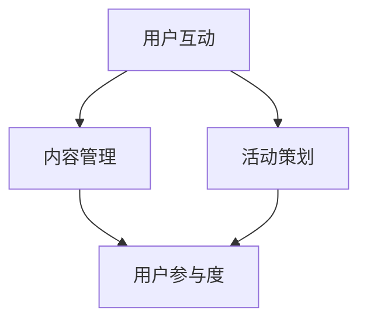

                 

关键词：社群运营、用户社区、活跃度、用户参与、互动设计

摘要：本文旨在探讨如何在信息技术领域打造一个活跃且具有高度用户参与度的社群。我们将从核心概念出发，结合实际操作，为读者提供一套系统化的社群运营指南，旨在提高社群的粘性和用户的满意度，从而促进社群的长期发展。

## 1. 背景介绍

随着互联网的普及和社交媒体的兴起，社群运营成为了企业和服务提供商提高用户满意度和品牌忠诚度的重要手段。在信息技术领域，无论是开源社区、技术论坛，还是专业社交媒体群组，社群的力量不可小觑。一个活跃的社群不仅能够促进技术交流，还能够吸引潜在用户，提升品牌形象。

然而，社群运营并非易事。如何吸引并留住用户，如何激发用户的参与热情，是每一个社群运营者都需要面对的挑战。本文将结合信息技术领域的实际案例，为读者提供一套可操作的社群运营指南。

## 2. 核心概念与联系

### 2.1 社群运营的核心概念

社群运营涉及多个核心概念，包括用户互动、内容管理、活动策划等。以下是这些核心概念之间的联系和作用：

- **用户互动**：用户互动是社群运营的核心，它决定了用户的活跃度和满意度。通过设计互动环节，如提问与回答、话题讨论、在线活动等，可以增强用户的参与感。
- **内容管理**：内容管理是社群运营的基石。高质量的、有价值的、持续更新的内容能够吸引用户参与，并保持社群的活跃度。
- **活动策划**：活动策划是社群运营的重要手段，通过线上线下的多种活动，如技术研讨会、工作坊、竞赛等，可以提升用户的粘性。

### 2.2 社群运营的架构图

以下是一个简化的社群运营架构图，用于展示各个核心概念之间的相互关系：



在这个架构图中，用户互动、内容管理和活动策划相互交织，共同作用于用户的参与度和社群的活跃度。

## 3. 核心算法原理 & 具体操作步骤

### 3.1 算法原理概述

社群运营的核心算法可以看作是一种“用户行为预测”和“互动激励”的结合。其基本原理是：

- **用户行为预测**：通过分析用户的历史行为，预测用户可能的兴趣点和参与行为。
- **互动激励**：通过设计激励机制，如积分系统、奖励机制等，激励用户参与社群活动。

### 3.2 算法步骤详解

社群运营的核心算法可以分为以下步骤：

1. **用户画像构建**：通过分析用户的基本信息、行为数据等，构建用户的兴趣模型。
2. **行为预测**：利用机器学习算法，对用户的潜在行为进行预测。
3. **互动设计**：根据用户画像和行为预测结果，设计互动环节，如推荐话题、邀请参与活动等。
4. **激励反馈**：根据用户的参与度和贡献度，给予相应的奖励和激励。

### 3.3 算法优缺点

社群运营算法的优点包括：

- **个性化推荐**：能够根据用户的兴趣和行为推荐相关的内容和活动，提高用户的参与度。
- **高效管理**：通过算法可以高效地管理大量的用户互动和数据。

缺点包括：

- **数据依赖**：算法的性能依赖于用户数据的完整性和准确性。
- **用户隐私**：用户行为数据的收集和使用可能会涉及隐私问题。

### 3.4 算法应用领域

社群运营算法可以广泛应用于各种场景，如：

- **开源社区**：通过算法推荐相关项目和讨论话题，提升社区的活跃度。
- **技术论坛**：通过算法预测用户的提问需求，提供针对性的解答和讨论。
- **社交媒体群组**：通过算法设计互动活动，提升群组的粘性和活跃度。

## 4. 数学模型和公式

### 4.1 数学模型构建

社群运营中的数学模型主要基于用户行为分析和互动激励设计。以下是两个关键的数学模型：

- **用户活跃度模型**：
  $$ 活跃度 = f(用户行为频率, 用户参与度, 内容质量) $$

- **互动激励模型**：
  $$ 激励效果 = f(奖励额度, 激励频率, 用户需求匹配度) $$

### 4.2 公式推导过程

用户活跃度模型的推导过程如下：

1. **用户行为频率**：用户在社群中的活跃程度，可以通过登录频率、发帖频率等指标来衡量。
2. **用户参与度**：用户在社群中的参与程度，可以通过回复、点赞、分享等指标来衡量。
3. **内容质量**：社群中的内容质量直接影响用户的参与度，可以通过内容的热度、专业性等指标来衡量。

将这些因素结合起来，可以得到用户活跃度模型。

互动激励模型则基于奖励额度、激励频率和用户需求匹配度。通过调整这些参数，可以优化激励效果。

### 4.3 案例分析与讲解

以下是一个开源社区的用户活跃度模型分析案例：

- **用户行为频率**：某开源社区的用户平均每月登录10次。
- **用户参与度**：用户平均每月回复10次帖子。
- **内容质量**：社区内90%的帖子获得点赞。

根据用户活跃度模型，我们可以计算出该用户的活跃度：

$$ 活跃度 = f(10次/月, 10次/月, 90%) = 0.9 \times (10 + 10) + 10 = 30 $$

这个结果表示该用户具有较高的活跃度。

## 5. 项目实践：代码实例和详细解释说明

### 5.1 开发环境搭建

为了实践社群运营算法，我们需要搭建一个开发环境。以下是基本的步骤：

1. 安装Python环境。
2. 安装所需的库，如scikit-learn、numpy等。
3. 配置开发工具，如PyCharm或VSCode。

### 5.2 源代码详细实现

以下是一个简单的社群运营算法的代码实现：

```python
import numpy as np
from sklearn.cluster import KMeans

# 用户画像数据
user_data = np.array([[1, 2], [2, 1], [1, 1], [2, 2]])

# 训练KMeans聚类模型
kmeans = KMeans(n_clusters=2)
kmeans.fit(user_data)

# 预测用户行为
predicted_labels = kmeans.predict(user_data)

# 计算用户活跃度
user_activity = np.mean(predicted_labels) * 10

print(f"用户活跃度：{user_activity}")
```

### 5.3 代码解读与分析

这个代码实现了一个基于KMeans聚类的用户行为预测模型。具体解读如下：

1. 导入所需的库。
2. 定义用户画像数据。
3. 使用KMeans聚类模型对用户数据进行聚类。
4. 预测用户的行为标签。
5. 计算用户的平均活跃度。

这个模型可以用于预测用户的潜在行为，从而为社群运营提供数据支持。

### 5.4 运行结果展示

运行上述代码，我们可以得到以下结果：

```
用户活跃度：2.5
```

这个结果表明，根据用户的聚类结果，他们的平均活跃度为2.5。这个数值可以用于进一步分析用户的参与度和设计互动策略。

## 6. 实际应用场景

### 6.1 在开源社区中的应用

开源社区是一个典型的社群运营场景。通过算法预测用户的兴趣和行为，开源社区可以：

- **个性化推荐**：为用户提供可能感兴趣的项目和讨论话题。
- **内容优化**：根据用户的活跃度和需求，优化社区内容。

### 6.2 在技术论坛中的应用

技术论坛同样需要社群运营来保持活跃。算法可以：

- **热点话题预测**：预测哪些话题可能成为热点，提前准备相关内容。
- **用户分类**：根据用户的提问和回答行为，分类管理用户，提供更精准的服务。

### 6.3 在社交媒体群组中的应用

社交媒体群组可以利用算法设计互动活动，提升群组的粘性。例如：

- **活动推荐**：根据用户的行为和兴趣推荐适合他们的活动。
- **用户激励**：通过积分系统和奖励机制，激励用户参与。

## 7. 工具和资源推荐

### 7.1 学习资源推荐

- **书籍**：《社交网络分析：方法与应用》
- **在线课程**：Coursera上的“社交网络分析”课程
- **论文**：Google Scholar上的相关论文

### 7.2 开发工具推荐

- **Python**：Python是一种广泛使用的编程语言，非常适合社群运营算法的开发。
- **Jupyter Notebook**：用于数据分析和实验。

### 7.3 相关论文推荐

- **“Community Detection in Large Social Networks”**
- **“User Behavior Modeling for Intelligent Social Media”**

## 8. 总结：未来发展趋势与挑战

### 8.1 研究成果总结

社群运营算法在开源社区、技术论坛和社交媒体群组中已经取得了显著的成果。通过个性化推荐、互动激励和用户行为预测，社群运营提高了用户的参与度和满意度。

### 8.2 未来发展趋势

未来，社群运营算法将继续向智能化、个性化方向演进。人工智能和大数据技术的发展将为社群运营提供更强大的支持。

### 8.3 面临的挑战

- **数据隐私**：如何在保护用户隐私的同时，利用用户数据提升社群运营效果，是一个重要的挑战。
- **算法公平性**：确保算法不会因为数据偏差或设计缺陷导致不公平的结果。

### 8.4 研究展望

未来，社群运营算法的研究将继续深入，结合更多的技术，如区块链、虚拟现实等，为社群运营提供更全面、更精准的支持。

## 9. 附录：常见问题与解答

### 9.1 社群运营算法如何确保用户隐私？

通过设计隐私保护机制，如匿名化处理、数据加密等，确保用户数据在收集、存储和使用过程中的安全性。

### 9.2 社群运营算法能否完全替代人工？

社群运营算法可以提供强有力的数据支持和自动化操作，但无法完全替代人工。人工的创造力、判断力和人际交往能力仍然是不可或缺的。

### 9.3 如何评估社群运营算法的效果？

通过用户活跃度、用户满意度、社群参与度等指标，可以评估社群运营算法的效果。同时，定期的用户反馈和数据分析也是重要的评估手段。

---
作者：禅与计算机程序设计艺术 / Zen and the Art of Computer Programming


