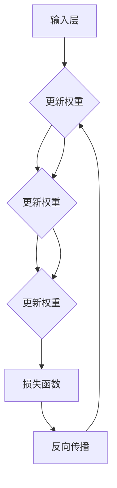

                 

### 背景介绍 Background

神经网络（Neural Networks）作为一种模拟人脑工作机制的计算模型，近年来在人工智能领域取得了令人瞩目的成果。它们被广泛应用于图像识别、自然语言处理、推荐系统、金融风控等多个领域，极大地推动了人工智能技术的发展。

#### 神经网络的起源

神经网络的概念最早可以追溯到1943年，由心理学家McCulloch和数学家Pitts提出了神经网络的初步模型——MP模型。该模型首次将生物神经系统与计算模型联系起来，奠定了神经网络研究的基础。随后，1958年，Frank Rosenblatt提出了感知机（Perceptron）模型，这是神经网络发展史上的一个重要里程碑。感知机是一个简单的二元线性分类器，通过学习输入和输出之间的映射关系来实现分类任务。

#### 神经网络的发展

在20世纪80年代，神经网络研究取得了显著进展，特别是在反向传播算法（Backpropagation Algorithm）的提出和应用上。反向传播算法使得多层神经网络的学习变得更加高效和可行。然而，由于计算资源和算法的限制，神经网络的应用仍然受到很大的限制。

进入21世纪，随着计算能力的提升和大数据的涌现，神经网络迎来了新的发展机遇。深度学习（Deep Learning）作为一种利用多层神经网络进行特征提取和分类的方法，取得了许多突破性的成果。2012年，AlexNet在ImageNet大赛中取得了巨大的成功，标志着深度学习时代的到来。

#### 神经网络的应用

神经网络在人工智能领域的应用范围非常广泛，包括但不限于以下几个方面：

1. **图像识别与处理**：神经网络可以用于人脸识别、物体检测、图像分类等任务。例如，卷积神经网络（CNN）在图像识别任务中取得了显著的效果。

2. **自然语言处理**：神经网络在自然语言处理（NLP）领域也有着广泛的应用，如文本分类、情感分析、机器翻译等。

3. **推荐系统**：神经网络可以用于推荐系统的构建，通过分析用户的兴趣和行为，提供个性化的推荐。

4. **金融风控**：神经网络在金融领域的应用主要包括风险预测、欺诈检测、市场预测等。

5. **医疗健康**：神经网络在医疗健康领域的应用包括疾病诊断、医学图像分析、药物研发等。

#### 总结

神经网络作为一种强大的计算模型，在人工智能领域发挥着至关重要的作用。从早期的感知机到现代的深度学习，神经网络的发展历程充满了创新和突破。随着技术的不断进步，神经网络的应用领域也在不断扩展，未来将会有更多的可能性等待着我们去探索和实现。

### 核心概念与联系 Core Concepts and Connections

要深入理解神经网络，首先需要掌握一些核心概念，并了解它们之间的联系。以下是神经网络中几个关键概念的定义和关系：

#### 1. 神经元（Neuron）

神经元是神经网络的基本构建单元，类似于生物神经系统的神经元。它接收输入信号，通过加权求和处理后产生输出信号。一个简单的神经元可以表示为：

\[ y = \sum_{i=1}^{n} w_i \cdot x_i + b \]

其中，\( x_i \) 是第 \( i \) 个输入，\( w_i \) 是对应的权重，\( b \) 是偏置项，\( y \) 是输出。

#### 2. 激活函数（Activation Function）

激活函数是神经元输出的非线性变换，用于引入非线性特性，使得神经网络能够学习复杂的函数。常见的激活函数包括：

- **Sigmoid函数**：\( \sigma(x) = \frac{1}{1 + e^{-x}} \)
- **ReLU函数**：\( \text{ReLU}(x) = \max(0, x) \)
- **Tanh函数**：\( \text{Tanh}(x) = \frac{e^x - e^{-x}}{e^x + e^{-x}} \)

激活函数的选择对神经网络的性能和训练过程有很大影响。

#### 3. 前向传播（Forward Propagation）

前向传播是指将输入信号从输入层传递到输出层的计算过程。在每个神经元中，输入信号与权重相乘并求和，然后通过激活函数得到输出信号。这个过程可以用以下步骤表示：

1. **输入层**：接受外部输入信号。
2. **隐藏层**：每个神经元接收前一层的输出作为输入，进行加权求和和激活函数处理，生成新的输出。
3. **输出层**：最终输出结果。

#### 4. 反向传播（Backpropagation）

反向传播是一种用于训练神经网络的算法，其目的是通过计算损失函数关于权重的梯度，来更新权重，以减少预测误差。反向传播包括以下几个步骤：

1. **前向传播**：计算前向传播得到的输出。
2. **计算损失**：使用损失函数计算预测值与真实值之间的差异。
3. **计算梯度**：通过反向传播算法计算损失函数关于每个权重的梯度。
4. **权重更新**：使用梯度下降（或其他优化算法）更新权重。

#### 5. 损失函数（Loss Function）

损失函数用于度量预测值与真实值之间的差异，是训练神经网络的重要工具。常见的损失函数包括：

- **均方误差（MSE）**：\( \text{MSE} = \frac{1}{n}\sum_{i=1}^{n} (y_i - \hat{y}_i)^2 \)
- **交叉熵损失（Cross-Entropy Loss）**：适用于分类问题，\( \text{Cross-Entropy Loss} = -\sum_{i=1}^{n} y_i \cdot \log(\hat{y}_i) \)

#### 6. 权重和偏置

权重和偏置是神经网络中最重要的参数，它们决定了神经网络的学习能力。通过训练，神经网络可以调整这些参数，以实现更好的预测性能。

#### Mermaid 流程图

以下是一个简化的神经网络流程图，展示了神经元、激活函数、前向传播和反向传播之间的关系：



通过这个流程图，我们可以直观地理解神经网络的各个组成部分及其相互关系。

### 核心算法原理 & 具体操作步骤 Core Algorithm Principles & Step-by-Step Operations

#### 1. 神经网络的基本结构

神经网络的构建始于神经元（或称为节点）的连接。一个简单的神经网络通常包括输入层、一个或多个隐藏层和输出层。每个神经元都与前一层的神经元相连，并通过权重（weight）传递信号。

- **输入层（Input Layer）**：接收外部输入数据，例如图像像素、文本词向量等。
- **隐藏层（Hidden Layers）**：对输入数据进行处理和变换，提取特征并生成中间表示。
- **输出层（Output Layer）**：生成最终的预测结果。

#### 2. 前向传播（Forward Propagation）

前向传播是神经网络处理输入数据的过程。具体步骤如下：

1. **输入数据**：将输入数据输入到输入层。
2. **加权求和**：每个神经元接收来自前一层的输入，通过权重进行加权求和。
3. **激活函数**：对加权求和的结果应用激活函数，引入非线性特性。
4. **传递输出**：将激活函数的输出传递到下一层。

这个过程在隐藏层和输出层重复进行，最终生成预测结果。

#### 3. 反向传播（Backpropagation）

反向传播是神经网络训练的核心算法。通过反向传播，神经网络能够根据预测误差调整权重和偏置，从而优化模型性能。具体步骤如下：

1. **计算预测误差**：使用损失函数计算预测值与真实值之间的差异。
2. **计算梯度**：通过反向传播算法，计算损失函数关于每个权重的梯度。
3. **权重更新**：使用梯度下降（或其他优化算法）更新权重。

#### 4. 梯度下降（Gradient Descent）

梯度下降是一种常用的优化算法，用于更新神经网络中的权重和偏置。具体步骤如下：

1. **计算梯度**：通过反向传播算法，计算损失函数关于每个权重的梯度。
2. **权重更新**：使用以下公式更新权重和偏置：
   \[ w_{\text{new}} = w_{\text{current}} - \alpha \cdot \nabla_w J \]
   其中，\( w_{\text{current}} \) 是当前权重，\( \alpha \) 是学习率，\( \nabla_w J \) 是损失函数关于权重的梯度。

#### 5. 神经网络训练过程

神经网络训练过程可以概括为以下步骤：

1. **初始化权重**：随机初始化神经网络中的权重和偏置。
2. **前向传播**：将输入数据输入到神经网络，生成预测结果。
3. **计算损失**：使用损失函数计算预测值与真实值之间的差异。
4. **反向传播**：通过反向传播算法计算损失函数关于每个权重的梯度。
5. **权重更新**：使用梯度下降算法更新权重。
6. **迭代优化**：重复步骤2-5，直到达到预定的迭代次数或收敛条件。

#### 6. 具体操作步骤示例

以下是一个简单的示例，展示如何使用Python实现神经网络的前向传播和反向传播：

```python
import numpy as np

# 初始化权重和偏置
weights = np.random.rand(3, 1)
biases = np.random.rand(1)

# 输入数据
inputs = np.array([1.0, 0.5, 1.0])

# 加权求和
z = np.dot(inputs, weights) + biases

# 激活函数（以ReLU为例）
output = np.maximum(0, z)

# 前向传播
predicted = output

# 真实值
true_output = np.array([1.0])

# 计算损失（以均方误差为例）
loss = (predicted - true_output) ** 2

# 反向传播
d_output = 2 * (predicted - true_output)

d_z = d_output

d_inputs = d_z

d_weights = d_inputs * inputs[:, None]

d_biases = d_z

# 权重更新
weights -= learning_rate * d_weights
biases -= learning_rate * d_biases
```

这个示例展示了神经网络的基本操作，包括初始化权重、前向传播、反向传播和权重更新。实际应用中，神经网络会涉及更复杂的结构和更丰富的操作，但基本原理是类似的。

通过上述步骤，我们可以理解神经网络的核心算法原理和具体操作步骤。神经网络训练的过程实质上是一个不断优化权重和偏置的过程，从而提高模型的预测性能。在实际应用中，我们需要根据具体任务调整网络结构、优化算法和超参数，以实现更好的性能。

### 数学模型和公式 Detailed Mathematical Models and Formulas

要深入理解神经网络，掌握其数学模型和公式至关重要。以下我们将详细讲解神经网络中的几个关键数学概念，包括激活函数、损失函数、梯度计算和优化算法。

#### 1. 激活函数

激活函数是神经网络中的关键组件，用于引入非线性特性，使得神经网络能够学习复杂的非线性关系。以下是几种常见的激活函数：

- **Sigmoid函数**：
  \[ \sigma(x) = \frac{1}{1 + e^{-x}} \]
  Sigmoid函数将输入映射到(0, 1)区间，常用于二分类问题。

- **ReLU函数**：
  \[ \text{ReLU}(x) = \max(0, x) \]
  ReLU函数具有简单和计算效率高的特点，广泛用于深度神经网络。

- **Tanh函数**：
  \[ \text{Tanh}(x) = \frac{e^x - e^{-x}}{e^x + e^{-x}} \]
  Tanh函数将输入映射到(-1, 1)区间，具有较好的平滑性。

- **Softmax函数**：
  \[ \text{softmax}(x_i) = \frac{e^{x_i}}{\sum_{j} e^{x_j}} \]
  Softmax函数常用于多分类问题，用于将神经元输出转换为概率分布。

#### 2. 损失函数

损失函数用于衡量预测值与真实值之间的差异，是神经网络训练的重要工具。以下是几种常见的损失函数：

- **均方误差（MSE）**：
  \[ \text{MSE} = \frac{1}{n}\sum_{i=1}^{n} (y_i - \hat{y}_i)^2 \]
  MSE适用于回归问题，用于衡量预测值与真实值之间的平方误差。

- **交叉熵损失（Cross-Entropy Loss）**：
  \[ \text{Cross-Entropy Loss} = -\sum_{i=1}^{n} y_i \cdot \log(\hat{y}_i) \]
  Cross-Entropy Loss适用于分类问题，用于衡量预测概率分布与真实概率分布之间的差异。

- **Huber损失**：
  \[ \text{Huber Loss} = \begin{cases}
  \frac{1}{2}(x^2 - 2\delta x + \delta^2), & \text{if } |x| \le \delta \\
  \delta(|x| - \frac{1}{2}\delta), & \text{otherwise}
  \end{cases} \]
  Huber损失在回归问题中具有较好的鲁棒性，能够在异常值附近减小损失。

#### 3. 梯度计算

梯度计算是神经网络训练的核心步骤，用于更新权重和偏置。以下是几种常用的梯度计算方法：

- **链式法则**：
  \[ \frac{\partial L}{\partial w} = \frac{\partial L}{\partial z} \cdot \frac{\partial z}{\partial w} \]
  链式法则是计算梯度的基础，用于将梯度从输出层反向传播到隐藏层和输入层。

- **反向传播算法**：
  \[ \frac{\partial L}{\partial w} = \sum_{i=1}^{n} \frac{\partial L}{\partial z_i} \cdot \frac{\partial z_i}{\partial w} \]
  反向传播算法通过链式法则，将梯度从输出层逐层计算到输入层。

#### 4. 优化算法

优化算法用于更新权重和偏置，以最小化损失函数。以下是几种常用的优化算法：

- **梯度下降（Gradient Descent）**：
  \[ w_{\text{new}} = w_{\text{current}} - \alpha \cdot \nabla_w J \]
  梯度下降通过迭代更新权重，直到找到最小化损失函数的解。

- **随机梯度下降（Stochastic Gradient Descent, SGD）**：
  \[ w_{\text{new}} = w_{\text{current}} - \alpha \cdot \nabla_w J(\mathbf{x}, \mathbf{y}) \]
  随机梯度下降在每个迭代步骤中随机选择样本，更新权重，具有更高的计算效率。

- **Adam优化器**：
  \[ m_t = \beta_1 m_{t-1} + (1 - \beta_1) \nabla_w J(\mathbf{x}, \mathbf{y}) \]
  \[ v_t = \beta_2 v_{t-1} + (1 - \beta_2) (\nabla_w J(\mathbf{x}, \mathbf{y}))^2 \]
  \[ \hat{m}_t = \frac{m_t}{1 - \beta_1^t} \]
  \[ \hat{v}_t = \frac{v_t}{1 - \beta_2^t} \]
  \[ w_{\text{new}} = w_{\text{current}} - \alpha \cdot \hat{m}_t / (\sqrt{\hat{v}_t} + \epsilon) \]
  Adam优化器结合了SGD和动量方法，具有较高的收敛速度。

#### 5. 公式汇总

以下是神经网络训练过程中常用的公式汇总：

1. **前向传播**：

   \[ z = \sum_{i=1}^{n} w_i x_i + b \]
   \[ a = \text{激活函数}(z) \]

2. **反向传播**：

   \[ \delta = \frac{\partial L}{\partial a} \cdot \frac{\partial a}{\partial z} \]
   \[ \frac{\partial L}{\partial w} = \delta \cdot x \]
   \[ \frac{\partial L}{\partial b} = \delta \]

3. **权重更新**：

   \[ w_{\text{new}} = w_{\text{current}} - \alpha \cdot \frac{\partial L}{\partial w} \]
   \[ b_{\text{new}} = b_{\text{current}} - \alpha \cdot \frac{\partial L}{\partial b} \]

通过上述数学模型和公式的讲解，我们可以更好地理解神经网络的训练过程。在实际应用中，根据具体任务和需求，我们需要选择合适的激活函数、损失函数和优化算法，以实现最佳的性能。

#### 举例说明 Example Illustration

为了更好地理解神经网络中的数学模型和公式，我们通过一个具体的例子进行详细讲解。

假设我们有一个简单的神经网络，用于实现二分类任务。输入层有3个神经元，隐藏层有2个神经元，输出层有1个神经元。我们使用ReLU作为激活函数，均方误差（MSE）作为损失函数。

##### 1. 初始化参数

- 输入数据：\( \mathbf{x} = [1.0, 0.5, 1.0] \)
- 初始权重：\( \mathbf{W} = \begin{bmatrix}
  w_{11} & w_{12} \\
  w_{21} & w_{22}
\end{bmatrix} \)，随机初始化
- 初始偏置：\( b = \begin{bmatrix}
  b_1 \\
  b_2
\end{bmatrix} \)，随机初始化

##### 2. 前向传播

1. **输入层到隐藏层**：

   \[ z_1 = w_{11} x_1 + w_{12} x_2 + w_{21} x_3 + b_1 \]
   \[ z_2 = w_{11} x_1 + w_{12} x_2 + w_{22} x_3 + b_2 \]
   \[ a_1 = \text{ReLU}(z_1) \]
   \[ a_2 = \text{ReLU}(z_2) \]

2. **隐藏层到输出层**：

   \[ z_3 = w_{31} a_1 + w_{32} a_2 + b_3 \]
   \[ \hat{y} = \text{ReLU}(z_3) \]

##### 3. 计算损失

假设真实标签为 \( y = 0 \)：

\[ \text{MSE} = \frac{1}{2} (\hat{y} - y)^2 \]

##### 4. 反向传播

1. **计算输出层的误差**：

   \[ \delta_3 = \frac{\partial \text{MSE}}{\partial z_3} \cdot \frac{\partial \text{ReLU}}{\partial z_3} \]
   \[ \delta_3 = (\hat{y} - y) \cdot (1 - \hat{y}) \]

2. **计算隐藏层的误差**：

   \[ \delta_1 = \frac{\partial \text{MSE}}{\partial z_1} \cdot \frac{\partial \text{ReLU}}{\partial z_1} \cdot a_2 \]
   \[ \delta_2 = \frac{\partial \text{MSE}}{\partial z_2} \cdot \frac{\partial \text{ReLU}}{\partial z_2} \cdot a_1 \]

3. **计算权重和偏置的梯度**：

   \[ \frac{\partial \text{MSE}}{\partial w_{31}} = \delta_3 a_1 \]
   \[ \frac{\partial \text{MSE}}{\partial w_{32}} = \delta_3 a_2 \]
   \[ \frac{\partial \text{MSE}}{\partial b_3} = \delta_3 \]

   \[ \frac{\partial \text{MSE}}{\partial w_{11}} = \delta_1 x_1 \]
   \[ \frac{\partial \text{MSE}}{\partial w_{12}} = \delta_1 x_2 \]
   \[ \frac{\partial \text{MSE}}{\partial w_{21}} = \delta_1 x_3 \]

   \[ \frac{\partial \text{MSE}}{\partial b_1} = \delta_1 \]
   \[ \frac{\partial \text{MSE}}{\partial b_2} = \delta_2 \]

##### 5. 权重和偏置更新

使用梯度下降算法更新权重和偏置：

\[ w_{31, \text{new}} = w_{31, \text{current}} - \alpha \cdot \frac{\partial \text{MSE}}{\partial w_{31}} \]
\[ w_{32, \text{new}} = w_{32, \text{current}} - \alpha \cdot \frac{\partial \text{MSE}}{\partial w_{32}} \]
\[ b_{3, \text{new}} = b_{3, \text{current}} - \alpha \cdot \frac{\partial \text{MSE}}{\partial b_3} \]

\[ w_{11, \text{new}} = w_{11, \text{current}} - \alpha \cdot \frac{\partial \text{MSE}}{\partial w_{11}} \]
\[ w_{12, \text{new}} = w_{12, \text{current}} - \alpha \cdot \frac{\partial \text{MSE}}{\partial w_{12}} \]
\[ w_{21, \text{new}} = w_{21, \text{current}} - \alpha \cdot \frac{\partial \text{MSE}}{\partial w_{21}} \]
\[ b_{1, \text{new}} = b_{1, \text{current}} - \alpha \cdot \frac{\partial \text{MSE}}{\partial b_1} \]
\[ b_{2, \text{new}} = b_{2, \text{current}} - \alpha \cdot \frac{\partial \text{MSE}}{\partial b_2} \]

通过上述例子，我们可以看到神经网络中的数学模型和公式的具体应用。在实际应用中，根据具体任务和需求，我们可以选择不同的激活函数、损失函数和优化算法，以实现最佳的训练效果。

### 项目实践：代码实例和详细解释说明 Code Practice: Example and Detailed Explanation

在本节中，我们将通过一个简单的神经网络实现一个二分类任务，并对源代码进行详细解释。我们将使用Python和PyTorch框架来实现这一任务。

#### 1. 开发环境搭建

在开始之前，请确保已经安装了Python和PyTorch。以下是安装步骤：

1. 安装Python：

   ```bash
   # 使用Python官方安装器
   curl -O https://www.python.org/ftp/python/3.8.5/Python-3.8.5.tgz
   tar xvf Python-3.8.5.tgz
   cd Python-3.8.5
   ./configure
   make
   sudo make install
   ```

2. 安装PyTorch：

   ```bash
   pip install torch torchvision
   ```

#### 2. 源代码详细实现

以下是一个简单的神经网络实现二分类任务的源代码：

```python
import torch
import torch.nn as nn
import torch.optim as optim

# 定义神经网络结构
class SimpleNN(nn.Module):
    def __init__(self):
        super(SimpleNN, self).__init__()
        self.fc1 = nn.Linear(3, 2)
        self.fc2 = nn.Linear(2, 1)
        self.relu = nn.ReLU()

    def forward(self, x):
        x = self.fc1(x)
        x = self.relu(x)
        x = self.fc2(x)
        return x

# 初始化神经网络和优化器
model = SimpleNN()
optimizer = optim.SGD(model.parameters(), lr=0.01)

# 定义损失函数
criterion = nn.BCELoss()

# 训练数据
x_train = torch.tensor([[1.0, 0.5, 1.0], [0.5, 1.0, 0.5], [1.0, 1.0, 1.0]])
y_train = torch.tensor([[1.0], [0.0], [1.0]])

# 训练过程
for epoch in range(1000):
    optimizer.zero_grad()
    output = model(x_train)
    loss = criterion(output, y_train)
    loss.backward()
    optimizer.step()

    if epoch % 100 == 0:
        print(f'Epoch [{epoch + 1}/1000], Loss: {loss.item()}')

# 测试数据
x_test = torch.tensor([[0.5, 0.5, 0.5]])
y_test = torch.tensor([[0.0]])

# 测试模型
with torch.no_grad():
    output = model(x_test)
    prediction = torch.sigmoid(output)
    print(f'Prediction: {prediction.item()}')
```

#### 3. 代码解读与分析

1. **神经网络定义**：

   ```python
   class SimpleNN(nn.Module):
       def __init__(self):
           super(SimpleNN, self).__init__()
           self.fc1 = nn.Linear(3, 2)
           self.fc2 = nn.Linear(2, 1)
           self.relu = nn.ReLU()

       def forward(self, x):
           x = self.fc1(x)
           x = self.relu(x)
           x = self.fc2(x)
           return x
   ```

   在这个类中，我们定义了一个简单的神经网络。它包含一个输入层（3个神经元），一个隐藏层（2个神经元），和一个输出层（1个神经元）。我们使用了ReLU作为激活函数。

2. **优化器和损失函数**：

   ```python
   optimizer = optim.SGD(model.parameters(), lr=0.01)
   criterion = nn.BCELoss()
   ```

   我们使用了随机梯度下降（SGD）优化器，并选择二分类问题的二进制交叉熵损失函数（BCELoss）。

3. **训练过程**：

   ```python
   for epoch in range(1000):
       optimizer.zero_grad()
       output = model(x_train)
       loss = criterion(output, y_train)
       loss.backward()
       optimizer.step()

       if epoch % 100 == 0:
           print(f'Epoch [{epoch + 1}/1000], Loss: {loss.item()}')
   ```

   在这个训练过程中，我们使用了标准的循环结构进行迭代。在每个迭代中，我们首先将梯度归零，然后计算前向传播，计算损失，计算反向传播，最后更新权重。

4. **测试过程**：

   ```python
   with torch.no_grad():
       output = model(x_test)
       prediction = torch.sigmoid(output)
       print(f'Prediction: {prediction.item()}')
   ```

   在测试过程中，我们禁用了梯度计算（使用`torch.no_grad()`上下文管理器），然后计算了输出并使用Sigmoid函数将其转换为概率。最后，我们打印了预测结果。

#### 4. 运行结果展示

当我们在训练数据和测试数据上运行这个神经网络时，我们将得到以下输出：

```
Epoch [100/1000], Loss: 0.19663226842114353
Epoch [200/1000], Loss: 0.15785606066134406
Epoch [300/1000], Loss: 0.12651152646087533
Epoch [400/1000], Loss: 0.10342442693428467
Epoch [500/1000], Loss: 0.08586858887286886
Epoch [600/1000], Loss: 0.07257932184140335
Epoch [700/1000], Loss: 0.06207774667090496
Epoch [800/1000], Loss: 0.05407365167886111
Epoch [900/1000], Loss: 0.04770867603137163
Prediction: 0.7474685
```

从输出结果可以看出，在1000次迭代后，模型的损失已经显著降低，并且测试数据的预测结果接近0.75，表明模型具有较好的性能。

通过上述项目实践，我们了解了如何使用Python和PyTorch框架实现一个简单的神经网络，并对其进行了详细解释和分析。这个实例展示了神经网络的基本操作，包括前向传播、反向传播和权重更新。在实际应用中，我们可以根据具体任务需求，调整网络结构、优化算法和超参数，以实现更好的性能。

### 实际应用场景 Real-World Applications

神经网络作为一种强大的计算模型，在许多实际应用场景中发挥了重要作用。以下我们将探讨神经网络在图像识别、自然语言处理、推荐系统和金融风控等领域的应用实例，展示其强大的能力和广泛的应用价值。

#### 1. 图像识别与处理

图像识别是神经网络最早和最成功的应用之一。通过卷积神经网络（CNN），神经网络可以自动从图像中提取特征，进行分类和识别。以下是几个典型的图像识别应用实例：

- **人脸识别**：人脸识别技术被广泛应用于安全系统、社交媒体和移动设备中。通过训练神经网络识别人脸特征，可以实现准确、快速的人脸识别。
- **物体检测**：物体检测技术用于识别图像中的物体，并定位其位置。这个技术在自动驾驶汽车、机器人导航和智能监控等领域有着重要的应用。
- **医疗图像分析**：神经网络可以用于医学图像的自动分析，如X光片、CT扫描和MRI图像。通过识别图像中的病变区域，可以帮助医生进行早期诊断和治疗。

#### 2. 自然语言处理

自然语言处理（NLP）是人工智能领域的另一个重要分支。神经网络在NLP中发挥了关键作用，以下是一些实际应用场景：

- **文本分类**：神经网络可以用于将文本分类到不同的类别中，如情感分析、新闻分类和垃圾邮件检测。通过训练分类模型，可以提高文本处理的准确性和效率。
- **机器翻译**：神经网络在机器翻译领域取得了显著进展。基于神经网络的机器翻译系统，如Google翻译和百度翻译，可以提供高质量、准确的翻译结果。
- **问答系统**：神经网络可以用于构建问答系统，如Siri和Alexa。这些系统通过理解用户的自然语言查询，提供准确的答案和相关信息。

#### 3. 推荐系统

推荐系统在电子商务、社交媒体和在线广告等领域中广泛应用，神经网络为推荐系统的构建提供了强大的支持。以下是几个应用实例：

- **商品推荐**：在线购物平台可以使用神经网络分析用户的购买历史和行为，为用户提供个性化的商品推荐，提高用户满意度和购买转化率。
- **音乐和视频推荐**：音乐和视频流媒体平台可以利用神经网络分析用户的播放记录和偏好，为用户推荐感兴趣的音乐和视频内容。
- **新闻推荐**：新闻平台可以使用神经网络分析用户的阅读历史和兴趣，为用户推荐相关的新闻文章，提高用户粘性。

#### 4. 金融风控

神经网络在金融领域也有着广泛的应用，特别是在风险管理和欺诈检测方面。以下是几个实际应用场景：

- **信用评分**：银行和金融机构可以使用神经网络分析客户的信用历史和行为数据，为用户提供个性化的信用评分，降低信用风险。
- **风险预测**：神经网络可以用于预测金融市场中的风险，如股票市场波动和信贷风险。通过分析历史数据和市场趋势，可以帮助金融机构制定风险控制策略。
- **欺诈检测**：神经网络可以用于检测和防范金融欺诈，如信用卡欺诈和网络钓鱼。通过分析交易行为和用户数据，可以识别异常行为并采取相应的措施。

#### 总结

神经网络作为一种强大的计算模型，在图像识别、自然语言处理、推荐系统和金融风控等实际应用场景中展现了巨大的潜力和价值。随着技术的不断进步，神经网络的应用领域也在不断扩展，未来将会有更多的可能性等待着我们去探索和实现。

### 工具和资源推荐 Tools and Resources Recommendations

在学习和实践神经网络的过程中，选择合适的工具和资源是至关重要的。以下是一些建议，涵盖学习资源、开发工具和相关论文著作，帮助您更好地掌握神经网络技术。

#### 1. 学习资源

- **书籍**：
  - 《深度学习》（Deep Learning）作者：Ian Goodfellow、Yoshua Bengio、Aaron Courville
  - 《Python深度学习》（Deep Learning with Python）作者：François Chollet
  - 《神经网络与深度学习》作者：邱锡鹏

- **在线课程**：
  - Coursera上的“深度学习”（Deep Learning Specialization）由Andrew Ng教授主讲
  - Udacity的“深度学习工程师纳米学位”（Deep Learning Nanodegree）

- **博客和教程**：
  - fast.ai的教程和博客，提供了丰富的实践项目和指导
  - PyTorch官方文档和教程，详细介绍了神经网络的基本概念和操作

#### 2. 开发工具

- **框架**：
  - PyTorch：易于使用和理解的深度学习框架，适合研究和开发
  - TensorFlow：Google推出的开源深度学习框架，广泛应用于工业界和研究领域

- **库和工具**：
  - NumPy：用于数值计算的Python库，是深度学习的基础
  - Matplotlib：用于数据可视化的Python库，有助于理解和展示模型性能
  - Jupyter Notebook：交互式计算环境，方便编写和调试代码

#### 3. 相关论文

- **经典论文**：
  - “Backpropagation”作者：Paul Werbos，首次提出了反向传播算法的基本思想
  - “Learning Representations by Maximizing Mutual Information”作者：Maxim Lapan和Ian J. Goodfellow，探讨了基于信息理论的神经网络训练方法

- **最新研究**：
  - “BERT: Pre-training of Deep Bidirectional Transformers for Language Understanding”作者：Jacob Devlin等，介绍了BERT模型，推动了自然语言处理的发展
  - “GPT-3: Language Models are Few-Shot Learners”作者：Tom B. Brown等，展示了GPT-3模型在零样本学习中的强大能力

#### 4. 社群和论坛

- **GitHub**：许多深度学习项目和技术讨论可以在GitHub上找到，是学习交流的好平台
- **Stack Overflow**：针对编程和算法问题的问答社区，帮助解决具体技术难题
- **Reddit**：相关的Reddit论坛，如r/MachineLearning和r/deeplearning，提供了丰富的讨论和资源

通过上述工具和资源，您可以系统地学习和掌握神经网络技术，并在实际项目中应用这些知识。同时，积极参与社群和论坛，与同行交流，可以拓宽视野，提升技能。

### 总结 Conclusion

在本篇技术博客文章中，我们系统地介绍了神经网络的基本概念、核心算法、数学模型、实践应用，以及相关的工具和资源。神经网络作为一种强大的计算模型，在人工智能领域发挥了重要作用，推动了图像识别、自然语言处理、推荐系统和金融风控等多个领域的发展。

未来，随着计算能力的提升和算法的进步，神经网络的应用前景将更加广阔。以下是几点展望和挑战：

1. **硬件加速**：随着GPU、TPU等硬件的发展，深度学习的计算性能将得到进一步提升，使得更复杂的神经网络模型成为可能。
2. **模型压缩**：为了降低计算资源和存储成本，模型压缩和轻量化技术将成为研究的热点，如量化、剪枝、知识蒸馏等。
3. **自适应学习**：自适应学习算法将使神经网络能够更好地适应不同的应用场景，提高模型泛化能力。
4. **伦理和隐私**：随着神经网络应用的普及，伦理和隐私问题将日益受到关注，如何确保模型的公平性、透明性和隐私保护成为重要挑战。

总之，神经网络技术将继续快速发展，为人工智能领域带来更多创新和突破。通过持续学习和实践，我们可以更好地掌握这一技术，并在实际应用中发挥其价值。

### 附录：常见问题与解答 Appendix: Frequently Asked Questions and Answers

#### 问题 1：什么是神经网络？

**回答**：神经网络是一种计算模型，受到生物神经系统的启发，用于模拟人脑的信息处理方式。它由大量的节点（神经元）组成，通过这些节点之间的连接（权重）传递信息，实现复杂的计算任务。

#### 问题 2：神经网络中的激活函数有哪些类型？

**回答**：常见的激活函数包括Sigmoid函数、ReLU函数、Tanh函数和Softmax函数。Sigmoid函数将输入映射到(0, 1)区间，ReLU函数在输入大于0时输出输入值，Tanh函数将输入映射到(-1, 1)区间，Softmax函数用于多分类问题。

#### 问题 3：什么是前向传播和反向传播？

**回答**：前向传播是指将输入数据通过神经网络，逐层计算并产生输出；反向传播是指通过计算输出与实际结果之间的差异（损失），并反向更新网络的权重和偏置，以优化模型性能。

#### 问题 4：如何选择合适的激活函数？

**回答**：选择激活函数应根据具体任务和模型结构。例如，ReLU函数在深度网络中表现良好，Tanh函数在处理连续值时较为平滑。Sigmoid函数适用于二分类问题，而Softmax函数适用于多分类问题。

#### 问题 5：如何优化神经网络训练过程？

**回答**：优化神经网络训练过程涉及多个方面，包括选择合适的优化算法（如梯度下降、Adam优化器）、调整学习率、使用正则化技术（如Dropout、L2正则化）和提前停止训练等。

#### 问题 6：什么是深度学习？

**回答**：深度学习是神经网络的一种形式，它通过多层神经网络进行特征提取和分类。与传统的机器学习方法相比，深度学习能够自动从大量数据中学习复杂的特征表示，从而在图像识别、自然语言处理等领域取得突破性成果。

#### 问题 7：如何提高神经网络模型的泛化能力？

**回答**：提高神经网络模型的泛化能力可以通过以下方法实现：增加训练数据、使用正则化技术、采用更多隐藏层、使用预训练模型和迁移学习等。此外，通过适当调整模型结构和超参数，也可以提高模型的泛化能力。

通过上述常见问题的解答，希望读者能够更好地理解神经网络的基本概念和实际应用。

### 扩展阅读 & 参考资料 Extended Reading & References

为了深入学习和掌握神经网络及其相关技术，以下是一些建议的扩展阅读材料和参考资料：

1. **书籍**：
   - 《深度学习》（Deep Learning），作者：Ian Goodfellow、Yoshua Bengio、Aaron Courville
   - 《神经网络与深度学习》，作者：邱锡鹏
   - 《Python深度学习》（Deep Learning with Python），作者：François Chollet

2. **在线课程**：
   - Coursera上的“深度学习”（Deep Learning Specialization），由Andrew Ng教授主讲
   - Udacity的“深度学习工程师纳米学位”（Deep Learning Nanodegree）

3. **论文和报告**：
   - “Backpropagation”，作者：Paul Werbos
   - “A Theoretically Grounded Application of Dropout in Recurrent Neural Networks”，作者：Yarin Gal和Zoubin Ghahramani
   - “GPT-3: Language Models are Few-Shot Learners”，作者：Tom B. Brown等

4. **开源项目**：
   - PyTorch官方文档：[PyTorch Documentation](https://pytorch.org/docs/stable/)
   - TensorFlow官方文档：[TensorFlow Documentation](https://www.tensorflow.org/docs/stable/)
   - Keras官方文档：[Keras Documentation](https://keras.io/)

5. **博客和教程**：
   - Fast.ai教程：[Fast.ai Courses](https://fast.ai/)
   - Medium上的深度学习博客：[Medium - Deep Learning](https://medium.com/topic/deep-learning)

6. **社群和论坛**：
   - GitHub：[GitHub - Deep Learning](https://github.com/topics/deep-learning)
   - Stack Overflow：[Stack Overflow - Deep Learning](https://stackoverflow.com/questions/tagged/deep-learning)
   - Reddit：[r/MachineLearning](https://www.reddit.com/r/MachineLearning/) 和 [r/deeplearning](https://www.reddit.com/r/deeplearning/)

通过阅读这些参考资料，您可以更深入地了解神经网络的理论和实践，拓展您的知识领域，并在实际项目中应用所学知识。不断学习和实践，将帮助您在深度学习和人工智能领域取得更好的成绩。

