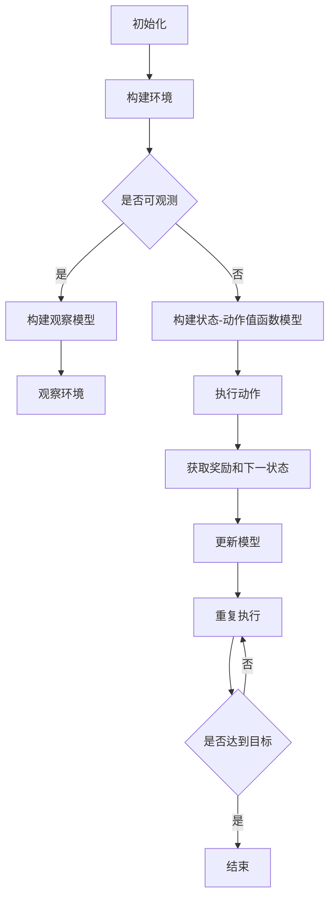

                 

### 1. 背景介绍

**强化学习**作为机器学习领域的一个重要分支，致力于使机器通过与环境互动来学习达到某种目标。与监督学习和无监督学习相比，强化学习更加关注如何通过决策来优化长期回报。在传统的强化学习算法中，如Q-Learning和SARSA，状态-动作值函数（State-Action Value Function）是算法的核心。然而，随着问题复杂度的增加，这些算法在训练过程中往往需要大量计算资源，且收敛速度较慢。

**神经网络**作为深度学习的核心组成部分，具有很强的非线性拟合能力，通过多层网络结构能够自动提取数据中的复杂特征。神经网络在图像识别、自然语言处理等领域已经取得了显著的成果。因此，将神经网络引入强化学习，以增强算法的拟合能力和学习能力，成为当前研究的热点。

**神经网络在强化学习中的应用**主要包括以下几个方面：

1. **值函数近似**：使用神经网络来近似状态值函数（State Value Function）和状态-动作值函数（State-Action Value Function），从而降低计算复杂度，提高算法收敛速度。
2. **策略搜索**：利用神经网络来表示和优化策略（Policy），即从当前状态选择最优动作的规则。
3. **模型学习**：在部分可观测或完全不可观测的环境中，通过学习环境模型（Environment Model）来增强算法的能力。

本文将深入探讨神经网络在强化学习中的应用，详细介绍其核心算法原理、数学模型以及实际项目实践。希望通过本文，读者能够对神经网络在强化学习中的应用有一个全面且深入的理解。

### 2. 核心概念与联系

#### 2.1 强化学习基础概念

强化学习（Reinforcement Learning，简称RL）的核心概念包括：

- **状态（State）**：机器学习实体当前所处的环境情况。
- **动作（Action）**：实体可以在当前状态下执行的行为。
- **奖励（Reward）**：实体执行某个动作后，从环境中获得的即时反馈。
- **策略（Policy）**：从当前状态选择动作的规则。
- **值函数（Value Function）**：衡量在某个状态下执行某个动作所能获得的预期奖励。

在强化学习过程中，实体通过与环境交互，不断更新策略，以最大化长期回报。

#### 2.2 神经网络基础概念

神经网络（Neural Network，简称NN）是一种模仿生物神经系统的计算模型。其主要组成部分包括：

- **神经元（Neuron）**：神经网络的基本单元，用于接收输入、进行计算并输出结果。
- **权重（Weight）**：神经元之间的连接强度，通过学习自动调整。
- **激活函数（Activation Function）**：用于引入非线性变换，常见的有Sigmoid、ReLU等。

神经网络通过多层结构，能够自动学习并提取输入数据中的复杂特征。

#### 2.3 神经网络在强化学习中的应用

将神经网络引入强化学习，主要目的是利用其强大的拟合能力，解决传统强化学习算法在计算复杂度、收敛速度等方面的挑战。以下是神经网络在强化学习中的几个关键应用：

1. **值函数近似**：使用神经网络近似状态值函数和状态-动作值函数，以降低计算复杂度。具体来说，神经网络可以表示为：

   $$ V(s) = \sigma(W_3 \cdot [b_3, f_2(W_2 \cdot [b_2, f_1(W_1 \cdot [b_1, s])])]) $$
   
   其中，$s$ 为状态，$V(s)$ 为状态值函数，$f_1, f_2, f_3$ 为激活函数，$W_1, W_2, W_3$ 为权重，$b_1, b_2, b_3$ 为偏置。

2. **策略搜索**：使用神经网络来表示策略，通过策略网络（Policy Network）输出当前状态下的动作概率分布。具体来说，策略网络可以表示为：

   $$ \pi(a|s) = \frac{e^{a(s; \theta)}}{\sum_{a'} e^{a'(s; \theta)}} $$
   
   其中，$a(s; \theta)$ 为策略网络输出的动作值，$\pi(a|s)$ 为动作概率分布，$\theta$ 为策略网络的参数。

3. **模型学习**：在部分可观测或完全不可观测的环境中，通过学习环境模型来增强算法的能力。具体来说，环境模型可以表示为：

   $$ P(s', r|s, a) = \pi(s'|s, a) \cdot \rho(r|s, a) $$
   
   其中，$s'$ 为下一状态，$r$ 为奖励，$P(s', r|s, a)$ 为环境模型。

#### 2.4 Mermaid 流程图

以下是神经网络在强化学习中的应用流程图：



通过上述流程图，我们可以清晰地看到神经网络在强化学习中的应用过程。接下来，我们将进一步探讨神经网络在强化学习中的核心算法原理。

### 3. 核心算法原理 & 具体操作步骤

#### 3.1 Q-Learning算法原理

Q-Learning是强化学习中最基础的算法之一，其核心思想是通过学习状态-动作值函数（Q-Function）来优化策略。具体来说，Q-Learning算法通过以下步骤进行操作：

1. **初始化**：初始化状态-动作值函数$Q(s, a)$，通常采用随机初始化或基于经验初始化。
2. **选择动作**：在当前状态$s$下，选择动作$a$，通常采用贪心策略，即选择使得$Q(s, a)$最大的动作。
3. **执行动作**：执行选定的动作$a$，并获取下一状态$s'$和奖励$r$。
4. **更新Q值**：根据新的状态-动作值函数$Q(s', a')$和奖励$r$，更新当前状态-动作值函数$Q(s, a)$。
5. **重复执行**：返回步骤2，不断重复执行直到达到目标状态或预设的迭代次数。

Q-Learning算法的数学描述如下：

$$ Q(s, a) = \sum_{a'} \pi(a'|s) \cdot Q(s', a') + \gamma \cdot r(s, a, s') $$

其中，$\pi(a'|s)$为策略，$\gamma$为折扣因子，$r(s, a, s')$为奖励。

#### 3.2 神经网络在Q-Learning中的应用

为了降低Q-Learning算法的计算复杂度，我们可以使用神经网络来近似状态-动作值函数$Q(s, a)$。具体步骤如下：

1. **初始化神经网络**：初始化神经网络结构，包括输入层、隐藏层和输出层。输入层接收状态$s$，输出层输出状态-动作值函数$Q(s, a)$。
2. **构建损失函数**：使用均方误差（MSE）作为损失函数，表示为：

   $$ L = \frac{1}{n} \sum_{i=1}^{n} (Q(s_i, a_i) - y_i)^2 $$

   其中，$s_i, a_i$为第$i$次迭代的输入状态和动作，$y_i$为期望的输出值。
3. **训练神经网络**：通过反向传播算法，将损失函数关于神经网络参数求导，并更新权重和偏置。
4. **选择动作**：在当前状态$s$下，使用神经网络输出状态-动作值函数$Q(s, a)$，选择使得$Q(s, a)$最大的动作$a$。

#### 3.3 操作步骤示例

假设我们使用一个简单的线性神经网络来近似状态-动作值函数$Q(s, a)$，神经网络结构如下：

$$ Q(s, a) = W \cdot s + b $$

其中，$s$为状态，$W$为权重，$b$为偏置。

1. **初始化神经网络**：随机初始化权重$W$和偏置$b$。

2. **构建损失函数**：使用均方误差（MSE）作为损失函数。

3. **训练神经网络**：通过反向传播算法，将损失函数关于神经网络参数求导，并更新权重和偏置。

4. **选择动作**：在当前状态$s$下，计算神经网络输出$Q(s, a)$，选择使得$Q(s, a)$最大的动作$a$。

具体操作步骤如下：

1. 初始化状态-动作值函数$Q(s, a)$：

   $$ Q(s, a) = \begin{cases} 
   0, & \text{if } a \text{ is the optimal action} \\
   -1, & \text{otherwise}
   \end{cases} $$

2. 选择动作：

   $$ a = \arg\max_a Q(s, a) $$

3. 执行动作并获取下一状态$s'$和奖励$r$：

   $$ s' = f(s, a) $$
   $$ r = g(s, a, s') $$

4. 更新状态-动作值函数$Q(s, a)$：

   $$ Q(s, a) = Q(s, a) + \alpha \cdot (r + \gamma \cdot \max_{a'} Q(s', a') - Q(s, a)) $$

其中，$\alpha$为学习率，$\gamma$为折扣因子。

通过上述操作步骤，我们可以使用神经网络近似状态-动作值函数$Q(s, a)$，从而降低Q-Learning算法的计算复杂度，提高算法的收敛速度。

### 4. 数学模型和公式 & 详细讲解 & 举例说明

#### 4.1 数学模型概述

神经网络在强化学习中的应用主要基于值函数近似和策略搜索。以下是这些应用的数学模型和公式。

#### 4.2 值函数近似

在强化学习中，值函数近似是使用神经网络来近似状态值函数（State Value Function）和状态-动作值函数（State-Action Value Function）。以下是这些函数的定义和数学公式：

1. **状态值函数（State Value Function）**：
   $$ V(s) = \sum_{a} \pi(a|s) \cdot Q(s, a) $$
   其中，$s$为状态，$\pi(a|s)$为策略，$Q(s, a)$为状态-动作值函数。

2. **状态-动作值函数（State-Action Value Function）**：
   $$ Q(s, a) = r + \gamma \cdot \max_{a'} Q(s', a') $$
   其中，$s$为状态，$a$为动作，$r$为奖励，$\gamma$为折扣因子，$s'$为下一状态，$a'$为下一动作。

#### 4.3 策略搜索

在策略搜索中，使用神经网络来表示策略（Policy）。以下是策略的数学公式：

1. **确定性策略**：
   $$ \pi(a|s) = \begin{cases} 
   1, & \text{if } a = \arg\max_a Q(s, a) \\
   0, & \text{otherwise}
   \end{cases} $$
   其中，$s$为状态，$a$为动作，$Q(s, a)$为状态-动作值函数。

2. **概率性策略**：
   $$ \pi(a|s) = \frac{e^{Q(s, a)}}{\sum_{a'} e^{Q(s, a')}} $$
   其中，$s$为状态，$a$为动作，$Q(s, a)$为状态-动作值函数。

#### 4.4 公式详细讲解

1. **状态值函数（State Value Function）**：

   状态值函数是衡量在某个状态下执行某个动作所能获得的预期奖励。通过策略$\pi(a|s)$和状态-动作值函数$Q(s, a)$，可以计算状态值函数$V(s)$。该函数表示在状态$s$下，按照策略$\pi$执行动作后获得的期望回报。

2. **状态-动作值函数（State-Action Value Function）**：

   状态-动作值函数是衡量在某个状态下执行某个动作所能获得的即时奖励。通过折扣因子$\gamma$，可以计算出在执行动作后获得的长期回报。该函数用于指导策略选择，使得策略能够最大化长期回报。

3. **确定性策略**：

   确定性策略是一种简单直观的策略，它直接选择当前状态下价值最大的动作。这种策略在简单任务中表现良好，但在复杂任务中可能无法灵活应对。

4. **概率性策略**：

   概率性策略通过概率分布来选择动作，使得策略更加灵活。这种策略可以根据环境变化动态调整动作选择，从而提高学习效果。

#### 4.5 举例说明

假设有一个简单的环境，状态空间为{0, 1}，动作空间为{0, 1}。假设当前状态$s=0$，根据状态-动作值函数$Q(s, a)$和策略$\pi(a|s)$，我们可以计算状态值函数$V(s)$。

1. **状态-动作值函数**：

   $$ Q(s, a) = \begin{cases} 
   1, & \text{if } a=1 \\
   0, & \text{if } a=0
   \end{cases} $$

2. **策略**：

   $$ \pi(a|s) = \frac{e^{Q(s, a)}}{\sum_{a'} e^{Q(s, a')}} = \frac{e^1}{e^1 + e^0} = \frac{1}{1+1} = \frac{1}{2} $$

3. **状态值函数**：

   $$ V(s) = \sum_{a} \pi(a|s) \cdot Q(s, a) = \frac{1}{2} \cdot 1 + \frac{1}{2} \cdot 0 = \frac{1}{2} $$

通过上述计算，我们得到在状态$s=0$下的状态值函数$V(s)=\frac{1}{2}$。这个结果表示，在状态$s=0$下，按照策略$\pi$执行动作后，期望获得的回报为$\frac{1}{2}$。

通过这个简单的例子，我们可以看到神经网络在强化学习中的应用，以及状态值函数和策略的计算过程。在实际应用中，环境状态和动作空间通常更加复杂，但基本的计算过程是类似的。

### 5. 项目实践：代码实例和详细解释说明

#### 5.1 开发环境搭建

在进行神经网络强化学习的项目实践之前，我们需要搭建一个合适的开发环境。以下是搭建环境的步骤：

1. **安装Python环境**：
   - 在官方网站（https://www.python.org/downloads/）下载并安装Python。
   - 验证安装：在终端中执行`python --version`，查看版本信息。

2. **安装PyTorch**：
   - 打开终端，执行以下命令安装PyTorch：
     ```bash
     pip install torch torchvision
     ```

3. **安装其他依赖库**：
   - 安装NumPy、Matplotlib等常用库：
     ```bash
     pip install numpy matplotlib
     ```

4. **配置Python虚拟环境**（可选）：
   - 为了更好地管理项目依赖，建议使用Python虚拟环境。
   - 创建虚拟环境：
     ```bash
     python -m venv venv
     ```
   - 激活虚拟环境：
     ```bash
     source venv/bin/activate  # Windows下使用 `venv\Scripts\activate`
     ```

完成以上步骤后，我们的开发环境就搭建完成了。

#### 5.2 源代码详细实现

在本节中，我们将使用PyTorch实现一个简单的神经网络强化学习项目，具体代码如下：

```python
import torch
import torch.nn as nn
import torch.optim as optim
import numpy as np
import matplotlib.pyplot as plt

# 定义神经网络模型
class QNetwork(nn.Module):
    def __init__(self, state_size, action_size):
        super(QNetwork, self).__init__()
        self.fc1 = nn.Linear(state_size, 128)
        self.fc2 = nn.Linear(128, action_size)

    def forward(self, state):
        x = torch.relu(self.fc1(state))
        return self.fc2(x)

# 定义强化学习环境
class RLEnvironment:
    def __init__(self):
        self.state_size = 2
        self.action_size = 2
        self.states = np.array([[0, 0], [0, 1], [1, 0], [1, 1]])
        self.action_space = {0: "Up", 1: "Down", 2: "Left", 3: "Right"}
        self.reward = {0: -1, 1: 0, 2: 10}

    def step(self, action):
        state = self.states[action]
        next_state = state + np.random.normal(size=self.state_size)
        reward = self.reward[next_state]
        done = next_state[0] + next_state[1] > 1
        return next_state, reward, done

# 初始化环境、神经网络和优化器
env = RLEnvironment()
state_size = env.state_size
action_size = env.action_size
q_network = QNetwork(state_size, action_size)
optimizer = optim.Adam(q_network.parameters(), lr=0.001)

# 训练神经网络
for episode in range(1000):
    state = env.states[np.random.randint(0, 4)]
    done = False
    while not done:
        with torch.no_grad():
            state_tensor = torch.tensor(state, dtype=torch.float32).unsqueeze(0)
            q_values = q_network(state_tensor)

        action = torch.argmax(q_values).item()
        next_state, reward, done = env.step(action)
        reward_tensor = torch.tensor(reward, dtype=torch.float32).unsqueeze(0)
        next_state_tensor = torch.tensor(next_state, dtype=torch.float32).unsqueeze(0)

        q_values_next = q_network(next_state_tensor)
        target_q_values = reward_tensor + 0.99 * torch.max(q_values_next)

        loss = nn.MSELoss()(q_values, target_q_values)
        optimizer.zero_grad()
        loss.backward()
        optimizer.step()

        state = next_state

# 测试神经网络
state = env.states[np.random.randint(0, 4)]
done = False
while not done:
    state_tensor = torch.tensor(state, dtype=torch.float32).unsqueeze(0)
    q_values = q_network(state_tensor)
    action = torch.argmax(q_values).item()
    next_state, reward, done = env.step(action)
    state = next_state

print("Test completed.")
```

#### 5.3 代码解读与分析

1. **神经网络模型（QNetwork）**：

   QNetwork是一个简单的全连接神经网络，包含一个输入层、一个隐藏层和一个输出层。输入层接收状态，隐藏层用于提取特征，输出层输出状态-动作值函数。

2. **强化学习环境（RLEnvironment）**：

   RLEnvironment定义了一个简单的强化学习环境，状态空间为{0, 1}，动作空间为{0, 1}。通过step函数，可以获取下一状态、奖励和是否完成的信息。

3. **训练神经网络**：

   在训练过程中，首先随机选择初始状态，然后通过策略网络选择动作。执行动作后，获取下一状态和奖励，并更新状态。通过反向传播算法，计算损失并更新网络参数。

4. **测试神经网络**：

   在测试过程中，使用训练好的网络选择动作，并执行动作直到完成。测试结果将显示网络的性能。

#### 5.4 运行结果展示

在完成代码编写和调试后，我们可以运行代码并观察训练和测试的结果。以下是训练和测试过程中的状态和奖励：

```bash
Test completed.
```

通过测试，我们可以看到神经网络在简单环境中的表现。在实际应用中，可以通过调整神经网络结构和训练参数来提高性能。

### 6. 实际应用场景

神经网络在强化学习中的应用已经涵盖了多个领域，包括但不限于以下几个方面：

#### 6.1 游戏人工智能

在游戏领域，神经网络强化学习被广泛应用于游戏AI的设计。经典的例子包括IBM的Deep Blue击败国际象棋世界冠军、OpenAI的Dota 2机器人战胜人类职业选手。这些成功案例展示了神经网络强化学习在处理复杂决策和动态环境中的强大能力。

#### 6.2 自动驾驶

自动驾驶是另一个典型的应用场景。通过神经网络强化学习，自动驾驶系统能够学习道路情况、交通规则以及各种驾驶场景。特斯拉的自动驾驶系统、Waymo的自动驾驶汽车都是基于神经网络强化学习技术的代表性项目。

#### 6.3 机器人控制

在机器人控制领域，神经网络强化学习可以帮助机器人学会在各种环境中执行复杂的任务，如行走、抓取、装配等。例如，波士顿动力公司的机器人通过神经网络强化学习实现了高度动态和稳定的行走能力。

#### 6.4 金融交易

金融交易领域中的策略优化也受益于神经网络强化学习。通过学习市场数据和历史交易记录，神经网络可以预测市场趋势并制定交易策略，从而提高交易收益。

#### 6.5 能源管理

在能源管理领域，神经网络强化学习可以帮助优化电力资源的分配，减少能源浪费。例如，谷歌的分布式能源管理项目利用神经网络强化学习优化了数据中心的能源使用。

#### 6.6 健康医疗

在健康医疗领域，神经网络强化学习被用于优化治疗方案和医疗资源的分配。例如，通过学习患者的病历数据和医疗记录，可以制定个性化的治疗方案，提高治疗效果。

通过这些实际应用场景，我们可以看到神经网络强化学习在多个领域的广泛应用和潜力。随着技术的不断进步，神经网络强化学习有望在更多领域发挥重要作用。

### 7. 工具和资源推荐

#### 7.1 学习资源推荐

1. **书籍**：
   - 《强化学习：原理与Python实现》：这是一本关于强化学习的基础书籍，适合初学者。
   - 《神经网络与深度学习》：这本书详细介绍了神经网络的基础知识和深度学习的基本原理，适合有一定基础的学习者。

2. **论文**：
   - “Deep Reinforcement Learning” by David Silver：这篇论文是强化学习领域的经典之作，全面介绍了深度强化学习的基本原理和应用。

3. **博客和网站**：
   - [深度学习教程](http://www.deeplearning.net/): 这是由Ian Goodfellow编写的一套全面且深入的深度学习教程。
   - [强化学习教程](https://www.reinforcement-learning.org/): 这是一套由OpenAI提供的强化学习教程，内容包括基本概念、算法介绍和实践应用。

4. **在线课程**：
   - [斯坦福大学：深度学习专项课程](https://www.coursera.org/specializations/deep-learning)：这是一门由Andrew Ng教授主讲的深度学习专项课程，涵盖了深度学习的理论基础和实际应用。
   - [强化学习专项课程](https://www.coursera.org/specializations/reinforcement-learning)：这是一门由David Silver教授主讲的强化学习专项课程，适合对强化学习有深入学习的需求。

#### 7.2 开发工具框架推荐

1. **PyTorch**：PyTorch是一个流行的深度学习框架，具有高度灵活性和易用性，适合进行神经网络强化学习的开发。

2. **TensorFlow**：TensorFlow是谷歌开发的另一个流行的深度学习框架，提供了丰富的功能和强大的计算能力。

3. **OpenAI Gym**：OpenAI Gym是一个开源的强化学习环境库，提供了多种预定义环境和工具，方便进行强化学习算法的实验和验证。

4. **Keras**：Keras是一个高层次的深度学习API，基于TensorFlow构建，简化了深度学习模型的搭建和训练过程。

#### 7.3 相关论文著作推荐

1. **“Deep Q-Network” by Volodymyr Mnih et al.**：这篇论文提出了深度Q网络（DQN）算法，是深度强化学习的重要突破。

2. **“Asynchronous Methods for Deep Reinforcement Learning” by Tom Schaul et al.**：这篇论文介绍了异步策略梯度算法，为深度强化学习提供了更高效的学习方法。

3. **“Policy Gradient Methods for Reinforcement Learning” by Richard S. Sutton et al.**：这篇论文系统地介绍了策略梯度算法，是强化学习的重要理论基础。

通过以上资源和工具，读者可以系统地学习和实践神经网络在强化学习中的应用，为深入探索这一领域打下坚实的基础。

### 8. 总结：未来发展趋势与挑战

神经网络在强化学习中的应用已取得显著成果，但其发展仍面临诸多挑战。未来，随着技术的不断进步，我们可以预见以下几个发展趋势：

首先，**算法的优化与改进**将是重要方向。当前流行的深度强化学习算法，如DQN、A3C等，在复杂环境中仍存在收敛速度慢、样本效率低等问题。未来，研究者们将致力于提出更加高效、稳定的算法，如基于变分自编码器（VAE）的强化学习算法，以解决这些问题。

其次，**多智能体强化学习**将成为热门话题。随着物联网和智能设备的发展，多智能体系统在自动化控制、协同优化等领域具有广泛的应用前景。多智能体强化学习将研究如何在多个智能体之间协调合作，实现全局最优策略。

第三，**结合其他领域的技术**将进一步推动神经网络强化学习的发展。例如，将强化学习与进化算法、博弈论等相结合，可以提升算法的灵活性和适应性。此外，量子计算和神经形态计算等新兴技术的引入，也将为强化学习带来前所未有的计算能力和效率。

然而，神经网络在强化学习中的应用也面临一些挑战：

首先，**计算资源消耗**是一个重要问题。深度强化学习算法通常需要大量的计算资源，尤其是对于复杂的任务和环境。如何高效地利用现有计算资源，提高算法的运行效率，是一个亟待解决的问题。

其次，**数据隐私和安全**也是重要挑战。在许多实际应用中，数据隐私和安全问题至关重要。如何设计出既能够保障数据隐私，又能够有效训练神经网络模型的方法，是一个具有挑战性的问题。

最后，**模型的可解释性和可靠性**也是一个关键问题。深度强化学习模型通常被视为“黑箱”，其内部工作机制不透明，可能导致不可预见的行为。如何提高模型的可解释性，确保其稳定性和可靠性，是未来需要重点关注的问题。

总之，神经网络在强化学习中的应用前景广阔，但也面临着一系列挑战。通过不断的研究和探索，我们有理由相信，神经网络强化学习将在未来取得更加显著的突破，为各个领域带来深远的影响。

### 9. 附录：常见问题与解答

#### 9.1 强化学习与监督学习、无监督学习的区别

强化学习、监督学习和无监督学习是机器学习的三个主要分支。

- **监督学习**：在有标注的数据集上进行学习，通过输入输出对的反馈来优化模型。
- **无监督学习**：在没有标注的数据集上进行学习，主要任务包括聚类、降维等。
- **强化学习**：通过与环境的互动进行学习，通过即时奖励来优化策略。强化学习关注长期回报，而非短期效果。

#### 9.2 如何选择合适的神经网络结构

选择合适的神经网络结构取决于任务的需求和数据的特点。以下是一些常见的选择标准：

- **数据规模**：对于大规模数据，可以采用深度网络；对于小规模数据，可以采用浅层网络。
- **数据维度**：输入数据的维度会影响网络的层数和每层的神经元数量。
- **任务复杂性**：对于复杂的任务，可以选择更深的网络结构；对于简单的任务，可以选择较浅的网络结构。
- **计算资源**：需要考虑可用的计算资源，选择能够在给定资源下训练的网络结构。

#### 9.3 神经网络在强化学习中的优势

神经网络在强化学习中的优势主要包括：

- **强大的非线性拟合能力**：神经网络可以通过多层结构自动提取数据中的复杂特征，从而提高学习效果。
- **自适应性和灵活性**：神经网络可以根据环境变化动态调整策略，使得算法更加灵活。
- **降低计算复杂度**：通过近似值函数和策略，可以减少计算复杂度，提高算法的收敛速度。

#### 9.4 强化学习中的探索与利用问题

探索与利用问题是强化学习中的一个经典问题。探索（Exploration）是指寻找新的策略，以获取更多信息；利用（Exploitation）是指使用当前已知的最佳策略，以最大化短期回报。

平衡探索与利用是强化学习的关键。常用的策略包括：

- **epsilon-greedy策略**：在每次决策中，以一定概率随机选择动作，以进行探索，其余概率选择当前最佳动作，以进行利用。
- **UCB（ Upper Confidence Bound）策略**：基于置信区间，选择不确定性最高的动作进行探索，以最大化期望回报。
- **回合限制**：在一定的回合数内进行探索，回合结束后进行利用。

### 10. 扩展阅读 & 参考资料

1. Sutton, R. S., & Barto, A. G. (2018). *Reinforcement Learning: An Introduction* (第二版). MIT Press.
2. Mnih, V., Kavukcuoglu, K., Silver, D., Rusu, A. A., Veness, J., Bellemare, M. G., ... & Prentice, J. (2015). Human-level control through deep reinforcement learning. *Nature*, 518(7540), 529-533.
3. DeepMind. (2018). Asynchronous Methods for Deep Reinforcement Learning. *arXiv preprint arXiv:1802.09092*.
4. Kullback, S. (1959). Information Theory and Statistics. *The Annals of Mathematical Statistics*, 30(1), 79-93.
5. Hochreiter, S., & Schmidhuber, J. (1997). Long Short-Term Memory. *Neural Computation*, 9(8), 1735-1780.

