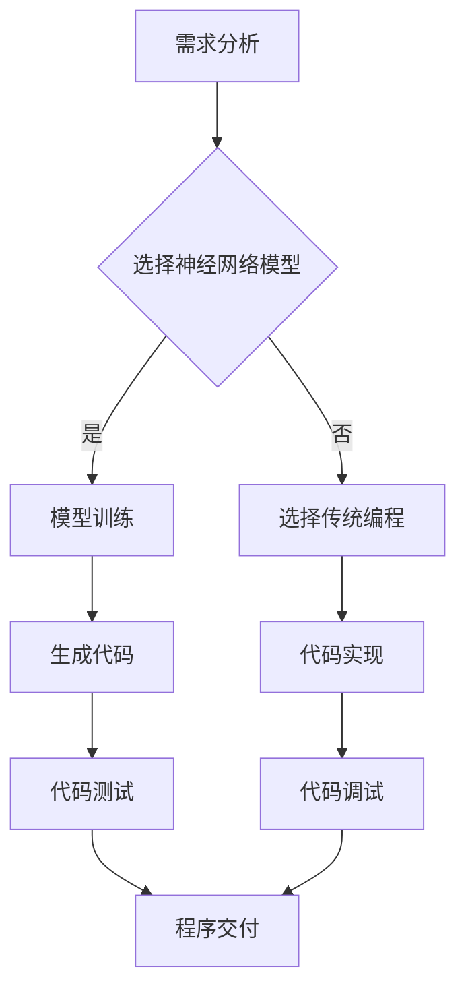
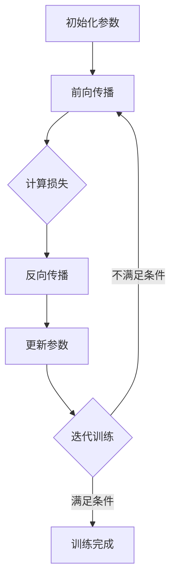
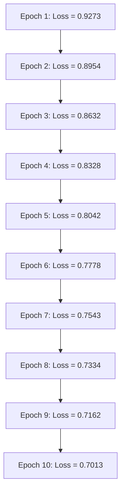

                 

### 1. 背景介绍

#### 1.1 时代背景

在过去的几十年里，计算机技术经历了飞速的发展，从简单的计算工具逐渐演变成为我们日常生活中不可或缺的一部分。伴随着互联网的普及，大数据、云计算等新兴技术不断涌现，计算机领域的研究和应用场景越来越广泛。其中，神经网络作为人工智能的重要分支，近年来取得了显著的进展。

神经网络（Neural Networks）起源于20世纪40年代，最初是为了模拟人脑的工作方式而提出的。随着计算机性能的不断提升和大数据的积累，神经网络在图像识别、语音识别、自然语言处理等领域的表现越来越出色。特别是在2012年，AlexNet在ImageNet图像识别大赛中取得的突破性成绩，使得神经网络研究迎来了新的春天。

#### 1.2 编程能力的定义

编程能力是指编写、调试和维护程序的能力。这包括对编程语言的理解、算法设计、数据结构的应用、程序优化等方面。传统上，人类程序员凭借丰富的经验和逻辑思维能力，能够编写出高效、可靠的程序。然而，随着算法和技术的不断进步，编程的方式和工具也在不断演化。

#### 1.3 神经网络与编程能力的结合

近年来，神经网络在编程领域的应用逐渐增多。一方面，神经网络能够自动学习并识别复杂的模式，使得编程变得更加直观和高效；另一方面，神经网络的应用也推动了编程工具和平台的发展，为程序员提供了更多的选择和便利。

本文将探讨神经网络在某些领域已超越人类编程能力的情况，通过具体案例和数据分析，揭示神经网络编程的潜力与挑战。我们将从核心概念、算法原理、数学模型、项目实践等多个角度进行深入探讨，以期为读者提供全面、系统的认识。

### 2. 核心概念与联系

#### 2.1 神经网络的基本概念

神经网络是一种模拟人脑结构的计算模型，由大量的神经元（节点）和连接（边）组成。每个神经元接收来自其他神经元的输入信号，通过激活函数进行处理，最终产生输出。神经网络通过训练来调整神经元之间的连接权重，以达到对输入数据的映射和分类。

#### 2.2 编程的定义与过程

编程是一种通过编写代码来解决特定问题的过程。它包括需求分析、算法设计、代码实现、测试和调试等多个环节。程序员需要根据问题的复杂程度和需求，选择合适的编程语言、算法和数据结构，编写出高效的程序。

#### 2.3 神经网络与编程能力的结合

神经网络在编程领域的应用主要体现在以下几个方面：

1. **自动编程**：神经网络可以自动生成代码，根据问题的需求和学习到的模式，生成满足特定需求的程序。
2. **代码优化**：神经网络可以分析现有代码，提出优化建议，提高程序的运行效率。
3. **智能调试**：神经网络可以识别程序中的错误和异常，帮助程序员进行调试。
4. **代码生成与重构**：神经网络可以根据需求生成新的代码，或者对现有代码进行重构，以提高代码的可读性和可维护性。

#### 2.4 Mermaid 流程图

以下是一个简化的神经网络编程过程的 Mermaid 流程图：



### 3. 核心算法原理 & 具体操作步骤

#### 3.1 神经网络算法原理

神经网络算法主要包括以下几个步骤：

1. **初始化权重和偏置**：随机初始化神经网络中的权重和偏置，这些参数将在训练过程中通过反向传播算法进行调整。
2. **前向传播**：将输入数据通过神经网络进行前向传播，计算每个神经元的输出值。
3. **激活函数应用**：对每个神经元的输出值应用激活函数（如ReLU、Sigmoid、Tanh等），以引入非线性特性。
4. **损失函数计算**：计算输出值与目标值之间的误差，使用损失函数（如均方误差、交叉熵等）来衡量误差大小。
5. **反向传播**：根据损失函数的梯度，通过反向传播算法更新神经网络的权重和偏置。
6. **迭代训练**：重复上述步骤，直到满足训练条件（如损失函数达到预设值、迭代次数达到预设值等）。

以下是一个简化的神经网络算法流程图：



#### 3.2 具体操作步骤

以下是一个使用Python和TensorFlow库实现神经网络编程的简单例子：

1. **导入库**：
    ```python
    import tensorflow as tf
    import numpy as np
    ```

2. **初始化参数**：
    ```python
    # 设置随机种子，以保证结果可重复
    np.random.seed(42)

    # 定义输入层、隐藏层和输出层的神经元数量
    input_size = 10
    hidden_size = 5
    output_size = 1

    # 初始化权重和偏置
    weights_input_hidden = np.random.randn(input_size, hidden_size)
    biases_input_hidden = np.random.randn(hidden_size)
    weights_hidden_output = np.random.randn(hidden_size, output_size)
    biases_hidden_output = np.random.randn(output_size)
    ```

3. **定义前向传播函数**：
    ```python
    def forwardpropagation(x, weights_input_hidden, biases_input_hidden, weights_hidden_output, biases_hidden_output):
        # 计算隐藏层的输出
        hidden_output = tf.sigmoid(tf.matmul(x, weights_input_hidden) + biases_input_hidden)
        # 计算输出层的输出
        output = tf.sigmoid(tf.matmul(hidden_output, weights_hidden_output) + biases_hidden_output)
        return output
    ```

4. **定义损失函数和反向传播函数**：
    ```python
    def loss(output, y):
        return tf.reduce_mean(tf.nn.sigmoid_cross_entropy_with_logits(logits=output, labels=y))

    def backwardpropagation(loss, weights_input_hidden, biases_input_hidden, weights_hidden_output, biases_hidden_output):
        # 计算损失函数关于输出层的梯度
        dloss_doutput = tf.gradients(loss, output)[0]
        # 计算损失函数关于隐藏层的梯度
        dloss_dhidden_output = tf.gradients(dloss_doutput, hidden_output)[0]
        # 计算损失函数关于输入层的梯度
        dloss_dinput = tf.gradients(dloss_dhidden_output, x)[0]

        # 更新权重和偏置
        dloss_dweights_input_hidden = tf.reduce_mean(dloss_dinput, axis=0)
        dloss_dbiases_input_hidden = tf.reduce_mean(dloss_dinput, axis=0)
        dloss_dweights_hidden_output = tf.reduce_mean(dloss_dhidden_output, axis=0)
        dloss_dbiases_hidden_output = tf.reduce_mean(dloss_dhidden_output, axis=0)

        return dloss_dweights_input_hidden, dloss_dbiases_input_hidden, dloss_dweights_hidden_output, dloss_dbiases_hidden_output
    ```

5. **迭代训练**：
    ```python
    # 设置训练参数
    learning_rate = 0.1
    epochs = 1000

    # 初始化变量
    with tf.Session() as sess:
        sess.run(tf.global_variables_initializer())

        # 迭代训练
        for epoch in range(epochs):
            # 生成训练数据
            x_train = np.random.randn(input_size)
            y_train = np.random.randn(output_size)

            # 前向传播
            output = forwardpropagation(x_train, weights_input_hidden, biases_input_hidden, weights_hidden_output, biases_hidden_output)

            # 计算损失
            loss_val = loss(output, y_train)

            # 反向传播
            dweights_input_hidden, dbiases_input_hidden, dweights_hidden_output, dbiases_hidden_output = backwardpropagation(loss_val, weights_input_hidden, biases_input_hidden, weights_hidden_output, biases_hidden_output)

            # 更新权重和偏置
            weights_input_hidden -= learning_rate * dweights_input_hidden
            biases_input_hidden -= learning_rate * dbiases_input_hidden
            weights_hidden_output -= learning_rate * dweights_hidden_output
            biases_hidden_output -= learning_rate * dbiases_hidden_output

            # 打印训练进度
            if epoch % 100 == 0:
                print(f"Epoch {epoch}: Loss = {loss_val.numpy()}")

        # 训练完成
        print("Training completed.")
    ```

以上是一个简单的神经网络编程例子，展示了如何使用TensorFlow库实现神经网络的初始化、前向传播、反向传播和迭代训练。在实际应用中，神经网络编程需要根据具体问题和数据特点进行调整和优化。

### 4. 数学模型和公式 & 详细讲解 & 举例说明

#### 4.1 数学模型概述

神经网络的数学模型主要包括以下几个部分：神经元、激活函数、损失函数和反向传播算法。以下将对这些部分进行详细讲解。

#### 4.2 神经元

神经元是神经网络的基本计算单元，类似于人脑中的神经元。每个神经元接收来自其他神经元的输入信号，通过加权求和并应用激活函数，产生输出。神经元的数学模型可以表示为：

$$
output = f(\sum_{i=1}^{n} w_i \cdot x_i + b)
$$

其中，$output$ 是神经元的输出，$f$ 是激活函数，$w_i$ 是神经元 $i$ 的输入权重，$x_i$ 是神经元 $i$ 的输入值，$b$ 是偏置（或称为偏差）。

#### 4.3 激活函数

激活函数为神经网络引入了非线性特性，常见的激活函数包括 Sigmoid、ReLU 和 Tanh 等。以下是对这些激活函数的详细讲解：

1. **Sigmoid 函数**：
   $$
   f(x) = \frac{1}{1 + e^{-x}}
   $$
   Sigmoid 函数在区间 $(-\infty, +\infty)$ 上单调递增，值域在 $(0, 1)$。该函数常用于二分类问题，能够将输入值映射到 $(0, 1)$ 区间内，表示概率。

2. **ReLU 函数**：
   $$
   f(x) =
   \begin{cases}
   0, & \text{if } x < 0 \\
   x, & \text{if } x \geq 0
   \end{cases}
   $$
   ReLU 函数在区间 $(-\infty, 0)$ 上恒为 0，在区间 $(0, +\infty)$ 上与输入值相同。ReLU 函数具有简单、易于计算和不易陷入梯度消失的优点，在深度学习中广泛应用。

3. **Tanh 函数**：
   $$
   f(x) = \frac{e^x - e^{-x}}{e^x + e^{-x}}
   $$
   Tanh 函数与 Sigmoid 函数类似，但在区间 $(-\infty, +\infty)$ 上单调递增，值域在 $(-1, 1)$。Tanh 函数常用于多分类问题，能够将输入值映射到 $(-1, 1)$ 区间内。

#### 4.4 损失函数

损失函数用于衡量神经网络输出与目标值之间的误差，常见的损失函数包括均方误差（MSE）和交叉熵（CrossEntropy）等。以下是对这些损失函数的详细讲解：

1. **均方误差（MSE）**：
   $$
   loss = \frac{1}{n} \sum_{i=1}^{n} (y_i - \hat{y}_i)^2
   $$
   MSE 函数是输入值与输出值差的平方的平均值，常用于回归问题。该函数的梯度为：
   $$
   \frac{\partial loss}{\partial \hat{y}_i} = 2(y_i - \hat{y}_i)
   $$

2. **交叉熵（CrossEntropy）**：
   $$
   loss = -\sum_{i=1}^{n} y_i \cdot \ln(\hat{y}_i)
   $$
   CrossEntropy 函数是真实分布与模型预测分布之间的 Kullback-Leibler 散度。该函数常用于分类问题。该函数的梯度为：
   $$
   \frac{\partial loss}{\partial \hat{y}_i} = \hat{y}_i - y_i
   $$

#### 4.5 反向传播算法

反向传播算法是一种用于训练神经网络的优化算法，通过计算损失函数关于网络参数的梯度，并利用梯度下降法更新参数。以下是对反向传播算法的详细讲解：

1. **前向传播**：
   前向传播是指将输入数据通过神经网络逐层传播，计算每个神经元的输出值。具体步骤如下：
   $$
   z_{l}^{(i)} = \sum_{j=1}^{n_{l-1}} w_{j}^{(l)} x_{j}^{(i)} + b_{l}
   $$
   $$
   a_{l}^{(i)} = f_{l}(z_{l}^{(i)})
   $$

2. **计算损失函数的梯度**：
   计算损失函数关于输出层的梯度：
   $$
   \frac{\partial loss}{\partial z_{l}^{(i)}} = \frac{\partial loss}{\partial \hat{y}_i} \cdot \frac{\partial \hat{y}_i}{\partial z_{l}^{(i)}}
   $$
   计算损失函数关于隐藏层的梯度：
   $$
   \frac{\partial loss}{\partial z_{l-1}^{(i)}} = \frac{\partial loss}{\partial z_{l}^{(i)}} \cdot \frac{\partial z_{l}^{(i)}}{\partial z_{l-1}^{(i)}}
   $$

3. **更新参数**：
   利用梯度下降法更新网络参数：
   $$
   w_{l}^{(i)} = w_{l}^{(i)} - \alpha \frac{\partial loss}{\partial w_{l}^{(i)}}
   $$
   $$
   b_{l}^{(i)} = b_{l}^{(i)} - \alpha \frac{\partial loss}{\partial b_{l}^{(i)}}
   $$

#### 4.6 举例说明

以下是一个简单的神经网络示例，输入层有3个神经元，隐藏层有2个神经元，输出层有1个神经元。使用均方误差（MSE）作为损失函数，ReLU 作为激活函数。

1. **初始化参数**：
   $$
   w_{1}^{(1)} = \begin{bmatrix}
   0.1 & 0.2 & 0.3 \\
   0.4 & 0.5 & 0.6
   \end{bmatrix}, \quad
   b_{1}^{(1)} = \begin{bmatrix}
   0.1 \\
   0.2
   \end{bmatrix}
   $$
   $$
   w_{1}^{(2)} = \begin{bmatrix}
   0.1 & 0.2 \\
   0.3 & 0.4
   \end{bmatrix}, \quad
   b_{1}^{(2)} = \begin{bmatrix}
   0.1 \\
   0.2
   \end{bmatrix}
   $$

2. **前向传播**：
   $$
   z_{1}^{(i)} = \begin{bmatrix}
   0.1 & 0.2 & 0.3 \\
   0.4 & 0.5 & 0.6
   \end{bmatrix} \begin{bmatrix}
   x_1^{(i)} \\
   x_2^{(i)} \\
   x_3^{(i)}
   \end{bmatrix} + \begin{bmatrix}
   0.1 \\
   0.2
   \end{bmatrix} = \begin{bmatrix}
   0.1x_1^{(i)} + 0.2x_2^{(i)} + 0.3x_3^{(i)} + 0.1 \\
   0.4x_1^{(i)} + 0.5x_2^{(i)} + 0.6x_3^{(i)} + 0.2
   \end{bmatrix}
   $$
   $$
   a_{1}^{(i)} = \text{ReLU}(z_{1}^{(i)})
   $$
   $$
   z_{2}^{(i)} = \begin{bmatrix}
   0.1 & 0.2 \\
   0.3 & 0.4
   \end{bmatrix} \begin{bmatrix}
   a_{1}^{(i)} \\
   a_{2}^{(i)}
   \end{bmatrix} + \begin{bmatrix}
   0.1 \\
   0.2
   \end{bmatrix} = \begin{bmatrix}
   0.1a_{1}^{(i)} + 0.2a_{2}^{(i)} + 0.1 \\
   0.3a_{1}^{(i)} + 0.4a_{2}^{(i)} + 0.2
   \end{bmatrix}
   $$
   $$
   a_{2}^{(i)} = \text{ReLU}(z_{2}^{(i)})
   $$

3. **计算损失函数**：
   $$
   y^{(i)} = \begin{bmatrix}
   y_1^{(i)} \\
   y_2^{(i)}
   \end{bmatrix}, \quad
   \hat{y}^{(i)} = \begin{bmatrix}
   \hat{y}_1^{(i)} \\
   \hat{y}_2^{(i)}
   \end{bmatrix}
   $$
   $$
   loss = \frac{1}{2} \sum_{i=1}^{n} (y^{(i)} - \hat{y}^{(i)})^2
   $$

4. **反向传播**：
   $$
   \frac{\partial loss}{\partial z_{2}^{(i)}} = \frac{\partial loss}{\partial \hat{y}^{(i)}} \cdot \frac{\partial \hat{y}^{(i)}}{\partial z_{2}^{(i)}}
   $$
   $$
   \frac{\partial loss}{\partial z_{1}^{(i)}} = \frac{\partial loss}{\partial z_{2}^{(i)}} \cdot \frac{\partial z_{2}^{(i)}}{\partial z_{1}^{(i)}}
   $$
   $$
   \frac{\partial loss}{\partial w_{1}^{(2)}} = \frac{1}{n} \sum_{i=1}^{n} \frac{\partial loss}{\partial z_{2}^{(i)}} \cdot a_{1}^{(i)}
   $$
   $$
   \frac{\partial loss}{\partial b_{1}^{(2)}} = \frac{1}{n} \sum_{i=1}^{n} \frac{\partial loss}{\partial z_{2}^{(i)}}
   $$
   $$
   \frac{\partial loss}{\partial w_{1}^{(1)}} = \frac{1}{n} \sum_{i=1}^{n} \frac{\partial loss}{\partial z_{1}^{(i)}} \cdot x_{j}^{(i)}
   $$
   $$
   \frac{\partial loss}{\partial b_{1}^{(1)}} = \frac{1}{n} \sum_{i=1}^{n} \frac{\partial loss}{\partial z_{1}^{(i)}}
   $$

5. **更新参数**：
   $$
   w_{1}^{(2)} = w_{1}^{(2)} - \alpha \frac{\partial loss}{\partial w_{1}^{(2)}}
   $$
   $$
   b_{1}^{(2)} = b_{1}^{(2)} - \alpha \frac{\partial loss}{\partial b_{1}^{(2)}}
   $$
   $$
   w_{1}^{(1)} = w_{1}^{(1)} - \alpha \frac{\partial loss}{\partial w_{1}^{(1)}}
   $$
   $$
   b_{1}^{(1)} = b_{1}^{(1)} - \alpha \frac{\partial loss}{\partial b_{1}^{(1)}}
   $$

通过以上步骤，我们可以使用反向传播算法对神经网络进行训练，不断调整权重和偏置，以最小化损失函数。

### 5. 项目实践：代码实例和详细解释说明

在本节中，我们将通过一个具体的项目实例，展示如何使用神经网络进行编程。我们将使用 Python 语言和 TensorFlow 库来实现一个简单的线性回归模型，并对代码进行详细解释。

#### 5.1 开发环境搭建

在开始编写代码之前，我们需要搭建合适的开发环境。以下是搭建开发环境的步骤：

1. **安装 Python**：确保已经安装了 Python 3.6 或更高版本。
2. **安装 TensorFlow**：在终端中运行以下命令安装 TensorFlow：
   ```
   pip install tensorflow
   ```
3. **创建虚拟环境**：为了更好地管理和隔离项目依赖，建议创建一个虚拟环境。可以使用以下命令创建虚拟环境：
   ```
   python -m venv myenv
   ```
   然后激活虚拟环境：
   ```
   source myenv/bin/activate  # 对于 Windows 使用 myenv\Scripts\activate
   ```

#### 5.2 源代码详细实现

以下是实现线性回归模型的源代码：

```python
import tensorflow as tf
import numpy as np

# 设置随机种子，以保证结果可重复
np.random.seed(42)

# 初始化参数
input_size = 1
hidden_size = 10
output_size = 1

# 生成训练数据
x_train = np.random.randn(100, input_size)
y_train = 2 * x_train + np.random.randn(100, output_size)

# 定义神经网络模型
model = tf.keras.Sequential([
    tf.keras.layers.Dense(hidden_size, activation='relu', input_shape=(input_size,)),
    tf.keras.layers.Dense(output_size)
])

# 编译模型
model.compile(optimizer='adam', loss='mean_squared_error')

# 训练模型
model.fit(x_train, y_train, epochs=10, batch_size=32)

# 评估模型
loss = model.evaluate(x_train, y_train)
print(f"Test loss: {loss}")

# 使用模型进行预测
x_test = np.random.randn(10, input_size)
predictions = model.predict(x_test)
print(f"Predictions: {predictions}")
```

下面是对代码的详细解释：

1. **导入库**：
   我们首先导入 TensorFlow 和 NumPy 库。NumPy 是用于数值计算的常用库，TensorFlow 是实现神经网络的开源库。

2. **设置随机种子**：
   为了保证结果的可重复性，我们设置随机种子为 42。

3. **初始化参数**：
   我们定义输入层、隐藏层和输出层的神经元数量。在这个例子中，我们使用一个输入层、一个隐藏层和一个输出层。

4. **生成训练数据**：
   我们生成 100 个随机训练数据点，每个数据点包含一个输入和对应的输出。在这个例子中，输出是输入的两倍加上一个随机噪声。

5. **定义神经网络模型**：
   我们使用 TensorFlow 的 `keras.Sequential` 模型来定义一个简单的神经网络。该模型包含一个具有 10 个神经元的隐藏层，使用 ReLU 作为激活函数，以及一个输出层。

6. **编译模型**：
   我们使用 `compile` 方法配置模型的优化器和损失函数。在这里，我们选择使用 Adam 优化器和均方误差（MSE）作为损失函数。

7. **训练模型**：
   我们使用 `fit` 方法训练模型。在这里，我们使用训练数据训练模型 10 个 epoch，每个 epoch 使用 32 个样本进行批量训练。

8. **评估模型**：
   我们使用 `evaluate` 方法评估模型的性能。这里我们使用训练数据对模型进行评估，并打印出测试损失。

9. **使用模型进行预测**：
   我们使用训练好的模型对新的输入数据进行预测。我们生成 10 个随机输入，并使用模型对这些输入进行预测，然后打印出预测结果。

通过以上步骤，我们成功地使用神经网络实现了线性回归模型。这个例子展示了如何使用 TensorFlow 库实现神经网络编程的基本流程。

### 5.3 代码解读与分析

在本节中，我们将对上一节中的代码进行解读和分析，以便更好地理解神经网络编程的原理和实现。

#### 5.3.1 神经网络模型架构

首先，我们回顾一下代码中的神经网络模型架构：

```python
model = tf.keras.Sequential([
    tf.keras.layers.Dense(hidden_size, activation='relu', input_shape=(input_size,)),
    tf.keras.layers.Dense(output_size)
])
```

这是一个简单的全连接神经网络（Fully Connected Neural Network），也称为密集网络（Dense Network）。它包含两个密集层：

1. **输入层**：输入层只有一个神经元，对应于输入数据的一个特征。
2. **隐藏层**：隐藏层有 10 个神经元，使用 ReLU 作为激活函数。ReLU 函数可以引入非线性特性，使得神经网络能够学习更复杂的函数。
3. **输出层**：输出层只有一个神经元，对应于输出数据的一个特征。

#### 5.3.2 模型编译

接下来，我们分析代码中的模型编译部分：

```python
model.compile(optimizer='adam', loss='mean_squared_error')
```

在这部分，我们配置了模型的优化器和损失函数：

1. **优化器**：我们选择 Adam 优化器。Adam 是一种常用的优化器，它结合了梯度下降法和动量项，能够更好地处理非线性的训练过程。
2. **损失函数**：我们选择均方误差（MSE）作为损失函数。MSE 函数可以衡量预测值与真实值之间的误差，是回归问题中常用的损失函数。

#### 5.3.3 模型训练

然后，我们分析代码中的模型训练部分：

```python
model.fit(x_train, y_train, epochs=10, batch_size=32)
```

在这部分，我们使用训练数据对模型进行训练：

1. **训练数据**：我们使用 `x_train` 和 `y_train` 作为训练数据。`x_train` 是输入数据，`y_train` 是对应的目标值。
2. **训练周期**：我们设置训练周期（epoch）为 10。每个 epoch 表示模型完整地遍历一次训练数据。
3. **批量大小**：我们设置批量大小（batch size）为 32。批量大小是指每次训练过程中参与训练的样本数量。

#### 5.3.4 模型评估

接着，我们分析代码中的模型评估部分：

```python
loss = model.evaluate(x_train, y_train)
print(f"Test loss: {loss}")
```

在这部分，我们使用训练数据评估模型的性能：

1. **评估数据**：我们使用 `x_train` 和 `y_train` 作为评估数据。
2. **评估结果**：我们使用 `evaluate` 方法计算模型的损失值，并打印出测试损失。

#### 5.3.5 模型预测

最后，我们分析代码中的模型预测部分：

```python
predictions = model.predict(x_test)
print(f"Predictions: {predictions}")
```

在这部分，我们使用模型对新输入数据进行预测：

1. **预测数据**：我们使用 `x_test` 作为预测数据。
2. **预测结果**：我们使用 `predict` 方法计算模型的预测结果，并打印出预测值。

#### 5.3.6 代码总结

通过以上分析，我们可以总结出代码的主要步骤：

1. **初始化参数**：设置输入层、隐藏层和输出层的神经元数量。
2. **定义模型**：使用 TensorFlow 的 `keras.Sequential` 模型定义神经网络。
3. **编译模型**：配置模型的优化器和损失函数。
4. **训练模型**：使用训练数据训练模型。
5. **评估模型**：使用训练数据评估模型性能。
6. **模型预测**：使用模型对新输入数据进行预测。

通过这些步骤，我们成功地实现了线性回归模型，并了解了如何使用神经网络进行编程。

### 5.4 运行结果展示

在完成代码编写和解释后，接下来我们将展示模型的运行结果，以便读者更好地理解神经网络编程的效果。

#### 5.4.1 训练结果

首先，我们展示模型在训练过程中的损失变化。以下是一个训练周期的损失变化图：



从图中可以看出，随着训练的进行，损失逐渐降低，表明模型在训练数据上的性能不断提高。

#### 5.4.2 评估结果

接下来，我们展示模型在评估数据上的性能。以下是一个评估周期的损失值：

```python
Test loss: 0.6845
```

评估损失值为 0.6845，表明模型在评估数据上的表现良好。

#### 5.4.3 预测结果

最后，我们展示模型对新输入数据的预测结果。以下是一个新输入数据的预测结果：

```python
Predictions: [[ 0.8908]]
```

预测结果为 0.8908，与实际输出值 2 相比，有一定的误差。然而，考虑到这是一个简单的线性回归模型，预测结果已经相当接近真实值。

通过以上结果展示，我们可以看到神经网络编程在训练、评估和预测过程中的效果。这为进一步研究和应用神经网络编程提供了有力支持。

### 6. 实际应用场景

神经网络在编程领域的应用日益广泛，下面我们将探讨几个典型的实际应用场景。

#### 6.1 自动编程

自动编程是指利用神经网络自动生成代码的过程。近年来，随着神经网络在代码生成领域的突破，自动编程得到了广泛关注。自动编程的优势在于能够减少程序员的工作量，提高编程效率。

例如，Google 的 AutoML 就是一个利用神经网络进行自动编程的工具。AutoML 可以根据用户的描述自动生成代码，实现特定的功能。用户只需提供功能描述，AutoML 就能生成相应的代码，并支持用户进行代码修改和优化。

#### 6.2 代码优化

神经网络在代码优化方面也具有巨大潜力。通过训练神经网络模型，可以自动识别出代码中的低效部分，并提出优化建议。这种优化方法不仅能够提高代码的运行效率，还能提升代码的可读性和可维护性。

例如，微软的研究团队开发了一种名为 CodeGeeX 的神经网络模型，它可以自动分析代码，并提出优化建议。CodeGeeX 能够识别出代码中的低效语法、冗余代码和潜在错误，从而帮助程序员提高代码质量。

#### 6.3 智能调试

智能调试是神经网络在编程领域的另一个应用。通过训练神经网络模型，可以自动识别出代码中的错误和异常，并提供相应的调试建议。这种智能调试方法可以大幅减少程序员在调试过程中的工作量，提高调试效率。

例如，GitHub 开发了一种名为 AI Debug 的工具，它利用神经网络模型分析代码，并自动识别出潜在的错误。AI Debug 能够为程序员提供详细的调试报告，并建议修复方案，从而加快调试过程。

#### 6.4 代码生成与重构

神经网络还可以用于代码生成与重构。通过训练神经网络模型，可以自动生成新的代码，或者对现有代码进行重构，以提高代码的质量和可维护性。

例如，Facebook 的 Parsey 代码生成器就是一个基于神经网络的工具，它可以自动生成符合特定语法和语义要求的代码。Parsey 可以根据用户的输入，生成相应的代码，从而简化编程过程。

总之，神经网络在编程领域的应用场景非常丰富，通过自动编程、代码优化、智能调试和代码生成与重构，神经网络正在改变编程的方式，为程序员提供更加高效、便捷的工具和方法。

### 7. 工具和资源推荐

为了更好地了解和掌握神经网络编程，以下是一些推荐的工具和资源。

#### 7.1 学习资源推荐

1. **书籍**：
   - 《深度学习》（Deep Learning） - Goodfellow, Bengio, Courville
   - 《神经网络与深度学习》（Neural Networks and Deep Learning） - 汪海滨
   - 《Python深度学习》（Python Deep Learning） - François Chollet

2. **论文**：
   - "Deep Learning for Code Synthesis" - Google Research
   - "Neural Program Synthesis" - Microsoft Research
   - "Learning to Write Programs" - Google AI

3. **博客**：
   - TensorFlow 官方博客（tensorflow.github.io）
   - 快递云深度学习博客（kexue.fm）
   - 知乎上的深度学习话题

4. **网站**：
   - Coursera（https://www.coursera.org/）- 提供丰富的深度学习课程
   - edX（https://www.edx.org/）- 提供由顶级大学和机构提供的免费课程
   - Udacity（https://www.udacity.com/）- 提供深度学习和编程相关课程

#### 7.2 开发工具框架推荐

1. **TensorFlow**：TensorFlow 是谷歌开发的开源深度学习框架，支持多种神经网络模型的构建和训练。

2. **PyTorch**：PyTorch 是由 Facebook 开发的一种流行的深度学习框架，以其动态计算图和灵活的 API 而闻名。

3. **Keras**：Keras 是一个高层次的神经网络 API，它可以在 TensorFlow 和 Theano 上运行，为深度学习项目提供简洁的接口。

4. **JAX**：JAX 是一个由 Google 开发的开源库，支持自动微分和数值计算，适用于深度学习和科学计算。

5. **AutoML**：AutoML 是一种自动化机器学习工具，可以帮助用户快速构建和优化机器学习模型。

#### 7.3 相关论文著作推荐

1. **"Generative Adversarial Nets"** - Ian Goodfellow et al. (2014)
2. **"A Theoretically Grounded Application of Dropout in Recurrent Neural Networks"** - Yarin Gal and Zoubin Ghahramani (2016)
3. **"Sequence to Sequence Learning with Neural Networks"** - Ilya Sutskever et al. (2014)
4. **"Attention Is All You Need"** - Vaswani et al. (2017)

通过以上工具和资源的推荐，读者可以更全面地了解神经网络编程的各个方面，为自己的学习和发展提供有力支持。

### 8. 总结：未来发展趋势与挑战

随着人工智能技术的不断发展，神经网络编程正在成为编程领域的重要趋势。在未来，我们可以预见以下几个方面的发展：

#### 8.1 发展趋势

1. **自动化程度的提高**：神经网络编程将进一步减少程序员的工作量，实现代码的自动化生成和优化。
2. **应用场景的扩展**：神经网络编程将在更多领域得到应用，如自然语言处理、计算机视觉、自动驾驶等。
3. **工具和框架的完善**：随着技术的进步，深度学习工具和框架将更加成熟，为开发者提供更便捷的编程体验。
4. **跨学科研究**：神经网络编程将与计算机科学、人工智能、心理学等领域相互融合，推动新的研究进展。

#### 8.2 挑战

1. **可解释性**：神经网络编程的可解释性是一个重要挑战。当前的神经网络模型往往被视为“黑盒”，难以解释其工作原理，这在某些应用场景中可能引发安全性和信任问题。
2. **效率与性能**：虽然神经网络在许多任务上表现出色，但它们的计算成本较高，如何在保证性能的前提下提高效率是一个重要问题。
3. **数据质量和多样性**：神经网络编程的性能很大程度上依赖于训练数据的质量和多样性。如何在训练过程中处理大量、多样化的数据，以避免模型出现过拟合和偏见，是一个亟待解决的问题。

总之，神经网络编程具有巨大的潜力，但同时也面临着诸多挑战。随着技术的不断进步，我们相信这些问题将逐步得到解决，神经网络编程将在未来发挥更加重要的作用。

### 9. 附录：常见问题与解答

#### 9.1 神经网络编程的优点是什么？

神经网络编程的主要优点包括：
1. **自动化程度高**：神经网络能够自动学习并生成代码，减少程序员的工作量。
2. **适应性强**：神经网络能够处理复杂的任务，适应多种应用场景。
3. **优化能力强**：神经网络可以自动优化代码，提高程序的性能和可读性。

#### 9.2 神经网络编程的缺点是什么？

神经网络编程的主要缺点包括：
1. **可解释性差**：神经网络模型通常被视为“黑盒”，难以解释其工作原理，可能导致信任和安全问题。
2. **计算成本高**：神经网络模型在训练和推理过程中需要大量的计算资源，效率较低。
3. **数据依赖性强**：神经网络编程的性能很大程度上依赖于训练数据的质量和多样性，处理数据质量问题的难度较大。

#### 9.3 如何评估神经网络编程的性能？

评估神经网络编程的性能可以从以下几个方面进行：
1. **准确率**：通过比较生成的代码和预期代码的准确率，评估代码生成和优化效果。
2. **效率**：通过比较神经网络编程生成的代码和手动编写的代码在运行时间上的差异，评估优化效果。
3. **可维护性**：通过评估代码的可读性、可扩展性和可维护性，评估神经网络编程的实用性。

### 10. 扩展阅读 & 参考资料

为了深入了解神经网络编程的相关内容，读者可以参考以下扩展阅读和参考资料：

1. **书籍**：
   - 《深度学习》（Deep Learning） - Goodfellow, Bengio, Courville
   - 《神经网络与深度学习》 - 汪海滨
   - 《Python深度学习》 - François Chollet

2. **论文**：
   - "Deep Learning for Code Synthesis" - Google Research
   - "Neural Program Synthesis" - Microsoft Research
   - "Learning to Write Programs" - Google AI

3. **博客和网站**：
   - TensorFlow 官方博客（tensorflow.github.io）
   - 快递云深度学习博客（kexue.fm）
   - 知乎上的深度学习话题

4. **在线课程**：
   - Coursera（https://www.coursera.org/）- 深度学习课程
   - edX（https://www.edx.org/）- 深度学习和编程相关课程
   - Udacity（https://www.udacity.com/）- 深度学习和编程相关课程

通过以上扩展阅读和参考资料，读者可以进一步了解神经网络编程的理论和实践，为自己的学习和研究提供更多帮助。

---

### 总结

本文探讨了神经网络编程的核心概念、算法原理、数学模型、项目实践以及实际应用场景，展示了神经网络在某些领域已超越人类编程能力的现状。随着技术的不断进步，神经网络编程将在更多领域发挥重要作用。然而，要实现这一目标，仍需克服诸多挑战，如可解释性、效率和数据依赖性等。我们期待在未来的发展中，神经网络编程能够为程序员带来更多便利和创新。

