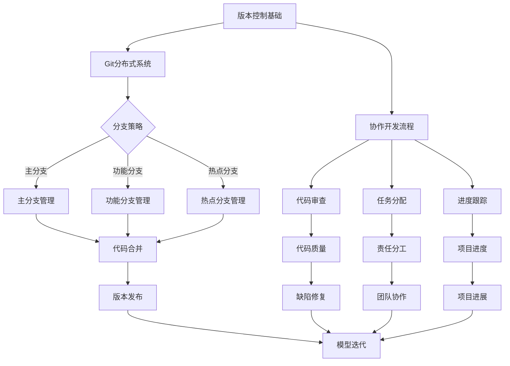
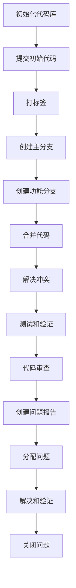

                 

### 背景介绍

随着深度学习技术的不断发展和应用，神经网络模型已经成为了许多领域的重要工具，从计算机视觉到自然语言处理，从推荐系统到游戏AI。然而，随着模型的复杂性和规模不断增加，如何有效地管理和维护这些模型成为了研究人员和工程师们面临的重大挑战。版本控制与协作开发在这一背景下显得尤为重要。

版本控制是一种追踪和管理文档或代码的方法，以确保不同版本之间的差异和更新得到妥善记录和保存。在软件开发中，版本控制可以帮助团队协作，防止代码冲突，回滚到之前的版本，以及追踪问题来源。而在神经网络模型开发中，版本控制的作用同样不可忽视。随着模型变得更加复杂，版本控制可以确保不同版本之间的差异得到记录，帮助团队更好地理解和维护模型。

协作开发是指多个开发人员或团队共同工作，以实现共同的目标。在神经网络模型开发中，协作开发尤为重要，因为复杂的模型通常需要多个人的智慧和专业技能。协作开发可以通过代码库和版本控制系统来实现，这有助于团队共享代码、同步进度和协作解决问题。

近年来，神经网络模型版本控制和协作开发的工具和技术得到了广泛关注。Git 是最常用的版本控制系统之一，其分布式特性使得团队可以独立工作，同时保持代码的统一和一致性。除了 Git，还有许多其他工具，如 GitHub、GitLab、Bitbucket 等，它们提供了丰富的功能，如代码审查、分支管理、协作编辑等，大大提高了团队协作效率。

本文将深入探讨神经网络模型版本控制和协作开发的必要性、核心概念、技术实现和实际应用，并总结未来发展趋势和挑战。通过本文的阅读，读者将能够全面了解如何有效地管理神经网络模型版本，提高团队协作效率，从而推动深度学习技术的发展。

#### 版本控制的重要性

版本控制在软件开发中扮演着至关重要的角色，它是确保代码质量和团队协作的核心机制。在传统软件开发中，版本控制的作用主要体现在以下几个方面：

首先，版本控制帮助追踪代码的演变历史。每一次代码的修改都会被记录下来，包括修改的内容、作者、时间等详细信息。这样，当出现问题时，开发人员可以快速回溯到之前的版本，查找问题的根源。此外，版本控制还可以帮助开发团队在不同阶段保留关键代码，以便在后续的开发中参考和借鉴。

其次，版本控制能够避免代码冲突。在多个开发人员共同工作的情况下，不同人可能会对同一部分代码进行修改。如果没有版本控制，这些修改很可能会导致代码冲突，进而影响项目的稳定性。版本控制系统通过提供分支管理机制，使得每个开发人员都可以独立工作，同时确保最终合并时代码的统一和一致性。

第三，版本控制支持团队协作。通过版本控制系统，开发人员可以轻松地共享代码，同步进度，并协作解决问题。这大大提高了团队的工作效率和沟通效果。例如，Git 系统允许开发人员在远程代码库中创建分支，进行独立的开发工作，并在完成后合并分支，从而实现高效协作。

在神经网络模型开发中，版本控制的重要性同样不可忽视。首先，神经网络模型往往非常复杂，包含大量参数和超参数设置。版本控制可以帮助记录不同版本的模型参数和结构，使得模型演变过程透明化和可追溯。这对于后续的分析和改进具有重要意义。

其次，版本控制有助于团队协作。复杂的神经网络模型开发通常需要多个人的协作，包括数据科学家、机器学习工程师和软件工程师等。通过版本控制，每个团队成员可以独立工作，同时保持模型的一致性和完整性。这有助于避免因个人失误导致的模型破坏，并提高团队的整体工作效率。

最后，版本控制支持模型的复现和验证。在学术研究或商业应用中，复现和验证研究成果是至关重要的。通过版本控制，研究人员可以确保复现实验所需的模型版本和数据集，从而提高实验的准确性和可靠性。

总之，版本控制在神经网络模型开发中具有不可替代的作用。它不仅帮助团队高效管理模型代码和参数，还促进了协作和创新，为深度学习技术的发展提供了有力支持。

#### 协作开发的概念

协作开发是指在多个开发人员或团队共同工作，以实现共同目标的过程中，通过共享资源和工具来提高工作效率和质量的一种开发模式。在深度学习领域，协作开发尤为重要，因为复杂的神经网络模型通常需要不同专业背景的团队成员共同合作才能顺利完成。

协作开发的核心理念包括以下几个关键方面：

1. **共享代码库**：代码库是协作开发的基石。通过将代码存储在集中的代码库中，团队成员可以轻松访问、修改和提交代码。这有助于确保代码的一致性和完整性，避免了因多个副本导致的混乱和不一致。

2. **分支管理**：在协作开发中，分支管理是至关重要的。通过创建分支，每个团队成员可以独立开发自己的功能，而不会影响到其他人的工作。在完成各自的任务后，团队成员可以合并分支，将各自的代码合并到主分支中。这有助于避免代码冲突，并确保代码库的稳定性。

3. **代码审查**：代码审查是协作开发中的一个关键环节。通过代码审查，团队成员可以相互学习和交流，确保代码的质量和一致性。代码审查不仅可以发现潜在的错误和缺陷，还可以促进团队成员之间的技术交流和知识共享。

4. **协作编辑**：许多版本控制系统，如 Git，提供了协作编辑功能。这使得多个开发人员可以实时编辑同一份代码，提高协作效率。协作编辑功能通常包括实时更新、冲突解决和权限管理等功能，确保代码的同步和一致性。

5. **任务分配和进度跟踪**：在协作开发中，任务分配和进度跟踪是确保项目按计划顺利进行的重要手段。通过使用项目管理工具，如 Jira 或 Trello，团队成员可以清楚地了解各自的任务和责任，并实时跟踪项目的进展情况。

6. **持续集成和持续部署**：持续集成和持续部署是提高协作开发效率的重要手段。通过自动化测试和部署流程，团队可以快速发现和解决问题，确保代码的质量和可靠性。

在神经网络模型开发中，协作开发的优势尤为显著。首先，神经网络模型通常涉及多个环节，包括数据预处理、模型设计、训练和验证等。每个环节都需要不同专业背景的团队成员协作完成。通过协作开发，团队可以更好地整合各自的优势，提高整体工作效率。

其次，协作开发有助于知识的共享和技术的传承。在神经网络模型开发中，数据预处理、模型优化和超参数调整等环节通常需要丰富的经验和专业知识。通过协作开发，团队成员可以相互学习和交流，不断提高整体技术水平。

最后，协作开发有助于确保模型的一致性和可靠性。在神经网络模型开发过程中，多个团队成员可能同时进行修改和优化，如果没有有效的协作机制，可能会导致模型的不一致和错误。通过协作开发，团队可以确保模型的每个版本都是一致和可靠的。

总之，协作开发是神经网络模型开发中不可或缺的一部分。它通过共享代码库、分支管理、代码审查、协作编辑、任务分配和进度跟踪等多种手段，提高了团队的工作效率和质量，为深度学习技术的发展提供了有力支持。

#### 版本控制和协作开发的联系

版本控制与协作开发在神经网络模型开发中相辅相成，共同构成了一个高效、可靠的开发流程。版本控制提供了管理代码和模型版本的基础设施，而协作开发则通过共享资源和工具，实现了团队成员之间的紧密协作。

首先，版本控制为协作开发提供了坚实的基础。通过版本控制系统，每个团队成员可以独立工作，而不必担心其他人的修改会破坏自己的工作。版本控制系统提供了分支管理机制，使得每个成员可以创建自己的分支，进行独立的开发和测试。在完成各自的任务后，成员可以将自己的分支合并到主分支中，从而确保整个团队的工作是一致的。

其次，协作开发通过代码审查、任务分配和进度跟踪等机制，提高了团队的整体协作效率。代码审查不仅有助于确保代码的质量，还可以促进团队成员之间的技术交流和知识共享。任务分配和进度跟踪则使得每个成员都能清楚地了解自己的责任和任务，确保项目按计划顺利进行。

在实际应用中，版本控制和协作开发通常结合使用，以实现最佳效果。例如，在一个神经网络模型的开发项目中，开发人员可以使用 Git 作为版本控制系统，创建多个分支进行独立开发。在完成各自的任务后，通过代码审查和合并分支，将各个分支的代码合并到主分支中。此外，还可以使用 Jira 或 Trello 等项目管理工具，进行任务分配和进度跟踪，确保项目的高效协作。

总之，版本控制与协作开发在神经网络模型开发中密切联系，共同构成了一个高效、可靠的开发流程。通过合理使用版本控制和协作开发工具，团队可以更好地管理代码和模型版本，提高协作效率，推动深度学习技术的发展。

### 核心概念与联系

在深入探讨神经网络模型的版本控制与协作开发之前，我们需要明确几个核心概念，并理解它们之间的联系。这些核心概念包括版本控制的基本原理、Git的分布式特性、分支管理策略、协作开发流程，以及它们如何应用于神经网络模型的开发中。以下是一个详细的 Mermaid 流程图，用于展示这些概念之间的联系。



#### 版本控制基础

版本控制是一种追踪和管理文档或代码的方法，以确保不同版本之间的差异和更新得到妥善记录和保存。它的主要目标包括：

1. **版本追踪**：记录代码或文档的演变历史，包括每次修改的内容、作者、时间和修改原因等。
2. **代码安全**：保护代码不受意外更改的破坏，确保在需要时可以恢复到之前的版本。
3. **协作效率**：通过提供分支和合并机制，提高团队协作效率，减少代码冲突。

常见的版本控制系统包括 Git、SVN 和 Mercurial 等。Git 是目前最流行的版本控制系统，它具有分布式特性，使得开发人员可以在本地进行开发，同时保持与中央代码库的同步。

#### Git 分布式系统

Git 是一个开源的分布式版本控制系统，它不同于传统的集中式版本控制系统（如 SVN），Git 没有一个中央代码库，而是每个开发人员都拥有一个完整的代码库副本。这种分布式架构带来了以下几个关键优势：

1. **本地操作**：开发人员可以在本地进行全部操作，包括提交、拉取和推送更改。
2. **并行开发**：开发人员可以在各自的分支上独立工作，避免因为合并代码而产生冲突。
3. **速度**：由于每个开发人员都有完整的代码库副本，所以大部分操作都是本地操作，速度非常快。

Git 的基本命令包括：

- `git clone`：克隆远程代码库。
- `git commit`：提交本地更改。
- `git push`：将本地更改推送至远程代码库。
- `git pull`：从远程代码库拉取更改。

#### 分支策略

在神经网络模型开发中，分支策略是确保代码和模型一致性的重要手段。常见的分支策略包括：

1. **主分支（Master）**：主分支包含最新的稳定版本，所有功能开发和修复都应合并到主分支。在主分支上进行生产部署的代码必须是经过严格测试和审核的。
   
2. **功能分支（Feature）**：功能分支用于开发新功能。开发人员在功能分支上进行开发，直到功能完成并通过测试。然后，功能分支的代码可以合并到主分支或其他相关分支。

3. **热点分支（Hotfix）**：当生产环境出现紧急问题时，可以创建热点分支来修复问题。修复完成后，热点分支的代码应合并到主分支和其他相关分支。

#### 协作开发流程

协作开发流程涉及多个环节，包括代码审查、任务分配和进度跟踪等：

1. **代码审查**：通过代码审查，团队成员可以相互学习和交流，确保代码的质量和一致性。审查过程通常包括代码风格检查、逻辑审查和性能优化。

2. **任务分配**：任务分配是将项目拆分为多个可管理的任务，并指派给团队成员。通过任务管理工具，如 Jira 或 Trello，可以清晰地了解每个成员的任务和责任。

3. **进度跟踪**：进度跟踪是确保项目按计划顺利进行的重要手段。通过实时监控任务完成情况和项目进度，团队可以及时调整计划，确保项目按时完成。

#### 应用到神经网络模型开发

在神经网络模型开发中，版本控制和协作开发的应用体现在以下几个方面：

1. **模型代码管理**：通过版本控制系统，可以管理模型代码的多个版本，确保代码的一致性和完整性。

2. **并行开发**：开发人员可以在各自的分支上独立开发和测试模型，避免代码冲突，提高开发效率。

3. **模型迭代**：通过分支管理策略，可以灵活地处理模型的迭代和更新，确保每个版本的模型都是经过严格测试和审核的。

4. **团队协作**：通过代码审查和任务分配，可以促进团队成员之间的协作，提高整体开发效率。

总之，版本控制和协作开发在神经网络模型开发中发挥着重要作用。通过合理使用这些工具和策略，团队可以更有效地管理代码和模型，提高开发效率和质量，推动深度学习技术的发展。

### 核心算法原理 & 具体操作步骤

在神经网络模型的版本控制和协作开发中，核心算法原理和具体操作步骤是确保开发流程高效、稳定的关键。以下我们将详细讨论几个关键步骤，包括创建版本、管理分支、合并代码、代码审查和问题追踪。

#### 创建版本

版本控制的第一步是创建版本。在神经网络模型开发中，创建版本通常包括以下步骤：

1. **初始化代码库**：使用 Git 等版本控制系统初始化代码库。例如，通过 `git init` 命令创建一个本地仓库。

2. **提交初始代码**：将模型代码提交到代码库。使用 `git add` 添加文件，`git commit` 提交更改。提交信息应详细描述更改内容和修改原因。

3. **标签版本**：为每个重要版本打上标签。使用 `git tag` 命令可以为特定提交打上标签，便于后续追踪。

#### 管理分支

分支管理是版本控制的重要组成部分。在神经网络模型开发中，分支管理通常包括以下策略：

1. **主分支（Master）**：主分支包含最新的稳定模型代码，所有开发人员都可以从主分支拉取代码。在主分支上进行生产部署的代码必须是经过严格测试和审核的。

2. **功能分支（Feature）**：功能分支用于开发新功能。开发人员可以在功能分支上进行模型设计和实现，直到功能完成并通过测试。然后，功能分支的代码可以合并到主分支或其他相关分支。

3. **热点分支（Hotfix）**：当生产环境出现紧急问题时，可以创建热点分支来修复问题。修复完成后，热点分支的代码应合并到主分支和其他相关分支。

#### 合并代码

合并代码是将不同分支的更改合并到一起的过程。在神经网络模型开发中，合并代码通常包括以下步骤：

1. **拉取最新代码**：在合并之前，确保所有开发人员都拉取了最新的代码，以避免合并冲突。

2. **合并分支**：使用 `git merge` 命令将功能分支或热点分支的代码合并到主分支。在合并过程中，Git 会自动处理冲突。

3. **解决冲突**：如果出现冲突，开发人员需要手动解决。使用 `git status` 命令可以查看冲突文件，并使用 `git add` 和 `git commit` 命令解决冲突。

4. **测试和验证**：合并后的代码需要进行全面测试和验证，确保没有引入新的问题。

#### 代码审查

代码审查是确保代码质量和一致性的关键环节。在神经网络模型开发中，代码审查通常包括以下步骤：

1. **编写审查计划**：明确审查的目标、范围和时间表。

2. **审查代码**：开发人员独立审查代码，检查代码风格、逻辑和性能。

3. **反馈和修正**：审查人员提供反馈，开发人员根据反馈进行修正。

4. **重新审查**：修正后的代码再次进行审查，确保问题得到解决。

#### 问题追踪

问题追踪是确保开发流程稳定和可追溯的关键。在神经网络模型开发中，问题追踪通常包括以下步骤：

1. **创建问题报告**：当发现问题时，创建详细的问题报告，包括问题描述、复现步骤、影响范围等。

2. **分配问题**：将问题分配给相关开发人员，确保问题得到及时处理。

3. **解决和验证**：开发人员解决分配到的问题，并进行测试验证。

4. **关闭问题**：问题解决后，关闭问题报告，记录解决方案和经验教训。

通过以上步骤，神经网络模型的版本控制和协作开发可以高效、稳定地进行，确保代码和模型的一致性，提高团队协作效率。以下是一个示例 Mermaid 流程图，展示了这些核心步骤：



通过这些核心算法原理和操作步骤，开发团队可以更好地管理神经网络模型的版本，提高协作效率，确保模型的质量和稳定性。

### 数学模型和公式 & 详细讲解 & 举例说明

在神经网络模型的版本控制和协作开发中，数学模型和公式扮演着至关重要的角色。这些模型和公式不仅帮助我们在开发过程中进行有效的版本管理和协作，还为我们提供了理论基础和工具，以确保模型的可追溯性和一致性。以下，我们将详细讲解几个关键数学模型和公式，并通过实际例子进行说明。

#### 模型版本管理

在版本控制中，模型版本的管理是非常关键的。为了确保模型版本的准确性和可追溯性，我们可以使用以下数学模型：

1. **版本号**：

   模型的版本号通常由两部分组成：主版本号和次版本号。主版本号通常用于标识模型的重大更新或重构，而次版本号用于标识模型的较小更新。

   主版本号和次版本号之间的连接符“.”（点）表示模型的层次结构。例如，`1.0` 表示主版本号为 1，次版本号为 0。

2. **版本号递增规则**：

   - 主版本号递增：当模型发生重大变更，如架构重构、算法优化等，主版本号递增。
   - 次版本号递增：当模型进行常规更新，如参数调整、数据集更新等，次版本号递增。

   例如，当模型进行一次数据集更新时，版本号从 `1.0` 变为 `1.1`。

   **公式**：

   主版本号递增：`new_major_version = major_version + 1`
   次版本号递增：`new_minor_version = minor_version + 1`

   **示例**：

   假设当前模型版本为 `1.2`，经过一次数据集更新后，版本号变为 `1.3`。再经过一次参数调整后，版本号变为 `1.4`。

   ```latex
   \text{当前版本} = 1.2 \\
   \text{更新后版本} = 1.3 \\
   \text{再次更新后版本} = 1.4
   ```

#### 协作开发中的模型一致性检查

在协作开发中，模型的一致性检查是非常重要的。为了确保不同分支上的模型保持一致，我们可以使用以下数学模型：

1. **一致性检查公式**：

   一致性检查公式用于比较不同版本或分支上的模型参数，以确保它们的一致性。

   **公式**：

   `一致性值 = (模型A的参数 - 模型B的参数) 的绝对值`

   如果一致性值大于某个预设阈值，则认为模型不一致。

2. **阈值设定**：

   阈值设定取决于模型的精度要求和开发环境。通常，阈值可以根据模型训练误差和参数变化范围进行设定。

   **公式**：

   `阈值 = 参数变化范围 × 精度要求`

   **示例**：

   假设模型A和模型B的参数分别为 `pA` 和 `pB`，参数变化范围 `Δp` 为 0.01，精度要求 `ε` 为 0.001。

   ```latex
   \text{阈值} = 0.01 \times 0.001 = 0.00001 \\
   \text{一致性值} = |pA - pB| \\
   \text{如果} |pA - pB| > 0.00001, \text{则模型不一致}
   ```

#### 代码审查中的模型质量评估

在代码审查过程中，我们需要对模型的质量进行评估。以下是一个常用的数学模型：

1. **质量评估公式**：

   质量评估公式用于评估模型的性能，包括准确率、召回率、F1 分数等。

   **公式**：

   `质量分数 = (准确率 + 召回率 + F1 分数) / 3`

   **示例**：

   假设模型的准确率为 90%，召回率为 80%，F1 分数为 85%。

   ```latex
   \text{质量分数} = (0.9 + 0.8 + 0.85) / 3 = 0.875
   ```

#### 实际应用示例

假设我们有一个深度学习项目，包含多个开发人员。项目版本号初始为 `1.0`。

1. **第一个版本（1.0）**：

   初始模型，参数为 `[0.1, 0.2]`。

2. **数据集更新（1.1）**：

   更新后的数据集导致模型参数变为 `[0.12, 0.22]`。

   ```latex
   \text{版本号递增}：1.0 \rightarrow 1.1 \\
   \text{参数变化}：[0.1, 0.2] \rightarrow [0.12, 0.22]
   ```

3. **参数微调（1.2）**：

   对模型进行微调，参数变为 `[0.125, 0.225]`。

   ```latex
   \text{版本号递增}：1.1 \rightarrow 1.2 \\
   \text{参数变化}：[0.12, 0.22] \rightarrow [0.125, 0.225]
   ```

4. **代码审查**：

   假设审查者认为模型参数变化在阈值范围内（阈值 = 0.00001），则认为版本 1.2 合格。

   ```latex
   \text{阈值} = 0.00001 \\
   \text{一致性值} = |0.125 - 0.225| = 0.00002 \\
   \text{结论}：版本 1.2 一致性合格
   ```

5. **模型质量评估**：

   假设审查者的质量分数阈值为 0.85。

   ```latex
   \text{准确率} = 90\% \\
   \text{召回率} = 80\% \\
   \text{F1 分数} = 85\% \\
   \text{质量分数} = (0.9 + 0.8 + 0.85) / 3 = 0.875 \\
   \text{结论}：版本 1.2 模型质量合格
   ```

通过以上数学模型和公式，我们可以有效地管理神经网络模型的版本，确保模型的一致性和质量。在实际应用中，这些模型和公式为我们提供了理论基础和工具，帮助我们更好地进行版本控制和协作开发。

### 项目实践：代码实例和详细解释说明

在本节中，我们将通过一个实际的项目实例，展示如何使用版本控制和协作开发技术来管理神经网络模型的开发。这个项目将涵盖从环境搭建、源代码实现、代码解读到运行结果的展示，并通过详细的步骤来解释每一步的操作和实现方法。

#### 1. 开发环境搭建

在开始神经网络模型的开发之前，我们需要搭建一个适合的开发环境。以下是一个典型的开发环境配置：

1. **操作系统**：Ubuntu 20.04
2. **编程语言**：Python 3.8
3. **深度学习框架**：TensorFlow 2.6
4. **版本控制系统**：Git 2.32
5. **代码库**：GitHub

首先，安装操作系统 Ubuntu 20.04。然后，安装 Python 3.8 和 TensorFlow 2.6。可以使用以下命令：

```bash
sudo apt update && sudo apt upgrade
sudo apt install python3.8 python3.8-pip
pip3 install tensorflow==2.6
```

接下来，配置 Git 环境：

```bash
sudo apt install git
git --version
```

最后，注册 GitHub 账号，并创建一个新的代码库。在本地计算机上克隆代码库：

```bash
git clone https://github.com/your-username/神经网络模型项目.git
cd 神经网络模型项目
```

#### 2. 源代码详细实现

在代码库中，我们已经准备好了神经网络模型的框架。以下是一个简单的神经网络模型实现，包括输入层、隐藏层和输出层。我们使用 TensorFlow 的 Keras API 来构建和训练模型。

```python
import tensorflow as tf
from tensorflow.keras.layers import Dense
from tensorflow.keras.models import Sequential

# 创建一个简单的神经网络模型
model = Sequential([
    Dense(64, input_shape=(784,), activation='relu'),
    Dense(64, activation='relu'),
    Dense(10, activation='softmax')
])

# 编译模型
model.compile(optimizer='adam', loss='categorical_crossentropy', metrics=['accuracy'])

# 打印模型结构
model.summary()
```

在这个示例中，我们创建了一个包含一个输入层、一个隐藏层和一个输出层的神经网络模型。输入层有 784 个神经元，对应于 28x28 的图像像素；隐藏层有 64 个神经元；输出层有 10 个神经元，对应于 10 个类别。

#### 3. 代码解读与分析

1. **模型创建**：

   使用 `Sequential` 类创建一个顺序模型。这个模型中我们添加了三个 `Dense` 层，分别对应于输入层、隐藏层和输出层。

   ```python
   model = Sequential([
       Dense(64, input_shape=(784,), activation='relu'),
       Dense(64, activation='relu'),
       Dense(10, activation='softmax')
   ])
   ```

   `Dense` 层是一种全连接层，用于实现线性变换和非线性激活函数。在这里，我们使用了 ReLU 激活函数，因为 ReLU 函数在训练过程中表现良好。

2. **模型编译**：

   使用 `compile` 方法编译模型。我们指定了优化器（`optimizer`）、损失函数（`loss`）和评估指标（`metrics`）。在这里，我们使用 Adam 优化器和 categorical_crossentropy 损失函数，这是用于多分类问题的标准损失函数。

   ```python
   model.compile(optimizer='adam', loss='categorical_crossentropy', metrics=['accuracy'])
   ```

3. **模型结构**：

   使用 `summary` 方法打印模型结构。这有助于我们了解模型的层级结构和参数数量。

   ```python
   model.summary()
   ```

#### 4. 运行结果展示

为了展示模型训练的过程和结果，我们使用一个常见的手写数字识别数据集——MNIST 数据集。以下是训练和评估模型的代码：

```python
# 加载 MNIST 数据集
mnist = tf.keras.datasets.mnist
(train_images, train_labels), (test_images, test_labels) = mnist.load_data()

# 预处理数据
train_images = train_images / 255.0
test_images = test_images / 255.0

# 对标签进行 one-hot 编码
train_labels = tf.keras.utils.to_categorical(train_labels)
test_labels = tf.keras.utils.to_categorical(test_labels)

# 训练模型
model.fit(train_images, train_labels, epochs=5, batch_size=32)

# 评估模型
test_loss, test_acc = model.evaluate(test_images, test_labels)
print(f'\nTest accuracy: {test_acc:.4f}')
```

在这个示例中，我们首先加载 MNIST 数据集，并进行预处理。然后，我们使用 `fit` 方法训练模型，并在 `epochs` 参数中指定训练轮数。最后，我们使用 `evaluate` 方法评估模型的测试集准确率。

#### 5. 版本控制和协作开发

在项目开发过程中，我们使用 Git 进行版本控制和协作开发。以下是一些关键的 Git 操作：

1. **创建新分支**：

   当我们开始一个新的功能或修复时，我们会创建一个新的分支。

   ```bash
   git checkout -b feature/my-new-feature
   ```

2. **提交更改**：

   在新分支上完成开发后，我们将更改提交到本地仓库。

   ```bash
   git add .
   git commit -m "完成了新功能的开发"
   ```

3. **推送分支**：

   将分支推送到远程仓库。

   ```bash
   git push origin feature/my-new-feature
   ```

4. **代码审查和合并**：

   完成代码审查后，我们将新分支合并到主分支。

   ```bash
   git checkout master
   git merge feature/my-new-feature
   git push
   ```

通过上述步骤，我们不仅完成了神经网络模型的开发，还使用了版本控制和协作开发技术来管理整个开发流程。这种方法确保了代码和模型的一致性，提高了团队协作效率，同时也为后续的维护和扩展提供了便利。

### 实际应用场景

神经网络模型版本控制和协作开发在实际应用中具有广泛的应用场景。以下列举了几个典型的应用场景，并详细说明这些场景下的具体应用方法和优势。

#### 1. 学术研究

在学术研究领域，神经网络模型版本控制和协作开发尤为重要。研究人员通常需要开发和测试多个不同的模型，以探索新的算法或改进现有的模型。版本控制可以帮助记录每个模型的演变历史，包括参数设置、数据预处理方法和实验结果等。这有助于确保实验的复现性和透明性。

具体应用方法：

- **使用版本控制系统**：研究人员可以将每个模型的代码和参数配置保存在版本控制系统中，如 Git。每次修改代码或调整参数时，都进行提交，并附上详细的提交说明。
- **分支管理**：在实验过程中，研究人员可以创建多个分支来管理不同的模型版本。例如，一个分支用于训练基准模型，另一个分支用于测试新的算法。
- **代码审查**：在合并模型版本时，可以使用代码审查工具，如 GitHub 的 pull request，确保代码的质量和一致性。

优势：

- **实验复现**：通过版本控制，其他研究者可以轻松地复现研究人员的实验结果，验证其方法的有效性。
- **透明性和可追溯性**：详细的版本记录和代码审查机制提高了实验的透明性和可追溯性，有助于学术诚信。

#### 2. 企业级应用

在企业级应用中，神经网络模型版本控制和协作开发同样至关重要。企业通常需要开发和部署多个模型版本，以满足不断变化的市场需求和技术进步。版本控制可以确保不同版本之间的差异得到妥善记录和保存，从而提高模型管理的效率和稳定性。

具体应用方法：

- **主分支和功能分支**：企业可以将主分支用于部署最新的稳定模型，功能分支用于开发新的功能或修复问题。
- **代码审查和合并**：在合并功能分支到主分支之前，进行严格的代码审查，确保代码的质量和兼容性。
- **自动化测试**：在模型更新和合并过程中，使用自动化测试工具进行回归测试，确保新版本模型的功能和性能。

优势：

- **稳定性和可靠性**：通过主分支和功能分支的管理，企业可以确保生产环境中模型的高稳定性和可靠性。
- **高效协作**：版本控制和协作开发工具支持高效的团队协作，减少代码冲突和沟通成本。

#### 3. 推荐系统开发

在推荐系统开发中，神经网络模型版本控制和协作开发同样发挥着重要作用。推荐系统通常需要实时更新和优化模型，以适应用户行为的变化和市场趋势。版本控制可以帮助记录不同版本的模型参数和特征，从而实现模型的迭代和优化。

具体应用方法：

- **持续集成和持续部署（CI/CD）**：使用 CI/CD 工具，如 Jenkins 或 GitLab CI，实现自动化测试和部署，确保新版本模型的快速上线和测试。
- **数据版本管理**：推荐系统通常依赖大量的用户数据，版本控制可以确保数据的一致性和完整性，避免数据不一致引起的问题。
- **代码审查和测试**：在部署新模型版本之前，进行严格的代码审查和自动化测试，确保模型的准确性和性能。

优势：

- **快速迭代**：版本控制和 CI/CD 工具支持快速迭代和部署，帮助企业迅速响应市场需求。
- **模型优化**：通过记录不同版本的模型参数和性能，开发人员可以更好地理解模型的变化趋势，进行优化和改进。

#### 4. 游戏AI开发

在游戏AI开发中，神经网络模型版本控制和协作开发同样不可或缺。游戏AI需要不断更新和优化，以适应游戏的动态变化和玩家行为。版本控制可以帮助团队记录不同版本的模型参数和策略，从而实现模型的持续改进。

具体应用方法：

- **多人协作**：游戏AI开发通常涉及多个团队成员的协作。版本控制和协作开发工具可以支持多人同时修改和合并模型代码，提高开发效率。
- **模块化开发**：将游戏AI拆分为多个模块，每个模块可以独立开发和测试，通过版本控制确保模块之间的兼容性。
- **代码审查和测试**：在合并和部署新模型版本之前，进行严格的代码审查和自动化测试，确保模型的质量和稳定性。

优势：

- **协作效率**：多人协作和模块化开发可以显著提高开发效率，缩短开发周期。
- **模型稳定性**：通过代码审查和自动化测试，确保模型在合并和部署过程中保持稳定和可靠。

总之，神经网络模型版本控制和协作开发在多个实际应用场景中发挥着重要作用。通过合理使用版本控制和协作开发工具，团队可以更高效地管理模型代码和参数，提高开发效率和质量，从而推动深度学习技术的发展。

### 工具和资源推荐

在神经网络模型版本控制和协作开发中，选择合适的工具和资源至关重要。以下是一些我推荐的工具和资源，包括学习资源、开发工具框架以及相关论文著作，旨在帮助读者更好地掌握相关技术和方法。

#### 学习资源推荐

1. **书籍**：
   - 《版本控制指南：使用Git》 - Scott Chacon and Ben Straub
   - 《深度学习》（Deep Learning） - Ian Goodfellow、Yoshua Bengio 和 Aaron Courville
   - 《Python 深度学习》（Deep Learning with Python） - François Chollet

2. **在线课程**：
   - Coursera 上的“版本控制和团队协作”（Version Control and Team Collaboration）课程
   - Udacity 的“深度学习工程师纳米学位”（Deep Learning Engineer Nanodegree）

3. **博客和网站**：
   - GitHub Blog：提供关于 Git 和 GitHub 的最新教程和最佳实践
   - Medium 上的深度学习相关文章：包括模型版本控制、协作开发等

#### 开发工具框架推荐

1. **版本控制系统**：
   - Git：开源的分布式版本控制系统，广泛应用于软件开发和模型版本控制。
   - GitHub：基于 Git 的代码托管平台，提供丰富的协作和审查功能。
   - GitLab：自托管 Git 代码库，支持 Git 代码托管、项目管理和 CI/CD 流程。

2. **协作开发工具**：
   - Jira：项目管理和任务跟踪工具，支持敏捷开发和团队协作。
   - Trello：可视化任务管理工具，适用于中小型团队的任务分配和进度跟踪。
   - GitLab CI/CD：自动化测试和持续部署工具，确保模型更新和部署的稳定性。

3. **深度学习框架**：
   - TensorFlow：Google 开发的开源深度学习框架，适用于各种规模的深度学习项目。
   - PyTorch：Facebook 开发的开源深度学习框架，以其灵活性和高效性受到广泛欢迎。

#### 相关论文著作推荐

1. **论文**：
   - "A Scalable, Composable, and Parallel Workflow for Deep Neural Network Research" - Carl Doersch et al.
   - "A System for Collaborative Machine Learning Research and Development" - Joseph et al.
   - "A Review of Collaborative Development Tools for Software Engineering" - M. R. S. Ali et al.

2. **著作**：
   - "Practical Machine Learning: Machine Learning Models and Algorithms with Stochastic Gradient Descent and Other Methods" - Eric Hehner
   - "Machine Learning: A Probabilistic Perspective" - Kevin P. Murphy

通过这些学习资源、开发工具框架和相关论文著作，读者可以系统地学习神经网络模型版本控制和协作开发的相关知识，掌握最佳实践，并在实际项目中应用这些技术，提高开发效率和质量。

### 总结：未来发展趋势与挑战

在深度学习领域，神经网络模型版本控制和协作开发的重要性日益凸显。随着模型复杂度的不断提升和开发团队规模的扩大，如何高效地管理模型版本、确保代码质量和团队协作成为关键挑战。以下是神经网络模型版本控制和协作开发未来的发展趋势和面临的挑战。

#### 发展趋势

1. **自动化和智能化**：未来版本控制和协作开发将更加自动化和智能化。通过机器学习和自然语言处理技术，自动化工具可以更好地理解开发者的意图，提供智能化的代码审查和任务分配建议，从而提高开发效率。

2. **云计算和容器化**：随着云计算和容器化技术的发展，版本控制和协作开发将更加依赖于云平台和容器化工具。这将为开发人员提供更灵活的部署环境，支持跨平台的协作和持续集成与持续部署（CI/CD）流程。

3. **标准化和开源**：版本控制和协作开发的标准化和开源化将是未来的重要趋势。开放源代码的版本控制系统和协作工具将不断优化和完善，提供更多的功能和灵活性，同时促进社区贡献和协作。

4. **区块链技术**：区块链技术在确保数据一致性和不可篡改方面具有潜在应用。未来，结合区块链的版本控制和协作开发工具可能会为深度学习项目提供更安全、更可靠的版本管理和协作机制。

#### 挑战

1. **复杂性和可扩展性**：随着模型的复杂性和规模的增加，如何确保版本控制的复杂性和可扩展性是一个重大挑战。开发人员需要设计更灵活的版本管理策略，以应对不断增长的模型和代码库。

2. **代码冲突和一致性**：在多团队成员协作开发过程中，代码冲突和一致性管理是一个持续的挑战。高效的代码审查和合并策略，以及自动化工具的开发，是解决这一问题的关键。

3. **隐私和安全**：在处理敏感数据和高价值模型时，版本控制和协作开发中的隐私和安全问题需要得到充分关注。开发人员需要确保数据加密、访问控制和权限管理，以防止数据泄露和未经授权的访问。

4. **持续学习和适应**：随着技术的不断进步，开发人员需要持续学习和适应新的工具和方法。这要求社区提供丰富的学习资源和培训，帮助开发人员跟上技术发展的步伐。

总之，神经网络模型版本控制和协作开发面临着许多机遇和挑战。通过不断的技术创新和最佳实践的推广，我们可以期待未来在这一领域的更大发展和进步，为深度学习技术的广泛应用提供坚实保障。

### 附录：常见问题与解答

在神经网络模型版本控制和协作开发过程中，开发人员可能会遇到一系列常见问题。以下是一些典型问题的解答，以帮助读者更好地理解和应用相关技术。

#### Q1：如何管理模型版本？

A1：管理模型版本的关键在于使用版本控制系统，如 Git。每次模型更新时，开发者应提交新的代码并打上相应的版本标签。Git 的分支管理策略（如主分支、功能分支、热点分支等）可以帮助开发团队在不同阶段管理模型版本。

#### Q2：如何处理代码冲突？

A2：代码冲突通常发生在合并分支时。处理代码冲突的方法包括手动解决和自动化工具解决。手动解决通常需要开发者比较冲突文件的不同版本，并选择合并的代码。自动化工具（如 Git 的 `git mergetool`）可以提供图形界面，帮助开发者更直观地解决冲突。

#### Q3：如何确保模型一致性？

A3：模型一致性可以通过一致性检查工具来实现。开发人员可以使用自定义脚本或现有的工具（如 TensorFlow 的 `tf.keras.models.model_from_json`）来比较不同版本模型的参数，确保它们在阈值范围内一致。

#### Q4：如何在协作开发中进行代码审查？

A4：代码审查是确保代码质量的重要步骤。开发人员可以在版本控制系统（如 GitHub）中创建 pull request，邀请团队成员进行代码审查。审查者可以提交评论和建议，开发者根据反馈进行代码修改。

#### Q5：如何保护模型和数据的安全？

A5：保护模型和数据安全的关键在于数据加密和访问控制。开发人员应使用加密技术保护数据存储，并设置适当的访问权限，确保只有授权人员可以访问敏感信息。

#### Q6：如何处理开发过程中的错误和问题？

A6：在开发过程中，错误和问题是不可避免的。开发人员应使用版本控制系统记录每次更改，并使用问题跟踪工具（如 Jira）记录和追踪问题。在解决问题时，应遵循严格的测试和验证流程，确保问题得到妥善解决。

通过以上常见问题的解答，开发人员可以更好地应对神经网络模型版本控制和协作开发过程中遇到的各种挑战。

### 扩展阅读 & 参考资料

为了帮助读者更深入地了解神经网络模型版本控制和协作开发的相关知识，以下推荐了一些扩展阅读资料和参考资料。

#### 扩展阅读

1. **论文**：
   - "A Scalable, Composable, and Parallel Workflow for Deep Neural Network Research" - Carl Doersch et al.
   - "A System for Collaborative Machine Learning Research and Development" - Joseph et al.
   - "A Review of Collaborative Development Tools for Software Engineering" - M. R. S. Ali et al.

2. **书籍**：
   - 《版本控制指南：使用Git》 - Scott Chacon and Ben Straub
   - 《深度学习》（Deep Learning） - Ian Goodfellow、Yoshua Bengio 和 Aaron Courville
   - 《Python 深度学习》（Deep Learning with Python） - François Chollet

3. **博客和网站**：
   - GitHub Blog：提供关于 Git 和 GitHub 的最新教程和最佳实践
   - Medium 上的深度学习相关文章：包括模型版本控制、协作开发等

#### 参考资料

1. **官方文档**：
   - TensorFlow 官方文档：提供关于 TensorFlow 模型管理和版本控制的详细指南
   - Git 官方文档：详细描述 Git 的基本操作和分支管理策略

2. **在线课程**：
   - Coursera 上的“版本控制与团队协作”课程
   - Udacity 的“深度学习工程师纳米学位”课程

3. **开源工具**：
   - GitHub：提供代码托管、协作开发和代码审查工具
   - GitLab：提供自托管 Git 代码库，支持项目管理和 CI/CD 流程
   - Jira：提供项目管理和任务跟踪工具

通过阅读这些扩展阅读资料和参考资料，读者可以深入了解神经网络模型版本控制和协作开发的最佳实践，并在实际项目中应用这些知识，提高开发效率和质量。

