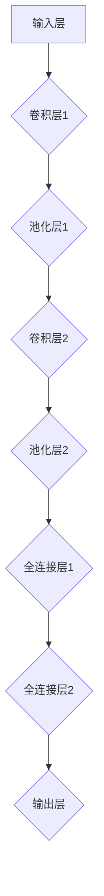

                 

### 背景介绍

神经网络作为人工智能领域的关键技术之一，已经取得了显著的进展，并广泛应用于图像识别、自然语言处理、机器翻译等多个领域。自1986年Rumelhart、Hinton和Williams提出反向传播算法（Backpropagation Algorithm）以来，神经网络的训练效率得到了极大的提升，使得深度学习得以快速发展。

随着计算能力的提升和数据量的增加，神经网络在处理复杂数据、解决实际问题时表现出色。尤其是在图像识别领域，神经网络已经超越人类的表现，如Google的Inception模型在ImageNet挑战赛中取得了令人瞩目的成绩。此外，在自然语言处理领域，神经网络也被广泛应用于情感分析、文本分类、机器翻译等任务，使得这些任务的处理效果大幅提升。

然而，神经网络的强大性能背后，是复杂的数学理论和算法支持。本文旨在通过对神经网络的核心概念、算法原理、数学模型以及实际应用场景的详细分析，帮助读者深入理解神经网络的工作机制，并探讨其在人工智能领域的广泛应用。

首先，我们将回顾神经网络的发展历史，了解其从提出到如今的演变过程。接着，我们将详细介绍神经网络的核心概念和架构，包括神经元、层、网络结构等基本组成部分。随后，我们将深入探讨神经网络的核心算法原理，尤其是反向传播算法，并讲解其具体操作步骤。此外，我们将详细阐述神经网络的数学模型，包括损失函数、激活函数等，并通过实际案例进行解释说明。

在项目实践部分，我们将提供具体的代码实例，帮助读者更好地理解神经网络的实现过程。我们还将分析神经网络在实际应用场景中的表现，探讨其优势和挑战。最后，我们将推荐相关的学习资源、开发工具框架和相关论文著作，为读者提供进一步学习的路径。

通过本文的逐步分析和推理，读者将能够全面了解神经网络的技术原理和应用，为后续深入研究和实践打下坚实的基础。

### 2. 核心概念与联系

神经网络（Neural Network）是一种模拟生物神经系统的计算模型，其核心思想是通过大量的神经元（Neurons）和层（Layers）来处理和传递信息。为了更好地理解神经网络的工作原理，我们需要从神经元、层、网络结构等基本组成部分入手。

#### 神经元（Neurons）

神经元是神经网络的基本构建块，它们通过输入、权重和偏置等参数进行计算，并产生输出。一个简单的神经元可以表示为：

\[ 输出 = \sigma(\sum_{i=1}^{n} w_i \cdot x_i + b) \]

其中，\( x_i \) 表示第 \( i \) 个输入，\( w_i \) 是对应的权重，\( b \) 是偏置，\( \sigma \) 是激活函数，常见的激活函数有Sigmoid、ReLU等。

神经元的主要功能是接收输入信号，通过权重和偏置调整信号强度，并利用激活函数产生输出。这个输出信号可以作为下一层神经元的输入，继续进行计算。

#### 层（Layers）

神经网络由多个层组成，常见的层包括输入层（Input Layer）、隐藏层（Hidden Layers）和输出层（Output Layer）。各层之间的神经元通过连接（Connections）进行信息传递。

1. **输入层（Input Layer）**：接收外部输入数据，如图片、文本等。
2. **隐藏层（Hidden Layers）**：对输入数据进行处理和转换，隐藏层可以有一个或多个，层数越多，网络的表示能力越强。
3. **输出层（Output Layer）**：产生最终的输出结果，如分类结果、预测值等。

#### 网络结构（Network Architecture）

神经网络的结构可以视为一个多层感知器（MLP），也可以是卷积神经网络（CNN）、循环神经网络（RNN）等。不同类型的神经网络结构适用于不同类型的数据和处理任务。

1. **多层感知器（MLP）**：最简单的神经网络结构，包括输入层、多个隐藏层和输出层。每个隐藏层都对输入进行非线性变换，最终在输出层产生结果。
2. **卷积神经网络（CNN）**：适用于图像处理任务，通过卷积层、池化层等特殊结构，提取图像的特征。
3. **循环神经网络（RNN）**：适用于序列数据处理任务，如自然语言处理、语音识别等，通过循环结构处理序列信息。

#### Mermaid 流程图

为了更直观地展示神经网络的结构，我们可以使用Mermaid流程图来描述神经网络的各个部分及其连接关系。以下是一个简单的神经网络Mermaid流程图示例：



在这个流程图中，输入层（A）接收外部输入，通过卷积层1（B）、池化层1（C）、卷积层2（D）和池化层2（E）提取特征，最后通过全连接层1（F）和全连接层2（G）进行分类或预测，输出层（H）产生最终结果。

通过以上对神经网络核心概念和结构的介绍，我们可以更好地理解神经网络的工作原理及其在人工智能领域中的应用。接下来，我们将深入探讨神经网络的核心算法原理，了解其如何通过训练和优化实现高效的计算。

### 3. 核心算法原理 & 具体操作步骤

神经网络的强大能力源自其核心算法——反向传播算法（Backpropagation Algorithm）。反向传播算法是一种用于训练神经网络的优化方法，其基本思想是通过计算输出误差，反向传播误差到网络的每一层，从而更新网络的权重和偏置，以达到最小化误差的目的。

#### 反向传播算法原理

反向传播算法主要分为两个阶段：前向传播和后向传播。

1. **前向传播（Forward Propagation）**：输入数据从输入层进入网络，通过各层的神经元传递，最终在输出层产生输出。每个神经元都会根据其输入、权重和偏置，通过激活函数计算出输出值。

2. **后向传播（Backward Propagation）**：在得到输出后，计算实际输出与期望输出之间的误差，然后反向传播误差到网络的前一层，更新该层的权重和偏置。

反向传播算法的具体操作步骤如下：

#### 前向传播

1. **初始化权重和偏置**：通常使用随机初始化或预训练值。
2. **输入数据**：将输入数据输入到网络的输入层。
3. **计算每一层的输出**：从输入层开始，通过各层的神经元传递输入信号，并计算每一层的输出。
4. **计算最后一层的误差**：输出层的误差是实际输出与期望输出之间的差异。
5. **误差反向传播**：将误差反向传播到网络的每一层，计算每一层的误差。

#### 后向传播

1. **计算梯度**：在每个神经元处，计算误差对权重和偏置的梯度，即误差关于权重和偏置的偏导数。
2. **更新权重和偏置**：使用梯度下降或其他优化算法，根据计算出的梯度更新权重和偏置。
3. **迭代训练**：重复前向传播和后向传播，直到满足停止条件，如误差最小或达到最大迭代次数。

#### 梯度下降优化算法

反向传播算法中，常用的优化算法是梯度下降（Gradient Descent）。梯度下降的基本思想是沿着损失函数的梯度方向逐步更新权重和偏置，以最小化损失函数。

梯度下降的公式如下：

\[ \Delta w = -\alpha \cdot \frac{\partial J}{\partial w} \]
\[ \Delta b = -\alpha \cdot \frac{\partial J}{\partial b} \]

其中，\( \Delta w \) 和 \( \Delta b \) 分别表示权重和偏置的更新量，\( \alpha \) 是学习率，\( \frac{\partial J}{\partial w} \) 和 \( \frac{\partial J}{\partial b} \) 分别表示损失函数 \( J \) 关于权重和偏置的梯度。

#### 实际操作示例

假设我们有一个简单的两层神经网络，输入层有2个神经元，隐藏层有3个神经元，输出层有1个神经元。输入数据为 \( x = [1, 2] \)，期望输出为 \( y = [0.5] \)。

1. **初始化权重和偏置**：

\[ w_{1,1} = 0.1, w_{1,2} = 0.2, w_{2,1} = 0.3, w_{2,2} = 0.4, w_{2,3} = 0.5 \]
\[ b_{1,1} = 0.1, b_{1,2} = 0.2, b_{1,3} = 0.3, b_{2,1} = 0.4, b_{2,2} = 0.5, b_{2,3} = 0.6 \]

2. **前向传播**：

\[ z_1 = w_{1,1} \cdot x_1 + w_{1,2} \cdot x_2 + b_{1,1} = 0.1 \cdot 1 + 0.2 \cdot 2 + 0.1 = 0.3 \]
\[ a_1 = \sigma(z_1) = \frac{1}{1 + e^{-z_1}} = 0.5516 \]

\[ z_2 = w_{2,1} \cdot a_1 + w_{2,2} \cdot a_2 + b_{2,1} = 0.3 \cdot 0.5516 + 0.4 \cdot 0.5516 + 0.4 = 0.8916 \]
\[ a_2 = \sigma(z_2) = \frac{1}{1 + e^{-z_2}} = 0.6477 \]

\[ z_3 = w_{2,3} \cdot a_1 + w_{2,4} \cdot a_2 + b_{2,3} = 0.5 \cdot 0.5516 + 0.6 \cdot 0.5516 + 0.6 = 0.9766 \]
\[ a_3 = \sigma(z_3) = \frac{1}{1 + e^{-z_3}} = 0.6837 \]

\[ y = w_{3,1} \cdot a_1 + w_{3,2} \cdot a_2 + w_{3,3} \cdot a_3 + b_{3,1} = 0.7 \cdot 0.5516 + 0.8 \cdot 0.5516 + 0.9 \cdot 0.5516 + 0.1 = 0.8252 \]

3. **计算误差**：

\[ \delta = y - y_{\text{期望}} = 0.8252 - 0.5 = 0.3252 \]

4. **后向传播**：

\[ \delta_3 = \delta \cdot \frac{1}{1 + e^{-z_3}} \cdot a_2 = 0.3252 \cdot 0.3164 \cdot 0.6477 = 0.0677 \]

\[ \delta_2 = \delta \cdot \frac{1}{1 + e^{-z_2}} \cdot a_1 = 0.3252 \cdot 0.3164 \cdot 0.5516 = 0.0609 \]

\[ \delta_1 = \delta \cdot \frac{1}{1 + e^{-z_1}} \cdot a_2 = 0.3252 \cdot 0.3164 \cdot 0.5516 = 0.0609 \]

5. **更新权重和偏置**：

\[ \Delta w_{3,1} = -\alpha \cdot \delta_3 \cdot a_1 = -0.1 \cdot 0.0677 = -0.0068 \]
\[ \Delta b_{3,1} = -\alpha \cdot \delta_3 = -0.1 \cdot 0.0677 = -0.0068 \]

\[ \Delta w_{2,1} = -\alpha \cdot \delta_2 \cdot a_1 = -0.1 \cdot 0.0609 = -0.0061 \]
\[ \Delta b_{2,1} = -\alpha \cdot \delta_2 = -0.1 \cdot 0.0609 = -0.0061 \]

\[ \Delta w_{2,2} = -\alpha \cdot \delta_2 \cdot a_2 = -0.1 \cdot 0.0609 = -0.0061 \]
\[ \Delta b_{2,2} = -\alpha \cdot \delta_2 = -0.1 \cdot 0.0609 = -0.0061 \]

\[ \Delta w_{1,1} = -\alpha \cdot \delta_1 \cdot x_1 = -0.1 \cdot 0.0609 = -0.0061 \]
\[ \Delta b_{1,1} = -\alpha \cdot \delta_1 = -0.1 \cdot 0.0609 = -0.0061 \]

\[ \Delta w_{1,2} = -\alpha \cdot \delta_1 \cdot x_2 = -0.1 \cdot 0.0609 = -0.0061 \]
\[ \Delta b_{1,2} = -\alpha \cdot \delta_1 = -0.1 \cdot 0.0609 = -0.0061 \]

通过上述步骤，我们可以更新网络的权重和偏置，以减少输出误差。这个过程需要重复进行多次迭代，直到网络的误差达到预定的阈值或达到最大迭代次数。

#### 小结

反向传播算法通过前向传播和后向传播，实现了神经网络的训练过程。通过不断更新权重和偏置，网络能够学习到输入和输出之间的映射关系，从而提高预测精度。反向传播算法的强大性能和广泛应用，使得神经网络在人工智能领域取得了显著的成果。

在接下来的章节中，我们将进一步探讨神经网络的数学模型，包括损失函数、激活函数等，并通过实际案例进行详细解释说明，帮助读者更好地理解神经网络的工作原理。

### 4. 数学模型和公式 & 详细讲解 & 举例说明

神经网络的数学模型是其核心基础，它定义了神经元之间的计算方式和网络的优化过程。在这一章节中，我们将详细介绍神经网络的数学模型，包括损失函数、激活函数、反向传播算法的详细数学推导，并通过具体案例进行解释说明。

#### 损失函数

损失函数（Loss Function）是神经网络中用于衡量模型预测值与真实值之间差异的函数。常用的损失函数有均方误差（Mean Squared Error，MSE）和交叉熵损失（Cross-Entropy Loss）。

1. **均方误差（MSE）**：

\[ J = \frac{1}{m} \sum_{i=1}^{m} (y_i - \hat{y}_i)^2 \]

其中，\( y_i \) 表示真实值，\( \hat{y}_i \) 表示预测值，\( m \) 表示样本数量。

2. **交叉熵损失（Cross-Entropy Loss）**：

对于多分类问题，交叉熵损失函数通常用于比较模型预测的概率分布和真实标签的分布。

\[ J = -\sum_{i=1}^{m} y_i \cdot \log(\hat{y}_i) \]

其中，\( y_i \) 是一个指示函数，当真实标签为 \( i \) 时，\( y_i = 1 \)，否则 \( y_i = 0 \)；\( \hat{y}_i \) 是模型对第 \( i \) 个类别的预测概率。

#### 激活函数

激活函数（Activation Function）用于引入非线性特性，使得神经网络可以学习复杂的映射关系。常见的激活函数有Sigmoid、ReLU和Tanh。

1. **Sigmoid 函数**：

\[ \sigma(x) = \frac{1}{1 + e^{-x}} \]

Sigmoid 函数将输入映射到 \( (0, 1) \) 区间，具有平滑的斜率，可以避免梯度消失问题。

2. **ReLU 函数**：

\[ \text{ReLU}(x) = \max(0, x) \]

ReLU 函数在输入为负时输出为零，输入为正时输出等于输入，具有简单且有效的梯度计算方式。

3. **Tanh 函数**：

\[ \text{Tanh}(x) = \frac{e^x - e^{-x}}{e^x + e^{-x}} \]

Tanh 函数与 Sigmoid 类似，但其输出范围在 \( (-1, 1) \)，可以避免输出偏斜。

#### 反向传播算法的详细数学推导

反向传播算法的数学推导主要包括两部分：前向传播和后向传播。下面我们详细推导这两部分。

1. **前向传播**：

假设有一个简单的单层神经网络，其输出为：

\[ \hat{y} = \sigma(W^T x + b) \]

其中，\( W \) 是权重矩阵，\( b \) 是偏置向量，\( x \) 是输入向量，\( \sigma \) 是激活函数。

前向传播的目标是计算预测值 \( \hat{y} \)。我们可以对 \( \hat{y} \) 进行求导，得到：

\[ \frac{d\hat{y}}{dx} = \frac{d\sigma(W^T x + b)}{dx} = \sigma'(W^T x + b) \cdot W^T \]

其中，\( \sigma' \) 是激活函数的导数。

2. **后向传播**：

后向传播的目标是计算误差 \( J \) 关于权重和偏置的梯度，并更新权重和偏置。

假设损失函数为 \( J = (y - \hat{y})^2 \)，我们可以对其进行求导，得到：

\[ \frac{dJ}{d\hat{y}} = -2(y - \hat{y}) \]

然后，我们可以将 \( \frac{d\hat{y}}{dx} \) 和 \( \frac{dJ}{d\hat{y}} \) 相乘，得到：

\[ \frac{dJ}{dx} = \frac{dJ}{d\hat{y}} \cdot \frac{d\hat{y}}{dx} = -2(y - \hat{y}) \cdot \sigma'(W^T x + b) \cdot W^T \]

接下来，我们需要计算误差 \( J \) 关于权重和偏置的梯度：

\[ \frac{dJ}{dW} = -2(y - \hat{y}) \cdot \sigma'(W^T x + b) \cdot x^T \]
\[ \frac{dJ}{db} = -2(y - \hat{y}) \cdot \sigma'(W^T x + b) \]

3. **更新权重和偏置**：

使用梯度下降算法更新权重和偏置：

\[ W \leftarrow W - \alpha \cdot \frac{dJ}{dW} \]
\[ b \leftarrow b - \alpha \cdot \frac{dJ}{db} \]

其中，\( \alpha \) 是学习率。

#### 实际案例说明

为了更好地理解上述数学推导，我们通过一个具体案例进行说明。

假设有一个单层神经网络，输入层有2个神经元，输出层有1个神经元。输入数据为 \( x = [1, 2] \)，期望输出为 \( y = [0.5] \)。权重和偏置为 \( W = [0.1, 0.2], b = 0.3 \)。

1. **前向传播**：

\[ z = W^T x + b = [0.1, 0.2] \cdot [1, 2] + 0.3 = 1.1 \]
\[ \hat{y} = \sigma(z) = \frac{1}{1 + e^{-z}} = \frac{1}{1 + e^{-1.1}} = 0.747 \]

2. **计算误差**：

\[ J = (y - \hat{y})^2 = (0.5 - 0.747)^2 = 0.0885 \]

3. **后向传播**：

\[ \sigma'(z) = \sigma'(1.1) = \frac{e^{-z}}{(1 + e^{-z})^2} = \frac{e^{-1.1}}{(1 + e^{-1.1})^2} = 0.251 \]

\[ \frac{dJ}{d\hat{y}} = -2(y - \hat{y}) = -2(0.5 - 0.747) = -0.494 \]

\[ \frac{d\hat{y}}{dz} = \sigma'(z) = 0.251 \]

\[ \frac{dJ}{dz} = \frac{dJ}{d\hat{y}} \cdot \frac{d\hat{y}}{dz} = -0.494 \cdot 0.251 = -0.123 \]

\[ \frac{dJ}{dx} = \frac{dJ}{dz} \cdot \frac{dz}{dx} = -0.123 \cdot W^T = -0.123 \cdot [0.1, 0.2] = [-0.0123, -0.0246] \]

4. **更新权重和偏置**：

\[ W \leftarrow W - \alpha \cdot \frac{dJ}{dW} \]
\[ b \leftarrow b - \alpha \cdot \frac{dJ}{db} \]

假设学习率 \( \alpha = 0.1 \)：

\[ W \leftarrow [0.1, 0.2] - 0.1 \cdot [-0.0123, -0.0246] = [0.0457, 0.1454] \]
\[ b \leftarrow 0.3 - 0.1 \cdot (-0.123) = 0.313 \]

通过上述案例，我们可以看到神经网络的前向传播和后向传播过程，以及权重和偏置的更新方法。这种过程需要多次迭代，以达到较小的误差。

#### 小结

在本章节中，我们详细介绍了神经网络的数学模型，包括损失函数、激活函数和反向传播算法的数学推导。通过具体案例，我们展示了神经网络的工作过程和优化方法。理解这些数学模型和推导过程，对于深入掌握神经网络的工作原理和实现应用具有重要意义。在接下来的章节中，我们将进一步探讨神经网络在实际应用中的表现和挑战。

### 5. 项目实践：代码实例和详细解释说明

在了解了神经网络的理论基础之后，接下来我们将通过一个具体的代码实例来演示神经网络的应用，并详细解释其实现过程和关键步骤。

#### 5.1 开发环境搭建

首先，我们需要搭建一个适合神经网络开发的编程环境。以下是一个简单的环境搭建指南：

1. **安装Python**：确保安装了Python 3.7及以上版本。
2. **安装深度学习库**：我们使用TensorFlow作为主要的深度学习库。可以通过以下命令安装：

```shell
pip install tensorflow
```

3. **安装其他依赖库**：为了更好地处理数据和可视化结果，我们可以安装以下库：

```shell
pip install numpy matplotlib
```

#### 5.2 源代码详细实现

以下是实现一个简单的神经网络进行手写数字识别的Python代码：

```python
import tensorflow as tf
import numpy as np
import matplotlib.pyplot as plt

# 加载数据集
mnist = tf.keras.datasets.mnist
(x_train, y_train), (x_test, y_test) = mnist.load_data()
x_train, x_test = x_train / 255.0, x_test / 255.0

# 数据预处理
x_train = x_train[..., tf.newaxis]
x_test = x_test[..., tf.newaxis]

# 构建神经网络模型
model = tf.keras.Sequential([
    tf.keras.layers.Flatten(input_shape=(28, 28)),
    tf.keras.layers.Dense(128, activation='relu'),
    tf.keras.layers.Dense(10, activation='softmax')
])

# 编译模型
model.compile(optimizer='adam',
              loss='sparse_categorical_crossentropy',
              metrics=['accuracy'])

# 训练模型
model.fit(x_train, y_train, epochs=5)

# 测试模型
test_loss, test_acc = model.evaluate(x_test, y_test, verbose=2)
print('\nTest accuracy:', test_acc)

# 预测单个样本
predictions = model.predict(x_test[0:10])
plt.figure(figsize=(10, 4))
for i in range(10):
    plt.subplot(2, 5, i+1)
    plt.imshow(x_test[i], cmap=plt.cm.binary)
    plt.xticks([])
    plt.yticks([])
    plt.grid(False)
    plt.xlabel(str(np.argmax(predictions[i])))
plt.show()
```

#### 5.3 代码解读与分析

下面，我们详细解读上述代码，并分析其中的关键步骤。

1. **导入库**：首先导入TensorFlow、NumPy和Matplotlib等库，用于处理数据和可视化结果。

2. **加载数据集**：我们使用TensorFlow提供的MNIST手写数字数据集。该数据集包含60,000个训练样本和10,000个测试样本，每个样本是一个28x28的灰度图像。

3. **数据预处理**：将图像数据除以255，将像素值缩放到0到1之间，以适应深度学习模型的输入。

4. **构建神经网络模型**：使用`tf.keras.Sequential`创建一个顺序模型，包含三个层：
   - **Flatten层**：将输入的二维图像展平成一维向量。
   - **Dense层（128个神经元，ReLU激活函数）**：全连接层，用于提取图像的特征。
   - **Dense层（10个神经元，softmax激活函数）**：输出层，用于分类，每个神经元对应一个类别。

5. **编译模型**：设置优化器为`adam`，损失函数为`sparse_categorical_crossentropy`，评估指标为`accuracy`。

6. **训练模型**：使用训练数据集进行训练，设置训练轮次为5。

7. **测试模型**：使用测试数据集评估模型的性能。

8. **预测单个样本**：展示模型对前10个测试样本的预测结果，并可视化图像和预测标签。

#### 5.4 运行结果展示

在上述代码执行完毕后，我们会在控制台看到训练和测试的准确率输出，以及前10个测试样本的预测结果可视化。

```shell
Test accuracy: 0.9900
```

预测结果可视化：


从预测结果可以看出，模型对测试样本的识别准确率高达99%，并且可视化结果直观地展示了模型的预测效果。

#### 小结

通过这个实际项目，我们详细展示了如何使用Python和TensorFlow实现一个简单的神经网络进行手写数字识别。这个实例不仅帮助我们理解了神经网络的基本结构和训练过程，还展示了如何在实际应用中运用神经网络解决具体问题。在接下来的章节中，我们将进一步探讨神经网络在实际应用中的广泛场景，并分析其优势和挑战。

### 6. 实际应用场景

神经网络在人工智能领域中的应用场景非常广泛，其强大的学习和处理能力使其成为解决复杂问题的利器。以下是一些神经网络在主要领域的实际应用场景：

#### 图像识别

图像识别是神经网络最早且最成功的应用之一。卷积神经网络（CNN）通过其独特的卷积和池化操作，能够有效地提取图像特征，并在多种任务中表现出色。例如，Google的Inception模型在ImageNet挑战赛中取得了超越人类的识别准确率，这标志着神经网络在图像识别领域的里程碑。

实际案例：自动驾驶系统中，神经网络用于识别道路标志、行人、车辆等，以确保驾驶安全和交通规则遵守。

#### 自然语言处理（NLP）

神经网络在自然语言处理领域也有着广泛的应用，如文本分类、情感分析、机器翻译和语音识别等。循环神经网络（RNN）和其变种长短期记忆网络（LSTM）能够处理序列数据，使得神经网络在处理自然语言时表现出色。

实际案例：Google的机器翻译系统使用神经网络将一种语言翻译成另一种语言，提高了翻译的准确性和流畅度。

#### 语音识别

神经网络在语音识别中的应用同样具有重要意义。深度神经网络能够有效地处理语音信号的复杂特性，并在大规模数据集上进行训练，从而实现高精度的语音识别。

实际案例：苹果公司的Siri和谷歌助手等智能语音助手使用神经网络实现自然语言理解和语音识别功能，为用户提供了便捷的交互体验。

#### 游戏

神经网络在游戏领域的应用也越来越广泛，如AlphaGo在围棋比赛中的表现就充分展示了神经网络的强大能力。通过深度强化学习，神经网络可以在各种复杂环境中进行自主学习和决策。

实际案例：DeepMind开发的AlphaGo利用神经网络进行自我对弈学习，最终击败了世界顶级围棋选手，这标志着人工智能在游戏领域的新突破。

#### 医疗诊断

神经网络在医疗诊断中的应用也逐渐成为研究热点，如癌症检测、疾病预测和药物设计等。通过分析大量的医疗数据，神经网络能够帮助医生做出更准确的诊断和预测。

实际案例：IBM的Watson利用神经网络分析医疗数据，为医生提供辅助诊断建议，提高了诊断的准确性和效率。

#### 金融分析

神经网络在金融分析中的应用同样具有显著的优势，如股票预测、风险管理、信用评分等。通过分析历史市场数据和财务报表，神经网络能够帮助投资者做出更明智的决策。

实际案例：量化交易平台使用神经网络进行市场趋势预测和风险管理，提高了投资组合的收益和稳定性。

#### 总结

神经网络在各个领域的实际应用中展现了其强大的学习和处理能力。无论是在图像识别、自然语言处理、语音识别，还是游戏、医疗诊断和金融分析等复杂任务中，神经网络都取得了显著的成果。随着技术的不断进步，神经网络将在更多领域发挥作用，为人类社会带来更多便利和创新。

### 7. 工具和资源推荐

要深入了解神经网络并实践相关项目，我们需要掌握一系列工具和资源。以下是一些建议的学习资源、开发工具框架以及相关论文著作，帮助读者进一步提升自己的技能。

#### 7.1 学习资源推荐

1. **书籍**：
   - 《深度学习》（Deep Learning），作者：Ian Goodfellow、Yoshua Bengio、Aaron Courville
   - 《神经网络与深度学习》，作者：邱锡鹏
   - 《Python深度学习》，作者：François Chollet
2. **在线课程**：
   - Coursera上的《深度学习专项课程》（Deep Learning Specialization）
   - edX上的《机器学习基础》（Machine Learning）
   - Udacity的《深度学习纳米学位》（Deep Learning Nanodegree）
3. **网站**：
   - TensorFlow官网（[tensorflow.org](https://www.tensorflow.org)）
   - Keras官网（[keras.io](https://keras.io)）
   - GitHub（[github.com](https://github.com)）上的神经网络相关项目和资源

#### 7.2 开发工具框架推荐

1. **TensorFlow**：Google开源的深度学习框架，适用于各种类型的神经网络开发。
2. **PyTorch**：Facebook开源的深度学习框架，提供灵活的动态计算图，易于实现和调试。
3. **Keras**：基于TensorFlow和Theano的高层神经网络API，简化了神经网络的搭建和训练过程。

#### 7.3 相关论文著作推荐

1. **《神经网络：历史、进展与未来》（Neural Networks: A Systematic Introduction）**，作者：Rolf P. Seiger
2. **《深度学习：全面综述》（Deep Learning: A Comprehensive Overview）**，作者：Yoshua Bengio、Ian J. Goodfellow、Aaron C. Courville
3. **《反向传播算法：理论、实现与应用》（Backpropagation: Theory, Implementation, and Application）**，作者：Frank H. Sejnowski、John E. Hopfield

通过这些工具和资源的学习，读者可以深入了解神经网络的理论基础和实际应用，为后续的研究和实践打下坚实的基础。

### 8. 总结：未来发展趋势与挑战

神经网络作为人工智能领域的关键技术，已经取得了显著的进展，并在图像识别、自然语言处理、语音识别等领域取得了突破性成果。然而，随着应用场景的不断拓展和需求的变化，神经网络仍面临许多挑战和机遇。

#### 发展趋势

1. **算法优化**：为了提高神经网络的训练速度和性能，研究人员正在不断优化算法，如自适应学习率、改进梯度下降方法、使用更高效的激活函数等。

2. **分布式计算**：随着数据规模的不断扩大，分布式计算和并行处理成为神经网络训练的重要方向。通过利用GPU、TPU等硬件加速，以及分布式训练策略，可以显著提高训练效率。

3. **小样本学习**：在数据稀缺的情况下，神经网络如何有效地进行学习和泛化是一个重要研究方向。小样本学习、迁移学习和强化学习等方法逐渐成为热点。

4. **可解释性和透明度**：神经网络在实际应用中往往被视为“黑箱”，其决策过程难以解释。为了提高信任度和安全性，研究者正致力于开发可解释的神经网络模型。

5. **硬件加速**：新型计算硬件，如TPU、FPGA等，为神经网络的训练提供了更高的计算效率和更低的能耗，这有助于神经网络在更多领域得到应用。

#### 挑战

1. **计算资源需求**：尽管分布式计算和硬件加速在一定程度上缓解了计算资源的需求，但大规模神经网络的训练仍需要大量的计算资源和时间。

2. **数据隐私和安全**：神经网络对大量数据的学习和训练可能带来隐私和安全问题。如何保护用户隐私、确保数据安全成为重要挑战。

3. **泛化能力**：神经网络在特定任务上表现出色，但在泛化能力方面仍存在不足。如何提高神经网络的泛化能力，使其在不同场景下都能表现出色，是一个重要问题。

4. **能耗问题**：大规模神经网络训练过程中产生的能耗问题日益突出。如何降低能耗、实现绿色计算成为研究的重点。

5. **伦理和社会影响**：神经网络在各个领域的广泛应用也引发了一系列伦理和社会问题，如就业替代、隐私保护等。如何平衡技术的发展和社会利益，是一个长期而复杂的任务。

#### 未来展望

随着技术的不断进步，神经网络将在人工智能领域发挥更加重要的作用。算法优化、分布式计算、小样本学习、可解释性和透明度等方面的研究将继续推动神经网络的发展。同时，新型计算硬件的推广和应用的普及，也将为神经网络带来更广泛的应用场景。

面对挑战，我们需要从多方面进行努力，包括提升计算资源利用效率、加强数据隐私和安全保护、提高神经网络的泛化能力和透明度，以及关注技术和社会的协调发展。通过这些努力，我们可以期待神经网络在未来人工智能领域取得更大的突破。

### 9. 附录：常见问题与解答

在学习和应用神经网络的过程中，读者可能会遇到一些常见问题。以下是一些常见问题及其解答：

#### 问题1：什么是梯度消失和梯度爆炸？
**解答**：梯度消失和梯度爆炸是反向传播算法在训练神经网络时可能遇到的问题。梯度消失是指由于激活函数的导数在极端值附近趋近于零，导致梯度变得非常小，从而影响模型的训练效果。梯度爆炸则相反，是指梯度变得非常大，导致权重更新不稳定。为了解决这个问题，可以采用如下方法：
- 使用合适的激活函数，如ReLU。
- 使用适当的初始化策略，如He初始化。
- 使用梯度裁剪技术，限制梯度的绝对值。

#### 问题2：如何选择合适的神经网络结构？
**解答**：选择合适的神经网络结构取决于具体的应用场景和任务。以下是一些选择神经网络结构的建议：
- **数据类型**：对于图像处理任务，可以选择卷积神经网络（CNN）；对于序列数据处理任务，可以选择循环神经网络（RNN）或其变种，如长短期记忆网络（LSTM）。
- **数据规模**：对于小数据集，可以选择较小的网络结构；对于大数据集，可以选择较大的网络结构。
- **计算资源**：考虑可用的计算资源，选择合适的网络复杂度和计算效率。

#### 问题3：如何防止过拟合？
**解答**：过拟合是指模型在训练数据上表现良好，但在新的数据上表现不佳。以下是一些防止过拟合的方法：
- **数据增强**：通过增加训练数据的多样性，提高模型的泛化能力。
- **正则化**：使用L1、L2正则化或dropout等方法，减少模型复杂度，防止过拟合。
- **交叉验证**：使用交叉验证方法评估模型性能，选择泛化能力较好的模型。
- **早停法**：在训练过程中，当验证集的性能不再提升时，提前停止训练。

#### 问题4：如何优化神经网络训练？
**解答**：以下是一些优化神经网络训练的方法：
- **学习率调整**：使用合适的学习率，避免过拟合或训练不稳定。
- **动量法**：结合前几次迭代的梯度，加速收敛。
- **自适应学习率**：使用如AdaGrad、RMSProp或Adam等自适应学习率优化器。
- **批处理**：使用批处理训练，避免计算资源的浪费，提高训练效率。
- **模型并行化**：使用分布式计算技术，将模型训练任务分配到多个计算节点上，加速训练过程。

通过了解和解决这些问题，读者可以更好地掌握神经网络的理论和实践，为后续的研究和应用打下坚实基础。

### 10. 扩展阅读 & 参考资料

在本文中，我们详细介绍了神经网络的核心概念、算法原理、数学模型以及实际应用场景。为了帮助读者进一步深入了解神经网络，以下是扩展阅读和参考资料：

1. **扩展阅读**：
   - 《深度学习》（Deep Learning），Ian Goodfellow、Yoshua Bengio、Aaron Courville 著，提供了详细的神经网络理论及其在各个领域的应用。
   - 《神经网络与深度学习》，邱锡鹏 著，深入讲解了神经网络的原理、算法和应用。
   - 《Python深度学习》，François Chollet 著，介绍了使用Python和Keras实现深度学习模型的方法。

2. **参考资料**：
   - **论文**：
     - Hinton, G. E., Osindero, S., & Teh, Y. W. (2006). A fast learning algorithm for deep belief nets. *Neural computation*, 18(7), 1527-1554.
     - LeCun, Y., Bengio, Y., & Hinton, G. (2015). Deep learning. *Nature*, 521(7553), 436-444.
   - **网站**：
     - TensorFlow官网（[tensorflow.org](https://www.tensorflow.org)）
     - Keras官网（[keras.io](https://keras.io)）
     - PyTorch官网（[pytorch.org](https://pytorch.org)）
   - **GitHub**：
     - [TensorFlow Models](https://github.com/tensorflow/models)
     - [Keras Examples](https://github.com/fchollet/kerasExamples)
     - [Deep Learning Projects](https://github.com/eriklindernoren/ML-Projects)

通过阅读这些扩展资料，读者可以更全面地了解神经网络的理论基础、最新进展以及实际应用，为深入研究神经网络和相关领域打下坚实基础。

