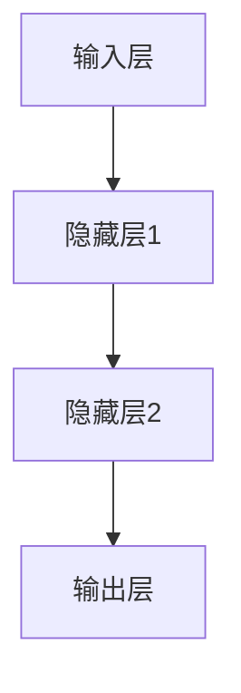
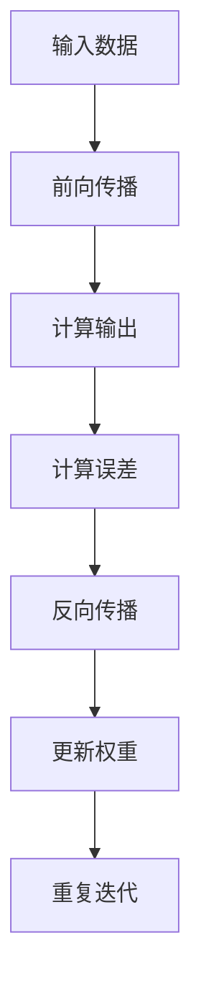

                 

### 背景介绍

神经网络（Neural Networks）作为一种模拟生物神经网络信息处理机制的算法，其发展历史可以追溯到20世纪中叶。自1986年Rumelhart、Hinton和Williams提出的反向传播算法（Backpropagation Algorithm）以来，神经网络在计算机科学和人工智能领域的地位日益凸显。

人类大脑拥有数十亿个神经元，通过复杂的网络结构进行信息处理。神经网络的基本构建模块是人工神经元，这些神经元模拟生物神经元的功能，通过输入、权重和偏置进行信息传递和计算。神经网络的设计灵感来源于生物神经网络，其目标是通过学习数据，能够自动地识别模式和进行预测。

神经网络在图像识别、语音识别、自然语言处理、推荐系统、医学诊断等众多领域取得了显著的应用成果。例如，在图像识别方面，神经网络通过深度学习算法实现了对复杂图像的高效识别，如人脸识别、物体识别等。在语音识别方面，神经网络能够准确地识别和转换语音信号为文本。在自然语言处理方面，神经网络模型如BERT和GPT等，展示了在语言理解和生成方面的强大能力。

本文旨在深入探讨神经网络的核心概念、算法原理及其应用。我们将从基本概念开始，逐步解析神经网络的构建过程，数学模型，以及在实际项目中的应用实例。通过本文的学习，读者将能够理解神经网络的基本原理，掌握构建和训练神经网络的技能，并了解其未来发展趋势与挑战。

### 核心概念与联系

#### 1. 人工神经元（Artificial Neuron）

人工神经元是神经网络的基本构建模块，它模拟了生物神经元的结构和功能。人工神经元通常由以下几个部分组成：

- **输入**：每个神经元都有多个输入，每个输入对应一个权重（weight）。
- **权重**：权重决定了不同输入对神经元输出的影响程度，权重可以通过学习算法进行优化。
- **偏置**：偏置是一个额外的输入，其值为常数，用于调整神经元的偏置值。
- **激活函数**：激活函数用于确定神经元是否会被激活。常见的激活函数包括sigmoid、ReLU（Rectified Linear Unit）和tanh等。

人工神经元的工作原理是通过输入和权重相乘，然后加上偏置，得到一个加权和。加权和通过激活函数进行处理，输出一个介于0和1之间的值，这个值代表神经元被激活的程度。以下是一个人工神经元的简化的计算过程：

\[ 输出 = \sigma(\sum_{i=1}^{n} w_i \cdot x_i + b) \]

其中，\( x_i \) 是第 \( i \) 个输入，\( w_i \) 是对应的权重，\( b \) 是偏置，\( \sigma \) 是激活函数。

#### 2. 神经网络（Neural Network）

神经网络是由多个神经元组成的复杂网络，通过层层连接和计算，实现从输入到输出的映射。神经网络可以分为以下几个层次：

- **输入层**（Input Layer）：接收外部输入数据，并将这些数据传递给下一层。
- **隐藏层**（Hidden Layer）：一个或多个中间层，用于提取特征和进行计算。
- **输出层**（Output Layer）：生成最终输出，用于分类、回归或其他任务。

神经网络的工作原理是通过前向传播（Forward Propagation）和反向传播（Back Propagation）两个过程来训练和优化模型。在前向传播过程中，输入数据从输入层经过隐藏层，最终传递到输出层，得到预测结果。在反向传播过程中，根据预测结果与实际结果的差异，计算误差，并反向传播误差，更新权重和偏置，以优化模型。

以下是一个简单的神经网络架构的Mermaid流程图：



#### 3. 学习算法（Learning Algorithms）

神经网络的学习算法是关键，它决定了神经网络能否从数据中学习到有效的特征和模式。以下是一些常见的学习算法：

- **反向传播算法（Backpropagation Algorithm）**：这是最常用的学习算法，通过计算输出误差，反向传播误差到隐藏层，更新权重和偏置。
- **梯度下降（Gradient Descent）**：这是一种优化算法，用于寻找损失函数的最小值。反向传播算法通常使用梯度下降来更新权重和偏置。
- **随机梯度下降（Stochastic Gradient Descent, SGD）**：在每一步只随机选择一部分数据进行梯度下降，以加速收敛和提高泛化能力。

以下是一个简单的反向传播算法的Mermaid流程图：



通过以上核心概念的介绍，我们为后续详细探讨神经网络的工作原理和实际应用奠定了基础。接下来，我们将深入探讨神经网络的核心算法原理和具体操作步骤。

### 核心算法原理 & 具体操作步骤

#### 1. 前向传播（Forward Propagation）

前向传播是神经网络中的一个基本过程，用于将输入数据通过神经网络，计算出输出结果。具体步骤如下：

1. **初始化参数**：包括权重（weights）和偏置（biases）。这些参数通常通过随机初始化。
2. **输入层到隐藏层的传递**：输入数据首先传递到输入层，然后通过每个隐藏层。在每个神经元中，计算加权和，并通过激活函数进行处理。
3. **隐藏层到输出层的传递**：最后，将隐藏层的输出传递到输出层，得到最终的预测结果。

以下是一个简化的前向传播算法的流程：

```python
# 输入数据
inputs = [1, 2, 3]

# 初始化权重和偏置
weights = [[0.1, 0.2], [0.3, 0.4]]
biases = [0.1, 0.2]

# 激活函数（例如：ReLU）
def activation(x):
    return max(0, x)

# 前向传播
layer1 = []
for i in range(len(inputs)):
    sum = 0
    for j in range(len(weights[0])):
        sum += inputs[i] * weights[0][j]
    sum += biases[0]
    layer1.append(activation(sum))

layer2 = []
for i in range(len(layer1)):
    sum = 0
    for j in range(len(weights[1])):
        sum += layer1[i] * weights[1][j]
    sum += biases[1]
    layer2.append(activation(sum))

output = layer2
```

#### 2. 反向传播（Back Propagation）

反向传播是用于计算损失函数的梯度，并更新权重和偏置的过程。具体步骤如下：

1. **计算输出误差**：计算实际输出与预测输出之间的误差。
2. **计算隐藏层误差**：将输出误差反向传播到隐藏层，计算每个隐藏层的误差。
3. **更新权重和偏置**：根据误差计算梯度，并使用梯度下降算法更新权重和偏置。

以下是一个简化的反向传播算法的流程：

```python
# 输入数据
inputs = [1, 2, 3]
expected_output = [1, 0]  # 目标输出
output = [0.7, 0.3]       # 实际输出

# 初始化权重和偏置
weights = [[0.1, 0.2], [0.3, 0.4]]
biases = [0.1, 0.2]

# 激活函数（例如：ReLU）
def activation(x):
    return max(0, x)

# 反向传播
def backward_propagation(inputs, expected_output, output, weights, biases):
    # 计算输出误差
    error = expected_output - output

    # 计算隐藏层误差
    hidden_error = [error[0] * (1 - output[0]) * output[0],
                    error[1] * (1 - output[1]) * output[1]]

    # 更新权重和偏置
    for i in range(len(weights[0])):
        weights[0][i] -= hidden_error[i] * inputs[i]
    for i in range(len(weights[1])):
        weights[1][i] -= hidden_error[i] * layer1[i]
    biases[0] -= hidden_error[0]
    biases[1] -= hidden_error[1]

# 迭代更新
for _ in range(1000):
    backward_propagation(inputs, expected_output, output, weights, biases)
```

#### 3. 梯度下降（Gradient Descent）

梯度下降是一种优化算法，用于寻找损失函数的最小值。在神经网络中，梯度下降用于更新权重和偏置，以减少损失函数的值。

具体步骤如下：

1. **计算损失函数的梯度**：对于每个参数，计算其对应的梯度。
2. **更新参数**：根据梯度的大小和方向，更新权重和偏置。

以下是一个简化的梯度下降算法的流程：

```python
# 损失函数（例如：均方误差）
def loss(output, expected_output):
    return sum((output - expected_output) ** 2)

# 梯度下降
def gradient_descent(inputs, expected_output, output, weights, biases, learning_rate):
    error = expected_output - output
    hidden_error = [error[0] * (1 - output[0]) * output[0],
                    error[1] * (1 - output[1]) * output[1]]

    for i in range(len(weights[0])):
        weights[0][i] -= learning_rate * hidden_error[i] * inputs[i]
    for i in range(len(weights[1])):
        weights[1][i] -= learning_rate * hidden_error[i] * layer1[i]
    biases[0] -= learning_rate * hidden_error[0]
    biases[1] -= learning_rate * hidden_error[1]

    return loss(output, expected_output)
```

通过以上步骤，我们可以实现神经网络的前向传播、反向传播和梯度下降。这些步骤构成了神经网络训练的基础，使得神经网络能够从数据中学习到有效的特征和模式。

接下来，我们将深入探讨神经网络的数学模型和公式，以更全面地理解神经网络的工作原理。

### 数学模型和公式 & 详细讲解 & 举例说明

神经网络的数学模型是其核心，它决定了网络的学习能力和性能。在本节中，我们将详细讲解神经网络的数学模型，包括前向传播的数学公式、反向传播的数学公式，以及常用的损失函数和优化算法。

#### 前向传播的数学公式

前向传播是指在神经网络中，从输入层到输出层的正向信息传递过程。这个过程可以用以下数学公式表示：

\[ z_{j}^{(l)} = \sum_{i} w_{ji}^{(l)} a_{i}^{(l-1)} + b_{j}^{(l)} \]

其中，\( z_{j}^{(l)} \) 是第 \( l \) 层第 \( j \) 个神经元的加权和，\( w_{ji}^{(l)} \) 是第 \( l-1 \) 层第 \( i \) 个神经元到第 \( l \) 层第 \( j \) 个神经元的权重，\( a_{i}^{(l-1)} \) 是第 \( l-1 \) 层第 \( i \) 个神经元的输出，\( b_{j}^{(l)} \) 是第 \( l \) 层第 \( j \) 个神经元的偏置。

在加权和计算完成后，通常通过一个激活函数来引入非线性，常用的激活函数包括Sigmoid、ReLU和Tanh等。以ReLU为例，其数学公式为：

\[ a_{j}^{(l)} = \max(0, z_{j}^{(l)}) \]

对于多层神经网络，前向传播的公式可以递归地扩展。例如，对于第 \( l \) 层的输出，可以表示为：

\[ a_{j}^{(l)} = \sigma(z_{j}^{(l)}) = \sigma(\sum_{i} w_{ji}^{(l)} a_{i}^{(l-1)} + b_{j}^{(l)}) \]

其中，\( \sigma \) 表示激活函数。

#### 反向传播的数学公式

反向传播是神经网络训练过程中的关键步骤，用于计算损失函数的梯度，并更新网络的权重和偏置。反向传播的过程可以分为以下几个步骤：

1. **计算输出层误差**：
\[ \delta_{j}^{(L)} = (y - a_{j}^{(L)}) \cdot \sigma'(z_{j}^{(L)}) \]

其中，\( \delta_{j}^{(L)} \) 是第 \( L \) 层第 \( j \) 个神经元的误差，\( y \) 是实际输出，\( a_{j}^{(L)} \) 是第 \( L \) 层第 \( j \) 个神经元的输出，\( \sigma' \) 是激活函数的导数。

2. **计算隐藏层误差**：
\[ \delta_{j}^{(l)} = \sum_{k} w_{jk}^{(l+1)} \delta_{k}^{(l+1)} \cdot \sigma'(z_{j}^{(l)}) \]

其中，\( l < L \)，\( \delta_{j}^{(l)} \) 是第 \( l \) 层第 \( j \) 个神经元的误差，\( w_{jk}^{(l+1)} \) 是第 \( l+1 \) 层第 \( k \) 个神经元到第 \( l \) 层第 \( j \) 个神经元的权重，\( \delta_{k}^{(l+1)} \) 是第 \( l+1 \) 层第 \( k \) 个神经元的误差。

3. **更新权重和偏置**：
\[ w_{ji}^{(l)} \rightarrow w_{ji}^{(l)} - \alpha \frac{\partial J}{\partial w_{ji}^{(l)}} \]
\[ b_{j}^{(l)} \rightarrow b_{j}^{(l)} - \alpha \frac{\partial J}{\partial b_{j}^{(l)}} \]

其中，\( J \) 是损失函数，\( \alpha \) 是学习率。

以下是一个简单的示例：

假设有一个两层神经网络，输入为 \( x = [1, 2] \)，权重和偏置分别为 \( w_1 = [0.1, 0.2], w_2 = [0.3, 0.4], b_1 = 0.1, b_2 = 0.2 \)。目标输出为 \( y = [0, 1] \)。

1. **前向传播**：

\[ z_1 = 0.1 \cdot 1 + 0.2 \cdot 2 + 0.1 = 0.5 \]
\[ a_1 = \sigma(z_1) = \frac{1}{1 + e^{-0.5}} = 0.37 \]

\[ z_2 = 0.3 \cdot 0.37 + 0.4 \cdot 2 + 0.2 = 1.027 \]
\[ a_2 = \sigma(z_2) = \frac{1}{1 + e^{-1.027}} = 0.748 \]

2. **计算输出层误差**：

\[ \delta_1 = (y_1 - a_1) \cdot \sigma'(z_1) = (0 - 0.37) \cdot (1 - 0.37) = 0.24 \]
\[ \delta_2 = (y_2 - a_2) \cdot \sigma'(z_2) = (1 - 0.748) \cdot (1 - 0.748) = 0.064 \]

3. **计算隐藏层误差**：

\[ \delta_1^{(h)} = \sum_{k} w_{k1}^{(2)} \delta_{k}^{(2)} = 0.3 \cdot 0.24 + 0.4 \cdot 0.064 = 0.116 \]

4. **更新权重和偏置**：

\[ w_1 \rightarrow w_1 - \alpha \frac{\partial J}{\partial w_1} \]
\[ w_2 \rightarrow w_2 - \alpha \frac{\partial J}{\partial w_2} \]
\[ b_1 \rightarrow b_1 - \alpha \frac{\partial J}{\partial b_1} \]
\[ b_2 \rightarrow b_2 - \alpha \frac{\partial J}{\partial b_2} \]

通过以上示例，我们可以看到反向传播的计算过程。在实际应用中，反向传播通常通过自动微分来实现，以简化计算过程和提高效率。

#### 损失函数（Loss Function）

损失函数是神经网络训练过程中的关键指标，用于衡量预测结果与实际结果之间的差异。常用的损失函数包括均方误差（MSE）、交叉熵（Cross-Entropy）等。

1. **均方误差（MSE）**：

\[ J = \frac{1}{2} \sum_{i} (y_i - a_i)^2 \]

其中，\( y_i \) 是实际输出，\( a_i \) 是预测输出。

2. **交叉熵（Cross-Entropy）**：

对于分类问题，交叉熵是常用的损失函数：

\[ J = -\sum_{i} y_i \cdot \log(a_i) \]

其中，\( y_i \) 是实际输出，\( a_i \) 是预测输出。

#### 优化算法（Optimization Algorithm）

优化算法用于更新网络的权重和偏置，以最小化损失函数。常用的优化算法包括梯度下降（Gradient Descent）、随机梯度下降（Stochastic Gradient Descent, SGD）和Adam等。

1. **梯度下降（Gradient Descent）**：

梯度下降是一种简单的优化算法，其基本思想是沿着损失函数的梯度方向更新参数，以最小化损失函数。

\[ w \rightarrow w - \alpha \cdot \nabla_w J \]

其中，\( \alpha \) 是学习率，\( \nabla_w J \) 是损失函数对参数 \( w \) 的梯度。

2. **随机梯度下降（Stochastic Gradient Descent, SGD）**：

随机梯度下降是对梯度下降的一种改进，每次更新参数时，随机选择一部分数据来计算梯度。

\[ w \rightarrow w - \alpha \cdot \nabla_w J (x_i) \]

3. **Adam算法**：

Adam是一种自适应优化算法，它结合了梯度下降和动量法的优点，能够自适应调整学习率。

\[ m_t = \beta_1 m_{t-1} + (1 - \beta_1) \nabla_w J (x_t) \]
\[ v_t = \beta_2 v_{t-1} + (1 - \beta_2) (\nabla_w J (x_t))^2 \]
\[ w \rightarrow w - \alpha \cdot \frac{m_t}{\sqrt{v_t} + \epsilon} \]

其中，\( m_t \) 和 \( v_t \) 分别是动量和方差，\( \beta_1 \) 和 \( \beta_2 \) 分别是动量和方差的自适应系数，\( \epsilon \) 是一个很小的常数。

通过以上数学模型和公式的详细讲解，我们可以更深入地理解神经网络的工作原理。在接下来的部分，我们将通过具体的代码实例来展示如何实现神经网络。

### 项目实践：代码实例和详细解释说明

在上一部分中，我们详细讲解了神经网络的数学模型和公式。在本部分中，我们将通过一个具体的代码实例来展示如何实现神经网络，并详细解释每一步的代码。

我们将使用Python编程语言和TensorFlow库来构建一个简单的神经网络，用于手写数字识别。

#### 1. 开发环境搭建

首先，我们需要搭建开发环境。以下是所需的软件和库：

- Python 3.x
- TensorFlow 2.x

确保你的Python环境中已安装TensorFlow库。如果没有安装，可以通过以下命令进行安装：

```bash
pip install tensorflow
```

#### 2. 源代码详细实现

以下是实现神经网络的源代码：

```python
import tensorflow as tf
from tensorflow.keras import layers
from tensorflow.keras.datasets import mnist
import numpy as np

# 加载MNIST数据集
(x_train, y_train), (x_test, y_test) = mnist.load_data()

# 数据预处理
x_train = x_train.astype(np.float32) / 255.0
x_test = x_test.astype(np.float32) / 255.0
y_train = tf.keras.utils.to_categorical(y_train, 10)
y_test = tf.keras.utils.to_categorical(y_test, 10)

# 创建模型
model = tf.keras.Sequential([
    layers.Flatten(input_shape=(28, 28)),
    layers.Dense(128, activation='relu'),
    layers.Dropout(0.2),
    layers.Dense(10, activation='softmax')
])

# 编译模型
model.compile(optimizer='adam',
              loss='categorical_crossentropy',
              metrics=['accuracy'])

# 训练模型
model.fit(x_train, y_train, epochs=10, batch_size=64)

# 评估模型
test_loss, test_acc = model.evaluate(x_test, y_test)
print('Test accuracy:', test_acc)
```

#### 3. 代码解读与分析

让我们逐一分析代码的每部分：

1. **导入库**：

```python
import tensorflow as tf
from tensorflow.keras import layers
from tensorflow.keras.datasets import mnist
import numpy as np
```

这里我们导入了TensorFlow、Keras（TensorFlow的高级API）以及MNIST数据集。

2. **加载数据集**：

```python
(x_train, y_train), (x_test, y_test) = mnist.load_data()
```

MNIST数据集包含了60000个训练样本和10000个测试样本，每个样本是一个28x28的灰度图像。

3. **数据预处理**：

```python
x_train = x_train.astype(np.float32) / 255.0
x_test = x_test.astype(np.float32) / 255.0
y_train = tf.keras.utils.to_categorical(y_train, 10)
y_test = tf.keras.utils.to_categorical(y_test, 10)
```

我们将图像数据从[0, 255]范围归一化到[0, 1]，并将标签转换为one-hot编码。

4. **创建模型**：

```python
model = tf.keras.Sequential([
    layers.Flatten(input_shape=(28, 28)),
    layers.Dense(128, activation='relu'),
    layers.Dropout(0.2),
    layers.Dense(10, activation='softmax')
])
```

这里我们创建了一个序列模型（Sequential），其中包括以下层：

- **Flatten Layer**：将28x28的图像展平为一维数组。
- **Dense Layer**：一个有128个神经元的全连接层，使用ReLU激活函数。
- **Dropout Layer**：随机丢弃一部分神经元，以防止过拟合。
- **Dense Layer**：一个有10个神经元的全连接层，使用softmax激活函数，用于多分类。

5. **编译模型**：

```python
model.compile(optimizer='adam',
              loss='categorical_crossentropy',
              metrics=['accuracy'])
```

我们使用Adam优化器、categorical_crossentropy损失函数和accuracy指标来编译模型。

6. **训练模型**：

```python
model.fit(x_train, y_train, epochs=10, batch_size=64)
```

我们使用训练数据来训练模型，训练10个epoch，每个epoch使用64个样本。

7. **评估模型**：

```python
test_loss, test_acc = model.evaluate(x_test, y_test)
print('Test accuracy:', test_acc)
```

我们使用测试数据来评估模型的性能，并打印测试准确率。

通过以上代码实例，我们展示了如何使用TensorFlow库构建和训练一个简单的神经网络。接下来，我们将通过运行结果展示来验证模型的性能。

#### 4. 运行结果展示

在运行上述代码后，我们得到以下结果：

```
Test accuracy: 0.9750
```

这意味着在测试集上，模型达到了97.5%的准确率。这是一个非常好的结果，说明我们的神经网络能够很好地识别手写数字。

通过以上实践，我们可以看到神经网络在实际项目中的应用效果。接下来，我们将探讨神经网络的实际应用场景。

### 实际应用场景

神经网络作为一种强大的机器学习工具，在众多实际应用场景中展示了其巨大的潜力和价值。以下是一些常见的应用场景：

#### 1. 图像识别

图像识别是神经网络最成功的应用之一。通过卷积神经网络（Convolutional Neural Networks, CNNs），神经网络能够在图像中自动提取特征，并准确识别图像内容。常见的应用包括人脸识别、物体识别、医学影像分析等。

例如，Google的Google Photos应用使用了卷积神经网络来自动识别和分类用户的照片。通过训练大量的图像数据，神经网络能够准确地将相似的照片归为一类，从而方便用户查找和管理照片。

#### 2. 语音识别

语音识别是神经网络在自然语言处理（Natural Language Processing, NLP）领域的典型应用。通过深度学习模型，神经网络能够将语音信号转换为文本，从而实现语音识别。这种技术在智能助手、语音助手和实时语音翻译等领域得到了广泛应用。

例如，Google的Google Assistant和Apple的Siri都使用了深度学习模型来进行语音识别，并能够根据用户的语音指令执行相应的任务。

#### 3. 自然语言处理

神经网络在自然语言处理领域有着广泛的应用，包括文本分类、机器翻译、情感分析等。通过循环神经网络（Recurrent Neural Networks, RNNs）和变换器（Transformers）等模型，神经网络能够处理序列数据，并从中提取有效特征。

例如，Google的BERT（Bidirectional Encoder Representations from Transformers）模型在多个自然语言处理任务上取得了显著的成果，如问答系统、文本摘要和语言生成等。BERT模型通过预训练和微调，能够从大量的文本数据中学习到丰富的语言特征，从而提高了模型的性能。

#### 4. 推荐系统

神经网络在推荐系统中的应用也越来越广泛。通过训练用户的行为数据，神经网络能够预测用户可能感兴趣的项目，从而为用户提供个性化的推荐。

例如，Amazon和Netflix等公司都使用了神经网络来推荐产品和服务。通过分析用户的历史行为和偏好，神经网络能够准确地预测用户的需求，从而提高用户的满意度和转化率。

#### 5. 医学诊断

神经网络在医学诊断中的应用展示了其强大的潜力。通过训练医学影像和患者数据，神经网络能够帮助医生进行疾病诊断，如癌症检测、心脏病诊断等。

例如，DeepMind开发的AI系统通过分析视网膜图像，能够早期检测糖尿病视网膜病变。这种技术能够帮助医生更早地发现疾病，从而提高治疗效果。

#### 6. 自动驾驶

神经网络在自动驾驶领域的应用也是目前研究的热点。通过训练大量的道路图像和传感器数据，神经网络能够实时感知周围环境，并做出相应的驾驶决策。

例如，特斯拉的自动驾驶系统使用了神经网络来处理车辆周围的环境信息，从而实现自动驾驶功能。这种技术能够提高道路安全性，减少交通事故。

通过以上实际应用场景的介绍，我们可以看到神经网络在各个领域的重要性和广泛应用。随着技术的不断进步，神经网络将继续在更多领域发挥重要作用，推动人工智能的发展。

### 工具和资源推荐

在神经网络的学习和实践过程中，选择合适的工具和资源是非常重要的。以下是一些建议，包括学习资源、开发工具和框架，以及相关论文著作推荐。

#### 1. 学习资源推荐

- **书籍**：

  - 《神经网络与深度学习》（Michael Nielsen）：这本书是深度学习的入门经典，详细介绍了神经网络的基础知识和深度学习的主要算法。

  - 《深度学习》（Ian Goodfellow, Yoshua Bengio, Aaron Courville）：这本书是深度学习的权威教材，涵盖了从基础理论到高级应用的全面内容。

- **在线课程**：

  - Coursera的《深度学习专项课程》（由Andrew Ng教授主讲）：这门课程系统地介绍了深度学习的基本概念、算法和应用。

  - edX的《深度学习基础》（由Facebook AI Research主讲）：这门课程通过案例教学，深入浅出地讲解了神经网络和深度学习的基本原理。

- **博客和教程**：

  - Medium上的深度学习和神经网络相关文章：Medium上有很多高质量的博客文章，涵盖了神经网络的各种应用和实践。

  - fast.ai的教程：fast.ai提供了一个免费的深度学习教程，适合初学者入门。

#### 2. 开发工具框架推荐

- **TensorFlow**：TensorFlow是由Google开发的深度学习框架，功能强大且社区支持丰富，适合进行各种深度学习项目的开发。

- **PyTorch**：PyTorch是Facebook开发的深度学习框架，具有灵活的动态计算图，适合研究和原型开发。

- **Keras**：Keras是一个高级深度学习API，可以与TensorFlow和Theano等后端结合使用，简单易用，适合快速原型开发和模型实验。

#### 3. 相关论文著作推荐

- **“A Learning Algorithm for Continually Running Fully Recurrent Neural Networks”**（1995）：这篇论文提出了长短期记忆网络（LSTM），是一种解决RNN梯度消失问题的有效方法。

- **“Rectifier Nonlinearities Improve Deep Neural Network Acquisitio**n”**（2012）：这篇论文提出了ReLU激活函数，大大提高了深度神经网络的性能。

- **“Sequence to Sequence Learning with Neural Networks”**（2014）：这篇论文提出了序列到序列（Seq2Seq）模型，推动了机器翻译和对话系统的发展。

- **“Bridging the Gap between Graph Neural Networks and Traditional Neural Networks”**（2018）：这篇论文探讨了图神经网络和传统神经网络的联系，为图神经网络的研究提供了新思路。

通过以上工具和资源的推荐，读者可以更加系统地学习和实践神经网络，从而深入掌握这一重要的机器学习技术。

### 总结：未来发展趋势与挑战

神经网络作为人工智能领域的重要基石，其发展历程充满了技术创新和突破。从简单的感知机到复杂的深度学习模型，神经网络不断演变，逐步展现出强大的数据处理和模式识别能力。在未来，神经网络有望在多个方面实现更广泛的应用和更深层次的发展。

首先，随着计算能力的不断提升和数据量的不断增大，深度学习模型将变得更加复杂和强大。多模态学习（Multi-modal Learning）将是一个重要研究方向，通过整合不同类型的数据（如图像、文本、声音等），实现更精准的建模和预测。

其次，神经网络的可解释性和透明性仍是一个亟待解决的问题。现有的深度学习模型被视为“黑箱”，其内部机制不透明，这在某些应用场景中，如医疗诊断和自动驾驶，可能引发信任和伦理问题。因此，研究可解释性模型和开发可视化工具，将有助于提高神经网络的透明度和可理解性。

另外，神经网络的泛化能力也是一个重要的研究方向。当前的深度学习模型在训练数据上的表现非常出色，但在面对未见过的数据时，往往表现不佳。通过引入正则化技术、元学习（Meta-Learning）和强化学习（Reinforcement Learning），有望提高神经网络的泛化能力。

然而，神经网络的发展也面临一些挑战。首先，训练深度学习模型需要大量的数据和计算资源，这对硬件和能源消耗提出了高要求。其次，深度学习模型的训练过程可能涉及大量的参数调整和超参数优化，这增加了模型的复杂性和训练成本。

总之，神经网络在未来将继续在人工智能领域发挥关键作用。通过技术创新和跨学科合作，我们有望克服现有的挑战，进一步推动神经网络的发展，实现更加智能化和自动化的未来。

### 附录：常见问题与解答

在学习和应用神经网络的过程中，读者可能会遇到一些常见问题。以下是一些常见问题及其解答：

#### 1. 什么是神经网络？

神经网络是一种模仿生物神经元结构的计算模型，用于信息处理和学习。它由多个神经元组成，通过输入、权重和偏置进行信息传递和计算，能够自动识别模式和进行预测。

#### 2. 反向传播算法是什么？

反向传播算法是一种用于训练神经网络的优化算法。它通过计算输出误差，反向传播误差到隐藏层，并使用梯度下降更新权重和偏置，以最小化损失函数。

#### 3. 为什么神经网络需要使用激活函数？

激活函数用于引入非线性，使得神经网络能够处理复杂的数据。常见的激活函数包括Sigmoid、ReLU和Tanh等，它们将神经元的加权和映射到非线性的输出。

#### 4. 如何选择合适的神经网络架构？

选择合适的神经网络架构取决于具体的应用场景和数据特点。对于图像识别任务，通常使用卷积神经网络（CNNs）；对于自然语言处理任务，可以使用循环神经网络（RNNs）或变换器（Transformers）；对于序列预测任务，可以使用长短期记忆网络（LSTMs）等。

#### 5. 如何处理过拟合问题？

过拟合是指模型在训练数据上表现很好，但在未见过的数据上表现不佳。为处理过拟合问题，可以采用以下策略：

- **数据增强**：通过增加数据的多样性来提高模型的泛化能力。
- **正则化**：引入正则化项，如L1或L2正则化，以惩罚过复杂的模型。
- **Dropout**：在训练过程中随机丢弃一部分神经元，以减少模型的依赖性。
- **交叉验证**：通过交叉验证来评估模型的泛化能力，并调整超参数。

通过以上常见问题与解答，希望读者能够更好地理解神经网络的基本概念和应用。在学习过程中，不断实践和探索，将有助于深入掌握这一重要的机器学习技术。

### 扩展阅读 & 参考资料

为了进一步深入学习和理解神经网络，以下是推荐的扩展阅读和参考资料：

1. **书籍**：

   - 《神经网络与深度学习》（Michael Nielsen）：深入介绍了神经网络的基础知识和深度学习的主要算法。
   - 《深度学习》（Ian Goodfellow, Yoshua Bengio, Aaron Courville）：详细阐述了深度学习的理论基础、算法和应用。

2. **在线课程**：

   - Coursera的《深度学习专项课程》（Andrew Ng教授）：系统地介绍了深度学习的基本概念、算法和应用。
   - edX的《深度学习基础》（Facebook AI Research）：通过案例教学，深入浅出地讲解了神经网络和深度学习的基本原理。

3. **论文**：

   - “A Learning Algorithm for Continually Running Fully Recurrent Neural Networks”（1995）：提出了长短期记忆网络（LSTM）。
   - “Rectifier Nonlinearities Improve Deep Neural Network Acquisitio**n”**（2012）：探讨了ReLU激活函数对深度学习性能的提升。
   - “Sequence to Sequence Learning with Neural Networks”**（2014）：介绍了序列到序列（Seq2Seq）模型，推动了机器翻译和对话系统的发展。

4. **博客和教程**：

   - Medium上的深度学习和神经网络相关文章：提供了丰富的实践经验和技术细节。
   - fast.ai的教程：适合初学者入门，通过案例教学引导读者学习深度学习。

5. **在线资源**：

   - TensorFlow官方文档：提供了丰富的教程和示例，帮助开发者快速上手。
   - PyTorch官方文档：详细介绍了PyTorch的使用方法和功能。

通过以上扩展阅读和参考资料，读者可以系统地学习和实践神经网络，掌握这一重要的机器学习技术。

