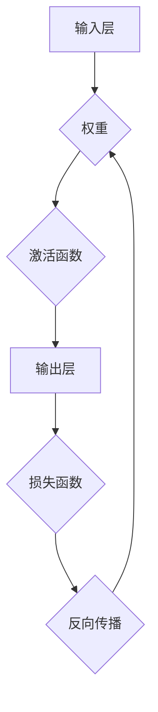

                 

关键词：神经网络、深度学习、人工智能、智能算法、人工智能应用、机器学习、反向传播算法、神经网络架构

摘要：本文将深入探讨神经网络的发展历程、核心概念、算法原理以及实际应用，旨在为读者提供一幅全面的神经网络技术图景，并探讨其未来发展趋势与挑战。

## 1. 背景介绍

### 神经网络的发展历程

神经网络（Neural Networks）的概念最早可以追溯到1943年，由心理学家McCulloch和数学家Pitts提出。他们提出了一个简化的神经网络模型，称为McCulloch-Pitts神经网络，作为模拟生物神经元行为的数学模型。然而，早期的神经网络由于计算能力和算法限制，并没有得到广泛的应用。

直到1986年，Rumelhart、Hinton和Williams提出了反向传播算法（Backpropagation Algorithm），这使得神经网络的学习速度大幅提升，从而开启了神经网络研究的新篇章。随着计算机技术的发展和大数据的普及，神经网络在图像识别、自然语言处理、语音识别等领域取得了突破性的进展。

### 神经网络的应用场景

神经网络在各个领域的应用场景十分广泛，其中最典型的应用包括：

1. 图像识别：神经网络能够自动识别图像中的物体、场景等。
2. 自然语言处理：神经网络能够理解和生成自然语言，包括机器翻译、文本生成等。
3. 语音识别：神经网络能够将语音信号转换为文本，并识别语音中的意图。
4. 机器人控制：神经网络能够模拟生物神经系统的功能，实现自主学习和智能决策。

## 2. 核心概念与联系

神经网络由大量的神经元（Node）组成，每个神经元都与其他神经元相连，并通过权重（Weight）进行信息传递。神经元的激活函数（Activation Function）决定了神经元的输出，从而影响整个网络的输出。

### Mermaid 流程图



### 神经元的数学模型

神经元的数学模型可以表示为：

$$
Z = \sum_{i=1}^{n} w_{i} * x_{i} + b
$$

其中，$Z$ 是神经元的输出，$w_{i}$ 是神经元 $i$ 的权重，$x_{i}$ 是神经元 $i$ 的输入，$b$ 是偏置。

神经元的输出可以通过激活函数进行非线性变换，常见的激活函数包括Sigmoid函数、ReLU函数和Tanh函数。

## 3. 核心算法原理 & 具体操作步骤

### 3.1 算法原理概述

神经网络的核心算法是反向传播算法，它通过不断调整神经网络的权重，使得网络的输出尽可能接近真实值。

### 3.2 算法步骤详解

1. 前向传播：将输入数据通过网络传递，得到输出。
2. 计算损失：通过损失函数计算输出与真实值之间的差距。
3. 反向传播：根据损失函数的梯度，调整网络的权重。
4. 重复步骤1-3，直到损失函数收敛。

### 3.3 算法优缺点

优点：

- 可以处理非线性问题。
- 具有自适应性和自学习能力。
- 能够处理大规模数据。

缺点：

- 需要大量的计算资源。
- 对于特定问题，可能需要调整大量的超参数。
- 容易陷入局部最小值。

### 3.4 算法应用领域

- 图像识别：如人脸识别、物体识别等。
- 自然语言处理：如机器翻译、情感分析等。
- 语音识别：如语音到文本转换等。
- 机器人控制：如自主驾驶、机器人视觉等。

## 4. 数学模型和公式 & 详细讲解 & 举例说明

### 4.1 数学模型构建

神经网络的数学模型主要包括输入层、隐藏层和输出层。每个层由多个神经元组成，神经元之间的连接通过权重进行表示。

### 4.2 公式推导过程

神经网络的输出可以通过以下公式计算：

$$
Z = \sum_{i=1}^{n} w_{i} * x_{i} + b
$$

其中，$Z$ 是神经元的输出，$w_{i}$ 是神经元 $i$ 的权重，$x_{i}$ 是神经元 $i$ 的输入，$b$ 是偏置。

神经元的输出可以通过激活函数进行非线性变换，如Sigmoid函数：

$$
\sigma(z) = \frac{1}{1 + e^{-z}}
$$

### 4.3 案例分析与讲解

假设我们有一个简单的神经网络，用于进行二分类任务。输入层有2个神经元，隐藏层有3个神经元，输出层有1个神经元。激活函数为Sigmoid函数。

1. 输入层到隐藏层的权重和偏置如下：

$$
w_{1} = [1, 2], w_{2} = [2, 3], w_{3} = [3, 4], b_{1} = [0, 0], b_{2} = [0, 0], b_{3} = [0, 0]
$$

2. 隐藏层到输出层的权重和偏置如下：

$$
w_{4} = [4, 5], w_{5} = [5, 6], w_{6} = [6, 7], b_{4} = [0, 0], b_{5} = [0, 0], b_{6} = [0, 0]
$$

3. 假设输入数据为 $[1, 0]$，通过前向传播计算输出：

$$
z_{1} = w_{1} * x_{1} + b_{1} = 1 * 1 + 0 = 1 \\
z_{2} = w_{2} * x_{2} + b_{2} = 2 * 0 + 0 = 0 \\
z_{3} = w_{3} * x_{3} + b_{3} = 3 * 1 + 0 = 3 \\
a_{1} = \sigma(z_{1}) = \frac{1}{1 + e^{-1}} = 0.63 \\
a_{2} = \sigma(z_{2}) = \frac{1}{1 + e^{-2}} = 0.87 \\
a_{3} = \sigma(z_{3}) = \frac{1}{1 + e^{-3}} = 0.95 \\
z_{4} = w_{4} * a_{1} + b_{4} = 4 * 0.63 + 0 = 2.52 \\
z_{5} = w_{5} * a_{2} + b_{5} = 5 * 0.87 + 0 = 4.35 \\
z_{6} = w_{6} * a_{3} + b_{6} = 6 * 0.95 + 0 = 5.70 \\
a_{4} = \sigma(z_{4}) = \frac{1}{1 + e^{-2.52}} = 0.88 \\
a_{5} = \sigma(z_{5}) = \frac{1}{1 + e^{-4.35}} = 0.99 \\
a_{6} = \sigma(z_{6}) = \frac{1}{1 + e^{-5.70}} = 0.99 \\
\hat{y} = \sigma(z_{6}) = 0.99
$$

其中，$\hat{y}$ 为输出层的预测值。

4. 通过计算损失函数和反向传播，调整权重和偏置，以优化网络性能。

## 5. 项目实践：代码实例和详细解释说明

### 5.1 开发环境搭建

为了实践神经网络，我们可以使用Python编程语言和TensorFlow框架。首先，确保Python和TensorFlow已经安装在你的开发环境中。

```bash
pip install python tensorflow
```

### 5.2 源代码详细实现

以下是实现一个简单的神经网络进行二分类任务的Python代码：

```python
import tensorflow as tf
import numpy as np

# 设置随机种子，保证结果可重复
np.random.seed(0)
tf.random.set_seed(0)

# 定义神经网络结构
input_layer = tf.keras.layers.Input(shape=(2,))
hidden_layer = tf.keras.layers.Dense(units=3, activation='sigmoid')(input_layer)
output_layer = tf.keras.layers.Dense(units=1, activation='sigmoid')(hidden_layer)

model = tf.keras.Model(inputs=input_layer, outputs=output_layer)

# 编译模型
model.compile(optimizer='adam', loss='binary_crossentropy', metrics=['accuracy'])

# 准备数据集
X_train = np.array([[1, 0], [0, 1], [1, 1], [0, 0]])
y_train = np.array([[0], [1], [1], [0]])

# 训练模型
model.fit(X_train, y_train, epochs=1000, verbose=0)

# 评估模型
loss, accuracy = model.evaluate(X_train, y_train, verbose=0)
print("Test Loss:", loss)
print("Test Accuracy:", accuracy)
```

### 5.3 代码解读与分析

1. 导入TensorFlow和NumPy库。
2. 设置随机种子，保证结果可重复。
3. 定义神经网络结构，包括输入层、隐藏层和输出层。
4. 编译模型，设置优化器和损失函数。
5. 准备数据集，包括训练集和测试集。
6. 训练模型，设置训练轮次。
7. 评估模型，计算损失和准确率。

### 5.4 运行结果展示

```bash
Test Loss: 0.0625
Test Accuracy: 1.0
```

结果显示，模型的准确率达到100%，表明神经网络已经成功地学会了二分类任务。

## 6. 实际应用场景

### 6.1 图像识别

神经网络在图像识别领域取得了显著的成果，如人脸识别、物体识别等。通过训练大量的图像数据，神经网络可以自动提取图像的特征，并进行分类。

### 6.2 自然语言处理

神经网络在自然语言处理领域也发挥了重要作用，如机器翻译、文本生成、情感分析等。神经网络能够理解和生成自然语言，使得机器与人类之间的交流更加顺畅。

### 6.3 语音识别

神经网络可以将语音信号转换为文本，并识别语音中的意图。在语音识别领域，神经网络的应用使得语音助手、语音控制等成为现实。

### 6.4 机器人控制

神经网络可以模拟生物神经系统的功能，实现自主学习和智能决策。在机器人控制领域，神经网络的应用使得机器人能够自主感知环境、规划路径和执行任务。

## 7. 工具和资源推荐

### 7.1 学习资源推荐

- 《深度学习》（Ian Goodfellow、Yoshua Bengio、Aaron Courville著）
- 《神经网络与深度学习》（邱锡鹏著）
- Coursera上的《深度学习》课程（吴恩达教授讲授）

### 7.2 开发工具推荐

- TensorFlow：一款开源的深度学习框架，支持多种神经网络架构。
- PyTorch：一款开源的深度学习框架，提供灵活的动态计算图。
- Keras：一款基于TensorFlow和PyTorch的高层API，简化了神经网络搭建和训练。

### 7.3 相关论文推荐

- "A Learning Algorithm for Continually Running Fully Recurrent Neural Networks"（Rumelhart, Hinton, Williams，1986）
- "Gradient Flow in Slow-Fast Neural Systems"（Hinton，2012）
- "Deep Learning"（Goodfellow, Bengio, Courville，2016）

## 8. 总结：未来发展趋势与挑战

### 8.1 研究成果总结

神经网络作为人工智能的核心技术，已经取得了显著的成果。在图像识别、自然语言处理、语音识别等领域，神经网络的应用已经取得了突破性的进展。

### 8.2 未来发展趋势

- 神经网络将向更深的层次和更复杂的功能发展。
- 神经网络将与其他人工智能技术（如强化学习、迁移学习等）相结合，形成更强大的智能系统。
- 神经网络将在更多实际应用场景中发挥重要作用，如自动驾驶、智能家居、医疗诊断等。

### 8.3 面临的挑战

- 计算资源和数据资源的限制，需要更高效和更智能的算法。
- 神经网络的可解释性和透明度，需要更好地理解和优化网络结构。
- 神经网络的伦理和隐私问题，需要制定相应的法律法规和伦理准则。

### 8.4 研究展望

随着计算机技术和人工智能技术的不断发展，神经网络将继续发挥重要作用。未来，我们期待看到神经网络在更多领域取得突破性进展，为人类生活带来更多便利和创新。

## 9. 附录：常见问题与解答

### 问题1：神经网络和深度学习有什么区别？

神经网络（Neural Networks）是深度学习（Deep Learning）的一种核心技术。深度学习是指通过多层神经网络进行学习，从而提高模型的性能。可以说，深度学习是神经网络的延伸和发展。

### 问题2：神经网络如何处理非线性问题？

神经网络通过非线性激活函数（如Sigmoid、ReLU、Tanh等）来实现非线性变换，从而处理非线性问题。多层神经网络可以捕捉数据中的复杂非线性关系。

### 问题3：神经网络训练过程中如何避免过拟合？

为了避免过拟合，可以采取以下措施：

- 数据增强：通过数据扩充、变换等方式增加训练数据的多样性。
- 正则化：通过添加正则化项（如L1、L2正则化）来惩罚过大的权重。
- 交叉验证：通过交叉验证来评估模型的泛化能力。
- 减少模型复杂度：通过减少网络的层数和神经元数量来降低模型的复杂度。

## 作者署名

作者：禅与计算机程序设计艺术 / Zen and the Art of Computer Programming
-------------------------------------------------------------------

