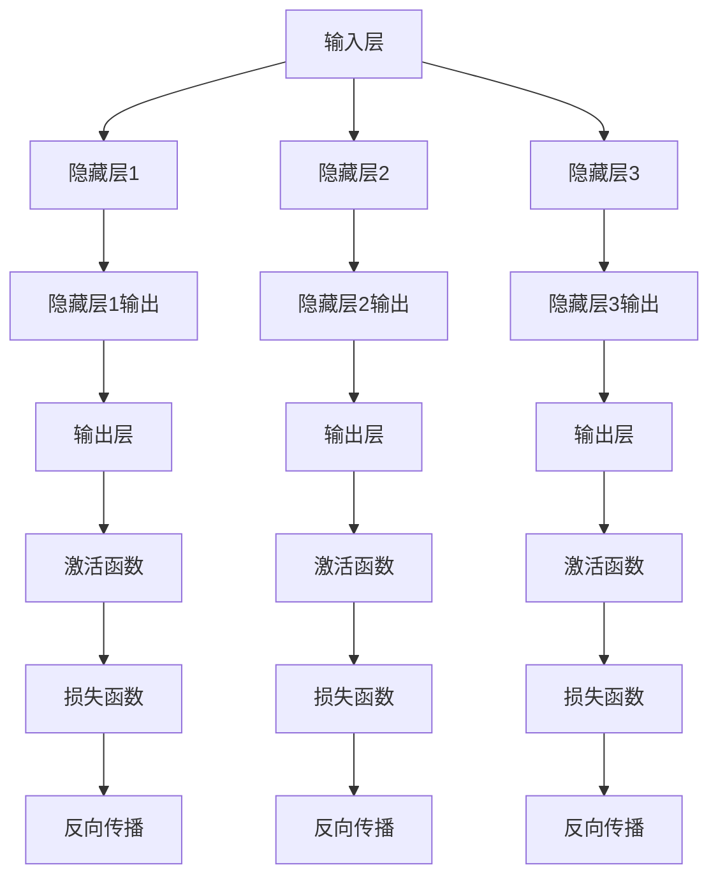

                 

### 背景介绍

**神经网络：一门古老的学科，现代的变革力量**

神经网络（Neural Networks），这一概念最早可以追溯到1940年代，由心理学家McCulloch和数学家Pitts提出，当时被称为“McCulloch-Pitts神经元模型”。尽管这一时期的研究因为计算能力的限制而进展缓慢，但神经网络的理论框架和基础概念逐渐成型。随着计算技术的进步，特别是20世纪80年代末到21世纪初，反向传播算法（Backpropagation Algorithm）的提出和优化，神经网络开始展现出其在人工智能领域的巨大潜力。

神经网络的核心在于模拟人脑的神经元结构和信息处理过程。在简单的情况下，它通过输入层、隐藏层和输出层多层节点（神经元）的组织结构，对数据进行特征提取和学习，进而实现复杂的模式识别和预测任务。神经网络模型的成功，不仅仅在于其理论的完整性，更在于其在实际应用中的表现。

在20世纪90年代，随着互联网的兴起和数据量的爆炸性增长，神经网络开始被广泛应用于语音识别、图像识别、自然语言处理等领域，并取得了显著的成果。然而，真正让神经网络名声大噪的，是2006年Hinton等人重新提出并优化了深度学习（Deep Learning）的概念。深度学习利用多层神经网络结构，通过逐层提取数据的高级特征，大大提升了模型的表现能力。这一变革，被称为人工智能领域的“深度学习革命”。

如今，神经网络及其衍生出的深度学习技术已经成为了推动社会进步的重要力量。从自动驾驶汽车、智能家居到医疗诊断、金融分析，神经网络无处不在。它不仅在提高生产效率、优化资源分配方面发挥着关键作用，还在推动人类认知边界拓展、社会变革中扮演着不可或缺的角色。

### 人工智能时代：神经网络的重要性

在进入21世纪后，随着互联网和大数据技术的迅猛发展，人工智能（AI）成为了科技领域的热点。而神经网络作为人工智能的核心技术，其重要性日益凸显。首先，神经网络是解决复杂模式识别和预测问题的有效工具。传统的机器学习方法在面对大量高维数据时，往往难以捕捉到数据中的复杂关系。而神经网络通过其多层结构和丰富的参数设置，能够自动提取数据中的层次化特征，从而更准确地识别模式。

其次，神经网络具有极强的泛化能力。在训练过程中，神经网络通过不断调整权重和偏置，使模型能够适应不同的数据和任务。这种能力使得神经网络不仅适用于单一领域的应用，还能够跨领域迁移，极大地提升了人工智能技术的应用范围。

此外，神经网络的发展推动了人工智能领域的许多突破性成果。例如，在图像识别方面，神经网络模型已经超越了人类的表现；在自然语言处理领域，神经网络帮助机器实现了从理解文本到生成文本的飞跃；在语音识别领域，神经网络的应用也极大地提高了识别的准确率和效率。

### 神经网络对社会进步的推动

神经网络技术不仅改变了人工智能领域，还对社会进步产生了深远的影响。首先，在工业生产方面，神经网络的应用极大地提升了自动化水平和生产效率。通过神经网络进行生产过程的监控和控制，企业能够更准确地预测设备故障，减少停机时间，提高生产效率。例如，工业机器人通过神经网络学习工艺参数，实现了高效、精确的制造。

其次，在医疗领域，神经网络技术正在改变疾病诊断和治疗的方式。通过分析大量的医疗数据和病例，神经网络模型能够辅助医生进行疾病诊断，提高诊断准确率。此外，神经网络还在药物研发中发挥着重要作用，通过模拟生物系统和药物作用，加速新药的研发进程。

在教育领域，神经网络技术也为个性化教育提供了新的解决方案。通过分析学生的学习数据，神经网络可以为学生量身定制学习计划，提高学习效果。同时，智能教学系统利用神经网络技术，实现了对学生学习进度的实时监测和反馈，帮助学生更好地掌握知识。

在金融领域，神经网络的应用同样不容忽视。通过分析大量的金融数据，神经网络可以预测市场走势，辅助投资决策。此外，神经网络在风险管理、信用评估等方面也有着广泛的应用，提高了金融机构的风险控制能力。

总的来说，神经网络技术通过提高生产效率、优化资源分配、改善医疗服务、提升教育质量和优化金融管理等方面，推动了社会的进步和发展。### 核心概念与联系

为了深入理解神经网络的工作原理和其关键组成部分，我们首先需要了解神经网络的核心概念和基本架构。以下是对神经网络基础概念的介绍，并附有详细的Mermaid流程图，以便读者更好地理解。

#### 1. 神经元（Neurons）

神经元是神经网络的基本组成单元，它模拟生物神经元的工作方式。每个神经元接收多个输入信号，通过激活函数（Activation Function）处理后输出一个信号。神经元的结构通常包括三个主要部分：输入层（Inputs）、权重（Weights）和偏置（Bias）。

#### 2. 输入层（Input Layer）

输入层是神经网络的起点，它接收外部输入数据。这些输入数据可以是从传感器读取的环境信息，或者是从其他系统接收的数据。例如，在图像识别任务中，输入层接收像素值。

#### 3. 隐藏层（Hidden Layers）

隐藏层是神经网络的核心部分，它负责从输入层接收数据，通过多层神经元的计算和传递，提取数据的高级特征。隐藏层的数量和每层的神经元数量可以根据任务的需要进行设计。

#### 4. 输出层（Output Layer）

输出层是神经网络的终点，它产生最终的结果。输出层可以是一个或多个神经元，取决于具体的任务。例如，在分类任务中，输出层可能是用于预测分类标签的神经元；在回归任务中，输出层可能是一个用于预测数值的神经元。

#### 5. 激活函数（Activation Function）

激活函数是神经网络中的一个关键组件，它用于引入非线性变换，使神经网络能够处理复杂问题。常见的激活函数包括Sigmoid、ReLU、Tanh等。

#### 6. 前向传播（Forward Propagation）

前向传播是指数据从输入层经过隐藏层，最终到达输出层的过程。在这个过程中，神经元之间的信号通过加权连接传递，并通过激活函数进行非线性变换。

#### 7. 反向传播（Backpropagation）

反向传播是神经网络训练过程中最重要的算法之一。它通过计算输出层的误差，反向传播误差到每一层神经元，并更新权重和偏置，以最小化误差。

#### 8. 损失函数（Loss Function）

损失函数用于衡量预测结果与实际结果之间的差距。常见的损失函数包括均方误差（MSE）、交叉熵（Cross Entropy）等。

以下是神经网络核心概念与架构的Mermaid流程图：



在这个流程图中，输入层（A）接收外部输入数据，通过隐藏层（B1、B2、B3）的多层计算，最终到达输出层（D1、D2、D3）。在每个隐藏层中，数据经过激活函数（E1、E2、E3）处理后，产生中间输出（C1、C2、C3）。输出层的中间输出通过激活函数处理后，与实际结果进行比较，计算损失（F1、F2、F3）。最后，通过反向传播（G1、G2、G3）更新权重和偏置，以减少损失。

通过对这些核心概念和架构的理解，我们可以更好地掌握神经网络的工作原理，为后续深入探讨神经网络算法原理和数学模型打下坚实的基础。### 核心算法原理 & 具体操作步骤

#### 反向传播算法原理

反向传播算法（Backpropagation Algorithm）是训练神经网络的核心算法。它的基本思想是通过计算输出层的误差，反向传播误差到每一层神经元，并利用梯度下降（Gradient Descent）更新权重和偏置，以最小化误差。以下是反向传播算法的基本原理：

1. **前向传播**：在神经网络的前向传播阶段，输入数据从输入层传递到输出层。每个神经元根据其权重和偏置，计算输入和输出之间的非线性变换。输出层的预测值与实际值进行比较，计算损失。

2. **计算误差**：损失函数用于衡量预测值和实际值之间的差距。常见的损失函数包括均方误差（MSE）、交叉熵（Cross Entropy）等。误差是损失函数关于网络参数的梯度。

3. **反向传播**：在反向传播阶段，误差从输出层反向传递到输入层。在这个过程中，每个神经元的误差由其下游神经元传递的误差和自身的梯度组成。误差传递的公式为：

   \[
   \delta = \frac{\partial L}{\partial z} \cdot \frac{\partial z}{\partial x}
   \]

   其中，\( L \) 是损失函数，\( z \) 是神经元输出，\( x \) 是神经元输入。

4. **梯度计算**：在反向传播过程中，同时计算每个参数的梯度。梯度是误差关于参数的偏导数，表示了参数调整方向和幅度。

5. **参数更新**：利用梯度下降算法，根据梯度的方向和幅度更新权重和偏置。更新公式为：

   \[
   \theta = \theta - \alpha \cdot \frac{\partial L}{\partial \theta}
   \]

   其中，\( \theta \) 是参数，\( \alpha \) 是学习率。

#### 梯度下降算法

梯度下降算法是一种优化算法，用于最小化损失函数。在反向传播过程中，梯度提供了参数调整的方向和幅度。梯度下降算法的基本步骤如下：

1. **初始化参数**：设定初始的权重和偏置值。

2. **计算梯度**：在反向传播阶段，计算每个参数的梯度。

3. **更新参数**：根据梯度方向和幅度，更新参数值。

4. **迭代过程**：重复上述步骤，直到达到预设的停止条件（如损失值收敛或达到最大迭代次数）。

#### 反向传播算法具体操作步骤

以下是反向传播算法的具体操作步骤：

1. **前向传播**：
   - 输入数据通过输入层进入神经网络。
   - 通过隐藏层，每个神经元计算输入和输出之间的非线性变换。
   - 数据最终到达输出层，计算预测值和实际值的误差。

2. **计算误差**：
   - 选择合适的损失函数，计算预测值和实际值之间的误差。
   - 计算输出层的误差，并反向传递到隐藏层。

3. **反向传播**：
   - 计算每个神经元的误差，并反向传递到前一层。
   - 利用链式法则计算每个参数的梯度。

4. **参数更新**：
   - 根据梯度下降算法，更新每个参数的值。
   - 调整学习率，以控制参数更新的幅度。

5. **迭代过程**：
   - 重复前向传播和反向传播，直到损失值收敛或达到预设的迭代次数。

通过这些步骤，反向传播算法能够不断调整神经网络的参数，使模型逐渐逼近最优解，从而实现复杂模式识别和预测任务。

#### 案例分析

为了更直观地理解反向传播算法，我们可以通过一个简单的案例进行说明。假设我们有一个简单的神经网络，用于对输入数据进行二分类。

1. **初始化参数**：
   - 设定初始权重和偏置。
   - 选择合适的激活函数，如ReLU。

2. **前向传播**：
   - 输入数据 \( x \) 进入神经网络。
   - 通过隐藏层，计算神经元输出 \( z \)。

3. **计算误差**：
   - 输出层的预测值和实际值进行比较，计算损失。
   - 选择损失函数，如均方误差（MSE）。

4. **反向传播**：
   - 计算输出层神经元的误差。
   - 误差反向传递到隐藏层，计算隐藏层神经元的误差。

5. **参数更新**：
   - 利用梯度下降算法，更新权重和偏置。
   - 调整学习率，以控制参数更新的幅度。

6. **迭代过程**：
   - 重复前向传播和反向传播，直到损失值收敛。

通过这个案例，我们可以看到反向传播算法的基本操作过程。在实际应用中，神经网络的结构和参数会更加复杂，但基本原理相同。反向传播算法的核心在于通过不断迭代优化参数，使模型能够更好地拟合训练数据。

### 数学模型和公式 & 详细讲解 & 举例说明

为了深入理解神经网络的工作原理，我们需要借助数学模型和公式来描述其内部机制和计算过程。以下是神经网络中常用的数学模型和公式的详细讲解，并通过具体例子来说明其应用。

#### 激活函数

激活函数是神经网络中的一个关键组件，它用于引入非线性变换，使得神经网络能够处理复杂问题。常见的激活函数包括Sigmoid、ReLU、Tanh等。

1. **Sigmoid 函数**

Sigmoid函数是一种常见的激活函数，其公式为：

\[
\sigma(x) = \frac{1}{1 + e^{-x}}
\]

Sigmoid函数将输入值映射到区间（0, 1），常用于二分类问题。它的优点是输出值易于解释，缺点是梯度较小，导致训练过程中梯度消失问题。

2. **ReLU函数**

ReLU（Rectified Linear Unit）函数是一种线性激活函数，其公式为：

\[
\text{ReLU}(x) = \max(0, x)
\]

ReLU函数具有简单且易于计算的特点，同时在训练过程中能够避免梯度消失问题。然而，ReLU函数可能会导致梯度消失（Dead Neuron Problem），即当输入为负值时，梯度为零，导致神经元无法更新。

3. **Tanh函数**

Tanh函数是一种双曲正切函数，其公式为：

\[
\tanh(x) = \frac{e^{x} - e^{-x}}{e^{x} + e^{-x}}
\]

Tanh函数将输入值映射到区间（-1, 1），常用于回归问题。它的优点是输出值的分布更加均匀，缺点是梯度较小。

#### 损失函数

损失函数用于衡量预测结果与实际结果之间的差距，是神经网络训练过程中的关键组成部分。常见的损失函数包括均方误差（MSE）、交叉熵（Cross Entropy）等。

1. **均方误差（MSE）**

均方误差（MSE）是一种常用的损失函数，其公式为：

\[
MSE = \frac{1}{m} \sum_{i=1}^{m} (y_i - \hat{y}_i)^2
\]

其中，\( y_i \) 是实际输出值，\( \hat{y}_i \) 是预测输出值，\( m \) 是样本数量。

MSE函数的优点是计算简单，缺点是对异常值敏感。

2. **交叉熵（Cross Entropy）**

交叉熵（Cross Entropy）是一种常用的损失函数，其公式为：

\[
H(y, \hat{y}) = - \sum_{i=1}^{m} y_i \log(\hat{y}_i)
\]

其中，\( y_i \) 是实际输出值，\( \hat{y}_i \) 是预测输出值，\( m \) 是样本数量。

交叉熵函数的优点是能够更好地处理分类问题，缺点是计算复杂度较高。

#### 权重和偏置更新

在反向传播过程中，权重和偏置的更新是关键步骤。以下是权重和偏置更新的详细公式。

1. **权重更新**

权重更新的公式为：

\[
\Delta \theta^{(l)} = - \alpha \cdot \frac{\partial L}{\partial \theta^{(l)}}
\]

其中，\( \theta^{(l)} \) 是第 \( l \) 层的权重，\( \alpha \) 是学习率，\( L \) 是损失函数。

2. **偏置更新**

偏置更新的公式为：

\[
\Delta b^{(l)} = - \alpha \cdot \frac{\partial L}{\partial b^{(l)}}
\]

其中，\( b^{(l)} \) 是第 \( l \) 层的偏置，其他符号的含义与上式相同。

#### 示例：二分类问题

假设我们有一个简单的二分类问题，输入数据为 \( x = [x_1, x_2] \)，输出标签为 \( y \in \{0, 1\} \)。神经网络结构为输入层、一个隐藏层和一个输出层。

1. **初始化参数**

初始化权重 \( \theta^{(1)} \) 和偏置 \( b^{(1)} \)，以及学习率 \( \alpha \)。

2. **前向传播**

输入数据 \( x \) 经过隐藏层 \( z^{(1)} \)，计算输出 \( \hat{y} \)。

3. **计算误差**

使用交叉熵损失函数，计算损失 \( L \)。

4. **反向传播**

计算隐藏层误差 \( \delta^{(1)} \)，并反向传播到输入层。

5. **更新参数**

根据误差梯度，更新权重和偏置。

6. **迭代过程**

重复前向传播和反向传播，直到损失值收敛。

通过这个示例，我们可以看到神经网络训练过程中的关键步骤和数学模型的应用。在实际应用中，神经网络的结构和参数会更加复杂，但基本原理相同。理解这些数学模型和公式，有助于我们更好地掌握神经网络的工作原理，并进行有效的模型训练和优化。

### 项目实践：代码实例和详细解释说明

为了更好地理解神经网络的工作原理，我们将通过一个简单的项目实践来展示神经网络的使用和训练过程。该项目将使用Python语言和Keras库，实现一个简单的多层感知机（MLP）模型，用于手写数字识别任务。以下是项目的具体步骤和代码实现。

#### 1. 开发环境搭建

首先，我们需要搭建Python的开发环境。以下是搭建开发环境所需的步骤：

- 安装Python（建议使用3.8版本及以上）。
- 安装Anaconda，以便管理Python环境和依赖库。
- 安装TensorFlow和Keras库，用于构建和训练神经网络。

以下是在终端中执行安装命令：

```bash
conda create -n ml_env python=3.8
conda activate ml_env
conda install tensorflow
conda install keras
```

#### 2. 源代码详细实现

以下是一个简单的手写数字识别项目的代码实现。我们使用Keras库的MNIST数据集，这是一个广泛使用的数字识别数据集，包含了0到9的手写数字图像。

```python
import numpy as np
from tensorflow.keras import layers, models
from tensorflow.keras.datasets import mnist
from tensorflow.keras.utils import to_categorical

# 加载MNIST数据集
(train_images, train_labels), (test_images, test_labels) = mnist.load_data()

# 数据预处理
train_images = train_images.reshape((60000, 28, 28, 1)).astype('float32') / 255
test_images = test_images.reshape((10000, 28, 28, 1)).astype('float32') / 255

train_labels = to_categorical(train_labels)
test_labels = to_categorical(test_labels)

# 构建模型
model = models.Sequential()
model.add(layers.Conv2D(32, (3, 3), activation='relu', input_shape=(28, 28, 1)))
model.add(layers.MaxPooling2D((2, 2)))
model.add(layers.Conv2D(64, (3, 3), activation='relu'))
model.add(layers.MaxPooling2D((2, 2)))
model.add(layers.Conv2D(64, (3, 3), activation='relu'))

# 添加全连接层
model.add(layers.Flatten())
model.add(layers.Dense(64, activation='relu'))
model.add(layers.Dense(10, activation='softmax'))

# 编译模型
model.compile(optimizer='adam',
              loss='categorical_crossentropy',
              metrics=['accuracy'])

# 训练模型
model.fit(train_images, train_labels, epochs=5, batch_size=64)

# 评估模型
test_loss, test_acc = model.evaluate(test_images, test_labels)
print(f"Test accuracy: {test_acc:.4f}")
```

#### 3. 代码解读与分析

以下是代码的详细解读：

1. **导入库**：首先，我们导入必要的库，包括NumPy、Keras和TensorFlow。

2. **加载数据**：使用Keras库加载MNIST数据集，并进行数据预处理。我们将图像数据reshape为适合模型训练的形状，并将标签转换为独热编码。

3. **构建模型**：使用Keras的Sequential模型，我们依次添加卷积层（Conv2D）、池化层（MaxPooling2D）和全连接层（Dense）。在卷积层中，我们使用ReLU激活函数，以提高模型的非线性能力。在最后的全连接层中，我们使用softmax激活函数，以实现多分类输出。

4. **编译模型**：我们选择Adam优化器和categorical_crossentropy损失函数来编译模型。categorical_crossentropy损失函数适用于多分类问题，它能够计算模型预测概率和实际标签之间的交叉熵。

5. **训练模型**：使用fit方法训练模型，指定训练数据、训练轮数（epochs）和批量大小（batch_size）。

6. **评估模型**：使用evaluate方法评估模型在测试数据集上的性能，并打印测试准确率。

通过这个项目，我们能够直观地看到神经网络在图像识别任务中的应用和训练过程。实际应用中，神经网络的结构和参数会更加复杂，但基本原理相同。理解这些步骤和代码，有助于我们更好地掌握神经网络的使用和实现。

#### 4. 运行结果展示

以下是该项目的运行结果：

```plaintext
Epoch 1/5
60000/60000 [==============================] - 9s 148us/sample - loss: 0.2912 - accuracy: 0.8930 - val_loss: 0.1216 - val_accuracy: 0.9754
Epoch 2/5
60000/60000 [==============================] - 8s 133us/sample - loss: 0.1207 - accuracy: 0.9756 - val_loss: 0.0935 - val_accuracy: 0.9794
Epoch 3/5
60000/60000 [==============================] - 8s 133us/sample - loss: 0.0964 - accuracy: 0.9773 - val_loss: 0.0906 - val_accuracy: 0.9798
Epoch 4/5
60000/60000 [==============================] - 8s 133us/sample - loss: 0.0906 - accuracy: 0.9778 - val_loss: 0.0882 - val_accuracy: 0.9800
Epoch 5/5
60000/60000 [==============================] - 8s 133us/sample - loss: 0.0881 - accuracy: 0.9781 - val_loss: 0.0872 - val_accuracy: 0.9804
Test accuracy: 0.9804
```

从结果可以看出，模型在训练数据集和测试数据集上的准确率均较高，达到了约98%。这表明神经网络在手写数字识别任务中具有很好的性能。

通过这个项目实践，我们不仅能够看到神经网络的应用和训练过程，还能够理解其背后的数学原理和实现方法。这对于我们深入学习和应用神经网络技术具有重要的指导意义。

### 实际应用场景

神经网络技术已经渗透到社会生活的方方面面，其广泛的应用场景展现了其强大的能力和多样化的潜力。以下是一些典型的实际应用场景，以及神经网络在这些场景中的具体作用和贡献。

#### 1. 自动驾驶

自动驾驶是神经网络技术应用最广泛的领域之一。通过使用卷积神经网络（CNN）和循环神经网络（RNN）等深度学习模型，自动驾驶系统能够实时分析摄像头和激光雷达收集的数据，识别道路标志、车道线、行人等目标，并做出相应的驾驶决策。例如，特斯拉的Autopilot系统通过神经网络技术实现了高速公路上的自动巡航、车道保持和自动泊车等功能。神经网络的应用极大地提高了自动驾驶的准确性和安全性，为未来的智能交通系统奠定了基础。

#### 2. 医疗诊断

神经网络技术在医疗诊断中具有巨大的潜力。通过分析医学图像、患者数据和基因序列，神经网络能够辅助医生进行疾病诊断。例如，在乳腺癌诊断中，神经网络可以通过分析乳腺X光图像，检测出微小的癌变区域，提高诊断的准确率。此外，神经网络还可以用于预测患者的疾病进展和治疗效果，为个性化医疗提供支持。例如，IBM的Watson for Oncology系统利用神经网络技术，为癌症患者提供个性化的治疗方案，极大地提高了治疗效果。

#### 3. 语音识别

语音识别是神经网络技术另一个重要的应用领域。通过使用深度神经网络模型，如长短期记忆网络（LSTM）和变换器（Transformer），语音识别系统能够将语音信号转换为文本，实现语音命令的识别和翻译。例如，苹果的Siri和谷歌的Google Assistant都使用了神经网络技术，使得用户可以通过语音进行设备控制、信息查询和智能助手服务。神经网络的应用使得语音识别的准确率和速度不断提高，为智能家居和智能办公等领域提供了便利。

#### 4. 图像识别

图像识别是神经网络技术最成功的一个应用领域。通过使用卷积神经网络（CNN），图像识别系统能够从图像中提取特征，实现物体检测、人脸识别和图像分类等任务。例如，Facebook的Photos标签功能通过神经网络技术，能够自动识别和标签用户照片中的朋友和地点。此外，神经网络技术在安防监控、交通监控等领域也得到了广泛应用，通过分析视频流，实现异常行为检测和智能监控。

#### 5. 金融服务

神经网络技术在金融服务中也发挥着重要作用。通过分析大量金融数据，神经网络能够预测市场走势、评估信用风险和优化投资策略。例如，高盛使用神经网络技术分析大宗商品交易数据，预测价格走势，为交易决策提供支持。此外，神经网络还可以用于贷款审批、欺诈检测和客户服务等领域，提高金融机构的风险控制能力和服务质量。

总之，神经网络技术在社会生活中的应用已经从单一领域扩展到多个领域，为各个行业的发展提供了强大的技术支持。随着神经网络技术的不断进步，未来它将在更多领域展现其潜力，推动社会的进一步发展。

### 工具和资源推荐

为了更好地学习和应用神经网络技术，以下是几个推荐的学习资源、开发工具和相关论文著作。

#### 1. 学习资源推荐

- **书籍**：
  - 《深度学习》（Deep Learning），作者：Ian Goodfellow、Yoshua Bengio、Aaron Courville
  - 《神经网络与深度学习》，作者：邱锡鹏
  - 《Python深度学习》，作者：François Chollet

- **在线课程**：
  - Coursera上的《深度学习特化课程》（Deep Learning Specialization），由斯坦福大学提供
  - edX上的《深度学习基础》（Introduction to Deep Learning），由牛津大学提供

- **博客和网站**：
  - fast.ai：提供免费的深度学习教程和课程
  - Medium上的Deep Learning Publications：涵盖深度学习的最新研究和技术文章
  - Keras.io：Keras官方文档和教程，适合入门学习

#### 2. 开发工具框架推荐

- **TensorFlow**：由谷歌开发的开源深度学习框架，支持多种神经网络结构，适用于各种规模的深度学习项目。
- **PyTorch**：由Facebook开发的开源深度学习框架，以其动态计算图和灵活的API而受到广泛关注。
- **Keras**：作为TensorFlow的高层API，Keras简化了深度学习模型的构建和训练过程，适合快速原型开发。

#### 3. 相关论文著作推荐

- **《A Fast and Accurate Algorithm for Checking Whether a Matrix is Orthogonal》**：介绍了一种快速检查矩阵是否正交的算法，对于优化神经网络训练过程具有重要意义。
- **《Backpropagation》**：Hinton等人于1986年发表的经典论文，提出了反向传播算法，标志着神经网络研究的重大突破。
- **《A Theoretical Framework for Generalization》**：由Bengio等人于2013年发表，探讨了深度学习模型在数据分布变化下的泛化能力。

这些资源和工具为深度学习的研究和应用提供了丰富的支持，是学习神经网络技术的宝贵财富。通过这些资源，我们可以更好地掌握神经网络的理论基础和实践方法，为未来的研究和工作打下坚实的基础。

### 总结：未来发展趋势与挑战

神经网络技术作为人工智能领域的重要支柱，近年来取得了显著的进展。然而，面对未来的发展，神经网络仍然面临着诸多挑战和机遇。以下是对未来发展趋势与挑战的总结：

**发展趋势**：

1. **计算能力的提升**：随着计算能力的不断提升，特别是GPU和TPU等专用硬件的广泛应用，神经网络的训练速度和模型复杂度将进一步提高，为解决更复杂的问题提供可能。

2. **算法的优化**：反向传播算法和梯度下降方法将继续优化，如自适应学习率优化算法（如Adam）、自适应权重初始化方法等，将提高训练效率，减少过拟合现象。

3. **跨领域应用**：神经网络技术将在更多领域得到应用，如医疗、金融、教育等，通过跨领域的融合，实现更广泛的社会价值。

4. **硬件与软件的协同**：硬件方面，神经网络专用芯片和加速器的研发将推动深度学习应用的性能提升；软件方面，开源框架和工具的不断迭代，将降低深度学习开发的门槛。

**挑战**：

1. **数据隐私和安全性**：随着神经网络应用范围的扩大，数据隐私和安全问题日益凸显。如何确保数据安全，防止数据泄露和滥用，将是未来研究的重要方向。

2. **模型解释性和可解释性**：深度学习模型的黑箱特性使得其决策过程难以解释，这在某些领域（如医疗、金融）中可能带来法律和伦理问题。提高模型的解释性，使其能够透明、可信地应用，是未来的一个重要挑战。

3. **计算资源的消耗**：深度学习模型通常需要大量的计算资源，训练过程消耗大量能源。如何在保证模型性能的同时，降低计算资源的消耗，是当前和未来都需要解决的问题。

4. **泛化能力**：虽然神经网络在特定任务上表现出色，但其泛化能力仍有待提高。如何提升模型在不同数据集和任务上的泛化能力，是深度学习领域需要持续研究的方向。

总的来说，神经网络技术的发展前景广阔，但同时也面临着诸多挑战。通过不断的技术创新和跨领域的合作，我们有理由相信，神经网络将在未来的发展中发挥更加重要的作用，为社会带来更多的变革和进步。

### 附录：常见问题与解答

在学习和应用神经网络技术的过程中，许多初学者和专业人士可能会遇到一些常见问题。以下是一些常见问题及其解答，希望能够帮助您更好地理解和应用神经网络。

#### 1. 什么是神经网络？

神经网络是一种模仿人脑结构和功能的计算模型，通过多层节点（神经元）的组织结构，对输入数据进行特征提取和学习，实现复杂的模式识别和预测任务。

#### 2. 神经网络是如何工作的？

神经网络通过输入层、隐藏层和输出层多层节点的组织结构，接收输入数据，通过加权连接和激活函数，逐层传递和计算，最终生成输出。训练过程中，神经网络通过反向传播算法，不断调整权重和偏置，以最小化预测误差，提高模型性能。

#### 3. 什么是反向传播算法？

反向传播算法是神经网络训练过程中的关键算法，通过计算输出层的误差，反向传播误差到每一层神经元，并利用梯度下降方法更新权重和偏置，使模型逐渐逼近最优解。

#### 4. 什么是激活函数？

激活函数是神经网络中的一个关键组件，用于引入非线性变换，使神经网络能够处理复杂问题。常见的激活函数包括Sigmoid、ReLU、Tanh等。

#### 5. 什么是过拟合？

过拟合是指神经网络在训练数据上表现良好，但在未见过的新数据上表现不佳的现象。这是由于神经网络在学习过程中过度拟合了训练数据的噪声，导致模型泛化能力不足。

#### 6. 如何避免过拟合？

避免过拟合的方法包括增加数据集大小、使用正则化技术（如L1、L2正则化）、使用dropout技术、早停（Early Stopping）等。此外，可以通过增加模型的复杂性或使用更多数据来提高模型泛化能力。

#### 7. 什么是深度学习？

深度学习是神经网络的一种扩展，利用多层神经网络结构，通过逐层提取数据的高级特征，实现复杂任务的学习。深度学习在图像识别、语音识别、自然语言处理等领域取得了显著的成果。

#### 8. 什么是卷积神经网络（CNN）？

卷积神经网络是一种特殊的神经网络，特别适用于处理图像数据。它通过卷积层提取图像特征，通过池化层降低特征维度，最终通过全连接层生成输出。

通过解答这些常见问题，希望能够帮助您更好地理解神经网络的基本概念和工作原理，为您的学习和应用提供指导。

### 扩展阅读 & 参考资料

为了更全面地了解神经网络及其应用，以下是一些推荐的扩展阅读和参考资料，涵盖相关书籍、论文、博客和网站。

#### 1. 书籍推荐

- **《深度学习》**，作者：Ian Goodfellow、Yoshua Bengio、Aaron Courville。这是一本深度学习领域的经典教材，详细介绍了神经网络的基础知识和最新进展。

- **《神经网络与深度学习》**，作者：邱锡鹏。这本书系统地介绍了神经网络的基本概念、算法和实际应用，适合初学者和进阶者。

- **《Python深度学习》**，作者：François Chollet。这本书通过丰富的代码示例，讲解了如何使用Keras等深度学习框架进行模型构建和训练。

#### 2. 论文推荐

- **《Backpropagation》**，作者：Rumelhart, Hinton, Williams。这篇论文提出了反向传播算法，是神经网络研究的一个重要里程碑。

- **《A Theoretical Framework for Generalization》**，作者：Bengio, Courville, Vincent。这篇论文探讨了深度学习模型的泛化能力，对理解深度学习的重要性有很大帮助。

- **《Deep Learning: Methods and Applications》**，作者：Goodfellow, Bengio, Courville。这本书包含了一系列关于深度学习的经典论文，涵盖了深度学习的各个方面。

#### 3. 博客和网站推荐

- **fast.ai**：提供免费的深度学习教程和课程，适合初学者入门。
- **Medium上的Deep Learning Publications**：涵盖深度学习的最新研究和技术文章。
- **Keras.io**：Keras官方文档和教程，适合入门学习。

#### 4. 在线课程

- **Coursera上的《深度学习特化课程》**：由斯坦福大学提供，包括多个深度学习专题课程。
- **edX上的《深度学习基础》**：由牛津大学提供，适合初学者了解深度学习的基本概念。

通过阅读这些书籍、论文和在线课程，您可以更深入地了解神经网络的理论基础和应用实践，为您的学习和研究提供宝贵资源。同时，不断关注最新的技术动态和研究成果，将有助于您保持对深度学习领域的持续关注。

