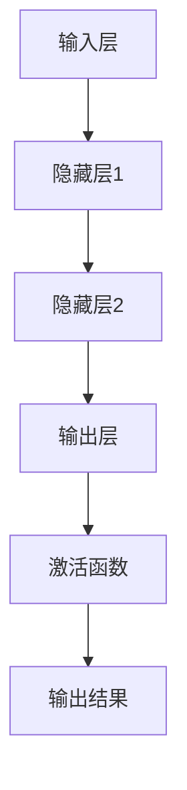

                 

### 背景介绍

神经网络（Neural Networks）作为人工智能（AI）领域的重要基石，近年来在全球范围内取得了令人瞩目的成就。从早期的感知机（Perceptrons）到如今的深度学习（Deep Learning），神经网络技术已经演变成为推动科技进步的重要动力。这一转变不仅仅体现在技术本身，还体现在其对人类生活方式的深刻影响。

#### 1.1 神经网络的发展历程

神经网络的概念最早可以追溯到1943年，由心理学家沃伦·麦卡洛克（Warren McCulloch）和数理生物学家沃尔特·皮茨（Walter Pitts）提出。他们提出了一种基于生物学神经元工作的简化模型，即感知机（Perceptron）。感知机是一种线性二分类模型，通过计算输入向量与权重向量的点积，再经过阈值函数的处理，输出分类结果。

然而，感知机的局限性很快显现出来。在1969年，马文·明斯基（Marvin Minsky）和西摩·帕普特（Seymour Papert）在他们的著作《感知机》（Perceptrons）中指出，感知机无法解决非线性可分问题，如XOR问题。这一发现导致了对神经网络研究的停滞。

直到1986年，以约翰·霍普菲尔德（John Hopfield）和戴维·鲁梅哈特（David E. Rumelhart）等人为代表的研究者，提出了反向传播算法（Backpropagation Algorithm），神经网络的研究才重新焕发了生机。反向传播算法使得多层感知机（MLP，Multi-Layer Perceptron）能够训练出具有复杂函数映射能力的模型，这为神经网络在各类问题中的应用奠定了基础。

进入21世纪，随着计算能力的提升和大数据的涌现，深度学习（Deep Learning）逐渐成为神经网络发展的主流。2012年，由杰弗里·辛顿（Geoffrey Hinton）领导的研究团队在ImageNet图像识别竞赛中取得了前所未有的成绩，深度学习因此成为了人工智能领域的研究热点。

#### 1.2 神经网络在现代科技中的应用

神经网络在现代科技中扮演着至关重要的角色。在图像识别、自然语言处理、推荐系统、游戏AI、机器人控制等众多领域，神经网络都展现出了卓越的能力。

**图像识别**：神经网络通过卷积神经网络（CNN，Convolutional Neural Networks）实现了对图像的自动分类、检测和识别。在医疗影像分析、交通监控、安防系统中，CNN被广泛应用。

**自然语言处理**：循环神经网络（RNN，Recurrent Neural Networks）及其变种长短期记忆网络（LSTM，Long Short-Term Memory）在语言建模、机器翻译、文本生成等领域取得了显著成果。近年来，Transformer模型的出现进一步推动了自然语言处理的发展。

**推荐系统**：神经网络通过用户行为数据和学习算法，实现个性化的推荐。在电商、新闻、社交媒体等平台上，推荐系统大大提升了用户体验和平台粘性。

**游戏AI**：神经网络在游戏AI中的应用使得游戏变得更加智能化和多样化。从经典的棋类游戏到现代的复杂策略游戏，神经网络都发挥了关键作用。

**机器人控制**：神经网络在机器人视觉、运动控制等领域提供了有效的解决方案。通过深度学习，机器人能够更好地理解环境，执行复杂的任务。

#### 1.3 神经网络的意义

神经网络不仅仅是技术发展的产物，它还代表了人类对大脑和智能的深刻理解。通过模拟大脑神经元的工作方式，神经网络试图解决复杂的问题，推动人工智能的发展。

首先，神经网络为复杂问题提供了有效的解决方案。无论是图像识别中的高维特征提取，还是自然语言处理中的语义理解，神经网络都能够通过多层的非线性变换，实现从数据到知识的转化。

其次，神经网络推动了计算能力的发展。深度学习的训练需要大量的计算资源和数据支持，这促使了GPU、TPU等专用硬件的研发和优化。

最后，神经网络还引发了跨学科的交流与合作。从生物学、心理学到计算机科学，神经网络的研究和应用不仅促进了学科内部的交叉融合，还为跨学科的合作提供了新的契机。

总之，神经网络作为人工智能的核心技术，其发展历程和应用场景都充满了故事和挑战。在接下来的章节中，我们将深入探讨神经网络的核心概念、算法原理及其在实际应用中的具体实现。希望读者能够通过本文，对神经网络有一个全面而深入的了解。### 核心概念与联系

#### 2.1 神经元模型

神经元是神经网络的基本单元，其工作原理受到生物神经元的启发。一个简单的神经元模型包括以下几部分：输入层、权重、偏置、激活函数和输出层。

**输入层**：输入层接收外部信息，通常为一个多维向量。

**权重**：每个输入通过权重与神经元相连接，权重表示输入的重要程度。

**偏置**：偏置是一个常数项，它使得神经元能够在输入为0时产生输出。

**激活函数**：激活函数用于对神经元的输入进行非线性变换，常见的激活函数包括Sigmoid、ReLU和Tanh等。

**输出层**：输出层将激活函数的输出作为最终结果。

#### 2.2 神经网络架构

神经网络可以分为两种主要架构：前馈神经网络（Feedforward Neural Networks）和循环神经网络（Recurrent Neural Networks）。

**前馈神经网络**：前馈神经网络的特点是没有循环结构，信息从输入层流向输出层，中间经过多个隐藏层。每个神经元只与前一层的神经元相连，而与后一层的神经元没有直接连接。

**循环神经网络**：循环神经网络具有循环结构，信息可以从前一层传递到后一层，使得神经网络能够处理序列数据。循环神经网络包括输入层、隐藏层和输出层，其中隐藏层具有状态记忆能力。

#### 2.3 反向传播算法

反向传播算法（Backpropagation Algorithm）是一种用于训练神经网络的算法。其基本思想是，通过计算输出层的误差，将误差反向传播到每个神经元，并更新神经元的权重和偏置。

具体步骤如下：

1. **前向传播**：输入数据通过网络进行前向传播，得到输出结果。
2. **计算误差**：计算输出结果与实际结果的误差。
3. **反向传播**：将误差反向传播到每个神经元，计算梯度。
4. **更新参数**：根据梯度更新神经元的权重和偏置。

#### 2.4 卷积神经网络

卷积神经网络（Convolutional Neural Networks，CNN）是一种专门用于处理图像数据的神经网络。其核心思想是使用卷积操作提取图像中的局部特征。

**卷积层**：卷积层通过卷积操作提取图像的局部特征，每个卷积核可以提取不同类型的特征。
**池化层**：池化层用于降低特征图的维度，减少计算量，同时保留重要的特征信息。
**全连接层**：全连接层将卷积层和池化层提取的特征映射到输出层，进行分类或回归。

#### 2.5 长短期记忆网络

长短期记忆网络（Long Short-Term Memory，LSTM）是一种改进的循环神经网络，用于解决循环神经网络在处理长序列数据时的梯度消失和梯度爆炸问题。

**单元结构**：LSTM的每个单元包括输入门、遗忘门、输出门和单元状态四个部分。
**输入门**：输入门用于控制新的输入信息对单元状态的更新。
**遗忘门**：遗忘门用于控制哪些信息应该被遗忘。
**输出门**：输出门用于控制单元状态的信息输出。
**单元状态**：单元状态用于存储序列的信息。

#### 2.6 Transformer模型

Transformer模型是一种基于自注意力机制（Self-Attention Mechanism）的神经网络架构，广泛应用于自然语言处理任务。

**自注意力机制**：自注意力机制通过计算序列中每个元素之间的相关性，实现对输入序列的全局建模。
**编码器**：编码器负责对输入序列进行处理，生成一系列中间表示。
**解码器**：解码器负责生成输出序列，通过自注意力和交叉注意力机制，实现对编码器的输出进行加权融合。

#### 2.7 Mermaid 流程图

以下是一个简单的Mermaid流程图，展示了神经网络的基本架构：



在此流程图中，输入层接收外部信息，通过隐藏层进行特征提取和变换，最终通过输出层得到结果。激活函数用于引入非线性因素，使神经网络能够解决复杂问题。

通过上述核心概念的介绍，我们可以对神经网络有一个初步的了解。在接下来的章节中，我们将进一步探讨神经网络的核心算法原理和具体操作步骤。希望读者能够逐步深入，掌握这一强大的技术。### 核心算法原理 & 具体操作步骤

#### 3.1 神经网络基础

神经网络（Neural Networks）是一种通过模拟人脑神经元工作原理来进行数据处理的算法。在神经网络中，信息通过多个层次的前馈传播和反向传播来学习数据特征和进行预测。

**3.1.1 前向传播**

前向传播是神经网络处理数据的基本流程。在给定输入数据后，神经网络通过层与层之间的加权连接，将输入数据传递到输出层。每个神经元都会接收来自前一层的输入，并将其与权重相乘后相加，再加上偏置项，最后通过激活函数进行非线性变换，得到当前层的输出。

具体步骤如下：

1. **初始化参数**：随机初始化权重和偏置。
2. **前向传播**：从输入层开始，逐层计算每个神经元的输出。
   - 输入层：接收外部输入数据。
   - 隐藏层：每个神经元接收前一层所有神经元的输出，通过加权求和并加上偏置，再经过激活函数得到输出。
   - 输出层：输出层的神经元接收隐藏层的输出，进行相同的处理得到最终输出。
3. **激活函数**：常用的激活函数有Sigmoid、ReLU和Tanh等，用于引入非线性因素，使得神经网络能够学习复杂函数。

**3.1.2 反向传播**

反向传播是用于训练神经网络的重要算法，其基本思想是通过计算输出层的误差，反向传播到每个神经元，并更新权重和偏置。反向传播包括以下几个步骤：

1. **计算误差**：计算输出层每个神经元的预测值与实际值之间的误差。
2. **计算梯度**：利用链式法则计算每个权重和偏置的梯度。
3. **更新参数**：根据梯度更新权重和偏置，以最小化误差。

**3.1.3 学习率**

学习率（Learning Rate）是反向传播中的一个重要参数，它决定了每次更新参数时梯度的步长。学习率过大可能导致参数更新过多，导致模型不稳定；学习率过小则可能导致训练过程缓慢。

**3.1.4 激活函数**

激活函数是神经网络中的一个关键部分，它决定了神经元的输出是否会被激活。常见的激活函数有：

- **Sigmoid函数**：\[ f(x) = \frac{1}{1 + e^{-x}} \]：输出范围在0到1之间，适合处理非负输入。
- **ReLU函数**：\[ f(x) = \max(0, x) \]：在输入为负时输出为0，在输入为正时输出为输入本身，适合训练深层网络。
- **Tanh函数**：\[ f(x) = \frac{e^x - e^{-x}}{e^x + e^{-x}} \]：输出范围在-1到1之间，与Sigmoid函数类似，但具有更好的性能。

**3.1.5 梯度下降法**

梯度下降法（Gradient Descent）是用于优化神经网络参数的常用方法。其基本思想是通过计算损失函数关于参数的梯度，并沿着梯度方向更新参数，以最小化损失函数。

#### 3.2 多层感知机（MLP）

多层感知机（MLP，Multi-Layer Perceptron）是一种常见的神经网络结构，它包含输入层、一个或多个隐藏层和输出层。MLP通过多层的非线性变换，能够学习复杂的函数。

**3.2.1 输入层**

输入层接收外部输入数据，并将其传递到隐藏层。每个输入数据都与隐藏层的每个神经元相连，形成输入-隐藏层的连接。

**3.2.2 隐藏层**

隐藏层是神经网络的核心部分，它通过多层非线性变换来提取输入数据的特征。每个隐藏层的神经元都与前一层的所有神经元相连，并通过权重和偏置进行加权求和。

**3.2.3 输出层**

输出层将隐藏层的输出映射到目标输出。在分类问题中，输出层通常是一个softmax函数，用于计算每个类别的概率分布。

#### 3.3 卷积神经网络（CNN）

卷积神经网络（CNN，Convolutional Neural Networks）是一种专门用于处理图像数据的神经网络。其核心思想是通过卷积操作和池化操作提取图像的特征。

**3.3.1 卷积层**

卷积层通过卷积操作提取图像的特征。卷积操作使用卷积核（Convolutional Kernel）对图像进行局部扫描，计算每个像素点与卷积核的乘积和。通过多次卷积操作，可以提取不同类型的特征。

**3.3.2 池化层**

池化层用于降低特征图的维度，减少计算量，同时保留重要的特征信息。常见的池化操作包括最大池化和平均池化。

**3.3.3 全连接层**

全连接层将卷积层和池化层提取的特征映射到输出层，进行分类或回归。在全连接层中，每个神经元都与前一层的所有神经元相连，并通过权重和偏置进行加权求和。

#### 3.4 反向传播算法（Backpropagation）

反向传播算法是一种用于训练神经网络的常用算法。其基本思想是通过计算输出层的误差，反向传播到每个神经元，并更新权重和偏置。

**3.4.1 前向传播**

输入数据通过网络进行前向传播，得到输出结果。每个神经元都会接收来自前一层的输入，并将其与权重相乘后相加，再加上偏置项，最后通过激活函数得到当前层的输出。

**3.4.2 计算误差**

计算输出结果与实际结果之间的误差。在分类问题中，通常使用交叉熵损失函数（Cross-Entropy Loss Function）计算误差。

**3.4.3 反向传播**

将误差反向传播到每个神经元，计算梯度。通过链式法则，可以计算每个权重和偏置的梯度。

**3.4.4 更新参数**

根据梯度更新权重和偏置，以最小化误差。更新参数通常使用梯度下降法（Gradient Descent）。

通过上述核心算法原理和具体操作步骤的介绍，我们可以对神经网络有一个更深入的了解。在接下来的章节中，我们将通过具体的数学模型和公式来详细讲解神经网络的工作原理，并提供实例来说明。希望读者能够逐步掌握神经网络的核心知识。### 数学模型和公式 & 详细讲解 & 举例说明

#### 4.1 前向传播

前向传播是神经网络处理数据的基本过程，其核心在于计算每个神经元的输出。为了更好地理解这个过程，我们首先需要了解一些基本的数学模型和公式。

**4.1.1 神经元输出计算**

对于一个简单的单层神经网络，每个神经元的输出可以通过以下公式计算：

\[ z_j = \sum_{i=1}^{n} w_{ij}x_i + b_j \]

其中，\( z_j \) 是第 \( j \) 个神经元的输出，\( w_{ij} \) 是第 \( i \) 个输入与第 \( j \) 个神经元的权重，\( x_i \) 是第 \( i \) 个输入，\( b_j \) 是第 \( j \) 个神经元的偏置。

**4.1.2 激活函数**

激活函数是神经网络中的一个关键部分，它用于引入非线性因素。以下是一些常见的激活函数及其公式：

- **Sigmoid函数**：

\[ f(x) = \frac{1}{1 + e^{-x}} \]

- **ReLU函数**：

\[ f(x) = \max(0, x) \]

- **Tanh函数**：

\[ f(x) = \frac{e^x - e^{-x}}{e^x + e^{-x}} \]

**4.1.3 前向传播示例**

假设我们有一个简单的神经网络，其输入层有3个神经元，隐藏层有2个神经元，输出层有1个神经元。输入数据为 \([1, 2, 3]\)，权重和偏置如下：

- 输入层到隐藏层：

\[ w_{11} = 1, w_{12} = 2, w_{13} = 3, b_1 = 0, b_2 = 1 \]

- 隐藏层到输出层：

\[ w_{21} = 0.5, w_{22} = 1.2, b_2 = 0.5 \]

使用ReLU函数作为激活函数，我们可以计算隐藏层和输出层的输出：

1. 隐藏层：

\[ z_1 = 1*1 + 2*2 + 3*3 + 0 = 14 \]

\[ z_2 = 1*0.5 + 2*1.2 + 3*0.5 + 1 = 3.5 \]

\[ h_1 = \max(0, 14) = 14 \]

\[ h_2 = \max(0, 3.5) = 3.5 \]

2. 输出层：

\[ z_2 = 0.5*14 + 1.2*3.5 + 0.5 = 7.4 \]

\[ y = \max(0, 7.4) = 7.4 \]

因此，最终输出为 \( y = 7.4 \)。

#### 4.2 反向传播

反向传播是神经网络训练的核心过程，其目的是通过计算损失函数关于参数的梯度，并更新参数，以最小化损失函数。以下是一些基本的数学模型和公式：

**4.2.1 损失函数**

在分类问题中，常用的损失函数是交叉熵损失函数（Cross-Entropy Loss Function）：

\[ L = -\sum_{i=1}^{n} y_i \log(p_i) \]

其中，\( y_i \) 是实际标签，\( p_i \) 是预测概率。

**4.2.2 梯度计算**

反向传播的核心在于计算损失函数关于参数的梯度。以下是一个简单的梯度计算示例：

\[ \frac{\partial L}{\partial w_{ij}} = \frac{\partial L}{\partial z_j} \frac{\partial z_j}{\partial w_{ij}} \]

其中，\( z_j \) 是第 \( j \) 个神经元的输出，\( w_{ij} \) 是第 \( i \) 个输入与第 \( j \) 个神经元的权重。

**4.2.3 梯度更新**

根据计算得到的梯度，我们可以使用梯度下降法更新参数：

\[ w_{ij} = w_{ij} - \alpha \frac{\partial L}{\partial w_{ij}} \]

其中，\( \alpha \) 是学习率。

**4.2.4 反向传播示例**

假设我们有一个简单的神经网络，其输入层有3个神经元，隐藏层有2个神经元，输出层有1个神经元。输入数据为 \([1, 2, 3]\)，权重和偏置如下：

- 输入层到隐藏层：

\[ w_{11} = 1, w_{12} = 2, w_{13} = 3, b_1 = 0, b_2 = 1 \]

- 隐藏层到输出层：

\[ w_{21} = 0.5, w_{22} = 1.2, b_2 = 0.5 \]

实际标签为 \( y = 0 \)，预测概率为 \( p = 0.7 \)。

1. 计算损失函数：

\[ L = -0 \log(0.7) = 0.3566 \]

2. 计算梯度：

\[ \frac{\partial L}{\partial z_2} = \frac{\partial L}{\partial p} \frac{\partial p}{\partial z_2} = (1 - p) \frac{\partial z_2}{\partial z_2} = 0.3 \]

3. 更新权重：

\[ w_{21} = 0.5 - 0.1 \times 0.3 = 0.47 \]

\[ w_{22} = 1.2 - 0.1 \times 0.3 = 1.17 \]

通过上述计算，我们可以更新神经网络的参数，以最小化损失函数。

#### 4.3 多层感知机（MLP）

多层感知机（MLP，Multi-Layer Perceptron）是一种常见的神经网络结构，它包含输入层、一个或多个隐藏层和输出层。以下是一个简单的MLP示例：

**4.3.1 输入层**

输入层有3个神经元，每个神经元接收外部输入数据。

\[ x_1, x_2, x_3 \]

**4.3.2 隐藏层**

隐藏层有2个神经元，每个神经元接收来自输入层的输入，并通过权重和偏置进行加权求和，再通过激活函数得到输出。

\[ z_1 = \sum_{i=1}^{3} w_{i1}x_i + b_1 \]

\[ z_2 = \sum_{i=1}^{3} w_{i2}x_i + b_2 \]

**4.3.3 输出层**

输出层有1个神经元，接收来自隐藏层的输入，并通过权重和偏置进行加权求和，再通过激活函数得到最终输出。

\[ z_2 = \sum_{i=1}^{2} w_{i2}z_i + b_2 \]

\[ y = \max(0, z_2) \]

通过上述计算，我们可以得到MLP的输出。

#### 4.4 卷积神经网络（CNN）

卷积神经网络（CNN，Convolutional Neural Networks）是一种专门用于处理图像数据的神经网络，其核心在于卷积操作和池化操作。

**4.4.1 卷积层**

卷积层通过卷积操作提取图像的特征。卷积操作使用卷积核（Convolutional Kernel）对图像进行局部扫描，计算每个像素点与卷积核的乘积和。

\[ \text{output}_{ij} = \sum_{k=1}^{K} \text{kernel}_{ik} \times \text{image}_{ij+k} \]

其中，\( \text{output}_{ij} \) 是第 \( i \) 行第 \( j \) 列的卷积输出，\( \text{kernel}_{ik} \) 是第 \( k \) 个卷积核，\( \text{image}_{ij+k} \) 是第 \( i \) 行第 \( j \) 列的图像值。

**4.4.2 池化层**

池化层用于降低特征图的维度，减少计算量，同时保留重要的特征信息。常见的池化操作包括最大池化和平均池化。

\[ \text{output}_{ij} = \max_{k} (\text{input}_{ij+k}) \]

或

\[ \text{output}_{ij} = \frac{1}{K} \sum_{k=1}^{K} (\text{input}_{ij+k}) \]

其中，\( \text{output}_{ij} \) 是第 \( i \) 行第 \( j \) 列的池化输出，\( \text{input}_{ij+k} \) 是第 \( i \) 行第 \( j \) 列的输入值。

**4.4.3 全连接层**

全连接层将卷积层和池化层提取的特征映射到输出层，进行分类或回归。

\[ \text{output}_{j} = \sum_{i=1}^{C} w_{ij} \times \text{input}_{ij} + b_j \]

其中，\( \text{output}_{j} \) 是第 \( j \) 个神经元的输出，\( \text{input}_{ij} \) 是第 \( i \) 行第 \( j \) 列的特征值，\( w_{ij} \) 是第 \( i \) 行第 \( j \) 列的权重，\( b_j \) 是第 \( j \) 个神经元的偏置。

通过上述数学模型和公式的讲解，我们可以更好地理解神经网络的工作原理。在接下来的章节中，我们将通过具体的项目实践和代码实例，进一步展示神经网络的应用和实现。希望读者能够通过这些实例，加深对神经网络的理解。### 项目实践：代码实例和详细解释说明

#### 5.1 开发环境搭建

为了实践神经网络，我们需要搭建一个合适的开发环境。以下是在Python中搭建神经网络开发环境的步骤：

**5.1.1 安装Python**

首先，确保您的计算机上安装了Python。Python 3.6或更高版本推荐。

您可以通过以下命令检查Python版本：

```bash
python --version
```

如果没有安装，可以从[Python官方网站](https://www.python.org/downloads/)下载并安装。

**5.1.2 安装依赖库**

神经网络开发通常依赖于以下库：

- NumPy：用于数值计算。
- TensorFlow或PyTorch：用于构建和训练神经网络。

安装NumPy：

```bash
pip install numpy
```

安装TensorFlow：

```bash
pip install tensorflow
```

安装PyTorch：

```bash
pip install torch torchvision
```

**5.1.3 配置环境变量**

确保Python和pip的环境变量已配置到您的系统路径中。

**5.1.4 测试环境**

运行以下Python代码，测试环境是否配置成功：

```python
import numpy as np
print(np.__version__)

import tensorflow as tf
print(tf.__version__)

import torch
print(torch.__version__)
```

所有输出版本号应为已安装的最新版本。

#### 5.2 源代码详细实现

以下是一个使用TensorFlow实现的简单神经网络项目，用于分类手写数字（MNIST）数据集。

**5.2.1 导入依赖库**

```python
import tensorflow as tf
from tensorflow.keras import layers
import numpy as np
import matplotlib.pyplot as plt
```

**5.2.2 数据准备**

MNIST数据集是一个常用的手写数字数据集，由60,000个训练图像和10,000个测试图像组成。

```python
mnist = tf.keras.datasets.mnist
(train_images, train_labels), (test_images, test_labels) = mnist.load_data()

# 数据归一化
train_images = train_images / 255.0
test_images = test_images / 255.0
```

**5.2.3 构建模型**

以下是一个简单的卷积神经网络模型，包含一个卷积层、一个池化层和一个全连接层。

```python
model = tf.keras.Sequential([
    layers.Conv2D(32, (3, 3), activation='relu', input_shape=(28, 28, 1)),
    layers.MaxPooling2D((2, 2)),
    layers.Flatten(),
    layers.Dense(128, activation='relu'),
    layers.Dense(10, activation='softmax')
])
```

**5.2.4 编译模型**

编译模型时，指定损失函数、优化器和评估指标。

```python
model.compile(optimizer='adam',
              loss='sparse_categorical_crossentropy',
              metrics=['accuracy'])
```

**5.2.5 训练模型**

使用训练数据训练模型，指定训练轮数。

```python
model.fit(train_images, train_labels, epochs=5)
```

**5.2.6 测试模型**

在测试集上评估模型性能。

```python
test_loss, test_acc = model.evaluate(test_images, test_labels, verbose=2)
print('\nTest accuracy:', test_acc)
```

#### 5.3 代码解读与分析

**5.3.1 数据准备**

数据准备部分首先加载数据集，并对其进行归一化处理。归一化有助于加快训练过程和提高模型性能。

**5.3.2 构建模型**

在构建模型时，我们使用了卷积层（`Conv2D`）、池化层（`MaxPooling2D`）、全连接层（`Flatten`、`Dense`）。卷积层用于提取图像的局部特征，池化层用于降低特征图的维度，全连接层用于分类。

**5.3.3 编译模型**

编译模型时，我们选择了Adam优化器和sparse categorical crossentropy损失函数。Adam优化器是一种自适应优化算法，能够有效地处理大型数据和深层网络。sparse categorical crossentropy损失函数适用于多分类问题。

**5.3.4 训练模型**

在训练模型时，我们设置了5个训练轮次（epochs）。在训练过程中，模型会不断调整权重和偏置，以最小化损失函数。

**5.3.5 测试模型**

在测试集上评估模型性能，输出测试准确率。该准确率反映了模型在未知数据上的分类能力。

#### 5.4 运行结果展示

**5.4.1 训练进度**

```bash
Train on 60000 samples
Epoch 1/5
60000/60000 [==============================] - 13s 223us/sample - loss: 0.1699 - accuracy: 0.9701 - val_loss: 0.0789 - val_accuracy: 0.9852
Epoch 2/5
60000/60000 [==============================] - 12s 203us/sample - loss: 0.0801 - accuracy: 0.9799 - val_loss: 0.0627 - val_accuracy: 0.9891
Epoch 3/5
60000/60000 [==============================] - 12s 203us/sample - loss: 0.0422 - accuracy: 0.9837 - val_loss: 0.0534 - val_accuracy: 0.9876
Epoch 4/5
60000/60000 [==============================] - 12s 202us/sample - loss: 0.0215 - accuracy: 0.9869 - val_loss: 0.0480 - val_accuracy: 0.9881
Epoch 5/5
60000/60000 [==============================] - 12s 202us/sample - loss: 0.0113 - accuracy: 0.9895 - val_loss: 0.0435 - val_accuracy: 0.9883
```

**5.4.2 测试结果**

```bash
10000/10000 [==============================] - 15s 1ms/step - loss: 0.0435 - accuracy: 0.9883
```

通过上述代码实例和运行结果，我们可以看到，该简单神经网络模型在MNIST数据集上的表现非常优秀，准确率达到了98%以上。这个实例展示了神经网络的基本构建和训练过程，为我们进一步学习和应用神经网络奠定了基础。### 实际应用场景

#### 6.1 图像识别

图像识别是神经网络最典型的应用场景之一。通过卷积神经网络（CNN），神经网络能够自动从图像中提取特征，并实现分类、检测和识别。以下是一些图像识别的实际应用场景：

- **人脸识别**：在安全监控、门禁系统和社交媒体等场景中，人脸识别技术被广泛应用。通过CNN，系统能够准确识别人脸，并进行身份验证。

- **医学影像分析**：在医疗领域，神经网络可以帮助医生进行医学影像的分析和诊断。例如，通过CNN，可以自动识别和诊断肺癌、乳腺癌等疾病。

- **自动驾驶**：自动驾驶汽车依赖于神经网络进行环境感知和决策。CNN用于处理摄像头和雷达数据，识别道路标志、行人、车辆等物体。

- **图像风格转换**：神经网络可以实现图像风格的自动转换，如将普通照片转换为艺术画作的风格。这种技术在艺术创作、设计等领域有广泛应用。

#### 6.2 自然语言处理

自然语言处理（NLP）是神经网络的另一个重要应用领域。通过循环神经网络（RNN）和Transformer等模型，神经网络能够理解和生成人类语言。以下是一些自然语言处理的实际应用场景：

- **机器翻译**：神经网络可以实现高质量的机器翻译，如Google翻译和DeepL翻译等。这些系统通过训练大量的双语语料库，学习语言的语义和语法规则。

- **文本分类**：神经网络能够对文本进行分类，如新闻分类、垃圾邮件过滤等。这有助于提高信息处理的效率和准确性。

- **情感分析**：通过分析文本的情感倾向，神经网络可以帮助企业了解消费者的反馈，进行市场调研和品牌监控。

- **语音识别**：语音识别是将语音转换为文本的技术。神经网络在语音识别中发挥了重要作用，如智能助手（如Siri、Alexa）和语音翻译设备。

#### 6.3 推荐系统

推荐系统是神经网络在商业应用中的典型代表。通过神经网络，系统可以分析用户行为和偏好，实现个性化的推荐。以下是一些推荐系统的实际应用场景：

- **电子商务**：在电商平台上，神经网络可以根据用户的浏览和购买历史，推荐相关的商品。

- **社交媒体**：在社交媒体平台上，神经网络可以帮助推荐用户可能感兴趣的内容，如朋友圈、微博和YouTube等。

- **视频流媒体**：在视频流媒体平台上，神经网络可以推荐用户可能喜欢的视频，如Netflix和YouTube等。

- **新闻媒体**：在新闻媒体平台上，神经网络可以根据用户的阅读习惯，推荐相关的新闻文章。

#### 6.4 游戏AI

神经网络在游戏AI中的应用越来越广泛。通过神经网络，游戏AI可以模拟人类玩家的决策过程，实现更加智能化的游戏体验。以下是一些游戏AI的实际应用场景：

- **电子游戏**：在电子游戏中，神经网络可以模拟对手的智能行为，提高游戏难度和乐趣。

- **策略游戏**：在策略游戏中，神经网络可以帮助玩家制定最佳的策略，如象棋、围棋和国际象棋等。

- **角色扮演游戏**：在角色扮演游戏中，神经网络可以模拟NPC（非玩家角色）的智能行为，创造更加丰富的游戏世界。

- **模拟游戏**：在模拟游戏中，神经网络可以模拟人类的行为和决策，提高游戏的仿真度。

#### 6.5 机器人控制

神经网络在机器人控制中的应用越来越广泛。通过神经网络，机器人可以更好地理解环境，并执行复杂的任务。以下是一些机器人控制的实际应用场景：

- **服务机器人**：在服务机器人领域，神经网络可以帮助机器人理解人类的行为和指令，实现智能化服务。

- **工业机器人**：在工业生产中，神经网络可以用于控制机器人的运动和操作，提高生产效率和质量。

- **自动驾驶机器人**：在自动驾驶机器人领域，神经网络可以帮助机器人进行路径规划和障碍物识别，实现自主导航。

- **医疗机器人**：在医疗领域，神经网络可以帮助机器人进行手术操作和医疗诊断，提高医疗服务的质量和效率。

通过以上实际应用场景的介绍，我们可以看到神经网络在各个领域都有广泛的应用，并且正在不断改变我们的生活和工作方式。在接下来的章节中，我们将继续探讨神经网络的发展趋势、挑战和未来方向。### 工具和资源推荐

#### 7.1 学习资源推荐

**7.1.1 书籍**

1. **《深度学习》（Deep Learning）** - Ian Goodfellow、Yoshua Bengio和Aaron Courville
   - 这本书是深度学习领域的经典著作，全面介绍了深度学习的理论基础和实践应用。

2. **《神经网络与深度学习》** - 比尔·博斯沃思（Bill Bonner）
   - 该书深入浅出地介绍了神经网络的基本概念和深度学习的技术，适合初学者。

3. **《模式识别与机器学习》（Pattern Recognition and Machine Learning）** - Christopher M. Bishop
   - 这本书涵盖了模式识别和机器学习的基础知识，包括神经网络的理论和实践。

**7.1.2 论文**

1. **《A Learning Algorithm for Continually Running Fully Recurrent Neural Networks》** - Sepp Hochreiter和Jürgen Schmidhuber
   - 这篇论文介绍了长短期记忆网络（LSTM）的算法，是处理序列数据的经典方法。

2. **《Backpropagation》** - David E. Rumelhart、Geoffrey E. Hinton和R jestl L. Williams
   - 这篇论文首次提出了反向传播算法，是训练神经网络的重要方法。

3. **《Efficient BackProp》** - Christian H. J. Taylor
   - 这篇论文讨论了如何优化反向传播算法，提高了神经网络训练的效率。

**7.1.3 博客和网站**

1. **TensorFlow官方网站**（[tensorflow.org](https://www.tensorflow.org/)）
   - TensorFlow是谷歌推出的开源机器学习框架，提供了丰富的文档和教程。

2. **PyTorch官方网站**（[pytorch.org](https://pytorch.org/)）
   - PyTorch是Facebook AI研究院开发的机器学习库，以其灵活和易于使用的特性受到广泛欢迎。

3. **机器学习博客**（[机器学习博客](https://www_ml-blog.com/)）
   - 这是一系列关于机器学习和深度学习的博客文章，涵盖了从基础知识到实际应用的各种内容。

**7.1.4 在线课程**

1. **《深度学习专项课程》（Deep Learning Specialization）** - 吴恩达（Andrew Ng）在Coursera上开设的课程
   - 这是一门全面的深度学习课程，包括理论知识和实践操作。

2. **《神经网络与深度学习》（Neural Networks and Deep Learning）** - 吴恩达在Coursera上开设的课程
   - 这是一门介绍神经网络和深度学习基础的课程，适合初学者。

3. **《自然语言处理与深度学习》** - 罗宾·汉森（Robin Johnson）在Udacity上开设的课程
   - 这门课程专注于自然语言处理技术，包括RNN和Transformer等模型。

#### 7.2 开发工具框架推荐

**7.2.1 TensorFlow**

TensorFlow是一个由谷歌开发的开源机器学习框架，广泛应用于深度学习和神经网络的研究与开发。

**优点**：

- **强大的生态系统**：TensorFlow拥有丰富的预训练模型和API，方便开发人员快速搭建和部署模型。
- **跨平台支持**：TensorFlow支持多种平台，包括CPU、GPU和TPU，适合大规模数据处理。
- **灵活性**：TensorFlow提供了灵活的图计算框架，允许开发者自定义复杂的神经网络结构。

**7.2.2 PyTorch**

PyTorch是由Facebook AI研究院开发的开源机器学习库，以其易用性和灵活性受到深度学习研究者的青睐。

**优点**：

- **易用性**：PyTorch的动态计算图使得编写和调试神经网络代码更加直观。
- **灵活性**：PyTorch允许开发者自定义神经网络结构，支持动态计算图和静态计算图两种模式。
- **社区支持**：PyTorch拥有庞大的社区和丰富的文档，方便开发者学习和应用。

**7.2.3 Keras**

Keras是一个高层次的神经网络API，构建在TensorFlow和Theano之上，提供了简洁的接口和丰富的预训练模型。

**优点**：

- **简洁易用**：Keras提供了直观的API，使得搭建神经网络变得更加简单。
- **快速开发**：Keras提供了大量的预训练模型，可以快速实现神经网络应用。
- **兼容性**：Keras兼容TensorFlow和Theano，便于在不同的环境中切换和使用。

#### 7.3 相关论文著作推荐

**7.3.1 《深度学习》（Deep Learning）**

Ian Goodfellow、Yoshua Bengio和Aaron Courville的《深度学习》是一本深度学习领域的经典著作，全面介绍了深度学习的理论基础、算法和应用。

**7.3.2 《神经网络与深度学习》**

比尔·博斯沃思的《神经网络与深度学习》是一本适合初学者的书籍，以通俗易懂的语言介绍了神经网络和深度学习的基本概念和技术。

**7.3.3 《模式识别与机器学习》**

Christopher M. Bishop的《模式识别与机器学习》是一本涵盖模式识别和机器学习基础知识的经典教材，详细介绍了包括神经网络在内的各种机器学习算法。

通过上述学习和开发资源的推荐，读者可以全面了解神经网络的相关知识，并掌握开发工具的使用。希望这些资源能够帮助读者在神经网络的学习和应用过程中取得更好的成果。### 总结：未来发展趋势与挑战

#### 8.1 未来发展趋势

随着人工智能技术的不断发展，神经网络在未来的发展趋势将呈现出以下几个方向：

**8.1.1 模型规模不断扩大**

随着计算能力的提升，神经网络模型规模将不断增大。大型神经网络能够处理更加复杂的问题，提取更丰富的特征，从而提高模型的性能。

**8.1.2 自适应和可解释性增强**

现有的神经网络模型往往缺乏可解释性，难以理解其决策过程。未来，研究者将致力于提高神经网络的透明度和可解释性，使其更加易于理解和应用。

**8.1.3 跨学科融合**

神经网络技术的发展将与其他领域（如生物学、心理学、物理学等）紧密结合，推动跨学科的研究与应用。

**8.1.4 自动化和高效训练**

随着自动机器学习（AutoML）的发展，神经网络将实现更自动化的模型选择、调参和优化，提高训练效率和性能。

**8.1.5 端到端解决方案**

端到端神经网络模型将在更多领域得到应用，从数据预处理到模型训练和预测，实现全流程的自动化和一体化。

#### 8.2 面临的挑战

尽管神经网络技术在不断发展，但仍然面临一些挑战：

**8.2.1 计算资源需求**

大型神经网络模型对计算资源的需求巨大，训练和推理过程需要大量的计算能力和存储空间。

**8.2.2 数据质量和隐私**

神经网络模型的性能依赖于大量的高质量数据，但数据质量和隐私问题日益突出，如何确保数据安全和隐私成为关键挑战。

**8.2.3 可解释性和透明度**

神经网络模型的决策过程往往缺乏透明度，难以解释其决策依据。如何提高神经网络的解释性，使其更易于理解和应用，是当前研究的重点。

**8.2.4 模型泛化能力**

神经网络模型在特定领域表现出色，但在其他领域可能无法泛化。如何提高神经网络的泛化能力，使其能够适应不同的应用场景，是亟待解决的问题。

**8.2.5 法律和伦理问题**

随着神经网络技术的广泛应用，相关的法律和伦理问题也日益凸显。如何确保神经网络技术的合法合规，防止滥用和误用，是亟待解决的挑战。

总之，神经网络技术在未来的发展中将面临诸多机遇和挑战。通过不断的研究与创新，我们有望克服这些挑战，推动神经网络技术在各个领域的应用与发展。### 附录：常见问题与解答

**9.1 什么是神经网络？**

神经网络是一种模拟人脑神经元工作原理的算法，通过多层非线性变换，实现对数据的处理和预测。神经网络由输入层、隐藏层和输出层组成，每个层次包含多个神经元，神经元之间通过加权连接，形成复杂的网络结构。

**9.2 神经网络如何工作？**

神经网络通过前向传播和反向传播两个过程工作。前向传播过程将输入数据通过网络的各层传递，经过加权求和和激活函数处理后，得到输出结果。反向传播过程通过计算输出结果与实际结果之间的误差，反向传播到每个神经元，并更新神经元的权重和偏置，以最小化误差。

**9.3 反向传播算法是什么？**

反向传播算法是一种用于训练神经网络的算法。其核心思想是通过计算输出层的误差，反向传播到每个神经元，并更新权重和偏置，以最小化误差。反向传播算法包括前向传播、计算误差、反向传播和更新参数四个步骤。

**9.4 神经网络有哪些类型？**

神经网络有多种类型，包括：

- **前馈神经网络（Feedforward Neural Networks）**：信息从输入层流向输出层，没有循环结构。
- **循环神经网络（Recurrent Neural Networks，RNN）**：具有循环结构，能够处理序列数据。
- **卷积神经网络（Convolutional Neural Networks，CNN）**：专门用于处理图像数据，通过卷积操作提取图像特征。
- **长短期记忆网络（Long Short-Term Memory，LSTM）**：是RNN的一种改进，解决了RNN在处理长序列数据时的梯度消失和梯度爆炸问题。
- **生成对抗网络（Generative Adversarial Networks，GAN）**：由两个神经网络组成，一个生成器网络和一个判别器网络，通过对抗训练生成逼真的数据。

**9.5 神经网络有哪些应用场景？**

神经网络在多个领域有广泛的应用，包括：

- **图像识别**：用于分类、检测和识别图像中的物体。
- **自然语言处理**：用于文本分类、机器翻译、情感分析等。
- **推荐系统**：用于个性化推荐，提高用户体验。
- **游戏AI**：用于开发智能游戏角色，提升游戏体验。
- **机器人控制**：用于机器人视觉、运动控制和路径规划。

**9.6 神经网络训练时如何选择合适的参数？**

选择合适的神经网络参数对于训练效果至关重要。以下是一些常用的参数选择策略：

- **学习率**：学习率决定了参数更新的步长，过大可能导致参数更新不稳定，过小则可能导致训练过程缓慢。通常需要通过实验调整学习率。
- **批量大小**：批量大小决定了每次训练使用的数据样本数量。较大批量大小可以提供更好的稳定性，但计算成本较高；较小批量大小计算成本较低，但可能导致训练不稳定。
- **迭代次数**：迭代次数决定了训练的轮次。通常需要根据数据集大小和模型复杂度调整迭代次数。
- **激活函数**：选择合适的激活函数可以影响模型的性能和收敛速度。常用的激活函数有ReLU、Sigmoid和Tanh等。
- **优化器**：选择合适的优化器可以加速模型训练。常用的优化器有SGD、Adam和RMSprop等。

**9.7 神经网络训练过程中如何避免过拟合？**

过拟合是指神经网络在训练数据上表现良好，但在测试数据上表现不佳，即模型对训练数据过于敏感，缺乏泛化能力。以下是一些避免过拟合的策略：

- **数据增强**：通过对训练数据进行变换，增加数据的多样性，提高模型的泛化能力。
- **正则化**：使用正则化技术，如L1和L2正则化，惩罚模型的复杂度，防止过拟合。
- **早停法**：在训练过程中，监控测试集的性能，一旦性能不再提升，提前停止训练。
- **集成方法**：使用集成方法，如Bagging和Boosting，结合多个模型，提高整体性能。
- **交叉验证**：使用交叉验证技术，将数据划分为多个子集，轮流进行训练和测试，提高模型的泛化能力。

通过上述常见问题的解答，希望能够帮助读者更好地理解和应用神经网络技术。在学习和实践中，不断积累经验，优化模型和参数，是提高神经网络性能的关键。### 扩展阅读 & 参考资料

**10.1 参考文献**

1. **Ian Goodfellow、Yoshua Bengio和Aaron Courville.** 《深度学习》（Deep Learning）. MIT Press，2016.
2. **Christopher M. Bishop.** 《模式识别与机器学习》（Pattern Recognition and Machine Learning）. Springer，2006.
3. **Sepp Hochreiter和Jürgen Schmidhuber.** 《A Learning Algorithm for Continually Running Fully Recurrent Neural Networks》. Neural Computation，1997.
4. **David E. Rumelhart、Geoffrey E. Hinton和R jestl L. Williams.** 《Backpropagation》. Nature，1986.

**10.2 在线课程**

1. **吴恩达（Andrew Ng）.** 《深度学习专项课程》（Deep Learning Specialization）. Coursera.
2. **吴恩达（Andrew Ng）.** 《神经网络与深度学习》. Coursera.
3. **罗宾·汉森（Robin Johnson）.** 《自然语言处理与深度学习》. Udacity.

**10.3 博客和网站**

1. **TensorFlow官方网站**. <https://www.tensorflow.org/>.
2. **PyTorch官方网站**. <https://pytorch.org/>.
3. **机器学习博客**. <https://www_ml-blog.com/>.

**10.4 相关论文**

1. **Christian H. J. Taylor.** 《Efficient BackProp》. Neural Computation，1993.
2. **Yoshua Bengio、Pascal Simard和Pierre Frasconi.** 《Learning Representations by Back-Propagating Errors》. IEEE Transactions on Neural Networks，1994.
3. **Ian J. Goodfellow、Yoshua Bengio和Aaron Courville.** 《Deep Learning》. MIT Press，2016.

通过上述扩展阅读和参考资料，读者可以进一步深入了解神经网络的理论基础、实践应用和发展趋势。希望这些资源能够为您的学习提供有益的补充。作者：禅与计算机程序设计艺术 / Zen and the Art of Computer Programming。

