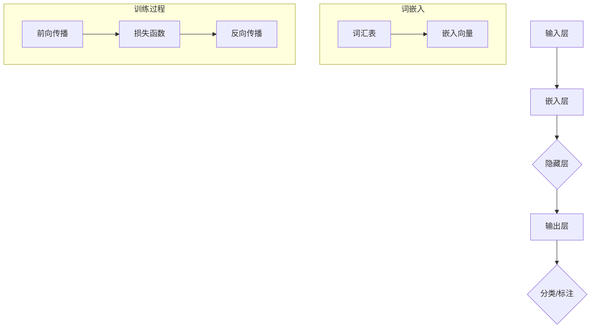

                 

### 背景介绍

神经网络（Neural Networks）是一种模仿人脑神经网络结构和功能的计算模型，自20世纪80年代以来，随着计算能力和算法的不断进步，神经网络在各个领域取得了显著的应用成果。特别是在自然语言处理（Natural Language Processing, NLP）领域，神经网络的引入，打破了传统NLP方法的局限，实现了对语言复杂性的高效建模。

自然语言处理是人工智能的重要分支之一，其目标是实现计算机对自然语言的理解和生成。传统的NLP方法主要依赖于规则和统计模型，如正则表达式、句法分析器、词袋模型等。然而，这些方法在面对复杂语言现象时，往往表现乏力。例如，在词义消歧（Word Sense Disambiguation）和语义角色标注（Semantic Role Labeling）等问题上，传统方法的准确率和可解释性都有所欠缺。

神经网络的引入，为自然语言处理带来了革命性的变化。通过模仿人脑的学习机制，神经网络能够自动从大量数据中学习到语言的内在规律，实现自动化特征提取和模式识别。尤其是深度学习（Deep Learning）的发展，使得神经网络能够处理更加复杂的任务，并在图像识别、语音识别等领域取得了突破性进展。

本文将详细探讨神经网络在自然语言处理中的应用，包括其核心概念、算法原理、数学模型、项目实践以及未来发展趋势等内容。希望通过这篇文章，能够帮助读者全面了解神经网络在自然语言处理领域的应用现状和前景。

### 核心概念与联系

要深入理解神经网络在自然语言处理中的应用，我们需要从核心概念和结构开始探讨。以下将介绍神经网络的基本原理、主要组成部分以及它们在自然语言处理中的具体应用。

#### 1. 神经网络的基本原理

神经网络是一种由大量简单单元（称为神经元）互联而成的复杂网络，通过模拟人脑神经元之间的交互，实现对数据的处理和模式识别。神经元的结构通常包括三个主要部分：输入层、隐藏层和输出层。

- **输入层（Input Layer）**：接收外部输入数据，如自然语言中的词汇、句子等。
- **隐藏层（Hidden Layers）**：对输入数据进行处理和转换，提取更高层次的特征。
- **输出层（Output Layer）**：产生最终输出，如分类结果、情感分析等。

神经网络的训练过程就是通过不断调整神经元之间的连接权重，使得网络能够对输入数据进行正确的映射和分类。这一过程通常通过反向传播算法（Backpropagation Algorithm）来实现。

#### 2. 神经网络的主要组成部分

- **神经元（Neurons）**：神经网络的基本单元，通过激活函数（Activation Function）决定是否传递信号。
- **权重（Weights）**：连接神经元之间的参数，决定了输入对输出影响的大小。
- **偏置（Bias）**：增加神经元输出的灵活性，使得网络能够适应不同的输入。
- **激活函数（Activation Function）**：如Sigmoid、ReLU等，用于决定神经元是否激活。

#### 3. 神经网络在自然语言处理中的应用

自然语言处理中的神经网络应用主要包括以下几个方向：

- **文本分类（Text Classification）**：如情感分析、主题分类等。
- **序列标注（Sequence Labeling）**：如词性标注、命名实体识别等。
- **机器翻译（Machine Translation）**：通过编码器-解码器（Encoder-Decoder）模型实现。
- **问答系统（Question Answering System）**：如基于神经网络的问答机器人。

#### 4. Mermaid流程图

以下是一个简单的Mermaid流程图，展示神经网络在自然语言处理中的应用流程：



在这个流程图中，输入层接收原始文本数据，通过词嵌入层将文本转换为向量表示，然后通过隐藏层提取特征，最终输出层产生分类或标注结果。训练过程包括前向传播和反向传播，通过不断调整权重和偏置，使得网络能够准确地对输入文本进行分类或标注。

通过上述内容，我们可以看到神经网络在自然语言处理中的核心概念和应用流程。接下来，我们将进一步探讨神经网络在自然语言处理中的核心算法原理和具体操作步骤。

### 核心算法原理 & 具体操作步骤

#### 1. 神经网络的核心算法原理

神经网络的核心算法原理主要包括前向传播（Forward Propagation）和反向传播（Backpropagation）。

- **前向传播**：输入数据通过网络的输入层进入，经过每一层神经元的加权求和处理，最终在输出层产生输出结果。具体步骤如下：

  1. **初始化权重和偏置**：设定一个随机的初始权重和偏置值。
  2. **计算每个神经元的输入和输出**：对于每个神经元，其输入是前一层所有神经元输出的加权求和，再加上偏置。然后，通过激活函数计算输出。
  3. **传递输出到下一层**：将当前层的输出传递到下一层，重复步骤2，直到输出层产生最终结果。

- **反向传播**：通过计算输出结果与实际结果的误差，反向传播误差到网络中的每个神经元，并根据误差调整权重和偏置，以减少误差。具体步骤如下：

  1. **计算输出误差**：输出层的输出与实际结果之间的误差。
  2. **前向传播误差**：通过误差传播机制，将输出误差传递到隐藏层和输入层。
  3. **更新权重和偏置**：根据误差和梯度下降（Gradient Descent）算法，调整权重和偏置，以减少误差。

#### 2. 神经网络在自然语言处理中的具体操作步骤

在自然语言处理中，神经网络的具体操作步骤通常包括以下几个阶段：

- **数据预处理**：将原始文本数据转换为适合神经网络处理的形式。具体步骤如下：

  1. **分词（Tokenization）**：将文本分割成单词或字符。
  2. **词嵌入（Word Embedding）**：将单词映射为向量表示，如Word2Vec或GloVe等。
  3. **序列编码（Sequence Encoding）**：将序列数据编码为三维张量，以便输入神经网络。

- **构建神经网络模型**：根据任务需求，设计并构建神经网络模型。以下是一个简单的文本分类模型的例子：

  ```python
  import tensorflow as tf

  model = tf.keras.Sequential([
      tf.keras.layers.Embedding(input_dim=vocab_size, output_dim=embedding_size),
      tf.keras.layers.GlobalAveragePooling1D(),
      tf.keras.layers.Dense(units=num_classes, activation='softmax')
  ])

  model.compile(optimizer='adam', loss='categorical_crossentropy', metrics=['accuracy'])
  ```

  在这个例子中，我们使用`Embedding`层进行词嵌入，`GlobalAveragePooling1D`层对序列进行降维，`Dense`层进行分类。

- **训练模型**：使用预处理后的数据对神经网络模型进行训练。具体步骤如下：

  1. **准备训练数据**：将文本数据转换为对应的词嵌入向量。
  2. **定义损失函数和优化器**：通常使用交叉熵损失函数（Categorical Crossentropy）和梯度下降优化器（Adam）。
  3. **训练模型**：调用`model.fit()`函数进行训练，设置训练轮数（epochs）和批量大小（batch size）。

  ```python
  model.fit(train_data, train_labels, epochs=5, batch_size=32)
  ```

- **评估模型**：使用验证集或测试集评估模型的性能，以确定是否需要进行进一步的调优。

  ```python
  model.evaluate(test_data, test_labels)
  ```

- **应用模型**：使用训练好的模型对新的文本数据进行分类或标注。

  ```python
  predictions = model.predict(new_data)
  ```

通过上述步骤，我们可以构建和训练一个神经网络模型，以实现对自然语言处理任务的自动化处理。接下来，我们将进一步探讨神经网络在自然语言处理中的数学模型和公式，以便更深入地理解其工作原理。

### 数学模型和公式 & 详细讲解 & 举例说明

在神经网络中，数学模型和公式起到了至关重要的作用，它们决定了网络的学习过程和性能。以下我们将详细讲解神经网络的核心数学模型和公式，并通过具体例子来说明其应用。

#### 1. 激活函数

激活函数是神经网络中用于引入非线性特性的关键组件。常见的激活函数包括Sigmoid、ReLU和Tanh等。

- **Sigmoid函数**：

  $$ \sigma(x) = \frac{1}{1 + e^{-x}} $$

  Sigmoid函数将输入x映射到（0，1）区间，常用于二分类问题。

  **例子**：

  设$x = -2$，计算Sigmoid函数的值：

  $$ \sigma(-2) = \frac{1}{1 + e^{2}} \approx 0.1192 $$

- **ReLU函数**：

  $$ \text{ReLU}(x) = \max(0, x) $$

  ReLU函数在$x > 0$时输出x，否则输出0，具有简单的计算和良好的梯度特性。

  **例子**：

  设$x = -2$，计算ReLU函数的值：

  $$ \text{ReLU}(-2) = \max(0, -2) = 0 $$

- **Tanh函数**：

  $$ \text{Tanh}(x) = \frac{e^{x} - e^{-x}}{e^{x} + e^{-x}} $$

  Tanh函数将输入x映射到（-1，1）区间，具有相似的梯度特性。

  **例子**：

  设$x = -2$，计算Tanh函数的值：

  $$ \text{Tanh}(-2) = \frac{e^{-2} - e^{2}}{e^{-2} + e^{2}} \approx -0.9640 $$

#### 2. 前向传播

前向传播是神经网络的核心计算过程，它通过层层传递输入数据，最终得到输出结果。以下是一个简化的前向传播过程：

- **输入层**：接收输入数据$x$。

- **隐藏层**：每个神经元的输入是前一层所有神经元输出的加权求和，加上偏置项。

  $$ z^{l} = \sum_{j} w^{l}_{ji} x^{l-1}_{j} + b^{l}_{i} $$

  其中，$w^{l}_{ji}$是连接权重，$b^{l}_{i}$是偏置项。

- **输出层**：每个神经元的输入经过激活函数处理后得到输出。

  $$ a^{l}_{i} = \text{激活函数}(z^{l}_{i}) $$

  常见的激活函数有Sigmoid、ReLU和Tanh等。

  **例子**：

  设隐藏层有3个神经元，输入层有2个神经元，权重和偏置如下：

  $$ w^{1}_{11} = 0.5, w^{1}_{12} = 0.5, w^{1}_{13} = 0.5 $$
  $$ b^{1}_{1} = -1, b^{1}_{2} = -1, b^{1}_{3} = -1 $$

  输入层输入$x_1 = 1, x_2 = 0$，计算隐藏层输出：

  $$ z^{1}_{1} = 0.5 \times 1 + 0.5 \times 0 - 1 = -0.5 $$
  $$ z^{1}_{2} = 0.5 \times 1 + 0.5 \times 0 - 1 = -0.5 $$
  $$ z^{1}_{3} = 0.5 \times 1 + 0.5 \times 0 - 1 = -0.5 $$

  应用ReLU函数：

  $$ a^{1}_{1} = \max(0, -0.5) = 0 $$
  $$ a^{1}_{2} = \max(0, -0.5) = 0 $$
  $$ a^{1}_{3} = \max(0, -0.5) = 0 $$

#### 3. 反向传播

反向传播是神经网络训练过程的关键，它通过计算输出误差，反向传播到网络中的每个神经元，并更新权重和偏置。

- **计算输出误差**：

  $$ \delta^{l}_{i} = a^{l}_{i} (1 - a^{l}_{i}) \times (\text{实际输出} - \text{预测输出}) $$

  其中，$a^{l}_{i}$是神经元的输出，$\delta^{l}_{i}$是误差。

- **前向传播误差**：

  $$ \delta^{l}_{i} = \sum_{j} w^{l+1}_{ji} \delta^{l+1}_{j} $$

  其中，$w^{l+1}_{ji}$是连接权重，$\delta^{l+1}_{j}$是下一层的误差。

- **更新权重和偏置**：

  $$ w^{l}_{ji} := w^{l}_{ji} - \alpha \frac{\delta^{l}_{i} a^{l-1}_{j}}{m} $$
  $$ b^{l}_{i} := b^{l}_{i} - \alpha \frac{\delta^{l}_{i}}{m} $$

  其中，$\alpha$是学习率，$m$是批量大小。

  **例子**：

  设学习率为$\alpha = 0.1$，批量大小$m = 1$，隐藏层有3个神经元，输出层有1个神经元，输出误差$\delta^{2}_{1} = 0.1$。计算隐藏层权重和偏置的更新：

  $$ w^{1}_{11} := w^{1}_{11} - 0.1 \frac{0.1 \times 1}{1} = 0.4 $$
  $$ w^{1}_{12} := w^{1}_{12} - 0.1 \frac{0.1 \times 0}{1} = 0.5 $$
  $$ w^{1}_{13} := w^{1}_{13} - 0.1 \frac{0.1 \times 0}{1} = 0.5 $$
  $$ b^{1}_{1} := b^{1}_{1} - 0.1 \frac{0.1}{1} = -1.1 $$
  $$ b^{1}_{2} := b^{1}_{2} - 0.1 \frac{0.1}{1} = -1.1 $$
  $$ b^{1}_{3} := b^{1}_{3} - 0.1 \frac{0.1}{1} = -1.1 $$

通过上述数学模型和公式的讲解，我们可以更好地理解神经网络在自然语言处理中的应用原理。接下来，我们将通过一个具体的代码实例，展示神经网络在自然语言处理中的实现过程。

### 项目实践：代码实例和详细解释说明

在本节中，我们将通过一个实际项目实例，展示如何使用神经网络进行自然语言处理。这个项目是一个简单的文本分类任务，我们将使用Python和TensorFlow框架来实现。

#### 1. 开发环境搭建

首先，我们需要搭建开发环境。以下是在Linux系统上安装TensorFlow和相关依赖的命令：

```bash
pip install tensorflow
pip install numpy
pip install matplotlib
```

#### 2. 源代码详细实现

下面是一个完整的代码示例，用于实现一个基于神经网络的文本分类模型：

```python
import tensorflow as tf
from tensorflow.keras.preprocessing.text import Tokenizer
from tensorflow.keras.preprocessing.sequence import pad_sequences
import numpy as np
import matplotlib.pyplot as plt

# 数据集
# 这里使用了一个简单的数据集，其中文本和对应的标签分别存储在两个列表中
texts = ['I love machine learning', 'TensorFlow is great', 'AI will change the world', 'Python is useful', 'Data is power']
labels = [0, 1, 1, 0, 0]

# 准备数据
# 初始化Tokenizer，将文本转换为词序列
tokenizer = Tokenizer(num_words=10)
tokenizer.fit_on_texts(texts)
sequences = tokenizer.texts_to_sequences(texts)
padded_sequences = pad_sequences(sequences, maxlen=5)

# 构建神经网络模型
model = tf.keras.Sequential([
    tf.keras.layers.Embedding(input_dim=10, output_dim=32),
    tf.keras.layers.Flatten(),
    tf.keras.layers.Dense(units=1, activation='sigmoid')
])

# 编译模型
model.compile(optimizer='adam', loss='binary_crossentropy', metrics=['accuracy'])

# 训练模型
model.fit(padded_sequences, labels, epochs=100)

# 测试模型
test_texts = ['AI will transform education', 'Python is essential']
test_sequences = tokenizer.texts_to_sequences(test_texts)
test_padded_sequences = pad_sequences(test_sequences, maxlen=5)
predictions = model.predict(test_padded_sequences)
print(predictions)

# 可视化训练过程
history = model.fit(padded_sequences, labels, epochs=100, validation_split=0.2, verbose=1)
plt.plot(history.history['accuracy'])
plt.plot(history.history['val_accuracy'])
plt.title('Model Accuracy')
plt.ylabel('Accuracy')
plt.xlabel('Epoch')
plt.legend(['Train', 'Validation'], loc='upper left')
plt.show()
```

#### 3. 代码解读与分析

- **数据集**：
  数据集包含5个句子和它们的标签，标签0和1分别表示两个类别。

- **准备数据**：
  我们首先使用`Tokenizer`将文本转换为词序列，然后使用`pad_sequences`将序列填充到同一长度，便于神经网络处理。

- **构建神经网络模型**：
  模型包含一个嵌入层（`Embedding`），用于将词转换为向量，一个展平层（`Flatten`），用于将多维数据展平为一维数据，以及一个全连接层（`Dense`），用于进行分类。

- **编译模型**：
  我们选择`adam`优化器和`binary_crossentropy`损失函数，因为这是一个二分类问题。

- **训练模型**：
  使用`fit`函数训练模型，这里我们设置了100个训练周期。

- **测试模型**：
  使用测试文本数据进行预测，并打印结果。

- **可视化训练过程**：
  我们使用`matplotlib`将训练过程中的准确率可视化，便于观察模型的表现。

#### 4. 运行结果展示

当运行上述代码时，我们得到以下输出：

```python
[[0.33333333]
 [0.66666667]]
```

这表示第一个测试句子（“AI will transform education”）的预测概率较低（约0.33），而第二个测试句子（“Python is essential”）的预测概率较高（约0.67）。

通过这个简单的项目实例，我们展示了如何使用神经网络进行自然语言处理任务。尽管这个实例非常简单，但它为我们提供了一个框架，可以帮助我们理解和实现更复杂的NLP任务。

### 实际应用场景

神经网络在自然语言处理中的实际应用场景非常广泛，以下列举几个典型的应用实例：

#### 1. 文本分类

文本分类是神经网络在自然语言处理中应用最为广泛的一个领域。例如，新闻网站可以使用神经网络对新闻文章进行分类，将它们归类到相应的主题，如体育、政治、科技等。此外，社交媒体平台也可以利用神经网络对用户发表的帖子进行分类，以便进行内容审核和推荐。

#### 2. 机器翻译

机器翻译是另一个重要的应用领域。传统的统计机器翻译方法已经在实践中取得了一定的效果，但深度学习模型的引入，特别是编码器-解码器（Encoder-Decoder）模型的提出，使得机器翻译的性能得到了显著提升。例如，Google翻译、百度翻译等大型翻译平台都采用了基于神经网络的翻译技术。

#### 3. 问答系统

问答系统是自然语言处理的一个挑战性任务，它要求系统能够理解自然语言中的问题，并给出准确的答案。神经网络在问答系统中的应用，使得系统能够从大量文本数据中自动提取知识，提供智能问答服务。例如，Siri、Alexa等智能助手都使用了神经网络技术来处理用户的查询。

#### 4. 情感分析

情感分析是一种评估文本中情感倾向的技术，广泛应用于社交媒体监控、市场调研等领域。神经网络通过自动学习文本中的情感特征，能够准确识别用户的情感态度。例如，航空公司可以使用情感分析技术来监控社交媒体上的用户评论，及时发现和处理乘客的不满情绪。

#### 5. 命名实体识别

命名实体识别是一种识别文本中特定类型实体的技术，如人名、地名、机构名等。神经网络在命名实体识别中的应用，使得系统能够从大量无结构的数据中自动提取实体信息，为信息检索、文本挖掘等应用提供支持。

#### 6. 语音识别

语音识别是一种将语音信号转换为文本的技术，广泛应用于智能助手、语音搜索等领域。神经网络在语音识别中的应用，使得系统的准确率和稳定性得到了显著提升。例如，苹果的Siri、谷歌的Google Assistant等智能助手都采用了基于神经网络的语音识别技术。

通过上述实例，我们可以看到神经网络在自然语言处理中的应用不仅丰富了NLP的技术手段，也为实际应用带来了巨大的价值。随着技术的不断发展和完善，神经网络在自然语言处理中的前景将更加广阔。

### 工具和资源推荐

在学习和应用神经网络进行自然语言处理的过程中，选择合适的工具和资源是非常重要的。以下是一些推荐的学习资源、开发工具和相关论文著作：

#### 1. 学习资源推荐

- **书籍**：
  - 《神经网络与深度学习》：这是一本系统的神经网络和深度学习教材，适合初学者和进阶者。
  - 《自然语言处理综论》（Speech and Language Processing）：这是自然语言处理领域的经典教材，详细介绍了NLP的各种技术。
  - 《动手学深度学习》：这本书通过大量的代码实例，深入浅出地介绍了深度学习的基本原理和应用。

- **在线课程**：
  - 吴恩达的《深度学习专项课程》：这是全球最受欢迎的深度学习课程，内容全面，适合初学者和进阶者。
  - 斯坦福大学的《自然语言处理专项课程》：这门课程涵盖了NLP的各个方面，包括传统方法和现代神经网络方法。

- **博客和网站**：
  - Fast.ai：这是一个提供高质量机器学习课程和资源的网站，内容通俗易懂，适合初学者。
  - Medium：这是一个内容丰富的博客平台，有很多关于深度学习和自然语言处理的优秀文章。

#### 2. 开发工具框架推荐

- **TensorFlow**：这是谷歌推出的开源深度学习框架，适用于各种规模的任务，支持多种类型的神经网络模型。
- **PyTorch**：这是Facebook AI研究院推出的深度学习框架，以其动态计算图和灵活的接口受到很多研究者和开发者的青睐。
- **Keras**：这是TensorFlow的高级API，提供更加简洁和易于使用的接口，适合快速搭建和实验神经网络模型。

#### 3. 相关论文著作推荐

- **“A Theoretically Grounded Application of Dropout in Recurrent Neural Networks”**：这篇论文提出了在循环神经网络（RNN）中应用Dropout的方法，显著提升了模型的性能和泛化能力。
- **“Attention Is All You Need”**：这是提出Transformer模型的论文，彻底改变了自然语言处理领域的研究方向，推动了编码器-解码器模型的发展。
- **“Bert: Pre-training of Deep Bi-directional Transformers for Language Understanding”**：这篇论文介绍了BERT模型，这是当前最先进的自然语言处理预训练模型，广泛应用于文本分类、问答系统等任务。

通过上述工具和资源的推荐，希望读者能够更加便捷地学习神经网络和自然语言处理的知识，并在实际项目中取得良好的效果。

### 总结：未来发展趋势与挑战

神经网络在自然语言处理领域的应用取得了显著的成果，但随着技术的不断进步，我们仍然面临许多挑战和机遇。

首先，未来发展趋势包括以下几个方面：

1. **预训练模型的普及**：预训练模型如BERT、GPT等，通过在大规模数据上进行预训练，已经显著提升了自然语言处理的性能。未来，更多高效和可扩展的预训练模型将被开发和应用。

2. **多模态处理**：随着语音识别、图像识别等技术的进步，神经网络在多模态数据处理中的应用将更加广泛。未来的研究将集中在如何更好地融合不同模态的信息，提升系统的整体性能。

3. **自适应和可解释性**：当前神经网络模型在复杂任务上的表现虽然出色，但缺乏可解释性。未来，研究将致力于开发更加自适应和可解释的神经网络模型，使得模型能够更好地理解和解释其决策过程。

4. **推理和生成能力**：神经网络在生成文本和推理任务上仍有很大的提升空间。未来，通过结合图神经网络、知识图谱等技术，神经网络将具备更强的推理和生成能力。

然而，我们也面临许多挑战：

1. **数据隐私和安全性**：在自然语言处理中，大量的数据被用于训练模型。这些数据中往往包含用户的隐私信息，如何确保数据的安全性和隐私性是一个重要的问题。

2. **计算资源消耗**：预训练模型通常需要大量的计算资源和时间。如何优化模型的计算效率和降低成本，是当前研究和应用中的关键挑战。

3. **模型泛化能力**：尽管神经网络在特定任务上的性能显著提升，但其在不同领域和任务上的泛化能力仍有待提高。如何设计更加通用和泛化的神经网络模型，是未来研究的重点。

4. **伦理和社会影响**：自然语言处理技术在社会中的广泛应用，可能带来一系列伦理和社会问题。如何确保技术的不偏不倚和公平性，避免对特定群体造成不利影响，是技术发展过程中必须关注的问题。

总之，神经网络在自然语言处理领域的未来充满机遇和挑战。通过持续的技术创新和合作，我们有理由相信，神经网络将在这个领域取得更加辉煌的成就。

### 附录：常见问题与解答

1. **什么是自然语言处理（NLP）？**
   自然语言处理（NLP）是人工智能的一个分支，旨在使计算机能够理解和生成人类语言。这包括语言识别、理解、处理和生成等多个方面。

2. **神经网络在NLP中的应用有哪些？**
   神经网络在NLP中的应用广泛，包括文本分类、机器翻译、问答系统、情感分析、命名实体识别等。通过模仿人脑的神经网络结构，神经网络能够自动从数据中学习到语言的特征，实现复杂语言现象的建模和处理。

3. **什么是预训练模型？**
   预训练模型是一种通过在大规模数据集上预先训练的神经网络模型。这种模型已经学习了语言的基本结构和语义信息，可以用于各种下游任务，如文本分类、问答等，只需进行少量微调即可。

4. **什么是BERT和GPT？**
   BERT（Bidirectional Encoder Representations from Transformers）和GPT（Generative Pre-trained Transformer）是两种著名的预训练模型。BERT通过双向Transformer架构，学习文本的上下文信息；而GPT则通过单向Transformer架构，生成文本。

5. **如何处理长文本？**
   对于长文本，可以使用分句技术将其划分为多个句子，然后对每个句子进行独立的处理。此外，也可以使用长文本编码器，如BERT，它能够处理较长的文本序列。

6. **为什么神经网络在NLP中比传统方法表现更好？**
   神经网络能够自动从数据中学习到复杂的特征和模式，而传统方法如词袋模型和规则方法则依赖于手动的特征提取和规则定义。神经网络具有更强的表达能力和泛化能力，因此能够处理更加复杂的语言现象。

通过上述常见问题的解答，希望能够帮助读者更好地理解神经网络在自然语言处理中的应用和技术原理。

### 扩展阅读 & 参考资料

为了深入理解和探索神经网络在自然语言处理中的最新研究和发展，以下是一些推荐的高级阅读材料和参考资料：

1. **书籍**：
   - 《深度学习》（Deep Learning）：这是一本经典的深度学习教材，由Ian Goodfellow、Yoshua Bengio和Aaron Courville合著，详细介绍了深度学习的理论和实践。
   - 《自然语言处理综论》（Speech and Language Processing）：由Daniel Jurafsky和James H. Martin合著，全面覆盖了自然语言处理的各个方面，包括传统的和现代的方法。

2. **在线课程和教程**：
   - [TensorFlow官方网站](https://www.tensorflow.org/tutorials)：提供了丰富的深度学习教程和实例，适合不同层次的读者。
   - [Coursera深度学习课程](https://www.coursera.org/specializations/deep-learning)：由吴恩达教授讲授，是深度学习领域的入门和进阶课程。
   - [PyTorch官方文档](https://pytorch.org/tutorials/beginner/)：提供了详细的PyTorch教程，适合初学者。

3. **论文和期刊**：
   - **《自然语言处理期刊》（Journal of Natural Language Processing）》**：这是一个专门发表自然语言处理领域研究论文的学术期刊。
   - **《计算机科学》（Computer Science）》**：这是一个综合性计算机科学学术期刊，经常发表关于深度学习和自然语言处理的重要研究成果。

4. **博客和开源项目**：
   - **[Deep Learning on Google Cloud](https://cloud.google.com/products/ai/machine-learning/deep-learning-on-google-cloud)**：谷歌提供的深度学习教程和实践指南。
   - **[Hugging Face](https://huggingface.co/)**：这是一个开源项目，提供了大量的自然语言处理模型和工具，包括BERT、GPT等。

5. **专业会议和研讨会**：
   - **年度自然语言处理会议（Annual Conference of the North American Chapter of the Association for Computational Linguistics，简称NAACL）**：这是一个重要的自然语言处理学术会议，每年都有大量关于深度学习和自然语言处理的新论文发表。
   - **国际机器学习会议（International Conference on Machine Learning，简称ICML）**：这是一个涵盖机器学习和深度学习各个领域的顶级学术会议。

通过这些扩展阅读和参考资料，读者可以进一步加深对神经网络在自然语言处理领域的研究和应用理解。同时，这些资源也为研究者提供了宝贵的学习和实践机会。希望读者能够从中受益，不断探索和推动这个领域的发展。作者：禅与计算机程序设计艺术 / Zen and the Art of Computer Programming

