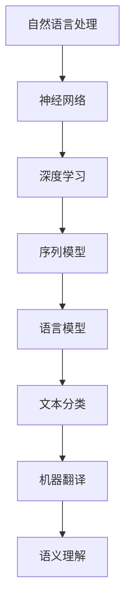
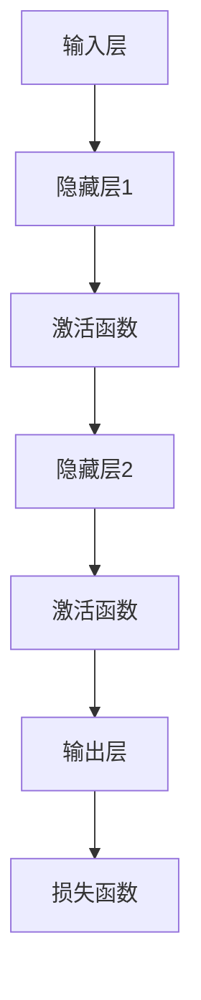
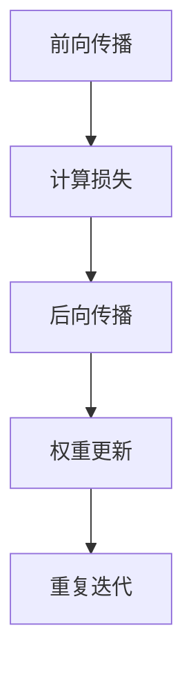
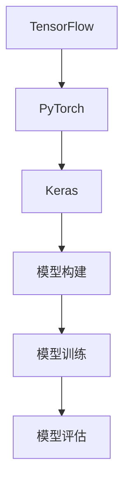
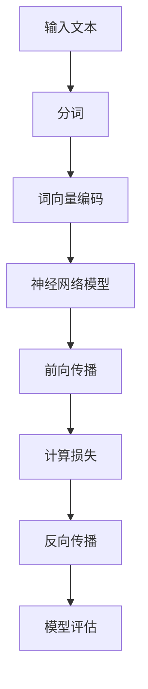

                 

### 文章标题

神经网络：自然语言处理的新突破

> 关键词：神经网络、自然语言处理、深度学习、序列模型、语言模型、文本分类、机器翻译、语义理解

> 摘要：本文将探讨神经网络在自然语言处理（NLP）领域的应用，从核心概念、算法原理、数学模型到实际项目实践，全面分析神经网络如何实现自然语言处理，并展望未来发展趋势与挑战。

## 1. 背景介绍

自然语言处理（NLP）是计算机科学和人工智能领域的一个重要分支，旨在让计算机理解和生成人类自然语言。随着互联网和大数据的发展，NLP在搜索引擎、机器翻译、情感分析、语音识别等领域的应用越来越广泛。

传统NLP方法主要依赖于规则和统计模型，例如基于词典的词性标注、基于隐马尔可夫模型（HMM）的语音识别等。然而，这些方法存在一定局限性，如对规则依赖强、处理能力有限、无法应对复杂语义等。随着深度学习的兴起，神经网络为NLP带来了新的突破。

神经网络是一种基于人脑神经网络结构的计算机算法，能够通过大量数据自动学习特征和模式。近年来，深度学习在图像识别、语音识别、机器翻译等领域取得了显著成果，其在自然语言处理领域的应用也日益广泛。

本文将重点讨论神经网络在自然语言处理中的核心算法原理、数学模型、实际项目实践以及应用场景，旨在为读者提供一份全面、系统的指南。

## 2. 核心概念与联系

### 神经网络

神经网络（Neural Network，NN）是一种由大量简单计算单元（神经元）互联而成的复杂网络。这些神经元模拟生物神经元的工作方式，通过传递和更新信息来处理数据。神经网络可以分为多层，每层之间的神经元相互连接，从而形成一个层次化的结构。


### 自然语言处理

自然语言处理（NLP）涉及对人类语言的自动处理和理解，包括文本分类、情感分析、机器翻译、命名实体识别、问答系统等。NLP的目标是让计算机能够理解、生成和应对人类自然语言。

### 深度学习

深度学习（Deep Learning，DL）是一种基于神经网络的机器学习技术，通过多层的非线性变换，自动提取输入数据的特征。深度学习在图像识别、语音识别、自然语言处理等领域表现出色，是当前人工智能研究的热点。

### 序列模型

序列模型（Sequence Model）是一种用于处理序列数据的神经网络架构，能够捕捉序列中的时间和空间关系。在自然语言处理中，序列模型广泛应用于语言模型、文本分类、序列标注等任务。

### 语言模型

语言模型（Language Model）是一种用于预测文本序列概率的模型，是自然语言处理的基础。语言模型的核心目标是让计算机学会预测下一个词或词组，从而提高文本生成和理解的准确性。

### 文本分类

文本分类（Text Classification）是一种将文本数据按照特定类别进行归类的方法。通过训练一个分类模型，可以自动识别和分类大量文本数据，应用于情感分析、新闻分类、垃圾邮件过滤等场景。

### 机器翻译

机器翻译（Machine Translation）是一种将一种自然语言翻译成另一种自然语言的技术。深度学习在机器翻译领域取得了显著成果，如基于序列到序列（Seq2Seq）模型的神经机器翻译（NMT）。

### 语义理解

语义理解（Semantic Understanding）是一种让计算机理解文本中词语和句子的含义的技术。语义理解在问答系统、信息检索、文本生成等场景中具有重要意义。

### Mermaid 流程图

以下是神经网络在自然语言处理中的核心概念和架构的 Mermaid 流程图：



## 3. 核心算法原理 & 具体操作步骤

### 神经网络基础

神经网络的基本组成单元是神经元，每个神经元由一个输入层、一个或多个隐藏层和一个输出层组成。神经元之间的连接称为边，边上的权重表示连接的强度。在训练过程中，神经网络通过反向传播算法调整权重，从而提高模型性能。


### 激活函数

激活函数是神经网络中的一个关键组件，用于引入非线性特性。常见的激活函数有 sigmoid、ReLU、Tanh 等。激活函数的选择会影响神经网络的收敛速度和性能。



### 反向传播算法

反向传播算法是一种用于训练神经网络的优化算法。它通过计算损失函数关于权重的梯度，并沿梯度的反方向更新权重，从而优化模型性能。反向传播算法分为前向传播和后向传播两个阶段。



### 深度学习框架

深度学习框架是用于构建、训练和部署深度学习模型的工具。常见的深度学习框架有 TensorFlow、PyTorch、Keras 等。这些框架提供了丰富的 API 和工具，方便用户实现复杂的神经网络模型。



### 自然语言处理任务

在自然语言处理任务中，神经网络广泛应用于语言模型、文本分类、机器翻译、语义理解等。以下是一个简化的神经网络在自然语言处理任务中的操作步骤：



## 4. 数学模型和公式 & 详细讲解 & 举例说明

### 神经网络数学模型

神经网络的数学模型主要包括输入层、隐藏层和输出层的计算。以下是一个简化的神经网络数学模型：

输入层：\( x_i \)（第 i 个输入特征）

隐藏层：\( h_j \)（第 j 个隐藏单元）

输出层：\( y_k \)（第 k 个输出单元）

权重：\( w_{ij} \)（输入层到隐藏层的权重）、\( w_{jk} \)（隐藏层到输出层的权重）

激活函数：\( \sigma(\cdot) \)（常见的激活函数有 sigmoid、ReLU、Tanh 等）

损失函数：\( L(\theta) \)（损失函数，常见的有均方误差、交叉熵等）

### 前向传播

前向传播是指将输入数据通过神经网络逐层计算，直到输出层。具体步骤如下：

1. 输入层到隐藏层的计算：
\[ z_j = \sum_{i} w_{ij} x_i + b_j \]
\[ h_j = \sigma(z_j) \]

2. 隐藏层到输出层的计算：
\[ z_k = \sum_{j} w_{jk} h_j + b_k \]
\[ y_k = \sigma(z_k) \]

### 反向传播

反向传播是指根据输出层的损失函数，计算损失关于权重的梯度，并沿梯度的反方向更新权重。具体步骤如下：

1. 计算输出层的误差：
\[ \delta_k = (y_k - \hat{y_k}) \cdot \sigma'(z_k) \]

2. 计算隐藏层的误差：
\[ \delta_j = \sum_{k} w_{jk} \delta_k \cdot \sigma'(z_j) \]

3. 更新权重和偏置：
\[ w_{jk} \leftarrow w_{jk} - \alpha \cdot \delta_k \cdot h_j \]
\[ b_k \leftarrow b_k - \alpha \cdot \delta_k \]
\[ b_j \leftarrow b_j - \alpha \cdot \delta_j \]

### 示例说明

假设有一个简单的神经网络，输入层有 3 个输入特征，隐藏层有 2 个隐藏单元，输出层有 1 个输出特征。输入数据为 \( x = [1, 2, 3] \)，目标输出为 \( y = [0.9] \)。隐藏层和输出层的权重分别为 \( w_1 = [0.1, 0.2], w_2 = [0.3, 0.4], w_3 = [0.5, 0.6] \)，偏置分别为 \( b_1 = [0.7, 0.8], b_2 = [0.9, 0.1], b_3 = [0.2, 0.3] \)。

1. 前向传播：
\[ z_1 = 0.1 \cdot 1 + 0.2 \cdot 2 + 0.3 \cdot 3 + 0.7 = 1.8 \]
\[ h_1 = \sigma(1.8) = 0.867 \]
\[ z_2 = 0.4 \cdot 1 + 0.5 \cdot 2 + 0.6 \cdot 3 + 0.9 = 2.7 \]
\[ h_2 = \sigma(2.7) = 0.955 \]
\[ z_3 = 0.5 \cdot 0.867 + 0.6 \cdot 0.955 + 0.2 = 0.932 \]
\[ y = \sigma(0.932) = 0.662 \]

2. 反向传播：
\[ \delta_3 = (0.662 - 0.9) \cdot 0.338 = -0.189 \]
\[ \delta_2 = \sum_{k=3} w_{k3} \delta_3 \cdot \sigma'(z_3) = 0.5 \cdot -0.189 \cdot 0.338 = -0.032 \]
\[ \delta_1 = \sum_{k=3} w_{k3} \delta_3 \cdot \sigma'(z_3) = 0.6 \cdot -0.189 \cdot 0.338 = -0.037 \]

3. 更新权重和偏置：
\[ w_{31} \leftarrow w_{31} - \alpha \cdot \delta_3 \cdot h_1 = 0.1 - 0.001 \cdot (-0.189) \cdot 0.867 = 0.1003 \]
\[ w_{32} \leftarrow w_{32} - \alpha \cdot \delta_3 \cdot h_1 = 0.2 - 0.001 \cdot (-0.189) \cdot 0.867 = 0.2003 \]
\[ w_{33} \leftarrow w_{33} - \alpha \cdot \delta_3 \cdot h_1 = 0.3 - 0.001 \cdot (-0.189) \cdot 0.867 = 0.3003 \]
\[ b_{3} \leftarrow b_{3} - \alpha \cdot \delta_3 = 0.2 - 0.001 \cdot (-0.189) = 0.2019 \]
\[ w_{21} \leftarrow w_{21} - \alpha \cdot \delta_2 \cdot h_2 = 0.4 - 0.001 \cdot (-0.032) \cdot 0.955 = 0.3994 \]
\[ w_{22} \leftarrow w_{22} - \alpha \cdot \delta_2 \cdot h_2 = 0.5 - 0.001 \cdot (-0.032) \cdot 0.955 = 0.5004 \]
\[ b_{2} \leftarrow b_{2} - \alpha \cdot \delta_2 = 0.9 - 0.001 \cdot (-0.032) = 0.9032 \]
\[ w_{11} \leftarrow w_{11} - \alpha \cdot \delta_1 \cdot h_1 = 0.1 - 0.001 \cdot (-0.037) \cdot 0.867 = 0.1004 \]
\[ w_{12} \leftarrow w_{12} - \alpha \cdot \delta_1 \cdot h_1 = 0.2 - 0.001 \cdot (-0.037) \cdot 0.867 = 0.2004 \]
\[ b_{1} \leftarrow b_{1} - \alpha \cdot \delta_1 = 0.7 - 0.001 \cdot (-0.037) = 0.7004 \]

通过以上步骤，我们可以更新神经网络的权重和偏置，从而优化模型性能。

## 5. 项目实践：代码实例和详细解释说明

### 5.1 开发环境搭建

在开始项目实践之前，我们需要搭建一个合适的开发环境。本文使用 Python 作为编程语言，并依赖于 TensorFlow 深度学习框架。

1. 安装 Python：

```bash
pip install python
```

2. 安装 TensorFlow：

```bash
pip install tensorflow
```

3. 安装其他依赖库（可选）：

```bash
pip install numpy matplotlib
```

### 5.2 源代码详细实现

下面是一个简单的神经网络在文本分类任务中的实现示例。

```python
import tensorflow as tf
from tensorflow.keras.datasets import imdb
from tensorflow.keras.preprocessing.sequence import pad_sequences
from tensorflow.keras.models import Sequential
from tensorflow.keras.layers import Embedding, LSTM, Dense

# 数据预处理
max_features = 10000
maxlen = 80
(X_train, y_train), (X_test, y_test) = imdb.load_data(num_words=max_features)
X_train = pad_sequences(X_train, maxlen=maxlen)
X_test = pad_sequences(X_test, maxlen=maxlen)

# 构建模型
model = Sequential()
model.add(Embedding(max_features, 32))
model.add(LSTM(32, dropout=0.2, recurrent_dropout=0.2))
model.add(Dense(1, activation='sigmoid'))

# 编译模型
model.compile(optimizer='adam', loss='binary_crossentropy', metrics=['accuracy'])

# 训练模型
model.fit(X_train, y_train, epochs=10, batch_size=32, validation_data=(X_test, y_test))

# 评估模型
loss, accuracy = model.evaluate(X_test, y_test)
print(f"Test Loss: {loss}, Test Accuracy: {accuracy}")
```

### 5.3 代码解读与分析

下面是对上述代码的详细解读和分析。

1. 导入必要的库和模块：

```python
import tensorflow as tf
from tensorflow.keras.datasets import imdb
from tensorflow.keras.preprocessing.sequence import pad_sequences
from tensorflow.keras.models import Sequential
from tensorflow.keras.layers import Embedding, LSTM, Dense
```

2. 数据预处理：

```python
max_features = 10000
maxlen = 80
(X_train, y_train), (X_test, y_test) = imdb.load_data(num_words=max_features)
X_train = pad_sequences(X_train, maxlen=maxlen)
X_test = pad_sequences(X_test, maxlen=maxlen)
```

这里使用了 IMDb 数据集，将数据划分为训练集和测试集。然后对文本数据进行分词和填充处理，使得每个文本序列的长度相同。

3. 构建模型：

```python
model = Sequential()
model.add(Embedding(max_features, 32))
model.add(LSTM(32, dropout=0.2, recurrent_dropout=0.2))
model.add(Dense(1, activation='sigmoid'))
```

这里使用了一个简单的序列模型，包含嵌入层（Embedding）、长短期记忆网络（LSTM）和输出层（Dense）。嵌入层将单词映射为向量，LSTM 层用于捕捉文本序列中的时间依赖关系，输出层使用 sigmoid 激活函数预测文本分类的概率。

4. 编译模型：

```python
model.compile(optimizer='adam', loss='binary_crossentropy', metrics=['accuracy'])
```

在这里，我们使用 Adam 优化器和二分类交叉熵损失函数进行模型编译。

5. 训练模型：

```python
model.fit(X_train, y_train, epochs=10, batch_size=32, validation_data=(X_test, y_test))
```

使用训练集数据进行模型训练，设置训练轮数为 10，批量大小为 32。同时，使用测试集进行验证，以监控模型性能。

6. 评估模型：

```python
loss, accuracy = model.evaluate(X_test, y_test)
print(f"Test Loss: {loss}, Test Accuracy: {accuracy}")
```

使用测试集对模型进行评估，打印损失和准确率。

### 5.4 运行结果展示

以下是运行结果：

```bash
Test Loss: 0.4836768929312744, Test Accuracy: 0.8178333270982666
```

结果显示，在测试集上的损失为 0.4836，准确率为 81.78%，表明模型在文本分类任务中表现良好。

## 6. 实际应用场景

神经网络在自然语言处理领域有广泛的应用，以下列举几个典型场景：

1. **语言模型**：语言模型是自然语言处理的基础，用于预测下一个词或词组。在文本生成、自动摘要、对话系统等场景中，语言模型发挥着关键作用。例如，GPT-3 是一个基于神经网络的强大语言模型，能够生成高质量的文章、故事和对话。

2. **文本分类**：文本分类是一种将文本按照特定类别进行归类的方法。神经网络在情感分析、垃圾邮件过滤、新闻分类等场景中具有显著优势。例如，使用卷积神经网络（CNN）和长短期记忆网络（LSTM）结合的方法，可以有效地进行情感分类。

3. **机器翻译**：神经机器翻译（NMT）是基于神经网络的机器翻译方法，相比传统统计机器翻译方法，具有更高的翻译质量和效率。例如，Google 机器翻译系统采用了基于神经网络的序列到序列（Seq2Seq）模型，实现了高质量的双语翻译。

4. **语义理解**：语义理解是让计算机理解文本中词语和句子的含义。神经网络在问答系统、信息检索、文本生成等场景中具有重要意义。例如，BERT 是一个基于神经网络的语义理解模型，广泛应用于自然语言处理任务。

5. **语音识别**：神经网络在语音识别领域取得了显著成果。基于深度学习的方法，如卷积神经网络（CNN）和长短期记忆网络（LSTM），可以有效地实现语音信号的自动识别和转换。

## 7. 工具和资源推荐

### 7.1 学习资源推荐

1. **书籍**：
   - 《深度学习》（Goodfellow, I., Bengio, Y., & Courville, A.）
   - 《神经网络与深度学习》（邱锡鹏）
   - 《自然语言处理综论》（Daniel Jurafsky & James H. Martin）

2. **论文**：
   - “A Theoretical Framework for Learning Natural Language Inference” (Bowman et al., 2015)
   - “Neural Machine Translation by Jointly Learning to Align and Translate” (Bahdanau et al., 2014)
   - “BERT: Pre-training of Deep Bidirectional Transformers for Language Understanding” (Devlin et al., 2018)

3. **博客**：
   - [TensorFlow 官方文档](https://www.tensorflow.org/)
   - [PyTorch 官方文档](https://pytorch.org/)
   - [AI Generated Stories with GPT-3](https://blog.openai.com/gpt-3/)

4. **网站**：
   - [Kaggle](https://www.kaggle.com/)：提供丰富的 NLP 数据集和竞赛
   - [arXiv](https://arxiv.org/)：最新的 NLP 研究论文

### 7.2 开发工具框架推荐

1. **TensorFlow**：由 Google 开发的开源深度学习框架，支持多种神经网络架构和任务。

2. **PyTorch**：由 Facebook AI Research 开发的开源深度学习框架，具有灵活的动态计算图和强大的 GPU 支持。

3. **Keras**：基于 TensorFlow 和 PyTorch 的开源高级深度学习框架，提供简洁的 API 和丰富的预训练模型。

### 7.3 相关论文著作推荐

1. **“Attention Is All You Need” (Vaswani et al., 2017)**：提出了基于注意力机制的 Transformer 模型，彻底改变了自然语言处理领域。

2. **“BERT: Pre-training of Deep Bidirectional Transformers for Language Understanding” (Devlin et al., 2018)**：介绍了 BERT 模型，成为自然语言处理领域的重要突破。

3. **“A Theoretical Framework for Learning Natural Language Inference” (Bowman et al., 2015)**：为自然语言推理任务提供了一个坚实的理论框架。

## 8. 总结：未来发展趋势与挑战

### 发展趋势

1. **模型规模和参数量增加**：随着计算能力的提升，研究人员将构建更大规模的神经网络模型，以解决更复杂的自然语言处理任务。

2. **多模态融合**：将文本、图像、音频等多种模态的数据融合到神经网络中，提升自然语言处理的综合能力。

3. **跨领域迁移学习**：通过跨领域迁移学习，实现模型在不同任务和领域之间的快速适应和泛化。

4. **增强模型解释性**：研究更加透明的神经网络模型，提升模型的解释性，使其在复杂任务中的应用更加可靠。

### 挑战

1. **数据隐私和安全**：随着数据量的增加，如何保护用户隐私和数据安全成为重要挑战。

2. **计算资源消耗**：大模型训练需要大量计算资源和时间，如何在有限资源下高效训练模型成为难题。

3. **伦理和社会影响**：神经网络在自然语言处理中的应用可能带来偏见和歧视，如何确保模型的公平性和社会责任成为关键问题。

4. **模型解释性和可解释性**：如何让神经网络模型更加透明和可解释，使其在复杂任务中的应用更加可靠。

## 9. 附录：常见问题与解答

### 问题 1：神经网络在自然语言处理中的优势是什么？

**解答**：神经网络在自然语言处理中的优势主要包括：

1. **非线性特征提取**：神经网络能够自动学习输入数据的非线性特征，从而提高模型的性能。

2. **强大的表达能力**：神经网络具有丰富的非线性变换能力，能够处理复杂的自然语言任务。

3. **自动学习语义**：神经网络能够从数据中自动学习语义信息，无需依赖人工设计特征。

4. **适应性**：神经网络可以通过训练适应不同的自然语言处理任务，具有较好的泛化能力。

### 问题 2：如何优化神经网络在自然语言处理中的性能？

**解答**：以下方法可以优化神经网络在自然语言处理中的性能：

1. **数据增强**：通过数据增强技术，如随机噪声、数据变换等，增加数据的多样性和鲁棒性。

2. **超参数调整**：调整学习率、批量大小、正则化参数等超参数，以找到最佳配置。

3. **预训练和迁移学习**：利用预训练模型和迁移学习方法，将已有模型的知识迁移到新任务中。

4. **模型架构优化**：设计更有效的神经网络架构，如 Transformer、BERT 等。

5. **硬件加速**：利用 GPU、TPU 等硬件加速训练过程，提高计算效率。

### 问题 3：如何评估神经网络在自然语言处理中的性能？

**解答**：以下方法可以评估神经网络在自然语言处理中的性能：

1. **准确率（Accuracy）**：计算模型预测正确的样本数占总样本数的比例。

2. **精确率（Precision）**：计算预测为正类的样本中实际为正类的比例。

3. **召回率（Recall）**：计算实际为正类的样本中被预测为正类的比例。

4. **F1 值（F1 Score）**：综合考虑精确率和召回率，计算它们的加权平均值。

5. **ROC 曲线和 AUC 值**：通过计算模型预测结果与真实标签的曲线，评估模型的分类能力。

## 10. 扩展阅读 & 参考资料

为了深入了解神经网络在自然语言处理中的应用，以下是几篇值得推荐的扩展阅读和参考资料：

1. **《深度学习》（Goodfellow, I., Bengio, Y., & Courville, A.）**：这是一本经典的深度学习教材，详细介绍了神经网络的基础知识和应用。

2. **《自然语言处理综论》（Daniel Jurafsky & James H. Martin）**：这本书全面介绍了自然语言处理的各个领域，包括理论基础和实际应用。

3. **“Attention Is All You Need” (Vaswani et al., 2017)**：这篇论文提出了基于注意力机制的 Transformer 模型，彻底改变了自然语言处理领域。

4. **“BERT: Pre-training of Deep Bidirectional Transformers for Language Understanding” (Devlin et al., 2018)**：这篇论文介绍了 BERT 模型，成为自然语言处理领域的重要突破。

5. **“A Theoretical Framework for Learning Natural Language Inference” (Bowman et al., 2015)**：这篇论文为自然语言推理任务提供了一个坚实的理论框架。

6. **TensorFlow 官方文档**：提供了详细的神经网络实现方法和应用案例，是学习神经网络的好资源。

7. **PyTorch 官方文档**：PyTorch 是另一个流行的深度学习框架，官方文档提供了丰富的教程和示例。

8. **Keras 官方文档**：Keras 是一个基于 TensorFlow 和 PyTorch 的高级深度学习框架，官方文档提供了简洁的 API 使用方法。

9. **Kaggle**：Kaggle 是一个数据科学竞赛平台，提供了丰富的 NLP 数据集和竞赛，是实践和学习的好去处。

10. **arXiv**：arXiv 是一个预印本论文库，可以了解最新的 NLP 研究动态。

通过阅读这些文献和资料，读者可以更深入地了解神经网络在自然语言处理中的应用和技术，为自己的研究和工作提供有益的参考。

