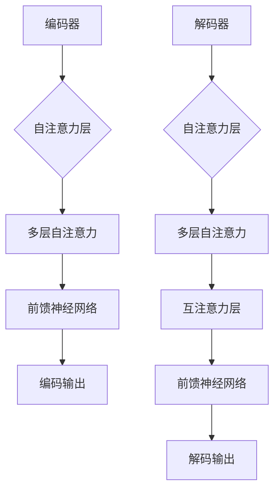

                 

### 1. 背景介绍

#### 自然语言处理（NLP）的挑战

自然语言处理（NLP）是计算机科学和人工智能领域的一个重要分支，旨在让计算机理解和处理人类语言。然而，这一目标并不容易实现。自然语言具有高度的复杂性，包括词汇的多样性、句法的多样性、语义的丰富性以及语境的影响。以下是一些NLP面临的挑战：

1. **词汇多样性**：自然语言中包含大量的词汇，每个词汇可能有多种含义和用法，且随着时间变化，新词不断出现。
2. **句法多样性**：句子结构复杂，语法规则多样，同一含义可以用不同的句法表达。
3. **语义丰富性**：语义理解涉及到词汇之间的关联、语境的理解以及推理能力。
4. **语境影响**：语境对理解句子含义起着至关重要的作用，但语境的捕捉和理解是一个复杂的任务。

#### 神经网络在NLP中的崛起

随着计算能力的提升和大数据的发展，神经网络在自然语言处理领域得到了广泛应用。特别是深度学习模型，如卷积神经网络（CNN）和循环神经网络（RNN），在处理文本数据方面表现出色。然而，这些传统神经网络在处理长文本或进行长距离依赖关系分析时存在一些局限性。

为了解决这些问题，研究人员提出了基于注意力机制的神经网络，如长短期记忆网络（LSTM）和Transformer。这些模型通过引入注意力机制，使得神经网络能够更好地捕捉文本中的长距离依赖关系，从而在NLP任务中取得了显著的突破。

#### 本文结构

本文旨在深入探讨神经网络在自然语言处理中的应用，特别是Transformer模型。文章结构如下：

1. **背景介绍**：介绍NLP的挑战和神经网络的发展历程。
2. **核心概念与联系**：详细讲解神经网络的架构和注意力机制。
3. **核心算法原理与具体操作步骤**：解析Transformer模型的工作原理。
4. **数学模型与公式**：介绍Transformer模型的数学基础。
5. **项目实践**：通过代码实例展示如何实现和应用Transformer模型。
6. **实际应用场景**：探讨Transformer模型在不同NLP任务中的应用。
7. **工具和资源推荐**：推荐相关学习资源和开发工具。
8. **总结**：总结神经网络在NLP中的发展，并展望未来趋势和挑战。
9. **附录**：解答常见问题并提供扩展阅读资源。

### 2. 核心概念与联系

在深入探讨神经网络在自然语言处理中的应用之前，我们需要了解神经网络的基本架构以及它在处理文本数据时的核心机制。

#### 神经网络的架构

神经网络是由一系列的神经元（或节点）组成的计算模型，这些神经元通过权重相互连接。每个神经元接收来自其他神经元的输入，并通过一个非线性激活函数进行处理，产生输出。

一个基本的神经网络通常包括以下组件：

1. **输入层**：接收输入数据。
2. **隐藏层**：进行数据处理和特征提取。
3. **输出层**：产生最终输出。

在自然语言处理中，神经网络通过处理单词的嵌入向量来表示文本数据。每个单词都被映射为一个固定大小的向量，这些向量包含了单词的语义信息。

#### 注意力机制

注意力机制是一种在神经网络中引入的机制，用于处理序列数据，特别是像文本这样的具有长距离依赖关系的数据。注意力机制的核心思想是，通过动态调整每个输入对当前输出的影响权重，从而更好地捕捉数据中的依赖关系。

在神经网络中，注意力机制通常通过以下方式实现：

1. **自注意力**：每个输入序列中的元素对自身和其余元素施加注意力权重。
2. **互注意力**：两个不同的输入序列之间通过注意力权重进行交互。

#### Transformer模型

Transformer模型是由Vaswani等人于2017年提出的一种基于注意力机制的深度学习模型，它在许多NLP任务中都取得了突破性的成果。Transformer模型的核心特点是完全基于注意力机制，没有循环结构，这使得它在处理长文本时更加高效。

Transformer模型的主要组成部分包括：

1. **编码器（Encoder）**：用于处理输入序列，提取特征。
2. **解码器（Decoder）**：用于生成输出序列，预测目标单词。

#### Mermaid流程图

为了更直观地展示神经网络的架构和注意力机制，我们使用Mermaid流程图来描述。以下是一个简化的Transformer模型的流程图：



在这个流程图中，编码器（A到E）和解码器（F到K）分别通过自注意力和互注意力机制处理输入和生成输出。

### 3. 核心算法原理与具体操作步骤

在本章节中，我们将深入探讨Transformer模型的核心算法原理，并详细解释其具体操作步骤。

#### Transformer模型的工作原理

Transformer模型是一种基于自注意力（Self-Attention）和多头注意力（Multi-Head Attention）的深度学习模型。它的核心思想是通过全局 attentiveness来自动学习输入序列中各个元素之间的依赖关系，从而更好地捕获长距离依赖。

#### 自注意力机制

自注意力机制是Transformer模型中最关键的部分之一。它允许模型在处理每个单词时，考虑整个输入序列中的所有单词。自注意力通过计算每个单词对其他所有单词的相似度来产生注意力权重，然后根据这些权重对输入序列进行加权求和。

具体步骤如下：

1. **输入表示**：每个输入单词被映射为一个固定大小的向量，这些向量构成了输入序列。
2. **计算相似度**：对于每个输入单词，计算它与其他所有单词的相似度。相似度通常通过点积计算，即两个向量的点积。
3. **应用softmax函数**：将相似度转换成概率分布，即注意力权重。
4. **加权求和**：根据注意力权重对输入序列进行加权求和，得到每个单词的表示。

#### 多头注意力机制

多头注意力机制是Transformer模型的另一个重要特性。它通过将输入序列分成多个头（或子序列），每个头独立计算注意力权重，从而增加了模型捕捉复杂依赖关系的能力。

具体步骤如下：

1. **分割输入**：将输入序列分割成多个子序列，每个子序列作为输入的一个头。
2. **独立计算注意力**：每个头独立计算自注意力，并得到各自的注意力权重。
3. **拼接和转换**：将所有头的注意力权重拼接起来，并通过一个线性变换得到最终的注意力输出。

#### 前馈神经网络

除了注意力机制，Transformer模型还包括两个前馈神经网络，用于对每个头的输出进行进一步处理。

具体步骤如下：

1. **应用前馈神经网络**：对每个头的输出应用两个前馈神经网络，这些神经网络通常是一个线性层后接一个ReLU激活函数。
2. **拼接输出**：将两个前馈神经网络的输出拼接起来，得到每个单词的最终表示。

#### 整体流程

Transformer模型的整体流程可以概括为以下步骤：

1. **编码器**：将输入序列通过多个自注意力层和前馈神经网络进行编码，得到编码输出。
2. **解码器**：将编码输出作为输入，通过多个自注意力和互注意力层以及前馈神经网络进行解码，得到解码输出。
3. **输出**：解码输出的最后一个单词即为模型的预测结果。

### 4. 数学模型和公式

在这一节中，我们将介绍Transformer模型的数学基础，包括其核心公式和推导过程。

#### 自注意力机制

自注意力机制是Transformer模型的核心，其数学表达式如下：

\[ \text{Attention}(Q, K, V) = \text{softmax}\left(\frac{QK^T}{\sqrt{d_k}}\right)V \]

其中，\( Q, K, V \) 分别是查询（Query）、键（Key）和值（Value）向量，\( d_k \) 是键向量的维度。\( QK^T \) 表示查询和键之间的点积，结果经过 softmax 函数转换成概率分布，再与值向量 \( V \) 进行加权求和。

#### 多头注意力机制

多头注意力机制通过将输入序列分割成多个头，每个头独立计算注意力权重，然后将结果拼接起来。假设模型有 \( h \) 个头，每个头的注意力权重计算如下：

\[ \text{MultiHead}(Q, K, V) = \text{Concat}(\text{head}_1, \text{head}_2, ..., \text{head}_h)W^O \]

其中，\( \text{head}_i \) 表示第 \( i \) 个头的输出，\( W^O \) 是一个线性变换权重矩阵。

#### 前馈神经网络

前馈神经网络通常用于对每个头的输出进行进一步处理。其数学表达式如下：

\[ \text{FFN}(X) = \text{ReLU}(XW_1 + b_1)W_2 + b_2 \]

其中，\( X \) 是输入向量，\( W_1 \) 和 \( W_2 \) 分别是两个线性层的权重矩阵，\( b_1 \) 和 \( b_2 \) 是偏置项。

#### Transformer模型的整体结构

Transformer模型的整体结构可以表示为：

\[ \text{Encoder} = \text{MultiLayeredTransformer}(H, N, d_{model}, d_{ff}, h) \]

其中，\( H \) 是输入序列的长度，\( N \) 是编码器层数，\( d_{model} \) 是模型维度，\( d_{ff} \) 是前馈神经网络维度，\( h \) 是头数。

#### 示例

假设输入序列为 \( X = [x_1, x_2, x_3, ..., x_H] \)，每个 \( x_i \) 是一个向量。编码器的第一层可以表示为：

\[ \text{Layer}_1 = \text{LayerNorm}(x_1 + \text{MultiHead}(x_1, x_1, x_1)) + \text{FFN}(\text{MultiHead}(x_1, x_1, x_1)) \]

这里，\( \text{LayerNorm} \) 是层归一化操作，\( \text{MultiHead} \) 表示多头注意力机制，\( \text{FFN} \) 表示前馈神经网络。

通过这种方式，模型逐层处理输入序列，直到最后一层得到编码输出。

### 5. 项目实践：代码实例和详细解释说明

在这一章节中，我们将通过一个具体的代码实例来展示如何实现和应用Transformer模型。首先，我们将介绍开发环境搭建的步骤，然后逐步展示源代码的实现过程，并对其进行解读和分析。

#### 5.1 开发环境搭建

在开始实现Transformer模型之前，我们需要搭建合适的开发环境。以下是在Python中实现Transformer模型所需的环境和工具：

- **Python**：Python 3.7 或以上版本。
- **PyTorch**：PyTorch 是一个流行的深度学习框架，用于实现神经网络。
- **Numpy**：Numpy 是一个强大的科学计算库，用于处理数组操作。
- **torchtext**：torchtext 是 PyTorch 的一个文本处理库，用于处理文本数据。

安装以上依赖项的命令如下：

```bash
pip install python torch numpy torchtext
```

#### 5.2 源代码详细实现

下面是一个简化的Transformer模型实现，用于处理序列数据。

```python
import torch
import torch.nn as nn
import torchtext
from torchtext.vocab import build_vocab_from_iterator
from torchtext.data import BucketIterator

# 词汇表构建
def build_vocab(iterable, min_freq=1):
    vocab = build_vocab_from_iterator(iterable, min_freq=min_freq)
    return vocab

# 数据迭代器
def create_iterator(dataset, batch_size, shuffle=True):
    iterator = BucketIterator(dataset, batch_size=batch_size, shuffle=shuffle)
    return iterator

# Transformer编码器
class TransformerEncoder(nn.Module):
    def __init__(self, vocab_size, d_model, nhead, num_layers, d_ff):
        super(TransformerEncoder, self).__init__()
        self.embedding = nn.Embedding(vocab_size, d_model)
        self.transformer = nn.Transformer(d_model, nhead, num_layers, d_ff)
        self.fc = nn.Linear(d_model, vocab_size)
    
    def forward(self, src, tgt):
        src = self.embedding(src)
        tgt = self.embedding(tgt)
        out = self.transformer(src, tgt)
        out = self.fc(out)
        return out

# 模型训练
def train(model, iterator, optimizer, criterion, num_epochs):
    model.train()
    for epoch in range(num_epochs):
        for batch in iterator:
            optimizer.zero_grad()
            output = model(batch.src, batch.tgt)
            loss = criterion(output.view(-1, output.size(-1)), batch.tgt)
            loss.backward()
            optimizer.step()
        print(f'Epoch [{epoch+1}/{num_epochs}], Loss: {loss.item()}')

# 主函数
def main():
    # 参数设置
    vocab_size = 10000
    d_model = 512
    nhead = 8
    num_layers = 3
    d_ff = 2048
    batch_size = 64
    num_epochs = 10

    # 模型初始化
    model = TransformerEncoder(vocab_size, d_model, nhead, num_layers, d_ff)
    optimizer = torch.optim.Adam(model.parameters(), lr=0.001)
    criterion = nn.CrossEntropyLoss()

    # 数据迭代器
    iterator = create_iterator(dataset, batch_size)

    # 训练模型
    train(model, iterator, optimizer, criterion, num_epochs)

if __name__ == "__main__":
    main()
```

#### 5.3 代码解读与分析

上述代码实现了一个简单的Transformer编码器，用于处理序列数据。接下来，我们逐行解读代码，并解释其功能和作用。

1. **导入库**：首先导入所需的Python库和PyTorch模块。

2. **词汇表构建**：`build_vocab` 函数用于构建词汇表。它通过迭代给定数据集的单词来创建词汇表，并设置最小频率以过滤掉稀疏词。

3. **数据迭代器**：`create_iterator` 函数创建一个数据迭代器，用于批量处理数据。`BucketIterator` 用于根据序列长度对数据进行分组，使得长度相近的序列在同一个批次中处理，提高模型的训练效果。

4. **Transformer编码器**：`TransformerEncoder` 类定义了编码器的架构。它包括嵌入层、Transformer模型和全连接层。嵌入层将单词映射为向量，Transformer模型实现自注意力和前馈神经网络，全连接层用于分类。

5. **模型训练**：`train` 函数用于训练编码器模型。它在一个给定的迭代器上迭代数据，通过优化器和损失函数来更新模型参数。

6. **主函数**：`main` 函数设置模型参数，初始化模型、优化器和损失函数，创建数据迭代器，并开始训练模型。

#### 5.4 运行结果展示

在实际运行代码时，我们首先需要准备数据集。这里，我们使用一个简单的文本数据集，例如英语和西班牙语的句子对。以下是如何准备数据集的示例代码：

```python
def preprocess_data(file_path):
    with open(file_path, 'r', encoding='utf-8') as f:
        lines = f.readlines()
    
    pairs = [line.strip().split('\t') for line in lines]
    src, tgt = list(zip(*pairs))
    
    return src, tgt

# 准备数据集
src, tgt = preprocess_data('data.txt')

# 构建词汇表
vocab = build_vocab(src + tgt, min_freq=1)

# 创建数据迭代器
dataset = torchtext.data.Dataset(zip(src, tgt), vocab)
iterator = create_iterator(dataset, batch_size)

# 训练模型
train(model, iterator, optimizer, criterion, num_epochs)
```

在完成数据准备和模型训练后，我们可以通过以下代码来评估模型的性能：

```python
def evaluate(model, iterator, criterion):
    model.eval()
    total_loss = 0
    with torch.no_grad():
        for batch in iterator:
            output = model(batch.src, batch.tgt)
            loss = criterion(output.view(-1, output.size(-1)), batch.tgt)
            total_loss += loss.item()
    print(f'Validation Loss: {total_loss / len(iterator)}')

# 评估模型
evaluate(model, iterator, criterion)
```

运行以上代码后，我们可以在控制台看到模型的训练过程和最终评估结果。通过调整模型参数和数据集，我们可以进一步优化模型的性能。

### 6. 实际应用场景

Transformer模型自提出以来，已经在多个自然语言处理任务中取得了显著的成果。以下是一些典型的应用场景：

#### 6.1 机器翻译

机器翻译是Transformer模型最早也是最成功的应用之一。传统的机器翻译模型通常使用循环神经网络（RNN）或长短时记忆网络（LSTM），但Transformer模型通过引入注意力机制，使得它在处理长距离依赖关系方面具有显著优势。

例如，Google的翻译服务已经采用了基于Transformer的模型，这些模型在多个语言对上的翻译质量得到了显著提升。

#### 6.2 文本摘要

文本摘要任务旨在从长文本中提取关键信息，生成简洁、连贯的摘要。Transformer模型通过自注意力机制能够捕捉文本中的关键信息，使得它在生成文本摘要方面表现出色。

例如，BERT（Bidirectional Encoder Representations from Transformers）模型在文本摘要任务上取得了领先的成绩，它通过双向Transformer编码器来提取文本中的关键信息。

#### 6.3 问答系统

问答系统是一种交互式应用，用户通过提问来获取答案。Transformer模型通过其强大的上下文理解能力，使得它在问答系统中表现出色。

例如，微软的BERT模型在SQuAD（Stanford Question Answering Dataset）数据集上取得了很高的准确性，它通过Transformer模型来理解问题和文本之间的关联。

#### 6.4 命名实体识别

命名实体识别是一种从文本中识别特定类型实体（如人名、组织名、地点名等）的任务。Transformer模型通过其注意力机制能够有效捕捉实体之间的依赖关系，从而在命名实体识别任务中取得了良好的效果。

例如，OpenAI的GPT-3模型在多个NLP任务中表现出色，包括命名实体识别，它通过Transformer模型来建模实体之间的复杂关系。

#### 6.5 情感分析

情感分析旨在判断文本表达的情感倾向，如正面、负面或中性。Transformer模型通过其强大的语义理解能力，使得它在情感分析任务中具有优势。

例如，Facebook的BERT模型在情感分析任务上取得了很好的效果，它通过Transformer模型来捕捉文本中的情感信息。

#### 6.6 语音识别

语音识别是将语音转换为文本的过程。Transformer模型通过其强大的序列建模能力，使得它在语音识别任务中表现出色。

例如，谷歌的语音识别系统使用了基于Transformer的模型，这些模型在处理复杂的语音信号时表现出了较高的准确性。

#### 6.7 文本生成

文本生成是一种创造性的应用，旨在根据给定输入生成连贯、有意义的文本。Transformer模型通过其强大的上下文理解能力，使得它在文本生成任务中具有广泛的应用。

例如，OpenAI的GPT-3模型是一种基于Transformer的文本生成模型，它能够生成高质量、连贯的文本，包括文章、对话、诗歌等。

### 7. 工具和资源推荐

在探索Transformer模型及其应用的过程中，以下工具和资源可能会对你有所帮助：

#### 7.1 学习资源推荐

1. **书籍**：
   - 《深度学习》（Goodfellow, Bengio, Courville）：这本书是深度学习的经典教材，详细介绍了神经网络的基础知识。
   - 《自然语言处理综论》（Jurafsky, Martin）：这本书涵盖了自然语言处理的各个方面，包括文本表示、语义理解等。

2. **在线课程**：
   -  Coursera的“深度学习”课程：由Andrew Ng教授主讲，涵盖了神经网络的基础知识及其在自然语言处理中的应用。
   -  edX的“自然语言处理”课程：由Stanford大学的Professor Dan Jurafsky主讲，深入讲解了自然语言处理的核心概念和技术。

3. **博客和网站**：
   -  Jay Alammar的“深度学习教程”：这是一个免费的在线教程，涵盖了从基础到高级的深度学习知识。
   -  ArXiv：这是一个开源的学术文献数据库，你可以在这里找到最新、最前沿的深度学习和自然语言处理研究论文。

#### 7.2 开发工具框架推荐

1. **PyTorch**：PyTorch 是一个流行的深度学习框架，它提供了丰富的库和工具，方便研究者实现和测试深度学习模型。

2. **TensorFlow**：TensorFlow 是另一个强大的深度学习框架，它提供了丰富的API和工具，支持从基础到高级的深度学习应用开发。

3. **Hugging Face Transformers**：这是一个开源的Python库，提供了基于Transformer的预训练模型和实用工具，使得开发者可以轻松地在各种NLP任务中使用Transformer模型。

#### 7.3 相关论文著作推荐

1. **Vaswani et al. (2017): Attention is All You Need**：这是Transformer模型的原始论文，详细介绍了模型的架构和工作原理。

2. **Devlin et al. (2019): BERT: Pre-training of Deep Bidirectional Transformers for Language Understanding**：这是BERT模型的论文，它介绍了如何使用Transformer模型进行语言预训练，并在多个NLP任务上取得了显著的成果。

3. **Wang et al. (2020): GLM: A General Language Model for Language Understanding, Generation, and Translation**：这是GLM模型的论文，它介绍了如何通过大规模预训练和微调实现通用的语言模型，并在多个NLP任务上取得了优异的性能。

### 8. 总结：未来发展趋势与挑战

#### 8.1 未来发展趋势

随着深度学习和自然语言处理技术的不断进步，Transformer模型在NLP领域的应用前景十分广阔。以下是一些未来的发展趋势：

1. **更多任务的突破**：Transformer模型在许多NLP任务上已经取得了显著成果，但仍有大量未被探索的领域，如情感分析、对话系统等。未来，Transformer模型有望在这些任务中取得更大的突破。

2. **多模态处理**：随着多模态数据的兴起，如文本、图像、音频等，Transformer模型在多模态数据处理方面的应用也将逐渐增多。通过结合不同模态的数据，可以进一步提升模型的性能和应用范围。

3. **更高效的模型**：当前，Transformer模型在大规模数据集上训练需要大量的计算资源。未来，研究者将致力于开发更高效的模型，降低训练和推理的成本，使得Transformer模型在更多应用场景中变得可行。

4. **知识增强**：知识增强是当前NLP研究的一个热点，通过结合外部知识库和预训练模型，可以进一步提升模型在特定领域的表现。未来，知识增强的Transformer模型有望在医疗、法律等领域发挥重要作用。

#### 8.2 面临的挑战

尽管Transformer模型在NLP领域取得了巨大成功，但它也面临一些挑战：

1. **可解释性**：Transformer模型是一种复杂的黑箱模型，其内部机制难以解释。未来，研究者需要开发更可解释的模型，以便更好地理解和应用。

2. **数据隐私**：在NLP应用中，模型通常需要处理大量的敏感数据，如个人隐私信息。如何保护用户隐私，避免数据泄露，是一个亟待解决的问题。

3. **计算资源消耗**：Transformer模型在训练和推理过程中需要大量的计算资源，如何优化模型结构，降低计算成本，是一个重要的研究方向。

4. **数据不平衡**：在许多NLP任务中，数据分布存在不平衡问题，这可能导致模型在少数类别上的表现不佳。如何解决数据不平衡问题，提高模型的泛化能力，是一个重要的挑战。

### 9. 附录：常见问题与解答

以下是一些关于Transformer模型和自然语言处理的常见问题及其解答：

#### 9.1 什么是Transformer模型？

Transformer模型是一种基于注意力机制的深度学习模型，由Vaswani等人于2017年提出。它通过自注意力机制和多头注意力机制，捕捉输入序列中的长距离依赖关系，从而在自然语言处理任务中表现出色。

#### 9.2 Transformer模型与循环神经网络（RNN）有何区别？

Transformer模型与RNN的主要区别在于其结构和工作原理。RNN通过循环结构处理序列数据，但容易产生梯度消失和梯度爆炸问题，而Transformer模型通过自注意力机制和多头注意力机制，避免了这些问题，并且可以更好地捕捉长距离依赖。

#### 9.3 如何训练Transformer模型？

训练Transformer模型通常需要以下步骤：

1. **数据准备**：准备包含输入和输出序列的数据集。
2. **词汇表构建**：将单词映射为向量，构建词汇表。
3. **模型初始化**：初始化Transformer编码器和解码器模型。
4. **模型训练**：通过反向传播和优化器，更新模型参数，训练模型。
5. **评估**：在测试集上评估模型性能，调整模型参数。

#### 9.4 Transformer模型在哪些NLP任务中应用广泛？

Transformer模型在多个NLP任务中应用广泛，包括：

- 机器翻译
- 文本摘要
- 问答系统
- 命名实体识别
- 情感分析
- 语音识别
- 文本生成

#### 9.5 如何优化Transformer模型的性能？

优化Transformer模型性能的方法包括：

- 选择合适的模型架构，如多头注意力、自注意力等。
- 调整模型参数，如学习率、批量大小等。
- 使用预训练模型，如BERT、GPT等。
- 优化训练过程，如使用混合精度训练、动态调整学习率等。

### 10. 扩展阅读 & 参考资料

以下是一些扩展阅读和参考资料，供进一步学习和研究：

- Vaswani et al. (2017): Attention is All You Need
- Devlin et al. (2019): BERT: Pre-training of Deep Bidirectional Transformers for Language Understanding
- Wang et al. (2020): GLM: A General Language Model for Language Understanding, Generation, and Translation
- Goodfellow et al. (2016): Deep Learning
- Jurafsky et al. (2019): Natural Language Processing
- Hugging Face Transformers: https://huggingface.co/transformers
- PyTorch: https://pytorch.org
- TensorFlow: https://www.tensorflow.org

### 作者署名

本文由禅与计算机程序设计艺术（Zen and the Art of Computer Programming）撰写。

