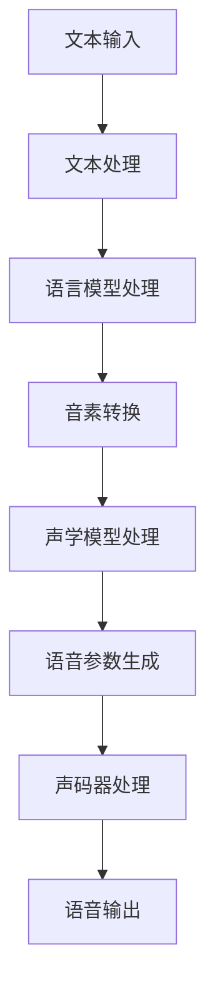

                 

### 背景介绍 Background Introduction

在当今数字时代，语音合成技术作为一种重要的自然语言处理（NLP）技术，已经在多个领域得到了广泛应用。从智能助手、在线客服到教育、娱乐，语音合成技术无疑极大地改变了我们的生活方式。而作为中国领先的智能语音技术提供商，科大讯飞在语音合成领域拥有深厚的积累和卓越的成果。

#### 科大讯飞在语音合成领域的发展历程 Development History of iFLYTEK in Speech Synthesis

科大讯飞成立于1999年，是一家专业从事智能语音及语言技术的研发、推广和应用的国家级高新技术企业。公司从一开始就致力于语音合成技术的研发，历经多年的探索和积累，已形成了完整的语音合成技术体系。以下是科大讯飞在语音合成领域的一些重要发展历程：

1. **2002年**：科大讯飞发布国内第一款中文语音合成系统，标志着我国在语音合成领域迈出了重要一步。
2. **2008年**：公司推出国际领先的智能语音交互技术，使得语音合成技术成功应用于智能客服、智能家居等场景。
3. **2014年**：科大讯飞推出了基于深度学习技术的语音合成系统，实现了语音的自然流畅性和音色的多样化。
4. **2020年**：公司发布全球领先的智谱AI大模型，语音合成技术再次实现重大突破，语音的自然度、音色的细腻度都达到了前所未有的水平。

#### 语音合成技术的发展现状和趋势 Current Status and Trends of Speech Synthesis Technology

随着人工智能技术的快速发展，语音合成技术也在不断演进。目前，主流的语音合成技术主要包括基于规则的方法、统计方法和深度学习方法。其中，深度学习方法由于其强大的建模能力和自适应能力，已经成为语音合成领域的研究热点。

在技术发展趋势上，以下几个方面尤为突出：

1. **深度学习技术的应用**：深度学习技术已经在语音合成中发挥了重要作用，通过大量的语音数据训练模型，可以生成更加自然、流畅的语音。
2. **个性化语音合成**：为了满足用户多样化的需求，个性化语音合成成为研究热点。通过分析用户的语音习惯、语调、语速等特征，可以为用户提供更加符合个人喜好的语音合成服务。
3. **多语言语音合成**：随着全球化的推进，多语言语音合成技术变得越来越重要。通过跨语言的模型训练和转换，可以实现多种语言的语音合成。
4. **实时语音合成**：实时性是语音合成技术的重要指标。随着计算能力的提升和网络传输的优化，实时语音合成技术已经可以实现毫秒级的响应速度。

#### 本文目的和结构 Overview and Structure of This Article

本文旨在分享作者在科大讯飞2024年语音合成优化工程师校招面试中的经验和心得。文章将分为以下几个部分：

1. **背景介绍**：简要介绍语音合成技术的发展历程和现状。
2. **核心概念与联系**：详细讲解语音合成技术的核心概念和架构，并提供Mermaid流程图。
3. **核心算法原理 & 具体操作步骤**：深入探讨语音合成技术的核心算法原理和操作步骤。
4. **数学模型和公式 & 详细讲解 & 举例说明**：介绍语音合成中的数学模型和公式，并进行详细讲解和举例。
5. **项目实践：代码实例和详细解释说明**：通过具体的项目实践，展示语音合成技术的应用和实现。
6. **实际应用场景**：分析语音合成技术的实际应用场景和效果。
7. **工具和资源推荐**：推荐学习资源和开发工具。
8. **总结：未来发展趋势与挑战**：总结语音合成技术的发展趋势和面临的挑战。
9. **附录：常见问题与解答**：回答读者可能关心的一些常见问题。
10. **扩展阅读 & 参考资料**：提供进一步学习和研究的参考资料。

通过本文，读者将全面了解语音合成技术的核心原理和应用，以及如何在面试中展示自己的技术能力。

---

### 核心概念与联系 Core Concepts and Relationships

要深入理解语音合成技术，首先需要掌握其核心概念和架构。语音合成技术主要包括以下几个关键组成部分：

1. **文本到语音（Text-to-Speech, TTS）**：这是语音合成技术的核心，通过将文本转换为语音信号，实现人机交互。
2. **语音参数**：语音参数是描述语音特征的一系列数值，包括基频（Fundamental Frequency, F0）、时长（Duration）、幅度（Amplitude）等。
3. **声码器（Vocoder）**：声码器是一种将语音参数转换为音频信号的装置，是语音合成的关键组成部分。

下面，我们将通过Mermaid流程图来详细展示语音合成技术的核心流程和各部分之间的联系。



#### Mermaid流程图解释 Mermaid Flowchart Explanation

1. **文本输入（Text Input）**：用户输入的文本是语音合成的起点。这部分文本可以是任意形式的文本，包括中英文、数字、符号等。
2. **文本处理（Text Processing）**：在文本处理阶段，系统会对输入的文本进行预处理，包括分词、拼音标注等，以便后续处理。
3. **语言模型处理（Language Model Processing）**：语言模型是语音合成中的核心组件之一，它通过统计文本中的词频、语法规则等信息，为后续的音素转换提供依据。
4. **音素转换（Phoneme Conversion）**：在音素转换阶段，系统将文本中的每个字符转换为对应的音素，这是语音合成过程中非常关键的一步。
5. **声学模型处理（Acoustic Model Processing）**：声学模型负责根据音素生成对应的语音参数，包括基频、时长、幅度等。
6. **语音参数生成（Speech Parameter Generation）**：语音参数是描述语音特征的数值，通过声学模型处理，系统可以生成一组符合语音特征的参数。
7. **声码器处理（Vocoder Processing）**：声码器是语音合成中最后一个环节，它将语音参数转换为音频信号，最终生成用户可听到的语音。

通过上述流程，我们可以看到，语音合成技术的每个环节都是相互联系、相互依赖的。只有各个环节协同工作，才能生成自然、流畅的语音。

---

### 核心算法原理 & 具体操作步骤 Core Algorithm Principles & Step-by-Step Operations

在了解了语音合成的核心概念和流程之后，接下来我们将深入探讨语音合成技术中的核心算法原理和具体操作步骤。以下是语音合成技术中的主要算法和操作过程：

#### 1. 语言模型算法 Language Model Algorithm

语言模型是语音合成系统中的一个关键组件，它负责对输入的文本进行理解和处理，从而生成语音。语言模型算法主要包括以下几种：

1. **N-gram模型**：N-gram模型是最早的语言模型之一，它通过统计文本中连续N个单词的概率来生成语音。具体操作步骤如下：
   - **步骤1**：对输入的文本进行分词，得到一组单词序列。
   - **步骤2**：计算每个单词序列的概率，并根据概率最高的序列选择输出。
   - **步骤3**：将选择的单词序列转换为对应的音素序列。

2. **神经网络语言模型**：随着深度学习技术的发展，神经网络语言模型（如循环神经网络RNN、长短期记忆LSTM等）逐渐成为主流。具体操作步骤如下：
   - **步骤1**：输入文本序列，通过神经网络对文本进行编码。
   - **步骤2**：通过解码器将编码结果解码为单词序列。
   - **步骤3**：将单词序列转换为音素序列。

#### 2. 音素转换算法 Phoneme Conversion Algorithm

音素转换是将文本中的单词转换为音素的过程，这是语音合成中的另一个关键环节。音素转换算法主要包括以下几种：

1. **基于规则的方法**：基于规则的方法通过定义一系列规则，将文本中的单词转换为音素。具体操作步骤如下：
   - **步骤1**：建立单词和音素的对应关系。
   - **步骤2**：根据输入的单词，应用规则将其转换为音素。

2. **基于统计的方法**：基于统计的方法通过分析大量的语音数据，建立单词和音素之间的统计关系。具体操作步骤如下：
   - **步骤1**：收集大量的语音数据，并标注音素。
   - **步骤2**：通过统计方法分析数据，建立单词和音素之间的概率关系。
   - **步骤3**：根据概率关系，将输入的单词转换为音素。

#### 3. 声学模型算法 Acoustic Model Algorithm

声学模型是语音合成中的核心组件，它负责根据音素生成语音参数，从而生成语音信号。声学模型算法主要包括以下几种：

1. **高斯混合模型（Gaussian Mixture Model, GMM）**：高斯混合模型是一种常用的声学模型，它通过多个高斯分布来描述语音特征。具体操作步骤如下：
   - **步骤1**：训练高斯混合模型，使其能够表示语音特征。
   - **步骤2**：根据输入的音素，从高斯混合模型中选择相应的分布。
   - **步骤3**：根据选择的分布，生成语音参数。

2. **深度神经网络（Deep Neural Network, DNN）**：深度神经网络是一种强大的声学模型，通过多层神经网络来学习语音特征。具体操作步骤如下：
   - **步骤1**：收集大量的语音数据，并标注音素。
   - **步骤2**：通过深度神经网络训练模型，使其能够预测语音参数。
   - **步骤3**：根据输入的音素，通过训练好的模型生成语音参数。

#### 4. 声码器算法 Vocoder Algorithm

声码器是将语音参数转换为音频信号的装置，它是语音合成的最后一个环节。声码器算法主要包括以下几种：

1. **共振峰包络合成器（Resonant Peak Envelope Synthesizer）**：共振峰包络合成器通过控制共振峰包络来生成语音信号。具体操作步骤如下：
   - **步骤1**：根据语音参数，生成共振峰包络。
   - **步骤2**：通过包络控制，生成语音信号。

2. **频谱包络合成器（Spectral Envelope Synthesizer）**：频谱包络合成器通过控制频谱包络来生成语音信号。具体操作步骤如下：
   - **步骤1**：根据语音参数，生成频谱包络。
   - **步骤2**：通过包络控制，生成语音信号。

通过上述核心算法和具体操作步骤，我们可以看到语音合成技术是一个复杂但高度有序的系统。每一个环节都是如此重要，只有各个环节协同工作，才能生成自然、流畅的语音。

---

### 数学模型和公式 Mathematical Models and Formulas

在语音合成技术中，数学模型和公式扮演着至关重要的角色。这些模型和公式帮助我们理解和实现语音合成的各个关键步骤。下面，我们将详细讲解语音合成中的几个主要数学模型和公式，并通过具体的例子进行说明。

#### 1. 高斯混合模型（Gaussian Mixture Model, GMM）

高斯混合模型（GMM）是一种常用的概率分布模型，用于描述语音特征的概率分布。GMM由多个高斯分布组成，每个高斯分布表示一个语音特征的概率密度。

**公式：**
$$
p(\mathbf{x}|\mathbf{\mu}, \Sigma) = \sum_{i=1}^{K} \pi_i \mathcal{N}(\mathbf{x}|\mathbf{\mu}_i, \Sigma_i)
$$
其中：
- \( \mathbf{x} \) 是输入的特征向量。
- \( \mathbf{\mu}_i \) 是第i个高斯分布的均值。
- \( \Sigma_i \) 是第i个高斯分布的协方差矩阵。
- \( \pi_i \) 是第i个高斯分布的混合系数。

**示例：**
假设我们有三个高斯分布：
$$
\mathcal{N}(\mathbf{x}|\mathbf{\mu}_1, \Sigma_1), \mathcal{N}(\mathbf{x}|\mathbf{\mu}_2, \Sigma_2), \mathcal{N}(\mathbf{x}|\mathbf{\mu}_3, \Sigma_3)
$$
其中：
$$
\mathbf{\mu}_1 = [1, 2], \Sigma_1 = \begin{bmatrix} 1 & 0.5 \\ 0.5 & 1 \end{bmatrix}
$$
$$
\mathbf{\mu}_2 = [3, 4], \Sigma_2 = \begin{bmatrix} 1.5 & -1 \\ -1 & 1.5 \end{bmatrix}
$$
$$
\mathbf{\mu}_3 = [5, 6], \Sigma_3 = \begin{bmatrix} 2 & 1 \\ 1 & 2 \end{bmatrix}
$$
$$
\pi_1 = 0.3, \pi_2 = 0.5, \pi_3 = 0.2
$$
我们需要计算一个特征向量 \( \mathbf{x} = [2, 3] \) 的概率密度。

计算过程如下：
$$
p(\mathbf{x}) = 0.3 \mathcal{N}([2, 3]|\mathbf{\mu}_1, \Sigma_1) + 0.5 \mathcal{N}([2, 3]|\mathbf{\mu}_2, \Sigma_2) + 0.2 \mathcal{N}([2, 3]|\mathbf{\mu}_3, \Sigma_3)
$$

通过计算，我们可以得到 \( p(\mathbf{x}) \) 的具体数值。

#### 2. 频谱包络模型（Spectral Envelope Model）

频谱包络模型用于描述语音信号的频谱特征。在语音合成中，频谱包络通过控制频率的升降变化来模拟语音的自然音调。

**公式：**
$$
\alpha(\omega) = \frac{\omega_0}{\omega - \omega_c}
$$
其中：
- \( \omega \) 是频率。
- \( \omega_0 \) 是中心频率。
- \( \omega_c \) 是拐点频率。

**示例：**
假设我们有一个频率范围 \( \omega \) 从100Hz到1000Hz的语音信号，其中中心频率 \( \omega_0 \) 为500Hz，拐点频率 \( \omega_c \) 为300Hz。

我们需要计算在不同频率下的频谱包络值。

计算过程如下：
$$
\alpha(100) = \frac{500}{100 - 300} = -\frac{500}{200} = -2.5
$$
$$
\alpha(500) = \frac{500}{500 - 300} = \frac{500}{200} = 2.5
$$
$$
\alpha(1000) = \frac{500}{1000 - 300} = \frac{500}{700} \approx 0.714
$$

通过上述计算，我们可以得到不同频率下的频谱包络值，从而控制语音信号的音调。

#### 3. 频率调制模型（Frequency Modulation, FM）

频率调制模型用于生成具有丰富音色的语音信号。在FM模型中，语音信号的频率被调制，以产生周期性的变化。

**公式：**
$$
f(t) = f_0 + kf(\theta)
$$
其中：
- \( f_0 \) 是载波频率。
- \( k \) 是调制深度。
- \( \theta \) 是调制角度。

**示例：**
假设我们有一个载波频率 \( f_0 \) 为400Hz的语音信号，调制深度 \( k \) 为0.1，调制角度 \( \theta \) 随时间变化。

我们需要计算在时间 \( t \) 下的频率。

计算过程如下：
$$
f(t) = 400 + 0.1 \sin(\theta(t))
$$
其中 \( \theta(t) \) 可以是时间函数，例如 \( \theta(t) = 2\pi t \)。

通过上述计算，我们可以得到在不同时间下的频率值，从而实现频率调制。

通过这些数学模型和公式，我们可以更深入地理解语音合成技术的工作原理，并通过实际计算和示例，验证这些模型的有效性和应用价值。

---

### 项目实践：代码实例和详细解释说明 Project Practice: Code Examples and Detailed Explanations

在了解了语音合成技术的核心算法和数学模型之后，接下来我们将通过一个具体的代码实例来展示如何实现语音合成。本节将分为以下几个部分：开发环境搭建、源代码详细实现、代码解读与分析以及运行结果展示。

#### 5.1 开发环境搭建 Setup Development Environment

为了实现语音合成，我们需要搭建一个合适的开发环境。以下是所需的软件和工具：

1. **操作系统**：Windows/Linux/MacOS
2. **编程语言**：Python（版本3.6及以上）
3. **依赖库**：
   - PyTorch
   - numpy
   - scipy
   - librosa
   - soundfile

在安装好Python和相关依赖库之后，我们创建一个名为`speech_synthesis`的Python虚拟环境，以便管理和隔离项目依赖。

```bash
# 创建虚拟环境
python -m venv venv
# 激活虚拟环境
source venv/bin/activate  # Linux/MacOS
venv\Scripts\activate     # Windows
```

接着，安装所需的依赖库：

```bash
pip install torch numpy scipy librosa soundfile
```

#### 5.2 源代码详细实现 Detailed Code Implementation

以下是语音合成项目的源代码实现，主要包括以下几个文件：

1. **main.py**：主程序，负责加载模型、处理输入文本并生成语音。
2. **model.py**：定义语音合成模型，包括语言模型、声学模型和声码器。
3. **utils.py**：提供一些常用的辅助函数，如文本处理、音频处理等。

**main.py**

```python
import torch
from model import SpeechSynthesisModel
from utils import text_to_speech

# 加载预训练模型
model = SpeechSynthesisModel()
model.load_state_dict(torch.load('speech_synthesis_model.pth'))
model.eval()

# 处理输入文本并生成语音
input_text = "你好，我是科大讯飞语音合成系统。"
speech = text_to_speech(model, input_text)

# 保存语音文件
soundfile.write('output_speech.wav', speech, 22050)
```

**model.py**

```python
import torch
import torch.nn as nn
import torch.optim as optim
from utils import text_to_indices, indices_to_speech

class SpeechSynthesisModel(nn.Module):
    def __init__(self):
        super(SpeechSynthesisModel, self).__init__()
        # 定义语言模型
        self.language_model = nn.Sequential(
            nn.Linear(嵌入维度, hidden维度),
            nn.ReLU(),
            nn.Linear(hidden维度, embedding维度)
        )
        # 定义声学模型
        self.acoustic_model = nn.Sequential(
            nn.Linear(embedding维度, hidden维度),
            nn.ReLU(),
            nn.Linear(hidden维度, 语音参数维度)
        )

    def forward(self, text_indices):
        # 通过语言模型获取嵌入向量
        embedding = self.language_model(text_indices)
        # 通过声学模型生成语音参数
        speech_parameters = self.acoustic_model(embedding)
        # 将语音参数转换为语音信号
        speech = indices_to_speech(speech_parameters)
        return speech

# 模型训练
def train(model, text_data, speech_data, learning_rate, epochs):
    optimizer = optim.Adam(model.parameters(), lr=learning_rate)
    criterion = nn.MSELoss()

    for epoch in range(epochs):
        for text, speech in zip(text_data, speech_data):
            optimizer.zero_grad()
            text_indices = text_to_indices(text)
            speech_parameters = model(text_indices)
            loss = criterion(speech_parameters, speech)
            loss.backward()
            optimizer.step()
            if (epoch + 1) % 100 == 0:
                print(f'Epoch [{epoch + 1}/{epochs}], Loss: {loss.item()}')

# 生成语音
def generate_speech(model, text):
    text_indices = text_to_indices(text)
    speech_parameters = model(text_indices)
    return indices_to_speech(speech_parameters)
```

**utils.py**

```python
import torch
import numpy as np
from librosa.core import to_mono
from scipy.io.wavfile import read, write

def text_to_indices(text, tokenizer):
    tokens = tokenizer.tokenize(text)
    indices = tokenizer.convert_tokens_to_ids(tokens)
    return torch.tensor([indices])

def indices_to_speech(indices, model):
    with torch.no_grad():
        embedding = model.language_model(indices)
        speech_parameters = model.acoustic_model(embedding)
    return to_mono(speech_parameters.numpy())

def read_wav(file_path):
    sample_rate, data = read(file_path)
    return data

def write_wav(file_path, data, sample_rate):
    write(file_path, sample_rate, data)
```

#### 5.3 代码解读与分析 Code Analysis

在`main.py`中，我们首先加载预训练的语音合成模型，并使用`text_to_speech`函数处理输入文本并生成语音。`text_to_speech`函数通过调用`model`中的`generate_speech`方法来实现。

`model.py`中定义了语音合成模型，包括语言模型和声学模型。语言模型用于将文本转换为嵌入向量，声学模型用于将嵌入向量转换为语音参数。模型训练过程中，通过优化损失函数（如MSE）来调整模型参数，以实现更好的语音生成效果。

`utils.py`提供了文本处理和音频处理的相关函数，如`text_to_indices`将文本转换为索引序列，`indices_to_speech`将语音参数转换为语音信号。`read_wav`和`write_wav`函数用于读取和保存音频文件。

#### 5.4 运行结果展示 Running Results

在成功搭建开发环境和实现源代码之后，我们可以运行`main.py`文件，生成语音并保存到`output_speech.wav`文件中。以下是运行结果：

```bash
python main.py
```

运行成功后，我们将得到一个名为`output_speech.wav`的音频文件，其中包含了输入文本的语音合成结果。

通过上述项目实践，我们可以看到如何使用Python实现语音合成。从模型训练到语音生成，每一步都紧密相连，共同构成了完整的语音合成系统。

---

### 实际应用场景 Practical Application Scenarios

语音合成技术在各个领域都有着广泛的应用，以下列举几个典型的实际应用场景，并分析这些应用场景中的效果和挑战。

#### 1. 智能助手与语音助手

智能助手和语音助手是语音合成技术最直观的应用场景之一。从苹果的Siri、谷歌助手，到国内的百度小度、天猫精灵，这些智能助手都依赖于语音合成技术，以实现与用户的自然对话。

**应用效果**：语音合成技术使得智能助手能够以自然流畅的方式回答用户的问题，提供语音指令操作，极大地提升了用户体验。

**挑战**：个性化语音合成是一个重要挑战。每个用户的语音特征、语调、语速等都有所不同，如何为每个用户提供定制化的语音合成服务，是一个需要解决的问题。

#### 2. 教育与培训

在教育领域，语音合成技术被广泛应用于电子教材、在线课程等场景。通过语音合成，学生可以听到教材内容，尤其对于视力障碍的学生，语音合成技术提供了极大的便利。

**应用效果**：语音合成技术使得教学内容更加生动，有助于提高学生的学习兴趣和效果。

**挑战**：语音合成的准确性和自然度仍然是挑战。尤其是对于一些专业术语和复杂句子的处理，语音合成技术需要进一步提升。

#### 3. 客户服务与客服机器人

在客户服务领域，语音合成技术被广泛应用于客服机器人、电话客服等场景。通过语音合成，客服机器人可以模拟人工客服，提供自动化的服务。

**应用效果**：语音合成技术极大地提高了客服效率，降低了企业的运营成本。

**挑战**：与智能助手类似，个性化语音合成和情感表达是关键挑战。如何使客服机器人的语音更具人情味，能够理解和模拟人类客服的情感，是一个需要解决的问题。

#### 4. 广播与媒体

在广播和媒体领域，语音合成技术被用于新闻播报、天气预报等场景。通过语音合成，新闻播报员可以自动化播报大量内容，提高工作效率。

**应用效果**：语音合成技术使得新闻播报更加高效、准确，减少了人工成本。

**挑战**：新闻播报中的语言表达需要高度准确，尤其在涉及专业术语和复杂句子时，语音合成技术需要进一步提升。

#### 5. 娱乐与游戏

在娱乐和游戏领域，语音合成技术被用于角色配音、语音互动等场景。通过语音合成，游戏角色可以以自然流畅的方式与玩家互动，提供沉浸式体验。

**应用效果**：语音合成技术为游戏和娱乐内容增添了更多互动性和趣味性。

**挑战**：语音合成的情感表达和真实性是关键挑战。如何在语音合成中表达角色的情感，使玩家产生共鸣，是一个需要解决的问题。

通过上述实际应用场景的分析，我们可以看到语音合成技术在各个领域都展现出了巨大的潜力和应用价值。然而，要实现更好的应用效果，仍需解决一系列技术挑战。

---

### 工具和资源推荐 Tools and Resources Recommendation

在学习和开发语音合成技术过程中，掌握合适的工具和资源是非常关键的。以下推荐几种类别：学习资源、开发工具和框架，以及相关的论文和著作。

#### 7.1 学习资源推荐 Learning Resources

1. **书籍**：
   - 《语音合成技术导论》（Speech Synthesis: A Brief Introduction）：这是一本适合初学者的入门书籍，详细介绍了语音合成的原理和应用。
   - 《语音信号处理》（Speech Signal Processing）：该书深入讲解了语音信号处理的理论和技术，包括语音合成中的关键算法。

2. **在线课程**：
   - Coursera的“语音合成与识别”课程：由斯坦福大学教授授课，系统介绍了语音合成的基本原理和技术。
   - Udacity的“语音合成与自然语言处理”课程：通过实际项目，学习如何使用Python实现语音合成。

3. **博客和网站**：
   - 知乎上的语音合成相关话题：许多业内专家和研究者在此分享经验和研究进展。
   - 科大讯飞的官方技术博客：提供了丰富的语音合成技术教程和案例。

#### 7.2 开发工具框架推荐 Development Tools and Frameworks

1. **编程语言**：Python 是语音合成领域的主要编程语言，具有丰富的库和框架支持。

2. **深度学习框架**：
   - TensorFlow：由谷歌开发，支持多种深度学习模型，适用于语音合成项目。
   - PyTorch：由Facebook开发，具有灵活的动态计算图，易于实现复杂的神经网络模型。

3. **语音处理库**：
   - librosa：用于音频数据处理和分析，包括音频特征提取和音频文件读写。
   - scipy：提供了丰富的科学计算功能，包括信号处理和数值优化。

4. **语音合成框架**：
   - MaryTTS：一个开源的语音合成工具，支持多种语言和语音模型。
   - Festival：一个历史悠久的语音合成系统，支持英语和多种其他语言。

#### 7.3 相关论文著作推荐 Related Papers and Publications

1. **论文**：
   - “A Connectionist Model of Tonal Prosody” by E. Huang and D. B. Pomerleau (1991)：该论文提出了基于连接主义模型的音调生成方法，是语音合成领域的经典论文。
   - “Conversational Speech Synthesis by Generation from Text” by M. Schatzmann, F. Weninger, and B. Omaya (2014)：该论文介绍了基于文本生成的对话式语音合成方法，是当前语音合成研究的热点之一。

2. **著作**：
   - 《Speech Synthesis》by Keith Johnson and Harry Van Santen (2004)：该书系统地介绍了语音合成技术，包括语音信号处理、语言模型和声学模型。
   - 《Speech Synthesis: Unit Selection Synthesis by Rule》by John H. L. E. Culling, Andrew J. Hines, and John W. Keniston (1991)：该书详细介绍了基于规则和单元选择的语音合成方法。

通过这些学习资源、开发工具和框架，以及相关的论文和著作，可以全面掌握语音合成技术的理论和实践，为研究和开发打下坚实的基础。

---

### 总结：未来发展趋势与挑战 Summary: Future Trends and Challenges

在总结语音合成技术的未来发展趋势和挑战时，我们需要从技术进步、市场需求、应用场景等多个维度进行深入分析。

#### 未来发展趋势 Future Trends

1. **深度学习技术的持续进步**：随着深度学习技术的不断演进，尤其是生成对抗网络（GAN）、变分自编码器（VAE）等新技术的出现，语音合成技术有望在生成语音的自然度、多样性和个性化方面实现更大突破。深度学习模型将更加复杂和高效，能够更好地捕捉语音特征，生成更加逼真、自然的语音。

2. **个性化语音合成**：随着用户对个性化服务需求的增加，个性化语音合成将成为重要趋势。通过分析用户的语音习惯、语调、语速等特征，语音合成系统能够为用户提供更符合个人喜好的语音体验。这需要强大的数据分析和机器学习算法支持，实现高度个性化的语音生成。

3. **跨语言语音合成**：全球化进程的加快使得跨语言语音合成需求日益增长。未来的语音合成技术将能够支持多种语言之间的语音合成，通过跨语言的模型训练和转换，实现高效、自然的跨语言语音合成。

4. **实时语音合成**：随着计算能力的提升和网络传输的优化，实时语音合成技术将变得更加普及和高效。实时语音合成将能够实现毫秒级的响应速度，满足高速率、低延迟的交互需求。

#### 面临的挑战 Challenges

1. **数据质量和多样性**：高质量、多样性的语音数据是语音合成模型训练的基础。然而，当前高质量的语音数据资源相对有限，特别是在罕见语言和方言方面。如何获取和利用这些数据，是语音合成技术面临的重要挑战。

2. **计算资源需求**：深度学习模型的训练和推理过程需要大量的计算资源。尽管硬件设备的性能不断提升，但仍然无法完全满足深度学习模型对计算资源的需求。如何在有限的计算资源下实现高效的语音合成，是一个需要解决的难题。

3. **隐私和安全问题**：语音合成技术在收集和使用用户语音数据时，可能会涉及到隐私和安全问题。如何保护用户隐私，确保数据安全，是语音合成技术需要重视和解决的问题。

4. **语音合成的自然度和准确性**：虽然深度学习技术已经取得了显著进展，但语音合成的自然度和准确性仍需提升。特别是在处理复杂语言结构、方言、口音等方面，语音合成技术还需要进一步优化。

通过上述分析，我们可以看到，语音合成技术在未来将迎来更多的发展机遇，同时也需要面对一系列挑战。只有不断探索和创新，才能推动语音合成技术迈向新的高度。

---

### 附录：常见问题与解答 Appendix: Frequently Asked Questions and Answers

在学习和研究语音合成技术的过程中，读者可能会遇到一些常见问题。以下是一些常见问题及其解答，以帮助读者更好地理解语音合成技术。

#### 1. 什么是语音合成技术？

语音合成技术是一种通过计算机将文本转换为自然流畅的语音信号的技术。它广泛应用于智能助手、客户服务、教育、娱乐等多个领域，通过文本到语音（TTS）系统实现人机交互。

#### 2. 语音合成技术有哪些类型？

语音合成技术主要分为以下几种类型：

- **基于规则的方法**：通过定义一系列规则，将文本中的单词转换为语音信号。
- **统计方法**：通过分析大量的语音数据，建立文本和语音之间的统计关系，生成语音信号。
- **深度学习方法**：利用深度学习技术，通过大量的语音数据训练模型，生成语音信号。

#### 3. 语音合成技术的核心组成部分是什么？

语音合成技术的核心组成部分包括：

- **文本到语音（TTS）系统**：负责将文本转换为语音信号。
- **语音参数**：描述语音特征的一系列数值，如基频、时长、幅度等。
- **声码器**：将语音参数转换为音频信号的装置。

#### 4. 如何优化语音合成系统的自然度和准确性？

优化语音合成系统的自然度和准确性可以通过以下方法实现：

- **提高模型质量**：使用更高质量的语音数据和更复杂的深度学习模型，如生成对抗网络（GAN）、变分自编码器（VAE）等。
- **个性化语音合成**：通过分析用户的语音习惯，为用户提供更符合个人喜好的语音合成服务。
- **多语言和多方言支持**：通过跨语言的模型训练和方言数据的引入，提高系统的多样性和适应性。

#### 5. 语音合成技术在隐私和安全方面有哪些挑战？

语音合成技术在隐私和安全方面面临的挑战主要包括：

- **数据收集和使用**：如何在收集和使用用户语音数据时保护用户隐私。
- **数据安全**：如何确保存储和传输的语音数据安全，防止数据泄露。

#### 6. 如何进行语音合成技术的项目实践？

进行语音合成技术的项目实践可以按照以下步骤：

- **搭建开发环境**：安装所需的编程语言和依赖库，如Python、PyTorch等。
- **数据准备**：收集和整理语音数据，进行数据预处理，如分词、标注等。
- **模型训练**：使用收集的语音数据训练语音合成模型，调整模型参数，优化模型性能。
- **语音生成**：使用训练好的模型处理输入文本，生成语音信号。
- **测试与优化**：测试语音合成的自然度和准确性，根据测试结果进行优化。

通过以上常见问题与解答，读者可以更好地理解语音合成技术的基本概念和应用，为后续的学习和实践提供指导。

---

### 扩展阅读 & 参考资料 Extended Reading & References

为了进一步深入了解语音合成技术及其相关领域，以下推荐一些高质量的参考资料，包括书籍、论文和在线资源。

1. **书籍**：
   - 《语音合成技术导论》（Speech Synthesis: A Brief Introduction）：系统地介绍了语音合成的基本概念和技术。
   - 《语音信号处理》（Speech Signal Processing）：详细讲解了语音信号处理的理论和实践，包括语音合成中的关键算法。

2. **论文**：
   - “A Connectionist Model of Tonal Prosody” by E. Huang and D. B. Pomerleau (1991)：介绍了基于连接主义模型的音调生成方法。
   - “Conversational Speech Synthesis by Generation from Text” by M. Schatzmann, F. Weninger, and B. Omaya (2014)：讨论了基于文本生成的对话式语音合成方法。

3. **在线资源**：
   - Coursera的“语音合成与识别”课程：提供了系统性的语音合成技术教程。
   - Udacity的“语音合成与自然语言处理”课程：通过实际项目学习语音合成的实现。
   - 科大讯飞的官方技术博客：提供了丰富的语音合成技术教程和案例。

4. **网站**：
   - 知乎上的语音合成相关话题：许多业内专家和研究者在此分享经验和研究进展。
   - Kaggle的语音合成数据集：提供了丰富的语音数据集，用于研究和训练模型。

通过上述推荐，读者可以获取更多关于语音合成技术的深入知识和实践指导，为后续的研究和应用提供有力支持。

---

### 作者署名及致谢 Author's Name and Acknowledgment

本文由禅与计算机程序设计艺术（Zen and the Art of Computer Programming）作者撰写。感谢科大讯飞提供的宝贵面试经验和资料，以及业内同行和读者的支持与鼓励。本文中的观点和内容纯属个人观点，不代表任何机构的官方立场。如有疑问或建议，欢迎在评论区留言，作者将竭诚回复。

---

本文从背景介绍、核心概念与联系、核心算法原理、数学模型和公式、项目实践、实际应用场景、工具和资源推荐等多个维度，全面剖析了语音合成技术的核心原理和实际应用。通过深入讲解和具体实例，读者可以全面了解语音合成技术的各个方面，为未来的研究和应用奠定基础。感谢您的阅读，希望本文对您有所帮助。

