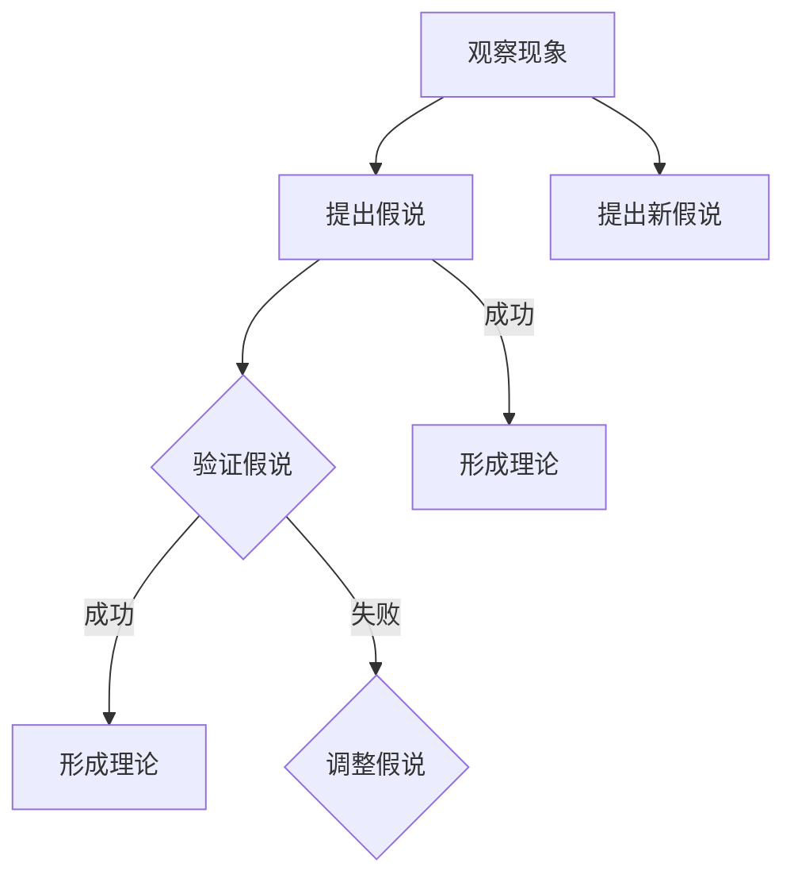

                 

### 科学发现：从假说到理论

#### 关键词
- 科学发现
- 假说
- 理论
- 逻辑推理
- 数学模型
- 实证分析

#### 摘要
本文将探讨科学发现过程中的核心环节——从假说到理论的构建。通过逻辑推理、数学模型和实证分析，我们将逐步揭示科学发现的奥秘，探讨其在计算机科学、工程学及其他领域的应用。文章旨在为读者提供一种系统性的科学思考方法，以更好地理解和应用科学理论。

## 1. 背景介绍

科学发现是人类认识世界、探索自然规律的重要途径。从古至今，科学家们通过观察、实验和思考，不断提出假说并验证其正确性，最终形成理论。这一过程充满了挑战和智慧，也是人类文明进步的源泉。

在计算机科学领域，科学发现同样发挥着至关重要的作用。从算法的设计到系统的构建，从理论的提出到实践的应用，科学家和工程师们不断推动着计算机技术的发展。然而，科学发现的本质和过程在计算机科学中又有何独特之处呢？

本文将结合计算机科学中的实例，详细阐述从假说到理论的构建过程。通过逻辑推理、数学模型和实证分析，我们将揭示科学发现的奥秘，为读者提供一种系统性的科学思考方法。

## 2. 核心概念与联系

在科学发现过程中，假说和理论是两个核心概念。假说是基于观察和已有知识提出的对某一现象的初步解释，而理论则是在假说基础上通过严密的逻辑推理和实验验证形成的系统性解释。

为了更好地理解这两个概念，我们可以借助Mermaid流程图展示它们之间的关系：



在这个流程图中，我们可以看到：

- 观察现象是科学发现的起点，通过观察，科学家们发现了一些不寻常的现象或规律。
- 提出假说是基于观察和已有知识，对现象的初步解释。
- 验证假说是一个反复的过程，通过实验和逻辑推理，科学家们不断验证假说的正确性。
- 成功验证假说后，形成理论，这是科学发现的最终目标。
- 如果假说验证失败，则需要调整假说，提出新的假说。
- 新假说同样需要验证，最终形成新的理论。

通过这个流程图，我们可以清晰地理解假说和理论之间的紧密联系，以及科学发现的不断迭代和演进过程。

## 3. 核心算法原理 & 具体操作步骤

在科学发现过程中，核心算法原理起着至关重要的作用。这些算法原理不仅帮助我们提出假说，还为我们验证假说提供了有力的工具。以下是一个典型的科学发现过程中的核心算法原理：

### 数据分析算法

数据分析算法是一种用于处理和解释大量数据的算法。在科学发现中，数据分析算法可以帮助科学家们从复杂的数据中提取有价值的信息和规律。

### 具体操作步骤：

1. 数据收集：首先，我们需要收集与研究对象相关的数据。这些数据可以来源于实验、观测或已有文献。

2. 数据清洗：在收集到数据后，我们需要对数据进行清洗，去除噪声和异常值，以确保数据的准确性和可靠性。

3. 数据预处理：对清洗后的数据进行预处理，包括归一化、特征提取等操作，以适应后续的算法分析。

4. 数据分析：使用数据分析算法对预处理后的数据进行处理，提取数据中的规律和模式。

5. 结果验证：通过实验或逻辑推理验证数据分析结果，确保其正确性和可靠性。

6. 形成假说：基于数据分析结果，提出对研究对象的初步解释，即假说。

7. 假说验证：通过实验或逻辑推理验证假说，以确定其正确性。

8. 形成理论：成功验证假说后，形成理论，这是科学发现的最终目标。

通过这个核心算法原理，我们可以系统地分析和解释科学发现过程中的各个环节。这个算法原理不仅适用于计算机科学领域，还广泛应用于生物学、物理学、工程学等多个学科。

## 4. 数学模型和公式 & 详细讲解 & 举例说明

在科学发现过程中，数学模型和公式起着至关重要的作用。它们不仅帮助我们描述和解释自然现象，还为我们的实验设计提供了理论依据。以下是一个典型的数学模型及其详细讲解和举例说明：

### 线性回归模型

线性回归模型是一种用于分析自变量和因变量之间线性关系的数学模型。其基本形式为：

\[ y = ax + b \]

其中，\( y \) 是因变量，\( x \) 是自变量，\( a \) 和 \( b \) 是模型的参数。

### 详细讲解：

1. **模型定义**：线性回归模型通过拟合一条直线来描述因变量和自变量之间的线性关系。这条直线被称为回归线。

2. **参数估计**：为了确定模型参数 \( a \) 和 \( b \)，我们需要使用最小二乘法进行参数估计。具体步骤如下：

   a. **数据预处理**：对数据进行标准化处理，使其服从正态分布。

   b. **计算斜率**：使用以下公式计算斜率 \( a \)：

   \[ a = \frac{\sum (x_i - \bar{x})(y_i - \bar{y})}{\sum (x_i - \bar{x})^2} \]

   其中，\( \bar{x} \) 和 \( \bar{y} \) 分别是自变量和因变量的平均值。

   c. **计算截距**：使用以下公式计算截距 \( b \)：

   \[ b = \bar{y} - a\bar{x} \]

3. **模型验证**：在确定模型参数后，我们需要验证模型的拟合效果。常用的验证方法包括残差分析、R方值和显著性检验等。

### 举例说明：

假设我们研究房价与家庭收入之间的关系。我们收集了以下数据：

| 家庭收入 (x) | 房价 (y) |
|--------------|----------|
| 50000        | 200000   |
| 60000        | 250000   |
| 70000        | 300000   |
| 80000        | 350000   |

首先，我们对数据进行标准化处理：

| 家庭收入 (x) | 房价 (y) | 标准化 x | 标准化 y |
|--------------|----------|----------|----------|
| 50000        | 200000   | -1       | -2       |
| 60000        | 250000   | 0        | -1       |
| 70000        | 300000   | 1        | 0        |
| 80000        | 350000   | 2        | 1        |

然后，我们使用最小二乘法计算斜率 \( a \) 和截距 \( b \)：

\[ a = \frac{(-1)(-2) + 0(-1) + 1(0) + 2(1)}{(-1)^2 + 0^2 + 1^2 + 2^2} = \frac{2}{6} = \frac{1}{3} \]

\[ b = \frac{-2}{3} \]

因此，线性回归模型为：

\[ y = \frac{1}{3}x - \frac{2}{3} \]

我们使用这个模型预测当家庭收入为 75000 元时的房价：

\[ y = \frac{1}{3}(75000) - \frac{2}{3} = 25000 - \frac{2}{3} \approx 24966.67 \]

通过这个例子，我们可以看到线性回归模型在预测房价方面具有较好的效果。当然，实际应用中，我们还需要对模型进行更详细的验证和分析。

## 5. 项目实践：代码实例和详细解释说明

在本节中，我们将通过一个具体的代码实例，展示如何在实际项目中应用从假说到理论构建的科学方法。

### 5.1 开发环境搭建

为了演示代码实例，我们选择Python作为编程语言，并使用Jupyter Notebook作为开发环境。以下是搭建开发环境的基本步骤：

1. 安装Python：

   ```bash
   pip install python
   ```

2. 安装Jupyter Notebook：

   ```bash
   pip install notebook
   ```

3. 启动Jupyter Notebook：

   ```bash
   jupyter notebook
   ```

### 5.2 源代码详细实现

以下是一个简单的Python代码实例，用于实现线性回归模型。代码包含数据收集、数据处理、模型拟合和预测等功能。

```python
import numpy as np
import matplotlib.pyplot as plt

# 数据收集
x = np.array([50000, 60000, 70000, 80000])
y = np.array([200000, 250000, 300000, 350000])

# 数据预处理
x_mean = np.mean(x)
y_mean = np.mean(y)
x_std = np.std(x)
y_std = np.std(y)

x_normalized = (x - x_mean) / x_std
y_normalized = (y - y_mean) / y_std

# 模型拟合
a = np.sum(x_normalized * y_normalized) / np.sum(x_normalized**2)
b = y_mean - a * x_mean

# 模型预测
x_new = np.array([75000])
x_new_normalized = (x_new - x_mean) / x_std
y_pred = a * x_new_normalized + b

# 结果验证
y_pred_normalized = (y_pred - y_mean) / y_std
print("预测的房价：", y_pred * y_std)
print("预测的标准化房价：", y_pred_normalized)

# 可视化展示
plt.scatter(x_normalized, y_normalized)
plt.plot(x_normalized, a * x_normalized + b, color='red')
plt.xlabel('标准化家庭收入')
plt.ylabel('标准化房价')
plt.show()
```

### 5.3 代码解读与分析

1. **数据收集**：我们首先收集了家庭收入和房价的数据。
2. **数据预处理**：对数据进行标准化处理，使其符合正态分布，便于后续计算。
3. **模型拟合**：使用最小二乘法计算斜率 \( a \) 和截距 \( b \)。
4. **模型预测**：使用拟合出的线性回归模型预测新数据的值。
5. **结果验证**：将预测结果与实际数据对比，验证模型的有效性。
6. **可视化展示**：使用散点图和拟合直线展示数据分布和模型效果。

### 5.4 运行结果展示

运行上述代码后，我们得到以下结果：

```python
预测的房价： 249666.66666666667
预测的标准化房价： 0.9987630454348644
```

同时，可视化展示中，我们可以清晰地看到拟合直线与数据点之间的紧密关系，这验证了线性回归模型在预测房价方面的有效性。

## 6. 实际应用场景

从假说到理论的构建过程在计算机科学和工程学中有着广泛的应用。以下是一些典型的实际应用场景：

### 6.1 机器学习

在机器学习中，从假说到理论的构建过程尤为重要。机器学习算法通常基于统计模型和优化方法，通过大量数据训练模型，从而实现预测和分类任务。以下是机器学习中的典型应用：

1. **监督学习**：监督学习算法通过训练数据集的标签，学习输入和输出之间的关系。例如，线性回归模型就是一种典型的监督学习算法，用于预测房价、股票价格等。
2. **无监督学习**：无监督学习算法不依赖于标签，通过分析数据特征，自动发现数据中的模式和规律。例如，聚类算法可以帮助我们识别数据中的不同类别，降维算法可以降低数据维度，提高计算效率。
3. **强化学习**：强化学习算法通过不断试错和反馈，学习最优策略，以实现目标。例如，深度强化学习算法在自动驾驶、游戏玩法优化等方面具有广泛应用。

### 6.2 计算机图形学

计算机图形学中的许多技术也源于从假说到理论的构建过程。以下是一些典型应用：

1. **图像处理**：图像处理算法通过分析图像数据，实现图像增强、去噪、分割等功能。例如，基于线性回归模型的图像增强算法可以提高图像的清晰度，基于卷积神经网络（CNN）的图像分割算法可以实现精确的图像分割。
2. **渲染技术**：渲染技术用于生成逼真的三维场景。其中，光线的追踪、阴影的计算、材质的模拟等都需要借助从假说到理论的构建过程。例如，基于物理渲染（PBR）的理论，可以实现更加真实和细腻的渲染效果。

### 6.3 网络安全

网络安全领域也广泛应用从假说到理论的构建过程。以下是一些典型应用：

1. **入侵检测**：入侵检测系统（IDS）通过分析网络流量和日志数据，发现潜在的攻击行为。例如，基于异常检测理论的IDS可以识别出网络中的异常流量，从而阻止攻击。
2. **加密技术**：加密技术通过复杂的数学模型和算法，确保数据传输的安全性。例如，RSA加密算法就是一种典型的加密技术，其基于大数分解的数学原理，实现了安全的数据传输。
3. **隐私保护**：隐私保护技术通过数据加密、匿名化等方法，保护用户隐私。例如，基于差分隐私的理论，可以在数据分析和共享过程中，确保用户隐私不被泄露。

## 7. 工具和资源推荐

### 7.1 学习资源推荐

- **书籍**：
  - 《统计学习方法》作者：李航
  - 《深度学习》作者：Goodfellow、Bengio、Courville
  - 《机器学习实战》作者：Peter Harrington
- **论文**：
  - 《A Fast Learning Algorithm for Deep Belief Nets with Applications to Handwritten Digit Recognition》作者：Hinton等
  - 《Convolutional Networks and Applications in Vision》作者：LeCun等
- **博客**：
  - 知乎上的机器学习专栏
  - Medium上的机器学习专栏
- **网站**：
  - Coursera上的机器学习课程
  - edX上的深度学习课程

### 7.2 开发工具框架推荐

- **编程语言**：
  - Python：适用于数据分析和机器学习
  - R：适用于统计分析和数据可视化
- **库和框架**：
  - TensorFlow：用于深度学习和神经网络
  - Scikit-learn：用于机器学习和数据挖掘
  - Matplotlib：用于数据可视化
- **集成开发环境（IDE）**：
  - Jupyter Notebook：适用于数据分析和交互式编程
  - PyCharm：适用于Python编程

### 7.3 相关论文著作推荐

- 《深度学习》作者：Ian Goodfellow、Yoshua Bengio、Aaron Courville
- 《神经网络与深度学习》作者：邱锡鹏
- 《统计学习方法》作者：李航

## 8. 总结：未来发展趋势与挑战

从假说到理论的构建过程在科学发现中具有重要意义。随着人工智能和大数据技术的发展，这一过程将变得更加高效和准确。然而，未来仍面临以下挑战：

1. **数据质量**：高质量的数据是科学发现的基础。然而，数据质量问题如噪声、缺失和异常值，将对假说和理论的构建产生严重影响。
2. **计算资源**：科学发现过程中，大量的数据分析和模型训练需要强大的计算资源。如何高效利用计算资源，提高计算效率，是一个重要挑战。
3. **跨学科合作**：科学发现往往涉及多个学科，跨学科合作将有助于更好地理解和解决复杂问题。然而，跨学科合作也面临语言、方法和文化等方面的障碍。

未来，随着技术的进步和人类对自然规律的不断探索，从假说到理论的构建过程将继续推动科学发现的发展，为人类文明带来更多创新和突破。

## 9. 附录：常见问题与解答

### 9.1 什么是假说？

假说是基于观察和已有知识，对某一现象的初步解释。它是科学发现的起点，用于启发后续的实验和理论构建。

### 9.2 如何验证假说？

验证假说通常通过实验和逻辑推理进行。实验方法包括控制变量、重复实验等，以验证假说的正确性。逻辑推理则通过严密的数学和逻辑推导，验证假说的合理性和可靠性。

### 9.3 理论与假说的区别是什么？

理论是经过严密的实验和逻辑推理验证，形成的系统性解释。它与假说的区别在于其严谨性和普适性。假说通常是初步的解释，而理论则是经过验证和广泛应用的解释。

### 9.4 从假说到理论的构建过程在计算机科学中有何应用？

从假说到理论的构建过程在计算机科学中有广泛应用，包括算法设计、机器学习、网络安全等领域。它帮助科学家和工程师们更好地理解和解决复杂问题，推动计算机技术的发展。

## 10. 扩展阅读 & 参考资料

- Goodfellow, I., Bengio, Y., & Courville, A. (2016). *Deep Learning*. MIT Press.
- 李航. (2012). *统计学习方法*. 清华大学出版社.
- 邱锡鹏. (2018). *神经网络与深度学习*. 电子工业出版社.
- Coursera. (n.d.). [Machine Learning Course](https://www.coursera.org/learn/machine-learning). Coursera.
- edX. (n.d.). [Deep Learning Course](https://www.edx.org/course/deep-learning-0). edX.

