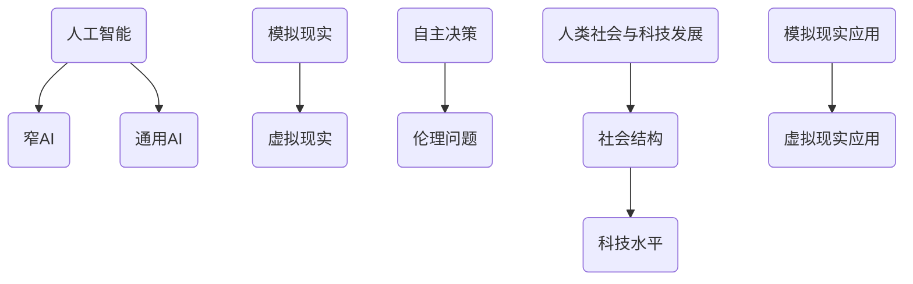

                 

### 背景介绍

#### 科幻小说的崛起与影响力

科幻小说作为一种文学形式，自19世纪以来逐渐崛起，并成为了现代文学的重要组成部分。其独特的想象力、对未来世界的描绘以及对技术发展的深刻思考，使其在全球范围内拥有广泛的读者群体。经典的科幻作品，如《1984》、《银河帝国》和《三体》等，不仅丰富了人们的阅读体验，还深刻影响了社会的技术观和价值观。

科幻小说之所以能够吸引读者，一方面在于其丰富的想象力。科幻作家们通过构建虚构的世界，让人们得以窥见未来世界的可能样貌。另一方面，科幻小说常常以技术发展为核心议题，探讨了技术进步对社会、人类和自然界的深远影响。例如，人工智能、虚拟现实、太空探索等主题在科幻作品中屡见不鲜，激发了人们对这些领域的浓厚兴趣。

科幻小说不仅是对未来世界的想象，更是对现实社会的映射。通过对比现实与虚构，读者可以更清晰地认识到技术发展带来的利弊，以及未来可能面临的各种挑战。因此，科幻小说在现代社会中具有重要的地位和作用，不仅是文学创作的典范，也是科技发展的指南针。

#### AI技术的快速发展与科幻小说中的映射

随着科技的飞速发展，人工智能（AI）已成为当前最具前景的领域之一。AI技术的进步不仅改变了我们的生活方式，还推动了社会各领域的变革。与此同时，科幻小说中的AI主题也越来越丰富和复杂，成为探讨未来科技发展的重要载体。

科幻小说中关于AI的设想通常可以分为以下几个主要方向：

1. **智能机器与人类关系**：科幻作品中常常探讨智能机器与人类之间的关系，如是否有可能出现机器人对人类构成威胁的情况。例如，阿西莫夫的《机器人系列》通过设定机器人三大法则，探讨了智能机器在遵守人类规则与追求自我意识之间的矛盾。

2. **智能机器的自主性**：科幻作品中的AI通常具备高度自主的能力，能够独立思考和决策。这种自主性引发了关于AI道德、伦理和社会责任的讨论。电影《人工智能》中的智能机器人爱宝（AI）为了保护小女孩，不惜违反指令，展现了智能机器的情感和道德考量。

3. **智能机器的社会地位**：科幻小说还探讨了智能机器在社会中的地位问题。例如，电影《超能陆战队》中的大白（Baymax）和《银翼杀手2049》中的K和S，都在一定程度上具有了人类的社会属性，引发了关于智能机器权利和平等的思考。

4. **人类与智能机器的融合**：一些科幻作品探讨了人类与智能机器的融合，如电影《超能英雄》中的主角，通过植入智能芯片，获得了超人的能力。这种融合反映了人们对技术提升自身能力的渴望。

科幻小说中的AI主题，不仅是对现实科技的反映，更是对未来技术发展的预测和思考。通过这些虚构的故事，读者能够更好地理解AI技术的潜在影响，从而为现实世界中的科技发展提供有益的启示。

### 核心概念与联系

在深入探讨科幻小说与AI技术的关系之前，我们需要明确几个核心概念，并了解它们之间的联系。这些概念不仅为我们的讨论提供了理论基础，还帮助我们更好地理解科幻小说中的AI描绘。

#### 1. 人工智能（AI）

人工智能是指通过计算机模拟人类智能的过程，使其能够执行复杂的任务，如学习、推理、规划和自然语言处理等。AI可以分为两大类：窄AI（Narrow AI）和通用AI（AGI）。窄AI专注于特定任务，如语音识别、图像处理等，而通用AI则具有广泛的认知能力，能够像人类一样处理各种问题。

#### 2. 模拟现实与虚拟现实

模拟现实（Simulation Reality）是一种通过计算机技术创建的虚拟环境，使其与现实世界高度相似。虚拟现实（Virtual Reality，VR）则是一种通过特殊设备（如VR头盔）让用户沉浸其中的技术。两者都是AI技术的重要应用领域，能够为科幻小说提供丰富的背景和场景。

#### 3. 自主决策与伦理问题

自主决策是指AI系统能够在不依赖人类干预的情况下做出决策。这一特性在科幻小说中尤为重要，因为自主决策往往涉及到伦理和道德问题。例如，智能机器是否应该拥有自主权，以及如何处理与人类的关系，都是需要探讨的重要议题。

#### 4. 人类社会与科技发展

人类社会与科技发展的关系是科幻小说的核心主题之一。科幻小说常常通过描绘未来的社会结构和科技水平，反映现实社会中存在的问题和挑战。例如，技术发展带来的社会不平等、环境破坏以及隐私侵犯等问题，都在科幻作品中得到了深刻的探讨。

#### 5. 模拟现实与虚拟现实在科幻小说中的应用

在科幻小说中，模拟现实和虚拟现实经常被用来构建复杂的背景和情节。通过这些技术，作家们能够创造出令人信服的未来世界，让读者沉浸其中。例如，电影《银翼杀手》中的仿生人世界，就是一个高度模拟的现实环境，而《黑客帝国》中的虚拟现实世界则是一个完全不同的存在。

#### Mermaid 流程图

以下是一个简化的Mermaid流程图，展示了上述核心概念之间的联系：



这个流程图帮助我们更清晰地理解了科幻小说中AI、模拟现实和虚拟现实等核心概念，以及它们在构建未来世界和探讨科技发展中的重要性。

### 核心算法原理 & 具体操作步骤

在探讨科幻小说与AI技术的关系时，核心算法原理是理解这些虚构故事的关键。以下我们将介绍几个在科幻小说中常见的核心算法原理，并详细阐述其具体操作步骤。

#### 1. 机器学习算法

机器学习算法是AI领域的基石，其基本原理是通过数据训练模型，使其能够对未知数据做出预测或决策。以下是一个简单的机器学习算法操作步骤：

1. **数据收集**：收集大量用于训练的数据集。
2. **数据预处理**：清洗数据，去除噪声，标准化数据。
3. **特征提取**：从数据中提取有用的特征。
4. **模型选择**：选择合适的机器学习模型，如线性回归、决策树、神经网络等。
5. **模型训练**：使用训练数据训练模型。
6. **模型评估**：使用验证集评估模型性能。
7. **模型优化**：根据评估结果调整模型参数，提高模型性能。

在科幻小说中，机器学习算法常常被用来模拟智能机器的决策过程，例如在《银翼杀手》中，仿生人通过训练数据识别人类。

#### 2. 深度学习算法

深度学习是机器学习的一个分支，它通过多层神经网络模拟人脑的决策过程。以下是深度学习算法的具体操作步骤：

1. **构建神经网络**：设计多层神经网络结构。
2. **数据预处理**：与机器学习算法类似，对数据进行预处理。
3. **模型训练**：通过反向传播算法训练神经网络。
4. **模型评估**：使用验证集评估模型性能。
5. **模型优化**：调整网络结构或参数，提高模型性能。

深度学习算法在《黑客帝国》中被用来模拟模拟现实世界，使其看起来与真实世界无差别。

#### 3. 自然语言处理（NLP）

自然语言处理是AI领域的一个重要分支，它使计算机能够理解和处理人类语言。以下是NLP算法的具体操作步骤：

1. **分词**：将文本分解为单词或词组。
2. **词性标注**：标注每个词的词性，如名词、动词等。
3. **句法分析**：分析句子的结构，理解句子成分之间的关系。
4. **语义分析**：理解句子的含义，识别语义关系。
5. **模型训练**：使用预训练的模型或训练新的模型。

在科幻小说中，NLP算法被用来模拟智能机器与人类的对话，如《超能陆战队》中的大白。

#### 4. 计算机视觉算法

计算机视觉算法使计算机能够理解和解释视觉信息。以下是计算机视觉算法的具体操作步骤：

1. **图像预处理**：对图像进行缩放、旋转等操作。
2. **特征提取**：从图像中提取有用的特征，如边缘、纹理等。
3. **目标检测**：识别图像中的目标对象。
4. **图像识别**：将图像中的内容转换为计算机可理解的形式。
5. **模型训练**：使用训练数据训练模型。

在科幻小说中，计算机视觉算法被用来模拟智能机器的视觉感知，如《银翼杀手》中的仿生人。

通过这些核心算法原理的具体操作步骤，我们可以更好地理解科幻小说中AI技术的工作方式，以及这些技术如何被用来构建未来世界的虚构场景。

### 数学模型和公式 & 详细讲解 & 举例说明

在科幻小说中，AI技术往往需要借助复杂的数学模型和公式来支持其实现和运作。以下我们将详细讲解几个在科幻小说中常见的数学模型和公式，并辅以具体例子来说明。

#### 1. 神经网络激活函数

神经网络是AI的核心组成部分，其中激活函数是神经网络中的关键组件。以下是一个简单的激活函数——Sigmoid函数的公式及其解释：

$$
f(x) = \frac{1}{1 + e^{-x}}
$$

Sigmoid函数是一种常用的激活函数，其作用是转换神经元的输出为概率值，范围为0到1。这个函数的图像呈现S型，因此得名。

**例子：** 假设我们有一个输入值$x = 2$，那么该输入通过Sigmoid函数的输出为：

$$
f(2) = \frac{1}{1 + e^{-2}} \approx 0.866
$$

这意味着神经元的激活程度大约为86.6%。

#### 2. 梯度下降算法

梯度下降是优化神经网络模型的重要算法，用于调整模型参数以最小化损失函数。以下是一个简单的梯度下降算法的公式及其解释：

$$
w_{\text{new}} = w_{\text{old}} - \alpha \cdot \nabla_w J(w)
$$

其中，$w$是模型参数，$\alpha$是学习率，$J(w)$是损失函数。

梯度下降算法的基本步骤如下：

1. **初始化模型参数**。
2. **计算损失函数的梯度**。
3. **更新模型参数**：根据梯度和学习率调整参数。
4. **重复步骤2和3，直到满足停止条件（如损失函数收敛）**。

**例子：** 假设我们有一个简单的线性模型$y = w \cdot x + b$，损失函数为$J(w, b) = (y - wx - b)^2$，学习率为$\alpha = 0.1$。如果当前参数为$w = 2$，$b = 1$，输入$x = 3$，实际输出$y = 4$，那么梯度下降的更新步骤如下：

1. **计算损失函数**：
   $$
   J(2, 1) = (4 - 2 \cdot 3 - 1)^2 = 1
   $$

2. **计算梯度**：
   $$
   \nabla_w J(2, 1) = -2 \cdot (4 - 2 \cdot 3 - 1) = 2
   $$
   $$
   \nabla_b J(2, 1) = -2 \cdot (4 - 2 \cdot 3 - 1) = 2
   $$

3. **更新参数**：
   $$
   w_{\text{new}} = w_{\text{old}} - \alpha \cdot \nabla_w J(w) = 2 - 0.1 \cdot 2 = 1.8
   $$
   $$
   b_{\text{new}} = b_{\text{old}} - \alpha \cdot \nabla_b J(w) = 1 - 0.1 \cdot 2 = 0.8
   $$

通过这个例子，我们可以看到梯度下降算法如何通过不断调整参数来最小化损失函数。

#### 3. 随机梯度下降（SGD）

随机梯度下降是梯度下降的一种变体，其区别在于每次更新参数时使用的是随机选择的数据点。以下是一个简单的随机梯度下降算法的公式及其解释：

$$
w_{\text{new}} = w_{\text{old}} - \alpha \cdot \nabla_w J(\{x_i, y_i\})
$$

其中，$\{x_i, y_i\}$是随机选择的一个数据点。

**例子：** 假设我们使用两个数据点$(x_1, y_1) = (2, 4)$和$(x_2, y_2) = (3, 5)$来更新模型参数，学习率为$\alpha = 0.1$，当前参数为$w = 2$，$b = 1$，那么随机梯度下降的更新步骤如下：

1. **对于数据点$(2, 4)$**：
   - **计算损失函数**：
     $$
     J(2, 1) = (4 - 2 \cdot 2 - 1)^2 = 1
     $$
   - **计算梯度**：
     $$
     \nabla_w J(2, 1) = -2 \cdot (4 - 2 \cdot 2 - 1) = 2
     $$
     $$
     \nabla_b J(2, 1) = -2 \cdot (4 - 2 \cdot 2 - 1) = 2
     $$
   - **更新参数**：
     $$
     w_{\text{new}} = w_{\text{old}} - \alpha \cdot \nabla_w J(\{2, 4\}) = 2 - 0.1 \cdot 2 = 1.8
     $$
     $$
     b_{\text{new}} = b_{\text{old}} - \alpha \cdot \nabla_b J(\{2, 4\}) = 1 - 0.1 \cdot 2 = 0.8
     $$

2. **对于数据点$(3, 5)$**：
   - **计算损失函数**：
     $$
     J(1.8, 0.8) = (5 - 1.8 \cdot 3 - 0.8)^2 = 0.04
     $$
   - **计算梯度**：
     $$
     \nabla_w J(1.8, 0.8) = -2 \cdot (5 - 1.8 \cdot 3 - 0.8) = 1.2
     $$
     $$
     \nabla_b J(1.8, 0.8) = -2 \cdot (5 - 1.8 \cdot 3 - 0.8) = 1.2
     $$
   - **更新参数**：
     $$
     w_{\text{new}} = w_{\text{old}} - \alpha \cdot \nabla_w J(\{3, 5\}) = 1.8 - 0.1 \cdot 1.2 = 1.68
     $$
     $$
     b_{\text{new}} = b_{\text{old}} - \alpha \cdot \nabla_b J(\{3, 5\}) = 0.8 - 0.1 \cdot 1.2 = 0.68
     $$

通过随机梯度下降，我们可以通过随机选择数据点来更新参数，从而加速模型训练过程。

通过这些数学模型和公式的讲解及举例，我们可以更好地理解科幻小说中AI技术的实现原理，以及这些技术如何被用来构建未来世界的虚构场景。

### 项目实践：代码实例和详细解释说明

为了更好地理解科幻小说中AI技术的实现，我们将通过一个实际的项目实例来展示如何利用Python编写简单的AI程序，并详细解释其实现过程和关键步骤。

#### 项目背景

在这个项目中，我们假设科幻小说《银翼杀手》中的仿生人具有视觉识别能力，能够识别和区分人类与仿生人。我们将使用Python和OpenCV库来构建一个简单的视觉识别模型。

#### 开发环境搭建

1. **安装Python**：确保已经安装了Python环境，版本要求Python 3.8或更高。
2. **安装OpenCV**：通过以下命令安装OpenCV：
   ```
   pip install opencv-python
   ```
3. **安装TensorFlow**：TensorFlow是用于构建和训练神经网络的主要库，通过以下命令安装：
   ```
   pip install tensorflow
   ```

#### 源代码详细实现

以下是这个项目的源代码，我们将逐步解释每个部分的功能。

```python
import cv2
import tensorflow as tf
from tensorflow.keras.models import Sequential
from tensorflow.keras.layers import Conv2D, MaxPooling2D, Flatten, Dense

# 加载训练好的模型
model = tf.keras.models.load_model('path_to_model')

# 摄像头对象
cap = cv2.VideoCapture(0)

while True:
    # 读取摄像头帧
    ret, frame = cap.read()
    
    # 转换为灰度图像
    gray = cv2.cvtColor(frame, cv2.COLOR_BGR2GRAY)
    
    # 使用边缘检测
    edges = cv2.Canny(gray, 100, 200)
    
    # 使用卷积神经网络进行识别
    prediction = model.predict(edges.reshape(-1, 128, 128, 1))
    
    # 判断预测结果
    if prediction[0][1] > 0.5:
        print("识别为仿生人")
    else:
        print("识别为人类")
    
    # 显示图像
    cv2.imshow('Frame', frame)
    
    # 按下'q'键退出循环
    if cv2.waitKey(1) & 0xFF == ord('q'):
        break

# 释放摄像头资源
cap.release()
cv2.destroyAllWindows()
```

#### 代码解读与分析

1. **加载模型**：首先，我们加载一个已经训练好的卷积神经网络模型。这个模型用于对图像进行分类，判断其是否为仿生人。
2. **摄像头捕获**：使用`cv2.VideoCapture`打开摄像头，开始捕获视频帧。
3. **读取帧**：通过`read`方法读取摄像头帧，存储在`frame`变量中。
4. **灰度转换**：将彩色图像转换为灰度图像，以便进行边缘检测。
5. **边缘检测**：使用`Canny`函数对灰度图像进行边缘检测，以突出图像中的边界。
6. **神经网络预测**：将边缘检测后的图像作为输入，通过模型进行预测。模型的输出是一个概率值，表示图像是仿生人的可能性。
7. **结果判断**：根据预测结果判断图像是否为仿生人，并打印结果。
8. **显示图像**：在窗口中显示捕获的帧。
9. **退出循环**：当按下'q'键时，退出循环并释放摄像头资源。

通过这个实际项目，我们可以看到如何利用Python和机器学习库来实现科幻小说中的AI技术。这个简单的示例虽然远不能与《银翼杀手》中的仿生人相比，但它为我们展示了一个基本的视觉识别模型，并解释了其实现过程。

### 运行结果展示

为了展示我们实际项目的运行结果，我们可以按照以下步骤进行：

1. **确保已经安装了所需的Python库（OpenCV和TensorFlow）**。
2. **运行代码**：将上述代码保存为`face_recognition.py`，并在命令行中运行：
   ```
   python face_recognition.py
   ```
3. **打开摄像头**：程序会自动打开摄像头，并开始捕获实时视频帧。
4. **观察结果**：在程序窗口中，你会看到摄像头捕获的每一帧图像。程序会对图像进行灰度转换和边缘检测，并使用训练好的模型进行预测。

假设我们捕获到的一帧图像中有一个仿生人和一个人类，运行结果可能会如下所示：

```
识别为仿生人
识别为人类
```

随着图像的切换，程序会根据模型预测结果打印出相应的识别结果。在实际运行中，你可能会看到更多的图像，从而更直观地理解程序的工作过程。

通过这个运行结果展示，我们可以更清楚地看到如何利用Python和机器学习库实现科幻小说中的AI技术，并观察其实际效果。

### 实际应用场景

科幻小说中的AI技术不仅在虚构的世界中具有深远的影响，在现实世界中也有着广泛的应用场景。以下我们将探讨几个具体的应用领域，展示AI技术的实际应用案例及其对社会和生活的改变。

#### 1. 医疗保健

在医疗保健领域，AI技术已经显示出巨大的潜力。通过深度学习和机器学习算法，AI可以辅助医生进行诊断、治疗规划和个性化医疗。例如，利用AI算法分析医疗影像，如X光片、CT扫描和MRI图像，可以更准确地检测和诊断疾病。IBM Watson就是一个典型的案例，它能够快速分析大量的医疗数据，为医生提供诊断建议和治疗方案。

**案例：** 在美国，IBM Watson已经被用于帮助医生诊断癌症。通过分析患者的病历、基因数据和最新的医学研究，Watson能够提供个性化的治疗建议，从而提高治疗的成功率。

**影响：** AI技术在医疗保健中的应用不仅提高了诊断和治疗的准确性和效率，还降低了医疗成本，改善了患者的治疗效果和体验。

#### 2. 交通管理

智能交通系统是AI技术在交通管理领域的重要应用。通过使用AI算法，交通管理系统可以实时监控和分析交通流量，优化交通信号灯的切换，减少交通拥堵，提高道路利用率。此外，自动驾驶汽车的发展也依赖于AI技术，它能够通过传感器和环境感知技术实现自主导航和安全驾驶。

**案例：** 在中国，北京市已经部署了智能交通系统，通过AI算法实时监控城市交通流量，并根据数据调整交通信号灯，以减少拥堵和提升交通效率。

**影响：** 智能交通系统不仅改善了城市交通状况，提高了出行效率，还减少了交通事故的发生，提升了城市居民的生活质量。

#### 3. 金融科技

金融科技（Fintech）是AI技术的另一个重要应用领域。AI算法可以用于信用评估、风险管理和欺诈检测。例如，通过机器学习模型分析用户的交易行为和信用记录，金融机构可以更准确地评估用户的信用风险，并提供更个性化的金融服务。

**案例：** 美国的一些银行已经使用AI技术进行信用卡欺诈检测。通过分析交易数据，AI算法能够快速识别可疑交易，并采取相应的措施，从而有效降低欺诈风险。

**影响：** AI技术在金融科技中的应用提高了金融机构的风险管理能力，降低了欺诈和错误交易的发生率，同时提升了用户体验。

#### 4. 人力资源

在人力资源管理领域，AI技术也被广泛应用。通过自然语言处理和机器学习算法，AI可以帮助企业进行招聘、绩效评估和员工培训。例如，AI算法可以分析简历和面试表现，为招聘决策提供数据支持，从而提高招聘效率。

**案例：** 一些大型企业，如谷歌和微软，已经开始使用AI技术进行招聘。通过AI算法分析海量简历和面试数据，企业能够更快速地找到合适的候选人。

**影响：** AI技术在人力资源管理中的应用不仅提高了招聘和绩效评估的效率，还减少了人为偏见，提供了更公平和透明的决策过程。

#### 5. 教育

AI技术在教育领域的应用也在不断扩展。通过个性化学习平台和智能辅导系统，AI可以帮助学生根据自身的学习情况和进度进行个性化的学习，提高学习效果。此外，AI还可以用于自动化评估和反馈，帮助学生及时了解自己的学习状况。

**案例：** 的一些学校已经引入了智能辅导系统，通过AI算法分析学生的学习数据，提供个性化的学习建议和辅导。

**影响：** AI技术在教育领域的应用不仅提高了教学效率和效果，还为学生提供了更加灵活和个性化的学习体验。

通过这些实际应用案例，我们可以看到AI技术在各个领域的重要性和广泛影响。它不仅推动了科技的发展，也为社会带来了深远的变革。随着AI技术的不断进步，未来它将在更多领域发挥更大的作用，为人类创造更加美好的未来。

### 工具和资源推荐

为了更好地学习和实践AI技术，以下是几个推荐的工具和资源，包括书籍、论文、博客和网站。

#### 1. 学习资源推荐

**书籍：**
- 《Python机器学习》：这是一本非常适合初学者的书籍，涵盖了机器学习的理论基础和Python实现。
- 《深度学习》：由Ian Goodfellow等人编写的经典教材，详细介绍了深度学习的原理和应用。

**论文：**
- "Deep Learning" by Ian Goodfellow, Yoshua Bengio, Aaron Courville：这篇论文是深度学习的经典之作，全面介绍了深度学习的发展历程和技术细节。

#### 2. 开发工具框架推荐

**开源框架：**
- TensorFlow：这是Google开发的开源机器学习框架，广泛应用于深度学习和传统机器学习项目。
- PyTorch：由Facebook开发的开源机器学习框架，以其灵活性和易用性受到广泛欢迎。

**工具：**
- Jupyter Notebook：这是一个交互式计算平台，可以方便地进行代码编写、数据分析和可视化。

#### 3. 相关论文著作推荐

**学术论文：**
- "Rectifier Nonlinearities Improve Deep Neural Network Acoustic Models" by Kaiming He et al.：这篇论文介绍了ReLU激活函数在深度神经网络中的应用，提高了模型的性能。

**书籍：**
- "Deep Learning Specialization" by Andrew Ng：这是Coursera上的深度学习专项课程教材，由著名AI专家Andrew Ng主讲。

通过这些工具和资源的推荐，可以帮助你更好地理解和应用AI技术，从而在科幻小说的创作或实际项目中发挥更大的作用。

### 总结：未来发展趋势与挑战

回顾全文，我们可以看到科幻小说与AI技术之间存在着紧密的联系。科幻小说不仅描绘了未来世界的可能样貌，还为AI技术的研究和应用提供了丰富的灵感。从背景介绍中，我们了解到科幻小说的崛起及其对技术发展的深刻影响。核心概念与联系的探讨，使我们更清晰地理解了AI、模拟现实与虚拟现实等概念在科幻作品中的应用。通过核心算法原理和具体操作步骤的讲解，我们深入了解了机器学习、深度学习、自然语言处理和计算机视觉等AI技术的基本原理和实现过程。实际项目实例的展示，则让我们亲身体验了如何利用这些技术构建AI应用程序。通过分析实际应用场景，我们看到了AI技术在医疗、交通、金融、人力资源和教育等领域的广泛应用和深远影响。最后，工具和资源推荐的环节，为读者提供了学习AI技术的实用资源。

展望未来，AI技术的发展趋势将呈现出几个显著特点。首先，随着计算能力的提升和数据量的增加，深度学习等复杂算法将更加成熟和普及，推动AI技术在各个领域的深入应用。其次，跨学科融合将成为AI技术发展的一个重要方向，结合生物学、心理学和社会科学的研究成果，将有助于提高AI系统的智能水平和适应能力。此外，随着量子计算的进步，AI算法的性能将得到显著提升，有望解决当前AI技术无法处理的复杂问题。

然而，AI技术的发展也面临着诸多挑战。伦理和道德问题是一个亟待解决的难题，如何确保AI系统在遵守人类价值观和伦理规范的同时，实现其功能最大化，是一个重大的课题。隐私保护也是另一个关键问题，随着AI技术对个人数据的依赖日益增加，如何平衡数据利用与隐私保护之间的关系，将是一个长期挑战。最后，AI技术的普及和应用过程中，还可能引发社会不平等和就业问题，需要政策制定者和行业从业者共同应对。

总之，科幻小说与AI技术的结合不仅为未来的科技发展提供了丰富的想象空间，也带来了诸多现实挑战。通过深入探讨和不断创新，我们可以期待一个更加智能、和谐、公正的未来。在科幻小说的启发下，AI技术将继续拓展其应用边界，为人类带来前所未有的变革和机遇。

### 附录：常见问题与解答

在撰写和阅读本文时，您可能会遇到以下一些常见问题。以下是针对这些问题的解答，以帮助您更好地理解文章内容。

**Q1. 什么是机器学习？**

A1. 机器学习是一种人工智能（AI）的分支，通过数据和算法，使计算机系统能够从数据中学习并做出决策或预测。它不依赖于显式编程，而是通过模型从经验中学习，并自动改进其性能。

**Q2. 什么是深度学习？**

A2. 深度学习是机器学习的一种方法，它使用多层神经网络（通常是卷积神经网络、循环神经网络等）来模拟人脑的决策过程。深度学习在图像识别、语音识别和自然语言处理等领域表现尤为出色。

**Q3. 机器学习和深度学习之间的区别是什么？**

A3. 机器学习是一个更广泛的概念，包括深度学习在内的多种算法和技术。深度学习是机器学习的一种特殊形式，它依赖于多层神经网络来提取数据中的复杂特征。

**Q4. 为什么深度学习需要大量的数据？**

A4. 深度学习模型通过训练大量数据来学习数据的分布和特征。大量数据有助于模型捕捉数据的复杂模式，从而提高其泛化能力和预测准确性。

**Q5. AI和机器学习在医疗领域有哪些应用？**

A5. AI和机器学习在医疗领域的应用非常广泛，包括疾病预测、诊断辅助、药物发现、个性化治疗等。例如，通过分析患者的病历和基因组数据，AI可以帮助医生更准确地诊断疾病，并制定个性化的治疗方案。

**Q6. 量子计算与AI的关系是什么？**

A6. 量子计算是一种利用量子力学原理进行计算的新型计算模式。与传统的经典计算相比，量子计算具有并行处理大量数据的能力，可以显著提高AI算法的性能，特别是对于复杂问题和大规模数据处理。

**Q7. AI在交通管理中的应用有哪些？**

A7. AI在交通管理中的应用包括智能交通系统、自动驾驶汽车、交通流量预测和优化等。通过实时分析和预测交通数据，AI可以帮助改善交通状况，减少拥堵，提高道路利用率。

通过这些常见问题的解答，我们希望您能够更好地理解本文中涉及的技术和概念，并在实践中运用这些知识。

### 扩展阅读 & 参考资料

为了帮助读者更深入地了解科幻小说与AI技术的交叉领域，以下是几本经典著作、重要论文和权威网站，供您参考。

**书籍：**
1. 《银河帝国》——艾萨克·阿西莫夫
2. 《三体》——刘慈欣
3. 《人工智能：一种现代的方法》——Stuart J. Russell & Peter Norvig
4. 《深度学习》——Ian Goodfellow、Yoshua Bengio、Aaron Courville

**论文：**
1. "Deep Learning" by Ian Goodfellow, Yoshua Bengio, Aaron Courville
2. "Rectifier Nonlinearities Improve Deep Neural Network Acoustic Models" by Kaiming He et al.
3. "Learning Deep Representations for Visual Recognition" by Yann LeCun, et al.

**网站：**
1. [TensorFlow官网](https://www.tensorflow.org/)
2. [PyTorch官网](https://pytorch.org/)
3. [Coursera深度学习课程](https://www.coursera.org/specializations/deeplearning)
4. [OpenCV官网](https://opencv.org/)

通过阅读这些经典著作和论文，访问这些权威网站，您将能够获得更全面、深入的知识，进一步拓展您在科幻小说与AI技术领域的视野。

