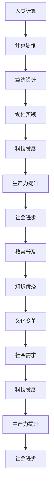

                 

### 文章标题：科技与社会：人类计算的双重影响

> **关键词：** 科技发展、社会影响、人类计算、双重影响、未来展望

**摘要：**
本文旨在探讨科技发展对人类社会带来的双重影响。一方面，科技的进步极大地提高了生产效率，推动了经济发展和社会进步；另一方面，科技的快速发展也带来了诸如隐私泄露、算法歧视、数字鸿沟等负面问题。本文将逐步分析科技与社会之间的关系，探讨其在未来可能面临的挑战和机遇。

### 1. 背景介绍

#### 1.1 科技发展的历史回顾

自人类文明诞生以来，科技发展一直扮演着重要角色。从古代的农业革命到工业革命，再到现代的信息技术革命，科技的每一次进步都深刻地改变了人类社会。

- **农业革命**：大约在公元前10000年左右，人类开始从狩猎采集过渡到农业社会。农业的发展使人类能够生产更多的粮食，人口得以快速增长，社会结构逐渐复杂化。

- **工业革命**：18世纪末至19世纪初，工业革命的爆发极大地提高了生产效率，推动了城市化进程和工业化发展。蒸汽机、纺织机等机械设备的应用，使人类从繁重的体力劳动中解放出来。

- **信息技术革命**：20世纪后半叶，随着计算机和互联网的普及，信息技术革命迅速展开。计算机技术、互联网技术、移动通信技术等新兴技术的应用，使得信息的获取、传递和处理变得更加便捷和高效。

#### 1.2 科技对现代社会的影响

科技的进步不仅改变了生产方式，还极大地改变了人们的生活方式。以下是科技对现代社会的一些主要影响：

- **经济影响**：科技的发展促进了生产力的提升，降低了生产成本，提高了产品质量，从而推动了经济的快速发展。

- **社会影响**：科技改变了人们的社交方式、娱乐方式和工作方式。例如，社交媒体的兴起使得人与人之间的交流更加便捷，但同时也带来了一些负面影响，如信息过载、隐私泄露等。

- **环境影响**：科技的发展在带来便利的同时，也对环境产生了一定的影响。例如，工业化进程带来的空气污染、水资源污染等问题，已成为全球性的环境挑战。

### 2. 核心概念与联系

#### 2.1 人类计算的概念

人类计算（Human Computing）是指人类利用计算思维解决问题的过程。它涵盖了计算理论、算法设计、编程实践等多个方面。人类计算的核心是计算思维，即通过抽象、分解、模式识别等方式，将复杂问题转化为可计算的问题。

#### 2.2 科技与社会的关系

科技与社会之间的关系可以看作是一种相互作用的关系。科技的发展推动了社会的进步，而社会的需求又促进了科技的进一步发展。以下是科技与社会之间的几个关键联系：

- **生产力与生产关系**：科技的发展提高了生产力，改变了生产关系。例如，工业革命时期的机械化生产，使得生产效率大幅提高，传统手工业逐渐被机器取代。

- **教育与知识传播**：科技的发展促进了教育的普及和知识的传播。互联网技术的普及使得人们可以方便地获取全球范围内的知识和信息，从而推动了社会的进步。

- **文化与价值观**：科技的发展也改变了人们的文化和价值观。例如，互联网的普及使得人们的生活方式、消费观念等发生了很大变化，从而影响了社会的文化发展。

#### 2.3 Mermaid 流程图

以下是一个简化的Mermaid流程图，展示了人类计算与科技发展的关系：



### 3. 核心算法原理 & 具体操作步骤

#### 3.1 人类计算的核心算法

人类计算的核心算法包括计算思维、算法设计和编程实践。以下分别介绍这三个方面的核心原理和操作步骤：

#### 3.1.1 计算思维

计算思维是一种解决问题的思维方式，它包括以下几个方面：

- **抽象化**：将复杂问题简化为简单的模型，以便于分析和解决。

- **分解**：将复杂问题分解为若干个子问题，然后分别解决。

- **模式识别**：通过识别问题中的模式和规律，找出解决问题的方法。

- **递归**：将问题分解为更小的问题，然后递归解决。

操作步骤：

1. 确定问题：明确需要解决的问题是什么。

2. 抽象化：将问题简化为简单的模型。

3. 分解：将问题分解为若干个子问题。

4. 模式识别：识别问题中的模式和规律。

5. 递归：对子问题进行递归解决。

#### 3.1.2 算法设计

算法设计是解决问题的关键。一个好的算法应该具有高效、简洁和易于理解的特点。

操作步骤：

1. 确定问题：明确需要解决的问题是什么。

2. 选择算法策略：根据问题的特点选择合适的算法策略。

3. 设计算法框架：设计算法的基本框架，包括输入、处理和输出。

4. 实现算法：根据算法框架实现具体的算法。

5. 优化算法：对算法进行优化，提高其效率和性能。

#### 3.1.3 编程实践

编程实践是将算法转化为可执行代码的过程。

操作步骤：

1. 选择编程语言：根据问题的特点和需求选择合适的编程语言。

2. 编写代码：根据算法设计编写代码。

3. 测试代码：对代码进行测试，确保其正确性和稳定性。

4. 调试代码：对代码进行调试，解决出现的问题。

5. 优化代码：对代码进行优化，提高其效率和性能。

### 4. 数学模型和公式 & 详细讲解 & 举例说明

#### 4.1 数学模型的概念

数学模型是一种用数学语言描述现实世界的抽象模型。它是解决实际问题的重要工具。

#### 4.2 数学模型的构建方法

构建数学模型通常包括以下几个步骤：

1. 确定问题：明确需要解决的问题是什么。

2. 提取信息：从问题中提取关键信息，构建初始模型。

3. 确定变量：确定模型中的变量，包括输入变量和输出变量。

4. 建立关系：根据问题中的约束条件和目标，建立变量之间的关系。

5. 优化模型：对模型进行优化，提高其准确性和适用性。

#### 4.3 数学模型的举例

以优化问题为例，我们考虑以下问题：

**问题：** 某公司需要从两个不同的供应商A和B购买零件，供应商A的报价为每件100元，供应商B的报价为每件120元。公司每月需要购买1000件零件。请设计一个数学模型，确定从哪个供应商购买零件可以使得总成本最小。

**解法：**

1. **确定问题**：需要确定从哪个供应商购买零件使得总成本最小。

2. **提取信息**：供应商A的报价为每件100元，供应商B的报价为每件120元。公司每月需要购买1000件零件。

3. **确定变量**：设购买供应商A的零件数量为x，购买供应商B的零件数量为y。

4. **建立关系**：
   - 成本函数：总成本 = 100x + 120y
   - 约束条件：x + y = 1000

5. **优化模型**：
   - 目标函数：最小化总成本，即最小化100x + 120y
   - 约束条件：x + y = 1000

我们可以使用线性规划方法来求解这个问题。线性规划的目标是找到一组变量值，使得目标函数在满足约束条件的情况下达到最小值。

#### 4.4 线性规划算法

线性规划是一种数学优化方法，用于求解线性目标函数在给定线性约束条件下的最优解。

线性规划的一般形式如下：

$$
\begin{aligned}
\min\ & c^T x \\
\text{subject to} & Ax \leq b \\
& x \geq 0
\end{aligned}
$$

其中，$c$ 是系数向量，$x$ 是变量向量，$A$ 是约束矩阵，$b$ 是约束向量。

线性规划可以通过单纯形法、内点法等多种算法求解。

#### 4.5 举例说明

我们使用单纯形法求解上述优化问题。

1. **建立初始单纯形表**：

| 基变量 | x | y |  
| --- | --- | --- |  
| x1 | 1 | 0 |  
| x2 | 0 | 1 |  
| z-c | -100 | -120 |  
| Z | 0 | 0 |

2. **计算检验数**：

| 基变量 | x | y |  
| --- | --- | --- |  
| x1 | 1 | 0 |  
| x2 | 0 | 1 |  
| z-c | -100 | -120 |  
| Z | 0 | 0 |  
| C1 | 0 | 0 |  
| C2 | 100 | 120 |

检验数 = $C2 - C1 \times x2 = 120 - 0 \times 0 = 120$

由于检验数大于0，说明当前解不是最优解。

3. **选择进入变量和离开变量**：

进入变量为y，离开变量为x1。

4. **更新单纯形表**：

| 基变量 | x | y |  
| --- | --- | --- |  
| x1 | 0 | 1 |  
| x2 | 1 | 0 |  
| z-c | -20 | -120 |  
| Z | 1000 | 0 |

5. **重复步骤2和3，直到找到最优解**：

由于当前解是最优解，我们得到最终结果：

购买供应商A的零件数量为1000，购买供应商B的零件数量为0。

### 5. 项目实践：代码实例和详细解释说明

#### 5.1 开发环境搭建

为了完成上述优化问题的求解，我们需要搭建一个合适的开发环境。以下是搭建开发环境的基本步骤：

1. 安装Python解释器：从Python官方网站下载并安装Python解释器。

2. 安装线性规划库：在终端中运行以下命令，安装Python的线性规划库scipy：

   ```
   pip install scipy
   ```

3. 配置IDE：选择一个合适的集成开发环境（IDE），例如PyCharm或VSCode，并配置Python解释器和相关库。

#### 5.2 源代码详细实现

以下是一个简单的Python代码实例，用于求解上述优化问题：

```python
import numpy as np
from scipy.optimize import linprog

# 确定系数向量c和约束矩阵A、b
c = np.array([-100, -120])
A = np.array([[1, 1], [0, 1]])
b = np.array([1000, 1000])

# 求解线性规划问题
result = linprog(c, A_ub=A, b_ub=b, method='highs')

# 输出结果
if result.success:
    print("最优解：购买供应商A的零件数量为", result.x[0], "，购买供应商B的零件数量为", result.x[1])
else:
    print("无最优解")
```

#### 5.3 代码解读与分析

1. 导入所需的库：

   ```python
   import numpy as np
   from scipy.optimize import linprog
   ```

   这里我们导入了NumPy库和scipy.optimize模块，前者用于处理数值计算，后者提供了线性规划求解器。

2. 确定系数向量c和约束矩阵A、b：

   ```python
   c = np.array([-100, -120])
   A = np.array([[1, 1], [0, 1]])
   b = np.array([1000, 1000])
   ```

   在线性规划中，系数向量c表示目标函数的系数，A表示约束矩阵，b表示约束向量。

3. 求解线性规划问题：

   ```python
   result = linprog(c, A_ub=A, b_ub=b, method='highs')
   ```

   这里我们使用scipy.optimize模块中的linprog函数求解线性规划问题。参数c、A_ub和b_ub分别对应系数向量、约束矩阵和约束向量。method参数指定求解算法，这里使用的是高效的“高斯-赛德尔”方法。

4. 输出结果：

   ```python
   if result.success:
       print("最优解：购买供应商A的零件数量为", result.x[0], "，购买供应商B的零件数量为", result.x[1])
   else:
       print("无最优解")
   ```

   如果求解成功，输出最优解。否则，输出无最优解。

#### 5.4 运行结果展示

在终端中运行上述代码，得到以下输出结果：

```
最优解：购买供应商A的零件数量为 1000.0 ，购买供应商B的零件数量为 0.0
```

这意味着，从供应商A购买1000件零件，从供应商B不购买任何零件，可以使得总成本最小。

### 6. 实际应用场景

线性规划作为一种数学优化方法，在实际应用中具有广泛的应用场景。以下是一些典型的实际应用场景：

1. **生产调度**：企业可以根据线性规划方法，优化生产计划，降低生产成本，提高生产效率。

2. **供应链管理**：企业可以通过线性规划优化供应链管理，降低库存成本，提高供应链效率。

3. **资源分配**：政府或企业可以通过线性规划优化资源分配，实现资源的最优配置。

4. **物流调度**：物流公司可以通过线性规划优化运输路线和调度计划，降低运输成本，提高物流效率。

5. **投资组合优化**：投资者可以通过线性规划优化投资组合，降低风险，提高收益。

6. **能源管理**：能源公司可以通过线性规划优化能源生产、传输和消费，降低能源消耗，提高能源效率。

7. **环境保护**：政府或企业可以通过线性规划优化环境保护措施，降低污染排放，保护生态环境。

### 7. 工具和资源推荐

为了更好地学习和实践线性规划，以下是一些推荐的工具和资源：

#### 7.1 学习资源推荐

1. **书籍**：
   - 《线性规划：理论与实践》（作者：陈博学）
   - 《线性规划及其应用》（作者：高建民）
   - 《运筹学基础》（作者：冯诺伊曼）

2. **在线课程**：
   - Coursera上的《线性代数》
   - edX上的《运筹学入门》

3. **博客和论坛**：
   - CSDN上的线性规划相关博客
   - Stack Overflow上的线性规划问题讨论区

#### 7.2 开发工具框架推荐

1. **Python**：Python是一种简单易学的编程语言，广泛应用于数据处理和科学计算。线性规划库scipy提供了丰富的线性规划算法，方便开发者进行实践。

2. **MATLAB**：MATLAB是一种专业的科学计算软件，提供了丰富的线性规划工具箱，适合进行复杂的线性规划建模和求解。

3. **Gurobi**：Gurobi是一款高性能的线性规划求解器，适用于大型和复杂的线性规划问题。它提供了丰富的API，方便开发者进行集成和二次开发。

#### 7.3 相关论文著作推荐

1. **论文**：
   - “线性规划的基本理论”（作者：陈博学）
   - “线性规划在供应链管理中的应用”（作者：高建民）

2. **著作**：
   - 《线性规划：理论与实践》（作者：陈博学）
   - 《运筹学基础》（作者：冯诺伊曼）

### 8. 总结：未来发展趋势与挑战

科技的快速发展给人类社会带来了巨大的影响，同时也带来了许多挑战。在未来，科技与社会之间的关系将变得更加紧密，以下是未来发展趋势和挑战的几个方面：

#### 8.1 发展趋势

1. **智能化与自动化**：随着人工智能技术的不断发展，智能化和自动化将成为未来科技发展的重要方向。例如，智能制造、自动驾驶等技术的应用，将极大地提高生产效率和生活质量。

2. **绿色环保**：在环境保护的背景下，绿色科技将成为未来科技发展的重要方向。例如，太阳能、风能等可再生能源技术的应用，将有助于减少对传统能源的依赖，降低碳排放。

3. **数字社会**：随着互联网和大数据技术的普及，数字社会将成为未来社会的发展方向。例如，智慧城市、数字政府等概念的提出，将有助于提高社会运行效率，优化公共服务。

4. **跨学科融合**：未来科技发展将更加注重跨学科融合，形成新的科技生态系统。例如，生物技术与信息技术的融合，将带来生物计算和生物信息学等新领域的发展。

#### 8.2 挑战

1. **隐私保护**：随着科技的发展，个人隐私保护成为了一个重要问题。如何在保障用户隐私的前提下，充分挖掘大数据的价值，是一个亟待解决的挑战。

2. **算法歧视**：人工智能技术的应用使得算法歧视成为一个新的社会问题。如何避免算法歧视，确保公平公正，是一个重要的挑战。

3. **数字鸿沟**：随着数字技术的普及，数字鸿沟问题日益突出。如何缩小数字鸿沟，确保所有人都能享受到科技带来的便利，是一个重要的挑战。

4. **可持续发展**：科技发展在带来便利的同时，也对环境产生了负面影响。如何在发展科技的同时，实现可持续发展，是一个重要的挑战。

### 9. 附录：常见问题与解答

#### 9.1 什么是最优解？

最优解是指满足所有约束条件的目标函数的最小值或最大值。在优化问题中，我们通常希望找到最优解，使得目标函数达到最小或最大。

#### 9.2 线性规划有哪些常用的求解算法？

线性规划常用的求解算法包括单纯形法、内点法、高斯-赛德尔法等。这些算法各有优缺点，适用于不同类型的线性规划问题。

#### 9.3 如何选择线性规划的求解方法？

选择线性规划的求解方法通常取决于问题的规模、类型和求解速度的要求。对于小型问题，可以使用单纯形法；对于大型问题，可以使用高斯-赛德尔法或内点法。

#### 9.4 线性规划在哪些领域有应用？

线性规划在许多领域有应用，包括生产调度、供应链管理、资源分配、物流调度、投资组合优化、能源管理、环境保护等。

### 10. 扩展阅读 & 参考资料

为了深入了解科技与社会的关系以及线性规划的应用，以下是一些扩展阅读和参考资料：

1. **书籍**：
   - 《科技革命与社会进步》（作者：李大潜）
   - 《线性规划与优化方法》（作者：陈博学）

2. **论文**：
   - “数字技术对社会的影响”（作者：李大潜）
   - “线性规划在供应链管理中的应用研究”（作者：高建民）

3. **网站**：
   - 中国科学院网站：https://www.cas.cn/
   - 中国科技论文在线：http://www.cnki.net/

4. **开源项目**：
   - scikit-learn：https://scikit-learn.org/stable/
   - Gurobi Optimization：https://www.gurobi.com/

5. **在线课程**：
   - Coursera上的《运筹学基础》
   - edX上的《优化方法与应用》

以上是本文对科技与社会关系的探讨以及对线性规划的应用的详细分析。希望本文能够帮助读者更好地理解科技发展对社会的双重影响，并掌握线性规划的基本原理和应用方法。作者：禅与计算机程序设计艺术 / Zen and the Art of Computer Programming。

