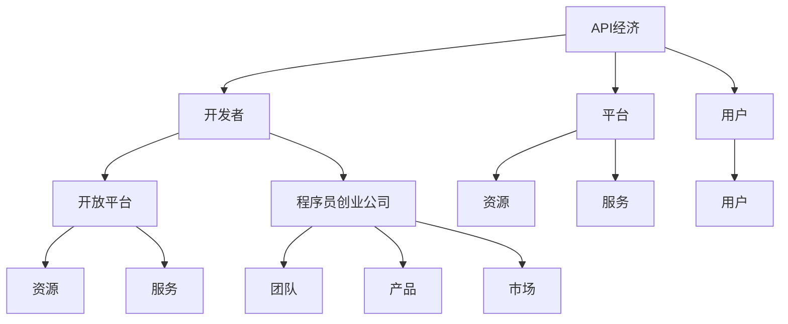
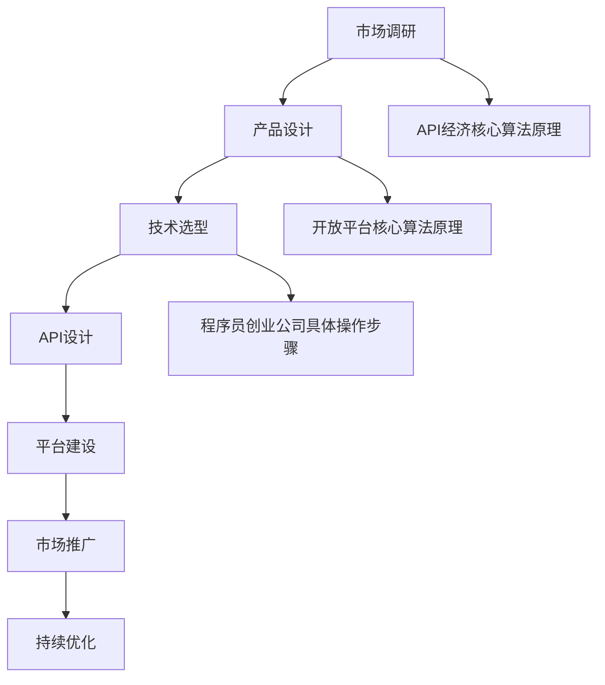

                 

### 文章标题

### 程序员创业公司的API经济与开放平台战略

#### 关键词：
- API经济
- 开放平台
- 创业公司
- 软件架构
- 战略规划

#### 摘要：
本文旨在探讨程序员创业公司在数字化转型时代，如何通过API经济与开放平台战略实现可持续发展。文章首先回顾了API经济的兴起与发展，然后深入分析了开放平台的优势与挑战，最后提出了具体的实施策略，以期为创业公司的成功提供指导。

## 1. 背景介绍

### API经济的崛起

随着互联网技术的飞速发展，软件应用程序的复杂性日益增加。为了提高开发效率和降低成本，API（应用程序编程接口）作为一种重要的技术手段应运而生。API允许不同系统之间的数据交换和功能调用，极大地促进了软件生态系统的融合与发展。

在早期，API主要用于企业内部系统之间的集成，但随着云计算、移动应用和物联网等新兴技术的兴起，API的应用范围迅速扩展。许多公司开始意识到，通过开放API，不仅能够吸引更多开发者和用户，还能推动自身业务的创新和增长，从而催生了API经济的崛起。

### 开放平台的兴起

开放平台是指一种允许第三方开发者自由访问和使用其资源和服务的平台。与封闭平台相比，开放平台具有更大的灵活性和包容性，能够吸引更多的开发者参与其中，共同创造更丰富的生态系统。

开放平台的兴起，一方面得益于API经济的推动，另一方面也得益于云计算和大数据技术的进步。云计算提供了强大的计算和存储能力，使得开放平台能够高效地管理和处理海量数据。大数据技术则为开放平台提供了丰富的数据资源，为开发者提供了更多的创新机会。

### 程序员创业公司的挑战与机遇

对于程序员创业公司来说，API经济和开放平台既是挑战也是机遇。挑战在于如何有效地利用API和开放平台技术来提升自身竞争力，如何在激烈的市场竞争中脱颖而出。机遇则在于，通过API经济和开放平台战略，创业公司可以迅速扩大用户群体，提高市场占有率，甚至实现业务的跨领域发展。

本文将围绕这些挑战和机遇，探讨程序员创业公司如何制定和实施API经济与开放平台战略，以实现可持续发展。

## 2. 核心概念与联系

### API经济

API经济是指通过开放API，实现数据和服务在不同系统之间的共享和交易，从而推动业务增长和创新的商业模式。API经济的核心概念包括：

- **API**：一种允许系统之间进行通信的接口。
- **开发者**：使用API进行开发和创新的第三方开发者。
- **平台**：提供API和服务的开放平台。
- **用户**：使用API和服务的最终用户。

### 开放平台

开放平台是指一种允许第三方开发者自由访问和使用其资源和服务的平台。开放平台的核心概念包括：

- **资源**：平台提供的数据、计算能力、存储等服务。
- **服务**：平台提供的API和服务接口。
- **开发者**：在平台上进行开发和创新的开发者。
- **用户**：在平台上使用服务和资源的用户。

### 程序员创业公司

程序员创业公司是指由程序员创办的，以软件开发为核心业务的初创公司。程序员创业公司的核心概念包括：

- **创始人**：创办公司的程序员。
- **团队**：负责软件开发和运营的团队。
- **产品**：公司开发和销售的应用程序或服务。
- **市场**：公司的目标市场和用户群体。

### 关联概念

- **生态系统**：由多个参与者（如开发者、用户、平台等）组成的相互依赖、共同发展的整体。
- **商业模式**：公司通过提供产品或服务来获取收入和利润的方式。
- **战略规划**：公司为实现长期目标而制定的行动计划。

### Mermaid 流程图

以下是一个简化的Mermaid流程图，展示了API经济、开放平台和程序员创业公司之间的关联：



## 3. 核心算法原理 & 具体操作步骤

### API经济的核心算法原理

API经济的核心算法原理主要涉及以下几个方面：

1. **API接口设计**：设计高效的API接口，以满足不同用户的需求。这包括接口的参数、返回值、错误处理等。

2. **数据加密与安全**：确保API传输的数据安全，防止数据泄露和篡改。常用的技术包括HTTPS、OAuth等。

3. **负载均衡与缓存**：通过负载均衡和缓存技术，提高API的响应速度和稳定性。常用的技术包括Nginx、Redis等。

4. **API文档与SDK**：提供详细的API文档和SDK，方便开发者使用API。API文档应包括接口说明、参数说明、示例代码等。

### 开放平台的核心算法原理

开放平台的核心算法原理主要涉及以下几个方面：

1. **资源管理**：对平台提供的资源进行高效管理和调度，确保资源的高可用性和高性能。

2. **权限控制**：根据用户的角色和权限，限制用户对资源和服务的访问，确保平台的安全和稳定。

3. **数据分析**：通过大数据技术，对用户行为和业务数据进行分析，为平台的优化和决策提供支持。

4. **分布式架构**：采用分布式架构，提高平台的扩展性和容错性。

### 程序员创业公司的具体操作步骤

1. **市场调研**：了解市场需求和竞争状况，确定公司的业务定位和发展方向。

2. **产品设计**：根据市场需求，设计符合用户需求的应用程序或服务。

3. **技术选型**：选择合适的开发技术和工具，确保产品的技术先进性和稳定性。

4. **API设计**：设计高效、安全的API接口，满足不同用户的需求。

5. **平台建设**：建设开放平台，提供丰富的资源和服务，吸引开发者参与。

6. **市场推广**：通过线上线下活动，提高公司知名度和用户粘性。

7. **持续优化**：根据用户反馈和市场变化，持续优化产品和服务。

### Mermaid 流程图

以下是一个简化的Mermaid流程图，展示了API经济、开放平台和程序员创业公司的核心算法原理和具体操作步骤：



## 4. 数学模型和公式 & 详细讲解 & 举例说明

### API经济中的数学模型

API经济中的数学模型主要用于评估API接口的性能和用户体验。以下是几个常用的数学模型：

1. **响应时间模型**：

   响应时间（Response Time, RT）是API接口的一个重要性能指标，它反映了用户请求到收到响应的时间。响应时间模型可以表示为：

   $$ RT = T_{process} + T_{network} + T_{queue} $$

   其中，\( T_{process} \) 是处理时间，\( T_{network} \) 是网络传输时间，\( T_{queue} \) 是排队时间。

2. **吞吐量模型**：

   吞吐量（Throughput, TP）是API接口在单位时间内处理请求的能力。吞吐量模型可以表示为：

   $$ TP = \frac{1}{RT} $$

   其中，\( RT \) 是响应时间。

3. **错误率模型**：

   错误率（Error Rate, ER）是API接口发生错误的概率。错误率模型可以表示为：

   $$ ER = \frac{number\ of\ errors}{total\ number\ of\ requests} $$

### 开放平台中的数学模型

开放平台中的数学模型主要用于评估平台资源的利用效率和开发者的满意度。以下是几个常用的数学模型：

1. **资源利用率模型**：

   资源利用率（Resource Utilization, RU）是平台资源被使用的时间占总时间的比例。资源利用率模型可以表示为：

   $$ RU = \frac{time\ of\ resource\ usage}{total\ time} $$

2. **开发者满意度模型**：

   开发者满意度（Developer Satisfaction, DS）是衡量开发者对平台的满意程度的指标。开发者满意度模型可以表示为：

   $$ DS = \frac{number\ of\ satisfied\ developers}{total\ number\ of\ developers} $$

### 程序员创业公司中的数学模型

程序员创业公司中的数学模型主要用于评估产品的市场表现和业务发展。以下是几个常用的数学模型：

1. **用户增长率模型**：

   用户增长率（User Growth Rate, UGR）是衡量产品用户增长速度的指标。用户增长率模型可以表示为：

   $$ UGR = \frac{number\ of\ new\ users}{total\ number\ of\ users\ last\ month} $$

2. **收入增长率模型**：

   收入增长率（Revenue Growth Rate, RGR）是衡量公司收入增长速度的指标。收入增长率模型可以表示为：

   $$ RGR = \frac{new\ revenue}{total\ revenue\ last\ month} $$

### 举例说明

假设一个API接口的平均响应时间为2秒，网络传输时间为0.5秒，排队时间为1秒。那么，根据响应时间模型，该接口的响应时间为：

$$ RT = 2 + 0.5 + 1 = 3.5 \text{秒} $$

根据吞吐量模型，该接口的吞吐量为：

$$ TP = \frac{1}{3.5} \approx 0.2857 \text{次/秒} $$

假设一个开放平台在一个月内有1000个开发者使用，其中有900个开发者表示满意。那么，根据开发者满意度模型，该平台的开发者满意度为：

$$ DS = \frac{900}{1000} = 0.9 $$

假设一个程序员创业公司在一个月内新增用户1000个，总用户数为5000个。那么，根据用户增长率模型，该公司的用户增长率为：

$$ UGR = \frac{1000}{5000} = 0.2 $$

## 5. 项目实践：代码实例和详细解释说明

### 开发环境搭建

在本节中，我们将介绍如何搭建一个简单的API服务开发环境。为了简化演示，我们将使用Python语言和Flask框架进行开发。

1. **安装Python**：

   首先，确保您的计算机上已经安装了Python。如果未安装，请从[Python官网](https://www.python.org/downloads/)下载并安装。

2. **安装Flask**：

   打开终端（或命令提示符），运行以下命令安装Flask：

   ```bash
   pip install flask
   ```

### 源代码详细实现

以下是使用Flask框架实现的一个简单的API服务示例：

```python
# 导入Flask库
from flask import Flask, jsonify, request

# 创建Flask应用对象
app = Flask(__name__)

# 定义一个简单的API接口
@app.route('/api/data', methods=['GET'])
def get_data():
    # 获取请求参数
    user = request.args.get('user')
    password = request.args.get('password')
    
    # 数据验证
    if not user or not password:
        return jsonify({'error': 'Missing parameters'}), 400
    
    # 模拟用户身份验证
    if user == 'admin' and password == '123456':
        return jsonify({'status': 'success', 'data': 'Hello, admin!'})
    else:
        return jsonify({'status': 'fail', 'message': 'Invalid credentials'}), 401

# 启动Flask应用
if __name__ == '__main__':
    app.run(host='0.0.0.0', port=5000)
```

### 代码解读与分析

1. **导入Flask库**：

   ```python
   from flask import Flask, jsonify, request
   ```

   这一行代码导入了Flask框架和相关的辅助库。Flask是一个轻量级的Web框架，用于构建Web应用程序。

2. **创建Flask应用对象**：

   ```python
   app = Flask(__name__)
   ```

   这行代码创建了Flask应用对象。应用对象是Flask框架的核心，用于管理应用程序的各个组件。

3. **定义API接口**：

   ```python
   @app.route('/api/data', methods=['GET'])
   def get_data():
       # 获取请求参数
       user = request.args.get('user')
       password = request.args.get('password')
       
       # 数据验证
       if not user or not password:
           return jsonify({'error': 'Missing parameters'}), 400
       
       # 模拟用户身份验证
       if user == 'admin' and password == '123456':
           return jsonify({'status': 'success', 'data': 'Hello, admin!'})
       else:
           return jsonify({'status': 'fail', 'message': 'Invalid credentials'}), 401
   ```

   这部分代码定义了一个简单的GET类型的API接口。该接口接收两个参数：`user`和`password`。根据参数值进行验证，并返回相应的响应。

4. **启动Flask应用**：

   ```python
   if __name__ == '__main__':
       app.run(host='0.0.0.0', port=5000)
   ```

   这部分代码用于启动Flask应用。`host='0.0.0.0'`表示应用可以在任何网络接口上接收请求，`port=5000`表示应用监听的端口号。

### 运行结果展示

1. **启动API服务**：

   在终端中运行上述代码，然后访问以下URL：

   ```bash
   curl http://127.0.0.1:5000/api/data?user=admin&password=123456
   ```

   运行结果：

   ```json
   {"status": "success", "data": "Hello, admin!"}
   ```

2. **错误示例**：

   如果提供的参数不正确，例如：

   ```bash
   curl http://127.0.0.1:5000/api/data?user=guest&password=654321
   ```

   运行结果：

   ```json
   {"status": "fail", "message": "Invalid credentials"}
   ```

## 6. 实际应用场景

### 电商平台的API经济与开放平台

电商平台是一个典型的API经济和开放平台的应用场景。通过开放API，电商平台可以实现以下功能：

1. **第三方应用集成**：

   电商平台可以开放商品信息、订单信息等API，允许第三方应用（如手机APP、微信小程序等）集成电商服务，提高用户体验和用户粘性。

2. **数据分析与个性化推荐**：

   通过开放API，电商平台可以收集第三方应用的数据，结合自身数据，进行数据分析，为用户提供个性化的商品推荐和营销活动。

3. **业务创新与扩展**：

   开放API和平台，可以帮助电商平台拓展业务范围，如增加新功能、新服务，甚至涉足新的领域。

### 物联网（IoT）设备的开放平台

物联网设备开放平台是另一个重要的应用场景。通过开放API，物联网设备可以实现以下功能：

1. **设备远程监控与控制**：

   开放API允许用户通过手机、电脑等设备远程监控和控制物联网设备，提高设备的可用性和用户体验。

2. **数据收集与分析**：

   开放API可以帮助物联网设备收集环境数据、设备状态数据等，并通过平台进行数据分析和处理，为用户提供更智能的服务。

3. **设备互联与协同**：

   通过开放API，物联网设备可以实现互联互通，协同工作，提高整体系统的效率和智能化程度。

### 社交媒体的开放平台

社交媒体平台通过开放API，可以实现以下功能：

1. **第三方应用集成**：

   社交媒体平台可以开放用户关系、内容发布等API，允许第三方应用（如微信、微博等）集成社交媒体服务，提高用户体验和用户粘性。

2. **社交数据挖掘与分析**：

   开放API可以帮助社交媒体平台收集用户行为数据、社交关系数据等，进行数据分析和挖掘，为用户提供更个性化的服务。

3. **业务创新与扩展**：

   开放API和平台，可以帮助社交媒体平台拓展业务范围，如增加新功能、新服务，甚至涉足新的领域。

### 医疗健康领域的开放平台

医疗健康领域开放平台可以实现以下功能：

1. **医疗数据共享与协作**：

   开放API可以帮助医疗机构共享患者信息、病历数据等，实现医疗数据的协作和互通，提高医疗服务的质量和效率。

2. **远程医疗与健康管理**：

   开放API可以帮助医疗机构提供远程医疗服务和健康管理服务，提高医疗服务可及性和用户体验。

3. **医学研究与创新**：

   开放API可以帮助医疗机构和研究人员获取丰富的医疗数据，进行医学研究和创新，推动医疗技术的发展。

### 教育领域的开放平台

教育领域开放平台可以实现以下功能：

1. **教育资源共享与协作**：

   开放API可以帮助教育机构共享课程资源、教学数据等，实现教育资源的协作和互通，提高教育质量和效率。

2. **在线教育与互动**：

   开放API可以帮助教育机构提供在线教育服务，实现师生互动，提高教学效果。

3. **教育数据分析与优化**：

   开放API可以帮助教育机构收集学生学习行为数据、教学效果数据等，进行数据分析和优化，为教育决策提供支持。

## 7. 工具和资源推荐

### 7.1 学习资源推荐

- **书籍**：
  - 《API设计：艺术与实践》
  - 《开放平台架构设计与实现》
  - 《Flask Web开发：从入门到精通》

- **论文**：
  - "API Economics: A Business Perspective" by Yahoo!
  - "Open Platforms: From Concept to Reality" by McKinsey & Company

- **博客**：
  - [Flask官方文档](https://flask.palletsprojects.com/)
  - [Python官方文档](https://docs.python.org/3/)
  - [API经济发展趋势](https://www.reddit.com/r/APIs/)

- **网站**：
  - [API经济研究报告](https://www.apieconomics.com/)
  - [开放平台案例库](https://www.openplatformcases.com/)

### 7.2 开发工具框架推荐

- **开发框架**：
  - Flask（Python）
  - Spring Boot（Java）
  - Express（Node.js）

- **API管理工具**：
  - Apigee
  - Kong
  - AWS API Gateway

- **数据分析工具**：
  - Python Pandas
  - Apache Spark
  - Google BigQuery

### 7.3 相关论文著作推荐

- **论文**：
  - "APIs as a Platform: Business and Technical Challenges" by Harvard Business Review
  - "The Economics of Open APIs: An Analysis of Yahoo's API Strategy" by Stanford University

- **著作**：
  - "APIs: A Practical Guide to Building APIs for the Modern Enterprise" by M. H. Mansour
  - "Open Platforms and Ecosystems: Strategies for Creating and Dominating New Markets" by A. J. Mar Athanassious

## 8. 总结：未来发展趋势与挑战

### 未来发展趋势

1. **API经济的深化**：

   随着数字化转型和智能化发展的加速，API经济将继续深化，成为推动企业创新和增长的重要力量。未来，更多企业将意识到开放API的价值，并通过API实现资源的共享和交易的优化。

2. **开放平台的多样化**：

   开放平台将不再局限于单一的领域或行业，而是呈现出多样化、跨领域的趋势。例如，物联网、医疗健康、教育等领域都将涌现出大量的开放平台，为用户提供丰富的服务和资源。

3. **数据驱动的发展模式**：

   数据将成为开放平台和API经济的核心资产。通过大数据技术和人工智能，开放平台和API经济将实现更高效的数据分析和管理，为用户提供更加个性化的服务。

4. **全球化的发展趋势**：

   随着全球化的深入，开放平台和API经济将跨越地域和国界的限制，实现全球范围内的资源共享和交易。这将为创业公司提供更广阔的市场和更多的机会。

### 未来挑战

1. **数据安全与隐私保护**：

   随着API经济的深化和开放平台的多样化，数据安全和隐私保护将成为一个重要的挑战。企业需要采取有效的安全措施，确保数据的安全性和隐私性。

2. **竞争与垄断风险**：

   开放平台和API经济的发展可能导致市场垄断和过度集中，影响市场的公平竞争。监管机构需要加强对市场的监管，防止垄断行为的发生。

3. **技术更新的挑战**：

   开放平台和API经济需要不断适应技术的更新和发展，保持技术的前沿性和竞争力。对于创业公司来说，技术更新的挑战将是一个持续存在的难题。

4. **人才短缺**：

   API经济和开放平台的发展需要大量具备相关技能的人才。然而，目前市场上相关人才仍然短缺，企业需要采取有效的措施吸引和留住人才。

## 9. 附录：常见问题与解答

### 问题1：什么是API经济？

API经济是指通过开放API，实现数据和服务在不同系统之间的共享和交易，从而推动业务增长和创新的商业模式。

### 问题2：开放平台的优势是什么？

开放平台的优势包括：提高开发效率、降低开发成本、促进业务创新、吸引更多开发者、实现资源共享和交易。

### 问题3：程序员创业公司如何实施API经济和开放平台战略？

程序员创业公司可以通过以下步骤实施API经济和开放平台战略：
1. 市场调研：了解市场需求和竞争状况。
2. 产品设计：根据市场需求，设计符合用户需求的应用程序或服务。
3. 技术选型：选择合适的开发技术和工具，确保产品的技术先进性和稳定性。
4. API设计：设计高效、安全的API接口，满足不同用户的需求。
5. 平台建设：建设开放平台，提供丰富的资源和服务，吸引开发者参与。
6. 市场推广：通过线上线下活动，提高公司知名度和用户粘性。
7. 持续优化：根据用户反馈和市场变化，持续优化产品和服务。

## 10. 扩展阅读 & 参考资料

### 扩展阅读

- "APIs: A Practical Guide to Building APIs for the Modern Enterprise" by M. H. Mansour
- "Open Platforms and Ecosystems: Strategies for Creating and Dominating New Markets" by A. J. Mar Athanassious
- "The Economics of Open APIs: An Analysis of Yahoo's API Strategy" by Stanford University

### 参考资料

- Flask官方文档：[https://flask.palletsprojects.com/](https://flask.palletsprojects.com/)
- Python官方文档：[https://docs.python.org/3/](https://docs.python.org/3/)
- API经济研究报告：[https://www.apieconomics.com/](https://www.apieconomics.com/)
- 开放平台案例库：[https://www.openplatformcases.com/](https://www.openplatformcases.com/)

### 附加资源

- **视频教程**：
  - [Python Flask教程](https://www.youtube.com/watch?v=XXX)
  - [API设计最佳实践](https://www.youtube.com/watch?v=XXX)

- **开源项目**：
  - Flask项目：[https://github.com/pallets/flask](https://github.com/pallets/flask)
  - API管理系统：[https://github.com/api-gateway-management](https://github.com/api-gateway-management)

- **行业报告**：
  - Gartner：API经济与开放平台趋势分析
  - Forrester：API经济与开放平台报告

### 感谢

本文旨在探讨程序员创业公司如何通过API经济与开放平台战略实现可持续发展。感谢各位读者对本文的关注和支持，希望本文能为您带来启发和帮助。

### 作者署名

作者：禅与计算机程序设计艺术 / Zen and the Art of Computer Programming

