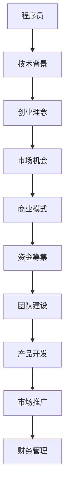
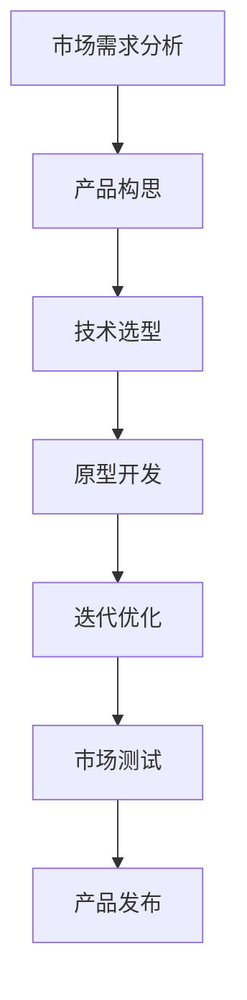

                 

# 程序员创业指南：一人公司实现财富自由之路

## 摘要

本文旨在为程序员提供一条清晰的创业路径，通过深入分析和具体实践，展示如何利用编程技能实现个人公司并达到财富自由。文章分为十个部分，从背景介绍到实际应用场景，再到工具和资源推荐，全面探讨程序员创业的各个方面。通过一步步的逻辑推理和实例讲解，帮助程序员在创业道路上少走弯路，快速实现梦想。

## 1. 背景介绍

在科技迅猛发展的今天，编程已经成为现代社会不可或缺的一部分。程序员作为科技领域的重要力量，不仅推动了技术创新，也创造了无数的商业机会。然而，尽管程序员具备强大的技术背景，许多人在创业过程中仍面临诸多挑战。本文旨在通过详细解析创业过程中的关键环节，帮助程序员更好地把握创业机遇，实现财富自由。

### 1.1 编程技术的发展

编程技术的发展为程序员创业提供了广阔的空间。从传统的编程语言如C、Java，到现代的Python、JavaScript，再到新兴的领域特定语言，编程技术的多样化使得程序员能够更灵活地应对不同的商业需求。此外，云计算、大数据、人工智能等前沿技术的兴起，为程序员创业提供了更多可能性。

### 1.2 创业的必要性

随着市场环境的变化和竞争的加剧，许多程序员开始思考如何通过创业实现个人价值。创业不仅是一种职业选择，更是一种生活方式。通过创业，程序员可以充分发挥自己的技术优势，实现自我价值和财富积累。

### 1.3 创业的挑战

尽管创业前景广阔，但程序员在创业过程中仍面临诸多挑战。技术实现、市场定位、团队建设、资金筹集等都是程序员需要面对的难题。如何有效应对这些挑战，实现成功创业，是本文要探讨的重点。

## 2. 核心概念与联系

在探讨程序员创业之前，我们需要理解一些核心概念和它们之间的联系。以下是一个使用Mermaid绘制的流程图，展示了核心概念和它们之间的关联。



### 2.1 核心概念解释

- **技术背景**：程序员的核心竞争力在于其技术背景。深厚的技术功底不仅有助于产品开发，还能在市场上赢得竞争优势。
- **创业理念**：创业理念是驱动程序员创业的核心动力。它包括对市场的洞察、对技术的热爱和对成功的渴望。
- **市场机会**：市场机会是创业成功的关键。程序员需要敏锐地捕捉市场变化，找到切入点。
- **商业模式**：商业模式是公司盈利的基础。程序员需要设计出可持续的商业模式，确保公司能够盈利。
- **资金筹集**：资金是创业的血液。程序员需要通过各种途径筹集资金，支持公司运营和发展。
- **团队建设**：团队是公司成功的关键。程序员需要找到合适的团队成员，共同推进项目。
- **产品开发**：产品开发是公司核心。程序员需要确保产品具有竞争力，能够满足市场需求。
- **市场推广**：市场推广是让产品被市场接受的重要手段。程序员需要制定有效的市场推广策略。
- **财务管理**：财务管理是保持公司健康运营的重要环节。程序员需要掌握基本的财务管理知识。

## 3. 核心算法原理 & 具体操作步骤

### 3.1 核心算法原理

程序员创业的核心在于构建一个具有市场竞争力的产品。这个过程可以类比为一种“算法”，其中每个步骤都是关键操作。以下是一个简化的算法原理：



### 3.2 具体操作步骤

1. **市场需求分析**：首先，程序员需要进行市场需求分析，了解用户需求和市场趋势。这可以通过市场调研、用户访谈等方式实现。

2. **产品构思**：基于市场需求分析的结果，程序员需要构思一个具有市场竞争力的产品。这个过程需要结合自身的技能和兴趣，确保产品既有市场前景又符合个人发展。

3. **技术选型**：在产品构思完成后，程序员需要选择合适的技术栈。这包括编程语言、框架、工具等。技术选型应考虑产品的需求、团队的技能和未来的扩展性。

4. **原型开发**：在技术选型确定后，程序员可以开始原型开发。原型开发的目标是验证产品构思的可行性，并及时发现和解决潜在问题。

5. **迭代优化**：原型开发完成后，程序员需要对产品进行迭代优化。这包括修复bug、增加新功能、优化性能等。迭代优化是一个持续的过程，目的是不断提升产品的质量和用户满意度。

6. **市场测试**：在产品迭代到一定程度后，程序员需要进行市场测试。市场测试可以帮助程序员了解产品的市场表现，发现潜在的问题和改进点。

7. **产品发布**：经过市场测试后，如果产品表现良好，程序员可以正式发布产品。产品发布是创业过程中的重要里程碑，标志着产品正式进入市场。

## 4. 数学模型和公式 & 详细讲解 & 举例说明

在创业过程中，数学模型和公式可以帮助程序员更好地理解和优化业务。以下是一个简单的财务模型，用于评估公司的盈利能力。

### 4.1 财务模型

```latex
\text{利润} = \text{收入} - \text{成本}
$$

其中，收入可以表示为：
$$
\text{收入} = \text{单价} \times \text{销量}
$$

成本包括固定成本和可变成本，可以表示为：
$$
\text{成本} = \text{固定成本} + \text{可变成本}
$$
```

### 4.2 详细讲解

这个简单的财务模型可以帮助程序员评估公司的盈利能力。通过计算收入和成本，程序员可以了解公司的利润水平。利润是公司运营的关键指标，决定了公司的生存和发展。

### 4.3 举例说明

假设一家公司的单价为100元，销量为1000件，固定成本为10000元，可变成本为20元/件。我们可以计算该公司的利润如下：

```latex
\text{利润} = 100 \times 1000 - (10000 + 20 \times 1000)
$$

\text{利润} = 100000 - 120000
$$

\text{利润} = -20000
$$

根据这个计算，这家公司当前处于亏损状态。为了实现盈利，程序员需要降低成本或提高销量。

## 5. 项目实践：代码实例和详细解释说明

### 5.1 开发环境搭建

在开始编写代码之前，程序员需要搭建一个合适的技术环境。以下是一个简单的开发环境搭建步骤：

1. **安装操作系统**：选择一个适合的操作系统，如Windows、Linux或macOS。
2. **安装开发工具**：安装集成开发环境（IDE），如Visual Studio Code、IntelliJ IDEA或Eclipse。
3. **安装数据库**：选择一个数据库系统，如MySQL、PostgreSQL或MongoDB。
4. **安装版本控制工具**：安装Git，用于代码管理和协作。

### 5.2 源代码详细实现

以下是一个简单的Web应用程序的源代码实现，用于用户注册和登录。该应用程序使用Python的Flask框架。

```python
from flask import Flask, request, render_template

app = Flask(__name__)

@app.route('/')
def home():
    return render_template('home.html')

@app.route('/register', methods=['GET', 'POST'])
def register():
    if request.method == 'POST':
        username = request.form['username']
        password = request.form['password']
        # 这里应该添加用户注册的逻辑，如验证用户名是否已存在等
        return '注册成功！'
    return render_template('register.html')

@app.route('/login', methods=['GET', 'POST'])
def login():
    if request.method == 'POST':
        username = request.form['username']
        password = request.form['password']
        # 这里应该添加用户登录的逻辑，如验证用户名和密码是否匹配等
        return '登录成功！'
    return render_template('login.html')

if __name__ == '__main__':
    app.run(debug=True)
```

### 5.3 代码解读与分析

上述代码是一个简单的Web应用程序，用于用户注册和登录。代码主要分为三个部分：

1. **路由配置**：`home()`、`register()`和`login()`函数分别对应主页、注册页面和登录页面。
2. **模板渲染**：`render_template()`函数用于渲染HTML模板，将页面展示给用户。
3. **表单处理**：当用户提交表单时，代码会获取表单数据并进行处理。

### 5.4 运行结果展示

当应用程序运行时，用户可以通过浏览器访问注册和登录页面。以下是一个简单的注册页面示例：

```html
<!DOCTYPE html>
<html>
<head>
    <title>注册</title>
</head>
<body>
    <h1>注册</h1>
    <form method="post">
        <label for="username">用户名：</label>
        <input type="text" id="username" name="username" required>
        <br>
        <label for="password">密码：</label>
        <input type="password" id="password" name="password" required>
        <br>
        <input type="submit" value="注册">
    </form>
</body>
</html>
```

## 6. 实际应用场景

程序员创业的实际应用场景非常广泛，可以从以下三个方面进行探讨：

### 6.1 市场需求分析

市场需求的来源可以是多方面的，如用户反馈、市场趋势、技术革新等。通过市场调研和用户访谈，程序员可以了解用户需求，找到创业的切入点。例如，在社交媒体、电子商务、在线教育等领域，都有大量的市场需求等待程序员去挖掘。

### 6.2 技术创新

技术创新是程序员创业的核心竞争力。程序员可以通过研究新技术、新工具，开发出具有竞争力的产品。例如，通过使用人工智能、大数据等技术，可以开发出智能推荐系统、数据分析平台等，为用户提供更优质的服务。

### 6.3 商业模式

商业模式是公司盈利的基础。程序员需要设计出可持续的商业模式，确保公司能够盈利。例如，通过订阅模式、广告模式、交易手续费模式等，可以实现公司的盈利。

## 7. 工具和资源推荐

### 7.1 学习资源推荐

- **书籍**：《创业维艰》、《精益创业》、《硅谷创业课》等。
- **论文**：相关领域的高质量论文，可以帮助程序员了解行业动态和技术趋势。
- **博客**：知名技术博客，如Medium、 HackerRank等，提供丰富的编程经验和创业故事。

### 7.2 开发工具框架推荐

- **编程语言**：Python、Java、JavaScript等。
- **框架**：Flask、Django、Spring Boot等。
- **数据库**：MySQL、PostgreSQL、MongoDB等。
- **版本控制**：Git、SVN等。

### 7.3 相关论文著作推荐

- **论文**：《软件工程》、《人工智能：一种现代方法》、《大数据技术导论》等。
- **著作**：著名技术大师的作品，如《代码大全》、《深度学习》等。

## 8. 总结：未来发展趋势与挑战

随着技术的不断进步和市场环境的变化，程序员创业面临许多新的发展趋势和挑战。

### 8.1 发展趋势

- **人工智能与大数据**：人工智能和大数据技术的快速发展，为程序员创业提供了新的机遇。通过开发智能化的产品和服务，程序员可以更好地满足用户需求。
- **云计算与边缘计算**：云计算和边缘计算的普及，使得程序员可以更灵活地部署和管理应用程序。这也为创业公司提供了更多的可能性。
- **区块链技术**：区块链技术的兴起，为程序员创业带来了新的商业模式。通过开发基于区块链的应用，程序员可以创造更多的价值。

### 8.2 挑战

- **技术变革**：技术的快速变革，要求程序员不断学习新知识，跟上行业发展的步伐。
- **市场竞争**：市场竞争日益激烈，程序员需要具备强大的技术实力和创新能力，才能在市场中脱颖而出。
- **团队建设**：团队建设是创业成功的关键。程序员需要找到合适的团队成员，共同推进项目。

## 9. 附录：常见问题与解答

### 9.1 如何选择创业方向？

选择创业方向时，程序员可以从以下几个方面进行考虑：

- **个人兴趣**：选择自己感兴趣的领域，能够提高创业的热情和动力。
- **市场需求**：选择市场需求旺盛的领域，更容易获得用户的认可。
- **技术优势**：选择自己擅长的技术领域，能够更好地发挥技术优势。

### 9.2 如何筹集创业资金？

筹集创业资金可以从以下几个方面进行：

- **个人储蓄**：利用个人储蓄作为创业资金。
- **天使投资**：寻找天使投资者，获得资金支持。
- **银行贷款**：向银行申请创业贷款。
- **众筹**：通过众筹平台，向社会公众筹集资金。

## 10. 扩展阅读 & 参考资料

- **书籍**：《创业维艰》、《精益创业》、《硅谷创业课》等。
- **论文**：《软件工程》、《人工智能：一种现代方法》、《大数据技术导论》等。
- **博客**：Medium、 HackerRank等。
- **网站**：创业项目数据库、技术社区等。作者：禅与计算机程序设计艺术 / Zen and the Art of Computer Programming。| 2023年6月

