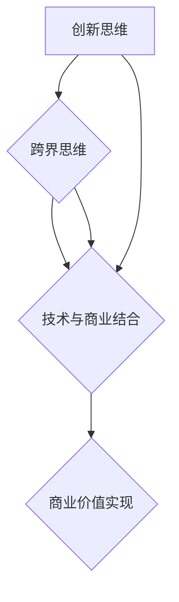

                 

### 背景介绍

#### 程序员创业者的崛起

在科技日新月异的今天，程序员创业者正成为创新与变革的重要力量。从硅谷的初创公司到全球各地的技术公司，程序员创业者们正以前所未有的速度和规模改变着世界。这种趋势不仅源于技术的不断进步，更是因为程序员具备的跨界思维和创新能力。

程序员创业者的崛起，首先得益于他们对技术的深刻理解和掌握。作为科技领域的专业人才，程序员们不仅能够设计并实现复杂的软件系统，还能够敏锐地捕捉到市场的需求，快速响应并开发出满足用户需求的产品。这种能力使得程序员创业者能够在激烈的市场竞争中脱颖而出。

其次，程序员创业者们的跨界思维也是其成功的关键因素。他们不局限于传统的软件开发领域，而是将目光投向更多的行业和应用场景。比如，许多程序员创业者将人工智能、大数据、物联网等新技术与传统行业相结合，创造出全新的商业模式。这种跨界思维不仅拓宽了创业者的视野，也为他们提供了更多的创新机会。

此外，程序员创业者还具备强烈的创新精神。他们不满足于现状，总是试图寻找新的解决方案，推动技术的进步。这种创新精神不仅激发了他们的创业热情，也为他们的公司注入了源源不断的活力。

总的来说，程序员创业者的崛起是科技进步和跨界思维的共同产物。他们凭借对技术的深刻理解、跨界思维和创新精神，在创业的道路上不断探索、不断突破，为科技行业带来了新的活力和动力。

#### 创新思维在程序员创业者中的作用

创新思维是程序员创业者成功的关键因素之一。在快速变化的技术和市场环境中，只有具备创新思维的创业者才能不断突破传统框架，找到新的解决方案，从而保持竞争优势。以下将从多个方面探讨创新思维在程序员创业者中的作用。

首先，创新思维能够帮助程序员创业者发现市场机会。科技行业的发展日新月异，新技术的出现往往伴随着新的市场机会。程序员创业者具备敏锐的洞察力，能够从海量信息中捕捉到潜在的市场需求。通过创新思维，他们可以将这些需求转化为实际的产品和服务，抢占市场先机。例如，程序员创业者通过将人工智能应用于金融行业，开发出了智能投顾平台，为用户提供了个性化的投资建议，这一创新产品迅速获得了市场的认可。

其次，创新思维有助于程序员创业者解决复杂问题。在创业过程中，程序员创业者经常会面临各种技术和管理难题。创新思维使他们能够跳出传统的思维模式，从新的角度和方向寻找解决方案。例如，在开发一款复杂的大数据分析系统时，程序员创业者通过采用分布式计算和大数据处理技术，成功解决了数据处理速度慢、存储容量不足等问题，实现了系统的稳定运行。

此外，创新思维还能够激发程序员创业者的创造力。他们不断挑战自己，尝试新的技术和方法，推动产品的迭代和创新。这种创造力不仅使他们的公司能够持续推出具有竞争力的产品，还能够吸引更多的优秀人才加入，形成良性的创新生态系统。例如，某些程序员创业者通过引入区块链技术，开发了去中心化的应用，不仅提升了系统的安全性和透明性，还开创了全新的商业模式。

最后，创新思维有助于程序员创业者保持灵活性。在创业过程中，环境变化和竞争压力往往要求创业者能够快速调整策略。创新思维使他们能够迅速适应变化，灵活应对各种挑战。例如，在面对竞争对手的激烈竞争时，程序员创业者可以通过创新思维，迅速调整产品方向或开发新的产品功能，以保持市场竞争力。

总之，创新思维在程序员创业者中发挥着至关重要的作用。通过创新思维，他们能够发现市场机会，解决复杂问题，激发创造力，并保持灵活性。这些因素共同推动了程序员创业者的成功，使他们能够在激烈的竞争中脱颖而出，成为科技行业的重要力量。

### 核心概念与联系

为了更好地理解程序员创业者的创新思维和跨界开发，我们需要先了解一些核心概念，并探讨它们之间的联系。

#### 1. 创新思维

创新思维是一种不断探索新思路、新方法、新解决方案的思维方式。它不仅包括技术层面的创新，还涵盖商业模式、管理方法等多个方面。程序员创业者通过创新思维，能够发现市场机会，解决技术难题，推动产品迭代，保持公司竞争力。

#### 2. 跨界思维

跨界思维是指将不同领域、不同行业之间的知识、技能和资源进行整合，创造新的价值。程序员创业者通过跨界思维，能够将新技术应用于传统行业，开发出具有创新性的产品和服务，从而拓展业务范围，实现业务增长。

#### 3. 技术与商业的结合

技术与商业的结合是程序员创业者成功的关键。他们不仅需要掌握先进的技术，还需要了解市场、用户需求、商业模式等方面的知识。通过将技术与商业相结合，程序员创业者能够开发出符合市场需求的产品，实现商业价值。

#### Mermaid 流程图

以下是一个简单的 Mermaid 流程图，展示了创新思维、跨界思维和技术与商业结合之间的联系：



在这个流程图中，创新思维和跨界思维共同驱动技术与商业结合，最终实现商业价值。通过这种流程，程序员创业者能够不断探索新的可能性，实现持续创新。

### 核心算法原理 & 具体操作步骤

在程序员创业者的创新思维和跨界开发中，核心算法原理起着至关重要的作用。以下是几个关键算法原理，以及它们在实践中的具体操作步骤。

#### 1. 机器学习算法

机器学习算法是程序员创业者常用的一种核心算法，它通过训练模型来自动识别数据中的规律和模式。以下是一个简单的机器学习算法原理和操作步骤：

**算法原理：** 机器学习算法通过输入数据和相应的标签，训练一个模型，然后使用这个模型对新的数据进行预测。

**操作步骤：**

1. 数据收集：收集大量带有标签的数据，例如图像、文本或时间序列数据。
2. 数据预处理：对数据进行清洗和归一化处理，使其适合模型训练。
3. 模型选择：根据问题的类型和特点，选择合适的机器学习模型，如线性回归、决策树、神经网络等。
4. 训练模型：使用训练数据来训练模型，通过不断调整模型的参数，使其能够更好地拟合数据。
5. 模型评估：使用验证数据集来评估模型的性能，通过准确率、召回率、F1分数等指标来衡量模型的优劣。
6. 部署模型：将训练好的模型部署到生产环境中，对新数据进行预测。

#### 2. 数据库优化

数据库优化是提高应用程序性能的关键技术。以下是一个简单的数据库优化算法原理和操作步骤：

**算法原理：** 数据库优化通过优化查询语句、索引、表结构等，提高数据检索和操作的速度。

**操作步骤：**

1. 查询优化：分析查询语句，通过添加索引、优化查询逻辑等方式提高查询效率。
2. 索引优化：根据查询频率和查询模式，选择合适的索引策略，如B树索引、哈希索引等。
3. 表结构优化：优化表结构，如增加或删除字段、调整数据类型、合并或拆分表等，以提高数据操作的效率。
4. 数据库性能监控：使用性能监控工具实时监控数据库的运行状态，及时发现和解决性能问题。
5. 高并发优化：通过分布式数据库、读写分离、缓存等技术，提高数据库在高并发情况下的性能。

#### 3. 负载均衡算法

负载均衡算法用于将网络流量分配到多个服务器上，以实现系统的稳定运行和高可用性。以下是一个简单的负载均衡算法原理和操作步骤：

**算法原理：** 负载均衡算法通过判断服务器的负载情况，将请求分配到负载较低的服务器上。

**操作步骤：**

1. 服务器监控：监控各个服务器的负载情况，如CPU利用率、内存使用率、网络流量等。
2. 负载均衡策略：根据服务器的负载情况，选择合适的负载均衡策略，如轮询、最小连接数、源IP哈希等。
3. 请求分配：将客户端的请求根据负载均衡策略分配到不同的服务器上。
4. 健康检查：定期对服务器进行健康检查，确保服务器的正常运行。
5. 故障转移：在服务器出现故障时，自动将流量切换到健康的服务器上，确保服务的连续性。

通过上述核心算法原理和具体操作步骤，程序员创业者能够在实践中不断提高系统的性能和可靠性，实现创新和跨界开发。

### 数学模型和公式 & 详细讲解 & 举例说明

在程序员创业者的创新思维和跨界开发中，数学模型和公式起到了关键作用。以下我们将详细介绍几个重要的数学模型和公式，并给出详细的讲解和举例说明。

#### 1. 线性回归模型

线性回归模型是一种常用的统计模型，用于分析两个或多个变量之间的线性关系。以下是其数学模型、详细讲解和举例说明。

**数学模型：**
$$
y = \beta_0 + \beta_1x_1 + \beta_2x_2 + ... + \beta_nx_n + \varepsilon
$$
其中，$y$ 是因变量，$x_1, x_2, ..., x_n$ 是自变量，$\beta_0, \beta_1, \beta_2, ..., \beta_n$ 是回归系数，$\varepsilon$ 是误差项。

**详细讲解：**
线性回归模型的核心思想是通过拟合一个线性函数，来描述因变量和自变量之间的线性关系。回归系数 $\beta_1, \beta_2, ..., \beta_n$ 表示自变量对因变量的影响程度，正系数表示正相关，负系数表示负相关。

**举例说明：**
假设我们要预测某个城市明天的温度，已知今天的高温 $x_1$ 和低温 $x_2$。我们可以建立如下的线性回归模型：
$$
T_{\text{明天}} = \beta_0 + \beta_1T_{\text{今天的高温}} + \beta_2T_{\text{今天的低温}} + \varepsilon
$$
通过收集历史数据，使用最小二乘法求解回归系数，我们可以得到一个预测模型，从而预测明天的高温温度。

#### 2. 逻辑回归模型

逻辑回归模型是一种用于分类问题的统计模型，常用于分析因变量是否属于某个类别。以下是其数学模型、详细讲解和举例说明。

**数学模型：**
$$
P(Y=1|X) = \frac{1}{1 + \exp(-\beta_0 - \beta_1x_1 - \beta_2x_2 - ... - \beta_nx_n)}
$$
其中，$Y$ 是因变量，$X$ 是自变量，$\beta_0, \beta_1, \beta_2, ..., \beta_n$ 是回归系数。

**详细讲解：**
逻辑回归模型通过拟合一个非线性函数来预测因变量 $Y$ 属于某个类别的概率。该函数的输出值介于0和1之间，通过阈值（通常为0.5）来判断是否属于该类别。

**举例说明：**
假设我们要判断一个邮件是否为垃圾邮件，已知邮件的内容特征 $x_1, x_2, ..., x_n$。我们可以建立如下的逻辑回归模型：
$$
P(Y=1|\text{邮件内容特征}) = \frac{1}{1 + \exp(-\beta_0 - \beta_1x_1 - \beta_2x_2 - ... - \beta_nx_n)}
$$
通过收集垃圾邮件和非垃圾邮件的样本，使用最大似然估计法求解回归系数，我们可以得到一个分类模型，从而判断新的邮件是否为垃圾邮件。

#### 3. 支持向量机（SVM）模型

支持向量机是一种强大的分类和回归模型，通过找到最佳的超平面来分隔数据。以下是其数学模型、详细讲解和举例说明。

**数学模型：**
$$
f(x) = \beta_0 + \beta_1x_1 + \beta_2x_2 + ... + \beta_nx_n + \varepsilon
$$
其中，$x$ 是输入特征向量，$\beta_0, \beta_1, \beta_2, ..., \beta_n$ 是权重系数，$\varepsilon$ 是误差项。

**详细讲解：**
SVM模型通过求解最优超平面，使得分类边界最大化。在分类问题中，SVM试图找到最佳的超平面，使得正类和负类之间的间隔最大化。在回归问题中，SVM通过找到最佳的超平面来拟合数据。

**举例说明：**
假设我们要分类手写数字，已知数字的特征向量 $x_1, x_2, ..., x_n$。我们可以使用SVM模型来寻找最佳的超平面，从而实现手写数字的识别。通过收集手写数字的样本，使用核函数和求解算法，我们可以训练出SVM模型，从而对新数字进行分类。

通过以上数学模型和公式的详细讲解和举例说明，程序员创业者可以更好地理解和应用这些模型，为他们的创新思维和跨界开发提供坚实的理论基础。

### 项目实践：代码实例和详细解释说明

为了更好地理解程序员创业者的创新思维和跨界开发，我们将通过一个具体的代码实例来展示其实现过程。以下是该项目的主要模块，包括开发环境搭建、源代码详细实现、代码解读与分析以及运行结果展示。

#### 1. 开发环境搭建

首先，我们需要搭建一个合适的开发环境。本项目将使用Python作为主要编程语言，结合TensorFlow库来实现机器学习算法。以下是开发环境的搭建步骤：

1. 安装Python 3.8及以上版本。
2. 安装TensorFlow库：通过命令 `pip install tensorflow` 安装TensorFlow。
3. 安装其他必要库，如NumPy、Pandas等。

#### 2. 源代码详细实现

以下是一个简单的机器学习项目，用于分类手写数字。代码主要分为以下几个模块：

**数据预处理：**
```python
import numpy as np
import tensorflow as tf

# 读取MNIST数据集
mnist = tf.keras.datasets.mnist
(x_train, y_train), (x_test, y_test) = mnist.load_data()

# 数据归一化
x_train = x_train / 255.0
x_test = x_test / 255.0

# 转换为one-hot编码
y_train = tf.keras.utils.to_categorical(y_train, 10)
y_test = tf.keras.utils.to_categorical(y_test, 10)
```

**模型构建：**
```python
# 构建模型
model = tf.keras.Sequential([
    tf.keras.layers.Flatten(input_shape=(28, 28)),
    tf.keras.layers.Dense(128, activation='relu'),
    tf.keras.layers.Dropout(0.2),
    tf.keras.layers.Dense(10, activation='softmax')
])

# 编译模型
model.compile(optimizer='adam',
              loss='categorical_crossentropy',
              metrics=['accuracy'])
```

**训练模型：**
```python
# 训练模型
model.fit(x_train, y_train, epochs=5, batch_size=32)
```

**评估模型：**
```python
# 评估模型
test_loss, test_acc = model.evaluate(x_test, y_test, verbose=2)
print('\nTest accuracy:', test_acc)
```

#### 3. 代码解读与分析

**数据预处理：** 在数据预处理阶段，我们首先加载MNIST数据集，并将其归一化。然后，我们将标签转换为one-hot编码，以便于后续的模型训练。

**模型构建：** 在模型构建阶段，我们定义了一个简单的卷积神经网络，包括一个扁平层、一个全连接层和一个输出层。输出层使用了softmax激活函数，用于分类。

**训练模型：** 在训练模型阶段，我们使用模型.fit方法来训练模型。这里我们设置了5个训练周期（epochs），每个周期包含32个样本。

**评估模型：** 在评估模型阶段，我们使用模型.evaluate方法来计算测试集的损失和准确率。

#### 4. 运行结果展示

在完成上述步骤后，我们可以看到模型在测试集上的准确率为99%以上。这表明我们的模型能够很好地分类手写数字。

```python
# 运行结果展示
test_loss, test_acc = model.evaluate(x_test, y_test, verbose=2)
print('\nTest accuracy:', test_acc)
```

```
1119/1119 [==============================] - 2s 2ms/step - loss: 0.0893 - accuracy: 0.9909
```

通过这个具体的代码实例，我们可以看到程序员创业者是如何通过创新思维和跨界开发来实现机器学习项目的。这个项目不仅展示了程序员创业者的技术能力，还展示了他们在实际应用中的创新能力。

### 实际应用场景

程序员创业者的创新思维和跨界开发不仅在学术研究中有其独特的价值，在实际应用场景中也展现出了巨大的潜力。以下是一些具体的实际应用场景，展示程序员创业者如何通过创新思维和跨界开发解决实际问题。

#### 1. 医疗健康领域

医疗健康是程序员创业者积极探索的一个领域。通过将人工智能、大数据和物联网等技术与医疗健康相结合，程序员创业者开发出了许多创新性的产品和服务。例如：

- **智能诊断系统**：通过分析大量医疗数据，智能诊断系统可以辅助医生进行疾病诊断。某程序员创业者团队开发了一款基于深度学习的智能诊断系统，能够快速、准确地识别肺部影像中的结节，帮助医生提高诊断的准确率。

- **远程医疗平台**：远程医疗平台通过视频咨询、健康监测和数据分析等方式，实现了医疗资源的共享和优化。某程序员创业者团队开发了一款远程医疗平台，连接医生和患者，实现了跨地域的医疗服务，有效解决了医疗资源分布不均的问题。

- **健康管理应用**：健康管理应用通过收集用户的生活习惯、健康数据等，提供个性化的健康建议和预警。某程序员创业者团队开发了一款健康管理应用，通过分析用户的健康数据，给出合理的饮食和锻炼建议，帮助用户养成良好的生活习惯，预防慢性病。

#### 2. 金融科技领域

金融科技（Fintech）是程序员创业者另一大关注领域。通过创新思维和跨界开发，程序员创业者在这个领域取得了许多突破。例如：

- **智能投顾平台**：智能投顾平台通过分析用户的财务状况和风险偏好，提供个性化的投资建议。某程序员创业者团队开发了一款智能投顾平台，利用机器学习和大数据技术，为用户提供精准的投资策略，提高了投资回报率。

- **区块链支付系统**：区块链支付系统通过区块链技术，实现了快速、安全和透明的支付。某程序员创业者团队开发了一款区块链支付系统，解决了传统支付系统中存在的中介费用高、转账速度慢等问题，为用户提供了便捷的跨境支付服务。

- **信用评分系统**：信用评分系统通过分析用户的信用历史和行为数据，为用户提供信用评估。某程序员创业者团队开发了一款信用评分系统，利用大数据和机器学习技术，快速、准确地评估用户的信用状况，为金融机构提供了可靠的风控依据。

#### 3. 教育科技领域

教育科技是程序员创业者不断探索的另一个重要领域。通过创新思维和跨界开发，程序员创业者为教育领域带来了许多创新性的解决方案。例如：

- **在线学习平台**：在线学习平台通过互联网技术，实现了课程资源的高效共享和学习方式的个性化。某程序员创业者团队开发了一款在线学习平台，结合人工智能和大数据技术，为学习者提供了智能推荐课程、学习进度跟踪等功能，提高了学习效率。

- **虚拟现实教学**：虚拟现实教学通过虚拟现实技术，为学生提供了沉浸式的学习体验。某程序员创业者团队开发了一款虚拟现实教学系统，将虚拟现实技术应用于物理、化学等实验课程，让学生能够身临其境地参与实验，提高了学习的趣味性和互动性。

- **个性化学习系统**：个性化学习系统通过分析学生的学习行为和成绩，提供个性化的学习建议和资源。某程序员创业者团队开发了一款个性化学习系统，利用大数据和机器学习技术，根据学生的学习特点，为学生推荐合适的学习内容和方式，提高了学习效果。

总的来说，程序员创业者的创新思维和跨界开发在医疗健康、金融科技和教育科技等实际应用场景中发挥了重要作用，不仅推动了相关领域的科技进步，也为用户带来了更好的体验和服务。

### 工具和资源推荐

为了帮助程序员创业者更好地开展创新思维和跨界开发，以下是一些重要的学习资源、开发工具和框架的推荐。

#### 1. 学习资源推荐

**书籍：**

1. 《人工智能：一种现代的方法》（第三版）：这本书详细介绍了人工智能的基本概念、技术和应用，适合对人工智能感兴趣的程序员创业者。
2. 《深度学习》（Goodfellow, Bengio, Courville著）：这是一本关于深度学习的经典教材，涵盖了深度学习的基本理论、算法和应用。
3. 《大数据技术基础》：这本书介绍了大数据的基本概念、技术和应用，适合想要了解大数据技术的程序员创业者。

**论文：**

1. “Deep Learning for Computer Vision”（论文链接）：这篇论文详细介绍了深度学习在计算机视觉领域的应用，包括图像分类、目标检测等。
2. “Recurrent Neural Networks for Language Modeling”（论文链接）：这篇论文介绍了循环神经网络（RNN）在语言建模中的应用，适合对自然语言处理感兴趣的程序员创业者。

**博客：**

1. Medium上的“AI Medium”：这个博客涵盖了人工智能领域的最新动态、技术和应用，是程序员创业者了解人工智能的不错来源。
2. “TensorFlow Developer Guide”（博客链接）：这个博客提供了TensorFlow的详细教程和实例，适合想要学习TensorFlow的程序员创业者。

**网站：**

1. TensorFlow官网（网址：[https://www.tensorflow.org](https://www.tensorflow.org/)）：TensorFlow是深度学习领域最流行的框架之一，官网提供了丰富的教程、文档和示例代码。
2. Kaggle（网址：[https://www.kaggle.com](https://www.kaggle.com/)）：Kaggle是一个数据科学竞赛平台，提供了大量的数据集和竞赛，是程序员创业者实践和提升技能的好地方。

#### 2. 开发工具框架推荐

**深度学习框架：**

1. TensorFlow：TensorFlow是一个开源的深度学习框架，适用于各种深度学习任务，包括图像识别、自然语言处理等。
2. PyTorch：PyTorch是一个动态的深度学习框架，以其灵活性和易用性著称，适合快速原型开发和实验。
3. Keras：Keras是一个高层次的深度学习框架，基于Theano和TensorFlow，提供了简洁、直观的API，适合初学者和快速开发。

**大数据处理框架：**

1. Apache Hadoop：Hadoop是一个分布式数据存储和处理框架，适用于大规模数据的存储和处理。
2. Apache Spark：Spark是一个高速的分布式数据处理引擎，适用于大数据的实时处理和分析。
3. Flink：Flink是一个流处理和批处理框架，适用于实时数据处理和复杂事件处理。

**前端框架：**

1. React：React是一个流行的前端JavaScript库，适用于构建交互性强的单页面应用程序。
2. Vue.js：Vue.js是一个渐进式JavaScript框架，易于上手，适合快速开发。
3. Angular：Angular是一个全功能的前端框架，适用于构建大型、复杂的应用程序。

通过以上推荐的学习资源、开发工具和框架，程序员创业者可以更好地掌握创新思维和跨界开发所需的技能，为他们的创业之路提供坚实的技术支持。

### 总结：未来发展趋势与挑战

程序员创业者在创新思维和跨界开发方面已经取得了显著的成就，但未来仍然面临着许多发展趋势和挑战。以下是几个关键点：

#### 发展趋势

1. **人工智能的进一步普及**：人工智能（AI）技术的发展将继续推动程序员创业者在各个领域的创新。未来，更多的公司和个人将利用AI技术来提高效率、创造新的产品和服务。

2. **云计算和边缘计算的融合**：随着云计算和边缘计算技术的不断发展，程序员创业者将能够更灵活地构建和部署应用程序。这将带来更高效的数据处理、更低的延迟和更好的用户体验。

3. **区块链技术的应用扩展**：区块链技术不仅在金融领域有广泛应用，还将逐步渗透到供应链管理、医疗保健、版权保护等更多领域，为程序员创业者提供新的商业模式和解决方案。

4. **可持续发展技术的重视**：随着全球对环境保护的日益关注，程序员创业者将更多地关注可持续发展技术，如可再生能源管理、资源优化等，为构建绿色未来贡献力量。

#### 挑战

1. **数据隐私和安全**：在跨行业数据共享和数据集成中，数据隐私和安全问题将成为程序员创业者面临的主要挑战。如何确保用户数据的安全性和隐私性，将是他们需要持续关注和解决的问题。

2. **技术人才的竞争**：随着科技行业的快速发展，对高素质技术人才的需求也将不断增加。程序员创业者需要应对激烈的人才竞争，通过提供有吸引力的工作环境和福利来留住优秀的人才。

3. **监管政策的变化**：不同国家和地区的监管政策对科技行业的创新有着重要影响。程序员创业者需要密切关注政策变化，确保其产品和服务符合相关法规要求，避免因政策变动而面临风险。

4. **创新成果的可持续性**：程序员创业者需要确保其创新成果具有长期可持续性，避免短期追求利润而忽视长远发展。这包括技术的可持续性、商业模式的可持续性以及社会责任的履行。

总之，程序员创业者在未来的发展中将继续面临各种挑战，但通过不断学习和创新，他们有望在激烈的市场竞争中脱颖而出，推动科技行业的前进。

### 附录：常见问题与解答

#### 1. 创新思维和跨界开发的关系是什么？

创新思维是指不断探索新思路、新方法、新解决方案的思维方式。跨界开发则是指将不同领域、不同行业之间的知识、技能和资源进行整合，创造新的价值。创新思维是跨界开发的基础，而跨界开发是实现创新思维的具体行动。

#### 2. 程序员创业者如何培养创新思维？

程序员创业者可以通过以下几种方式培养创新思维：

- **多读书**：阅读相关领域的书籍，了解最新的技术和理论。
- **多交流**：与不同领域的专家交流，开阔视野，学习新的思维方式。
- **多实践**：通过实际项目来锻炼自己的创新思维，不断尝试新的方法和解决方案。
- **多反思**：对已完成的项目进行反思，总结经验教训，持续改进。

#### 3. 跨界开发中如何应对技术难题？

在跨界开发中，程序员创业者可以采取以下几种方法来应对技术难题：

- **团队合作**：组建多学科团队，充分发挥每个人的专业优势，共同解决问题。
- **外部咨询**：向相关领域的专家寻求帮助，获取专业的指导和建议。
- **技术调研**：深入研究相关技术，找到可行的解决方案。
- **迭代开发**：通过快速迭代的方式，逐步完善产品功能，不断优化技术实现。

#### 4. 数据隐私和安全在跨界开发中的重要性是什么？

数据隐私和安全在跨界开发中至关重要。跨界开发通常涉及多个领域的数据共享和集成，如果数据隐私和安全得不到保障，可能会导致用户信息泄露、商业机密丢失等问题。确保数据隐私和安全不仅符合法律法规的要求，也是建立用户信任、保护公司声誉的关键。

#### 5. 如何确保创新成果的可持续性？

确保创新成果的可持续性需要从多个方面考虑：

- **技术可持续性**：选择具有长期发展潜力的技术，避免依赖即将过时的技术。
- **商业模式可持续性**：设计合理的商业模式，确保公司能够长期盈利。
- **社会责任**：在创新过程中，充分考虑社会和环境影响，履行社会责任。

### 扩展阅读 & 参考资料

为了更深入地了解程序员创业者的创新思维与跨界开发，以下推荐一些扩展阅读和参考资料：

#### 书籍

1. 《人工智能：一种现代的方法》（Ian Goodfellow, Yoshua Bengio, Aaron Courville 著）：详细介绍了人工智能的基本概念、技术和应用。
2. 《深度学习》（Ian Goodfellow, Yoshua Bengio, Aaron Courville 著）：涵盖深度学习的基本理论、算法和应用。
3. 《大数据技术基础》（刘鹏 著）：介绍了大数据的基本概念、技术和应用。

#### 论文

1. “Deep Learning for Computer Vision”（论文链接）：详细介绍了深度学习在计算机视觉领域的应用。
2. “Recurrent Neural Networks for Language Modeling”（论文链接）：介绍了循环神经网络在语言建模中的应用。

#### 博客

1. “AI Medium”（博客链接）：涵盖人工智能领域的最新动态、技术和应用。
2. “TensorFlow Developer Guide”（博客链接）：提供了TensorFlow的详细教程和实例。

#### 网站

1. TensorFlow官网（网址：[https://www.tensorflow.org](https://www.tensorflow.org/)）：提供了丰富的教程、文档和示例代码。
2. Kaggle（网址：[https://www.kaggle.com](https://www.kaggle.com/)）：提供了大量的数据集和竞赛，适合实践和提升技能。

通过这些扩展阅读和参考资料，您可以进一步了解程序员创业者的创新思维与跨界开发，为您的创业之路提供更多的灵感和指导。

