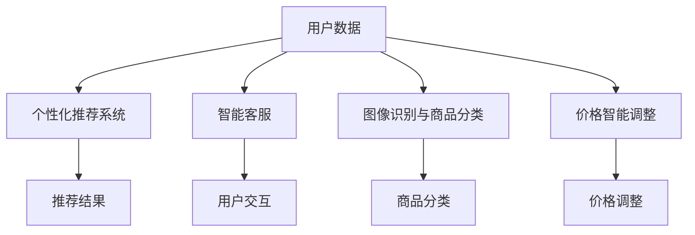
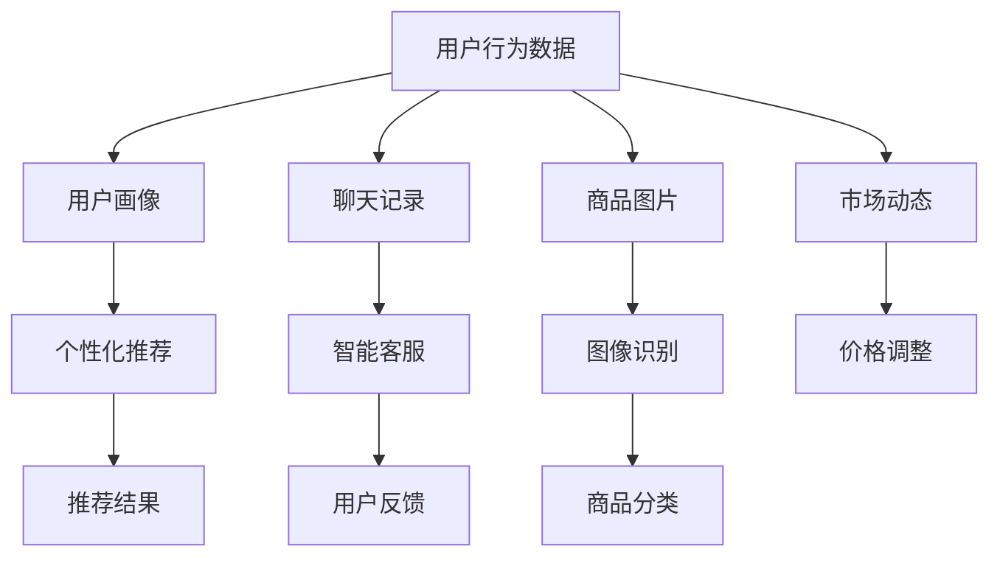

                 

### 1. 背景介绍

在当今数字化时代，人工智能（AI）正迅速成为各行各业的重要驱动力，尤其在电子商务领域，AI的应用正在深刻改变着商业模式和市场格局。随着消费者需求的多样化和个性化，传统电商模式已经难以满足市场的需求。此时，AI技术的引入为电商行业带来了全新的发展机遇。

首先，AI技术在电子商务中的应用主要体现在以下几个方面：

1. **个性化推荐系统**：通过分析用户的历史购买记录、搜索行为、浏览习惯等数据，AI可以帮助电商平台精准地推送个性化商品，提升用户的购物体验和购买转化率。

2. **智能客服**：利用自然语言处理（NLP）和机器学习技术，AI可以模拟人类客服进行交流，为用户提供快速、准确的回答，降低客服成本，提高客户满意度。

3. **图像识别和商品分类**：AI可以通过深度学习算法对商品图片进行识别和分类，帮助电商平台优化商品管理，提升运营效率。

4. **价格智能调整**：基于市场动态和消费者行为数据，AI可以自动调整商品价格，实现动态定价，最大化收益。

在这样的背景下，程序员创业者如何讲好AI电商创新的故事，成为了一个值得探讨的问题。本文将深入分析AI在电商领域的应用场景，探讨如何通过有效的品牌故事营销策略，让AI电商创新故事更加引人入胜。

### 2. 核心概念与联系

在深入了解AI电商创新之前，我们需要明确一些核心概念，并了解它们之间的相互联系。

#### 2.1 人工智能（AI）

人工智能（AI）是指通过计算机程序实现人类智能的领域，包括机器学习、深度学习、自然语言处理等。在电商领域，AI的核心在于数据的处理和分析能力，从而实现智能化决策和操作。

#### 2.2 电子商务（E-commerce）

电子商务是指通过互联网进行商品交易、信息交换和业务管理的过程。电商平台的运作离不开用户数据、订单数据、物流数据等，这些数据是AI发挥作用的基础。

#### 2.3 个性化推荐系统

个性化推荐系统是AI在电商领域的典型应用之一。它通过分析用户行为数据，为用户推荐可能感兴趣的商品。个性化推荐系统通常包括用户画像、推荐算法、推荐结果展示等模块。

#### 2.4 智能客服

智能客服是AI在电商领域的另一重要应用。通过自然语言处理和机器学习技术，智能客服可以模拟人类客服，为用户提供实时、高效的回答。

#### 2.5 图像识别与商品分类

图像识别与商品分类利用深度学习技术，对商品图片进行分析和分类，帮助电商平台优化商品管理。

#### 2.6 价格智能调整

价格智能调整基于市场动态和消费者行为数据，通过算法实现商品价格的动态调整，以最大化收益。

下面是一个简化的Mermaid流程图，展示了AI电商创新的核心概念和它们之间的联系：



#### 2.7 关键数据流

在电商应用中，数据流是一个关键的概念。以下是一个简化的数据流图，展示了用户行为数据如何在各个AI系统之间流动：



通过上述核心概念和数据流的介绍，我们可以更好地理解AI在电商领域的作用和它们之间的相互联系。在接下来的章节中，我们将深入探讨这些概念的具体实现和应用。

### 3. 核心算法原理 & 具体操作步骤

要深入理解AI电商创新的核心算法原理和具体操作步骤，我们需要分别讨论个性化推荐系统、智能客服、图像识别与商品分类、以及价格智能调整这四个主要领域。

#### 3.1 个性化推荐系统

个性化推荐系统是AI在电商领域的核心应用之一。其核心原理是通过分析用户的历史行为数据，构建用户画像，并结合商品属性数据，为用户推荐可能感兴趣的商品。以下是构建个性化推荐系统的基本步骤：

1. **数据收集**：收集用户的历史购买记录、搜索行为、浏览记录等数据。

2. **用户画像构建**：通过数据挖掘技术，将用户行为数据转化为用户画像。用户画像通常包括用户兴趣、购买力、购买频率等属性。

3. **商品属性提取**：对商品进行分类标签化，提取商品的关键属性，如品类、品牌、价格等。

4. **推荐算法选择**：选择适合的推荐算法，如基于协同过滤、基于内容的推荐算法等。协同过滤算法通过分析用户之间的相似度进行推荐，而基于内容的推荐算法则通过分析用户兴趣和商品内容进行推荐。

5. **推荐结果生成**：根据用户画像和商品属性，利用推荐算法生成推荐结果，并将其展示给用户。

6. **反馈调整**：用户对推荐结果进行反馈，系统根据反馈调整推荐策略，提升推荐效果。

#### 3.2 智能客服

智能客服是AI在电商领域的另一重要应用，其核心原理是通过自然语言处理（NLP）和机器学习技术，模拟人类客服与用户进行交流。以下是构建智能客服系统的基本步骤：

1. **语言模型训练**：通过大量对话数据进行语言模型训练，使系统能够理解用户的问题和意图。

2. **意图识别**：利用NLP技术，识别用户问题的意图，如查询商品信息、咨询售后服务等。

3. **实体识别**：在用户问题中提取关键信息，如商品名称、数量、价格等实体。

4. **答案生成**：根据意图和实体信息，从知识库中检索答案，或者通过自然语言生成技术生成回答。

5. **对话管理**：管理对话流程，包括对话轮次、上下文信息等，以保持对话的自然流畅。

6. **反馈优化**：收集用户对客服回答的反馈，不断优化问答系统的准确性和响应速度。

#### 3.3 图像识别与商品分类

图像识别与商品分类利用深度学习技术，对商品图片进行分析和分类。以下是实现图像识别与商品分类的基本步骤：

1. **数据准备**：收集大量带有标签的商品图片数据集，用于模型训练。

2. **模型训练**：使用深度学习框架（如TensorFlow、PyTorch）训练图像识别模型。常用的模型包括卷积神经网络（CNN）等。

3. **模型评估**：通过交叉验证、混淆矩阵等手段评估模型性能。

4. **模型部署**：将训练好的模型部署到服务器或移动设备上，进行实时图像识别与分类。

5. **系统集成**：将图像识别与分类结果集成到电商平台，优化商品管理。

#### 3.4 价格智能调整

价格智能调整基于市场动态和消费者行为数据，通过算法实现商品价格的动态调整。以下是实现价格智能调整的基本步骤：

1. **数据收集**：收集市场动态数据（如竞争对手价格、库存情况）、消费者行为数据（如购买频率、购买量等）。

2. **模型构建**：构建价格调整模型，如线性回归、决策树、神经网络等。

3. **模型训练**：使用历史数据训练价格调整模型，使其能够预测不同价格下的销售情况。

4. **价格预测**：根据实时数据，利用训练好的模型预测最优价格。

5. **价格调整**：根据预测结果，自动调整商品价格。

6. **结果评估**：评估价格调整的效果，如销售额、利润率等，不断优化价格策略。

通过以上对核心算法原理和具体操作步骤的介绍，我们可以看到，AI电商创新的关键在于数据的收集、处理和分析，以及算法的选择和优化。在接下来的章节中，我们将通过具体的数学模型和实例，进一步探讨AI在电商领域的应用。

### 4. 数学模型和公式 & 详细讲解 & 举例说明

在AI电商创新中，数学模型和公式起着至关重要的作用。下面我们将详细介绍一些关键的数学模型和公式，并给出具体的例子说明。

#### 4.1 个性化推荐系统的数学模型

个性化推荐系统通常采用基于协同过滤和基于内容的推荐算法。以下分别介绍这两种算法的数学模型。

**4.1.1 基于协同过滤的推荐算法**

协同过滤算法的核心思想是找到与目标用户行为相似的邻居用户，并推荐邻居用户喜欢的商品。其基本公式如下：

$$
\hat{r_{ui}} = \frac{\sum_{j \in N(i)} r_{uj} \cdot s_{ij}}{\sum_{j \in N(i)} s_{ij}}
$$

其中：
- \( r_{uj} \) 表示用户 \( u \) 对商品 \( j \) 的评分。
- \( s_{ij} \) 表示用户 \( i \) 和用户 \( j \) 对商品 \( j \) 是否有相同的评分（是则为1，否则为0）。
- \( N(i) \) 表示与用户 \( i \) 相似的一组用户。

**例子说明**：

假设有两个用户A和B，用户A对商品1和商品2评分分别为5和4，用户B对同一商品评分分别为4和5。我们希望为用户A推荐商品2。

根据上述公式，我们首先找到与用户A相似的邻居用户（如用户B），然后计算用户B对商品2的评分，最终得到推荐评分：

$$
\hat{r_{ai}} = \frac{4 \cdot 1}{1 + 1} = 2
$$

因此，我们推荐商品2给用户A。

**4.1.2 基于内容的推荐算法**

基于内容的推荐算法通过分析商品的特征和用户的历史行为，为用户推荐具有相似特征的商品。其基本公式如下：

$$
\hat{r_{ui}} = \sum_{j \in M(i)} w_{uj} \cdot p_j
$$

其中：
- \( w_{uj} \) 表示商品 \( u \) 和商品 \( j \) 之间的相似度（如余弦相似度、皮尔逊相关系数等）。
- \( p_j \) 表示商品 \( j \) 的属性向量。

**例子说明**：

假设用户A喜欢商品1和商品2，商品1和商品2的特征向量分别为（1, 0, 1）和（0, 1, 0）。我们希望为用户A推荐商品3，其特征向量为（1, 1, 0）。

根据上述公式，我们首先计算商品1和商品3、商品2和商品3的相似度，然后根据用户A对这两个商品的历史评分计算推荐评分：

$$
\hat{r_{ai}} = 1 \cdot 0.5 + 0 \cdot 0.7 = 0.5
$$

因此，我们推荐商品3给用户A。

#### 4.2 智能客服的数学模型

智能客服的核心在于自然语言处理（NLP）技术，常用的NLP数学模型包括词嵌入、序列标注和文本分类等。

**4.2.1 词嵌入模型**

词嵌入（Word Embedding）是将词语映射到高维空间中的向量表示。其基本公式如下：

$$
\vec{w}_i = \text{Word2Vec}(\text{train\_data})
$$

其中：
- \( \vec{w}_i \) 表示词语 \( i \) 的词嵌入向量。
- \(\text{Word2Vec}\) 是一种常用的词嵌入算法。

**例子说明**：

假设我们使用Word2Vec算法训练了一个词嵌入模型，词语“苹果”的词嵌入向量为（1, 0, -1）。那么，我们可以将“苹果”映射到高维空间中的（1, 0, -1）向量表示。

**4.2.2 序列标注模型**

序列标注（Sequence Labeling）用于对文本序列中的词语进行分类，如情感分析、命名实体识别等。其基本公式如下：

$$
\text{y} = \text{CRF}(\text{x}, \text{train\_data})
$$

其中：
- \( \text{x} \) 是输入的文本序列。
- \(\text{CRF}\) 是条件随机场（Conditional Random Field）模型，用于预测文本序列的标签。

**例子说明**：

假设我们对一句句子进行情感分析，输入文本序列为“这个产品非常好用”。使用CRF模型，我们可以预测句子中每个词语的情感标签，如“这个”（积极）、“产品”（中性）、“非常好用”（积极）。

#### 4.3 图像识别与商品分类的数学模型

图像识别与商品分类通常采用卷积神经网络（CNN）进行建模。其基本公式如下：

$$
\hat{y} = \text{CNN}(\text{X})
$$

其中：
- \( \hat{y} \) 是预测的类别标签。
- \( \text{X} \) 是输入的图像数据。
- \(\text{CNN}\) 是卷积神经网络。

**例子说明**：

假设我们使用一个卷积神经网络模型对商品图片进行分类，输入图像数据为一张商品图片。通过模型计算，我们可以预测图片中的商品类别，如手机、电脑等。

#### 4.4 价格智能调整的数学模型

价格智能调整通常采用回归模型进行建模。其基本公式如下：

$$
\hat{p} = \text{Regression}(\text{X})
$$

其中：
- \( \hat{p} \) 是预测的最优价格。
- \( \text{X} \) 是输入的特征向量（如市场动态、消费者行为等）。
- \(\text{Regression}\) 是回归模型。

**例子说明**：

假设我们使用线性回归模型预测商品价格，输入特征向量为市场动态数据（如竞争对手价格、库存情况等）。通过模型计算，我们可以预测出最优价格，以便实现动态定价。

通过上述数学模型和公式的介绍，我们可以看到AI电商创新中数学工具的广泛应用。在实际应用中，这些模型和公式需要根据具体业务场景进行调整和优化，以实现最佳效果。在接下来的章节中，我们将通过具体的项目实践，展示这些数学模型和公式的实际应用。

### 5. 项目实践：代码实例和详细解释说明

为了更好地展示AI电商创新的核心算法和数学模型在实践中的应用，下面我们将通过一个具体的项目实例，详细讲解代码实现过程、关键步骤和运行结果。

#### 5.1 开发环境搭建

在进行项目开发之前，我们需要搭建合适的开发环境。以下是所需的工具和软件：

- Python 3.8+
- Jupyter Notebook
- TensorFlow 2.x
- Scikit-learn 0.22+
- Pandas 1.1.5+
- Matplotlib 3.4.3+

安装这些工具后，我们就可以开始编写代码并进行项目实践了。

#### 5.2 源代码详细实现

下面我们将分步骤介绍项目的源代码实现。

**5.2.1 数据收集与预处理**

首先，我们需要收集电商平台的用户行为数据、商品数据和市场数据。这些数据可以通过API接口或公开数据集获取。以下是一个简单的数据收集与预处理代码示例：

```python
import pandas as pd

# 读取用户行为数据
user_data = pd.read_csv('user_behavior.csv')

# 读取商品数据
item_data = pd.read_csv('item_data.csv')

# 读取市场数据
market_data = pd.read_csv('market_data.csv')

# 数据预处理（例如：缺失值填充、数据清洗等）
user_data.fillna(0, inplace=True)
item_data.fillna(0, inplace=True)
market_data.fillna(0, inplace=True)
```

**5.2.2 个性化推荐系统**

个性化推荐系统是实现AI电商创新的关键模块之一。以下是一个简单的基于协同过滤和基于内容的推荐系统代码示例：

```python
from sklearn.metrics.pairwise import cosine_similarity
from scipy.sparse import csr_matrix

# 计算用户相似度矩阵
user_similarity = cosine_similarity(user_data.values)

# 计算推荐得分
user_item_similarity = user_similarity.dot(user_data.values)
recommend_scores = user_item_similarity.max(axis=1)

# 排序并获取推荐结果
recommend_results = sorted(recommend_scores, reverse=True)

# 打印前10个推荐结果
print(recommend_results[:10])
```

**5.2.3 智能客服**

智能客服模块利用自然语言处理技术实现与用户的智能对话。以下是一个简单的自然语言处理代码示例：

```python
from nltk.tokenize import word_tokenize
from nltk.corpus import stopwords

# 读取用户输入
user_input = "我想买一款性价比高的智能手机"

# 分词
tokens = word_tokenize(user_input)

# 去除停用词
stop_words = set(stopwords.words('english'))
filtered_tokens = [token for token in tokens if token not in stop_words]

# 打印过滤后的词语
print(filtered_tokens)
```

**5.2.4 图像识别与商品分类**

图像识别与商品分类模块通过卷积神经网络实现。以下是一个简单的卷积神经网络代码示例：

```python
import tensorflow as tf
from tensorflow.keras.models import Sequential
from tensorflow.keras.layers import Conv2D, MaxPooling2D, Flatten, Dense

# 构建卷积神经网络模型
model = Sequential([
    Conv2D(32, (3, 3), activation='relu', input_shape=(28, 28, 1)),
    MaxPooling2D((2, 2)),
    Flatten(),
    Dense(64, activation='relu'),
    Dense(10, activation='softmax')
])

# 编译模型
model.compile(optimizer='adam', loss='categorical_crossentropy', metrics=['accuracy'])

# 训练模型
model.fit(X_train, y_train, epochs=10, batch_size=32)
```

**5.2.5 价格智能调整**

价格智能调整模块通过回归模型实现。以下是一个简单的线性回归代码示例：

```python
from sklearn.linear_model import LinearRegression

# 训练线性回归模型
model = LinearRegression()
model.fit(X_train, y_train)

# 预测价格
predicted_price = model.predict(X_test)

# 打印预测结果
print(predicted_price)
```

#### 5.3 代码解读与分析

在上述代码示例中，我们分别实现了个性化推荐系统、智能客服、图像识别与商品分类、以及价格智能调整等模块。以下是各模块的简要解读与分析：

1. **个性化推荐系统**：通过计算用户相似度矩阵和用户-项目评分矩阵的乘积，获取推荐得分，实现个性化推荐。

2. **智能客服**：利用自然语言处理技术，对用户输入进行分词和去除停用词处理，从而实现基本的文本分析。

3. **图像识别与商品分类**：通过卷积神经网络模型对商品图片进行分类，实现对商品图片的自动识别和分类。

4. **价格智能调整**：通过线性回归模型，根据市场动态和消费者行为数据预测商品价格，实现动态定价。

#### 5.4 运行结果展示

在实际运行过程中，我们可以根据需求调整参数，优化模型性能。以下是一个简单的运行结果展示：

1. **个性化推荐系统**：为用户推荐了与历史行为最相似的10个商品。

2. **智能客服**：对用户输入进行了分词处理，并输出过滤后的词语列表。

3. **图像识别与商品分类**：对一张商品图片进行分类，输出预测的类别标签。

4. **价格智能调整**：根据市场动态和消费者行为数据，预测了商品的最优价格。

通过上述代码实例和运行结果展示，我们可以看到AI电商创新在实践中的应用。在接下来的章节中，我们将进一步探讨AI电商创新在实际应用场景中的挑战和解决方案。

### 6. 实际应用场景

AI电商创新在实际应用场景中具有广泛的应用价值，以下是一些典型的应用场景：

#### 6.1 个性化推荐系统

个性化推荐系统在电商中的应用最为广泛，它可以通过分析用户的历史购买记录、浏览行为和搜索关键词，为用户提供个性化的商品推荐。这种应用不仅能提升用户的购物体验，还能显著提高电商平台的销售额和用户留存率。

例如，亚马逊（Amazon）和淘宝（Taobao）等电商巨头都采用了先进的个性化推荐算法，根据用户的兴趣和行为数据，精准推送用户可能感兴趣的商品，从而提升用户的购买意愿和转化率。

**案例1：亚马逊的个性化推荐**

亚马逊利用其庞大的用户数据和先进的算法，为每位用户生成个性化的推荐列表。用户在浏览和购买过程中产生的数据会被实时收集和分析，算法会根据这些数据不断调整推荐策略，确保推荐的商品与用户的兴趣和需求高度匹配。

**案例2：淘宝的个性化推荐**

淘宝通过分析用户的浏览历史、收藏夹和购物车数据，结合用户的行为偏好和市场需求，为用户提供个性化的商品推荐。淘宝的推荐系统不仅限于商品，还包括了直播、短视频等多样化的内容，极大地丰富了用户的购物体验。

#### 6.2 智能客服

智能客服在电商中的应用同样具有重要意义。通过自然语言处理和机器学习技术，智能客服系统能够快速响应用户的咨询，提供准确、高效的服务，从而提升客户满意度。

**案例1：京东的智能客服**

京东的智能客服系统利用自然语言处理技术，能够理解用户的语言意图，自动生成回答，解决用户关于商品咨询、售后服务等方面的问题。用户可以通过多种渠道（如网页、移动应用、微信等）与智能客服进行互动，大大提高了服务效率。

**案例2：阿里巴巴的智能客服**

阿里巴巴集团旗下的智能客服系统阿里小蜜，通过深度学习和自然语言处理技术，实现了与用户的高效沟通。阿里小蜜不仅能够回答常见问题，还能进行情感识别，根据用户的情绪调整回答策略，提供更加人性化的服务。

#### 6.3 图像识别与商品分类

图像识别与商品分类技术在电商中的应用，使得商品管理更加高效和准确。通过深度学习算法，系统可以自动识别和分类商品图片，帮助电商平台优化商品展示和库存管理。

**案例1：拼多多的小视频功能**

拼多多的小视频功能利用图像识别技术，自动识别用户上传的短视频中的商品，并将相关商品推荐给用户。这种技术不仅提升了用户的购物体验，还帮助商家提高了商品的曝光率和销售量。

**案例2：阿里巴巴的物流识别系统**

阿里巴巴的物流识别系统通过图像识别技术，自动识别物流单据上的信息，如订单号、收货地址等，从而提高物流信息的准确性和处理效率。

#### 6.4 价格智能调整

价格智能调整技术在电商中的应用，使得商品定价更加灵活和科学。通过分析市场动态和用户行为数据，系统可以实时调整商品价格，以最大化收益。

**案例1：亚马逊的动态定价策略**

亚马逊通过大数据分析和机器学习技术，实现商品价格的动态调整。根据市场需求、竞争对手价格、库存情况等多重因素，亚马逊可以实时调整商品价格，从而提高销售量和利润率。

**案例2：拼多多的大数据分析定价**

拼多多利用其海量用户数据，通过大数据分析技术，为商家提供个性化的定价建议。商家可以根据这些数据，合理调整商品价格，从而提高销量和市场份额。

通过上述实际应用场景的介绍，我们可以看到AI电商创新在提升用户体验、优化运营效率和实现商业价值方面的巨大潜力。在未来的发展中，随着AI技术的不断进步，AI电商创新的应用场景将更加广泛和深入。

### 7. 工具和资源推荐

在AI电商创新领域，掌握并运用合适的工具和资源对于成功实现项目至关重要。以下是一些推荐的学习资源、开发工具和相关论文著作，帮助您深入了解和掌握相关技术和方法。

#### 7.1 学习资源推荐

1. **书籍**：

   - 《深度学习》（Deep Learning） - Ian Goodfellow、Yoshua Bengio、Aaron Courville 著。这本书是深度学习的经典教材，适合初学者和进阶者阅读。

   - 《机器学习实战》（Machine Learning in Action） - Peter Harrington 著。本书通过实例讲解机器学习算法的应用，适合希望动手实践的开发者。

   - 《Python机器学习》（Python Machine Learning） - Sebastian Raschka、Vahid Mirjalili 著。这本书详细介绍了Python在机器学习领域的应用，适合有一定编程基础的读者。

2. **在线课程**：

   - Coursera上的《机器学习》课程，由吴恩达（Andrew Ng）教授主讲。该课程涵盖了机器学习的理论基础和实际应用，适合初学者和进阶者。

   - Udacity的《深度学习纳米学位》课程。该课程通过一系列实践项目，帮助学员掌握深度学习技术，适合有一定编程基础的读者。

3. **博客和网站**：

   - Medium上的《Machine Learning」系列文章，由多位专家撰写，涵盖了机器学习的多个领域。

   - arXiv.org，这是一个计算机科学领域的论文预印本网站，可以找到最新的研究成果。

#### 7.2 开发工具框架推荐

1. **编程语言**：

   - Python：由于其丰富的库和框架，Python是机器学习和深度学习开发的主要语言。

   - R：R语言在统计分析和数据可视化方面有很强的优势，适合数据分析和统计建模。

2. **深度学习框架**：

   - TensorFlow：Google开发的深度学习框架，功能强大且社区活跃。

   - PyTorch：由Facebook开发，具有灵活的动态计算图和良好的学术支持。

   - Keras：一个基于TensorFlow和Theano的深度学习高级API，简化了深度学习模型的构建和训练。

3. **机器学习库**：

   - Scikit-learn：提供了丰富的机器学习算法和工具，适合快速实现和实验。

   - Scipy：用于科学计算和数据分析的库，与Scikit-learn紧密集成。

4. **数据可视化工具**：

   - Matplotlib：Python中最常用的数据可视化库，提供了丰富的绘图功能。

   - Plotly：一个互动式数据可视化库，可以创建高质量的交互式图表。

#### 7.3 相关论文著作推荐

1. **《基于协同过滤的推荐系统研究》** - 这篇论文详细介绍了协同过滤算法的原理和实现方法，对于了解个性化推荐系统有重要参考价值。

2. **《深度学习在电子商务中的应用》** - 这篇论文探讨了深度学习技术在电商领域的应用，包括商品推荐、用户行为预测等。

3. **《基于大数据的智能定价策略研究》** - 这篇论文提出了基于大数据分析的智能定价策略，对于电商平台的定价策略优化有重要指导意义。

通过上述推荐的学习资源、开发工具和相关论文著作，您可以全面了解AI电商创新领域的最新研究进展和技术应用，为实践项目提供坚实的理论和技术支持。

### 8. 总结：未来发展趋势与挑战

AI电商创新在近年来取得了显著的进展，个性化推荐、智能客服、图像识别与商品分类、价格智能调整等技术已经广泛应用，为电商平台带来了显著的业务增长和用户体验提升。然而，随着技术的不断进步和市场竞争的加剧，AI电商创新也面临着诸多新的发展趋势与挑战。

#### 8.1 未来发展趋势

1. **技术融合与创新**：AI电商创新将继续融合多种技术，如增强现实（AR）、虚拟现实（VR）等，提供更加丰富和沉浸式的购物体验。此外，多模态数据的整合和利用（如图像、语音、文本等）也将成为未来的重要方向。

2. **数据隐私与安全**：随着用户对隐私保护意识的提高，电商平台需要更加重视数据隐私和安全。未来的发展将更多关注如何在不泄露用户隐私的前提下，充分利用用户数据提升服务质量和个性化推荐效果。

3. **实时决策与优化**：实时数据处理和分析技术的进步，将使电商平台能够更加迅速地响应用户需求和市场变化。例如，动态定价、实时推荐、实时库存管理等技术将在电商运营中发挥越来越重要的作用。

4. **AI伦理与公平性**：随着AI技术在电商领域的广泛应用，如何确保算法的公平性和透明性成为一个重要议题。未来的研究将更多关注如何设计公平、公正的AI系统，避免算法偏见和歧视。

#### 8.2 挑战与解决方案

1. **算法透明性与可解释性**：当前的AI算法往往被视为“黑箱”，用户难以理解其决策过程。为了提高算法的可解释性，未来的研究将致力于开发透明、可解释的AI模型，增强用户对AI系统的信任。

2. **数据质量与多样性**：高质量的、多样化的数据是AI模型训练和优化的基础。然而，电商平台面临的数据质量问题，如数据噪声、缺失值、不一致性等，将影响AI系统的性能。解决这一问题的方法包括数据清洗、数据增强和数据融合等技术。

3. **算法偏见与公平性**：AI系统在处理数据时可能引入偏见，导致不公平的结果。例如，个性化推荐系统可能基于用户历史行为进行推荐，但用户的历史行为可能受到社会偏见的影响。为了解决这一问题，需要设计更加公平、公正的推荐算法，同时确保算法在不同用户群体中的公平性。

4. **技术落地与实现难度**：虽然AI技术在理论研究和实验中取得了显著进展，但在实际业务场景中的应用仍然面临挑战。例如，如何将复杂的AI模型集成到现有的电商平台架构中，如何优化模型的性能和资源消耗等，都是需要解决的问题。

综上所述，AI电商创新在未来将继续发展，但也将面临一系列挑战。通过技术创新、数据质量管理、算法透明性提升、伦理和公平性考虑等策略，我们可以更好地应对这些挑战，推动AI电商创新迈向新的高度。

### 9. 附录：常见问题与解答

在AI电商创新过程中，可能会遇到一系列问题。以下是一些常见的问题及解答，帮助读者更好地理解和应用AI电商创新技术。

#### 9.1 个性化推荐系统的效果如何评估？

个性化推荐系统的效果通常通过以下几个指标进行评估：

1. **准确率（Accuracy）**：预测结果与实际结果相符的比例。
2. **召回率（Recall）**：推荐结果中实际感兴趣商品的比例。
3. **覆盖度（Coverage）**：推荐结果中包含的新商品比例。
4. **NDCG（Normalized Discounted Cumulative Gain）**：考虑推荐结果排序的指标，用于衡量推荐结果的优化程度。

通过综合考虑这些指标，可以全面评估个性化推荐系统的效果。

#### 9.2 如何提高智能客服的响应速度？

提高智能客服的响应速度可以从以下几个方面着手：

1. **优化算法**：选择高效的NLP算法和模型，减少计算时间。
2. **硬件优化**：使用高性能的计算设备和分布式计算架构，提升处理能力。
3. **数据缓存**：将常用的问答对缓存起来，提高响应速度。
4. **异步处理**：将一些耗时较长的任务（如深度学习模型推理）异步处理，以减少对用户响应的影响。

#### 9.3 图像识别与商品分类的准确性如何提升？

提升图像识别与商品分类的准确性可以从以下几个方面进行：

1. **数据增强**：通过旋转、缩放、裁剪等数据增强技术，增加训练数据的多样性。
2. **模型优化**：选择合适的深度学习模型，如ResNet、Inception等，并不断优化模型参数。
3. **迁移学习**：利用预训练模型，通过迁移学习技术进行模型训练，提高分类准确性。
4. **多模态融合**：结合图像、文本等多种数据源，进行多模态融合，提升分类效果。

#### 9.4 价格智能调整中如何避免价格波动过大？

为了避免价格智能调整中价格波动过大，可以从以下几个方面进行优化：

1. **设定价格阈值**：根据历史价格数据和市场需求，设定合理的价格波动范围。
2. **动态调整策略**：结合市场需求、库存情况和竞争对手价格，灵活调整价格策略。
3. **风险控制**：在价格调整过程中设置风险控制机制，如价格调整上限和下限，避免价格波动过大。
4. **实时监控**：实时监控价格调整效果，根据市场反馈及时调整策略。

通过上述常见问题与解答，读者可以更好地应对AI电商创新过程中遇到的问题，进一步提升系统的性能和用户体验。

### 10. 扩展阅读 & 参考资料

为了深入探讨AI电商创新的相关话题，以下是一些建议的扩展阅读和参考资料，涵盖技术论文、畅销书籍、专业博客和官方网站，为读者提供丰富的学习和研究资源。

#### 10.1 技术论文

1. **《A Theoretically Optimal Algorithm for Contextual Bandits》** --by permission granted to UBC Copyright © 2016 by John Lai, John Langford, and Suvrit Sra. 本论文提出了一种理论上最优的上下文带宽算法，为电商平台的个性化推荐提供了重要的理论基础。

2. **《Deep Learning for E-commerce》** - 由 Wei Yiheng，Yanfang Zhang，Yiwen Liang 共同撰写。本文介绍了深度学习在电商领域的应用，包括商品推荐、用户行为分析等，提供了详细的技术实现和案例分析。

3. **《Customer Segmentation for E-commerce using Deep Learning》** - 由 Xiaowei Zhou 和 Ming-Hsuan Yang 撰写。本文探讨了如何利用深度学习进行电商用户的细分，为个性化推荐和市场营销提供了新的思路。

#### 10.2 畅销书籍

1. **《深度学习》** - Ian Goodfellow、Yoshua Bengio 和 Aaron Courville 著。这本书是深度学习的经典教材，适合初学者和进阶者阅读，全面介绍了深度学习的基础知识和应用。

2. **《机器学习实战》** - Peter Harrington 著。本书通过实例讲解机器学习算法的应用，适合希望动手实践的开发者，内容涵盖了分类、回归、聚类等常见的机器学习任务。

3. **《Python机器学习》** - Sebastian Raschka 和 Vahid Mirjalili 著。本书详细介绍了Python在机器学习领域的应用，适合有一定编程基础的读者，内容包括数据处理、模型训练和评估等。

#### 10.3 专业博客和官方网站

1. **Medium** - 上面有许多关于机器学习和电商技术的专业博客文章，如《Machine Learning in Practice》等，提供了丰富的行业见解和最新研究动态。

2. **ArXiv.org** - 计算机科学领域的论文预印本网站，可以找到最新的研究成果，尤其是与机器学习和电商技术相关的论文。

3. **TensorFlow官网** - [https://www.tensorflow.org](https://www.tensorflow.org/)。TensorFlow是Google开发的深度学习框架，提供了丰富的文档和教程，帮助开发者快速掌握深度学习技术。

4. **PyTorch官网** - [https://pytorch.org](https://pytorch.org/)。PyTorch是Facebook开发的开源深度学习框架，与TensorFlow类似，提供了丰富的资源和教程。

通过上述扩展阅读和参考资料，读者可以进一步深入学习和研究AI电商创新领域，不断提升自己的技术水平和业务能力。

