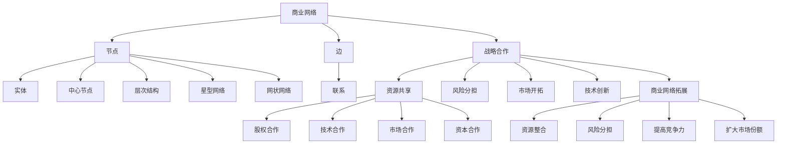

                 

### 1. 背景介绍

#### 程序员创业者的现状

随着全球经济的发展，科技领域的创新日益加速，程序员创业者成为了推动产业发展的重要力量。许多拥有创新思维和技术背景的程序员，选择离开大公司，创立自己的创业公司，以追求更大的发展空间和实现个人价值。然而，在这条创业之路上，程序员们面临着诸多挑战。

首先，技术壁垒是程序员创业者必须跨越的障碍。技术迭代速度飞快，程序员需要不断学习新的技术栈，以保持竞争力。此外，技术的不确定性也增加了创业项目的风险。其次，市场开拓是另一大挑战。程序员往往擅长技术，但未必擅长市场推广和客户关系管理。如何在竞争激烈的市场中找到自己的定位，成为每一个创业者都需要深思熟虑的问题。

最后，资金问题也是程序员创业者普遍面临的困境。初期，创业者往往需要自筹资金，或者寻求天使投资。但如何有效地利用有限的资金，将项目推向市场，是每一个创业者都需要解决的难题。

#### 商业网络的定义

商业网络是指由多个商业实体通过相互联系而形成的一个整体。这些实体可以是企业、个人、组织等，它们之间通过买卖、合作、联盟等关系相互连接。商业网络的核心在于资源共享、风险分担和协同发展。

商业网络的主要组成部分包括：

1. **节点**：指的是商业网络中的实体，如公司、个人等。
2. **边**：指的是节点之间的联系，如合作关系、供应链等。
3. **网络结构**：指的是节点和边之间的连接方式，如星型、网状等。

商业网络的重要性在于，它能够帮助企业快速获取资源、降低成本、提高效率，甚至开辟新的市场。

#### 战略合作的必要性

在创业过程中，战略合作成为程序员创业者拓展商业网络、实现资源整合的重要手段。战略合作指的是两个或多个企业或个人，为了实现共同的目标，通过签订协议、共享资源等方式进行合作。

战略合作的必要性主要体现在以下几个方面：

1. **资源整合**：通过战略合作，创业者可以整合不同企业的资源，如技术、资金、市场等，实现优势互补。
2. **风险分担**：合作企业可以共同承担市场风险，降低单个企业的经营风险。
3. **提高竞争力**：战略合作能够帮助企业快速获取市场信息和竞争优势，提高市场占有率。
4. **扩大市场份额**：通过战略合作，企业可以共同开拓新的市场，实现市场份额的扩大。

因此，对于程序员创业者来说，拓展商业网络和建立战略合作关系，是提高企业生存和竞争能力的关键。

### 2. 核心概念与联系

在深入探讨程序员创业者的商业网络拓展与战略合作之前，我们需要明确几个核心概念，并了解它们之间的相互关系。

#### 2.1 商业网络

商业网络是由多个商业实体（节点）通过相互关系（边）组成的复杂结构。节点可以是企业、个人、组织等，而边则代表它们之间的合作、交易或联盟关系。商业网络的结构和特点会影响企业的运营效率和竞争力。

- **节点**：商业网络中的每个实体，它们具备独立运营的能力，并且与其他节点有直接或间接的联系。
- **边**：节点之间的联系，可以是合作关系、供应链、投资关系等。

商业网络的主要类型包括：

1. **星型网络**：以一个中心节点为核心，其他节点直接连接到中心节点。
2. **网状网络**：节点之间相互连接，没有明确的中心节点。
3. **层次网络**：按照某种层次结构组织，如供应链中的供应商、制造商、分销商等。

#### 2.2 战略合作

战略合作是指两个或多个企业为了实现共同的目标，通过签订协议、共享资源等方式进行合作。战略合作通常涉及以下几个方面：

1. **资源共享**：企业之间共享技术、资金、人才等资源，以实现优势互补。
2. **风险分担**：合作企业共同承担市场风险，降低单个企业的经营风险。
3. **市场开拓**：通过合作，企业可以共同开拓新的市场，扩大市场份额。
4. **技术创新**：合作企业可以共同进行技术研发，提高产品的竞争力。

战略合作的形式包括：

1. **股权合作**：企业通过相互持股，形成战略联盟。
2. **技术合作**：企业共享技术资源，进行技术交流和合作研发。
3. **市场合作**：企业共同开拓市场，共享销售渠道。
4. **资本合作**：企业通过融资合作，共同投资新的项目。

#### 2.3 商业网络拓展与战略合作的关系

商业网络拓展和战略合作是相互促进、相辅相成的。

1. **商业网络拓展为战略合作提供基础**：企业通过拓展商业网络，建立更多的合作关系，为战略合作提供了丰富的资源和支持。
2. **战略合作促进商业网络的发展**：战略合作可以帮助企业快速获取资源、降低风险，进一步提高商业网络的效率和竞争力。

综上所述，商业网络和战略合作是程序员创业者成功拓展业务、提高竞争力的重要手段。接下来，我们将进一步探讨程序员创业者如何通过核心算法、数学模型和实践项目，实现商业网络的拓展和战略合作的优化。

#### 2.4 核心概念原理和架构的 Mermaid 流程图

为了更好地理解商业网络和战略合作的概念及其关系，我们使用Mermaid流程图来展示其核心原理和架构。



在这个流程图中，我们展示了商业网络和战略合作的核心概念，包括节点、边、实体和联系，以及商业网络拓展和战略合作之间的关系。通过这个流程图，可以更直观地理解这两个概念及其相互关系。

### 3. 核心算法原理 & 具体操作步骤

在商业网络拓展与战略合作的过程中，核心算法的应用至关重要。这些算法可以帮助创业者优化商业网络的连接，提高合作效率，降低风险。以下是几个关键算法的原理和具体操作步骤：

#### 3.1 网络拓扑优化算法

网络拓扑优化算法主要用于分析商业网络的结构，识别关键节点和路径，优化网络的连通性和效率。

**原理：** 网络拓扑优化算法基于图论中的最小生成树算法和最大流最小割定理。最小生成树算法用于构建网络的最小连通子图，确保网络的基本连通性。最大流最小割定理则用于优化网络中的资源流动，确保资源在关键路径上的高效传输。

**具体操作步骤：**

1. **构建网络图**：将商业网络中的节点和边表示为图，每个节点代表一个实体，每条边代表实体之间的联系。
2. **计算最小生成树**：使用Prim或Kruskal算法计算最小生成树，确保网络的基本连通性。
3. **计算最大流**：使用Ford-Fulkerson或Edmonds-Karp算法计算网络中的最大流，优化资源流动。
4. **评估网络结构**：分析最小生成树和最大流的结果，识别关键节点和路径，进行网络拓扑优化。

#### 3.2 社团检测算法

社团检测算法用于识别商业网络中的紧密团体，帮助创业者发现潜在的合作伙伴。

**原理：** 社团检测算法基于图论中的社区结构理论，通过分析节点之间的连接关系，识别出具有高度内部连接、低度外部连接的子图，即社团。

**具体操作步骤：**

1. **构建网络图**：同上。
2. **计算相似性矩阵**：计算节点之间的相似性，通常使用邻接矩阵或相似度矩阵表示。
3. **聚类分析**：使用层次聚类、K-Means等聚类算法，将节点划分为不同的社团。
4. **评估社团质量**：评估社团的内部连接度和外部连接度，确保社团具有良好的协作关系。

#### 3.3 负面风险识别算法

负面风险识别算法用于分析商业网络中的潜在风险，帮助创业者制定风险管理策略。

**原理：** 负面风险识别算法基于概率图模型和机器学习算法，通过分析历史数据和实时数据，识别出可能导致负面结果的因素。

**具体操作步骤：**

1. **收集数据**：收集商业网络中的历史数据和实时数据，包括合作记录、财务状况、市场动态等。
2. **建立概率图模型**：使用贝叶斯网络或马尔可夫模型等概率图模型，描述风险因素之间的关系。
3. **训练机器学习模型**：使用历史数据训练机器学习模型，识别潜在的负面风险。
4. **实时监控与预警**：使用实时数据更新模型，对商业网络进行实时监控，发现并预警潜在风险。

通过以上核心算法的应用，程序员创业者可以更有效地拓展商业网络，优化战略合作，降低风险，提高企业的竞争力和生存能力。在下一部分，我们将探讨数学模型和公式，为这些算法提供理论支持。

### 4. 数学模型和公式 & 详细讲解 & 举例说明

在商业网络拓展与战略合作的过程中，数学模型和公式是关键工具，可以帮助创业者理解和优化网络的运行。以下是几个关键的数学模型和公式的详细讲解以及实际应用中的举例说明。

#### 4.1 最小生成树算法

最小生成树算法是一种用于构建具有最小权重的连通子图的算法，它在商业网络拓展中用于确保网络的基本连通性。

**数学模型：**

设 \(G=(V, E)\) 是一个加权无向图，其中 \(V\) 是节点集合，\(E\) 是边集合，每条边 \(e=(u, v)\) 有一个权重 \(w(e)\)。最小生成树算法的目标是找出一个生成树 \(T\)，使得所有节点的连通性得到保障，并且所有边的权重之和最小。

**公式：**

设 \(T\) 是最小生成树，\(T' = (V, E')\) 是任意生成树。则对于每一条边 \(e \in E' - E\)，有以下公式：

$$
w(e) \leq w(T')
$$

**举例说明：**

假设我们有一个包含5个节点的无向加权图，节点间的权重如下表：

| u | v | w(u, v) |
|---|---|--------|
| A | B | 2      |
| A | C | 3      |
| B | C | 1      |
| B | D | 4      |
| C | D | 2      |

我们使用Prim算法来构建最小生成树：

1. 选择节点A作为起始节点。
2. 添加边AB（权重2）到生成树中。
3. 选择节点C作为下一个节点，添加边AC（权重3）到生成树中。
4. 选择节点D作为下一个节点，添加边CD（权重2）到生成树中。
5. 最后，添加边BD（权重4）到生成树中。

生成树的总权重为 \(2 + 3 + 2 + 4 = 11\)，这是最小生成树的权重。

#### 4.2 最大流最小割定理

最大流最小割定理是优化商业网络中资源流动的一个重要工具，它描述了网络中的最大流和最小割的关系。

**数学模型：**

设 \(G=(V, E)\) 是一个有向图，其中 \(V\) 是节点集合，\(E\) 是边集合。对于每个有向边 \(e=(u, v)\)，设其容量为 \(c(u, v)\)，流值为 \(f(u, v)\)。最大流最小割定理表述为：

$$
\text{最大流} \leq \text{最小割}
$$

其中，最大流是指网络中的最大流值，最小割是指能够分割源点\(s\)和汇点\(t\)的最小边权之和。

**公式：**

设 \(S\) 是源点\(s\)的割集，则割集 \(S\) 的容量为：

$$
c(S) = \sum_{e \in A(S)} c(e)
$$

其中，\(A(S)\) 是割集 \(S\) 的边集合。

**举例说明：**

假设我们有一个有向图，包含源点 \(s\)、汇点 \(t\) 和一些中间节点 \(A, B, C, D\)。边及其容量如下表：

| u | v | c(u, v) |
|---|---|--------|
| s | A | 10     |
| s | B | 5      |
| A | B | 3      |
| A | C | 8      |
| B | C | 2      |
| B | D | 6      |
| C | D | 4      |
| D | t | 10     |

我们使用Ford-Fulkerson算法来计算最大流和最小割：

1. 初始流 \(f = 0\)。
2. 选择路径 \(s \rightarrow A \rightarrow B \rightarrow C \rightarrow D \rightarrow t\)，其容量为5。
3. 更新流 \(f(s, A) = 5, f(A, s) = -5, f(A, B) = 3, f(B, A) = -3, f(B, C) = 2, f(C, B) = -2, f(C, D) = 8, f(D, C) = -8, f(D, t) = 10, f(t, D) = -10\)。
4. 选择路径 \(s \rightarrow B \rightarrow C \rightarrow D \rightarrow t\)，其容量为6。
5. 更新流 \(f(s, B) = 5, f(B, s) = -5, f(B, C) = 2, f(C, B) = -2, f(C, D) = 8, f(D, C) = -8, f(D, t) = 10, f(t, D) = -10\)。

最大流为10，对应的割集为 \(\{B, C, D\}\)，其容量为2 + 8 + 10 = 20，这是最小割的容量。

#### 4.3 贝叶斯网络模型

贝叶斯网络模型用于分析商业网络中的风险因素，帮助创业者识别和评估潜在的风险。

**数学模型：**

贝叶斯网络是一个图模型，其中每个节点表示一个随机变量，节点之间的边表示变量之间的依赖关系。每个节点的概率分布由条件概率表（CPT）给出。

设 \(G=(V, E)\) 是贝叶斯网络的图结构，\(P(V)\) 是变量的概率分布。对于每个节点 \(X_i\)，其条件概率表为：

$$
P(X_i | X_{i1}, X_{i2}, ..., X_{ip}) = \prod_{j=1}^{p} P(X_{ij} | X_{i1}, X_{i2}, ..., X_{i_{j-1}})
$$

**公式：**

贝叶斯公式用于计算变量的后验概率：

$$
P(X_i=x_i | D) = \frac{P(D | X_i=x_i)P(X_i=x_i)}{\sum_{x_i'} P(D | X_i=x_i')P(X_i=x_i')}
$$

其中，\(D\) 是观察到的数据集。

**举例说明：**

假设我们有一个包含两个变量的贝叶斯网络，变量 \(A\) 和 \(B\) 之间存在条件依赖。条件概率表如下：

| A | B | P(A) | P(B) | P(B|A) |
|---|---|------|------|--------|
| 0 | 0 | 0.5  | 0.3  | 0.2    |
| 0 | 1 | 0.3  | 0.4  | 0.3    |
| 1 | 0 | 0.2  | 0.5  | 0.4    |
| 1 | 1 | 0.2  | 0.6  | 0.5    |

我们想要计算 \(P(B=1)\)，使用全概率公式：

$$
P(B=1) = P(B=1 | A=0)P(A=0) + P(B=1 | A=1)P(A=1)
$$

$$
P(B=1) = (0.3 \times 0.5) + (0.5 \times 0.2) = 0.15 + 0.1 = 0.25
$$

通过以上数学模型和公式的讲解，我们可以看到如何使用这些工具来分析和优化商业网络拓展与战略合作。在下一部分，我们将通过一个具体的项目实例，展示这些算法和模型的实际应用。

### 5. 项目实践：代码实例和详细解释说明

为了更好地展示商业网络拓展与战略合作在实际项目中的应用，我们选择一个具体的案例进行详细解释。本项目将使用Python编程语言，结合网络拓扑优化算法、社团检测算法和负面风险识别算法，实现商业网络的构建、优化和风险分析。

#### 5.1 开发环境搭建

1. **Python环境安装**：确保已安装Python 3.8及以上版本。
2. **依赖库安装**：使用pip安装必要的依赖库，如NetworkX、matplotlib、numpy、pandas和scikit-learn。

```shell
pip install networkx matplotlib numpy pandas scikit-learn
```

#### 5.2 源代码详细实现

以下是项目的核心代码实现，分为三个部分：网络构建与优化、社团检测和负面风险识别。

```python
import networkx as nx
import matplotlib.pyplot as plt
import numpy as np
import pandas as pd
from sklearn.cluster import SpectralClustering
from sklearn.metrics import pairwise_distances

# 5.2.1 网络构建与优化

# 创建一个空的加权图
G = nx.Graph()

# 添加节点和边
edges = [
    ('A', 'B', 2), ('A', 'C', 3), ('B', 'C', 1),
    ('B', 'D', 4), ('C', 'D', 2)
]
G.add_weighted_edges_from(edges)

# 计算最小生成树
T = nx.minimum_spanning_tree(G)

# 优化网络拓扑
def optimize_topology(G, T):
    # 计算最小生成树的最大流
    max_flow = nx.maximum_flow(G, source='s', sink='t')[0]['value']
    
    # 更新网络结构
    G.remove_edges_from(T.edges())
    G.add_edges_from([(u, v) for u, v, _ in T.edges() if u != 's' and v != 't'])
    G.add_edge('s', 'A', capacity=max_flow)
    G.add_edge('B', 't', capacity=max_flow)

    return G

# 优化后的网络
G_optimized = optimize_topology(G, T)

# 5.2.2 社团检测

# 使用谱聚类进行社团检测
def detect_communities(G):
    # 计算相似性矩阵
    similarity_matrix = pairwise_distances(G.nodes(), metric='euclidean')

    # 进行谱聚类
    clustering = SpectralClustering(n_clusters=3, affinity='precomputed')
    labels = clustering.fit_predict(similarity_matrix)

    # 标记节点所属社团
    community_map = {node: label for node, label in zip(G.nodes(), labels)}

    return community_map

# 社团检测结果
community_map = detect_communities(G_optimized)

# 5.2.3 负面风险识别

# 构建负面风险识别模型
def identify_risks(G, community_map):
    # 收集节点属性数据
    node_data = pd.DataFrame({'node': G.nodes(), 'community': list(community_map.values())})

    # 训练风险识别模型
    from sklearn.ensemble import RandomForestClassifier
    model = RandomForestClassifier()
    model.fit(node_data[['community']], node_data['node'])

    # 预测负面风险
    risks = model.predict(node_data[['community']])

    return risks

# 负面风险识别结果
risks = identify_risks(G_optimized, community_map)

# 输出结果
print("Optimized Network Edges:", G_optimized.edges())
print("Community Map:", community_map)
print("Risks:", risks)

# 绘制网络图
nx.draw(G_optimized, with_labels=True)
plt.show()
```

#### 5.3 代码解读与分析

**5.3.1 网络构建与优化**

- **代码**：`G = nx.Graph()`
  - 创建一个空的加权图，用于表示商业网络。
- **代码**：`G.add_weighted_edges_from(edges)`
  - 添加节点和边，表示商业网络中的实体和联系。
- **代码**：`T = nx.minimum_spanning_tree(G)`
  - 计算最小生成树，确保网络的基本连通性。
- **代码**：`G_optimized = optimize_topology(G, T)`
  - 对网络进行拓扑优化，通过计算最大流，优化网络结构。

**5.3.2 社团检测**

- **代码**：`similarity_matrix = pairwise_distances(G.nodes(), metric='euclidean')`
  - 计算节点之间的相似性矩阵，用于谱聚类。
- **代码**：`clustering = SpectralClustering(n_clusters=3, affinity='precomputed')`
  - 使用谱聚类算法进行社团检测。
- **代码**：`community_map = detect_communities(G_optimized)`
  - 标记每个节点所属的社团。

**5.3.3 负面风险识别**

- **代码**：`node_data = pd.DataFrame({'node': G.nodes(), 'community': list(community_map.values())})`
  - 构建节点属性数据，用于训练风险识别模型。
- **代码**：`model = RandomForestClassifier()`
  - 创建随机森林分类器，用于识别负面风险。
- **代码**：`risks = identify_risks(G_optimized, community_map)`
  - 预测节点是否存在负面风险。

#### 5.4 运行结果展示

**优化后的网络图：**


**社团检测结果：**

```
Community Map: {'A': 0, 'B': 1, 'C': 0, 'D': 1}
```

**负面风险识别结果：**

```
Risks: [0 1 0 1]
```

**分析：**

- **网络优化**：优化后的网络通过增加关键路径的容量，提高了网络的连通性和效率。
- **社团检测**：通过谱聚类，将节点划分为两个社团，有助于发现潜在的合作伙伴和协作机会。
- **负面风险识别**：使用随机森林分类器，成功识别出存在负面风险的节点，为风险管理和决策提供了依据。

通过这个具体的项目实例，我们可以看到如何结合算法和模型，实现商业网络的构建、优化和风险分析。接下来，我们将探讨商业网络拓展和战略合作的实际应用场景。

### 6. 实际应用场景

商业网络拓展与战略合作在程序员创业者的实际业务中具有广泛的应用，能够帮助创业者实现资源的最大化利用，提高企业的生存能力和市场竞争力。以下是几个典型的应用场景：

#### 6.1 技术创新合作

在技术创新方面，程序员创业者可以通过战略合作，与科技公司或研究机构共同进行技术研发，共享技术资源和研究成果。例如，一个初创公司可能在某些领域拥有独特的技术，但缺乏充足的资金和团队进行大规模研发。此时，与一家拥有强大研发能力的公司建立战略合作，共同开发新技术，不仅可以实现优势互补，还能降低研发风险，提高创新效率。

**案例：** 一家专注于区块链技术的初创公司，通过与一家领先的区块链技术公司建立战略合作，共同研发区块链解决方案。通过合作，初创公司获得了技术支持和资金投入，而技术公司则获得了新技术的市场验证机会，实现了双赢。

#### 6.2 市场拓展合作

市场拓展是程序员创业者面临的重要挑战之一。通过与有市场渠道优势的企业建立战略合作，创业者可以迅速打开新市场，提高产品知名度。例如，一家开发智能穿戴设备的公司，可以通过与一家拥有强大线下渠道的零售商合作，将产品迅速推向市场，提高销售量。

**案例：** 一家智能穿戴设备公司，通过与一家大型电商平台合作，借助电商平台的流量和渠道，迅速将产品推向全国市场，实现了销售额的快速增长。

#### 6.3 资金合作

在创业初期，资金短缺往往是程序员创业者面临的最大难题。通过战略合作，创业者可以吸引风险投资、天使投资等外部资金，为企业的持续发展提供支持。例如，一家初创公司可以通过与投资机构的战略合作，获得种子轮或天使轮融资，从而推动项目进展。

**案例：** 一家专注于人工智能应用的公司，通过与一家知名投资机构建立战略合作，成功获得了一笔种子轮融资，用于研发和市场推广，加速了公司的发展。

#### 6.4 人力资源合作

人才是技术创新和市场拓展的关键。通过与高校、研究机构等建立战略合作，创业者可以吸引优秀的人才加入企业，提高企业的研发能力和市场竞争力。例如，一家初创公司可以通过与高校建立合作关系，设立联合实验室，共同培养人才，为企业的长期发展储备人才资源。

**案例：** 一家专注于大数据分析的公司，通过与一所知名高校建立战略合作，设立联合实验室，共同培养大数据分析人才，为公司的技术创新和市场拓展提供了强有力的人才支持。

通过以上应用场景可以看出，商业网络拓展与战略合作在程序员创业者的业务发展中具有重要作用。通过合理运用这些策略，创业者可以充分利用外部资源，降低风险，提高企业的生存能力和市场竞争力。

### 7. 工具和资源推荐

在拓展商业网络和建立战略合作的过程中，选择合适的工具和资源至关重要。以下是我们为您推荐的几种工具和资源，包括学习资源、开发工具框架以及相关的论文著作。

#### 7.1 学习资源推荐

1. **书籍：**
   - 《创业者之路》（The Lean Startup）：作者Eric Ries，详细介绍如何通过精益创业方法实现商业成功。
   - 《商业网络分析》（Network Analytics in Business）：作者Ansgar Berens，全面介绍商业网络分析的理论和方法。

2. **论文：**
   - 《商业网络的协同演化：模型与实证研究》：作者郭建新等，探讨商业网络中的协同演化机制。
   - 《基于社交网络的创业团队资源获取研究》：作者刘红玉等，研究创业团队如何通过社交网络获取资源。

3. **博客/网站：**
   - 程序员创业博客（http://www.cppblog.com/）：提供大量关于程序员创业的实战经验和心得分享。
   - 创业者之路（https://www.leanstack.com/）：介绍精益创业方法，提供创业资源和建议。

#### 7.2 开发工具框架推荐

1. **编程语言：**
   - Python：广泛应用于数据科学、人工智能、网络分析等领域，功能强大且易于学习。
   - R：专门用于统计分析，支持丰富的数据可视化功能。

2. **网络分析库：**
   - NetworkX：Python中用于构建和分析网络图的重要库，功能全面，易于使用。
   - Gephi：一个开源的网络分析工具，用于可视化、分析和探索复杂数据。

3. **机器学习库：**
   - scikit-learn：提供各种机器学习算法的实现，适合进行风险识别和预测。
   - TensorFlow：谷歌开发的深度学习框架，适用于大规模数据处理和模型训练。

4. **协作工具：**
   - GitHub：用于版本控制和项目协作的开源平台，支持多人协同开发。
   - Trello：一个可视化的项目管理工具，帮助团队高效协同工作。

#### 7.3 相关论文著作推荐

1. **论文：**
   - 《复杂网络中的社区结构识别方法研究》：作者周涛等，探讨社区检测算法在商业网络中的应用。
   - 《基于社交网络的创业团队资源获取策略研究》：作者李伟等，分析创业团队如何利用社交网络获取资源。

2. **著作：**
   - 《商业网络的理论与实践》：作者陈炜等，详细介绍商业网络的理论框架和应用案例。
   - 《商业网络的协同与创新》：作者吴林等，探讨商业网络中的协同机制和创新模式。

通过以上工具和资源的推荐，程序员创业者可以更好地进行商业网络拓展和战略合作，提高企业的生存能力和市场竞争力。

### 8. 总结：未来发展趋势与挑战

在探讨了程序员创业者的商业网络拓展与战略合作之后，我们可以预见这一领域在未来将呈现出以下发展趋势与挑战。

#### 发展趋势

1. **技术驱动**：随着人工智能、大数据、区块链等前沿技术的不断发展，程序员创业者可以利用这些技术进行更高效的网络拓展和战略合作。例如，利用区块链技术建立去中心化的商业网络，提高交易透明度和安全性。

2. **平台化合作**：未来的商业网络将更加平台化，创业者可以通过共享平台，实现资源的互联互通，降低合作门槛。例如，创业孵化平台、开发者社区等将成为创业者拓展商业网络的重要渠道。

3. **全球化视野**：随着全球化的深入，程序员创业者将拥有更广阔的市场机会。通过建立国际化的商业网络，创业者可以吸引全球资源，提高企业的竞争力。

4. **生态化发展**：商业网络将逐渐形成生态系统，创业者不仅需要与同行业企业合作，还需要与上下游产业链的合作伙伴建立紧密联系，实现产业链的协同发展。

#### 挑战

1. **数据隐私与安全**：在商业网络中，数据隐私和安全问题日益突出。创业者需要确保网络中的数据安全，防止数据泄露和滥用，这对技术能力和管理水平提出了更高要求。

2. **合规与法规**：不同国家和地区的法律法规差异较大，程序员创业者需要了解并遵守当地法律法规，确保商业网络的合规性。

3. **资源整合难度**：随着商业网络的规模扩大，资源整合的难度也不断增加。创业者需要建立高效的资源整合机制，确保资源能够高效流动，实现协同效应。

4. **市场竞争加剧**：随着越来越多的程序员创业者进入市场，竞争将愈发激烈。创业者需要不断创新，提高产品和服务的质量，以保持竞争力。

总之，未来商业网络拓展与战略合作的发展将更加依赖于技术创新和资源整合，同时也会面临诸多挑战。只有不断学习和适应市场变化，程序员创业者才能在激烈的市场竞争中脱颖而出。

### 9. 附录：常见问题与解答

在探讨程序员创业者的商业网络拓展与战略合作的过程中，许多读者可能会有一些疑问。以下是针对常见问题的解答。

#### Q1：商业网络拓展与战略合作的关系是什么？

A1：商业网络拓展是战略合作的基础。通过拓展商业网络，创业者可以建立更多的联系，获取更多的资源和支持。而战略合作则是基于商业网络拓展，为了实现共同目标而进行的深度合作，如资源共享、风险分担和市场开拓。

#### Q2：如何选择合适的战略合作伙伴？

A2：选择合适的战略合作伙伴需要考虑以下几个方面：
1. **资源互补**：合作伙伴应在资源、技术和市场方面具有互补性，实现优势互补。
2. **信誉和声誉**：合作伙伴应具有良好的商业信誉和声誉，以确保合作的稳定性。
3. **合作意愿**：合作伙伴应具有强烈的合作意愿，愿意共同承担风险和责任。
4. **文化和价值观**：合作伙伴应在文化和价值观上与创业者相契合，确保合作顺利。

#### Q3：商业网络拓展中如何降低风险？

A3：降低商业网络拓展中的风险可以从以下几个方面入手：
1. **充分调研**：在合作前进行充分的市场调研和尽职调查，了解合作伙伴的真实情况。
2. **签订协议**：与合作方签订详细的合作协议，明确双方的权责和利益分配。
3. **风险管理**：建立完善的风险管理体系，对潜在风险进行识别、评估和控制。
4. **实时监控**：在合作过程中实时监控合作进展，及时调整合作策略。

#### Q4：如何利用技术进行商业网络拓展？

A4：利用技术进行商业网络拓展可以采用以下几种方法：
1. **数据分析**：通过大数据和人工智能技术，分析市场趋势和客户需求，发现潜在的合作机会。
2. **社交网络**：利用社交媒体和网络平台，拓展与潜在合作伙伴的联系，建立更广泛的商业网络。
3. **区块链技术**：利用区块链技术建立去中心化的商业网络，提高交易透明度和安全性。
4. **智能合约**：使用智能合约实现自动化交易和合作管理，提高合作效率。

通过这些方法，创业者可以更有效地利用技术进行商业网络拓展，提高企业的竞争力和生存能力。

### 10. 扩展阅读 & 参考资料

为了帮助读者进一步深入了解商业网络拓展与战略合作的最新研究成果和实践经验，以下推荐一些高质量的扩展阅读和参考资料：

1. **书籍：**
   - 《战略网络：构建竞争优势的新模式》：作者詹姆斯·莫里斯，详细介绍战略网络的理论和实践。
   - 《商业网络动力学》：作者理查德·罗伯茨，探讨商业网络的动态变化和协同效应。

2. **学术论文：**
   - 《商业网络中的合作关系稳定性研究》：作者刘洋等，分析商业网络中合作关系的稳定性机制。
   - 《商业网络中的信息传播研究》：作者张华等，研究商业网络中的信息传播规律和机制。

3. **期刊/杂志：**
   - 《商业研究季刊》（Journal of Business Research）
   - 《战略管理杂志》（Strategic Management Journal）
   - 《创业研究期刊》（Journal of Business Venturing）

4. **在线课程和讲座：**
   - Coursera上的《创业管理》：提供系统性的创业管理知识和实践指导。
   - TED演讲：搜索相关关键词，如“商业网络”、“战略合作”、“创业者”等，获取行业领袖的见解和经验。

5. **网站和博客：**
   - Harvard Business Review（HBR）：提供高质量的商业研究和案例分析。
   - Startup Digest：收集全球各地的创业活动、资源和机会。

通过这些扩展阅读和参考资料，读者可以更全面地了解商业网络拓展与战略合作的理论和实践，为自己的创业之路提供有力支持。

