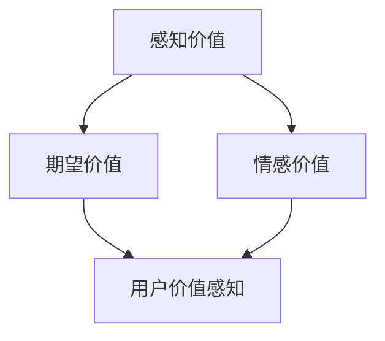
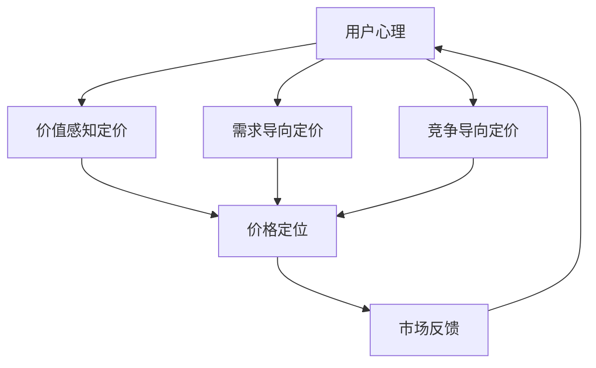
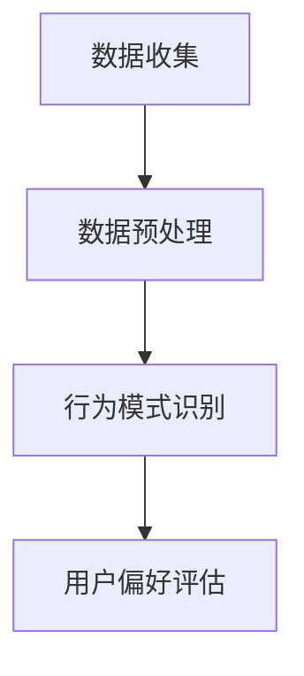
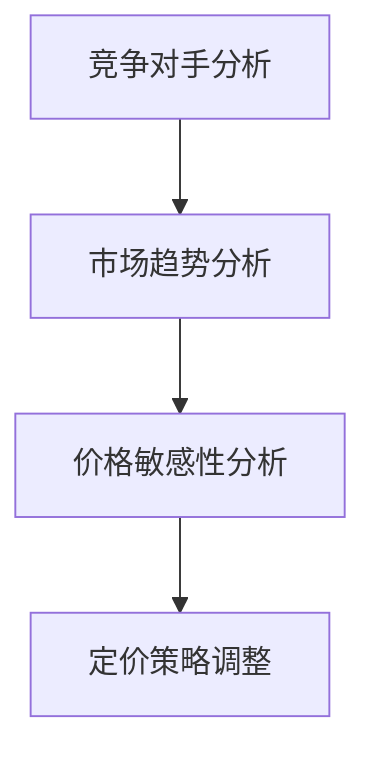
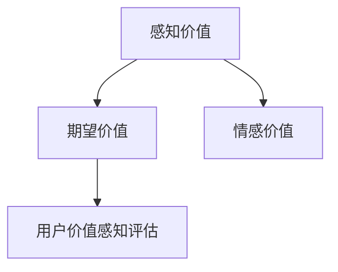
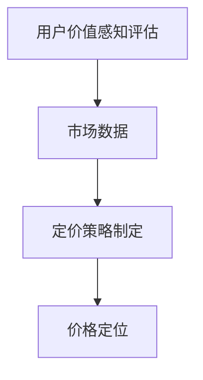

                 

关键词：定价策略、用户价值、感知、创业、心理学、IT领域

> 摘要：在竞争激烈的IT行业，创业者如何通过定价策略最大化用户价值感知，是成功的关键。本文将深入探讨定价心理学的核心原理，以及如何在实际操作中应用这些原理，以实现盈利与用户体验的双赢。

## 1. 背景介绍

在当今数字化时代，IT行业正以前所未有的速度发展，市场竞争异常激烈。创业者不仅需要具备出色的技术能力，还需深入了解市场动态和用户心理。尤其是在定价策略上，如何通过科学的方法，确保产品或服务的价值被用户充分感知，从而赢得市场份额，是每一个创业公司必须面对的挑战。

定价不仅仅是成本加成那么简单，它涉及到心理学的多方面，包括用户的感知、期望、情感等。一个恰当的定价策略不仅能够为公司带来利润，还能够提升用户的满意度，从而形成良好的口碑和品牌效应。

本文将从以下几个方面展开讨论：

1. **定价心理学的基本原理**：介绍影响用户价值感知的核心心理因素。
2. **核心算法与操作步骤**：详细解释如何通过量化模型和心理学原理来制定定价策略。
3. **数学模型与公式**：探讨定价策略中的关键数学模型及其推导过程。
4. **项目实践**：通过实际案例展示如何应用定价策略。
5. **实际应用场景**：分析不同行业如何适应市场变化调整定价策略。
6. **未来应用展望**：探讨定价心理学在未来的发展趋势和挑战。

## 2. 核心概念与联系

### 2.1 定价心理学原理

在讨论定价策略之前，我们需要理解用户价值感知的形成过程。用户的价值感知不仅仅基于产品的功能和质量，还受到以下因素的影响：

- **感知价值**：用户对产品或服务价值的感受。
- **期望价值**：用户对产品或服务预期的价值。
- **情感价值**：用户在使用产品或服务过程中的情感体验。

这三个因素相互作用，共同决定了用户的最终价值感知。以下是一个简化的Mermaid流程图，展示了这些因素之间的关系：



### 2.2 定价策略与用户心理

在理解了用户价值感知的基本原理后，我们需要将这一原理应用到定价策略中。以下是几个关键概念：

- **价值感知定价**：基于用户对产品或服务的感知价值来制定价格。
- **需求导向定价**：根据市场对产品或服务的需求来调整价格。
- **竞争导向定价**：考虑竞争对手的产品或服务价格来制定自己的价格。

这些定价策略都需要结合用户心理因素进行综合分析。以下是一个更详细的Mermaid流程图，展示了定价策略与用户心理之间的联系：



## 3. 核心算法原理 & 具体操作步骤

### 3.1 算法原理概述

在定价策略的制定中，核心算法通常是基于用户行为分析和市场数据分析的。以下是几个关键步骤：

1. **用户行为分析**：通过用户行为数据，分析用户对产品或服务的偏好和需求。
2. **市场数据分析**：收集竞争对手的价格策略和市场趋势数据。
3. **价值感知评估**：基于用户心理模型，评估产品或服务的价值感知。
4. **定价策略制定**：根据用户价值感知和市场数据，制定合适的定价策略。

### 3.2 算法步骤详解

#### 3.2.1 用户行为分析

用户行为分析通常包括以下几个步骤：

1. **数据收集**：收集用户在使用产品或服务过程中的行为数据，如点击次数、浏览时间、购买频率等。
2. **数据预处理**：清洗和整理数据，使其适合后续分析。
3. **行为模式识别**：通过机器学习算法，识别用户的行为模式。

以下是一个简化的Mermaid流程图，展示了用户行为分析的基本步骤：



#### 3.2.2 市场数据分析

市场数据分析主要关注以下几个方面：

1. **竞争对手分析**：收集竞争对手的产品或服务价格，分析其定价策略。
2. **市场趋势分析**：分析市场对产品或服务的需求趋势。
3. **价格敏感性分析**：通过历史数据，分析用户对价格变化的敏感性。

以下是一个简化的Mermaid流程图，展示了市场数据分析的基本步骤：



#### 3.2.3 价值感知评估

价值感知评估是通过用户心理模型来评估用户对产品或服务的价值感知。以下是一个简化的Mermaid流程图，展示了价值感知评估的基本步骤：



#### 3.2.4 定价策略制定

基于用户价值感知和市场数据，制定定价策略。以下是一个简化的Mermaid流程图，展示了定价策略制定的基本步骤：



## 4. 数学模型和公式 & 详细讲解 & 举例说明

### 4.1 数学模型构建

在定价策略中，常见的数学模型包括需求函数、价格弹性模型等。以下是几个关键数学模型的构建：

#### 需求函数

需求函数描述了价格和需求量之间的关系。一个简单的一次线性需求函数可以表示为：

$$
Q_d(p) = a - bp
$$

其中，$Q_d(p)$ 是需求量，$p$ 是价格，$a$ 和 $b$ 是参数。

#### 价格弹性模型

价格弹性模型描述了价格变化对需求量的影响。价格弹性（Price Elasticity）可以表示为：

$$
\epsilon_p = \frac{dQ_d(p)/dp}{Q_d(p)/p}
$$

当 $\epsilon_p > 1$ 时，表示需求对价格敏感；当 $\epsilon_p < 1$ 时，表示需求对价格不敏感。

### 4.2 公式推导过程

以下是价格弹性模型的推导过程：

$$
\epsilon_p = \frac{dQ_d(p)/dp}{Q_d(p)/p}
$$

将需求函数 $Q_d(p) = a - bp$ 代入上式：

$$
\epsilon_p = \frac{-b}{a - bp}/(a - bp)/p
$$

简化得：

$$
\epsilon_p = \frac{b}{a - bp}
$$

### 4.3 案例分析与讲解

假设一家初创公司开发了一款针对IT从业者的在线学习平台。根据市场调研和用户反馈，公司的需求函数可以表示为：

$$
Q_d(p) = 1000 - 10p
$$

其中，$p$ 是每用户每月的订阅价格。

#### 需求分析

首先，我们可以计算出在不同价格下的需求量：

- 当 $p = 10$ 时，$Q_d(10) = 900$
- 当 $p = 20$ 时，$Q_d(20) = 800$
- 当 $p = 30$ 时，$Q_d(30) = 700$

#### 价格弹性分析

接下来，我们计算价格弹性：

$$
\epsilon_p = \frac{b}{a - bp} = \frac{10}{1000 - 10p}
$$

- 当 $p = 10$ 时，$\epsilon_p = 1$，表示需求对价格敏感。
- 当 $p = 20$ 时，$\epsilon_p = 0.5$，表示需求对价格不敏感。

#### 定价策略

根据价格弹性的分析，我们可以制定不同的定价策略：

- 如果公司希望增加用户数量，可以降低价格，提高需求量。
- 如果公司希望提高收入，可以在用户对价格不太敏感的区间内提高价格。

## 5. 项目实践：代码实例和详细解释说明

### 5.1 开发环境搭建

在这个案例中，我们将使用Python语言进行定价策略的模拟和实现。以下是开发环境的基本配置：

- Python版本：3.8及以上
- 必需库：NumPy、Pandas、Matplotlib

您可以通过以下命令安装必需的库：

```bash
pip install numpy pandas matplotlib
```

### 5.2 源代码详细实现

以下是一个简单的Python脚本，用于模拟定价策略：

```python
import numpy as np
import pandas as pd
import matplotlib.pyplot as plt

# 需求函数
def demand_function(price):
    return 1000 - 10 * price

# 价格弹性函数
def price_elasticity(price):
    demand = demand_function(price)
    return 10 / (1000 - 10 * price)

# 模拟不同价格下的需求量
prices = np.linspace(0, 50, 100)
quantities = demand_function(prices)

# 绘制价格-需求量曲线
plt.plot(prices, quantities, label='Demand')
plt.xlabel('Price')
plt.ylabel('Quantity')
plt.title('Price-Demand Relationship')
plt.legend()
plt.show()

# 计算并绘制价格弹性
elasticities = price_elasticity(prices)
plt.plot(prices, elasticities, label='Price Elasticity')
plt.xlabel('Price')
plt.ylabel('Elasticity')
plt.title('Price Elasticity')
plt.legend()
plt.show()
```

### 5.3 代码解读与分析

- **需求函数**：`demand_function` 函数用于计算给定价格下的需求量。
- **价格弹性函数**：`price_elasticity` 函数用于计算给定价格下的价格弹性。
- **模拟不同价格下的需求量**：使用NumPy的`linspace`函数生成价格范围，并使用`demand_function` 计算对应的需求量。
- **绘制价格-需求量曲线**：使用Matplotlib的`plot`函数绘制价格-需求量曲线。
- **计算并绘制价格弹性**：计算每个价格下的价格弹性，并绘制价格-弹性曲线。

### 5.4 运行结果展示

运行上述脚本后，会生成两个图表：

1. **价格-需求量曲线**：展示了不同价格下的需求量。
2. **价格-弹性曲线**：展示了不同价格下的价格弹性。

通过这两个图表，我们可以直观地看到价格变化对需求量和价格弹性的影响，从而为定价策略提供数据支持。

## 6. 实际应用场景

### 6.1 电子商务平台

电子商务平台通过定价策略来吸引和保留用户。例如，一家在线书店可以根据用户的历史购买行为和需求预测来调整图书的价格。通过价格弹性分析，平台可以发现哪些书籍的价格调整能够带来更高的销量和利润。

### 6.2 SaaS服务

SaaS（Software as a Service）服务提供商通常会采用基于用户需求的定价策略。例如，一家云存储服务提供商可以根据用户的存储需求和使用频率来调整订阅价格。通过价格弹性分析，提供商可以找到最佳的定价点，以最大化收入。

### 6.3 教育培训

在线教育平台通常采用模块化定价策略，根据课程内容和用户需求来设置不同价格。通过用户行为分析和市场数据，平台可以优化课程定价，提高用户参与度和满意度。

## 7. 未来应用展望

### 7.1 大数据与人工智能

随着大数据和人工智能技术的发展，未来的定价策略将更加精准和自动化。机器学习算法可以分析海量用户数据和市场数据，提供实时的定价建议。

### 7.2 个性化定价

个性化定价将是未来的一个重要趋势。通过分析用户的个性化需求和行为，企业可以提供定制化的价格，从而提高用户满意度。

### 7.3 可持续发展

在可持续发展的背景下，企业的定价策略也需要考虑环境保护和社会责任。例如，采用绿色定价策略，鼓励用户选择环保产品。

## 8. 总结：未来发展趋势与挑战

### 8.1 研究成果总结

本文通过定价心理学的视角，探讨了如何通过科学的定价策略最大化用户价值感知。研究结果表明，综合考虑用户感知价值、期望价值和情感价值，并借助大数据和人工智能技术，可以制定出更加精准和有效的定价策略。

### 8.2 未来发展趋势

未来的定价策略将更加依赖大数据和人工智能技术，实现个性化定价和实时调整。同时，可持续发展将成为企业定价策略的一个重要考量因素。

### 8.3 面临的挑战

尽管定价心理学为创业公司提供了重要的指导，但实际应用中仍面临诸多挑战，如数据隐私、算法透明度和监管合规等。

### 8.4 研究展望

未来的研究可以进一步探讨如何将定价心理学与伦理和道德相结合，以及如何在不同文化和市场环境下应用定价策略。

## 9. 附录：常见问题与解答

### 9.1 定价心理学是什么？

定价心理学是研究用户如何感知和评估产品或服务价值的心理学分支。它涉及到用户的感知、期望和情感等因素。

### 9.2 价值感知定价如何应用？

价值感知定价是通过分析用户对产品或服务的感知价值来制定价格。这需要收集用户行为数据和市场数据，进行综合分析。

### 9.3 如何进行价格弹性分析？

价格弹性分析是通过计算价格弹性系数（$\epsilon_p$）来评估价格变化对需求量的影响。这需要了解需求函数和价格弹性模型。

### 9.4 定价策略中的常见误区是什么？

常见误区包括仅考虑成本定价、过度依赖竞争对手定价以及忽视用户感知价值。正确的定价策略应综合考虑用户心理和市场数据。

---

**作者：禅与计算机程序设计艺术 / Zen and the Art of Computer Programming**

